# LLM Architecture Research

Исследовательский проект по разработке, обучению и сравнительному анализу современных архитектур больших языковых моделей (LLM): **GPT, GPT-2, LLaMA, Mistral**. Прямая поддержка интеграции с HuggingFace (через модуль `hf-proxy`).


## 🏗️ Архитектура проекта

Проект организован как монорепозиторий с использованием **uv** workspace:

- **`llm`** — основная библиотека с реализацией архитектур LLM (**GPT, GPT-2, LLaMA, Mistral**)
- **`hf-proxy`** — экспериментальный адаптер для интеграции с HuggingFace (загрузка, токенизация, экспериментальные скрипты). Функционал может изменяться и не гарантирует полной совместимости с будущими версиями HuggingFace Transformers.
- **`experiments`** — скрипты обучения и генерации (включая HF и собственные модели)
- **`notebooks`** — исследовательские ноутбуки, анализ архитектур

## 📁 Структура проекта

```
llm-arch-research/
│
├── pyproject.toml        # корневой workspace конфиг
├── uv.lock
│
├── llm/                  # основная библиотека архитектур
│   ├── pyproject.toml
│   └── src/llm/
│       ├── core/         # базовые компоненты
│       │   ├── base_model.py
│       │   ├── cached_decoder.py    # Декодер с кэшированием
│       │   ├── decoder.py
│       │   ├── multi_head_attention.py
│       │   ├── head_attention.py
│       │   ├── feed_forward.py
│       │   ├── token_embeddings.py
│       │   ├── positional_embeddings.py
│       │   ├── rope.py              # Rotary Positional Embeddings
│       │   ├── rms_norm.py          # RMS Normalization
│       │   ├── swi_glu.py           # SwiGLU активация
│       │   ├── silu.py              # SiLU активация
│       │   └── gelu.py              # GELU активация
│       ├── models/       # Реализации моделей
│       │   ├── gpt/      # GPT и GPT-2 архитектуры
│       │   │   ├── gpt.py
│       │   │   ├── gpt2.py
│       │   │   └── __init__.py
│       │   ├── llama/    # LLaMA архитектура
│       │   │   ├── llama.py
│       │   │   └── __init__.py
│       │   └── mistral/  # Mistral архитектура
│       │       ├── mistral.py
│       │       └── __init__.py
│       ├── training/     # утилиты обучения
│       │   ├── dataset.py
│       │   ├── trainer.py
│       │   ├── optimizer.py
│       │   └── scheduler.py
│       ├── evaluation/   # оценка моделей
│       └── tokenizers/   # токенизаторы
│           ├── base_tokenizer.py
│           └── bpe_tokenizer.py
│
├── hf-proxy/             # адаптер HuggingFace
│   ├── pyproject.toml
│   └── src/hf_proxy/
│       ├── hf_config.py
│       ├── hf_adapter.py
│       ├── hf_tokenizer.py
│       └── hf_utils.py
│
├── experiments/          # скрипты обучения и экспериментов
│   ├── hf_integration/   # интеграция с HuggingFace
│   │   ├── train_with_hf_trainer.py
│   │   ├── generate_with_hf_tools.py
│   │   ├── simple_hf_training.py
│   │   └── test_hf_proxy.py
│   ├── llm_only/         # обучение без HF
│   │   ├── train_gpt_bpe.py
│   │   └── generate_gpt_bpe.py
│   └── shared/           # общие утилиты
│       ├── configs.py
│       └── data.py
│
├── checkpoints/          # сохраненные модели и токенизаторы
└── notebooks/            # исследовательские ноутбуки
```

## 🚀 Быстрый старт

**Пример запуска обучения и генерации для любых архитектур:**

```bash
python experiments/llm_only/run_llm_experiment.py --model mistral --action generate --config experiments/llm_only/configs/mistral_generate.json
```

**Использование собственных моделей с HuggingFace-интерфейсом:**
```python
from hf_proxy.hf_adapter import HFAdapter
hf_model = HFAdapter("mistralai/Mistral-7B-v0.1")
```

### Установка зависимостей

```bash
# Установка всех зависимостей workspace
uv sync

# Установка с dev-зависимостями
uv sync --extra dev
```

## ⚡ Работа с экспериментами (experiments/llm_only, experiments/hf_integration)

- В `experiments/llm_only`: универсальный скрипт для обучения и генерации LLM (включая LLaMA и Mistral) без HuggingFace — всё через собственную реализацию.
- В `experiments/hf_integration`: скрипты и примеры для генерации, обучения и тестирования моделей с помощью HuggingFace API (через hf-proxy). Позволяет использовать свои модели и токенизаторы как стандартные HF-объекты.

**Для моделей Mistral/Llama доступны оба сценария: прямая работа или через HuggingFace-прокси.**

*Конфиги и примеры см. в соответствующих папках.*


---

### Тестирование hf-proxy

```bash
# Базовое тестирование интеграции
uv run python experiments/hf_integration/test_hf_proxy.py

# Генерация через HF инструменты
uv run python experiments/hf_integration/generate_with_hf_tools.py
```

### Использование в коде

```python
from llm.models.gpt import GPT, GPT2
from llm.tokenizers import BPETokenizer
from hf_proxy import HFAdapter, HFTokenizerAdapter

# Создание GPT модели
config = {
    "vocab_size": 50257,
    "embed_dim": 256,
    "num_heads": 4,
    "num_layers": 4,
    "max_position_embeddings": 128,
    "dropout": 0.1
}
model = GPT(config)

# Создание GPT-2 модели (пример)
gpt2_config = {
    "vocab_size": 50257,
    "embed_dim": 768,
    "num_heads": 12,
    "num_layers": 12,
    "max_position_embeddings": 1024,
    "dropout": 0.1
}
gpt2_model = GPT2(gpt2_config)

# Генерация текста
generated = model.generate(
    input_ids, 
    max_new_tokens=50, 
    do_sample=True, 
    temperature=0.7
)

# Использование с HuggingFace через hf-proxy
hf_model = HFAdapter.from_llm_model(model)
hf_tokenizer = HFTokenizerAdapter(tokenizer)

# Генерация через HF интерфейс
generated = hf_model.generate(
    input_ids=inputs['input_ids'],
    max_new_tokens=50,
    do_sample=True,
    temperature=0.7
)
```

## 🛠️ Технологический стек

- **Python 3.10+** — язык программирования
- **uv** — современный менеджер пакетов и workspace
- **PyTorch 2.8+** — фреймворк глубокого обучения
- **Transformers** — интеграция с HuggingFace
- **Datasets** — работа с данными
- **TOML** — конфигурационные файлы

## 📦 Зависимости

### Корневой workspace
```toml
[project]
dependencies = ["tqdm>=4,<5"]

[project.optional-dependencies]
dev = [
    "pytest>=8.0.0",
    "black>=24.0.0", 
    "ruff>=0.3.0",
    "mypy>=1.8.0",
    "jupyter>=1.0.0",
]
test = [
    "pytest>=8.0.0",
    "pytest-cov>=4.1.0",
]
```

### Пакет llm
```toml
[project]
dependencies = [
    "torch>=2.3.0",
    "numpy>=1.24.0",
]
```

### Пакет hf-proxy
```toml
[project]
dependencies = [
    "torch>=2.3.0",
    "transformers>=4.44.0",
    "datasets>=2.20.0",
]
```

## 🎯 Реализованные возможности

### Архитектуры
- ✅ GPT, GPT-2: Полностью воспроизводимые реализации, токенные и позиционные эмбеддинги, causal multi-head attention, LayerNorm
- ✅ LLaMA: Rotary Positional Embeddings (RoPE), RMSNorm, SwiGLU, оптимизированная память
- ✅ Mistral: Sliding Window Attention (оконное внимание), Grouped Query Attention (GQA), совместимость с HF
- ✅ Gemma: Multi-Query Attention (MQA), GeGLU
- ✅ Mixtral: Mixture-of-Experts (MoE), Grouped Query Attention (GQA)
- ✅ Все архитектуры поддерживают обучение и генерацию текста

Пример блока декодера на примере GPT-1 (подробный разбор — в [notebooks/gpt.ipynb](notebooks/gpt.ipynb)):

```mermaid
flowchart LR
    Tokens(["Tokens"]) --> TokEmb["Token Emb"]:::blue
    Tokens --> PosEmb["Position Emb"]:::purple
    TokEmb --> Sum(("+"))
    PosEmb --> Sum
    Sum --> Attn["Masked Multi-Head<br/>Attention"]:::blue
    Attn --> A1(("+"))
    Sum -.->|residual| A1
    A1 --> N1["Norm"]:::gray
    N1 --> FFN["Feed Forward<br/>Network"]:::purple
    FFN --> A2(("+"))
    N1 -.->|residual| A2
    A2 --> N2["Norm"]:::gray
    N2 --> Dc2["Decoder"]:::green --> Dc3["Decoder"]:::green --> Dots(["⋯"]) --> Dc4["Decoder"]:::green --> Dc5["Decoder"]:::green --> Lin["Linear"]:::gray --> Soft["Softmax"]:::purple

    classDef blue fill:#dae8fc,stroke:#6c8ebf,color:#1a1a1a;
    classDef purple fill:#e1d5e7,stroke:#9673a6,color:#1a1a1a;
    classDef green fill:#d5e8d4,stroke:#82b366,color:#1a1a1a;
    classDef gray fill:#f5f5f5,stroke:#666666,color:#1a1a1a;
```



### Генерация текста
- ✅ Greedy, sampling (Top-k, Top-p), контроль температуры, efficient caching

### Обучение
- ✅ Языковое моделирование с кастомными и HF-токенизаторами
- ✅ AdamW, кастомные датасеты, сохранение чекпоинтов

### Интеграция с HuggingFace (hf-proxy)
- ✅ Экспорт/импорт моделей и токенизаторов в HF совместимый формат
- ✅ Генерация и обучение через HF Trainer, pipelines и т.д.
- ✅ Двусторонняя поддержка: собственные модели становятся HF-совместимыми и наоборот

## 🔬 Эксперименты с hf-proxy

### Успешно протестированные функции:

1. **Базовая интеграция** (`test_hf_proxy.py`)
   - ✅ Создание HF адаптера для токенизаторов
   - ✅ Создание HF адаптера для моделей
   - ✅ Токенизация и декодирование
   - ✅ Forward pass через адаптированную модель
   - ✅ Сохранение и загрузка моделей

2. **Упрощенное обучение** (`simple_hf_training.py`)
   - ✅ Обучение GPT модели с использованием hf-proxy
   - ✅ Ручной цикл обучения без сложных зависимостей
   - ✅ Сохранение результатов обучения

3. **Генерация через HF инструменты** (`generate_with_hf_tools.py`)
   - ✅ Загрузка моделей в HF формате
   - ✅ Генерация через стандартные HF интерфейсы
   - ✅ Сравнение стратегий генерации
   - ✅ Интерактивная генерация

### Решенные проблемы:

- ✅ Исправление метода `pad` в токенизаторе для обработки разных типов данных
- ✅ Корректная загрузка моделей с передачей конфигурации
- ✅ Совместимость с HF экосистемой

## 📊 Примеры работы

### Обучение модели
```bash
🚀 УПРОЩЕННОЕ ОБУЧЕНИЕ GPT С HF-PROXY
=========================================================
🔧 Подготовка данных...
📊 Данные: 10 train, 2 validation
🔧 Подготовка токенизатора...
✅ Токенизатор создан (vocab_size=473)
🔧 Подготовка модели...
✅ Модель создана
🎯 Обучение модели...
📊 Результаты обучения:
   Final train loss: 4.6802
   Final val loss: 5.1834
✅ Модель сохранена
```

### Генерация через HF интерфейсы
```bash
🧪 Тестирование HuggingFace pipeline...
🎯 Генерация текста через HF адаптер
🔤 Промпт: 'Искусственный'
🎯 Результат: 'Искусственный интеллект продолжает развиваться...'
```

## 🔧 Разработка

### Добавление зависимостей
```bash
# В корневой проект
uv add package-name

# В конкретный пакет
cd llm && uv add package-name

# Dev-зависимости
uv add --dev pytest black
```

### Запуск тестов
```bash
uv run pytest
```

### Форматирование кода
```bash
uv run black .
uv run ruff check .
```

## 🤝 Вклад в проект

1. Форкните репозиторий
2. Создайте feature ветку
3. Внесите изменения
4. Запустите тесты: `uv run pytest`
5. Отформатируйте код: `uv run black . && uv run ruff check .`
6. Создайте pull request

## 📄 Лицензия

MIT License

---

**Разработано с ❤️ для исследований в области LLM**

*Обновлено: Октябрь 2025*
