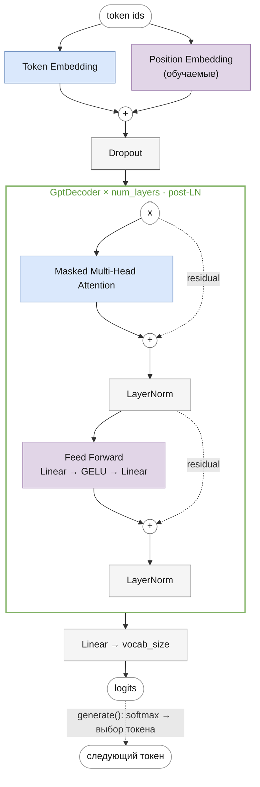

# LLM Architecture Research

Исследовательский проект: реализация «с нуля» на PyTorch, обучение и сравнительный разбор архитектур больших языковых моделей — **GPT, GPT-2, LLaMA, Mistral, Mixtral, Gemma**. Код написан в учебных целях: каждый блок небольшой, самодостаточный и подробно задокументирован.

Разбор каждой архитектуры (компоненты, конфиг, отличия от предыдущей модели) — в [docs/](docs/README.md).

## 🏗️ Архитектура проекта

Монорепозиторий на **uv** workspace:

- **`llm`** — основная библиотека: блоки трансформера, 6 моделей, BPE-токенизатор, датасеты, простой Trainer. Зависит только от PyTorch и NumPy.
- **`hf-proxy`** — экспериментальный адаптер к HuggingFace Transformers. **Поддерживает только модель `GPT`** (см. [hf-proxy/README.md](hf-proxy/README.md)).
- **`experiments`** — скрипты обучения и генерации: без HF (`llm_only`) и через hf-proxy (`hf_integration`).
- **`notebooks`** — ноутбуки с пошаговым разбором каждой архитектуры и BPE.
- **`docs`** — документация по архитектурам.

## 📁 Структура проекта

```
llm-arch-research/
├── pyproject.toml              # корневой workspace-конфиг
├── uv.lock
├── docs/                       # разбор архитектур (по файлу на модель)
│
├── llm/                        # основная библиотека
│   ├── src/llm/
│   │   ├── core/               # строительные блоки
│   │   │   ├── base_model.py               # абстрактный базовый класс
│   │   │   ├── token_embeddings.py         # эмбеддинги токенов
│   │   │   ├── positional_embeddings.py    # обучаемые абсолютные позиции (GPT)
│   │   │   ├── rope.py                     # Rotary Positional Embeddings
│   │   │   ├── multi_head_attention.py     # MHA (+ RoPE, KV-кэш)
│   │   │   ├── multi_query_attention.py    # MQA (Gemma)
│   │   │   ├── group_query_attention.py    # GQA + sliding window (Mistral, Mixtral)
│   │   │   ├── feed_forward.py             # FFN с GELU
│   │   │   ├── swi_glu.py / geglu.py       # gated FFN
│   │   │   ├── gelu.py / silu.py           # активации
│   │   │   ├── rms_norm.py                 # RMSNorm
│   │   │   ├── moe.py                      # Mixture-of-Experts
│   │   │   ├── cached_decoder.py           # параметризуемый pre-LN декодер (LLaMA)
│   │   │   └── {gpt,gpt2,mistral,mixtral,gemma}_decoder.py
│   │   ├── models/             # gpt/ (GPT, GPT2), llama/, mistral/, mixtral/, gemma/
│   │   ├── tokenizers/         # BaseTokenizer, BPETokenizer, SimpleBPETokenizer
│   │   ├── datasets/           # TextDataset, StreamingTextDataset, TextWithSpecialTokensDataset
│   │   ├── training/           # Trainer, get_optimizer, линейный warmup-шедулер
│   │   └── evaluation/         # заготовка, пока пустая
│   └── tests/                  # pytest: core/, models/, tokenizers/, datasets/, training/
│
├── hf-proxy/src/hf_proxy/      # HFAdapter, HFGPTAdapter, HFTokenizerAdapter, HFUtils
│
├── experiments/
│   ├── llm_only/
│   │   ├── run_llm_experiment.py   # единый скрипт train/generate для всех 6 моделей
│   │   └── configs/                # <model>_train.json, <model>_generate.json
│   ├── hf_integration/             # обучение и генерация через hf-proxy
│   └── shared/                     # общие утилиты и встроенный учебный корпус
│
└── notebooks/                  # gpt, gpt2, llama, mistral, mixstral, gemma, bpe
```

Каталог `checkpoints/` создаётся скриптами при запуске и в git не хранится.

## 🚀 Быстрый старт

```bash
# Установка зависимостей workspace
uv sync

# С dev-зависимостями (pytest, ruff, black, mypy, jupyter)
uv sync --extra dev
```

Обучение и генерация любой из 6 моделей (запускать из корня репозитория — пути в конфигах относительные):

```bash
uv run python experiments/llm_only/run_llm_experiment.py --model mistral --action train --config experiments/llm_only/configs/mistral_train.json
uv run python experiments/llm_only/run_llm_experiment.py --model mistral --action generate --config experiments/llm_only/configs/mistral_generate.json
```

`--model`: `gpt`, `gpt2`, `llama`, `mistral`, `mixtral`, `gemma`. Подробнее — в [experiments/README.md](experiments/README.md).

## 🧩 Использование в коде

```python
import torch
from llm.models.gpt import GPT
from llm.models.mistral import Mistral

gpt = GPT({
    "vocab_size": 1000,
    "embed_dim": 256,
    "num_heads": 4,
    "num_layers": 4,
    "max_position_embeddings": 128,
    "dropout": 0.1,
})

mistral = Mistral({
    "vocab_size": 1000,
    "embed_dim": 256,
    "num_q_heads": 4,
    "num_kv_heads": 2,
    "num_layers": 4,
    "max_position_embeddings": 512,
    "window_size": 16,
    "dropout": 0.1,
})

input_ids = torch.randint(0, 1000, (1, 8))

# forward возвращает кортеж (logits, cache); cache = None при use_cache=False
logits, _ = mistral(input_ids, use_cache=False)

# Генерация: greedy (do_sample=False) или sampling с temperature / top_k / top_p
generated = mistral.generate(input_ids, max_new_tokens=20, do_sample=True, temperature=0.8, top_k=50)
```

Ключи конфига различаются между моделями — см. раздел «Конфигурация» в документе нужной архитектуры в [docs/](docs/README.md).

Интеграция с HuggingFace (только `GPT`):

```python
from hf_proxy import HFAdapter

hf_model = HFAdapter.from_llm_model(gpt)   # HFGPTAdapter — наследник transformers.PreTrainedModel
```

## 🎯 Реализованные возможности

| Архитектура | Ключевые механизмы |
|---|---|
| GPT | обучаемые позиционные эмбеддинги, MHA, post-LN, GELU-FFN |
| GPT-2 | то же + pre-LN и финальная нормализация |
| LLaMA | RoPE, RMSNorm, SwiGLU, обычный MHA (без GQA) |
| Mistral | + Grouped Query Attention, Sliding Window Attention |
| Mixtral | Mistral + Mixture-of-Experts вместо плотного FFN |
| Gemma | RoPE, RMSNorm, Multi-Query Attention, GeGLU |

Пример блока декодера на примере GPT-1 (подробный разбор — в [notebooks/gpt.ipynb](notebooks/gpt.ipynb)):


```mermaid
%%{init: {"flowchart": {"rankSpacing": 28, "nodeSpacing": 28}}}%%
flowchart TB
    Ids(["token ids"]):::io --> TokEmb["Token Embedding"]:::blue
    Ids --> PosEmb["Position Embedding<br/>(обучаемые)"]:::purple
    TokEmb --> Sum(("+")):::add
    PosEmb --> Sum
    Sum --> Drop["Dropout"]:::gray
    subgraph Dec["GptDecoder × num_layers · post-LN"]
        direction TB
        X(["x"]):::io --> Attn["Masked Multi-Head Attention"]:::blue
        Attn --> A1(("+")):::add
        X -. residual .-> A1
        A1 --> N1["LayerNorm"]:::gray
        N1 --> FFN["Feed Forward<br/>Linear → GELU → Linear"]:::purple
        FFN --> A2(("+")):::add
        N1 -. residual .-> A2
        A2 --> N2["LayerNorm"]:::gray
    end
    Drop --> Dec
    Dec --> Lin
    Lin["Linear → vocab_size"]:::gray --> Out(["logits"]):::io
    Out -. "generate(): softmax → выбор токена" .-> Next(["следующий токен"]):::io
    style Dec fill:transparent,stroke:#82b366,stroke-width:2px,color:#5b9a3c

    classDef io fill:#ffffff,stroke:#999999,color:#1a1a1a;
    classDef add fill:#ffffff,stroke:#666666,color:#1a1a1a;
    classDef blue fill:#dae8fc,stroke:#6c8ebf,color:#1a1a1a;
    classDef blueHl fill:#dae8fc,stroke:#2f5f9e,stroke-width:3px,color:#1a1a1a;
    classDef purple fill:#e1d5e7,stroke:#9673a6,color:#1a1a1a;
    classDef purpleHl fill:#e1d5e7,stroke:#6a3d85,stroke-width:3px,color:#1a1a1a;
    classDef gray fill:#f5f5f5,stroke:#666666,color:#1a1a1a;
    classDef grayHl fill:#f5f5f5,stroke:#333333,stroke-width:3px,color:#1a1a1a;
    classDef gold fill:#fff2cc,stroke:#d6b656,color:#1a1a1a;
    classDef rope fill:#d5f0ec,stroke:#3a9e8f,color:#1a1a1a;
    classDef ropeHl fill:#d5f0ec,stroke:#1f6f63,stroke-width:3px,color:#1a1a1a;
    classDef dim fill:#f5f5f5,stroke:#bbbbbb,color:#999999,stroke-dasharray:4 3;
```

**Генерация:** greedy, sampling с температурой, top-k, top-p, KV-кэш (в Mistral/Mixtral — со скользящим окном, rolling buffer).

**Обучение:** собственный BPE-токенизатор, `Trainer` (AdamW, линейный warmup, gradient clipping). `Trainer` чекпоинты не сохраняет: модель сохраняется в один файл с конфигом методом `model.save(path)` и загружается `Model.load(path)` (скрипт `run_llm_experiment.py` пока хранит веса и конфиг отдельными файлами).

**HuggingFace:** модель `GPT` оборачивается в `PreTrainedModel`, собственный токенизатор — в HF-совместимый интерфейс; сохранение/загрузка в HF-формате.

## 🔬 Эксперименты с hf-proxy

### Успешно протестированные функции:

1. **Базовая интеграция** (`test_hf_proxy.py`)
   - ✅ Создание HF адаптера для токенизаторов
   - ✅ Создание HF адаптера для моделей
   - ✅ Токенизация и декодирование
   - ✅ Forward pass через адаптированную модель
   - ✅ Сохранение и загрузка моделей

2. **Упрощенное обучение** (`simple_hf_training.py`)
   - ✅ Обучение GPT модели с использованием hf-proxy
   - ✅ Ручной цикл обучения без сложных зависимостей
   - ✅ Сохранение результатов обучения

3. **Генерация через HF инструменты** (`generate_with_hf_tools.py`)
   - ✅ Загрузка моделей в HF формате
   - ✅ Генерация через стандартные HF интерфейсы
   - ✅ Сравнение стратегий генерации
   - ✅ Интерактивная генерация

### Решенные проблемы:

- ✅ Исправление метода `pad` в токенизаторе для обработки разных типов данных
- ✅ Корректная загрузка моделей с передачей конфигурации
- ✅ Совместимость с HF экосистемой

## 📊 Примеры работы

### Обучение модели
```bash
🚀 УПРОЩЕННОЕ ОБУЧЕНИЕ GPT С HF-PROXY
=========================================================
🔧 Подготовка данных...
📊 Данные: 10 train, 2 validation
🔧 Подготовка токенизатора...
✅ Токенизатор создан (vocab_size=473)
🔧 Подготовка модели...
✅ Модель создана
🎯 Обучение модели...
📊 Результаты обучения:
   Final train loss: 4.6802
   Final val loss: 5.1834
✅ Модель сохранена
```

### Генерация через HF интерфейсы
```bash
🧪 Тестирование HuggingFace pipeline...
🎯 Генерация текста через HF адаптер
🔤 Промпт: 'Искусственный'
🎯 Результат: 'Искусственный интеллект продолжает развиваться...'
```

## ⚠️ Известные ограничения

Проект учебный; перед использованием для чего-то серьёзного учтите:

- **`attention_mask`: только правый паддинг.** Левый паддинг и генерация батчем промптов разной длины не поддерживаются — модели бросают `NotImplementedError` (см. [docs/README.md](docs/README.md#маски)).
- **hf-proxy поддерживает только `GPT`.**
- Модуль `llm.evaluation` пока пустой.

Подробности по каждой архитектуре — в [docs/README.md](docs/README.md#известные-ограничения).

## 💥 Несовместимые изменения

Изменения, после которых старый код, конфиги или чекпоинты могут вести себя иначе. Форма весов и состав слоёв ни в одной модели не менялись: чекпоинты, сохранённые до этих изменений, загружаются.

### Результат модели

- **GPT-1 и GPT-2: GELU по умолчанию — tanh-аппроксимация** ([#11](https://github.com/pese-git/llm-arch-research/pull/11)), как в оригинальном коде OpenAI. Старые чекпоинты загружаются, но логиты отличаются примерно на 1e-4. Точный GELU для GPT-1 — `"activation": "gelu"` в конфиге. Значение `"activation": "gelu_exact"` удалено (`ValueError`), вместо него — `"gelu_tanh"`.
- **Top-p** ([#31](https://github.com/pese-git/llm-arch-research/pull/31)) теперь включает в ядро токен, на котором сумма вероятностей переходит порог (как в HuggingFace). При тех же весах и seed выборка с `top_p` может отличаться; greedy, температура и top-k не изменились.

- **GPT-1 и GPT-2: инициализация весов из статей** ([#41](https://github.com/pese-git/llm-arch-research/pull/41)) — N(0, 0.02), у GPT-2 ещё и масштабирование residual-проекций. Меняет только обучение с нуля: у новой модели другие начальные веса, чекпоинты и их выход не затрагиваются. Стандартное отклонение — ключ `initializer_range`.

### Чекпоинты и конфиги

- **Маски attention и таблицы RoPE не сохраняются в `state_dict`** ([#32](https://github.com/pese-git/llm-arch-research/pull/32)). Старые чекпоинты новым кодом загружаются, в том числе со `strict=True`. Обратное не работает: чекпоинт нового формата старый код со `strict=True` не загрузит (нет ключей `_tril_mask`, `cos_matrix`, `sin_matrix`); со `strict=False` загрузится, недостающие буферы старый код построит сам.
- **`head_size` читается из конфига** ([#33](https://github.com/pese-git/llm-arch-research/pull/33)). Раньше ключ игнорировался и размер головы всегда был `embed_dim // <число голов>`. Если в конфиге `head_size` с этим не совпадает, модель соберётся с другими размерами и старый чекпоинт не подойдёт — уберите ключ или исправьте значение.
- **Неверный конфиг — `ValueError` в конструкторе** ([#33](https://github.com/pese-git/llm-arch-research/pull/33)): `embed_dim`, не делящийся на число голов (без явного `head_size`); `num_q_heads`, не делящееся на `num_kv_heads`; нечётный `head_size` в моделях с RoPE (раньше `AssertionError`); `top_k_experts` вне `1 … num_experts`. Раньше такие конфиги принимались и работали неверно или падали в `forward`.

### API

- **`forward` по умолчанию не возвращает кэш** ([#31](https://github.com/pese-git/llm-arch-research/pull/31)): `model(x)` → `(logits, None)`. Кэш — `model(x, use_cache=True)`.
- **`generate` не принимает лишних аргументов** ([#31](https://github.com/pese-git/llm-arch-research/pull/31)): неизвестный именованный аргумент (например, опечатка `max_lenght`) — `TypeError`, а не молчаливое игнорирование. Появились `eos_token_id` и `pad_token_id`.
- **`attention_mask`** ([#29](https://github.com/pese-git/llm-arch-research/pull/29)): раньше игнорировалась. Правый паддинг в `forward` работает; левый паддинг и любые нули в `generate` — `NotImplementedError` (см. [docs/README.md](docs/README.md#маски)).
- **Длина с учётом кэша** ([#29](https://github.com/pese-git/llm-arch-research/pull/29)): `forward` с кэшем, у которого кэш + новые токены длиннее `max_position_embeddings`, — `ValueError`. `generate` в этом случае продолжает по последним `max_position_embeddings` токенам.
- **Параметр `mask` удалён** из `forward` модулей attention (`MultiHeadAttention`, `GroupedQueryAttention`, `MultiQueryAttention`) и декодеров, параметр `rope` — из `Gpt2Decoder` ([#35](https://github.com/pese-git/llm-arch-research/pull/35)). Они принимались и не использовались; передача теперь — `TypeError`.

## 🛠️ Технологический стек

- **Python 3.10+**, **uv** (workspace)
- **PyTorch** (в корневом проекте закреплён `torch==2.8.0`, библиотека `llm` требует `torch>=2.3.0`)
- **Transformers**, **Datasets** — только для `hf-proxy`

## 🔧 Разработка

```bash
# Тесты библиотеки llm
cd llm && uv run pytest

# Линтинг и форматирование
uv run ruff check .
uv run black .

# Добавление зависимости в корневой проект или в конкретный пакет
uv add package-name
cd llm && uv add package-name
```

## 🤝 Вклад в проект

1. Создайте feature-ветку
2. Внесите изменения и добавьте тесты
3. Убедитесь, что `uv run pytest` в каталоге `llm/` проходит
4. Создайте pull request

## 📄 Лицензия

MIT License
