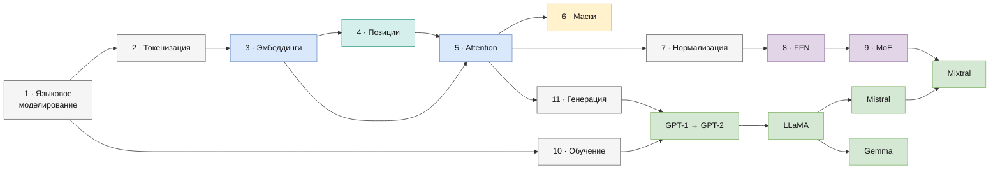

# Архитектуры больших языковых моделей: учебное пособие

Это пособие объясняет, как устроены современные большие языковые модели (LLM), на примере шести архитектур, реализованных «с нуля» на PyTorch в библиотеке [`llm/`](../llm/src/llm): **GPT-1, GPT-2, LLaMA, Mistral, Mixtral и Gemma**. Каждый механизм разбирается на трёх уровнях:

1. **Идея и научное обоснование.** Какую задачу решает механизм, откуда он взялся, со ссылкой на статью.
2. **Математика.** Формулы с расшифровкой каждого символа и формы тензора, пошаговые выводы и небольшие числовые примеры, которые можно проверить на бумаге.
3. **Код.** Какой класс и какая строка библиотеки реализуют формулу, чем реализация отличается от оригинальной статьи и как это проверено.

## Для кого

Для студентов, инженеров и технических специалистов, которые знают Python и математику первых курсов: векторы и матрицы, производную, вероятность. Опыт в глубоком обучении не требуется — всё нужное вводится по ходу. Если какая-то запись непонятна, загляните в [Обозначения](notation.md) и [Глоссарий](glossary.md).

## Как читать

- **Последовательно.** Часть I строит модель по частям: от задачи и токенов до обучения и генерации. Часть II собирает из этих частей конкретные архитектуры в историческом порядке: каждая глава описывает, что изменилось по сравнению с предыдущей моделью.
- **По архитектурам.** Можно начать с нужной главы части II: там кратко напоминаются формулы и даются ссылки на подробные выводы в части I.
- **С кодом.** Каждой архитектуре соответствует ноутбук в [`notebooks/`](../notebooks) с пошаговым разбором, а скрипт [`experiments/llm_only/run_llm_experiment.py`](../experiments/README.md) обучает и запускает любую из шести моделей.

В конце каждой главы есть «Итоги», «Вопросы и упражнения» (к расчётным заданиям приложены ответы под спойлером) и список литературы.

## Оглавление

**Справочник**

- [Обозначения и математический минимум](notation.md) — размерности, линейный слой, softmax, вероятность, градиент
- [Глоссарий](glossary.md) — термины от A до Я

**Часть I. Основы**

| № | Глава | О чём |
|---|---|---|
| 1 | [Языковое моделирование](language-modeling.md) | вероятность текста, предсказание следующего токена, cross-entropy, перплексия, схема decoder-only трансформера |
| 2 | [Токенизация](tokenization.md) | подслова, алгоритм BPE, претокенизация, специальные токены |
| 3 | [Эмбеддинги и выходная проекция](embeddings.md) | таблица эмбеддингов, logits, weight tying, масштаб √d |
| 4 | [Позиционное кодирование](positional-encoding.md) | обучаемые и синусоидальные позиции, RoPE с полным выводом, база частот |
| 5 | [Механизм внимания](attention.md) | scaled dot-product, multi-head, MHA/GQA/MQA, скользящее окно, KV-кэш |
| 6 | [Маски](masks.md) | causal-маска, окно, `attention_mask` и паддинг |
| 7 | [Нормализация и residual-связи](normalization.md) | LayerNorm, RMSNorm, post-LN и pre-LN |
| 8 | [Feed-forward сеть и активации](feed-forward.md) | FFN, GELU, SiLU, SwiGLU, GeGLU, размер скрытого слоя |
| 9 | [Mixture-of-Experts](mixture-of-experts.md) | роутер, top-k, разреженность, load-balancing loss |
| 10 | [Обучение](training.md) | градиент cross-entropy, AdamW, warmup, clipping, инициализация, точность вычислений |
| 11 | [Генерация текста](generation.md) | greedy, температура, top-k, top-p, KV-кэш при генерации |

**Часть II. Архитектуры**

| № | Глава | Год / источник | Что нового |
|---|---|---|---|
| 12 | [GPT-1](gpt.md) | OpenAI, 2018 | decoder-only трансформер, обучаемые позиции, стандартный MHA, **post-LN** |
| 13 | [GPT-2](gpt2.md) | OpenAI, 2019 | **pre-LN**, финальная нормализация, масштабированная инициализация |
| 14 | [LLaMA](llama.md) | Meta, 2023 | **RoPE, RMSNorm, SwiGLU**, без bias; обычный MHA |
| 15 | [Mistral](mistral.md) | Mistral AI, 2023 | **Grouped Query Attention, скользящее окно** |
| 16 | [Mixtral](mixtral.md) | Mistral AI, 2024 | **Mixture-of-Experts** вместо плотного FFN |
| 17 | [Gemma](gemma.md) | Google DeepMind, 2024 | **Multi-Query Attention** (2B), **GeGLU**, масштаб эмбеддингов, словарь 256k |

**Приложение**

- [Бэклог](backlog.md) — журнал найденных в коде расхождений со статьями и их исправлений: как воспроизвести, как исправлено, чем проверено. Полезен как сборник разобранных «подводных камней».

## Карта глав

Стрелка означает «опирается на».

## Архитектуры в одной таблице

| | GPT-1 | GPT-2 | LLaMA | Mistral | Mixtral | Gemma |
|---|---|---|---|---|---|---|
| Позиции | обучаемые | обучаемые | RoPE | RoPE | RoPE | RoPE |
| Нормализация | LayerNorm, post-LN | LayerNorm, pre-LN | RMSNorm, pre-LN | RMSNorm, pre-LN | RMSNorm, pre-LN | RMSNorm, pre-LN |
| Attention | MHA | MHA | MHA | GQA + окно | GQA | MQA (2B) / MHA (7B) |
| FFN | GELU | GELU | SwiGLU | SwiGLU | MoE из SwiGLU | GeGLU |
| Weight tying | да | да | нет | нет | нет | да |
| Класс в `llm` | `GPT` | `GPT2` | `Llama` | `Mistral` | `Mixtral` | `Gemma` |

Таблица описывает оригинальные модели. В библиотеке многие особенности включаются ключами конфига (`tie_word_embeddings`, `bias`, `intermediate_size`, `window_size`, `num_kv_heads` и др.), а по умолчанию сохранена прежняя структура, чтобы загружались старые чекпоинты; подробности — в разделах «Отличия от оригинала» глав части II.

Цепочка развития: GPT-1 → GPT-2 → LLaMA → Mistral → Mixtral. Gemma — параллельная ветка на той же основе (RoPE + RMSNorm + gated FFN).

## Известные ограничения

- **Mistral, Mixtral** — окно sliding window шириной `window_size + 1` позиций (как в тексте статьи и prefill эталонного кода), а в HuggingFace — `window_size`; при загрузке весов HF — `window_size = sliding_window − 1`, см. [mistral.md](mistral.md#ширина-окна-w--1).

Полный список технического долга с приоритетами и способами исправления — в [backlog.md](backlog.md).

## Литература

Все основные работы, на которые ссылается пособие. Отдельные главы ссылаются и на другие статьи — они перечислены в конце каждой главы.

### Архитектуры моделей

- Radford, Narasimhan, Salimans, Sutskever. *Improving Language Understanding by Generative Pre-Training*. OpenAI, 2018. [PDF](https://cdn.openai.com/research-covers/language-unsupervised/language_understanding_paper.pdf) (на arXiv не публиковалась)
- Radford, Wu, Child, Luan, Amodei, Sutskever. *Language Models are Unsupervised Multitask Learners*. OpenAI, 2019. [PDF](https://cdn.openai.com/better-language-models/language_models_are_unsupervised_multitask_learners.pdf) (на arXiv не публиковалась)
- Touvron et al. *LLaMA: Open and Efficient Foundation Language Models*. 2023. [arXiv:2302.13971](https://arxiv.org/abs/2302.13971)
- Touvron et al. *Llama 2: Open Foundation and Fine-Tuned Chat Models*. 2023. [arXiv:2307.09288](https://arxiv.org/abs/2307.09288) — GQA в линейке LLaMA появляется здесь (модели 34B и 70B)
- Jiang et al. *Mistral 7B*. 2023. [arXiv:2310.06825](https://arxiv.org/abs/2310.06825)
- Jiang et al. *Mixtral of Experts*. 2024. [arXiv:2401.04088](https://arxiv.org/abs/2401.04088)
- Gemma Team. *Gemma: Open Models Based on Gemini Research and Technology*. 2024. [arXiv:2403.08295](https://arxiv.org/abs/2403.08295)

### Основа: трансформер

- Vaswani et al. *Attention Is All You Need*. 2017. [arXiv:1706.03762](https://arxiv.org/abs/1706.03762)
- Liu et al. *Generating Wikipedia by Summarizing Long Sequences*. 2018. [arXiv:1801.10198](https://arxiv.org/abs/1801.10198) — decoder-only трансформер, на который опирается GPT-1

### Позиционное кодирование

- Su et al. *RoFormer: Enhanced Transformer with Rotary Position Embedding*. 2021. [arXiv:2104.09864](https://arxiv.org/abs/2104.09864)

### Нормализация

- Ba, Kiros, Hinton. *Layer Normalization*. 2016. [arXiv:1607.06450](https://arxiv.org/abs/1607.06450)
- Zhang, Sennrich. *Root Mean Square Layer Normalization*. 2019. [arXiv:1910.07467](https://arxiv.org/abs/1910.07467)
- Xiong et al. *On Layer Normalization in the Transformer Architecture*. 2020. [arXiv:2002.04745](https://arxiv.org/abs/2002.04745) — почему pre-LN обучается стабильнее post-LN

### Внимание

- Shazeer. *Fast Transformer Decoding: One Write-Head is All You Need*. 2019. [arXiv:1911.02150](https://arxiv.org/abs/1911.02150) — Multi-Query Attention
- Ainslie et al. *GQA: Training Generalized Multi-Query Transformer Models from Multi-Head Checkpoints*. 2023. [arXiv:2305.13245](https://arxiv.org/abs/2305.13245)
- Beltagy, Peters, Cohan. *Longformer: The Long-Document Transformer*. 2020. [arXiv:2004.05150](https://arxiv.org/abs/2004.05150) — sliding window attention

### Feed-forward и активации

- Hendrycks, Gimpel. *Gaussian Error Linear Units (GELUs)*. 2016. [arXiv:1606.08415](https://arxiv.org/abs/1606.08415)
- Shazeer. *GLU Variants Improve Transformer*. 2020. [arXiv:2002.05202](https://arxiv.org/abs/2002.05202) — SwiGLU и GeGLU

### Mixture-of-Experts

- Shazeer et al. *Outrageously Large Neural Networks: The Sparsely-Gated Mixture-of-Experts Layer*. 2017. [arXiv:1701.06538](https://arxiv.org/abs/1701.06538)
- Fedus, Zoph, Shazeer. *Switch Transformers: Scaling to Trillion Parameter Models with Simple and Efficient Sparsity*. 2021. [arXiv:2101.03961](https://arxiv.org/abs/2101.03961) — load-balancing loss для роутера

### Обучение и генерация

- Loshchilov, Hutter. *Decoupled Weight Decay Regularization*. 2019. [arXiv:1711.05101](https://arxiv.org/abs/1711.05101) — AdamW
- Holtzman et al. *The Curious Case of Neural Text Degeneration*. 2020. [arXiv:1904.09751](https://arxiv.org/abs/1904.09751) — nucleus (top-p) sampling

### Токенизация

- Sennrich, Haddow, Birch. *Neural Machine Translation of Rare Words with Subword Units*. 2016. [arXiv:1508.07909](https://arxiv.org/abs/1508.07909) — BPE-токенизация

## Соглашения о диаграммах и формулах

**Формулы** записаны в LaTeX и рендерятся GitHub: выключные — блоками `math`, строчные — в виде $`\ldots`$. Все обозначения собраны в [notation.md](notation.md).

**Диаграммы** — на Mermaid (рендерятся нативно на GitHub). Схема блока каждой модели устроена одинаково:

- сверху вниз: `token ids` → эмбеддинги → стек декодеров → финальная нормализация → `Linear` → `logits`;
- зелёная рамка — один блок декодера, повторяется `num_layers` раз; внутри показан путь одного блока, пунктир — residual-связи;
- **жирная обводка** — то, что изменилось по сравнению с предыдущей моделью в линейке;
- пунктирная стрелка от `logits` — шаг генерации (`softmax` и выбор токена выполняются в `generate()`, а не в `forward`).

Цвета: синий — эмбеддинги токенов и attention, фиолетовый — обучаемые позиционные эмбеддинги (GPT) и FFN, бирюзовый — RoPE, жёлтый — маски, серый — нормализация, линейные слои и dropout.

RoPE нарисован сбоку от декодера с пунктирной стрелкой в attention: он не прибавляется к основному потоку, как позиционные эмбеддинги GPT, а поворачивает Q и K внутри attention каждого слоя. Подробно — в [positional-encoding.md](positional-encoding.md).
