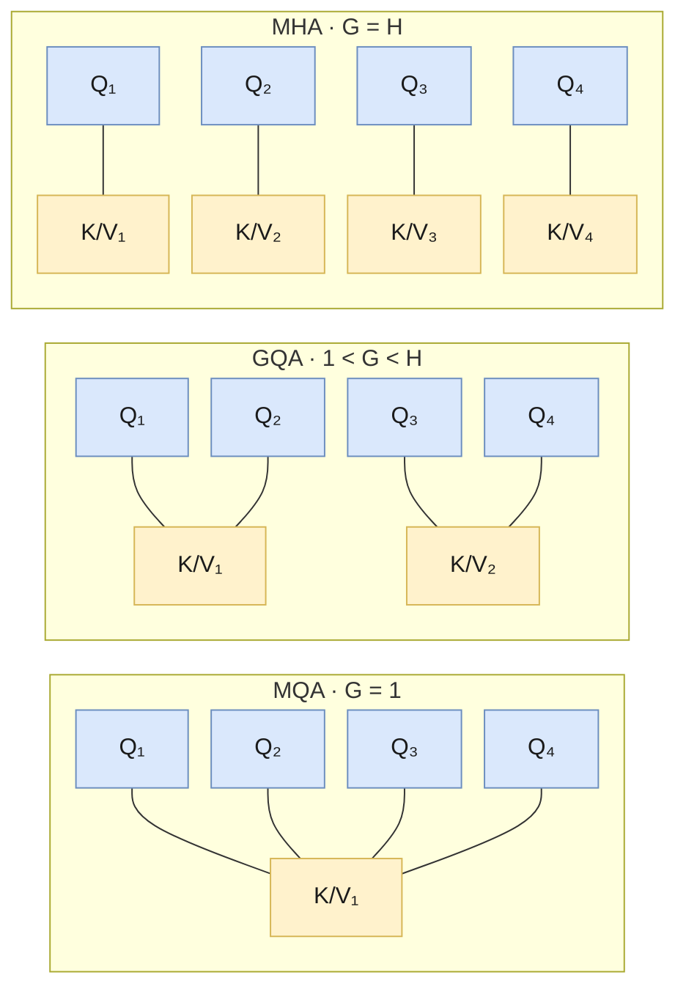

# Attention и его виды

Все шесть моделей репозитория используют одно и то же causal self-attention. Отличаются они тремя вещами, которые можно менять независимо друг от друга:

1. **сколько голов K/V** приходится на головы Q: MHA, GQA или MQA;
2. **какие позиции видит токен**: всё прошлое или только скользящее окно;
3. **как в attention попадает позиция**: через слагаемое к эмбеддингам (GPT) или поворотом Q и K (RoPE).

На этой странице — общая схема, виды attention и то, как они реализованы в [`llm/core`](../llm/src/llm/core). Подробные схемы одной головы и multi-head — в [gpt.md](gpt.md#устройство-компонентов), маски — в [README](README.md#маски).

## Scaled dot-product attention

Для каждой позиции `i` вычисляются запрос `q_i`, ключ `k_i` и значение `v_i` — три линейные проекции входа. Выход позиции `i` — взвешенная сумма значений:

```
scores[i, j] = q_i · k_j / √head_size
weights[i]   = softmax(scores[i] + mask[i])    # запрещённые j → −∞, их вес 0
out_i        = Σ_j weights[i, j] · v_j
```

Деление на `√head_size` держит дисперсию `q · k` около 1 при любой размерности головы: без него при больших `head_size` softmax становится почти one-hot и градиенты затухают ([Vaswani et al., 2017](https://arxiv.org/abs/1706.03762), разд. 3.2.1).

**Causal-маска** запрещает смотреть в будущее (`j > i`): модель обучается предсказывать следующий токен и не должна его видеть. Она есть во всех моделях репозитория.

## Multi-head attention

Одна голова смешивает значения одним набором весов. Несколько голов (`num_heads`, `h`) считают attention параллельно, каждая в своём подпространстве размера `head_size`, и могут следить за разными зависимостями: одна — за соседним токеном, другая — за подлежащим. Выходы голов склеиваются и проецируются обратно:

```
Q = x W_Q,  K = x W_K,  V = x W_V         # [batch, seq_len, h · head_size] → h голов
out = concat(head_1, …, head_h) · W_O     # [batch, seq_len, embed_dim]
```

Обычно `h · head_size = embed_dim`, но это не обязательно: у Gemma 7B 16 голов по 256 при `embed_dim = 3072` (16 · 256 = 4096), и `W_O` проецирует 4096 обратно в 3072. В конфиге это ключ `head_size`; без него `head_size = embed_dim // число голов`.

## Виды по числу голов K/V: MHA, GQA, MQA

Головы Q всегда свои. Меняется только то, сколько отдельных K и V на них приходится. Пусть `H` — число голов Q, `G` — число голов K/V:



| Вид | Голов K/V | Статья | Модели |
|---|---|---|---|
| **MHA** — Multi-Head Attention | `G = H`: у каждой головы Q свои K и V | [Vaswani et al., 2017](https://arxiv.org/abs/1706.03762) | GPT-1, GPT-2, LLaMA-1, Gemma 7B |
| **GQA** — Grouped Query Attention | `1 < G < H`: одна пара K/V на группу из `H / G` голов Q | [Ainslie et al., 2023](https://arxiv.org/abs/2305.13245) | Mistral 7B (32 Q, 8 K/V), Mixtral 8x7B, LLaMA-2 70B |
| **MQA** — Multi-Query Attention | `G = 1`: одна пара K/V на все головы Q | [Shazeer, 2019](https://arxiv.org/abs/1911.02150) | Gemma 2B (8 Q, 1 K/V), PaLM |

MHA и MQA — крайние случаи GQA: `G = H` и `G = 1`. Поэтому в репозитории один класс `GroupedQueryAttention` описывает все три, а `num_q_heads` должно делиться на `num_kv_heads`.

### Зачем делить K/V: размер KV-кэша

При генерации каждый новый токен смотрит на K и V всех предыдущих, и их хранят в KV-кэше, чтобы не пересчитывать. На один токен в одном слое кэш — `2 · G · head_size` чисел (K и V), то есть он пропорционален числу голов K/V, а не Q. Для контекста 4096 токенов во float16:

| Модель | Голов Q / K/V | `head_size` | Слоёв | KV-кэш на 4096 токенов | Был бы при MHA |
|---|---|---|---|---|---|
| LLaMA 7B | 32 / 32 (MHA) | 128 | 32 | 2 ГиБ | 2 ГиБ |
| Mistral 7B, Mixtral 8x7B | 32 / 8 (GQA) | 128 | 32 | 512 МиБ | 2 ГиБ |
| Gemma 2B | 8 / 1 (MQA) | 256 | 18 | 72 МиБ | 576 МиБ |
| Gemma 7B | 16 / 16 (MHA) | 256 | 28 | 1,75 ГиБ | 1,75 ГиБ |

Меньше кэш — больше последовательностей в батче и длиннее контекст на той же памяти, а генерация, которая упирается в чтение кэша из памяти, идёт быстрее. Цена — качество: у MQA все головы Q читают одни и те же K и V. GQA — компромисс: по качеству близка к MHA, по скорости — к MQA (Ainslie et al.). Поэтому MQA встречается в маленьких моделях (Gemma 2B), а GQA стала стандартом для больших.

Вычислений в самом `softmax(QKᵀ)V` GQA не экономит: каждая голова Q по-прежнему считает свои веса по всем ключам. Экономятся проекции `W_K`, `W_V` и, главное, память кэша.

## Какие позиции видит токен: полное внимание и скользящее окно

Эта ось не зависит от числа голов. С **полным** (causal) вниманием токен видит всё прошлое. Со **скользящим окном** ([Longformer](https://arxiv.org/abs/2004.05150), Mistral 7B v0.1) — только последние `window_size` токенов и себя, поэтому кэш можно обрезать до окна, и он не растёт с длиной текста. Дальние зависимости передаются через слои: за `L` слоёв информация проходит до `L · window_size` позиций назад.

В репозитории окно — необязательный ключ `window_size` у Mistral и Mixtral; без него внимание полное. Окно здесь на одну позицию шире, чем в HuggingFace, — см. [mistral.md](mistral.md#ширина-окна-w--1).

## Как в attention попадает позиция

Скалярное произведение `q · k` само по себе порядка не знает: без позиционной информации attention переставочно-инвариантно.

- **GPT-1, GPT-2** прибавляют обучаемый эмбеддинг позиции к эмбеддингу токена на входе — attention получает позицию косвенно, через `x`.
- **LLaMA, Mistral, Mixtral, Gemma** поворачивают Q и K внутри attention на угол, зависящий от позиции ([RoPE](https://arxiv.org/abs/2104.09864)): тогда `q_i · k_j` зависит только от разности `i − j`. V не поворачивается. Подробно — в [llama.md](llama.md#attention-с-rope).

## Реализация в репозитории

| Класс | Файл | Головы K/V | RoPE | Окно | KV-кэш слоя | Модели |
|---|---|---|---|---|---|---|
| `MultiHeadAttention` | [`core/multi_head_attention.py`](../llm/src/llm/core/multi_head_attention.py) | = `num_heads` | необязательно | нет | `(K, V)` | GPT, GPT-2 (без RoPE), LLaMA (с RoPE) |
| `GroupedQueryAttention` | [`core/group_query_attention.py`](../llm/src/llm/core/group_query_attention.py) | `num_kv_heads` | необязательно | `window_size` или нет | `(K, V, next_pos)` | Mistral, Mixtral, Gemma |
| `MultiQueryAttention` | [`core/multi_query_attention.py`](../llm/src/llm/core/multi_query_attention.py) | 1 | необязательно | нет | `(K, V)` | учебный модуль, моделями не используется |

Общее у всех трёх: проекции Q/K/V — по одному `Linear` на все головы с последующим `reshape`, деление на `√head_size`, causal-маска по абсолютным позициям (в том числе с кэшем — см. [README](README.md#causal-маска-и-скользящее-окно)), выходная проекция `W_O` и dropout после неё.

Различия в деталях:

- **Как K/V-головы доходят до голов Q.** `GroupedQueryAttention` копирует каждую голову K/V на её группу (`_repeat_kv_heads`), после чего матрицы перемножаются как в MHA. При одной голове K/V она не копируется, а транслируется в матричном умножении (`[B, H, T, hs] @ [B, 1, hs, T]`) — так же, как в `MultiQueryAttention`, поэтому Gemma с `num_kv_heads: 1` даёт побитово тот же результат, что и прежняя реализация на `MultiQueryAttention`.
- **Формат кэша.** В кэше хранятся K и V до копирования голов, то есть `G`, а не `H` голов — ради этого GQA и нужна. С окном кэш обрезается до `window_size` позиций, и длина кэша перестаёт совпадать с позицией токена; поэтому `GroupedQueryAttention` хранит абсолютную позицию следующего токена `next_pos` третьим элементом, а RoPE берёт её как `start_pos`.
- **Параметры.** `MultiHeadAttention` — `bias` (в LLaMA `false`) и `attention_dropout` на весах после softmax (`attn_pdrop` GPT-1/GPT-2). `GroupedQueryAttention` — `bias` и `window_size`. `MultiQueryAttention` — без этих флагов.

Ключи конфига моделей: GPT, GPT-2, LLaMA — `num_heads`; Mistral и Mixtral — `num_q_heads` и `num_kv_heads`; Gemma — `num_q_heads` и необязательный `num_kv_heads` (по умолчанию 1 — MQA, как Gemma 2B; `num_kv_heads = num_q_heads` — MHA, как Gemma 7B). Во всех моделях — необязательный `head_size`.

## Литература

- Vaswani et al. *Attention Is All You Need*. 2017. [arXiv:1706.03762](https://arxiv.org/abs/1706.03762) — scaled dot-product и multi-head attention
- Shazeer. *Fast Transformer Decoding: One Write-Head is All You Need*. 2019. [arXiv:1911.02150](https://arxiv.org/abs/1911.02150) — MQA
- Ainslie et al. *GQA: Training Generalized Multi-Query Transformer Models from Multi-Head Checkpoints*. 2023. [arXiv:2305.13245](https://arxiv.org/abs/2305.13245) — GQA
- Beltagy, Peters, Cohan. *Longformer: The Long-Document Transformer*. 2020. [arXiv:2004.05150](https://arxiv.org/abs/2004.05150) — sliding window attention
- Jiang et al. *Mistral 7B*. 2023. [arXiv:2310.06825](https://arxiv.org/abs/2310.06825) — GQA + скользящее окно
- Su et al. *RoFormer: Enhanced Transformer with Rotary Position Embedding*. 2021. [arXiv:2104.09864](https://arxiv.org/abs/2104.09864) — RoPE
