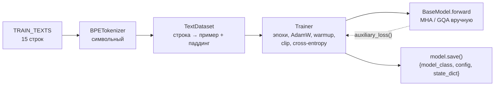
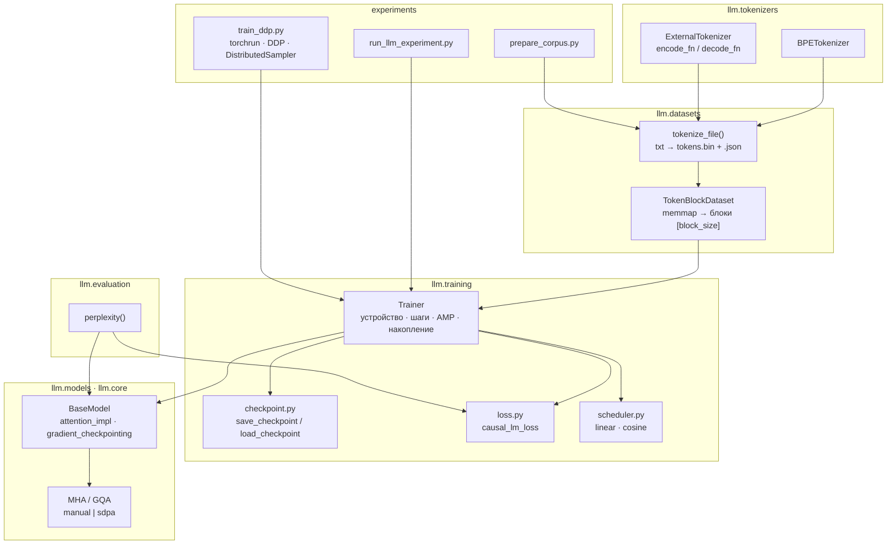
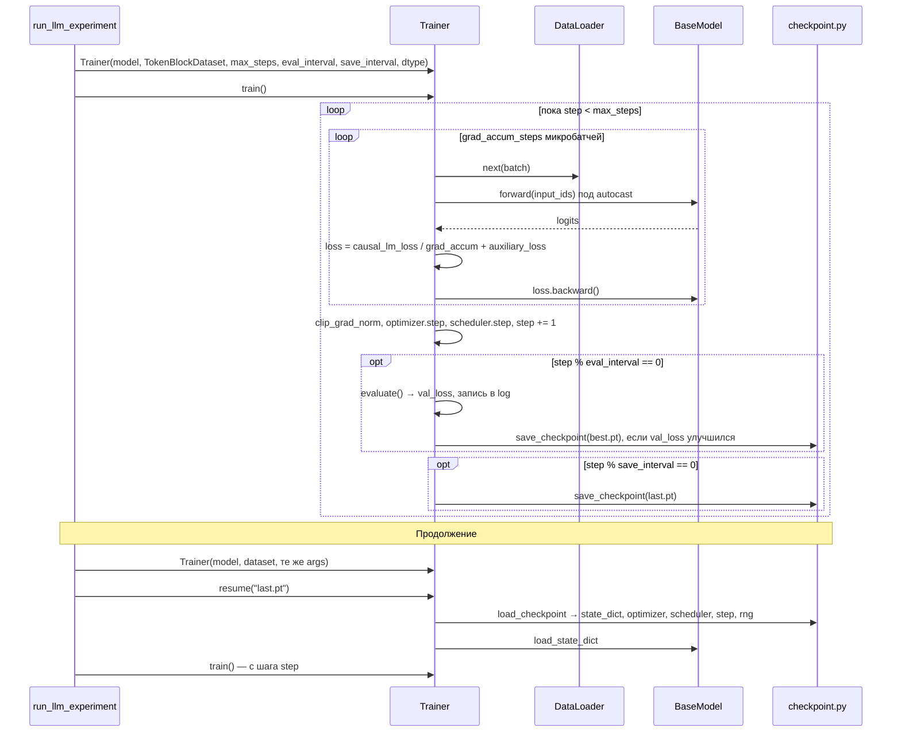

# Проектирование: подсистема обучения
<!-- description: Архитектура подсистемы реального обучения: конвейер данных из файла, Trainer с чекпоинтами и продолжением, SDPA, mixed precision, gradient checkpointing, DDP. -->

[← Бэклог](backlog.md) · [Оглавление](README.md) · [Журнал решений →](decisions.md)

Документ описывает, как библиотека `llm` должна обучать модели не на 15 учебных предложениях, а на реальных корпусах: какие компоненты добавляются, какие контракты между ними, как это вписывается в существующий код. Принятые решения с альтернативами — в [журнале решений](decisions.md) (ADR-001…ADR-007); пошаговый план работ с тестами на каждую фазу — в [plans/01-real-training.md](../../plans/01-real-training.md).

Статус: **принято** 2026-10-09, реализация идёт по плану. Факты о текущей системе отделены от решений: раздел «Что есть сейчас» — факты, остальное — проект.

## Задача

**Проблема.** Обучающий контур библиотеки работает и проверен тестами, но рассчитан на учебный корпус: датасеты принимают список строк и дополняют каждую паддингом, `Trainer` обучает по эпохам без чекпоинтов и продолжения, устройство выбирается только из `cuda`/`cpu`, attention считает полную матрицу вручную, модуль оценки пуст. Подробно — в [Ограничениях](../guide/limitations.md).

**Для кого.** Исследователь, который хочет на этой библиотеке обучить модель 10–100M параметров на корпусе 10⁷–10⁸ токенов на одном GPU или Apple Silicon, прервать и продолжить обучение, сравнить архитектуры по perplexity. Студент, который читает учебник и должен по-прежнему видеть в коде формулы, а не вызовы ядер.

**Функциональные требования.**

- F1. Обучение на текстовом файле произвольного размера без загрузки всего корпуса в память Python.
- F2. Обучение по числу шагов, валидация и чекпоинт по интервалу, продолжение с чекпоинта без скачка в кривой loss.
- F3. Perplexity на валидационном наборе как стандартная метрика.
- F4. Mixed precision (`bfloat16`), накопление градиентов, косинусное расписание.
- F5. Быстрый путь attention через `scaled_dot_product_attention`.
- F6. Внешний токенизатор (byte-level BPE из `tokenizers` или `tiktoken`) без зависимости библиотеки от него.
- F7. Gradient checkpointing для экономии памяти активаций.
- F8. Несколько GPU через DDP.

**Нефункциональные требования и ограничения.**

- N1. Поведение по умолчанию не меняется: существующие тесты (19 в `test_trainer.py`), шесть ноутбуков с вызовом `Trainer(...)`, конфиги `*_train.json`, иллюстрации `figures-check` остаются валидными без правок ([Соглашения](conventions.md), «новый ключ сохраняет старое поведение»).
- N2. Зависимости `llm` — только `torch>=2.3` и `numpy`.
- N3. Ручные реализации остаются эталоном: любая оптимизация сверяется с ними тестом на равенство.
- N4. Код читается целиком: никаких фреймворков обучения, колбэков и плагинов внутри `llm`.
- N5. Чекпоинт модели по-прежнему читается `BaseModel.load` с `weights_only=True`.
- N6. CI: тесты на CPU за минуту, без сетевых зависимостей, без скипов «could not import».

**Допущения.** Один процесс на один ускоритель; корпус помещается на диск как один файл токенов; модели до ~1B параметров (FSDP и тензорный параллелизм не рассматриваются).

## Что есть сейчас

Факты по коду на момент проектирования (подробные ссылки на строки — в [плане](../../plans/01-real-training.md), фаза 0).



- `Trainer(model, train_dataset, val_dataset=None, lr, batch_size, num_epochs, warmup_steps, warmup_ratio)`; `train()`, `evaluate() -> float`, `compute_lm_loss(logits, labels)`, `_forward(batch)`; `loss_history` по эпохам. Устройство: `cuda`, иначе `cpu`.
- Датасеты возвращают `{"input_ids", "attention_mask", "labels"}` формы `[block_size]`; `Trainer._forward` передаёт `attention_mask` в модель, только если она есть в батче.
- `BaseModel.save` пишет `{"model_class", "config", "state_dict"}`; `load` требует ключи `config` и `state_dict`, проверяет `model_class`, лишние ключи игнорирует.
- Модули attention принимают `padding: Padding` (булева маска ключей и позиции), строят булеву маску «разрешено» `[B,1,T,T_kv]` и делают `masked_fill(~mask, -inf)` перед softmax. У `GroupedQueryAttention` нет dropout на весах внимания, кэш — тройка `(K, V, next_pos)`.
- Mixtral хранит логиты роутера в `decoder._ff.router_logits` после каждого forward; `auxiliary_loss()` читает их.
- Ноутбуки вызывают `Trainer(model, train_dataset, val_dataset, lr=…, batch_size=…, num_epochs=…, warmup_ratio=…)` и читают `loss_history`.
- `torch==2.8.0` в workspace: доступны `scaled_dot_product_attention`, `torch.autocast` на `mps` с `bfloat16`, `torch.amp.GradScaler`, `torch.utils.checkpoint.checkpoint(use_reentrant=False)`, `AdamW(fused=True)`.

## Целевая архитектура

### Компоненты



| Компонент | Ответственность | Где |
|---|---|---|
| `tokenize_file` | один раз превратить текстовый файл в файл токенов фиксированного dtype с метаданными | `llm/datasets/tokenize_corpus.py` |
| `TokenBlockDataset` | отдать `i`-й непрерывный блок токенов как `{"input_ids", "labels"}`; знать только путь и `block_size` | `llm/datasets/token_block_dataset.py` |
| `ExternalTokenizer` | представить чужой токенизатор в контракте `BaseTokenizer` | `llm/tokenizers/external_tokenizer.py` |
| `causal_lm_loss` | единственная реализация loss со сдвигом и `ignore_index=-100` | `llm/training/loss.py` |
| `Trainer` | цикл обучения: устройство, точность, шаги, накопление, валидация, вызов чекпоинтов и лога | `llm/training/trainer.py` |
| `save_checkpoint` / `load_checkpoint` | формат файла чекпоинта и его совместимость с `BaseModel.load` | `llm/training/checkpoint.py` |
| расписания | `get_linear_schedule_with_warmup`, `get_cosine_schedule_with_warmup` | `llm/training/scheduler.py` |
| `perplexity` | метрика качества на наборе: `exp` от среднего `causal_lm_loss` | `llm/evaluation/perplexity.py` |
| `attention_impl` | ключ конфига модели: `manual` (эталон) или `sdpa`; реализуется внутри MHA и GQA | `llm/core/*attention.py`, все декодеры и модели |
| `gradient_checkpointing` | ключ конфига модели: пересчёт активаций блока на backward | цикл по слоям в `models/*/` |
| `prepare_corpus.py`, `train_ddp.py` | оркестрация вне библиотеки: скачать и токенизировать корпус; поднять DDP | `experiments/` |

Границы ответственности, которые не пересекаются:

- **Модель не знает об устройстве и точности.** Их выбирает `Trainer` (`model.to(device)`, `torch.autocast`); блоки не приводят веса сами (так уже написано в докстринге `FeedForward.forward`).
- **Датасет не знает о loss.** Он не сдвигает `labels` и не ставит `-100`: у непрерывных блоков паддинга нет, сдвиг делает `causal_lm_loss`.
- **`Trainer` не знает о распределённости.** Он принимает готовый `DataLoader`, флаг «главный процесс» и модель, которая может быть обёрнута в DDP; кто и как её обернул — забота скрипта.
- **Библиотека не знает о внешних токенизаторах.** `ExternalTokenizer` принимает две функции, импортов `tokenizers`/`tiktoken` в `llm` нет.

### Интерфейсы

Все новые аргументы — именованные, с умолчаниями, воспроизводящими текущее поведение (N1).

**Данные.**

```python
# llm/datasets/tokenize_corpus.py
def tokenize_file(text_path: str, tokenizer, out_path: str, *,
                  eos_token_id: int | None = None, dtype=None, chunk_lines: int = 10_000) -> int
# tokenizer — любой объект с encode(text, add_special_tokens=False) -> list[int]
# и get_vocab_size(); dtype: uint16, если словарь ≤ 65535, иначе uint32.
# Пишет <out_path> (np.memmap) и <out_path>.json:
#   {"dtype": "uint16", "num_tokens": N, "vocab_size": V, "eos_token_id": e}

# llm/datasets/token_block_dataset.py
class TokenBlockDataset(Dataset):
    def __init__(self, tokens: str | np.ndarray | Sequence[int], block_size: int, *, dtype=None)
    def __len__(self) -> int                      # (num_tokens - 1) // block_size
    def __getitem__(self, i) -> dict[str, Tensor] # {"input_ids": long[block_size], "labels": long[block_size]}
```

**Токенизатор.**

```python
# llm/tokenizers/external_tokenizer.py
class ExternalTokenizer(BaseTokenizer):
    def __init__(self, encode_fn: Callable[[str], list[int]], decode_fn: Callable[[list[int]], str],
                 vocab_size: int, *, pad_token_id=None, unk_token_id=None,
                 bos_token_id=None, eos_token_id=None, name: str = "external")
    def train(...)  # NotImplementedError: внешний токенизатор обучается своим инструментом
```

**Loss и метрика.**

```python
# llm/training/loss.py
def causal_lm_loss(logits: Tensor, labels: Tensor, ignore_index: int = -100) -> Tensor
# Trainer.compute_lm_loss остаётся и делегирует сюда.

# llm/evaluation/perplexity.py
def lm_loss(model, loader, device, max_batches: int | None = None) -> float
def perplexity(model, loader, device, max_batches: int | None = None) -> float
```

**Trainer.**

```python
Trainer(
    model, train_dataset=None, val_dataset=None,
    lr=3e-4, batch_size=8, num_epochs=3, warmup_steps=None, warmup_ratio=None,   # как сейчас
    *,
    device=None,                 # None → cuda → mps → cpu; строка или torch.device
    max_steps=None,              # задан → обучение по шагам, num_epochs игнорируется
    eval_interval=None,          # шагов между валидациями; None → в конце эпохи
    eval_batches=None,           # ограничить число батчей валидации
    checkpoint_dir=None, save_interval=None, keep_best=True,
    log_path=None,               # JSON с записями {"step","epoch","lr","train_loss","val_loss"}
    seed=None,
    dtype="float32",             # "bfloat16" | "float16" (float16 только на CUDA)
    grad_accum_steps=1, max_grad_norm=1.0,
    lr_schedule="linear",        # | "cosine"
    num_workers=0, pin_memory=None,
    train_loader=None, val_loader=None,   # готовые DataLoader (DDP); тогда *_dataset не нужны
    is_main_process=True,        # чекпоинты и лог пишет только главный процесс
)
trainer.train()
trainer.evaluate() -> float
trainer.save_checkpoint(path) / Trainer.load_checkpoint(path)   # см. «Модель данных»
trainer.resume(path)             # восстановить и продолжить с того же шага
trainer.state: TrainState        # step, epoch, best_val_loss, loss_history, log
trainer.loss_history             # свойство → state.loss_history (совместимость)
```

Шаг — это шаг оптимизатора: `max_steps`, `eval_interval`, `save_interval` считаются в них независимо от `grad_accum_steps`.

**Модель.** Два новых ключа конфига, оба со старым поведением по умолчанию:

| Ключ | Значения | Умолчание | Кто читает |
|---|---|---|---|
| `attention_impl` | `"manual"`, `"sdpa"` | `"manual"` | модель → декодер → `MultiHeadAttention` / `GroupedQueryAttention` (аргумент конструктора) |
| `gradient_checkpointing` | `bool` | `False` | цикл по слоям в `forward` модели; действует только при `self.training and not use_cache` |

Неизвестное значение → `ValueError` в конструкторе модели. Сигнатура `forward` не меняется.

**Расписание.**

```python
def get_cosine_schedule_with_warmup(optimizer, num_warmup_steps, num_training_steps,
                                    min_lr_ratio: float = 0.0) -> LambdaLR
```

### Модель данных

**Файл токенов** `<name>.bin` — плоский массив `uint16`/`uint32` без заголовка (читается `np.memmap` с `dtype` из `<name>.json`). Документы разделены `eos_token_id`, если он задан. Один файл — один сплит: `train.bin`, `val.bin`. Владелец — `tokenize_file`; датасет только читает.

**Чекпоинт** `last.pt` / `best.pt` — один файл `torch.save`, надмножество формата `BaseModel.save`:

```python
{
  "model_class": "Llama", "config": {...}, "state_dict": {...},   # ровно как BaseModel.save
  "trainer": {
    "format_version": 1,
    "step": 1200, "epoch": 0,
    "optimizer": optimizer.state_dict(), "scheduler": scheduler.state_dict(),
    "scaler": scaler.state_dict() | None,
    "best_val_loss": 2.91, "loss_history": [...], "log": [...],
    "rng": {"torch": ..., "cuda": ... | None},
    "args": {"lr": ..., "max_steps": ..., "lr_schedule": ..., "grad_accum_steps": ...},
  },
}
```

`BaseModel.load(path)` читает такой файл без изменений (лишний ключ `trainer` игнорируется). `Trainer.resume` проверяет `model_class`, `format_version` и совпадение `args`, от которых зависит расписание (`max_steps`, `lr_schedule`, `warmup`), иначе `ValueError`. Все значения — тензоры, числа, строки, списки и словари: файл читается с `weights_only=True`.

**Лог** `log.json` — список записей `{"step", "epoch", "lr", "train_loss", "val_loss"}`; `val_loss` есть только в записях после валидации. Это же хранится в чекпоинте, поэтому после `resume` лог продолжается, а не начинается заново.

### Потоки

**Обучение по шагам с чекпоинтами и продолжением.**



**Ошибки.** Плохая конфигурация падает в конструкторе `Trainer` или модели (`ValueError`), а не на первом шаге: `float16` без CUDA, `max_steps` вместе с `num_epochs` и `eval_interval` без `val_dataset`, `train_loader` одновременно с `train_dataset`, неизвестные `attention_impl` и `lr_schedule`. Несовпадение `args` при `resume` — `ValueError` с перечислением различий. Батч без целей даёт loss `0`, а не `NaN` (как сейчас). Переполнение `float16` обрабатывает `GradScaler`; `bfloat16` в нём не нуждается.

**Поток данных для подготовки корпуса.** `prepare_corpus.py` → (скачать или взять локальный txt) → обучить `BPETokenizer` на выборке строк или создать `ExternalTokenizer` → `tokenize_file(train)`, `tokenize_file(val)` → `data/<name>/{train.bin, val.bin, tokenizer.json}`. Каталог `data/` в `.gitignore`.

### Attention: ручной и SDPA

Оба пути получают одно и то же: `q, k, v` формы `[B, H, T, d]` (после RoPE, конкатенации кэша и повторения KV-голов в GQA) и булеву маску `allowed` формы `[1,1,T,T_kv]` или `[B,1,T,T_kv]`, которую модуль уже строит сегодня (`_tril_mask` срез → `Padding.apply`). Ручной путь: `masked_fill(~allowed, -inf)` → `softmax` → `@ v`. SDPA-путь: `F.scaled_dot_product_attention(q, k, v, attn_mask=allowed, dropout_p=p, scale=1/sqrt(d))`, где у булевой маски `True` означает «разрешено», то есть ровно наша семантика. Частный случай без паддинга, кэша и окна — `is_causal=True` без маски (быстрее всего). Математика одинакова, различаются только ядра; тест на равенство — `atol=1e-5`. Скользящее окно Mistral остаётся маской по слотам, как описано в [Mistral](../textbook/mistral.md#ширина-окна-w--1): SDPA не экономит на нём вычисления, но экономит память на материализации `scores`.

### Gradient checkpointing

В цикле по слоям вместо `decoder(out, use_cache=False, cache=None, padding=padding)` вызывается `torch.utils.checkpoint.checkpoint(decoder, out, use_cache=False, cache=None, padding=padding, use_reentrant=False)`. Условие — `self.training and gradient_checkpointing and not use_cache`: при генерации и в `eval` пересчёт не нужен. У Mixtral в `checkpoint` оборачивается функция, возвращающая `(out, router_logits)`, и возвращённые логиты кладутся в `decoder._ff.router_logits`; иначе `auxiliary_loss()` увидит логиты первого прохода, сделанного без графа, и роутер не получит градиента от aux-loss.

### Распределённое обучение

`Trainer` остаётся однопроцессным по коду. Для DDP скрипт `experiments/llm_only/train_ddp.py` под `torchrun`:

1. `init_process_group`, `device = cuda:{LOCAL_RANK}`;
2. модель → `DistributedDataParallel`; `Trainer` при вызове `auxiliary_loss` разворачивает `model.module`, если есть;
3. `DataLoader(TokenBlockDataset, sampler=DistributedSampler(...))` передаётся как `train_loader`, `sampler.set_epoch` вызывает скрипт через `trainer.on_epoch_start` — единственная точка расширения, обычный атрибут-функция, не система колбэков;
4. `is_main_process = rank == 0`; `save_checkpoint` сохраняет `model.module.state_dict()`.

`accelerate` уже есть в зависимостях workspace и может использоваться в `experiments/`, но не в `llm` (N2).

## Сквозные аспекты

- **Совместимость.** Умолчания воспроизводят текущее поведение; единственное изменение по умолчанию — выбор `mps` на Apple Silicon, он идёт в `CHANGELOG` («API»). Скрипт экспериментов переходит с `torch.save(state_dict)` на `model.save`, старый формат читается при `generate` — запись в «Чекпоинты и конфиги».
- **Конфигурация.** Секция `training` JSON-конфига расширяется ключами с теми же именами, что аргументы `Trainer`; новая секция `data` с путями к `.bin` и токенизатору. Без `data` скрипт работает на `TRAIN_TEXTS`, как сейчас.
- **Наблюдаемость.** `log.json` плюс печать; tqdm остаётся, ноутбуки его перенаправляют. Никаких TensorBoard/W&B в библиотеке; их легко повесить снаружи на `trainer.state.log`.
- **Воспроизводимость.** `seed` задаёт `torch.manual_seed` и генератор `DataLoader`; RNG сохраняется в чекпоинте. Полное побитовое совпадение после `resume` гарантируется на CPU и при `dropout 0.0`; на GPU — с точностью ядер.
- **Тестирование.** Три класса тестов: эквивалентность (manual = sdpa; с checkpointing = без; `batch 4` = `batch 2 × accum 2`; 6 шагов = 3 + resume + 3), контракты формата (чекпоинт читается `BaseModel.load`; `.bin` + `.json` восстанавливают те же тензоры), числа руками (косинусное расписание, perplexity равномерной модели = `V`). Всё на CPU, без сети; DDP — смоук через `torchrun --nproc_per_node=1` с `gloo`.
- **CI.** Изменения в `llm/src` запускают `tests.yml`, `figures-check.yml` и `notebooks-run.yml`; поскольку умолчания сохранены, иллюстрации и ноутбуки не меняются. Числа для документации (tok/s, perplexity) — из реальных запусков, по [соглашениям](conventions.md).
- **Документация.** `docs/guide/training.md` (параметры, чекпоинты, AMP, DDP), `data.md` (корпус из файла, внешний токенизатор), `checkpoints.md` (продолжение), `models.md` и `llm/README.md` (два ключа конфига), `limitations.md` (переписать), `textbook/training.md` (раздел «Trainer» и «Память при обучении»), `dev/architecture.md` (дерево модулей).

## Этапы реализации

Детали каждой фазы, точные точки вставки в код и чеклисты проверок — в [plans/01-real-training.md](../../plans/01-real-training.md). Здесь — порядок и зависимости.

| Фаза | Что даёт | Зависит от | Параллельно с |
|---|---|---|---|
| 1. Данные и perplexity | `tokenize_file`, `TokenBlockDataset`, `causal_lm_loss`, `perplexity`, `prepare_corpus.py`, секция `data` | — | 3 |
| 2. Trainer | устройство, шаги, валидация по интервалу, чекпоинты, `resume`, лог, `seed` | 1 (датасет для реального прогона) | 3 |
| 3. SDPA | `attention_impl` в MHA/GQA, декодерах и моделях; тест равенства | — | 1, 2 |
| 4. Точность и скорость | `dtype`, `grad_accum_steps`, `max_grad_norm`, косинус, `num_workers`, `fused` AdamW | 2 | 5.1, 5.2 |
| 5.1 Внешний токенизатор | `ExternalTokenizer` | 1 | 4, 5.2 |
| 5.2 Gradient checkpointing | ключ конфига, обёртка цикла по слоям, Mixtral | — | 4, 5.1 |
| 5.3 DDP | `train_loader`/`is_main_process` в `Trainer`, `train_ddp.py` | 2, 4 | — |
| 6. Проверка | полный прогон 20M-модели с цифрами в документацию | все | — |

Минимально полезный результат — фазы 1 и 2: обучение на файле с чекпоинтами и perplexity. Каждая фаза — отдельный PR, зелёный `uv run pytest` и документация в том же PR.

## Риски

| Риск | Как снижаем |
|---|---|
| Расширение `Trainer` сделает его нечитаемым (N4) | тело `train()` разбивается на `_train_step`, `_maybe_evaluate`, `_maybe_checkpoint`; `TrainState` — dataclass; формат чекпоинта вынесен в `checkpoint.py` |
| SDPA даёт другие числа, и HF-parity или `figures-check` падают | `sdpa` не умолчание; тесты равенства `atol=1e-5`; parity-тесты параметризуются обоими путями |
| Gradient checkpointing у Mixtral ломает aux-loss | логиты роутера возвращаются из checkpointed-функции; тест на градиент роутера |
| `resume` не точен из-за состояния `DataLoader` | при обучении по шагам порядок блоков задаётся `seed` и номером эпохи; тест «6 = 3 + 3» на CPU |
| Пробросить `attention_impl` через 5 декодеров и 6 моделей — много правок | один параметр конструктора с умолчанием, по образцу `rope`/`bias`; `set_attention_impl(model, impl)` для уже построенных моделей |
| DDP нельзя проверить в CI | смоук с одним процессом и `gloo`; многопроцессный запуск — ручная проверка с числами в документации |
