# Gemma

> Реализация: [`llm/src/llm/models/gemma/gemma.py`](../llm/src/llm/models/gemma/gemma.py) · класс `Gemma`
> Ноутбук: [`notebooks/gemma.ipynb`](../notebooks/gemma.ipynb)

Место в линейке: развивает ту же базу (RoPE + RMSNorm), что и [LLaMA](llama.md)/[Mistral](mistral.md), но с собственным вариантом attention и FFN — не входит в основную цепочку GPT → Mixtral.

## Обзор

Gemma (Google DeepMind, 2024) в этом репозитории реализована как RoPE + RMSNorm трансформер с **Multi-Query Attention** (MQA — одна общая голова K/V на все Q-головы, предельный случай GQA) и **GeGLU**-FFN (GELU-gated, а не SiLU-gated, как в SwiGLU).

## Архитектура блока декодера

```mermaid
flowchart LR
    Tokens(["Tokens"]) --> TokEmb["Token Emb"]:::blue
    TokEmb --> N1["RMSNorm"]:::gray
    N1 --> Attn["Multi-Query Attention<br/>+ RoPE (1 общая K/V-голова)"]:::blueHl
    Attn --> A1(("+"))
    TokEmb -.->|residual| A1
    A1 --> N2["RMSNorm"]:::gray
    N2 --> FFN["GeGLU"]:::purpleHl
    FFN --> A2(("+"))
    A1 -.->|residual| A2
    A2 --> Dc2["Decoder"]:::green --> Dots(["⋯"]) --> Dc5["Decoder"]:::green --> NF["RMSNorm<br/>(финальный)"]:::gray --> Lin["Linear"]:::gray --> Soft["Softmax"]:::purple

    classDef blue fill:#dae8fc,stroke:#6c8ebf,color:#1a1a1a;
    classDef blueHl fill:#dae8fc,stroke:#4a7ebf,stroke-width:3px,color:#1a1a1a;
    classDef purple fill:#e1d5e7,stroke:#9673a6,color:#1a1a1a;
    classDef purpleHl fill:#e1d5e7,stroke:#7a4f91,stroke-width:3px,color:#1a1a1a;
    classDef green fill:#d5e8d4,stroke:#82b366,color:#1a1a1a;
    classDef gray fill:#f5f5f5,stroke:#666666,color:#1a1a1a;
```



### Multi-Query Attention vs GQA

В [Mistral](mistral.md#grouped-query-attention) число KV-голов — настраиваемый параметр (`num_kv_heads`), обычно несколько. В реализации MQA здесь этого параметра вообще нет: `MultiQueryAttention` всегда использует **одну** общую K/V-голову на все Q-головы ([`core/multi_query_attention.py`](../llm/src/llm/core/multi_query_attention.py)) — это не частный случай настраиваемой GQA, а отдельный, более узкий механизм.

## Компоненты

| Компонент | Класс | Файл |
|---|---|---|
| Токен-эмбеддинги | `TokenEmbeddings` | [`core/token_embeddings.py`](../llm/src/llm/core/token_embeddings.py) |
| Позиционное кодирование | `RoPE` | [`core/rope.py`](../llm/src/llm/core/rope.py) |
| Нормализация | `RMSNorm` | [`core/rms_norm.py`](../llm/src/llm/core/rms_norm.py) |
| Attention | `MultiQueryAttention` (1 общая K/V-голова + RoPE) | [`core/multi_query_attention.py`](../llm/src/llm/core/multi_query_attention.py) |
| FFN | `GeGLU` (gated GELU-MLP) | [`core/geglu.py`](../llm/src/llm/core/geglu.py) |
| Блок декодера | `GemmaDecoder` (pre-LN) | [`core/gemma_decoder.py`](../llm/src/llm/core/gemma_decoder.py) |
| Модель целиком | `Gemma` | [`models/gemma/gemma.py`](../llm/src/llm/models/gemma/gemma.py) |

`GemmaDecoder.forward` — та же pre-LN схема:
```
norm1_out = RMSNorm1(x)
attn_out  = MQA(norm1_out)           # с RoPE
out       = attn_out + x
norm2_out = RMSNorm2(out)
ffn_out   = GeGLU(norm2_out)
result    = ffn_out + out
```

## Конфигурация

Пример из [`experiments/llm_only/configs/gemma_train.json`](../experiments/llm_only/configs/gemma_train.json):

| Параметр | Значение в примере | Используется? |
|---|---|---|
| `vocab_size` | (из токенизатора) | ✅ |
| `embed_dim` | 256 | ✅ |
| `num_q_heads` | 4 | ✅ (единственный параметр числа голов, который читает `Gemma.__init__`) |
| `num_layers` | 4 | ✅ |
| `max_position_embeddings` | 512 | ✅ |
| `dropout` | 0.1 | ✅ |
| `num_kv_heads` | 2 | ❌ не читается |
| `num_experts` | 8 | ❌ не читается |
| `top_k_experts` | 2 | ❌ не читается |
| `window_size` | 16 | ❌ не читается |

## ⚠️ Неиспользуемые ключи конфига

`Gemma.__init__` ([`models/gemma/gemma.py:132-139`](../llm/src/llm/models/gemma/gemma.py)) передаёт в `GemmaDecoder` только `num_q_heads`, `emb_size`, `head_size`, `max_seq_len`, `rope`, `dropout`. Ключи `num_kv_heads`, `num_experts`, `top_k_experts`, `window_size`, присутствующие в [`gemma_generate.json`](../experiments/llm_only/configs/gemma_generate.json)/[`gemma_train.json`](../experiments/llm_only/configs/gemma_train.json) (судя по всему, скопированные из конфига Mixtral), моделью не используются и ни на что не влияют. Это не баг в смысле краша — конструктор просто их игнорирует, — но конфиг вводит в заблуждение: MoE и настраиваемый GQA в текущей реализации Gemma отсутствуют, там всегда MQA с ровно одной K/V-головой.

## Генерация

`Gemma.generate(...)` — унифицированная сигнатура (см. [gpt.md](gpt.md#генерация)).
