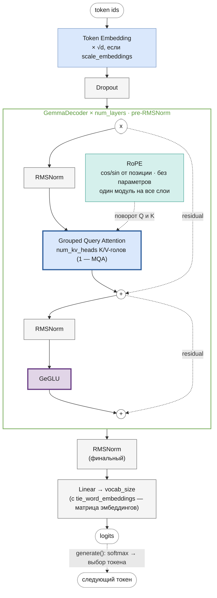

# Gemma

> Реализация: [`llm/src/llm/models/gemma/gemma.py`](../llm/src/llm/models/gemma/gemma.py) · класс `Gemma`
> Ноутбук: [`notebooks/gemma.ipynb`](../notebooks/gemma.ipynb)

Место в линейке: развивает ту же базу (RoPE + RMSNorm), что и [LLaMA](llama.md)/[Mistral](mistral.md), но с собственным вариантом attention и FFN — не входит в основную цепочку GPT → Mixtral.

## Обзор

Gemma (Google DeepMind, 2024, [arXiv:2403.08295](https://arxiv.org/abs/2403.08295)) в этом репозитории реализована как RoPE + RMSNorm трансформер с **Multi-Query Attention** по умолчанию (MQA — одна общая голова K/V на все Q-головы, предельный случай GQA; число K/V-голов задаётся ключом `num_kv_heads`) и **GeGLU**-FFN (GELU-gated, а не SiLU-gated, как в SwiGLU). Ключи конфига из [таблицы ниже](#как-в-статье) делают модель такой же, как Gemma 2B/7B, вплоть до загрузки весов HuggingFace.

## Архитектура блока декодера


```mermaid
%%{init: {"flowchart": {"rankSpacing": 28, "nodeSpacing": 28}}}%%
flowchart TB
    Ids(["token ids"]):::io --> TokEmb["Token Embedding<br/>× √d, если scale_embeddings"]:::blue
    TokEmb --> Drop["Dropout"]:::gray
    subgraph Dec["GemmaDecoder × num_layers · pre-RMSNorm"]
        direction TB
        X(["x"]):::io --> N1["RMSNorm"]:::gray
        N1 --> Attn["Grouped Query Attention<br/>num_kv_heads K/V-голов (1 — MQA)"]:::blueHl
        R["RoPE<br/>cos/sin от позиции · без параметров<br/>один модуль на все слои"]:::rope
        R -. "поворот Q и K" .-> Attn
        Attn --> A1(("+")):::add
        X -. residual .-> A1
        A1 --> N2["RMSNorm"]:::gray
        N2 --> FFN["GeGLU"]:::purpleHl
        FFN --> A2(("+")):::add
        A1 -. residual .-> A2
    end
    Drop --> Dec
    Dec --> NF["RMSNorm<br/>(финальный)"]:::gray --> Lin
    Lin["Linear → vocab_size<br/>(с tie_word_embeddings — матрица эмбеддингов)"]:::gray --> Out(["logits"]):::io
    Out -. "generate(): softmax → выбор токена" .-> Next(["следующий токен"]):::io
    style Dec fill:transparent,stroke:#82b366,stroke-width:2px,color:#5b9a3c

    classDef io fill:#ffffff,stroke:#999999,color:#1a1a1a;
    classDef add fill:#ffffff,stroke:#666666,color:#1a1a1a;
    classDef blue fill:#dae8fc,stroke:#6c8ebf,color:#1a1a1a;
    classDef blueHl fill:#dae8fc,stroke:#2f5f9e,stroke-width:3px,color:#1a1a1a;
    classDef purple fill:#e1d5e7,stroke:#9673a6,color:#1a1a1a;
    classDef purpleHl fill:#e1d5e7,stroke:#6a3d85,stroke-width:3px,color:#1a1a1a;
    classDef gray fill:#f5f5f5,stroke:#666666,color:#1a1a1a;
    classDef grayHl fill:#f5f5f5,stroke:#333333,stroke-width:3px,color:#1a1a1a;
    classDef gold fill:#fff2cc,stroke:#d6b656,color:#1a1a1a;
    classDef rope fill:#d5f0ec,stroke:#3a9e8f,color:#1a1a1a;
    classDef ropeHl fill:#d5f0ec,stroke:#1f6f63,stroke-width:3px,color:#1a1a1a;
    classDef dim fill:#f5f5f5,stroke:#bbbbbb,color:#999999,stroke-dasharray:4 3;
```

Как RoPE поворачивает Q и K — в разделе [Attention с RoPE](llama.md#attention-с-rope) документа LLaMA.

### Multi-Query Attention vs GQA

MQA предложена в [Shazeer, 2019](https://arxiv.org/abs/1911.02150), GQA — в [Ainslie et al., 2023](https://arxiv.org/abs/2305.13245) как обобщение между MQA и MHA. Gemma 2B использует MQA (одна K/V-голова), Gemma 7B — обычный MHA (16 K/V-голов, по одной на Q-голову). Поэтому блок Gemma строится на `GroupedQueryAttention` ([`core/group_query_attention.py`](../llm/src/llm/core/group_query_attention.py)) без скользящего окна с `num_kv_heads` из конфига: `1` (по умолчанию) — MQA, `num_q_heads` — MHA. При одной K/V-голове она не копируется на все Q-головы, а транслируется в матричном умножении, так что результат побитово совпадает с прежним `MultiQueryAttention` ([`core/multi_query_attention.py`](../llm/src/llm/core/multi_query_attention.py)); тот остался в `llm.core` как отдельный учебный модуль. KV-кэш слоя теперь — тройка `(K, V, next_pos)`, как у Mistral.

## Компоненты

| Компонент | Класс | Файл |
|---|---|---|
| Токен-эмбеддинги | `TokenEmbeddings` | [`core/token_embeddings.py`](../llm/src/llm/core/token_embeddings.py) |
| Позиционное кодирование | `RoPE` | [`core/rope.py`](../llm/src/llm/core/rope.py) |
| Нормализация | `RMSNorm` | [`core/rms_norm.py`](../llm/src/llm/core/rms_norm.py) |
| Attention | `GroupedQueryAttention` (`num_kv_heads` K/V-голов, по умолчанию 1 — MQA; RoPE; без окна) | [`core/group_query_attention.py`](../llm/src/llm/core/group_query_attention.py) |
| FFN | `GeGLU` (gated GELU-MLP) | [`core/geglu.py`](../llm/src/llm/core/geglu.py) |
| Блок декодера | `GemmaDecoder` (pre-LN) | [`core/gemma_decoder.py`](../llm/src/llm/core/gemma_decoder.py) |
| Модель целиком | `Gemma` | [`models/gemma/gemma.py`](../llm/src/llm/models/gemma/gemma.py) |

`GemmaDecoder.forward` — та же pre-LN схема:
```
norm1_out = RMSNorm1(x)
attn_out  = GQA(norm1_out)           # с RoPE; 1 K/V-голова — MQA
out       = attn_out + x
norm2_out = RMSNorm2(out)
ffn_out   = GeGLU(norm2_out)
result    = ffn_out + out
```

## Отличия от Gemma

Сравнение с Gemma 2B/7B (статья и `GemmaConfig`/`GemmaModel` в HF). Подробности, воспроизведение и варианты исправления — в [бэклоге](backlog.md#gemma) (номера пунктов в скобках).

| | Gemma | Здесь |
|---|---|---|
| Масштаб эмбеддингов | умножаются на `√d` перед первым блоком | по умолчанию нет; `scale_embeddings: true` — как в оригинале (42) |
| Выходная проекция | привязана к эмбеддингам (`tie_word_embeddings`) | по умолчанию отдельный `Linear`; `tie_word_embeddings: true` — как в оригинале (43) |
| Bias | нет ни в одной проекции | по умолчанию во всех `Linear`; `bias: false` — как в оригинале (43) |
| Скрытый слой GeGLU | 8·d на каждую из `gate`/`up` (16384 при d = 2048) | по умолчанию 4·d; `intermediate_size` — любой (44) |
| Attention | 2B — MQA, 7B — MHA с 16 головами и `head_dim = 256` ≠ d / heads | по умолчанию MQA; `num_kv_heads` и `head_size` из конфига (45) |
| RMSNorm | вес с нуля, множитель `(1 + w)`, вычисление во float32 | вес с единиц, множитель `w` — при загрузке весов HF к ним прибавляется 1; для float16/bfloat16 нормализация во float32 (46) |
| Dropout | нет | после эмбеддингов, в attention и в GeGLU (55); `dropout: 0` убирает его полностью |

Активация GeGLU — tanh-аппроксимация GELU — совпадает с оригиналом (`gelu_pytorch_tanh` в HF).

## Конфигурация

Пример из [`experiments/llm_only/configs/gemma_train.json`](../experiments/llm_only/configs/gemma_train.json):

| Параметр | Значение в примере | Используется? |
|---|---|---|
| `vocab_size` | (из токенизатора) | ✅ |
| `embed_dim` | 256 | ✅ |
| `num_q_heads` | 4 | ✅ (единственный параметр числа голов, который читает `Gemma.__init__`) |
| `num_layers` | 4 | ✅ |
| `max_position_embeddings` | 512 | ✅ |
| `rms_norm_eps` | (нет в примере) | ✅ необязательный `eps` всех RMSNorm, по умолчанию `1e-6` — как в Gemma |
| `rope_theta` | (нет в примере) | ✅ необязательная база частот RoPE, по умолчанию `10000` — как в Gemma; см. [llama.md](llama.md#скорости-вращения-и-база-rope_theta) |
| `dropout` | 0.1 | ✅ после эмбеддингов, в attention и GeGLU; в Gemma dropout нет — для соответствия оригиналу `0` |
| `head_size` | 64 | ✅ необязательный; по умолчанию `embed_dim // num_q_heads` |

Ключи Mixtral (`num_kv_heads`, `num_experts`, `top_k_experts`, `window_size`), которые раньше были в этом конфиге и моделью не читались, удалены; `num_kv_heads` теперь читается (см. ниже).

### Как в статье

Необязательные ключи; без них структура модели прежняя, и старые чекпоинты загружаются. Все, кроме `scale_embeddings`, меняют форму весов, поэтому чекпоинт одного вида в модель другого не загрузится.

| Ключ | По умолчанию | Gemma 2B | Gemma 7B |
|---|---|---|---|
| `num_kv_heads` | `1` (MQA) | `1` | `16` |
| `head_size` | `embed_dim // num_q_heads` | `256` | `256` (≠ 3072 / 16) |
| `intermediate_size` | `4 · embed_dim` | `16384` (8·d) | `24576` (8·d) |
| `bias` | `true` | `false` | `false` |
| `tie_word_embeddings` | `false` | `true` | `true` |
| `scale_embeddings` | `false` | `true` | `true` |
| `rms_norm_eps` | `1e-6` | `1e-6` | `1e-6` |
| `dropout` | — | `0` | `0` |

`scale_embeddings` умножает выход эмбеддингов на `√embed_dim` (множитель приводится к dtype эмбеддингов, как в HF). При tied embeddings одна матрица служит и входом, и выходом, и её норма рассчитана на выходную проекцию; без множителя вход в первый блок был бы на порядок меньше. `tie_word_embeddings` особенно заметен у Gemma: словарь 256 000 токенов, и отдельная голова для 2B — это ещё ~524M параметров.

## Загрузка весов HuggingFace

С ключами из таблицы выше загружаются веса `GemmaForCausalLM` — через `convert_hf_state_dict` из [`models/gemma/hf_weights.py`](../llm/src/llm/models/gemma/hf_weights.py). Это перенос LLaMA ([llama.md](llama.md#загрузка-весов-huggingface): те же имена слоёв и перестановка строк `q_proj`/`k_proj` под RoPE на чередующихся парах) плюс одна поправка: `GemmaRMSNorm` умножает на `(1 + w)`, а `RMSNorm` здесь — на `w`, поэтому к весам всех RMSNorm прибавляется 1.

```python
from transformers import GemmaForCausalLM
from llm.models.gemma import Gemma, convert_hf_state_dict

hf = GemmaForCausalLM.from_pretrained("google/gemma-2b")
c = hf.config
model = Gemma({"vocab_size": c.vocab_size, "embed_dim": c.hidden_size, "num_q_heads": c.num_attention_heads,
               "num_kv_heads": c.num_key_value_heads, "head_size": c.head_dim, "num_layers": c.num_hidden_layers,
               "max_position_embeddings": c.max_position_embeddings, "dropout": 0.0,
               "rms_norm_eps": c.rms_norm_eps, "rope_theta": c.rope_theta, "intermediate_size": c.intermediate_size,
               "bias": False, "tie_word_embeddings": True, "scale_embeddings": True})
model.load_state_dict(convert_hf_state_dict(hf.state_dict(), num_heads=c.num_attention_heads,
                                            num_kv_heads=c.num_key_value_heads))
```

Сверено со случайными `GemmaForCausalLM` из `transformers` в двух формах — MQA с `head_dim = hidden / heads` (как 2B) и MHA с `head_dim ≠ hidden / heads` (как 7B): логиты совпадают до ~1e-5, greedy-генерация с KV-кэшем — токен в токен (`llm/tests/models/test_gemma_hf_parity.py`). Без `scale_embeddings` или без `+1` к весам RMSNorm результат HF не воспроизводится — это тоже проверяет тест. Настоящие веса `google/gemma-2b` закрыты лицензией (доступ после принятия условий на HuggingFace), в проверке они не использовались.

В bfloat16 возможна разница в последних битах: `GemmaRMSNorm` умножает на вес ещё во float32, а `RMSNorm` здесь — после приведения к dtype входа, как `LlamaRMSNorm`.

## Генерация

`Gemma.generate(...)` — унифицированная сигнатура (см. [gpt.md](gpt.md#генерация)).

## Литература

Основная статья:

- Gemma Team. *Gemma: Open Models Based on Gemini Research and Technology*. 2024. [arXiv:2403.08295](https://arxiv.org/abs/2403.08295)

Компоненты:

- Shazeer. *Fast Transformer Decoding: One Write-Head is All You Need*. 2019. [arXiv:1911.02150](https://arxiv.org/abs/1911.02150) — Multi-Query Attention
- Shazeer. *GLU Variants Improve Transformer*. 2020. [arXiv:2002.05202](https://arxiv.org/abs/2002.05202) — SwiGLU и GeGLU
- Su et al. *RoFormer: Enhanced Transformer with Rotary Position Embedding*. 2021. [arXiv:2104.09864](https://arxiv.org/abs/2104.09864)
- Zhang, Sennrich. *Root Mean Square Layer Normalization*. 2019. [arXiv:1910.07467](https://arxiv.org/abs/1910.07467)
