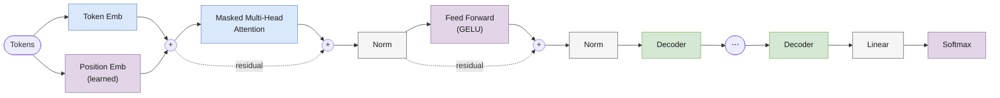

# GPT-1

> Реализация: [`llm/src/llm/models/gpt/gpt.py`](../llm/src/llm/models/gpt/gpt.py) · класс `GPT`
> Ноутбук: [`notebooks/gpt.ipynb`](../notebooks/gpt.ipynb) · Диаграммы: [`assets/drawio/gpt1-*.drawio`](../assets/drawio)

Место в линейке: **GPT-1** → [GPT-2](gpt2.md) → [LLaMA](llama.md) → [Mistral](mistral.md) → [Mixtral](mixtral.md) · [Gemma](gemma.md)

## Обзор

GPT-1 (Radford et al., *"Improving Language Understanding by Generative Pre-Training"*, OpenAI 2018) — первая архитектура, показавшая, что decoder-only трансформер, обученный на задаче предсказания следующего токена, переносится на широкий круг downstream-задач почти без изменения архитектуры. В этом репозитории воспроизведена "классическая" версия: обучаемые абсолютные позиционные эмбеддинги, стандартный multi-head attention и **post-LN** блок декодера (нормализация после residual-сложения — так, как было в оригинальной статье, до того как GPT-2 перешёл на pre-LN).

## Архитектура блока декодера



Обратите внимание: `Norm` стоит **после** сложения с residual-связью (`x + Attention(x)`, затем норма) — это ключевое отличие от GPT-2 и всех более поздних архитектур в этом репозитории, которые используют pre-LN.

## Компоненты

| Компонент | Класс | Файл |
|---|---|---|
| Токен-эмбеддинги | `TokenEmbeddings` | [`core/token_embeddings.py`](../llm/src/llm/core/token_embeddings.py) |
| Позиционные эмбеддинги | `PositionalEmbeddings` (обучаемые, абсолютные) | [`core/positional_embeddings.py`](../llm/src/llm/core/positional_embeddings.py) |
| Attention | `MultiHeadAttention` (стандартный causal MHA, без RoPE/GQA) | [`core/multi_head_attention.py`](../llm/src/llm/core/multi_head_attention.py) |
| FFN | `FeedForward` (2-слойный MLP, GELU) | [`core/feed_forward.py`](../llm/src/llm/core/feed_forward.py) |
| Блок декодера | `GptDecoder` (**post-LN**) | [`core/gpt_decoder.py`](../llm/src/llm/core/gpt_decoder.py) |
| Модель целиком | `GPT` | [`models/gpt/gpt.py`](../llm/src/llm/models/gpt/gpt.py) |

`GptDecoder.forward`:
```
attn_out       = Attention(x)
out            = Norm1(attn_out + x)
ffn_out        = FFN(out)
result         = Norm2(ffn_out + out)
```

Важная деталь: после последнего блока декодера **нет** финальной нормализации — `GPT.forward` идёт напрямую из стека декодеров в `Linear`-проекцию на словарь. (GPT-2 в этом смысле отличается — см. [gpt2.md](gpt2.md).)

## Конфигурация

Пример из [`experiments/llm_only/configs/gpt_train.json`](../experiments/llm_only/configs/gpt_train.json):

| Параметр | Значение в примере | Смысл |
|---|---|---|
| `vocab_size` | (из токенизатора) | размер словаря |
| `embed_dim` | 256 | размерность эмбеддингов и скрытого состояния |
| `num_heads` | 4 | число attention-голов (`head_size = embed_dim / num_heads`) |
| `num_layers` | 4 | число блоков `GptDecoder` в стеке |
| `max_position_embeddings` | 128 | максимальная длина последовательности (размер буфера позиционных эмбеддингов и causal-маски) |
| `dropout` | 0.1 | dropout в attention и FFN |

## Генерация

`GPT.generate(x, max_new_tokens, do_sample, temperature=1.0, top_k=None, top_p=None, use_cache=True, attention_mask=None, **kwargs)` — унифицированная сигнатура, общая для всех архитектур в этом репозитории: greedy (`do_sample=False`), sampling с температурой, top-k, top-p (nucleus), с опциональным KV-кэшем.

## Что изменилось в GPT-2

- normalization: **post-LN → pre-LN**;
- появляется финальная нормализация перед выходной проекцией;
- FFN и attention переиспользуют ту же математику (GELU, стандартный MHA), но собраны в отдельный класс `Gpt2Decoder` вместо параметризуемого `GptDecoder`.

Подробности — в [gpt2.md](gpt2.md).
