# GPT-2

> Реализация: [`llm/src/llm/models/gpt/gpt2.py`](../llm/src/llm/models/gpt/gpt2.py) · класс `GPT2`
> Ноутбук: [`notebooks/gpt2.ipynb`](../notebooks/gpt2.ipynb)

Место в линейке: [GPT-1](gpt.md) → **GPT-2** → [LLaMA](llama.md) → [Mistral](mistral.md) → [Mixtral](mixtral.md) · [Gemma](gemma.md)

## Обзор

GPT-2 (Radford et al., *"Language Models are Unsupervised Multitask Learners"*, OpenAI 2019) отличается от GPT-1 не набором механизмов (эмбеддинги, MHA, GELU-FFN — те же), а их **расстановкой**: нормализация переносится с "после residual" на "до sub-layer" (**pre-LN**). Pre-LN даёт более стабильные градиенты на глубоких стеках и позволяет обучать заметно более крупные модели (GPT-2 — от 117M до 1.5B параметров).

## Архитектура блока декодера

```mermaid
flowchart LR
    Tokens(["Tokens"]) --> TokEmb["Token Emb"]:::blue
    Tokens --> PosEmb["Position Emb<br/>(learned)"]:::purple
    TokEmb --> Sum(("+"))
    PosEmb --> Sum
    Sum --> N1["Norm"]:::gray
    N1 --> Attn["Masked Multi-Head<br/>Attention"]:::blue
    Attn --> A1(("+"))
    Sum -.->|residual| A1
    A1 --> N2["Norm"]:::gray
    N2 --> FFN["Feed Forward<br/>(GELU)"]:::purple
    FFN --> A2(("+"))
    A1 -.->|residual| A2
    A2 --> Dc2["Decoder"]:::green --> Dots(["⋯"]) --> Dc5["Decoder"]:::green --> NF["Norm<br/>(финальный)"]:::gray --> Lin["Linear"]:::gray --> Soft["Softmax"]:::purple

    classDef blue fill:#dae8fc,stroke:#6c8ebf,color:#1a1a1a;
    classDef purple fill:#e1d5e7,stroke:#9673a6,color:#1a1a1a;
    classDef green fill:#d5e8d4,stroke:#82b366,color:#1a1a1a;
    classDef gray fill:#f5f5f5,stroke:#666666,color:#1a1a1a;
```



## Компоненты

| Компонент | Класс | Файл |
|---|---|---|
| Токен-эмбеддинги | `TokenEmbeddings` | [`core/token_embeddings.py`](../llm/src/llm/core/token_embeddings.py) |
| Позиционные эмбеддинги | `PositionalEmbeddings` (обучаемые, абсолютные — как в GPT-1) | [`core/positional_embeddings.py`](../llm/src/llm/core/positional_embeddings.py) |
| Attention | `MultiHeadAttention` (тот же класс, что и в GPT-1) | [`core/multi_head_attention.py`](../llm/src/llm/core/multi_head_attention.py) |
| FFN | GELU MLP, зашит внутри декодера (не параметризуется извне) | [`core/gpt2_decoder.py`](../llm/src/llm/core/gpt2_decoder.py) |
| Блок декодера | `Gpt2Decoder` (**pre-LN**) | [`core/gpt2_decoder.py`](../llm/src/llm/core/gpt2_decoder.py) |
| Модель целиком | `GPT2` | [`models/gpt/gpt2.py`](../llm/src/llm/models/gpt/gpt2.py) |

`Gpt2Decoder.forward`:
```
norm1_out = Norm1(x)
attn_out  = Attention(norm1_out)
out       = attn_out + x
norm2_out = Norm2(out)
ffn_out   = FFN(norm2_out)
result    = ffn_out + out
```

В отличие от GPT-1, `GPT2.forward` добавляет финальный `nn.LayerNorm` **после** стека декодеров и **перед** проекцией на словарь ([`models/gpt/gpt2.py:120`](../llm/src/llm/models/gpt/gpt2.py)) — стандартная практика pre-LN трансформеров (без неё выход последнего блока не нормализован).

`Gpt2Decoder` — самостоятельный класс, а не переиспользование параметризуемого `CachedDecoder` (которым, например, пользуются LLaMA и другие более новые архитектуры в этом репозитории): FFN и pre-LN расстановка захардкожены внутри него.

## Конфигурация

Пример из [`experiments/llm_only/configs/gpt2_train.json`](../experiments/llm_only/configs/gpt2_train.json) — набор параметров идентичен GPT-1:

| Параметр | Значение в примере | Смысл |
|---|---|---|
| `vocab_size` | (из токенизатора) | размер словаря |
| `embed_dim` | 256 | размерность эмбеддингов |
| `num_heads` | 4 | число attention-голов |
| `num_layers` | 4 | число блоков `Gpt2Decoder` |
| `max_position_embeddings` | 128 | максимальная длина последовательности |
| `dropout` | 0.1 | dropout в attention и FFN |

## Генерация

`GPT2.generate(...)` — та же унифицированная сигнатура, что у всех моделей репозитория (см. [gpt.md](gpt.md#генерация)).

## Что изменилось в LLaMA

- обучаемые абсолютные позиционные эмбеддинги → **RoPE** (относительное, ротационное позиционное кодирование, встроено в attention);
- `LayerNorm` → **RMSNorm**;
- GELU-FFN → **SwiGLU**;
- attention остаётся стандартным multi-head (см. оговорку в [llama.md](llama.md#известное-расхождение-с-докстрингом)) — GQA появится только в Mistral.

Подробности — в [llama.md](llama.md).
