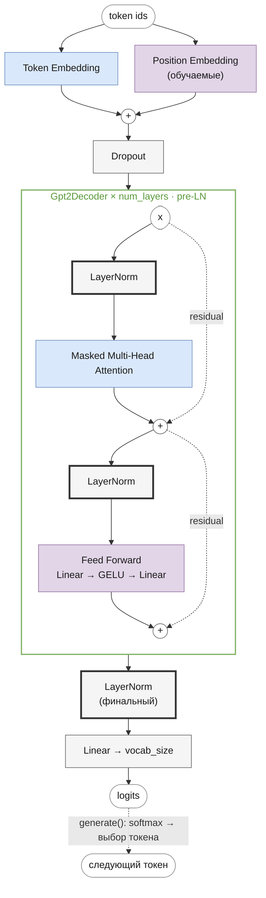

# GPT-2

> Реализация: [`llm/src/llm/models/gpt/gpt2.py`](../llm/src/llm/models/gpt/gpt2.py) · класс `GPT2`
> Ноутбук: [`notebooks/gpt2.ipynb`](../notebooks/gpt2.ipynb)

Место в линейке: [GPT-1](gpt.md) → **GPT-2** → [LLaMA](llama.md) → [Mistral](mistral.md) → [Mixtral](mixtral.md) · [Gemma](gemma.md)

## Обзор

GPT-2 (Radford et al., [*"Language Models are Unsupervised Multitask Learners"*](https://cdn.openai.com/better-language-models/language_models_are_unsupervised_multitask_learners.pdf), OpenAI 2019) отличается от GPT-1 не набором механизмов (эмбеддинги, MHA, GELU-FFN — те же), а их **расстановкой**: нормализация переносится с "после residual" на "до sub-layer" (**pre-LN**). Pre-LN даёт более стабильные градиенты на глубоких стеках и позволяет обучать заметно более крупные модели (GPT-2 — от 117M до 1.5B параметров).

## Архитектура блока декодера


```mermaid
%%{init: {"flowchart": {"rankSpacing": 28, "nodeSpacing": 28}}}%%
flowchart TB
    Ids(["token ids"]):::io --> TokEmb["Token Embedding"]:::blue
    Ids --> PosEmb["Position Embedding<br/>(обучаемые)"]:::purple
    TokEmb --> Sum(("+")):::add
    PosEmb --> Sum
    Sum --> Drop["Dropout"]:::gray
    subgraph Dec["Gpt2Decoder × num_layers · pre-LN"]
        direction TB
        X(["x"]):::io --> N1["LayerNorm"]:::grayHl
        N1 --> Attn["Masked Multi-Head Attention"]:::blue
        Attn --> A1(("+")):::add
        X -. residual .-> A1
        A1 --> N2["LayerNorm"]:::grayHl
        N2 --> FFN["Feed Forward<br/>Linear → GELU → Linear"]:::purple
        FFN --> A2(("+")):::add
        A1 -. residual .-> A2
    end
    Drop --> Dec
    Dec --> NF["LayerNorm<br/>(финальный)"]:::grayHl --> Lin
    Lin["Linear → vocab_size"]:::gray --> Out(["logits"]):::io
    Out -. "generate(): softmax → выбор токена" .-> Next(["следующий токен"]):::io
    style Dec fill:transparent,stroke:#82b366,stroke-width:2px,color:#5b9a3c

    classDef io fill:#ffffff,stroke:#999999,color:#1a1a1a;
    classDef add fill:#ffffff,stroke:#666666,color:#1a1a1a;
    classDef blue fill:#dae8fc,stroke:#6c8ebf,color:#1a1a1a;
    classDef blueHl fill:#dae8fc,stroke:#2f5f9e,stroke-width:3px,color:#1a1a1a;
    classDef purple fill:#e1d5e7,stroke:#9673a6,color:#1a1a1a;
    classDef purpleHl fill:#e1d5e7,stroke:#6a3d85,stroke-width:3px,color:#1a1a1a;
    classDef gray fill:#f5f5f5,stroke:#666666,color:#1a1a1a;
    classDef grayHl fill:#f5f5f5,stroke:#333333,stroke-width:3px,color:#1a1a1a;
    classDef gold fill:#fff2cc,stroke:#d6b656,color:#1a1a1a;
    classDef rope fill:#d5f0ec,stroke:#3a9e8f,color:#1a1a1a;
    classDef ropeHl fill:#d5f0ec,stroke:#1f6f63,stroke-width:3px,color:#1a1a1a;
    classDef dim fill:#f5f5f5,stroke:#bbbbbb,color:#999999,stroke-dasharray:4 3;
```

## Компоненты

| Компонент | Класс | Файл |
|---|---|---|
| Токен-эмбеддинги | `TokenEmbeddings` | [`core/token_embeddings.py`](../llm/src/llm/core/token_embeddings.py) |
| Позиционные эмбеддинги | `PositionalEmbeddings` (обучаемые, абсолютные — как в GPT-1) | [`core/positional_embeddings.py`](../llm/src/llm/core/positional_embeddings.py) |
| Attention | `MultiHeadAttention` (тот же класс, что и в GPT-1) | [`core/multi_head_attention.py`](../llm/src/llm/core/multi_head_attention.py) |
| FFN | GELU MLP (tanh-аппроксимация GELU, `activation="gelu_tanh"` — как в оригинальном коде OpenAI; в HF — `gelu_new`), зашит внутри декодера (не параметризуется извне) | [`core/gpt2_decoder.py`](../llm/src/llm/core/gpt2_decoder.py) |
| Блок декодера | `Gpt2Decoder` (**pre-LN**) | [`core/gpt2_decoder.py`](../llm/src/llm/core/gpt2_decoder.py) |
| Модель целиком | `GPT2` | [`models/gpt/gpt2.py`](../llm/src/llm/models/gpt/gpt2.py) |

`Gpt2Decoder.forward`:
```
norm1_out = Norm1(x)
attn_out  = Attention(norm1_out)
out       = attn_out + x
norm2_out = Norm2(out)
ffn_out   = FFN(norm2_out)
result    = ffn_out + out
```

В отличие от GPT-1, `GPT2.forward` добавляет финальный `nn.LayerNorm` **после** стека декодеров и **перед** проекцией на словарь ([`models/gpt/gpt2.py`](../llm/src/llm/models/gpt/gpt2.py)) — стандартная практика pre-LN трансформеров (без неё выход последнего блока не нормализован).

`Gpt2Decoder` — самостоятельный класс, а не переиспользование параметризуемого `CachedDecoder` (которым, например, пользуются LLaMA и другие более новые архитектуры в этом репозитории): FFN и pre-LN расстановка захардкожены внутри него.

## Конфигурация

Пример из [`experiments/llm_only/configs/gpt2_train.json`](../experiments/llm_only/configs/gpt2_train.json) — набор параметров идентичен GPT-1:

| Параметр | Значение в примере | Смысл |
|---|---|---|
| `vocab_size` | (из токенизатора) | размер словаря |
| `embed_dim` | 256 | размерность эмбеддингов |
| `num_heads` | 4 | число attention-голов |
| `num_layers` | 4 | число блоков `Gpt2Decoder` |
| `max_position_embeddings` | 128 | максимальная длина последовательности |
| `dropout` | 0.1 | dropout на эмбеддингах и на выходах attention и FFN перед residual |
| `attention_dropout` | (нет в примере) | необязательный dropout на весах внимания после softmax, по умолчанию `0.0`; в HF — `attn_pdrop = 0.1` |
| `initializer_range` | (нет в примере) | необязательное стандартное отклонение начальных весов, по умолчанию `0.02` |
| `tie_word_embeddings` | (нет в примере) | необязательный: `true` — выходная проекция без bias делит веса с `wte`, как в оригинале и HF (см. ниже); по умолчанию `false` — отдельный `Linear` с bias |

### Инициализация весов

Как в GPT-1 ([gpt.md](gpt.md#инициализация-весов)), веса `Linear` и `Embedding` — N(0, 0.02), bias — нули. Дополнительно выходные проекции, которые пишут в residual-поток, — выход attention и второй слой FFN, по две на блок, — инициализируются N(0, 0.02 / √(2·num_layers)). Статья GPT-2 (разд. 2.3) масштабирует веса residual-слоёв на 1/√N, чтобы дисперсия residual-потока не росла с глубиной; `N = 2·num_layers` — как в `GPT2PreTrainedModel._init_weights` в HuggingFace. В коде OpenAI `wpe` инициализируется с 0.01, здесь, как в HF, — 0.02.

### Weight tying и веса OpenAI

В оригинале (`gpt-2/src/model.py`: `tf.matmul(h, wte, transpose_b=True)`) и в HF (`GPT2LMHeadModel`) выходная проекция — та же матрица, что `wte`, без bias. Здесь это ключ `"tie_word_embeddings": true`, как в GPT-1 ([gpt.md](gpt.md#weight-tying-и-веса-openai)). Для конфигурации 124M он экономит около 38,6M параметров (`50257 · 768` плюс bias): 124,4M вместо 163,1M.

С ним загружаются веса [`openai-community/gpt2`](https://huggingface.co/openai-community/gpt2):

```python
from transformers import GPT2LMHeadModel
from llm.models.gpt import GPT2, convert_hf_state_dict

hf = GPT2LMHeadModel.from_pretrained("openai-community/gpt2")
model = GPT2({"vocab_size": 50257, "embed_dim": 768, "num_heads": 12, "num_layers": 12,
              "max_position_embeddings": 1024, "dropout": 0.0, "tie_word_embeddings": True})
model.load_state_dict(convert_hf_state_dict(hf.state_dict()))
```

Логиты совпадают с HF с точностью до ~1e-4 (при значениях логитов порядка 100), greedy-генерация — токен в токен.

## Генерация

`GPT2.generate(...)` — та же унифицированная сигнатура, что у всех моделей репозитория (см. [gpt.md](gpt.md#генерация)).

## Что изменилось в LLaMA

- обучаемые абсолютные позиционные эмбеддинги → **RoPE** (относительное, ротационное позиционное кодирование, встроено в attention);
- `LayerNorm` → **RMSNorm**;
- GELU-FFN → **SwiGLU**;
- attention остаётся стандартным multi-head (см. [llama.md](llama.md#отличия-от-llama)) — GQA появится только в Mistral.

Подробности — в [llama.md](llama.md).

## Литература

Основная статья:

- Radford, Wu, Child, Luan, Amodei, Sutskever. *Language Models are Unsupervised Multitask Learners*. OpenAI, 2019. [PDF](https://cdn.openai.com/better-language-models/language_models_are_unsupervised_multitask_learners.pdf) (на arXiv не публиковалась)

Компоненты:

- Radford, Narasimhan, Salimans, Sutskever. *Improving Language Understanding by Generative Pre-Training*. OpenAI, 2018. [PDF](https://cdn.openai.com/research-covers/language-unsupervised/language_understanding_paper.pdf) (на arXiv не публиковалась)
- Xiong et al. *On Layer Normalization in the Transformer Architecture*. 2020. [arXiv:2002.04745](https://arxiv.org/abs/2002.04745) — почему pre-LN обучается стабильнее post-LN
- Hendrycks, Gimpel. *Gaussian Error Linear Units (GELUs)*. 2016. [arXiv:1606.08415](https://arxiv.org/abs/1606.08415)
- Ba, Kiros, Hinton. *Layer Normalization*. 2016. [arXiv:1607.06450](https://arxiv.org/abs/1607.06450)
