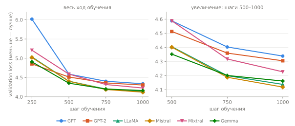
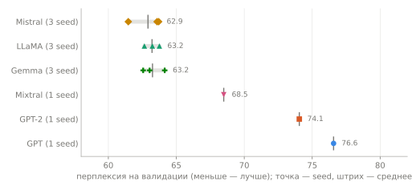

# Бенчмарк архитектур
<!-- description: Все шесть моделей на одном корпусе в одинаковых условиях: графики и таблицы перплексии, параметров и скорости, как повторить прогон. -->

[← Сохранение и загрузка](checkpoints.md) · [Оглавление](README.md)

Здесь все шесть моделей обучены на одном корпусе с одними и теми же параметрами обучения и общим размером около 5 млн параметров. Цель — увидеть, как архитектурные отличия (позиции, нормализация, FFN, внимание, MoE) влияют на качество и скорость **в малом масштабе**. Результаты воспроизводятся одной командой; цифры ниже — из реального прогона.

## Условия

| Что | Значение |
|---|---|
| Корпус | три романа (Булгаков, Достоевский), 2.7 МБ; 509 673 токена, словарь 4004; подготовка — в [Быстром старте](quickstart.md) |
| Данные | 3981 блок по 128 токенов для обучения, 99 блоков для проверки |
| Обучение | 1000 шагов × 32 блока, около 8 проходов по корпусу; AdamW, `lr` 0.001, warmup 5 %, линейный спад, `seed` 0 |
| Порядок батчей | один и тот же у всех моделей: его задаёт `seed` и номер эпохи |
| Размеры | `embed_dim` 256, 4 слоя, 4 головы, контекст 128, `dropout` 0.1 |
| Устройство | Apple Silicon, MPS |

Что подбирается под архитектуру, чтобы число параметров было сопоставимым:

- **Gated-FFN (LLaMA, Mistral, Gemma)** — `intermediate_size` 688 ≈ 8/3·d вместо 4·d, как в LLaMA: три матрицы SwiGLU или GeGLU весят столько же, сколько две матрицы GELU-FFN у GPT.
- **Mixtral** — 8 экспертов по `intermediate_size` 96, top-2, коэффициент load-balancing loss 0.01. Всего параметров столько же, сколько у остальных, но на токен работают 3.45 млн.
- **Mistral** — скользящее окно 32 позиции при контексте 128.
- **GQA и MQA** (Mistral, Gemma) по определению экономят на матрицах K и V, поэтому у них 4.97 и 4.83 млн параметров против 5.2 у остальных.

## Результаты

`seed` 0, один прогон на модель:

| Модель | Параметры | Активных на токен | Val loss | Перплексия | Время, с | Токенов/с |
|---|---|---|---|---|---|---|
| GPT | 5.25M | 5.25M | 4.338 | 76.6 | 97 | 42 109 |
| GPT-2 | 5.25M | 5.25M | 4.305 | 74.1 | 98 | 41 984 |
| LLaMA | 5.23M | 5.23M | 4.138 | 62.7 | 122 | 33 627 |
| Mistral | 4.97M | 4.97M | 4.119 | 61.5 | 114 | 35 816 |
| Mixtral | 5.23M | 3.45M | 4.227 | 68.5 | 1337 | 3 063 |
| Gemma | 4.83M | 4.83M | 4.161 | 64.1 | 142 | 28 801 |

Для сравнения: модель, которая ничего не знает, дала бы перплексию 4004 (размер словаря), а после 20 шагов все модели были на 810–870.


Лучшее место на рисунке — вверху справа: быстро и точно. Вертикальные отрезки у LLaMA, Mistral и Gemma — размах перплексии по трём `seed`; скорость — среднее по `seed`.

Валидационный loss по ходу обучения:



| Модель | шаг 250 | шаг 500 | шаг 750 | шаг 1000 |
|---|---|---|---|---|
| GPT | 6.017 | 4.588 | 4.402 | 4.338 |
| GPT-2 | 4.853 | 4.513 | 4.359 | 4.305 |
| LLaMA | 5.033 | 4.405 | 4.199 | 4.138 |
| Mistral | 5.020 | 4.401 | 4.188 | 4.119 |
| Mixtral | 5.210 | 4.588 | 4.318 | 4.227 |
| Gemma | 4.907 | 4.352 | 4.201 | 4.161 |

Во всех прогонах loss к концу ещё падал, так что лучшая точка совпадает с финальной.

### Насколько это шум

Три близкие модели прогнаны ещё на двух `seed` (меняются начальные веса и порядок батчей):

| Модель | seed 0 | seed 1 | seed 2 | среднее |
|---|---|---|---|---|
| LLaMA | 62.7 | 63.8 | 63.2 | 63.2 |
| Mistral | 61.5 | 63.6 | 63.7 | 62.9 |
| Gemma | 64.1 | 62.6 | 63.0 | 63.2 |



Разброс между `seed` у одной модели — около ±1 по перплексии, а различия между LLaMA, Mistral и Gemma того же порядка. **В нашем масштабе эти три модели неразличимы**, и порядок «Mistral лучше LLaMA» в таблице выше — случайность. GPT, GPT-2 и Mixtral прогнаны на одном `seed`, их отрыв (около 11–13 и 5 единиц) заметно больше наблюдаемого шума, но без повторов это оценка, а не доказанный факт.

## Что из этого следует

- **Семейство LLaMA ≈ 63.** RoPE, RMSNorm, pre-LN и gated-FFN дали заметно лучшую перплексию, чем GPT и GPT-2 (около 63 против 74–77), при том же числе параметров. Отличий между GPT и LLaMA несколько сразу (позиции, нормализация, место нормализации, активация FFN, смещения), поэтому приписать выигрыш одному из них эти данные не позволяют.
- **GPT-1 стартует медленно.** К шагу 250 у него loss 6.02, у GPT-2 4.85; вероятно, post-LN при `lr` 0.001 и коротком warmup раскачивается дольше (причину мы не проверяли), хотя к концу догоняет. `lr` в этом бенчмарке один на всех, для GPT-1 он не подбирался — с меньшим результат мог бы быть лучше.
- **Mixtral хуже плотных моделей при тех же параметрах.** 68.5 против 63 при равном общем числе параметров и 3.45 млн активных. Для малого масштаба это ожидаемо: у экспертов по 96 каналов, и, вероятно, им не хватает данных, чтобы специализироваться за 8 проходов по 2.7 МБ. Выигрыш MoE проявляется при большом числе параметров и больших данных, этот бенчмарк его не проверяет.
- **Окно Mistral на 32 из 128 позиций ничего не стоит.** Результат в пределах шума совпадает с LLaMA; на таких коротких контекстах окно почти не ограничивает.
- **Скорость.** GPT и GPT-2 быстрее всех (42 тысячи токенов в секунду), LLaMA и Mistral около 33–36, Gemma 29–33. Mixtral в 9–14 раз медленнее остальных: слой MoE в этой реализации — цикл по восьми экспертам на каждом слое, с `torch.where` и выбором токенов, на MPS это много мелких операций и синхронизаций (по коду, без профилирования). На CUDA картина может отличаться.

## Ограничения

- **Маленький корпус.** 2.7 МБ и 8 проходов: модели учат слова и обороты, не смысл (см. [Быстрый старт](quickstart.md)). Ранжирование архитектур на больших данных и больших моделях может отличаться.
- **Один `learning rate`.** Для честного сравнения он общий, но оптимальный у архитектур разный.
- **Время зависит от машины и её загрузки.** Замеры на MPS, с прогревом ядер перед замером, но без изоляции от других процессов; на другом устройстве цифры будут другими.
- **Токенизатор и корпус общие**, поэтому перплексии сравнимы между моделями, но не с публикациями на других данных.

## Повторить прогон

Корпус готовится, как в [Быстром старте](quickstart.md#1-корпус), затем:

```bash
uv run python experiments/llm_only/benchmark.py --data-dir data/novels --steps 1000
```

Весь прогон занимает около 35 минут, из них 22 — Mixtral на MPS. Результаты — в `checkpoints/benchmark/results.json` и `results.md`. Полезные аргументы:

| Аргумент | Значение |
|---|---|
| `--models` | подмножество из `gpt gpt2 llama mistral mixtral gemma`; без Mixtral прогон занимает около 10 минут |
| `--seed` | `seed` инициализации и порядка батчей; для оценки шума запустите несколько |
| `--steps`, `--batch-size`, `--lr`, `--warmup-ratio` | параметры обучения, одни на все модели |
| `--embed-dim`, `--num-layers`, `--num-heads`, `--block-size` | общие размеры; `intermediate_size` и число экспертов подбирать вручную в `model_config()` |
| `--device` | `auto` (cuda, mps, cpu), `cpu`, `mps`, `cuda` |

Скрипт [`benchmark.py`](../../experiments/llm_only/benchmark.py) печатает таблицу и записывает кривые валидационного loss; тот же `Trainer` и те же модели, что в [обучении](training.md).

### Обновить рисунки

Рисунки на этой странице строятся из сохранённых результатов [`docs/assets/benchmark/results.json`](../assets/benchmark/results.json) и сами ничего не обучают. После нового прогона (по одному запуску на `seed`) соберите данные и перестройте рисунки:

```bash
uv run python docs/tools/benchmark_data.py checkpoints/benchmark/results.json \
    checkpoints/benchmark/seed1/results.json checkpoints/benchmark/seed2/results.json
uv run python docs/tools/figures.py benchmark-loss benchmark-seeds benchmark-speed
```

Таблицы на странице заполняются вручную из `results.md`. CI сверяет рисунки с данными (`figures.py --check`), но не сами прогоны.

См. также: [Модели и конфиги](models.md) — ключи `intermediate_size`, `num_experts`, `window_size`; [учебник](../textbook/README.md) — как устроены эти архитектуры.
