# LLaMA

> Реализация: [`llm/src/llm/models/llama/llama.py`](../llm/src/llm/models/llama/llama.py) · класс `Llama`
> Ноутбук: [`notebooks/llama.ipynb`](../notebooks/llama.ipynb)

Место в линейке: [GPT-1](gpt.md) → [GPT-2](gpt2.md) → **LLaMA** → [Mistral](mistral.md) → [Mixtral](mixtral.md) · [Gemma](gemma.md)

## Обзор

LLaMA (Touvron et al., *"LLaMA: Open and Efficient Foundation Language Models"*, Meta 2023) вводит набор "индустриальных" приёмов, ставших де-факто стандартом для последующих open-weight LLM: RoPE вместо обучаемых позиционных эмбеддингов, RMSNorm вместо LayerNorm, SwiGLU вместо GELU. Реализация в этом репозитории переиспользует параметризуемый `CachedDecoder` (тот же класс, которым потенциально может пользоваться любая pre-LN архитектура), просто подставляя в него RMSNorm и SwiGLU вместо LayerNorm и GELU.

## Архитектура блока декодера

```mermaid
flowchart LR
    Tokens(["Tokens"]) --> TokEmb["Token Emb"]:::blue
    TokEmb --> N1["RMSNorm"]:::gray
    N1 --> Attn["Multi-Head Attention<br/>+ RoPE(Q,K)"]:::blue
    Attn --> A1(("+"))
    TokEmb -.->|residual| A1
    A1 --> N2["RMSNorm"]:::gray
    N2 --> FFN["SwiGLU"]:::purple
    FFN --> A2(("+"))
    A1 -.->|residual| A2
    A2 --> Dc2["Decoder"]:::green --> Dots(["⋯"]) --> Dc5["Decoder"]:::green --> NF["RMSNorm<br/>(финальный)"]:::gray --> Lin["Linear"]:::gray --> Soft["Softmax"]:::purple

    classDef blue fill:#dae8fc,stroke:#6c8ebf,color:#1a1a1a;
    classDef purple fill:#e1d5e7,stroke:#9673a6,color:#1a1a1a;
    classDef green fill:#d5e8d4,stroke:#82b366,color:#1a1a1a;
    classDef gray fill:#f5f5f5,stroke:#666666,color:#1a1a1a;
```



Обратите внимание: отдельного блока позиционных эмбеддингов на входе больше нет — позиция вносится через RoPE прямо внутри attention (вращением Q/K), а не сложением с эмбеддингом токена.

## Компоненты

| Компонент | Класс | Файл |
|---|---|---|
| Токен-эмбеддинги | `TokenEmbeddings` (без отдельных позиционных эмбеддингов) | [`core/token_embeddings.py`](../llm/src/llm/core/token_embeddings.py) |
| Позиционное кодирование | `RoPE` — вращение Q/K на угол, зависящий от позиции | [`core/rope.py`](../llm/src/llm/core/rope.py) |
| Нормализация | `RMSNorm` (pre-norm, оба sub-layer'а) | [`core/rms_norm.py`](../llm/src/llm/core/rms_norm.py) |
| FFN | `SwiGLU` (gated SiLU-MLP) | [`core/swi_glu.py`](../llm/src/llm/core/swi_glu.py) |
| Attention | `MultiHeadAttention` + RoPE | [`core/multi_head_attention.py`](../llm/src/llm/core/multi_head_attention.py) |
| Блок декодера | `CachedDecoder` (параметризован `norm_layer=RMSNorm`, `feed_forward_layer=SwiGLU(...)`) | [`core/cached_decoder.py`](../llm/src/llm/core/cached_decoder.py) |
| Модель целиком | `Llama` | [`models/llama/llama.py`](../llm/src/llm/models/llama/llama.py) |

`CachedDecoder.forward` (pre-LN, идентичен по структуре `Gpt2Decoder`):
```
norm1_out = Norm1(x)                 # RMSNorm
attn_out  = Attention(norm1_out)     # MHA + RoPE
out       = attn_out + x
norm2_out = Norm2(out)               # RMSNorm
ffn_out   = FFN(norm2_out)           # SwiGLU
result    = ffn_out + out
```

## Конфигурация

Пример из [`experiments/llm_only/configs/llama_train.json`](../experiments/llm_only/configs/llama_train.json):

| Параметр | Значение в примере | Смысл |
|---|---|---|
| `vocab_size` | (из токенизатора) | размер словаря |
| `embed_dim` | 256 | размерность эмбеддингов |
| `num_heads` | 4 | число attention-голов (используются одинаково для Q/K/V — см. ниже) |
| `num_layers` | 4 | число блоков `CachedDecoder` |
| `max_position_embeddings` | 128 | максимальная длина последовательности (и буфер RoPE cos/sin) |
| `dropout` | 0.1 | dropout в attention и FFN |

## ⚠️ Известное расхождение с докстрингом

Докстринг класса `Llama` (и README проекта) описывает **Grouped Query Attention** (`num_q_heads`/`num_kv_heads`) как часть архитектуры LLaMA в этом репозитории. Фактическая реализация ([`llama.py:78-101`](../llm/src/llm/models/llama/llama.py)) читает из конфига только `num_heads` и строит обычный `MultiHeadAttention` через `CachedDecoder` — `GroupedQueryAttention` в `llama.py` не импортируется и не используется. Конфиг [`llama_train.json`](../experiments/llm_only/configs/llama_train.json) это подтверждает: там нет ключей `num_q_heads`/`num_kv_heads`, только `num_heads`.

Иными словами, фактически реализован **LLaMA-1** в его исходном виде (RoPE + RMSNorm + SwiGLU + обычный MHA, без GQA — GQA появилась только в LLaMA-2 70B), а не архитектура, описанная в докстринге. GQA в этом репозитории впервые реализована в [Mistral](mistral.md).

## Генерация

`Llama.generate(...)` — унифицированная сигнатура (см. [gpt.md](gpt.md#генерация)).

## Что изменилось в Mistral

- обычный MHA → **Grouped Query Attention** (раздельное число Q- и KV-голов);
- добавляется **Sliding Window Attention** (ограниченное окно контекста вместо полной causal-маски);
- RMSNorm, SwiGLU и RoPE остаются без изменений.

Подробности — в [mistral.md](mistral.md).
