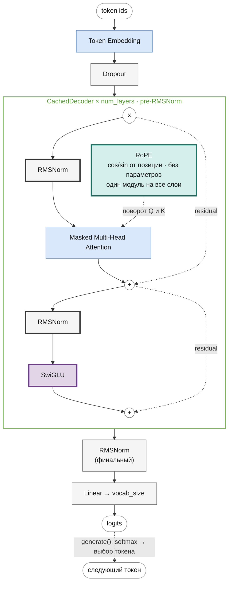
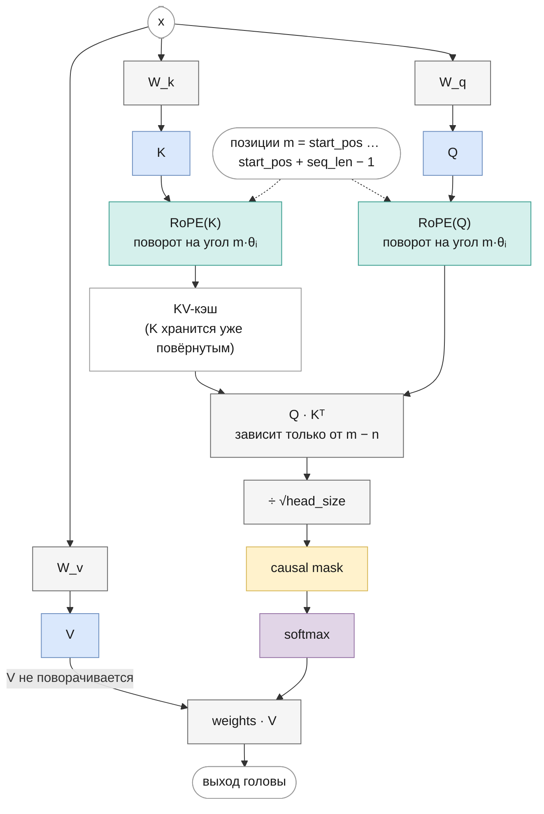

# LLaMA

> Реализация: [`llm/src/llm/models/llama/llama.py`](../llm/src/llm/models/llama/llama.py) · класс `Llama`
> Ноутбук: [`notebooks/llama.ipynb`](../notebooks/llama.ipynb)

Место в линейке: [GPT-1](gpt.md) → [GPT-2](gpt2.md) → **LLaMA** → [Mistral](mistral.md) → [Mixtral](mixtral.md) · [Gemma](gemma.md)

## Обзор

LLaMA (Touvron et al., [*"LLaMA: Open and Efficient Foundation Language Models"*](https://arxiv.org/abs/2302.13971), Meta 2023) вводит набор "индустриальных" приёмов, ставших де-факто стандартом для последующих open-weight LLM: RoPE ([Su et al., 2021](https://arxiv.org/abs/2104.09864)) вместо обучаемых позиционных эмбеддингов, RMSNorm ([Zhang & Sennrich, 2019](https://arxiv.org/abs/1910.07467)) вместо LayerNorm, SwiGLU ([Shazeer, 2020](https://arxiv.org/abs/2002.05202)) вместо GELU. Реализация в этом репозитории переиспользует параметризуемый `CachedDecoder` (тот же класс, которым потенциально может пользоваться любая pre-LN архитектура), просто подставляя в него RMSNorm и SwiGLU вместо LayerNorm и GELU.

## Архитектура блока декодера


```mermaid
%%{init: {"flowchart": {"rankSpacing": 28, "nodeSpacing": 28}}}%%
flowchart TB
    Ids(["token ids"]):::io --> TokEmb["Token Embedding"]:::blue
    TokEmb --> Drop["Dropout"]:::gray
    subgraph Dec["CachedDecoder × num_layers · pre-RMSNorm"]
        direction TB
        X(["x"]):::io --> N1["RMSNorm"]:::grayHl
        N1 --> Attn["Masked Multi-Head Attention"]:::blue
        R["RoPE<br/>cos/sin от позиции · без параметров<br/>один модуль на все слои"]:::ropeHl
        R -. "поворот Q и K" .-> Attn
        Attn --> A1(("+")):::add
        X -. residual .-> A1
        A1 --> N2["RMSNorm"]:::grayHl
        N2 --> FFN["SwiGLU"]:::purpleHl
        FFN --> A2(("+")):::add
        A1 -. residual .-> A2
    end
    Drop --> Dec
    Dec --> NF["RMSNorm<br/>(финальный)"]:::gray --> Lin
    Lin["Linear → vocab_size"]:::gray --> Out(["logits"]):::io
    Out -. "generate(): softmax → выбор токена" .-> Next(["следующий токен"]):::io
    style Dec fill:transparent,stroke:#82b366,stroke-width:2px,color:#5b9a3c

    classDef io fill:#ffffff,stroke:#999999,color:#1a1a1a;
    classDef add fill:#ffffff,stroke:#666666,color:#1a1a1a;
    classDef blue fill:#dae8fc,stroke:#6c8ebf,color:#1a1a1a;
    classDef blueHl fill:#dae8fc,stroke:#2f5f9e,stroke-width:3px,color:#1a1a1a;
    classDef purple fill:#e1d5e7,stroke:#9673a6,color:#1a1a1a;
    classDef purpleHl fill:#e1d5e7,stroke:#6a3d85,stroke-width:3px,color:#1a1a1a;
    classDef gray fill:#f5f5f5,stroke:#666666,color:#1a1a1a;
    classDef grayHl fill:#f5f5f5,stroke:#333333,stroke-width:3px,color:#1a1a1a;
    classDef gold fill:#fff2cc,stroke:#d6b656,color:#1a1a1a;
    classDef rope fill:#d5f0ec,stroke:#3a9e8f,color:#1a1a1a;
    classDef ropeHl fill:#d5f0ec,stroke:#1f6f63,stroke-width:3px,color:#1a1a1a;
    classDef dim fill:#f5f5f5,stroke:#bbbbbb,color:#999999,stroke-dasharray:4 3;
```

Обратите внимание: отдельного блока позиционных эмбеддингов на входе больше нет. Позиция вносится через RoPE прямо внутри attention каждого слоя (поворотом Q и K), а не сложением с эмбеддингом токена, поэтому на схеме RoPE стоит сбоку и подключён к attention пунктиром, а не находится в основном потоке данных.

## Attention с RoPE

RoPE ([Su et al., 2021](https://arxiv.org/abs/2104.09864)) кодирует позицию не прибавлением вектора к эмбеддингу, как в GPT, а **поворотом** векторов Q и K внутри attention. Вектор каждой головы разбивается на пары координат `(x₂ᵢ, x₂ᵢ₊₁)`, и каждая пара поворачивается на угол `m·θᵢ`, где `m` — позиция токена:

```
[x'₂ᵢ  ]   [cos(m·θᵢ)  −sin(m·θᵢ)] [x₂ᵢ  ]
[x'₂ᵢ₊₁] = [sin(m·θᵢ)   cos(m·θᵢ)] [x₂ᵢ₊₁],     θᵢ = base^(−2i/head_size),  base = 10000
```

Зачем так:

- **Относительная позиция.** Скалярное произведение повёрнутых векторов `q_m · k_n` зависит только от разности `m − n`: attention «видит» расстояние между токенами, хотя каждый вектор поворачивается по своей абсолютной позиции.
- **Норма сохраняется.** Поворот не меняет длину векторов, поэтому масштаб `Q·Kᵀ` остаётся прежним.
- **Нет обучаемых параметров.** `RoPE` заранее вычисляет таблицы `cos`/`sin` размером `max_position_embeddings × head_size/2`. Один экземпляр создаётся в `Llama.__init__` и передаётся во все слои.
- **`V` не поворачивается:** позиция нужна, чтобы решить, *куда* смотреть (веса внимания), а не *что* забирать.


```mermaid
%%{init: {"flowchart": {"rankSpacing": 28, "nodeSpacing": 28}}}%%
flowchart TB
    X(["x"]):::io --> Wq["W_q"]:::gray --> Q["Q"]:::blue
    X --> Wk["W_k"]:::gray --> K["K"]:::blue
    X --> Wv["W_v"]:::gray --> V["V"]:::blue
    Pos(["позиции m = start_pos … start_pos + seq_len − 1"]):::io
    Q --> RQ["RoPE(Q)<br/>поворот на угол m·θᵢ"]:::rope
    K --> RK["RoPE(K)<br/>поворот на угол m·θᵢ"]:::rope
    Pos -.-> RQ
    Pos -.-> RK
    RQ --> QK["Q · Kᵀ<br/>зависит только от m − n"]:::gray
    RK --> KV["KV-кэш<br/>(K хранится уже повёрнутым)"]:::io
    KV --> QK
    QK --> Scale["÷ √head_size"]:::gray
    Scale --> Mask["causal mask"]:::gold
    Mask --> SM["softmax"]:::purple
    SM --> AV["weights · V"]:::gray
    V -- "V не поворачивается" --> AV
    AV --> O(["выход головы"]):::io

    classDef io fill:#ffffff,stroke:#999999,color:#1a1a1a;
    classDef add fill:#ffffff,stroke:#666666,color:#1a1a1a;
    classDef blue fill:#dae8fc,stroke:#6c8ebf,color:#1a1a1a;
    classDef blueHl fill:#dae8fc,stroke:#2f5f9e,stroke-width:3px,color:#1a1a1a;
    classDef purple fill:#e1d5e7,stroke:#9673a6,color:#1a1a1a;
    classDef purpleHl fill:#e1d5e7,stroke:#6a3d85,stroke-width:3px,color:#1a1a1a;
    classDef gray fill:#f5f5f5,stroke:#666666,color:#1a1a1a;
    classDef grayHl fill:#f5f5f5,stroke:#333333,stroke-width:3px,color:#1a1a1a;
    classDef gold fill:#fff2cc,stroke:#d6b656,color:#1a1a1a;
    classDef rope fill:#d5f0ec,stroke:#3a9e8f,color:#1a1a1a;
    classDef ropeHl fill:#d5f0ec,stroke:#1f6f63,stroke-width:3px,color:#1a1a1a;
    classDef dim fill:#f5f5f5,stroke:#bbbbbb,color:#999999,stroke-dasharray:4 3;
```

В коде ([`core/rope.py`](../llm/src/llm/core/rope.py)) `RoPE.forward(x, start_pos)` берёт строки таблиц `cos/sin[start_pos : start_pos + seq_len]`. При генерации с KV-кэшем `start_pos` равен длине кэша, а сам кэш хранит K уже повёрнутым, поэтому старые ключи не пересчитываются. Позиций дальше `max_position_embeddings` в таблицах нет — отсюда падение генерации за этой границей (см. [известные ограничения](README.md#известные-ограничения)).

Mistral, Mixtral и Gemma используют тот же класс `RoPE` и применяют его так же — к Q и K внутри своих вариантов attention.

## Компоненты

| Компонент | Класс | Файл |
|---|---|---|
| Токен-эмбеддинги | `TokenEmbeddings` (без отдельных позиционных эмбеддингов) | [`core/token_embeddings.py`](../llm/src/llm/core/token_embeddings.py) |
| Позиционное кодирование | `RoPE` — вращение Q/K на угол, зависящий от позиции | [`core/rope.py`](../llm/src/llm/core/rope.py) |
| Нормализация | `RMSNorm` (pre-norm, оба sub-layer'а) | [`core/rms_norm.py`](../llm/src/llm/core/rms_norm.py) |
| FFN | `SwiGLU` (gated SiLU-MLP) | [`core/swi_glu.py`](../llm/src/llm/core/swi_glu.py) |
| Attention | `MultiHeadAttention` + RoPE | [`core/multi_head_attention.py`](../llm/src/llm/core/multi_head_attention.py) |
| Блок декодера | `CachedDecoder` (параметризован `norm_layer=RMSNorm`, `feed_forward_layer=SwiGLU(...)`) | [`core/cached_decoder.py`](../llm/src/llm/core/cached_decoder.py) |
| Модель целиком | `Llama` | [`models/llama/llama.py`](../llm/src/llm/models/llama/llama.py) |

`CachedDecoder.forward` (pre-LN, идентичен по структуре `Gpt2Decoder`):
```
norm1_out = Norm1(x)                 # RMSNorm
attn_out  = Attention(norm1_out)     # MHA + RoPE
out       = attn_out + x
norm2_out = Norm2(out)               # RMSNorm
ffn_out   = FFN(norm2_out)           # SwiGLU
result    = ffn_out + out
```

## Конфигурация

Пример из [`experiments/llm_only/configs/llama_train.json`](../experiments/llm_only/configs/llama_train.json):

| Параметр | Значение в примере | Смысл |
|---|---|---|
| `vocab_size` | (из токенизатора) | размер словаря |
| `embed_dim` | 256 | размерность эмбеддингов |
| `num_heads` | 4 | число attention-голов (используются одинаково для Q/K/V — см. ниже) |
| `num_layers` | 4 | число блоков `CachedDecoder` |
| `max_position_embeddings` | 128 | максимальная длина последовательности (и буфер RoPE cos/sin) |
| `dropout` | 0.1 | dropout в attention и FFN |

## Известное расхождение с докстрингом

Раньше докстринг класса `Llama` и README проекта описывали **Grouped Query Attention** (`num_q_heads`/`num_kv_heads`) как часть LLaMA в этом репозитории. Фактически `Llama.__init__` читает из конфига только `num_heads` и строит обычный `MultiHeadAttention` через `CachedDecoder`; `GroupedQueryAttention` в `llama.py` не используется. Конфиг [`llama_train.json`](../experiments/llm_only/configs/llama_train.json) это подтверждает: там только `num_heads`. Докстринг и README исправлены под реализацию.

Иными словами, реализован **LLaMA-1** в исходном виде (RoPE + RMSNorm + SwiGLU + обычный MHA; GQA появилась только в LLaMA-2 70B). GQA в этом репозитории впервые реализована в [Mistral](mistral.md).

Ещё два отличия от оригинала: все `Linear`-слои (Q/K/V, выходная проекция attention, голова на словарь) созданы с bias, а dropout применяется в attention и FFN.

## Генерация

`Llama.generate(...)` — унифицированная сигнатура (см. [gpt.md](gpt.md#генерация)).

## Что изменилось в Mistral

- обычный MHA → **Grouped Query Attention** (раздельное число Q- и KV-голов);
- добавляется **Sliding Window Attention** (ограниченное окно контекста вместо полной causal-маски);
- RMSNorm, SwiGLU и RoPE остаются без изменений.

Подробности — в [mistral.md](mistral.md).

## Литература

Основная статья:

- Touvron et al. *LLaMA: Open and Efficient Foundation Language Models*. 2023. [arXiv:2302.13971](https://arxiv.org/abs/2302.13971)

Компоненты:

- Su et al. *RoFormer: Enhanced Transformer with Rotary Position Embedding*. 2021. [arXiv:2104.09864](https://arxiv.org/abs/2104.09864)
- Zhang, Sennrich. *Root Mean Square Layer Normalization*. 2019. [arXiv:1910.07467](https://arxiv.org/abs/1910.07467)
- Shazeer. *GLU Variants Improve Transformer*. 2020. [arXiv:2002.05202](https://arxiv.org/abs/2002.05202) — SwiGLU и GeGLU
- Touvron et al. *Llama 2: Open Foundation and Fine-Tuned Chat Models*. 2023. [arXiv:2307.09288](https://arxiv.org/abs/2307.09288) — GQA в линейке LLaMA появляется здесь (модель 70B)
