# Mistral

> Реализация: [`llm/src/llm/models/mistral/mistral.py`](../llm/src/llm/models/mistral/mistral.py) · класс `Mistral`
> Ноутбук: [`notebooks/mistral.ipynb`](../notebooks/mistral.ipynb)

Место в линейке: [GPT-1](gpt.md) → [GPT-2](gpt2.md) → [LLaMA](llama.md) → **Mistral** → [Mixtral](mixtral.md) · [Gemma](gemma.md)

## Обзор

Mistral 7B (Mistral AI, 2023, [arXiv:2310.06825](https://arxiv.org/abs/2310.06825)) добавляет к LLaMA-подобному стеку (RoPE + RMSNorm + SwiGLU) два приёма для эффективного инференса на длинных последовательностях: **Grouped Query Attention** (GQA) и **Sliding Window Attention**. Mixtral ([mixtral.md](mixtral.md)) — прямое продолжение этой архитектуры с заменой плотного FFN на Mixture-of-Experts.

## Архитектура блока декодера

```mermaid
flowchart LR
    Tokens(["Tokens"]) --> TokEmb["Token Emb"]:::blue
    TokEmb --> N1["RMSNorm"]:::gray
    N1 --> Attn["Grouped Query Attention<br/>+ RoPE + Sliding Window"]:::blueHl
    Attn --> A1(("+"))
    TokEmb -.->|residual| A1
    A1 --> N2["RMSNorm"]:::gray
    N2 --> FFN["SwiGLU"]:::purple
    FFN --> A2(("+"))
    A1 -.->|residual| A2
    A2 --> Dc2["Decoder"]:::green --> Dots(["⋯"]) --> Dc5["Decoder"]:::green --> NF["RMSNorm<br/>(финальный)"]:::gray --> Lin["Linear"]:::gray --> Soft["Softmax"]:::purple

    classDef blue fill:#dae8fc,stroke:#6c8ebf,color:#1a1a1a;
    classDef blueHl fill:#dae8fc,stroke:#4a7ebf,stroke-width:3px,color:#1a1a1a;
    classDef purple fill:#e1d5e7,stroke:#9673a6,color:#1a1a1a;
    classDef green fill:#d5e8d4,stroke:#82b366,color:#1a1a1a;
    classDef gray fill:#f5f5f5,stroke:#666666,color:#1a1a1a;
```



### Grouped Query Attention

Вместо одинакового числа голов для Q и K/V, GQA использует **больше** Q-голов, чем KV-голов: K/V вычисляются один раз на группу и переиспользуются (`repeat`) для нескольких Q-голов. Это сокращает размер KV-кэша и объём вычислений в K/V-проекциях, почти не теряя в качестве по сравнению с обычным MHA.

### Sliding Window Attention

Вместо полной causal-маски (токен видит вообще всё прошлое) используется маска с ограниченным окном `window_size`: токен видит только последние `window_size` позиций. Это ограничивает объём вычислений на длинных последовательностях ценой явного лимита на дальность зависимостей внутри одного слоя (через стек слоёв эффективное поле видимости растёт линейно с числом слоёв, как в dilated/local attention).

## Компоненты

| Компонент | Класс | Файл |
|---|---|---|
| Токен-эмбеддинги | `TokenEmbeddings` | [`core/token_embeddings.py`](../llm/src/llm/core/token_embeddings.py) |
| Позиционное кодирование | `RoPE` | [`core/rope.py`](../llm/src/llm/core/rope.py) |
| Нормализация | `RMSNorm` | [`core/rms_norm.py`](../llm/src/llm/core/rms_norm.py) |
| Attention | `GroupedQueryAttention` (GQA + sliding window + RoPE) | [`core/group_query_attention.py`](../llm/src/llm/core/group_query_attention.py) |
| FFN | `SwiGLU` | [`core/swi_glu.py`](../llm/src/llm/core/swi_glu.py) |
| Блок декодера | `MistralDecoder` (pre-LN) | [`core/mistral_decoder.py`](../llm/src/llm/core/mistral_decoder.py) |
| Модель целиком | `Mistral` | [`models/mistral/mistral.py`](../llm/src/llm/models/mistral/mistral.py) |

`MistralDecoder.forward` — та же pre-LN схема, что у `CachedDecoder`/`Gpt2Decoder`:
```
norm1_out = RMSNorm1(x)
attn_out  = GQA(norm1_out)           # с RoPE и sliding-window маской
out       = attn_out + x
norm2_out = RMSNorm2(out)
ffn_out   = SwiGLU(norm2_out)
result    = ffn_out + out
```

## Конфигурация

Пример из [`experiments/llm_only/configs/mistral_train.json`](../experiments/llm_only/configs/mistral_train.json):

| Параметр | Значение в примере | Смысл |
|---|---|---|
| `vocab_size` | (из токенизатора) | размер словаря |
| `embed_dim` | 256 | размерность эмбеддингов |
| `num_q_heads` | 4 | число Query-голов |
| `num_kv_heads` | 2 | число Key/Value-голов (≤ `num_q_heads`, обычно кратно) |
| `head_size` | 64 | размерность одной attention-головы |
| `num_layers` | 4 | число блоков `MistralDecoder` |
| `max_position_embeddings` | 512 | максимальная длина последовательности |
| `window_size` | 16 | ширина скользящего окна внимания |
| `dropout` | 0.1 | dropout в attention и FFN |

В отличие от [Gemma](gemma.md#неиспользуемые-ключи-конфига), здесь все ключи конфига реально используются конструктором `Mistral.__init__`.

## Генерация

`Mistral.generate(...)` — унифицированная сигнатура (см. [gpt.md](gpt.md#генерация)).

## Что изменилось в Mixtral

- плотный `SwiGLU`-FFN → **Mixture-of-Experts** (несколько параллельных SwiGLU-экспертов + роутер, top-k активация на токен);
- GQA, sliding window, RoPE и RMSNorm остаются без изменений — блок декодера почти идентичен по структуре, отличие только в FFN-части.

Подробности — в [mixtral.md](mixtral.md).
