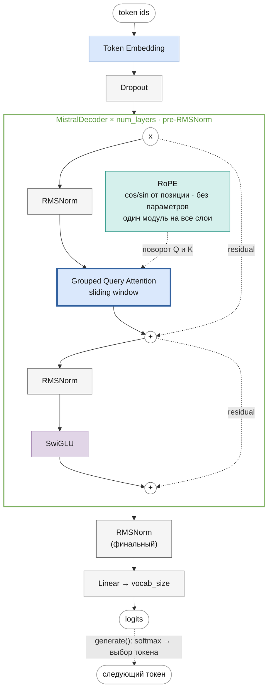

# Mistral

> Реализация: [`llm/src/llm/models/mistral/mistral.py`](../llm/src/llm/models/mistral/mistral.py) · класс `Mistral`
> Ноутбук: [`notebooks/mistral.ipynb`](../notebooks/mistral.ipynb)

Место в линейке: [GPT-1](gpt.md) → [GPT-2](gpt2.md) → [LLaMA](llama.md) → **Mistral** → [Mixtral](mixtral.md) · [Gemma](gemma.md)

## Обзор

Mistral 7B (Mistral AI, 2023, [arXiv:2310.06825](https://arxiv.org/abs/2310.06825)) добавляет к LLaMA-подобному стеку (RoPE + RMSNorm + SwiGLU) два приёма для эффективного инференса на длинных последовательностях: **Grouped Query Attention** (GQA) и **Sliding Window Attention**. Mixtral ([mixtral.md](mixtral.md)) — прямое продолжение этой архитектуры с заменой плотного FFN на Mixture-of-Experts.

## Архитектура блока декодера


```mermaid
%%{init: {"flowchart": {"rankSpacing": 28, "nodeSpacing": 28}}}%%
flowchart TB
    Ids(["token ids"]):::io --> TokEmb["Token Embedding"]:::blue
    TokEmb --> Drop["Dropout"]:::gray
    subgraph Dec["MistralDecoder × num_layers · pre-RMSNorm"]
        direction TB
        X(["x"]):::io --> N1["RMSNorm"]:::gray
        N1 --> Attn["Grouped Query Attention<br/>sliding window"]:::blueHl
        R["RoPE<br/>cos/sin от позиции · без параметров<br/>один модуль на все слои"]:::rope
        R -. "поворот Q и K" .-> Attn
        Attn --> A1(("+")):::add
        X -. residual .-> A1
        A1 --> N2["RMSNorm"]:::gray
        N2 --> FFN["SwiGLU"]:::purple
        FFN --> A2(("+")):::add
        A1 -. residual .-> A2
    end
    Drop --> Dec
    Dec --> NF["RMSNorm<br/>(финальный)"]:::gray --> Lin
    Lin["Linear → vocab_size"]:::gray --> Out(["logits"]):::io
    Out -. "generate(): softmax → выбор токена" .-> Next(["следующий токен"]):::io
    style Dec fill:transparent,stroke:#82b366,stroke-width:2px,color:#5b9a3c

    classDef io fill:#ffffff,stroke:#999999,color:#1a1a1a;
    classDef add fill:#ffffff,stroke:#666666,color:#1a1a1a;
    classDef blue fill:#dae8fc,stroke:#6c8ebf,color:#1a1a1a;
    classDef blueHl fill:#dae8fc,stroke:#2f5f9e,stroke-width:3px,color:#1a1a1a;
    classDef purple fill:#e1d5e7,stroke:#9673a6,color:#1a1a1a;
    classDef purpleHl fill:#e1d5e7,stroke:#6a3d85,stroke-width:3px,color:#1a1a1a;
    classDef gray fill:#f5f5f5,stroke:#666666,color:#1a1a1a;
    classDef grayHl fill:#f5f5f5,stroke:#333333,stroke-width:3px,color:#1a1a1a;
    classDef gold fill:#fff2cc,stroke:#d6b656,color:#1a1a1a;
    classDef rope fill:#d5f0ec,stroke:#3a9e8f,color:#1a1a1a;
    classDef ropeHl fill:#d5f0ec,stroke:#1f6f63,stroke-width:3px,color:#1a1a1a;
    classDef dim fill:#f5f5f5,stroke:#bbbbbb,color:#999999,stroke-dasharray:4 3;
```

Как RoPE поворачивает Q и K — в разделе [Attention с RoPE](llama.md#attention-с-rope) документа LLaMA.

### Grouped Query Attention

Механизм предложен в [Ainslie et al., 2023](https://arxiv.org/abs/2305.13245). Вместо одинакового числа голов для Q и K/V, GQA использует **больше** Q-голов, чем KV-голов: K/V вычисляются один раз на группу и переиспользуются (`repeat`) для нескольких Q-голов. Это сокращает размер KV-кэша и объём вычислений в K/V-проекциях, почти не теряя в качестве по сравнению с обычным MHA.

### Sliding Window Attention

Идея local attention со скользящим окном — из [Longformer](https://arxiv.org/abs/2004.05150). Вместо полной causal-маски (токен видит вообще всё прошлое) используется маска с ограниченным окном `window_size`: токен в позиции `i` видит позиции от `i − window_size` до `i` включительно, то есть `window_size + 1` позиций вместе с собой (подробнее — [ниже](#ширина-окна-w--1)). Это ограничивает объём вычислений на длинных последовательностях ценой явного лимита на дальность зависимостей внутри одного слоя (через стек слоёв эффективное поле видимости растёт линейно с числом слоёв, как в dilated/local attention).

**KV-кэш ограничен окном.** При генерации `GroupedQueryAttention` хранит в кэше только последние `window_size` позиций K и V (на каждом шаге новые K/V дописываются через `torch.cat`, и кэш обрезается срезом; кольцевого буфера с записью по индексу `pos % W`, как в эталонном коде Mistral, здесь нет): более старые токены всё равно не попадают в окно внимания, поэтому память кэша не растёт с длиной текста. Из-за обрезки длина кэша перестаёт совпадать с позицией токена, поэтому кэш — это тройка `(K, V, next_pos)`, где `next_pos` — абсолютная позиция следующего токена, которую RoPE использует как `start_pos`. Кэш из `window_size` ключей плюс новый токен дают то же окно `window_size + 1`, что и маска без кэша.

#### Ширина окна: W + 1

Здесь `W = window_size`. Реализация пропускает **W + 1** позиций: маска `i − j ≤ W` (включая сам токен). Источники определяют окно по-разному:

| Источник | Позиций видно (вместе с токеном) |
|---|---|
| [Статья Mistral 7B](https://arxiv.org/abs/2310.06825), раздел 2, текст: «attends to all hidden states from the previous layer with positions between i − W and i» | **W + 1** |
| Эталонный код Mistral AI ([`one_file_ref.py`](https://github.com/mistralai/mistral-inference/blob/147c4e68279b90eb61b19bdea44e16f5539d5a5d/one_file_ref.py)), prefill: `torch.triu(mask, diagonal=-sliding_window)` | **W + 1** |
| Статья, подпись к рисунку 1: «each token can attend to at most W tokens» | W |
| Статья, Rolling Buffer Cache: кэш фиксированного размера W, текущий токен тоже в нём | W |
| Эталонный код Mistral AI, генерация с кэшем (буфер из W ячеек) | W |
| HuggingFace Transformers (`sliding_window_overlay`: `kv_idx > q_idx − sliding_window`) | W |

Реализация следует тексту статьи и prefill в эталонном коде, причём одинаково с кэшем и без. **От HuggingFace она отличается на одну позицию**: при загрузке реальных весов Mistral или сравнении с `transformers` логиты не совпадут, пока окно не будет приведено к W. Для `window_size = 4096` (Mistral 7B) разница несущественна, для учебных конфигов с `window_size = 16` — около 6 %.

## Компоненты

| Компонент | Класс | Файл |
|---|---|---|
| Токен-эмбеддинги | `TokenEmbeddings` | [`core/token_embeddings.py`](../llm/src/llm/core/token_embeddings.py) |
| Позиционное кодирование | `RoPE` | [`core/rope.py`](../llm/src/llm/core/rope.py) |
| Нормализация | `RMSNorm` | [`core/rms_norm.py`](../llm/src/llm/core/rms_norm.py) |
| Attention | `GroupedQueryAttention` (GQA + sliding window + RoPE) | [`core/group_query_attention.py`](../llm/src/llm/core/group_query_attention.py) |
| FFN | `SwiGLU` | [`core/swi_glu.py`](../llm/src/llm/core/swi_glu.py) |
| Блок декодера | `MistralDecoder` (pre-LN) | [`core/mistral_decoder.py`](../llm/src/llm/core/mistral_decoder.py) |
| Модель целиком | `Mistral` | [`models/mistral/mistral.py`](../llm/src/llm/models/mistral/mistral.py) |

`MistralDecoder.forward` — та же pre-LN схема, что у `CachedDecoder`/`Gpt2Decoder`:
```
norm1_out = RMSNorm1(x)
attn_out  = GQA(norm1_out)           # с RoPE и sliding-window маской
out       = attn_out + x
norm2_out = RMSNorm2(out)
ffn_out   = SwiGLU(norm2_out)
result    = ffn_out + out
```

## Конфигурация

Пример из [`experiments/llm_only/configs/mistral_train.json`](../experiments/llm_only/configs/mistral_train.json):

| Параметр | Значение в примере | Смысл |
|---|---|---|
| `vocab_size` | (из токенизатора) | размер словаря |
| `embed_dim` | 256 | размерность эмбеддингов |
| `num_q_heads` | 4 | число Query-голов |
| `num_kv_heads` | 2 | число Key/Value-голов; `num_q_heads` должно делиться на него |
| `head_size` | 64 | необязательный размер головы; по умолчанию `embed_dim // num_q_heads` (тогда `embed_dim` обязан делиться на `num_q_heads`). Если задан, `num_q_heads · head_size` может не совпадать с `embed_dim`; для RoPE — чётный |
| `num_layers` | 4 | число блоков `MistralDecoder` |
| `max_position_embeddings` | 512 | максимальная длина последовательности |
| `rms_norm_eps` | (нет в примере) | необязательный `eps` всех RMSNorm, по умолчанию `1e-6`; у Mistral 7B — `1e-5` |
| `rope_theta` | (нет в примере) | необязательная база частот RoPE, по умолчанию `10000` — как в Mistral 7B v0.1; что она задаёт — в [llama.md](llama.md#скорости-вращения-и-база-rope_theta) |
| `window_size` | 16 | ширина скользящего окна внимания |
| `dropout` | 0.1 | dropout после эмбеддингов и на выходах attention и FFN; в Mistral 7B dropout нет — для соответствия оригиналу `0` |

Все ключи используются конструктором `Mistral.__init__`. Неверные сочетания отклоняются с `ValueError` уже в конструкторе: `embed_dim`, не делящийся на `num_q_heads` без явного `head_size`, `num_q_heads`, не делящееся на `num_kv_heads`, нечётный `head_size`.

## Отличия от Mistral 7B

Подробности, воспроизведение и варианты исправления — в [бэклоге](backlog.md#mistral) (номера пунктов в скобках).

| | Mistral 7B | Здесь |
|---|---|---|
| Скрытый слой SwiGLU | `hidden_dim = 14336` при `dim = 4096` (3.5·d) | 4·d в каждой из трёх матриц (30) |
| Bias | нет ни в одной проекции | во всех `Linear` (24) |
| Dropout | нет | после эмбеддингов, на выходах attention и SwiGLU (51); `dropout: 0` убирает его полностью |
| Ширина окна | `W + 1` позиций в тексте статьи и prefill эталона, `W` в HF | `W + 1` (см. [выше](#ширина-окна-w--1)) |
| `eps` RMSNorm | `1e-5` | `1e-6` по умолчанию, задаётся ключом `rms_norm_eps` |
| KV-кэш | кольцевой буфер (запись по `pos % W`) | `torch.cat` и обрезка срезом; результат тот же |

## Генерация

`Mistral.generate(...)` — унифицированная сигнатура (см. [gpt.md](gpt.md#генерация)).

## Что изменилось в Mixtral

- плотный `SwiGLU`-FFN → **Mixture-of-Experts** (несколько параллельных SwiGLU-экспертов + роутер, top-k активация на токен);
- GQA, sliding window, RoPE и RMSNorm остаются без изменений — блок декодера почти идентичен по структуре, отличие только в FFN-части.

Подробности — в [mixtral.md](mixtral.md).

## Литература

Основная статья:

- Jiang et al. *Mistral 7B*. 2023. [arXiv:2310.06825](https://arxiv.org/abs/2310.06825)

Компоненты:

- Ainslie et al. *GQA: Training Generalized Multi-Query Transformer Models from Multi-Head Checkpoints*. 2023. [arXiv:2305.13245](https://arxiv.org/abs/2305.13245)
- Beltagy, Peters, Cohan. *Longformer: The Long-Document Transformer*. 2020. [arXiv:2004.05150](https://arxiv.org/abs/2004.05150) — sliding window attention
- Su et al. *RoFormer: Enhanced Transformer with Rotary Position Embedding*. 2021. [arXiv:2104.09864](https://arxiv.org/abs/2104.09864)
- Zhang, Sennrich. *Root Mean Square Layer Normalization*. 2019. [arXiv:1910.07467](https://arxiv.org/abs/1910.07467)
- Shazeer. *GLU Variants Improve Transformer*. 2020. [arXiv:2002.05202](https://arxiv.org/abs/2002.05202) — SwiGLU и GeGLU
