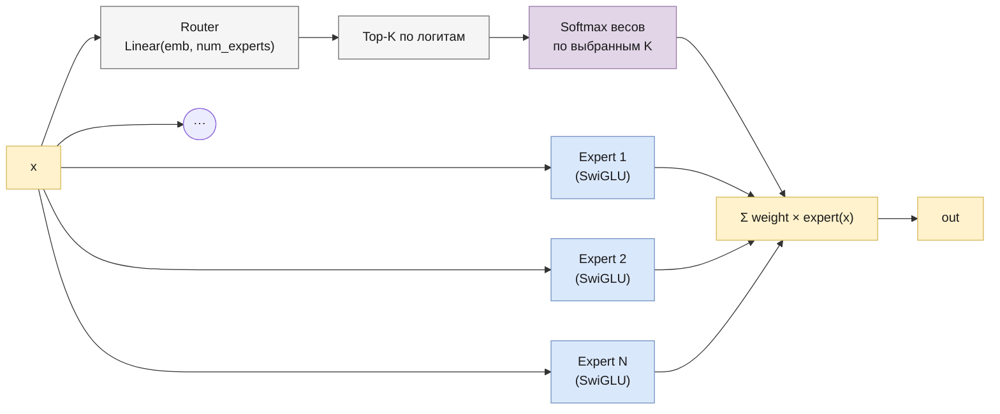

# Mixtral

> Реализация: [`llm/src/llm/models/mixtral/mixtral.py`](../llm/src/llm/models/mixtral/mixtral.py) · класс `Mixtral`
> Ноутбук: [`notebooks/mixstral.ipynb`](../notebooks/mixstral.ipynb) *(имя файла с опечаткой — модель называется Mixtral)*

Место в линейке: [GPT-1](gpt.md) → [GPT-2](gpt2.md) → [LLaMA](llama.md) → [Mistral](mistral.md) → **Mixtral** · [Gemma](gemma.md)

## Обзор

Mixtral 8x7B (Mistral AI, 2023) — это [Mistral](mistral.md) с одним структурным изменением: плотный `SwiGLU`-FFN заменён на **Mixture-of-Experts** (MoE) — несколько параллельных SwiGLU-экспертов, из которых на каждый токен активируется только небольшое подмножество (top-k). Attention-часть (GQA + sliding window + RoPE) не меняется вообще — Mixtral в этом репозитории буквально переиспользует `GroupedQueryAttention`.

## Архитектура блока декодера

```mermaid
flowchart LR
    Tokens(["Tokens"]) --> TokEmb["Token Emb"]:::blue
    TokEmb --> N1["RMSNorm"]:::gray
    N1 --> Attn["Grouped Query Attention<br/>+ RoPE + Sliding Window"]:::blue
    Attn --> A1(("+"))
    TokEmb -.->|residual| A1
    A1 --> N2["RMSNorm"]:::gray
    N2 --> MoE["MoE<br/>(top-k из N SwiGLU-экспертов)"]:::purpleHl
    MoE --> A2(("+"))
    A1 -.->|residual| A2
    A2 --> Dc2["Decoder"]:::green --> Dots(["⋯"]) --> Dc5["Decoder"]:::green --> NF["RMSNorm<br/>(финальный)"]:::gray --> Lin["Linear"]:::gray --> Soft["Softmax"]:::purple

    classDef blue fill:#dae8fc,stroke:#6c8ebf,color:#1a1a1a;
    classDef purple fill:#e1d5e7,stroke:#9673a6,color:#1a1a1a;
    classDef purpleHl fill:#e1d5e7,stroke:#7a4f91,stroke-width:3px,color:#1a1a1a;
    classDef green fill:#d5e8d4,stroke:#82b366,color:#1a1a1a;
    classDef gray fill:#f5f5f5,stroke:#666666,color:#1a1a1a;
```



### MoE изнутри



Механика [`MoE.forward`](../llm/src/llm/core/moe.py):
1. Роутер (`nn.Linear(emb_size, num_experts)`) выдаёт по одному логиту на эксперта для каждого токена.
2. Берутся `top_k_experts` экспертов с максимальными логитами (`torch.topk`), веса нормируются `softmax`-ом **только по выбранным K** (не по всем `num_experts`).
3. Каждый эксперт — самостоятельный блок `SwiGLU`. Эксперт, которого не выбрал ни один токен в батче, полностью пропускается (`if not expert_mask.any(): continue`) — реальная разреженность вычислений, а не маскирование после полного прохода через всех экспертов.
4. Результат — взвешенная сумма выходов выбранных экспертов на каждый токен.

## Компоненты

| Компонент | Класс | Файл |
|---|---|---|
| Токен-эмбеддинги | `TokenEmbeddings` | [`core/token_embeddings.py`](../llm/src/llm/core/token_embeddings.py) |
| Позиционное кодирование | `RoPE` | [`core/rope.py`](../llm/src/llm/core/rope.py) |
| Нормализация | `RMSNorm` | [`core/rms_norm.py`](../llm/src/llm/core/rms_norm.py) |
| Attention | `GroupedQueryAttention` (тот же класс, что у [Mistral](mistral.md)) | [`core/group_query_attention.py`](../llm/src/llm/core/group_query_attention.py) |
| FFN | `MoE` (top-k роутинг по `SwiGLU`-экспертам) | [`core/moe.py`](../llm/src/llm/core/moe.py) |
| Блок декодера | `MixtralDecoder` (pre-LN) | [`core/mixtral_decoder.py`](../llm/src/llm/core/mixtral_decoder.py) |
| Модель целиком | `Mixtral` | [`models/mixtral/mixtral.py`](../llm/src/llm/models/mixtral/mixtral.py) |

`MixtralDecoder.forward` — та же pre-LN схема, что у `MistralDecoder`, с заменой FFN на MoE:
```
norm1_out = RMSNorm1(x)
attn_out  = GQA(norm1_out)           # с RoPE и sliding-window маской
out       = attn_out + x
norm2_out = RMSNorm2(out)
ffn_out   = MoE(norm2_out)           # top-k из num_experts SwiGLU-блоков
result    = ffn_out + out
```

## Конфигурация

Пример из [`experiments/llm_only/configs/mixtral_train.json`](../experiments/llm_only/configs/mixtral_train.json) — все ключи реально используются `Mixtral.__init__` (в отличие от [Gemma](gemma.md#неиспользуемые-ключи-конфига)):

| Параметр | Значение в примере | Смысл |
|---|---|---|
| `vocab_size` | (из токенизатора) | размер словаря |
| `embed_dim` | 256 | размерность эмбеддингов |
| `num_q_heads` | 4 | число Query-голов |
| `num_kv_heads` | 2 | число Key/Value-голов |
| `head_size` | 64 | размерность одной attention-головы |
| `num_layers` | 4 | число блоков `MixtralDecoder` |
| `max_position_embeddings` | 512 | максимальная длина последовательности |
| `num_experts` | 8 | общее число экспертов MoE на слой |
| `top_k_experts` | 2 | сколько экспертов активируется на токен |
| `window_size` | 16 | ширина скользящего окна внимания |
| `dropout` | 0.1 | dropout в attention, FFN и MoE |

## Генерация

`Mixtral.generate(...)` — унифицированная сигнатура (см. [gpt.md](gpt.md#генерация)).
