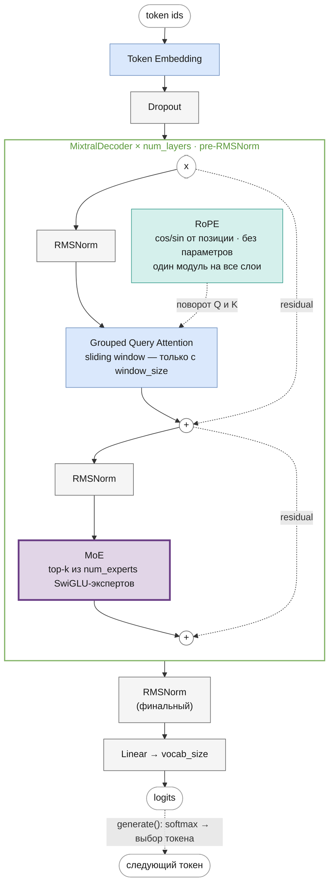

# Mixtral

> Реализация: [`llm/src/llm/models/mixtral/mixtral.py`](../llm/src/llm/models/mixtral/mixtral.py) · класс `Mixtral`
> Ноутбук: [`notebooks/mixstral.ipynb`](../notebooks/mixstral.ipynb) *(имя файла с опечаткой — модель называется Mixtral)*

Место в линейке: [GPT-1](gpt.md) → [GPT-2](gpt2.md) → [LLaMA](llama.md) → [Mistral](mistral.md) → **Mixtral** · [Gemma](gemma.md)

## Обзор

Mixtral 8x7B (Mistral AI, 2023, [arXiv:2401.04088](https://arxiv.org/abs/2401.04088)) — это [Mistral](mistral.md) с одним структурным изменением: плотный `SwiGLU`-FFN заменён на **Mixture-of-Experts** (MoE) — несколько параллельных SwiGLU-экспертов, из которых на каждый токен активируется только небольшое подмножество (top-k). Attention в оригинале — GQA + RoPE с плотным вниманием на весь контекст 32k: sliding window из Mistral 7B в Mixtral **не используется** (`sliding_window=None` в HF `MixtralConfig`). В этом репозитории Mixtral переиспользует `GroupedQueryAttention`; скользящее окно включается только ключом `window_size`, без него внимание плотное, как в оригинале.

## Архитектура блока декодера


```mermaid
%%{init: {"flowchart": {"rankSpacing": 28, "nodeSpacing": 28}}}%%
flowchart TB
    Ids(["token ids"]):::io --> TokEmb["Token Embedding"]:::blue
    TokEmb --> Drop["Dropout"]:::gray
    subgraph Dec["MixtralDecoder × num_layers · pre-RMSNorm"]
        direction TB
        X(["x"]):::io --> N1["RMSNorm"]:::gray
        N1 --> Attn["Grouped Query Attention<br/>sliding window — только с window_size"]:::blue
        R["RoPE<br/>cos/sin от позиции · без параметров<br/>один модуль на все слои"]:::rope
        R -. "поворот Q и K" .-> Attn
        Attn --> A1(("+")):::add
        X -. residual .-> A1
        A1 --> N2["RMSNorm"]:::gray
        N2 --> FFN["MoE<br/>top-k из num_experts SwiGLU-экспертов"]:::purpleHl
        FFN --> A2(("+")):::add
        A1 -. residual .-> A2
    end
    Drop --> Dec
    Dec --> NF["RMSNorm<br/>(финальный)"]:::gray --> Lin
    Lin["Linear → vocab_size"]:::gray --> Out(["logits"]):::io
    Out -. "generate(): softmax → выбор токена" .-> Next(["следующий токен"]):::io
    style Dec fill:transparent,stroke:#82b366,stroke-width:2px,color:#5b9a3c

    classDef io fill:#ffffff,stroke:#999999,color:#1a1a1a;
    classDef add fill:#ffffff,stroke:#666666,color:#1a1a1a;
    classDef blue fill:#dae8fc,stroke:#6c8ebf,color:#1a1a1a;
    classDef blueHl fill:#dae8fc,stroke:#2f5f9e,stroke-width:3px,color:#1a1a1a;
    classDef purple fill:#e1d5e7,stroke:#9673a6,color:#1a1a1a;
    classDef purpleHl fill:#e1d5e7,stroke:#6a3d85,stroke-width:3px,color:#1a1a1a;
    classDef gray fill:#f5f5f5,stroke:#666666,color:#1a1a1a;
    classDef grayHl fill:#f5f5f5,stroke:#333333,stroke-width:3px,color:#1a1a1a;
    classDef gold fill:#fff2cc,stroke:#d6b656,color:#1a1a1a;
    classDef rope fill:#d5f0ec,stroke:#3a9e8f,color:#1a1a1a;
    classDef ropeHl fill:#d5f0ec,stroke:#1f6f63,stroke-width:3px,color:#1a1a1a;
    classDef dim fill:#f5f5f5,stroke:#bbbbbb,color:#999999,stroke-dasharray:4 3;
```

Как RoPE поворачивает Q и K — в разделе [Attention с RoPE](llama.md#attention-с-rope) документа LLaMA.

### MoE изнутри


```mermaid
%%{init: {"flowchart": {"rankSpacing": 28, "nodeSpacing": 28}}}%%
flowchart TB
    X(["x · один токен"]):::io --> Router["Router<br/>Linear(emb_size → num_experts)"]:::gray
    Router --> TopK["top-k логитов<br/>k = top_k_experts"]:::gray
    TopK --> W["softmax по выбранным k<br/>→ веса w₁ … w_k"]:::purple
    TopK -- "индексы экспертов" --> Disp["dispatch:<br/>x → выбранные эксперты"]:::gray
    X --> Disp
    subgraph Experts[" "]
        direction LR
        E1["Expert 1<br/>(выбран)"]:::blue
        E2["Expert 2"]:::dim
        Ed["⋯"]:::dim
        En["Expert N<br/>(выбран)"]:::blue
    end
    Disp --> E1
    Disp --> En
    E1 --> Sum["Σ wᵢ · Expertᵢ(x)"]:::gold
    En --> Sum
    W --> Sum
    Sum --> Drop["Dropout"]:::gray --> Out(["out"]):::io
    style Experts fill:transparent,stroke:#6c8ebf,stroke-dasharray:4 3

    classDef io fill:#ffffff,stroke:#999999,color:#1a1a1a;
    classDef add fill:#ffffff,stroke:#666666,color:#1a1a1a;
    classDef blue fill:#dae8fc,stroke:#6c8ebf,color:#1a1a1a;
    classDef blueHl fill:#dae8fc,stroke:#2f5f9e,stroke-width:3px,color:#1a1a1a;
    classDef purple fill:#e1d5e7,stroke:#9673a6,color:#1a1a1a;
    classDef purpleHl fill:#e1d5e7,stroke:#6a3d85,stroke-width:3px,color:#1a1a1a;
    classDef gray fill:#f5f5f5,stroke:#666666,color:#1a1a1a;
    classDef grayHl fill:#f5f5f5,stroke:#333333,stroke-width:3px,color:#1a1a1a;
    classDef gold fill:#fff2cc,stroke:#d6b656,color:#1a1a1a;
    classDef rope fill:#d5f0ec,stroke:#3a9e8f,color:#1a1a1a;
    classDef ropeHl fill:#d5f0ec,stroke:#1f6f63,stroke-width:3px,color:#1a1a1a;
    classDef dim fill:#f5f5f5,stroke:#bbbbbb,color:#999999,stroke-dasharray:4 3;
```

Механика [`MoE.forward`](../llm/src/llm/core/moe.py):
1. Роутер (`nn.Linear(emb_size, num_experts)`) выдаёт по одному логиту на эксперта для каждого токена.
2. Берутся `top_k_experts` экспертов с максимальными логитами (`torch.topk`), веса нормируются `softmax`-ом **только по выбранным K** (не по всем `num_experts`).
3. Каждый эксперт — самостоятельный блок `SwiGLU` и обрабатывает только выбравшие его токены. Эксперт, которого не выбрал ни один токен в батче, не вызывается вовсе — реальная разреженность вычислений, а не маскирование после полного прохода через всех экспертов (см. [алгоритм](#алгоритм) ниже).
4. Результат — взвешенная сумма выходов выбранных экспертов на каждый токен.

Та же схема, что в статье (`Softmax(TopK(x·W_g))`) и в HF (softmax → top-k → перенормировка): результат совпадает с наивным циклом по токенам.

#### Алгоритм

Для одного токена `x` слой считает

```
y = Σ_{i ∈ TopK(l)} softmax(l_TopK)_i · Expert_i(x),     l = W_r · x
```

— взвешенную сумму выходов K экспертов из E. Наивно это цикл по токенам: для каждого — роутер, top-k и K вызовов экспертов. Так медленно: эксперт вызывается на одном векторе, а не на матрице. Поэтому [`MoE.forward`](../llm/src/llm/core/moe.py) идёт наоборот — **циклом по экспертам**, и каждый эксперт обрабатывает сразу все свои токены одним вызовом:

```
X = x.reshape(N, D)                          # N = batch · seq_len токенов, батч неважен
L = X @ W_r                                  # [N, E]  логиты роутера
topk_logits, topk_idx = topk(L, K)           # [N, K]  K лучших экспертов на токен
W = softmax(float32(topk_logits)).to(dtype) # [N, K]  веса, сумма по K равна 1
Y = zeros(N, D)
for e in 0 … E−1:
    tok, slot = where(topk_idx == e)         # токены, выбравшие e, и позиция e в их top-k
    if tok пуст: continue                    # эксперт никем не выбран — не считается
    Y.index_add_(0, tok, W[tok, slot, None] · Expert_e(X[tok]))
return dropout(Y).reshape(batch, seq_len, D)
```

- **Dispatch** — `where(topk_idx == e)`: индексы токенов, для которых `e` попал в top-k, и позиция `e` в их top-k (по ней берётся вес). В top-k одного токена эксперты не повторяются, поэтому токен встречается у эксперта не больше одного раза.
- **Combine** — `index_add_`: взвешенный выход эксперта прибавляется в строки его токенов. Каждый токен получает ровно K слагаемых — от своих экспертов.
- **Стоимость.** Каждый токен проходит через K экспертов из E, так что FFN-часть стоит примерно K/E от «все эксперты на все токены»: для Mixtral 8x7B (E = 8, K = 2) — четверть, при том что параметров FFN в 8 раз больше, чем у одного эксперта. Роутер (`D × E`) по сравнению с экспертами почти бесплатен.
- **Цикл по экспертам** на Python — E итераций на слой, а не N·K. Эксперты с малым числом токенов обрабатываются так же, одним вызовом; неравномерная загрузка на результат не влияет, но при обучении без [load-balancing loss](#load-balancing-loss) она может усиливаться.

Так же устроены `MixtralExperts.forward` в HuggingFace и `MoeLayer` в эталонном коде Mistral. Корректность проверяет тест против наивного цикла по токенам (`test_moe.py`).

#### Load-balancing loss

Роутер обучается вместе с экспертами, и без ограничений он склонен «схлопываться»: несколько экспертов получают всё больше токенов, учатся быстрее и становятся ещё привлекательнее, а остальные почти не обучаются — MoE вырождается в узкий плотный FFN. Против этого при обучении к loss языковой модели прибавляется вспомогательный loss (формулировка — [Switch Transformers](https://arxiv.org/abs/2101.03961), разд. 2.2; в HF Mixtral — `load_balancing_loss_func`; в самой статье Mixtral он не описан):

```
aux = E · Σ_k Σ_i f_{k,i} · P_i        по всем слоям MoE и всем (не паддинговым) токенам
```

- `f_{k,i}` — доля токенов, у которых эксперт `i` стоит на `k`-й позиции top-k (фактическая загрузка);
- `P_i` — средняя по токенам вероятность эксперта `i` по softmax роутера по всем E экспертам.

При равномерной загрузке и равномерных вероятностях `aux = K` (top-k); перекос его увеличивает. `f` — результат `topk` и не дифференцируем, градиент идёт через `P`: роутер учится снижать вероятность перегруженных экспертов.

В коде: `MoE` запоминает логиты роутера последнего прохода, `load_balancing_loss` в [`core/moe.py`](../llm/src/llm/core/moe.py) считает формулу (совпадает с HF до float), `Mixtral.auxiliary_loss()` возвращает `router_aux_loss_coef · aux`, а `Trainer` и `HFGPTAdapter` прибавляют его к loss при обучении (loss оценки — только языковой модели). Коэффициент задаётся ключом `router_aux_loss_coef`; по умолчанию `0` — loss выключен, как и в HF, где он включается `output_router_logits=True` (коэффициент там по умолчанию 0.001). Правый паддинг из `attention_mask` в статистику не входит.

## Компоненты

| Компонент | Класс | Файл |
|---|---|---|
| Токен-эмбеддинги | `TokenEmbeddings` | [`core/token_embeddings.py`](../llm/src/llm/core/token_embeddings.py) |
| Позиционное кодирование | `RoPE` | [`core/rope.py`](../llm/src/llm/core/rope.py) |
| Нормализация | `RMSNorm` | [`core/rms_norm.py`](../llm/src/llm/core/rms_norm.py) |
| Attention | `GroupedQueryAttention` (тот же класс, что у [Mistral](mistral.md)) | [`core/group_query_attention.py`](../llm/src/llm/core/group_query_attention.py) |
| FFN | `MoE` (top-k роутинг по `SwiGLU`-экспертам) | [`core/moe.py`](../llm/src/llm/core/moe.py) |
| Блок декодера | `MixtralDecoder` (pre-LN) | [`core/mixtral_decoder.py`](../llm/src/llm/core/mixtral_decoder.py) |
| Модель целиком | `Mixtral` | [`models/mixtral/mixtral.py`](../llm/src/llm/models/mixtral/mixtral.py) |

`MixtralDecoder.forward` — та же pre-LN схема, что у `MistralDecoder`, с заменой FFN на MoE:
```
norm1_out = RMSNorm1(x)
attn_out  = GQA(norm1_out)           # с RoPE; causal-маска, окно — только с window_size
out       = attn_out + x
norm2_out = RMSNorm2(out)
ffn_out   = MoE(norm2_out)           # top-k из num_experts SwiGLU-блоков
result    = ffn_out + out
```

## Отличия от Mixtral 8x7B

Реализация учебная и сознательно маленькая, но часть отличий от оригинала меняет поведение модели. Подробности, воспроизведение и варианты исправления — в [бэклоге](backlog.md#mixtral) (номера пунктов в скобках).

| | Mixtral 8x7B | Здесь |
|---|---|---|
| Внимание | плотное на весь контекст 32k | так же без ключа `window_size`; с ним — скользящее окно, как в Mistral 7B v0.1 (52) |
| База RoPE (`rope_theta`) | 1 000 000 | 10 000 по умолчанию, задаётся ключом `rope_theta` (53) |
| Скрытый слой эксперта | `hidden_dim = 14336` при `dim = 4096` (3.5·d) | 4·d по умолчанию; `intermediate_size: 14336` — как в оригинале (23, 30) |
| Bias | нет ни в одной проекции, включая роутер | во всех `Linear`, включая роутер, по умолчанию; `bias: false` — как в оригинале (24, 40) |
| Load-balancing loss | в HF-реализации при обучении (`output_router_logits=True`) | есть, ключ `router_aux_loss_coef`, по умолчанию выключен (37) |
| Dropout | нет | после эмбеддингов, в attention и один на выходе MoE (эксперты без собственного, 38); `dropout: 0` убирает его полностью |
| Softmax роутера | во float32 (HF, эталон Mistral) | так же, явно во float32 с приведением к dtype входа (54) |

## Конфигурация

Пример из [`experiments/llm_only/configs/mixtral_train.json`](../experiments/llm_only/configs/mixtral_train.json) — все ключи используются `Mixtral.__init__`; неверные сочетания (как у [Mistral](mistral.md#конфигурация), а также `top_k_experts` вне `1 … num_experts`) дают `ValueError` в конструкторе:

| Параметр | Значение в примере | Смысл |
|---|---|---|
| `vocab_size` | (из токенизатора) | размер словаря |
| `embed_dim` | 256 | размерность эмбеддингов |
| `num_q_heads` | 4 | число Query-голов |
| `num_kv_heads` | 2 | число Key/Value-голов |
| `head_size` | 64 | необязательный размер головы; по умолчанию `embed_dim // num_q_heads` (тогда `embed_dim` обязан делиться на `num_q_heads`). Если задан, `num_q_heads · head_size` может не совпадать с `embed_dim`; для RoPE — чётный |
| `num_layers` | 4 | число блоков `MixtralDecoder` |
| `max_position_embeddings` | 512 | максимальная длина последовательности |
| `rms_norm_eps` | (нет в примере) | необязательный `eps` всех RMSNorm, по умолчанию `1e-6`; у Mixtral 8x7B — `1e-5` |
| `rope_theta` | (нет в примере) | необязательная база частот RoPE, по умолчанию `10000`; у Mixtral 8x7B — `1e6` (медленнее вращение, рассчитано на контекст 32k, см. [llama.md](llama.md#скорости-вращения-и-база-rope_theta)) |
| `router_aux_loss_coef` | (нет в примере) | необязательный коэффициент [load-balancing loss](#load-balancing-loss) роутера, по умолчанию `0` — выключен; в HF при включении — `0.001` |
| `num_experts` | 8 | общее число экспертов MoE на слой |
| `top_k_experts` | 2 | сколько экспертов активируется на токен |
| `window_size` | (нет в примере) | необязательная ширина скользящего окна внимания, как в [Mistral](mistral.md#ширина-окна-w--1); без ключа окна нет — как в Mixtral 8x7B |
| `intermediate_size` | (нет в примере) | необязательный скрытый размер каждого эксперта SwiGLU, по умолчанию `4 · embed_dim`; у Mixtral 8x7B — `14336` |
| `bias` | (нет в примере) | необязательный: bias во всех `Linear`, включая роутер и экспертов, по умолчанию `true`; в Mixtral 8x7B — `false` |
| `dropout` | 0.1 | dropout после эмбеддингов, в attention и на выходе MoE (эксперты без собственного); в Mixtral 8x7B dropout нет — для соответствия оригиналу `0` |

## Загрузка весов HuggingFace

С ключами `intermediate_size` и `"bias": false` загружаются веса `MixtralForCausalLM` — той же функцией `convert_hf_state_dict`, что у [LLaMA](llama.md#загрузка-весов-huggingface) (реэкспорт в `llm.models.mixtral`); строки `q_proj` переставляются по `num_attention_heads`, `k_proj` — по `num_key_value_heads`; роутер `block_sparse_moe.gate` становится `_ff._router`, эксперты `w1`/`w3`/`w2` — `_gate`/`_up`/`_down`.

```python
from transformers import MixtralForCausalLM
from llm.models.mixtral import Mixtral, convert_hf_state_dict

hf = MixtralForCausalLM.from_pretrained(...)
c = hf.config
config = {"vocab_size": c.vocab_size, "embed_dim": c.hidden_size, "num_q_heads": c.num_attention_heads,
          "num_kv_heads": c.num_key_value_heads, "head_size": c.head_dim or c.hidden_size // c.num_attention_heads,
          "num_layers": c.num_hidden_layers, "max_position_embeddings": c.max_position_embeddings,
          "num_experts": c.num_local_experts, "top_k_experts": c.num_experts_per_tok,
          "dropout": 0.0, "rms_norm_eps": c.rms_norm_eps, "rope_theta": c.rope_theta,
          "intermediate_size": c.intermediate_size, "bias": False}
if c.sliding_window is not None:
    config["window_size"] = c.sliding_window - 1  # окно здесь на позицию шире, см. «Ширина окна: W + 1»
model = Mixtral(config)
model.load_state_dict(convert_hf_state_dict(hf.state_dict(), num_heads=c.num_attention_heads,
                                            num_kv_heads=c.num_key_value_heads))
```

Сверено со случайными `MixtralForCausalLM` из `transformers` (GQA, 4 эксперта, top-2, без окна): логиты совпадают до ~1e-5, greedy-генерация с KV-кэшем дольше окна — токен в токен (`llm/tests/models/test_mistral_mixtral_hf_parity.py`). Настоящие веса (Mixtral 8x7B — около 90 ГБ) для проверки слишком велики.

## Генерация

`Mixtral.generate(...)` — унифицированная сигнатура (см. [gpt.md](gpt.md#генерация)).

## Литература

Основная статья:

- Jiang et al. *Mixtral of Experts*. 2024. [arXiv:2401.04088](https://arxiv.org/abs/2401.04088)

Компоненты:

- Shazeer et al. *Outrageously Large Neural Networks: The Sparsely-Gated Mixture-of-Experts Layer*. 2017. [arXiv:1701.06538](https://arxiv.org/abs/1701.06538)
- Fedus, Zoph, Shazeer. *Switch Transformers: Scaling to Trillion Parameter Models with Simple and Efficient Sparsity*. 2021. [arXiv:2101.03961](https://arxiv.org/abs/2101.03961) — load-balancing loss для роутера
- Jiang et al. *Mistral 7B*. 2023. [arXiv:2310.06825](https://arxiv.org/abs/2310.06825)
- Ainslie et al. *GQA: Training Generalized Multi-Query Transformer Models from Multi-Head Checkpoints*. 2023. [arXiv:2305.13245](https://arxiv.org/abs/2305.13245)
- Beltagy, Peters, Cohan. *Longformer: The Long-Document Transformer*. 2020. [arXiv:2004.05150](https://arxiv.org/abs/2004.05150) — sliding window attention (в Mistral 7B; в Mixtral 8x7B не используется)
