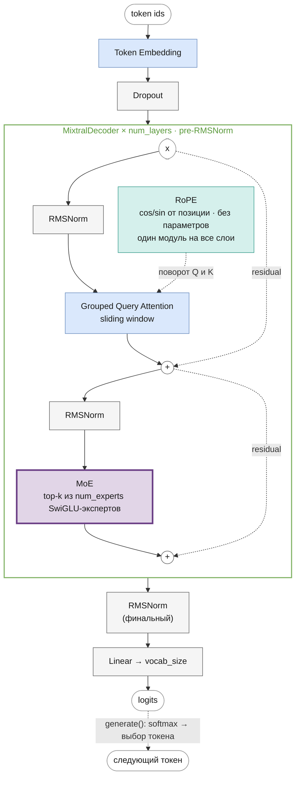
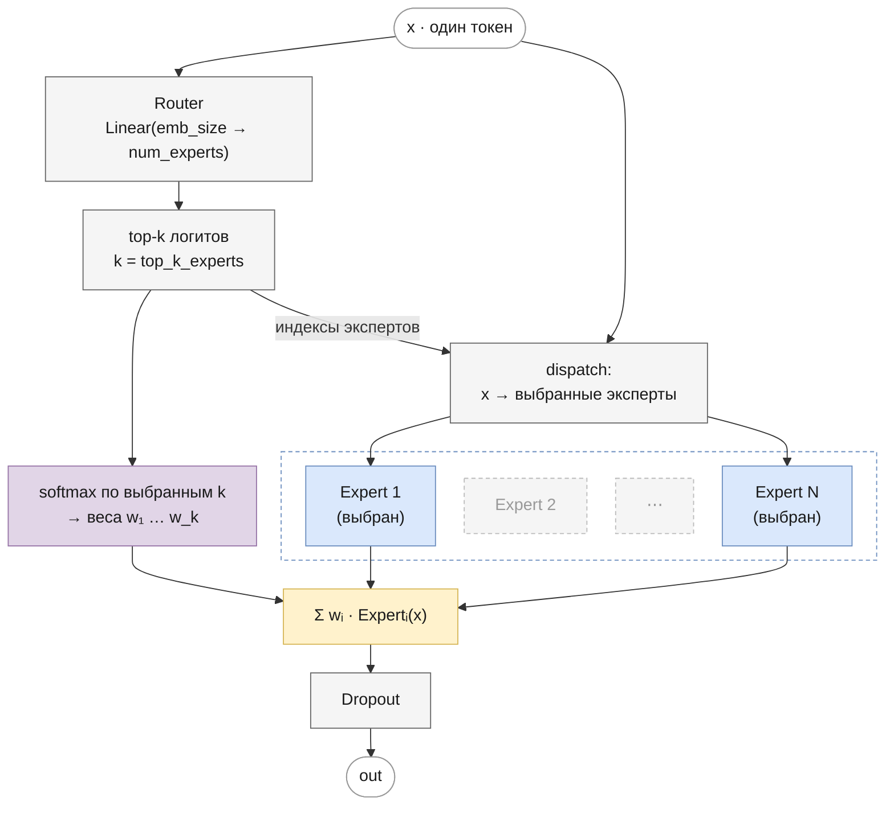

# Mixtral

> Реализация: [`llm/src/llm/models/mixtral/mixtral.py`](../llm/src/llm/models/mixtral/mixtral.py) · класс `Mixtral`
> Ноутбук: [`notebooks/mixstral.ipynb`](../notebooks/mixstral.ipynb) *(имя файла с опечаткой — модель называется Mixtral)*

Место в линейке: [GPT-1](gpt.md) → [GPT-2](gpt2.md) → [LLaMA](llama.md) → [Mistral](mistral.md) → **Mixtral** · [Gemma](gemma.md)

## Обзор

Mixtral 8x7B (Mistral AI, 2023, [arXiv:2401.04088](https://arxiv.org/abs/2401.04088)) — это [Mistral](mistral.md) с одним структурным изменением: плотный `SwiGLU`-FFN заменён на **Mixture-of-Experts** (MoE) — несколько параллельных SwiGLU-экспертов, из которых на каждый токен активируется только небольшое подмножество (top-k). Attention-часть (GQA + sliding window + RoPE) не меняется вообще — Mixtral в этом репозитории буквально переиспользует `GroupedQueryAttention`.

## Архитектура блока декодера


```mermaid
%%{init: {"flowchart": {"rankSpacing": 28, "nodeSpacing": 28}}}%%
flowchart TB
    Ids(["token ids"]):::io --> TokEmb["Token Embedding"]:::blue
    TokEmb --> Drop["Dropout"]:::gray
    subgraph Dec["MixtralDecoder × num_layers · pre-RMSNorm"]
        direction TB
        X(["x"]):::io --> N1["RMSNorm"]:::gray
        N1 --> Attn["Grouped Query Attention<br/>sliding window"]:::blue
        R["RoPE<br/>cos/sin от позиции · без параметров<br/>один модуль на все слои"]:::rope
        R -. "поворот Q и K" .-> Attn
        Attn --> A1(("+")):::add
        X -. residual .-> A1
        A1 --> N2["RMSNorm"]:::gray
        N2 --> FFN["MoE<br/>top-k из num_experts SwiGLU-экспертов"]:::purpleHl
        FFN --> A2(("+")):::add
        A1 -. residual .-> A2
    end
    Drop --> Dec
    Dec --> NF["RMSNorm<br/>(финальный)"]:::gray --> Lin
    Lin["Linear → vocab_size"]:::gray --> Out(["logits"]):::io
    Out -. "generate(): softmax → выбор токена" .-> Next(["следующий токен"]):::io
    style Dec fill:transparent,stroke:#82b366,stroke-width:2px,color:#5b9a3c

    classDef io fill:#ffffff,stroke:#999999,color:#1a1a1a;
    classDef add fill:#ffffff,stroke:#666666,color:#1a1a1a;
    classDef blue fill:#dae8fc,stroke:#6c8ebf,color:#1a1a1a;
    classDef blueHl fill:#dae8fc,stroke:#2f5f9e,stroke-width:3px,color:#1a1a1a;
    classDef purple fill:#e1d5e7,stroke:#9673a6,color:#1a1a1a;
    classDef purpleHl fill:#e1d5e7,stroke:#6a3d85,stroke-width:3px,color:#1a1a1a;
    classDef gray fill:#f5f5f5,stroke:#666666,color:#1a1a1a;
    classDef grayHl fill:#f5f5f5,stroke:#333333,stroke-width:3px,color:#1a1a1a;
    classDef gold fill:#fff2cc,stroke:#d6b656,color:#1a1a1a;
    classDef rope fill:#d5f0ec,stroke:#3a9e8f,color:#1a1a1a;
    classDef ropeHl fill:#d5f0ec,stroke:#1f6f63,stroke-width:3px,color:#1a1a1a;
    classDef dim fill:#f5f5f5,stroke:#bbbbbb,color:#999999,stroke-dasharray:4 3;
```

Как RoPE поворачивает Q и K — в разделе [Attention с RoPE](llama.md#attention-с-rope) документа LLaMA.

### MoE изнутри


```mermaid
%%{init: {"flowchart": {"rankSpacing": 28, "nodeSpacing": 28}}}%%
flowchart TB
    X(["x · один токен"]):::io --> Router["Router<br/>Linear(emb_size → num_experts)"]:::gray
    Router --> TopK["top-k логитов<br/>k = top_k_experts"]:::gray
    TopK --> W["softmax по выбранным k<br/>→ веса w₁ … w_k"]:::purple
    TopK -- "индексы экспертов" --> Disp["dispatch:<br/>x → выбранные эксперты"]:::gray
    X --> Disp
    subgraph Experts[" "]
        direction LR
        E1["Expert 1<br/>(выбран)"]:::blue
        E2["Expert 2"]:::dim
        Ed["⋯"]:::dim
        En["Expert N<br/>(выбран)"]:::blue
    end
    Disp --> E1
    Disp --> En
    E1 --> Sum["Σ wᵢ · Expertᵢ(x)"]:::gold
    En --> Sum
    W --> Sum
    Sum --> Drop["Dropout"]:::gray --> Out(["out"]):::io
    style Experts fill:transparent,stroke:#6c8ebf,stroke-dasharray:4 3

    classDef io fill:#ffffff,stroke:#999999,color:#1a1a1a;
    classDef add fill:#ffffff,stroke:#666666,color:#1a1a1a;
    classDef blue fill:#dae8fc,stroke:#6c8ebf,color:#1a1a1a;
    classDef blueHl fill:#dae8fc,stroke:#2f5f9e,stroke-width:3px,color:#1a1a1a;
    classDef purple fill:#e1d5e7,stroke:#9673a6,color:#1a1a1a;
    classDef purpleHl fill:#e1d5e7,stroke:#6a3d85,stroke-width:3px,color:#1a1a1a;
    classDef gray fill:#f5f5f5,stroke:#666666,color:#1a1a1a;
    classDef grayHl fill:#f5f5f5,stroke:#333333,stroke-width:3px,color:#1a1a1a;
    classDef gold fill:#fff2cc,stroke:#d6b656,color:#1a1a1a;
    classDef rope fill:#d5f0ec,stroke:#3a9e8f,color:#1a1a1a;
    classDef ropeHl fill:#d5f0ec,stroke:#1f6f63,stroke-width:3px,color:#1a1a1a;
    classDef dim fill:#f5f5f5,stroke:#bbbbbb,color:#999999,stroke-dasharray:4 3;
```

Механика [`MoE.forward`](../llm/src/llm/core/moe.py):
1. Роутер (`nn.Linear(emb_size, num_experts)`) выдаёт по одному логиту на эксперта для каждого токена.
2. Берутся `top_k_experts` экспертов с максимальными логитами (`torch.topk`), веса нормируются `softmax`-ом **только по выбранным K** (не по всем `num_experts`).
3. Каждый эксперт — самостоятельный блок `SwiGLU`. Эксперт, которого не выбрал ни один токен в батче, полностью пропускается (`if not expert_mask.any(): continue`) — реальная разреженность вычислений, а не маскирование после полного прохода через всех экспертов.
4. Результат — взвешенная сумма выходов выбранных экспертов на каждый токен.

> ⚠️ **Нет load-balancing loss.** В оригинальном Mixtral роутер обучается со вспомогательным loss, который выравнивает загрузку экспертов (формулировка — из [Switch Transformers](https://arxiv.org/abs/2101.03961), разд. 2.2). Здесь его нет: `MoE.forward` возвращает только выход, и при обучении роутер может свестись к нескольким «любимым» экспертам.

## Компоненты

| Компонент | Класс | Файл |
|---|---|---|
| Токен-эмбеддинги | `TokenEmbeddings` | [`core/token_embeddings.py`](../llm/src/llm/core/token_embeddings.py) |
| Позиционное кодирование | `RoPE` | [`core/rope.py`](../llm/src/llm/core/rope.py) |
| Нормализация | `RMSNorm` | [`core/rms_norm.py`](../llm/src/llm/core/rms_norm.py) |
| Attention | `GroupedQueryAttention` (тот же класс, что у [Mistral](mistral.md)) | [`core/group_query_attention.py`](../llm/src/llm/core/group_query_attention.py) |
| FFN | `MoE` (top-k роутинг по `SwiGLU`-экспертам) | [`core/moe.py`](../llm/src/llm/core/moe.py) |
| Блок декодера | `MixtralDecoder` (pre-LN) | [`core/mixtral_decoder.py`](../llm/src/llm/core/mixtral_decoder.py) |
| Модель целиком | `Mixtral` | [`models/mixtral/mixtral.py`](../llm/src/llm/models/mixtral/mixtral.py) |

`MixtralDecoder.forward` — та же pre-LN схема, что у `MistralDecoder`, с заменой FFN на MoE:
```
norm1_out = RMSNorm1(x)
attn_out  = GQA(norm1_out)           # с RoPE и sliding-window маской
out       = attn_out + x
norm2_out = RMSNorm2(out)
ffn_out   = MoE(norm2_out)           # top-k из num_experts SwiGLU-блоков
result    = ffn_out + out
```

## Конфигурация

Пример из [`experiments/llm_only/configs/mixtral_train.json`](../experiments/llm_only/configs/mixtral_train.json) — все ключи, кроме `head_size`, используются `Mixtral.__init__`:

| Параметр | Значение в примере | Смысл |
|---|---|---|
| `vocab_size` | (из токенизатора) | размер словаря |
| `embed_dim` | 256 | размерность эмбеддингов |
| `num_q_heads` | 4 | число Query-голов |
| `num_kv_heads` | 2 | число Key/Value-голов |
| `head_size` | 64 | ❌ не читается: размер головы всегда `embed_dim // num_q_heads` |
| `num_layers` | 4 | число блоков `MixtralDecoder` |
| `max_position_embeddings` | 512 | максимальная длина последовательности |
| `num_experts` | 8 | общее число экспертов MoE на слой |
| `top_k_experts` | 2 | сколько экспертов активируется на токен |
| `window_size` | 16 | ширина скользящего окна внимания |
| `dropout` | 0.1 | dropout в attention, FFN и MoE |

## Генерация

`Mixtral.generate(...)` — унифицированная сигнатура (см. [gpt.md](gpt.md#генерация)).

## Литература

Основная статья:

- Jiang et al. *Mixtral of Experts*. 2024. [arXiv:2401.04088](https://arxiv.org/abs/2401.04088)

Компоненты:

- Shazeer et al. *Outrageously Large Neural Networks: The Sparsely-Gated Mixture-of-Experts Layer*. 2017. [arXiv:1701.06538](https://arxiv.org/abs/1701.06538)
- Fedus, Zoph, Shazeer. *Switch Transformers: Scaling to Trillion Parameter Models with Simple and Efficient Sparsity*. 2021. [arXiv:2101.03961](https://arxiv.org/abs/2101.03961) — load-balancing loss для роутера
- Jiang et al. *Mistral 7B*. 2023. [arXiv:2310.06825](https://arxiv.org/abs/2310.06825)
- Ainslie et al. *GQA: Training Generalized Multi-Query Transformer Models from Multi-Head Checkpoints*. 2023. [arXiv:2305.13245](https://arxiv.org/abs/2305.13245)
- Beltagy, Peters, Cohan. *Longformer: The Long-Document Transformer*. 2020. [arXiv:2004.05150](https://arxiv.org/abs/2004.05150) — sliding window attention
