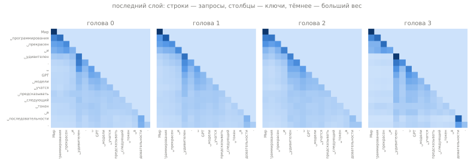
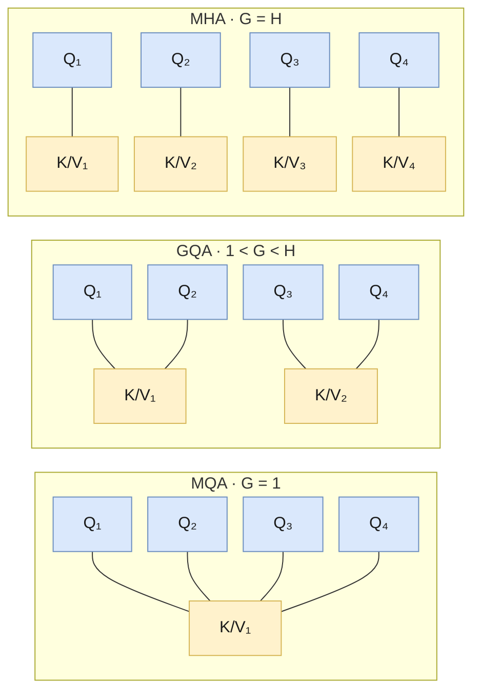
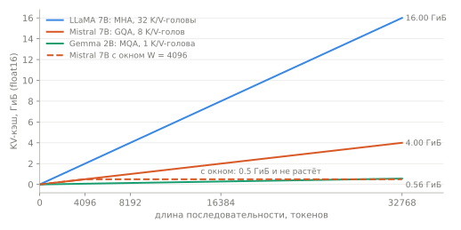

# Механизм внимания
<!-- description: Scaled dot-product и multi-head attention, MHA, GQA и MQA, скользящее окно и KV-кэш — с формулами и кодом. -->

Часть I · [← Позиционное кодирование](positional-encoding.md) · [Оглавление](README.md) · [Маски →](masks.md)

Внимание (attention) — центральная операция трансформера: именно через неё токены обмениваются информацией. Все остальные слои блока декодера (нормализация, FFN) обрабатывают каждую позицию отдельно. Все шесть моделей репозитория используют одно и то же causal self-attention и отличаются тремя независимыми «ручками»:

1. **сколько голов K/V** приходится на головы Q: MHA, GQA или MQA;
2. **какие позиции видит токен**: всё прошлое или только скользящее окно;
3. **как в attention попадает позиция**: через слагаемое к эмбеддингам (GPT) или поворотом Q и K (RoPE).

## Что вы узнаете

- Откуда взялось внимание и почему его описывают как «мягкий поиск по словарю» с запросами, ключами и значениями.
- Формулу scaled dot-product attention, вывод множителя $`1/\sqrt{d_h}`$ и что ломается без него.
- Как устроено многоголовое внимание (multi-head attention), сколько у него параметров и сколько оно стоит по времени и памяти.
- Чем отличаются MHA, GQA и MQA и почему это в первую очередь вопрос размера KV-кэша.
- Как работают скользящее окно и KV-кэш и как всё это реализовано в [`llm/core`](../../llm/src/llm/core).

## Предварительные знания

- [Языковое моделирование](language-modeling.md): предсказание следующего токена, общая схема decoder-only трансформера.
- [Эмбеддинги](embeddings.md): как токен превращается в вектор размерности $`d`$.
- [Позиционное кодирование](positional-encoding.md): обучаемые позиции и RoPE.
- Из математики: скалярное произведение, умножение матриц, softmax, дисперсия суммы независимых величин (см. [Обозначения](notation.md)).

## Зачем нужно внимание

До трансформеров машинный перевод решали моделями «кодировщик — декодировщик» (encoder-decoder) на рекуррентных сетях ([Sutskever et al., 2014](https://arxiv.org/abs/1409.3215); [Cho et al., 2014](https://arxiv.org/abs/1406.1078)). Кодировщик читал исходное предложение слово за словом и сжимал его в **один вектор фиксированной длины** — последнее скрытое состояние RNN. Декодировщик генерировал перевод, опираясь только на этот вектор.

Узкое место очевидно: предложение из 5 слов и предложение из 50 слов упаковываются в вектор одного и того же размера. [Bahdanau, Cho, Bengio (2015)](https://arxiv.org/abs/1409.0473) показали, что качество такого перевода падает с ростом длины предложения, и предложили не сжимать вход в один вектор. Кодировщик сохраняет скрытые состояния $`\mathbf{h}_1, \dots, \mathbf{h}_n`$ **всех** слов, а декодировщик на каждом шаге $`i`$ сам выбирает, на какие из них смотреть:

```math
e_{ij} = a(\mathbf{s}_{i-1}, \mathbf{h}_j), \qquad
\alpha_{ij} = \frac{\exp(e_{ij})}{\sum_{k=1}^{n} \exp(e_{ik})}, \qquad
\mathbf{c}_i = \sum_{j=1}^{n} \alpha_{ij} \mathbf{h}_j
```

где:
- $`\mathbf{s}_{i-1}`$ — скрытое состояние декодировщика перед шагом $`i`$ («что я сейчас ищу»);
- $`\mathbf{h}_j`$ — состояние кодировщика для $`j`$-го слова источника;
- $`a(\cdot,\cdot)`$ — функция сходства; у Bahdanau это маленькая сеть с одним скрытым слоем и $`\tanh`$ (так называемое аддитивное внимание);
- $`\alpha_{ij}`$ — вес внимания: насколько слово $`j`$ важно на шаге $`i`$; веса неотрицательны и в сумме дают 1;
- $`\mathbf{c}_i`$ — вектор контекста, взвешенное среднее состояний кодировщика.

Это и есть внимание: вместо одного фиксированного вектора — своя смесь входов для каждого шага. [Vaswani et al. (2017)](https://arxiv.org/abs/1706.03762) сделали следующий шаг: убрали рекуррентность совсем и построили модель только из внимания («Attention Is All You Need»). Функцию сходства они заменили на скалярное произведение — оно считается одним умножением матриц для всех пар сразу. Внимание, в котором запросы и ключи берутся из одной и той же последовательности, называется **самовниманием (self-attention)**; именно оно используется во всех моделях репозитория.

## Внимание как мягкий поиск по словарю

Обычный словарь (Python `dict`) хранит пары «ключ → значение». Поиск по запросу $`q`$ находит ключ, **точно** равный $`q`$, и возвращает его значение:

```
словарь:  "кот" → v₁,  "пёс" → v₂,  "дом" → v₃
запрос:   "пёс"  →  результат v₂        (веса 0, 1, 0)
```

Внимание делает то же самое, но **мягко**: запрос сравнивается со всеми ключами, сходство превращается в веса через softmax, а результат — взвешенная сумма всех значений:

```
запрос q:     сходство с ключами  (0.2, 2.1, 0.4)
softmax  →    веса                (0.11, 0.75, 0.14)
результат =   0.11·v₁ + 0.75·v₂ + 0.14·v₃
```

У такой операции три роли для векторов:

- **Запрос (query)** $`\mathbf{q}`$ — «что я ищу»;
- **Ключ (key)** $`\mathbf{k}`$ — «по какому признаку меня находить»;
- **Значение (value)** $`\mathbf{v}`$ — «что я отдаю, если меня нашли».

Мягкость важна по двум причинам. Во-первых, результат дифференцируем по запросам и ключам: жёсткий выбор `argmax` не пропускает градиент, а softmax пропускает, и модель можно обучать градиентным спуском. Во-вторых, токен может собрать информацию сразу из нескольких мест.

В self-attention каждый токен последовательности играет все три роли: он задаёт свой запрос, выставляет свой ключ и отдаёт своё значение.

## Запросы, ключи и значения

Пусть на вход слоя пришли скрытые состояния $`T`$ токенов, записанные строками матрицы $`X`$. Запросы, ключи и значения — три разные линейные проекции одного и того же входа:

```math
Q = X W_Q, \qquad K = X W_K, \qquad V = X W_V
```

где:
- $`X \in \mathbb{R}^{T \times d}`$ — входные векторы токенов (строка $`t`$ — токен на позиции $`t`$);
- $`W_Q, W_K, W_V \in \mathbb{R}^{d \times d_h}`$ — обучаемые матрицы проекций (пока рассматриваем одну голову);
- $`Q, K, V \in \mathbb{R}^{T \times d_h}`$ — запросы, ключи и значения; строки $`\mathbf{q}_t, \mathbf{k}_t, \mathbf{v}_t \in \mathbb{R}^{d_h}`$;
- $`d_h`$ — размер головы (`head_size`).

Зачем три разные проекции, а не сам $`X`$? Если бы запрос и ключ совпадали ($`Q = K = X`$), сходство $`\mathbf{x}_i \cdot \mathbf{x}_j`$ было бы симметричным, и больше всего токен смотрел бы на самого себя ($`\mathbf{x}_i \cdot \mathbf{x}_i = \lVert \mathbf{x}_i \rVert^2`$). Раздельные $`W_Q`$ и $`W_K`$ позволяют отношению «$`i`$ ищет $`j`$» быть несимметричным: глагол ищет подлежащее, а подлежащее глагол — не обязательно. Отдельная $`W_V`$ отделяет «по чему ищут» от «что передают».

В коде с батчем все тензоры получают ведущее измерение $`B`$: $`X`$ имеет форму `[B, T, d]`, и `nn.Linear` применяет одну и ту же матрицу ко всем токенам и всем примерам. Линейные слои в репозитории могут иметь смещение (bias): $`Q = XW_Q + \mathbf{b}_Q`$, где $`\mathbf{b}_Q \in \mathbb{R}^{d_h}`$ прибавляется к каждой строке. В GPT-1 и GPT-2 bias есть, в оригинальных LLaMA, Mistral, Mixtral и Gemma — нет. В репозитории у LLaMA, Mistral, Mixtral и Gemma его включает ключ конфига `bias`, по умолчанию `true` (ради совместимости со старыми чекпоинтами); чтобы получить архитектуру статей, задают `"bias": false`.

## Scaled dot-product attention

Основная формула ([Vaswani et al., 2017](https://arxiv.org/abs/1706.03762), разд. 3.2.1):

```math
\operatorname{Attention}(Q, K, V) = \operatorname{softmax}\!\left(\frac{Q K^\top}{\sqrt{d_h}} + M\right) V
```

где:
- $`Q \in \mathbb{R}^{T \times d_h}`$, $`K \in \mathbb{R}^{T_{kv} \times d_h}`$, $`V \in \mathbb{R}^{T_{kv} \times d_h}`$ — запросы, ключи, значения; $`T_{kv}`$ — число ключей (без кэша $`T_{kv} = T`$, с кэшем — длина кэша плюс $`T`$);
- $`S = QK^\top / \sqrt{d_h} \in \mathbb{R}^{T \times T_{kv}}`$ — матрица оценок (scores): $`S_{ij} = \mathbf{q}_i \cdot \mathbf{k}_j / \sqrt{d_h}`$ — сходство запроса $`i`$ с ключом $`j`$;
- $`M \in \{0, -\infty\}^{T \times T_{kv}}`$ — маска: $`0`$ там, где смотреть можно, $`-\infty`$ там, где нельзя (подробно — в главе [Маски](masks.md));
- $`\operatorname{softmax}`$ применяется **к каждой строке отдельно**: $`P_{ij} = \exp(S_{ij} + M_{ij}) / \sum_{k} \exp(S_{ik} + M_{ik})`$;
- $`P \in \mathbb{R}^{T \times T_{kv}}`$ — матрица весов внимания; каждая строка — распределение вероятностей по ключам;
- результат $`O = PV \in \mathbb{R}^{T \times d_h}`$; строка $`\mathbf{o}_i = \sum_j P_{ij} \mathbf{v}_j`$.

Словами, для каждой позиции $`i`$:

1. сравнить её запрос со всеми разрешёнными ключами (скалярное произведение);
2. поделить на $`\sqrt{d_h}`$;
3. превратить оценки в веса softmax’ом;
4. взять взвешенную сумму значений.

**Интуиция.** Выход $`\mathbf{o}_i`$ — выпуклая комбинация векторов значений: он лежит «между» ними. Внимание не создаёт новые признаки, а перераспределяет существующие между позициями; новые признаки создают проекции и FFN. Если убрать softmax и оставить $`QK^\top V`$, веса перестанут быть неотрицательными и нормированными, а масштаб выхода будет расти с длиной последовательности.

Название «scaled dot-product» — «масштабированное скалярное произведение» — описывает именно шаги 1–2.

### Почему делить на корень из размера головы

Предположим, что компоненты запроса и ключа — независимые случайные величины со средним 0 и дисперсией 1 (примерно так и есть в начале обучения при стандартной инициализации и нормализованном входе). Посчитаем дисперсию их скалярного произведения.

<details>
<summary>Вывод</summary>

Скалярное произведение — сумма $`d_h`$ слагаемых:

```math
\mathbf{q} \cdot \mathbf{k} = \sum_{m=1}^{d_h} q_m k_m
```

Шаг 1. Среднее одного слагаемого. Так как $`q_m`$ и $`k_m`$ независимы,

```math
\mathbb{E}[q_m k_m] = \mathbb{E}[q_m]\,\mathbb{E}[k_m] = 0 \cdot 0 = 0
```

Шаг 2. Дисперсия одного слагаемого. По определению $`\operatorname{Var}[Z] = \mathbb{E}[Z^2] - (\mathbb{E}[Z])^2`$, а среднее мы уже нашли:

```math
\operatorname{Var}[q_m k_m] = \mathbb{E}[q_m^2 k_m^2] - 0 = \mathbb{E}[q_m^2]\,\mathbb{E}[k_m^2] = 1 \cdot 1 = 1
```

Здесь снова использована независимость ($`q_m^2`$ и $`k_m^2`$ тоже независимы), а $`\mathbb{E}[q_m^2] = \operatorname{Var}[q_m] + (\mathbb{E}[q_m])^2 = 1`$.

Шаг 3. Дисперсия суммы. Слагаемые с разными $`m`$ независимы, поэтому дисперсии складываются:

```math
\operatorname{Var}[\mathbf{q} \cdot \mathbf{k}] = \sum_{m=1}^{d_h} \operatorname{Var}[q_m k_m] = d_h
```

Шаг 4. Масштабирование. Для любой константы $`c`$ верно $`\operatorname{Var}[cZ] = c^2 \operatorname{Var}[Z]`$. При $`c = 1/\sqrt{d_h}`$:

```math
\operatorname{Var}\!\left[\frac{\mathbf{q} \cdot \mathbf{k}}{\sqrt{d_h}}\right] = \frac{1}{d_h} \cdot d_h = 1
```

</details>

Итог: **без масштаба стандартное отклонение оценок равно $`\sqrt{d_h}`$** — при $`d_h = 128`$ (LLaMA, Mistral) это около 11,3, при $`d_h = 256`$ (Gemma) — 16. **После деления на $`\sqrt{d_h}`$ оно равно 1 при любом размере головы.** Это же объяснение дано в сноске 4 статьи Vaswani et al. Проверка моделированием (100 000 пар случайных векторов) даёт дисперсию 2,0 / 64,0 / 128,7 до деления и 1,00 / 1,00 / 1,01 после для $`d_h = 2, 64, 128`$.

Предположение о независимости и единичной дисперсии — идеализация: после обучения $`\mathbf{q}`$ и $`\mathbf{k}`$ коррелированы (для того внимание и обучают). Масштаб задаёт правильный порядок величин в начале обучения, а дальше модель сама подстраивает нормы через $`W_Q`$ и $`W_K`$.

### Что происходит без масштаба: насыщение softmax

Большие по модулю оценки делают softmax почти **one-hot** (распределением с одной единицей): вес максимального элемента близок к 1, остальные — к 0. Пример — одни и те же оценки до и после умножения на $`\sqrt{128} \approx 11{,}3`$:

| Оценки $`z`$ | $`\operatorname{softmax}(z)`$ |
|---|---|
| $`(0,\ 1,\ 2)`$ | $`(0{,}090,\ 0{,}245,\ 0{,}665)`$ |
| $`(0,\ 11{,}3,\ 22{,}6)`$ | $`(1{,}5 \cdot 10^{-10},\ 1{,}2 \cdot 10^{-5},\ 0{,}99999)`$ |

Для 64 ключей со случайными оценками средний максимальный вес строки — 0,11 при стандартном отклонении оценок 1 и 0,85 при стандартном отклонении 11,3: без масштаба внимание почти всегда «смотрит в одну точку».

Почему это плохо для обучения, видно из производной softmax. Пусть $`\mathbf{p} = \operatorname{softmax}(\mathbf{z})`$, $`p_i = e^{z_i} / \sum_k e^{z_k}`$. Тогда

```math
\frac{\partial p_i}{\partial z_j} = p_i\,(\delta_{ij} - p_j)
```

где $`\delta_{ij}`$ — символ Кронекера (1 при $`i = j`$, иначе 0).

<details>
<summary>Вывод</summary>

Обозначим $`\Sigma = \sum_k e^{z_k}`$, тогда $`p_i = e^{z_i}/\Sigma`$ и $`\partial \Sigma / \partial z_j = e^{z_j}`$. По правилу дифференцирования частного:

```math
\frac{\partial p_i}{\partial z_j}
= \frac{\dfrac{\partial e^{z_i}}{\partial z_j}\,\Sigma - e^{z_i}\,e^{z_j}}{\Sigma^2}
= \frac{\delta_{ij}\,e^{z_i}}{\Sigma} - \frac{e^{z_i}}{\Sigma}\cdot\frac{e^{z_j}}{\Sigma}
= \delta_{ij}\,p_i - p_i\,p_j
= p_i\,(\delta_{ij} - p_j)
```

</details>

Если $`\mathbf{p}`$ почти one-hot с единицей на позиции $`k`$, то:
- для $`i = k`$: $`p_k(1 - p_k) \approx 1 \cdot 0 = 0`$;
- для $`i \ne k`$: $`p_i(\delta_{ij} - p_j) \approx 0`$, потому что $`p_i \approx 0`$.

**Все элементы якобиана близки к нулю**, и градиент почти не доходит до $`Q`$ и $`K`$ — обучение внимания останавливается. В примере выше наибольший по модулю элемент якобиана — 0,22 для $`(0, 1, 2)`$ и $`1{,}2 \cdot 10^{-5}`$ для $`(0, 11{,}3, 22{,}6)`$: в 18 000 раз меньше.

Этим scaled dot-product отличается от «простого» скалярного внимания. Vaswani et al. (разд. 3.2.1) отмечают, что без масштаба скалярное внимание при больших $`d_h`$ проигрывает аддитивному, и объясняют это именно малыми градиентами softmax.

### Численный пример

Возьмём $`T = 3`$ токена и голову размера $`d_h = 2`$ (тогда $`\sqrt{d_h} \approx 1{,}4142`$):

```math
Q = K = \begin{pmatrix} 1 & 0 \\ 0 & 1 \\ 1 & 1 \end{pmatrix}, \qquad
V = \begin{pmatrix} 1 & 0 \\ 0 & 2 \\ 3 & 3 \end{pmatrix}
```

**Шаг 1. Оценки** $`S = QK^\top / \sqrt{2}`$. Например, $`S_{21} = (1 \cdot 0 + 1 \cdot 1)/1{,}4142 = 0{,}7071`$ (строки и столбцы нумеруем с 0):

```
            k₀      k₁      k₂
q₀      0.7071  0.0000  0.7071
q₁      0.0000  0.7071  0.7071
q₂      0.7071  0.7071  1.4142
```

**Шаг 2. Causal-маска** запрещает $`j > i`$ — элементы над диагональю становятся $`-\infty`$.

**Шаг 3. Softmax по строкам.**
- Строка 0: разрешён один ключ, вес $`1`$.
- Строка 1: $`e^{0} = 1`$, $`e^{0{,}7071} = 2{,}0281`$, сумма $`3{,}0281`$; веса $`(0{,}3302,\ 0{,}6698)`$.
- Строка 2: $`e^{0{,}7071} = 2{,}0281`$ (дважды), $`e^{1{,}4142} = 4{,}1133`$, сумма $`8{,}1695`$; веса $`(0{,}2483,\ 0{,}2483,\ 0{,}5035)`$.

```
P =   1.0000  0       0
      0.3302  0.6698  0
      0.2483  0.2483  0.5035
```

**Шаг 4. Выход** $`O = PV`$:
- $`\mathbf{o}_0 = 1 \cdot (1, 0) = (1,\ 0)`$;
- $`\mathbf{o}_1 = 0{,}3302 \cdot (1, 0) + 0{,}6698 \cdot (0, 2) = (0{,}3302,\ 1{,}3396)`$;
- $`\mathbf{o}_2 = 0{,}2483 \cdot (1, 0) + 0{,}2483 \cdot (0, 2) + 0{,}5035 \cdot (3, 3) = (1{,}7588,\ 2{,}0071)`$.

Токен 2 больше всего смотрит на себя: его запрос $`(1, 1)`$ сильнее всего совпадает с ключом $`(1, 1)`$. Проверка в PyTorch:

```python
import math, torch

Q = torch.tensor([[1., 0.], [0., 1.], [1., 1.]])
K = Q.clone()
V = torch.tensor([[1., 0.], [0., 2.], [3., 3.]])

scores = Q @ K.T / math.sqrt(2)
mask = torch.tril(torch.ones(3, 3, dtype=torch.bool))
weights = torch.softmax(scores.masked_fill(~mask, float("-inf")), dim=-1)
print(weights @ V)
# tensor([[1.0000, 0.0000],
#         [0.3302, 1.3395],
#         [1.7587, 2.0070]])
```

(Последний знак отличается от ручного счёта из-за округления промежуточных весов.)

### Маскирование

Маска $`M`$ в формуле решает, какие пары «запрос — ключ» разрешены. Во всех моделях репозитория есть **causal-маска**: позиция $`i`$ не видит будущих позиций $`j > i`$. Без неё модель, обучаясь предсказывать токен $`i + 1`$, видела бы его во входе. $`-\infty`$ перед softmax даёт запрещённым ключам ровно нулевой вес, а разрешённые веса по-прежнему в сумме дают 1.

Почему именно $`-\infty`$ и именно перед softmax, как маска выглядит со скользящим окном и с KV-кэшем, что делать с паддингом и что случится во float16, — в отдельной главе [Маски](masks.md).

## Multi-head attention

### Разбиение на головы

Одна голова даёт на каждую позицию одно распределение весов. Многоголовое внимание (multi-head attention, MHA) считает $`H`$ голов параллельно, каждую — со своими проекциями размера $`d_h`$:

```math
\text{head}_h = \operatorname{softmax}\!\left(\frac{Q_h K_h^\top}{\sqrt{d_h}} + M\right) V_h,
\qquad Q_h = X W_Q^{(h)},\ K_h = X W_K^{(h)},\ V_h = X W_V^{(h)}
```

```math
\operatorname{MultiHead}(X) = \operatorname{Concat}(\text{head}_1, \dots, \text{head}_H)\, W_O
```

где:
- $`h = 1, \dots, H`$ — номер головы, $`H`$ — число голов (`num_heads`);
- $`W_Q^{(h)}, W_K^{(h)}, W_V^{(h)} \in \mathbb{R}^{d \times d_h}`$ — проекции головы $`h`$;
- $`\text{head}_h \in \mathbb{R}^{T \times d_h}`$ — выход головы;
- $`\operatorname{Concat}`$ склеивает выходы голов по последнему измерению: $`\mathbb{R}^{T \times H d_h}`$;
- $`W_O \in \mathbb{R}^{H d_h \times d}`$ — выходная проекция, возвращающая результат в размерность модели;
- $`\operatorname{MultiHead}(X) \in \mathbb{R}^{T \times d}`$ — выход слоя; к нему затем прибавляется residual-связь (см. [Нормализация](normalization.md)).

**В коде головы не хранятся отдельно.** Матрицы всех голов поставлены рядом по столбцам: $`W_Q = [W_Q^{(1)} \mid \dots \mid W_Q^{(H)}] \in \mathbb{R}^{d \times H d_h}`$ — это один `nn.Linear(emb_size, num_heads * head_size)`. Одно умножение даёт запросы всех голов сразу, а `reshape` разрезает последнее измерение на $`H`$ последовательных кусков по $`d_h`$ — ровно $`Q_1, \dots, Q_H`$:

```
x                      [B, T, d]
self._q(x)             [B, T, H·d_h]      одно умножение на все головы
.reshape(B, T, H, d_h) [B, T, H, d_h]     разрезали на головы
.transpose(1, 2)       [B, H, T, d_h]     головы — как ещё одно «батчевое» измерение
q @ k.transpose(-2,-1) [B, H, T, T_kv]    оценки всех голов одним matmul
weights @ v            [B, H, T, d_h]
.transpose(1, 2)       [B, T, H, d_h]
.reshape(B, T, H·d_h)  [B, T, H·d_h]      это и есть Concat
self._layer(...)       [B, T, d]          W_O
```

Схема в виде блоков — в [gpt.md](gpt.md#формулы-компонентов).

### Зачем несколько голов

Softmax одной строки — одно распределение. Если токену нужно одновременно взять информацию из двух мест (например, из предыдущего слова и из подлежащего в начале предложения), одна голова вынуждена усреднить их, и оба сигнала размываются. Vaswani et al. (разд. 3.2.2) формулируют это так: несколько голов позволяют совместно обращать внимание на информацию из разных подпространств представлений в разных позициях, а при одной голове этому мешает усреднение.

С $`H`$ головами у каждой позиции $`H`$ независимых распределений внимания, каждое в своём подпространстве размера $`d_h`$. При $`H d_h = d`$ это почти не стоит дополнительных вычислений: число параметров и FLOPs проекций то же, что у одной головы размера $`d`$. Анализ обученных моделей показывает, что головы действительно специализируются (одни смотрят на соседний токен, другие — на синтаксически связанные слова), хотя заметную часть голов можно удалить почти без потери качества ([Voita et al., 2019](https://arxiv.org/abs/1905.09418); [Michel et al., 2019](https://arxiv.org/abs/1905.10650)).

Как это выглядит у обученной модели: четыре головы последнего слоя учебной LLaMA на двух предложениях корпуса. Головы 0 и 3 держат вес на нескольких токенах назад, голова 2 размазывает его по всему префиксу, голова 1 концентрируется на первом токене. Это не «смысл» голов, а иллюстрация того, что распределения действительно разные при одном входе.



### Выходная проекция

Зачем $`W_O`$, если можно просто склеить головы? Разобьём $`W_O`$ на блоки строк по $`d_h`$, $`W_O^{(h)} \in \mathbb{R}^{d_h \times d}`$. По правилу умножения блочных матриц

```math
W_O = \begin{pmatrix} W_O^{(1)} \\ \vdots \\ W_O^{(H)} \end{pmatrix},
\qquad
\operatorname{Concat}(\text{head}_1, \dots, \text{head}_H)\, W_O = \sum_{h=1}^{H} \text{head}_h\, W_O^{(h)}
```

То есть $`W_O`$ **складывает вклады голов**, предварительно переводя каждый из подпространства $`d_h`$ в общее пространство модели $`d`$. Без неё координаты $`1 \dots d_h`$ выхода всегда принадлежали бы голове 1 и так далее — головы не смешивались бы до следующего слоя. Кроме того, $`W_O`$ нужна, когда $`H d_h \ne d`$.

### Когда размер головы не равен d / H

Обычно $`d_h = d / H`$, и $`H d_h = d`$. Но это не обязательно: $`W_Q`$ отображает $`d \to H d_h`$, $`W_O`$ — обратно $`H d_h \to d`$, и ничто не требует равенства. Пример — **Gemma 7B**: $`H = 16`$ голов по $`d_h = 256`$ при $`d = 3072`$, так что $`H d_h = 4096 \ne 3072`$. Проекции Q, K, V расширяют пространство до 4096, а $`W_O`$ проецирует обратно в 3072 (см. [gemma.md](gemma.md)).

В конфиге это ключ `head_size`; без него `head_size = embed_dim // число голов`, и тогда `embed_dim` обязан делиться на число голов (функция `resolve_head_size` в [`core/config_checks.py`](../../llm/src/llm/core/config_checks.py); при RoPE она также требует чётного `head_size`).

## Сколько это стоит

### Параметры

При MHA каждая из четырёх матриц $`W_Q, W_K, W_V, W_O`$ имеет $`d \cdot H d_h`$ элементов. Обозначим через $`N`$ число параметров слоя attention (буква $`P`$ в этой главе занята матрицей весов внимания). При $`H d_h = d`$:

```math
N_{\text{MHA}} = 4 d^2 \;(+\,4d \text{ при наличии bias})
```

Для GPT-1 ($`d = 768`$, bias есть) — $`4 \cdot 768^2 + 4 \cdot 768 = 2\,362\,368`$ параметров на слой; для LLaMA 7B ($`d = 4096`$, без bias) — $`4 \cdot 4096^2 = 67\,108\,864`$.

Если у K и V только $`G`$ голов (GQA, см. [ниже](#виды-по-числу-голов-kv-mha-gqa-mqa)), то $`W_K, W_V \in \mathbb{R}^{d \times G d_h}`$, и

```math
N_{\text{GQA}} = \underbrace{d \cdot H d_h}_{W_Q} + \underbrace{2 \cdot d \cdot G d_h}_{W_K,\,W_V} + \underbrace{H d_h \cdot d}_{W_O}
= 2 d\, d_h (H + G)
```

без учёта bias. При $`H d_h = d`$ это $`2d^2(1 + G/H)`$: от $`4d^2`$ (MHA, $`G = H`$) до $`2d^2 + 2d^2/H`$ (MQA, $`G = 1`$).

| Модель | $`d`$ | $`H`$ / $`G`$ | $`d_h`$ | Параметров attention на слой |
|---|---|---|---|---|
| LLaMA 7B | 4096 | 32 / 32 | 128 | 67 108 864 |
| Mistral 7B | 4096 | 32 / 8 | 128 | 41 943 040 (при MHA было бы 67 108 864) |
| Gemma 2B | 2048 | 8 / 1 | 256 | 9 437 184 |
| Gemma 7B | 3072 | 16 / 16 | 256 | 50 331 648 ($`4 \cdot 3072 \cdot 4096`$) |

Проверка в коде:

```python
from llm.core.multi_head_attention import MultiHeadAttention

attn = MultiHeadAttention(num_heads=8, emb_size=256, head_size=32, max_seq_len=64)
print(sum(p.numel() for p in attn.parameters()))  # 263168 = 4·256² + 4·256
```

### Вычисления и память

Считаем умножение с последующим сложением за 2 FLOPs (операции с плавающей точкой), $`H d_h = d`$, одна последовательность длины $`T`$ без кэша:

| Операция | Форма | FLOPs |
|---|---|---|
| проекции Q, K, V, O | 4 умножения $`[T \times d] \cdot [d \times d]`$ | $`8 T d^2`$ |
| оценки $`QK^\top`$ | $`H`$ умножений $`[T \times d_h] \cdot [d_h \times T]`$ | $`2 T^2 d`$ |
| взвешенная сумма $`PV`$ | $`H`$ умножений $`[T \times T] \cdot [T \times d_h]`$ | $`2 T^2 d`$ |
| softmax, маска, масштаб | $`H T^2`$ элементов | $`O(H T^2)`$ |

Главное:

- **Ядро внимания стоит $`O(T^2 d)`$** — квадратично по длине, в отличие от проекций и FFN, которые линейны по $`T`$. Отношение ядра к проекциям равно $`4T^2 d / 8Td^2 = T / 2d`$. Для GPT-1 ($`T = 512`$, $`d = 768`$) это 1/3 — проекции дороже; для $`T = 32\,768`$ и $`d = 4096`$ — уже 4.
- **Матрица весов занимает $`O(T^2)`$ памяти** на каждую голову: тензор `[B, H, T, T]`. Для $`T = 4096`$, $`H = 32`$ во float16 это $`32 \cdot 4096^2 \cdot 2`$ байт $`= 1`$ ГиБ на слой и на одну последовательность — и при обучении её (вместе с оценками) нужно хранить до обратного прохода.
- Causal-маска обнуляет почти половину матрицы, но явная реализация всё равно вычисляет её целиком.

Квадратичная память — главное практическое ограничение длины контекста; от неё избавляют эффективные реализации (см. [ниже](#эффективные-реализации)). Квадратичные вычисления ограничивает скользящее окно.

## Dropout в attention

В attention используются два разных dropout:

1. **На весах внимания** — сразу после softmax: $`P' = \operatorname{Dropout}(P)`$. Случайно выключает отдельные связи «токен → токен», чтобы модель не полагалась на одну позицию. Так делает GPT-1 (разд. 4.1 статьи: «attention dropouts» с вероятностью 0,1; `attn_pdrop` в HuggingFace) и GPT-2. При обучении оставшиеся веса умножаются на $`1/(1-p)`$, поэтому строка $`P'`$ в сумме даёт 1 лишь в среднем. В репозитории — параметр `attention_dropout` у `MultiHeadAttention` (ключ конфига `attention_dropout` у GPT и GPT-2, по умолчанию 0,0 — dropout выключен и не расходует генератор случайных чисел).
2. **После выходной проекции** — $`\operatorname{Dropout}(\operatorname{MultiHead}(X))`$ перед residual-сложением (`resid_pdrop` в GPT). В репозитории — параметр `dropout` у всех трёх классов attention (ключ конфига `dropout`).

LLaMA, Mistral, Mixtral и Gemma при предобучении dropout не используют; в репозитории у них есть только второй вид, управляемый ключом `dropout`. У `GroupedQueryAttention` и `MultiQueryAttention` dropout на весах внимания нет.

## Виды по числу голов K/V: MHA, GQA, MQA

Головы Q всегда свои. Меняется только то, сколько отдельных K и V на них приходится. Пусть $`H`$ — число голов Q, $`G`$ — число голов K/V:



| Вид | Голов K/V | Статья | Модели |
|---|---|---|---|
| **MHA** — Multi-Head Attention | $`G = H`$: у каждой головы Q свои K и V | [Vaswani et al., 2017](https://arxiv.org/abs/1706.03762) | GPT-1, GPT-2, LLaMA-1, Gemma 7B |
| **GQA** — Grouped Query Attention | $`1 < G < H`$: одна пара K/V на группу из $`H / G`$ голов Q | [Ainslie et al., 2023](https://arxiv.org/abs/2305.13245) | Mistral 7B (32 Q, 8 K/V), Mixtral 8x7B, LLaMA-2 70B |
| **MQA** — Multi-Query Attention | $`G = 1`$: одна пара K/V на все головы Q | [Shazeer, 2019](https://arxiv.org/abs/1911.02150) | Gemma 2B (8 Q, 1 K/V), PaLM |

Формально при GQA голова $`h`$ (нумерация с 0) использует K/V-голову номер

```math
g(h) = \left\lfloor \frac{h}{H / G} \right\rfloor, \qquad
\text{head}_h = \operatorname{softmax}\!\left(\frac{Q_h K_{g(h)}^\top}{\sqrt{d_h}} + M\right) V_{g(h)}
```

где $`H/G`$ — размер группы (сколько голов Q делят одну пару K/V), а $`\lfloor\cdot\rfloor`$ — округление вниз. Для $`H = 8`$, $`G = 2`$: головы Q 0–3 используют K/V-голову 0, головы 4–7 — K/V-голову 1.

MHA и MQA — крайние случаи GQA: $`G = H`$ ($`g(h) = h`$) и $`G = 1`$ ($`g(h) = 0`$). Поэтому в репозитории один класс `GroupedQueryAttention` описывает все три, а `num_q_heads` должно делиться на `num_kv_heads` (иначе конструктор бросает `ValueError`).

История: MQA предложил [Shazeer (2019)](https://arxiv.org/abs/1911.02150), чтобы ускорить инкрементальную генерацию: при декодировании по одному токену время уходит не на арифметику, а на чтение K и V всех прошлых токенов из памяти, и уменьшение их объёма в $`H`$ раз прямо ускоряет шаг. [Ainslie et al. (2023)](https://arxiv.org/abs/2305.13245) заметили, что MQA теряет в качестве, и предложили промежуточный вариант — GQA; они же показали, что готовую MHA-модель можно превратить в GQA, усреднив K/V-головы внутри группы и дообучив на небольшой доле исходного объёма данных.

### Как K/V-головы доходят до голов Q

Чтобы использовать обычное батчевое умножение `q @ k.transpose(-2, -1)` с формой `[B, H, T, d_h]`, K и V нужно привести к $`H`$ головам. `GroupedQueryAttention._repeat_kv_heads` повторяет каждую K/V-голову $`H/G`$ раз подряд:

```
kv:  [B, G, T, d_h]
.unsqueeze(2)                  [B, G, 1, T, d_h]
.repeat(1, 1, H/G, 1, 1)       [B, G, H/G, T, d_h]
.reshape(B, H, T, d_h)         [B, H, T, d_h]
при H = 8, G = 2:  [KV₀, KV₁] → [KV₀, KV₀, KV₀, KV₀, KV₁, KV₁, KV₁, KV₁]
```

Порядок «сначала все копии головы 0, потом головы 1» реализует $`g(h) = \lfloor h / (H/G) \rfloor`$ и совпадает с `repeat_interleave(H // G, dim=1)`. Он важен при загрузке чужих весов: строки $`W_Q`$ должны быть сгруппированы так же.

**При $`G = 1`$ копирования нет.** Тензор K формы `[B, 1, T_kv, d_h]` участвует в умножении `[B, H, T, d_h] @ [B, 1, d_h, T_kv]` напрямую: по правилам трансляции (broadcasting) PyTorch измерение размера 1 растягивается на $`H`$ без выделения памяти. Так же устроен `MultiQueryAttention`, поэтому Gemma с `num_kv_heads: 1` даёт побитово тот же результат, что и `MultiQueryAttention` с теми же весами (это проверено: `torch.equal` на выходах).

Вычислений в самом $`\operatorname{softmax}(QK^\top)V`$ GQA не экономит: каждая голова Q по-прежнему считает свои веса по всем ключам. Экономятся проекции $`W_K`$, $`W_V`$ и, главное, память кэша.

### Зачем делить K/V: размер KV-кэша

При генерации каждый новый токен смотрит на K и V всех предыдущих, и их хранят в KV-кэше, чтобы не пересчитывать (подробно — [ниже](#kv-кэш)). На один токен в одном слое кэш — $`2 \cdot G \cdot d_h`$ чисел (K и V), то есть он пропорционален числу голов K/V, а не Q. Для контекста 4096 токенов во float16 (2 байта на число), одна последовательность:

| Модель | Голов Q / K/V | $`d_h`$ | Слоёв | KV-кэш на 4096 токенов | Был бы при MHA |
|---|---|---|---|---|---|
| LLaMA 7B | 32 / 32 (MHA) | 128 | 32 | 2 ГиБ | 2 ГиБ |
| Mistral 7B, Mixtral 8x7B | 32 / 8 (GQA) | 128 | 32 | 512 МиБ | 2 ГиБ |
| Gemma 2B | 8 / 1 (MQA) | 256 | 18 | 72 МиБ | 576 МиБ |
| Gemma 7B | 16 / 16 (MHA) | 256 | 28 | 1,75 ГиБ | 1,75 ГиБ |

Например, для Mistral 7B: $`2 \cdot 32 \text{ слоя} \cdot 8 \cdot 128 \cdot 4096 \cdot 2 \text{ байта} = 536\,870\,912`$ байт $`= 512`$ МиБ.

Как кэш растёт с длиной последовательности у трёх видов внимания; пунктир — Mistral 7B со скользящим окном, где кэш перестаёт расти после $`W`$ токенов ([mistral.md](mistral.md#кэш-ограниченный-окном)):



Меньше кэш — больше последовательностей в батче и длиннее контекст на той же памяти, а генерация, которая упирается в чтение кэша из памяти, идёт быстрее. Цена — качество: у MQA все головы Q читают одни и те же K и V. GQA — компромисс: по качеству близка к MHA, по скорости — к MQA (Ainslie et al.). Поэтому MQA встречается в маленьких моделях (Gemma 2B), а GQA стала стандартом для больших.

## Скользящее окно

Эта ось не зависит от числа голов. С **полным** (causal) вниманием токен видит всё прошлое. Со **скользящим окном** (sliding window attention; [Longformer](https://arxiv.org/abs/2004.05150), [Mistral 7B v0.1](https://arxiv.org/abs/2310.06825)) — только ближайшее прошлое. В репозитории пара «запрос $`i`$, ключ $`j`$» разрешена, если

```math
0 \le i - j \le W
```

где $`W`$ — ширина окна (`window_size`), $`i, j`$ — абсолютные позиции. Условие $`i - j \ge 0`$ — это causal-маска, $`i - j \le W`$ — отсечение дальнего прошлого. Токен видит $`W + 1`$ позиций вместе с собой. В HuggingFace то же окно определено как $`i - j < W`$, то есть на одну позицию уже, — почему так и как это учитывать при загрузке весов, см. [mistral.md](mistral.md#ширина-окна-w--1). Картинки масок — в главе [Маски](masks.md#causal-маска-и-скользящее-окно).

**Стоимость.** Каждая строка матрицы оценок содержит не больше $`W + 1`$ разрешённых элементов, поэтому полезная работа ядра внимания — $`O(T W d)`$ вместо $`O(T^2 d)`$. (Явная реализация в репозитории этим не пользуется при обработке всей последовательности сразу: она считает полную матрицу и маскирует лишнее. Экономия появляется при генерации — за счёт короткого кэша.)

**Рецептивное поле.** За один слой информация перемещается максимум на $`W`$ позиций назад. Но выход слоя $`\ell`$ на позиции $`j`$ уже содержит информацию о позициях до $`j - W`$, поэтому слой $`\ell + 1`$, глядя на $`j`$, косвенно видит и их. По индукции после $`L`$ слоёв позиция $`i`$ зависит от позиций до $`i - L \cdot W`$. Для Mistral 7B ($`L = 32`$, $`W = 4096`$) это $`32 \cdot 4096 = 131\,072`$ позиции — «теоретический охват внимания около 131K токенов» (Jiang et al., 2023, разд. 2). Дальние зависимости передаются через слои, хотя и с потерями.

**Кэш ограничен окном.** Ключи старше $`W`$ позиций больше никогда не понадобятся, поэтому их можно выбросить. `GroupedQueryAttention` хранит в кэше только последние $`W`$ позиций K и V; вместе с новым токеном это ровно $`W + 1`$ видимых позиций. Размер кэша перестаёт расти с длиной текста: у Mistral 7B он не превышает 512 МиБ (как в таблице выше при 4096 токенах) при любой длине генерации. В статье Mistral это «кольцевой буфер» (rolling buffer cache); здесь — `torch.cat` и обрезка срезом, результат тот же.

В репозитории окно — необязательный ключ `window_size` у Mistral и Mixtral; без него внимание полное. Скользящее окно есть только в Mistral 7B v0.1; в Mixtral 8x7B и в Mistral v0.2+ его нет.

## KV-кэш

### Что кэшируется и почему это корректно

При генерации модель выдаёт текст по одному токену: вычисляет логиты для последней позиции, выбирает токен, дописывает его и повторяет (см. [Генерация](generation.md)). Наивно на каждом шаге вся последовательность прогоняется заново. Но почти вся эта работа повторяется: для старых позиций получаются те же самые K и V.

**Утверждение.** В causal-модели скрытое состояние любого слоя на позиции $`j`$ зависит только от токенов $`x_0, \dots, x_j`$.

Доказательство по индукции по слоям. На входе (эмбеддинги) состояние позиции $`j`$ зависит только от $`x_j`$ и позиции $`j`$. Пусть утверждение верно для входа слоя $`\ell`$. Attention на позиции $`j`$ смешивает значения только с позиций $`k \le j`$ (causal-маска), а каждое из них по предположению зависит от $`x_0, \dots, x_k \subseteq x_0, \dots, x_j`$. Нормализация, FFN и residual-связи работают с каждой позицией отдельно. Значит, выход слоя $`\ell`$ на позиции $`j`$ тоже зависит только от $`x_0, \dots, x_j`$.

Следствие: **дописывание новых токенов не меняет K и V старых позиций** ни в одном слое. Их можно посчитать один раз и хранить. Это и есть **KV-кэш**: для каждого слоя — тензоры K и V всех уже обработанных позиций. Запросы Q старых позиций не нужны: на шаге генерации нужен выход только новой позиции, и её запрос сравнивается со всеми ключами.

В двунаправленных моделях (BERT) это неверно: там старые позиции смотрят и на новые, поэтому их K и V меняются при каждом добавлении токена.

Тонкость: утверждение предполагает, что позиции токенов не меняются. Когда текст перерастает `max_position_embeddings` и модель берёт последние $`T_{\max}`$ токенов, абсолютные позиции всех токенов сдвигаются, и закэшированные K (с позиционной информацией внутри) устаревают. Поэтому `generate` в этот момент сбрасывает кэш и пересчитывает окно без него (`next_generation_input` в [`core/generation.py`](../../llm/src/llm/core/generation.py)).

### Объём кэша

```math
\text{Память KV-кэша} = 2 \cdot L \cdot G \cdot d_h \cdot T \cdot B \cdot b
```

где:
- $`2`$ — отдельно K и V;
- $`L`$ — число слоёв (у каждого слоя свой кэш);
- $`G`$ — число голов K/V, $`d_h`$ — размер головы;
- $`T`$ — число закэшированных позиций (со скользящим окном — не больше $`W`$);
- $`B`$ — число последовательностей в батче;
- $`b`$ — байт на число (2 для float16/bfloat16, 4 для float32).

Кэш растёт линейно с длиной контекста и размером батча и при длинных контекстах легко превышает объём весов модели. Отсюда интерес к уменьшению $`G`$ (GQA, MQA) и $`T`$ (скользящее окно).

### Prefill и decode

Генерация с кэшем состоит из двух фаз:

1. **Prefill (заполнение).** Весь промпт длины $`T_p`$ обрабатывается за один проход, как при обучении: матрица оценок $`T_p \times T_p`$ с causal-маской. Побочный результат — K и V всех позиций промпта во всех слоях, то есть заполненный кэш. Эта фаза упирается в вычисления: много токенов, большие матричные умножения.
2. **Decode (декодирование).** На каждом шаге подаётся **один** новый токен ($`T = 1`$). Для него считаются $`\mathbf{q}, \mathbf{k}, \mathbf{v}`$ (стоимость $`O(d^2)`$ на слой), новые $`\mathbf{k}, \mathbf{v}`$ дописываются в кэш, и запрос сравнивается со всеми $`t + 1`$ ключами — одна строка матрицы оценок, $`O(t \cdot d)`$. Без кэша этот шаг стоил бы $`O(t\, d^2 + t^2 d)`$. Эта фаза упирается в пропускную способность памяти: на каждом шаге нужно прочитать весь кэш и все веса ради небольшого объёма арифметики.

Длинный промпт можно заполнять и кусками по несколько токенов (chunked prefill). Тогда внутри куска снова нужна causal-маска — новые токены не должны видеть друг друга «вперёд»; как берётся нужный кусок маски, см. [Маски](masks.md#causal-маска-и-скользящее-окно).

```python
import torch
from llm.core.group_query_attention import GroupedQueryAttention

torch.manual_seed(0)
attn = GroupedQueryAttention(num_q_heads=8, num_kv_heads=2, emb_size=256, head_size=32,
                             max_seq_len=64, window_size=4, dropout=0.0).eval()
x = torch.randn(1, 10, 256)
with torch.no_grad():
    full, _ = attn(x)                        # весь текст за один проход
    out, cache = attn(x[:, :7])              # prefill: 7 токенов промпта
    print(cache[0].shape, cache[2])          # torch.Size([1, 2, 4, 32]) 7
    outs = [out]
    for t in range(7, 10):                   # decode: по одному токену
        out, cache = attn(x[:, t:t + 1], cache=cache)
        outs.append(out)
print(torch.allclose(torch.cat(outs, dim=1), full, atol=1e-5))  # True
```

Кэш хранит $`G = 2`$ головы (а не 8) и только $`W = 4`$ позиции, хотя обработано 7 токенов; результат совпадает с прогоном без кэша.

### Формат кэша в репозитории

Кэш модели — список по слоям; элемент списка — кэш одного слоя:

| Класс | Кэш слоя | Формы | Позиция следующего токена |
|---|---|---|---|
| `MultiHeadAttention` | `(K, V)` | `[B, H, T_cache, d_h]` | `K.size(2)` — длина кэша |
| `MultiQueryAttention` | `(K, V)` | `[B, 1, T_cache, d_h]` | `K.size(2)` |
| `GroupedQueryAttention` | `(K, V, next_pos)` | `[B, G, T_cache, d_h]`, `next_pos` — `int` | `next_pos` |

Зачем третий элемент. Без окна длина кэша равна числу обработанных токенов, то есть абсолютной позиции следующего. С окном кэш обрезается до $`W`$ позиций, и длина кэша перестаёт совпадать с позицией: после 7 токенов при $`W = 4`$ в кэше 4 позиции, а следующий токен — седьмой (с нуля). Позиция же нужна RoPE (`start_pos`) и маске. Поэтому `GroupedQueryAttention` хранит её явно. Функция `cache_start_pos` в [`core/generation.py`](../../llm/src/llm/core/generation.py) понимает оба формата: берёт `cache[0][2]`, если элементов три, иначе `cache[0][0].size(2)`.

Ещё две детали:

- В кэш кладутся K **после** RoPE: поворот зависит только от позиции ключа, поэтому его не нужно повторять.
- В `GroupedQueryAttention` кэш хранится **до** `_repeat_kv_heads`, то есть с $`G`$, а не $`H`$ головами — ради этого GQA и нужна.

## Как в attention попадает позиция

Скалярное произведение $`\mathbf{q}_i \cdot \mathbf{k}_j`$ само по себе порядка не знает: если переставить токены, веса переставятся вместе с ними, и выход каждого токена не изменится (attention эквивариантно к перестановкам). Causal-маска вносит частичную информацию о порядке, но недостаточную. Поэтому позиция подаётся явно (подробно — в главе [Позиционное кодирование](positional-encoding.md)):

- **GPT-1, GPT-2** прибавляют обучаемый эмбеддинг позиции к эмбеддингу токена на входе — attention получает позицию косвенно, через $`X`$.
- **LLaMA, Mistral, Mixtral, Gemma** поворачивают $`\mathbf{q}`$ и $`\mathbf{k}`$ внутри attention на угол, зависящий от позиции ([RoPE](https://arxiv.org/abs/2104.09864)): тогда $`\mathbf{q}_i \cdot \mathbf{k}_j`$ зависит только от разности $`i - j`$. V не поворачивается. Схема головы с RoPE — в [llama.md](llama.md#attention-с-rope).

## Реализация в репозитории

| Класс | Файл | Головы K/V | RoPE | Окно | KV-кэш слоя | Модели |
|---|---|---|---|---|---|---|
| `MultiHeadAttention` | [`core/multi_head_attention.py`](../../llm/src/llm/core/multi_head_attention.py) | = `num_heads` | необязательно | нет | `(K, V)` | GPT, GPT-2 (без RoPE), LLaMA (с RoPE) |
| `GroupedQueryAttention` | [`core/group_query_attention.py`](../../llm/src/llm/core/group_query_attention.py) | `num_kv_heads` | необязательно | `window_size` или нет | `(K, V, next_pos)` | Mistral, Mixtral, Gemma |
| `MultiQueryAttention` | [`core/multi_query_attention.py`](../../llm/src/llm/core/multi_query_attention.py) | 1 | необязательно | нет | `(K, V)` | учебный модуль, моделями не используется |

Модули attention создаются внутри блоков декодера: `GptDecoder`, `Gpt2Decoder`, `CachedDecoder` (LLaMA) — `MultiHeadAttention`; `MistralDecoder`, `MixtralDecoder`, `GemmaDecoder` — `GroupedQueryAttention`.

### Прямой проход по шагам

Все три класса устроены одинаково. Ниже — `MultiHeadAttention.forward` (вход `x` формы `[B, T, d]`, необязательный `cache`) и соответствие формулам этой главы:

| Шаг | Код | Формула / смысл |
|---|---|---|
| 1. Позиция первого нового токена | `start_pos = cache[0].size(2) if cache is not None else 0` | абсолютная позиция; проверка `start_pos + seq_len > max_seq_len` → `ValueError` |
| 2. Проекции | `q = self._q(x)`, `k = self._k(x)`, `v = self._v(x)` | $`Q = XW_Q`$, $`K = XW_K`$, $`V = XW_V`$, форма `[B, T, H·d_h]` |
| 3. Разбиение на головы | `.reshape(B, T, H, d_h)`, `.transpose(1, 2)` | $`Q_1, \dots, Q_H`$, форма `[B, H, T, d_h]` |
| 4. Позиция | `q = self._rope(q, start_pos=start_pos, positions=positions)`, то же для `k` | RoPE для Q и K (если задан); при паддинге позиции — `padding.positions` |
| 5. Кэш | `k = torch.cat([k_cache, k], dim=2)`, то же для `v` | K и V всех позиций `0 … start_pos + T − 1` |
| 6. Оценки | `scores = q @ k.transpose(-2, -1) / (self._head_size ** 0.5)` | $`S = Q_h K_h^\top / \sqrt{d_h}`$, форма `[B, H, T, T_kv]` |
| 7. Маска | `causal_mask = self._tril_mask[start_pos:start_pos + seq_len, :start_pos + seq_len]`; при паддинге `causal_mask = padding.apply(causal_mask, start_pos, key_start=0)`; `scores.masked_fill(~causal_mask, float("-inf"))` | $`S + M`$ |
| 8. Softmax и dropout весов | `weights = self._attn_dropout(F.softmax(scores, dim=-1))` | $`P = \operatorname{softmax}(S + M)`$ по строкам |
| 9. Взвешенная сумма | `x_out = weights @ v` | $`\text{head}_h = P V_h`$ |
| 10. Склейка голов | `.transpose(1, 2).contiguous().reshape(B, T, H·d_h)` | $`\operatorname{Concat}(\text{head}_1, \dots, \text{head}_H)`$ |
| 11. Выходная проекция и dropout | `self._dropout(self._layer(...))` | $`\operatorname{Dropout}(\operatorname{Concat}(\dots) W_O)`$ |
| 12. Возврат | `(final_output, (k, v))` или `(final_output, None)` | новый кэш слоя при `use_cache=True` |

Маска `_tril_mask` — нижнетреугольная булева матрица `[max_seq_len, max_seq_len]`, построенная один раз в конструкторе (`torch.tril`) и зарегистрированная как буфер с `persistent=False`: она не попадает в чекпоинт.

В `GroupedQueryAttention.forward` те же шаги со следующими отличиями:

- шаг 1: `start_pos = cache[2]`;
- шаг 2: `self._k` и `self._v` проецируют в `num_kv_heads * head_size`, а не в `num_q_heads * head_size`;
- после шага 5 — **шаг 5а**: при `num_kv_heads == 1` K и V транслируются как есть, иначе `_repeat_kv_heads` доводит их до $`H`$ голов;
- шаг 7: маска построена `_create_sliding_window_mask` (условие $`0 \le i - j \le W`$; без окна вместо $`W`$ подставляется `max_seq_len`, и это обычная causal-маска), а срез столбцов начинается с `start_pos - cache_len` — с позиции самого старого ключа в кэше;
- шаг 8: dropout на весах внимания нет;
- шаг 12: при `window_size` K и V обрезаются до последних `window_size` позиций, возвращается `(k, v, start_pos + seq_len)`.

**Паддинг.** Все три класса принимают необязательный `padding` — `Padding(key_mask, positions)` из [`core/padding.py`](../../llm/src/llm/core/padding.py), который модель строит по `attention_mask`. Позиции идут в RoPE вместо `start_pos, start_pos + 1, …`, а `padding.apply` добавляет маску ключей к causal-маске и окну: маска становится `[B, 1, T, T_kv]`, своей у каждой строки батча. Подробно — в [Маски](masks.md#attention_mask-и-паддинг).

`MultiQueryAttention.forward` отличается от MHA тем, что K и V проецируются в одну голову (`nn.Linear(emb_size, head_size)`) и транслируются на все головы Q на шаге 6.

### Параметры конструкторов и ключи конфига

- **`MultiHeadAttention`**: `num_heads`, `emb_size`, `head_size`, `max_seq_len`, `rope`, `dropout`, `attention_dropout` (на весах после softmax; `attn_pdrop` GPT-1/GPT-2), `bias` (по умолчанию `True`; `Llama` передаёт значение ключа конфига `bias`, для архитектуры статьи — `False`).
- **`GroupedQueryAttention`**: `num_q_heads`, `num_kv_heads`, `emb_size`, `head_size`, `max_seq_len`, `window_size`, `rope`, `dropout`, `bias` (по умолчанию `True`; модели передают ключ конфига `bias`, в оригинальных Mistral, Mixtral и Gemma bias нет).
- **`MultiQueryAttention`**: `num_q_heads`, `emb_size`, `head_size`, `max_seq_len`, `rope`, `dropout`; bias у проекций всегда есть.

Ключи конфига моделей: GPT, GPT-2, LLaMA — `num_heads`; Mistral и Mixtral — `num_q_heads` и `num_kv_heads`; Gemma — `num_q_heads` и необязательный `num_kv_heads` (по умолчанию 1 — MQA, как Gemma 2B; `num_kv_heads = num_q_heads` — MHA, как Gemma 7B). Во всех моделях — необязательный `head_size`.

Внешняя `attention_mask` (паддинг) в модули attention не передаётся: её проверяет `forward` модели, см. [Маски](masks.md#attention_mask-и-паддинг).

Проверка эквивалентностей, упомянутых в главе (веса копируются через `load_state_dict`): `GroupedQueryAttention` с `num_kv_heads = num_q_heads` совпадает с `MultiHeadAttention` (до `1e-6`), с `num_kv_heads = 1` — побитово с `MultiQueryAttention`; заполнение кэша кусками со скользящим окном совпадает с прогоном всей последовательности.

## Эффективные реализации

Явная формула из этой главы материализует матрицу оценок `[B, H, T, T_kv]` и матрицу весов той же формы. При длинном контексте это гигабайты на слой (см. [выше](#вычисления-и-память)), а главное — каждое чтение и запись этих матриц идёт через сравнительно медленную память GPU (HBM), и время уходит на пересылку данных, а не на арифметику.

**FlashAttention** ([Dao et al., 2022](https://arxiv.org/abs/2205.14135)) вычисляет **тот же самый** результат, не храня матрицу $`T \times T_{kv}`$ целиком:

- $`Q`$, $`K`$, $`V`$ разбиваются на блоки, которые помещаются в быструю память на кристалле (SRAM);
- softmax считается «онлайн»: для каждой строки поддерживаются текущий максимум и текущая сумма экспонент, и при обработке очередного блока ключей накопленный результат пересчитывается с новым максимумом;
- при обратном проходе матрица весов не читается из памяти, а пересчитывается по блокам.

Память на матрицу внимания становится $`O(T)`$ вместо $`O(T^2)`$, а число обращений к HBM сокращается в разы; FLOPs остаются $`O(T^2 d)`$, результат совпадает с точностью до округлений (это точный алгоритм, а не приближение).

В PyTorch (начиная с 2.0) есть `torch.nn.functional.scaled_dot_product_attention`: он сам выбирает ядро — FlashAttention, memory-efficient attention или обычную реализацию — в зависимости от устройства, типа данных и аргументов:

```python
import torch
import torch.nn.functional as F

q, k, v = torch.randn(3, 1, 4, 6, 8).unbind(0)      # [B, H, T, d_h]
mask = torch.tril(torch.ones(6, 6, dtype=torch.bool))
ref = torch.softmax((q @ k.transpose(-2, -1) / 8 ** 0.5).masked_fill(~mask, float("-inf")), -1) @ v
out = F.scaled_dot_product_attention(q, k, v, is_causal=True)
print(torch.allclose(out, ref, atol=1e-6))           # True
```

**В репозитории внимание написано явно** — `q @ k.transpose`, `masked_fill`, `softmax`, `weights @ v` — ради наглядности: каждый шаг соответствует строке формулы, и промежуточные `scores` и `weights` можно напечатать и нарисовать. Для обучения на длинных контекстах эти строки заменяют одним вызовом `F.scaled_dot_product_attention`.

## Типичные ошибки и тонкости

- **Забыть масштаб или взять не тот.** Делить нужно на $`\sqrt{d_h}`$ (размер головы), а не на $`\sqrt{d}`$ (размер модели) — иначе при $`H > 1`$ оценки окажутся сжатыми.
- **Softmax не по той оси.** Нормировать нужно по ключам (`dim=-1`), чтобы каждый запрос получил распределение. При softmax по запросам (`dim=-2`) вес пары $`(i, j)`$ зависел бы от оценок более поздних запросов $`i' > i`$ — это уже не внимание, и вдобавок утечка информации из будущего.
- **`reshape` без `transpose`.** Перед склейкой голов нужно вернуть оси `[B, H, T, d_h] → [B, T, H, d_h]`; `reshape` без этого перемешает токены и головы, не вызвав ошибки. После `transpose` тензор не непрерывен в памяти, поэтому перед `reshape` стоит `.contiguous()` (или используется `reshape`, который сам сделает копию).
- **Маска без учёта кэша.** При `cache` строки маски — это позиции `start_pos …`, а не `0 …`. Если взять `_tril_mask[:T, :T]`, новый токен увидит не те ключи.
- **Позиция из длины кэша при окне.** Со скользящим окном длина кэша ≠ позиция токена; из-за этого в `GroupedQueryAttention` появился `next_pos`.
- **Кэш после сдвига окна `max_seq_len`.** Позиции всех токенов меняются, кэш нужно сбросить.
- **GQA не уменьшает FLOPs ядра.** Экономия — в памяти кэша и в проекциях.

## Итоги

- Внимание — мягкий поиск по словарю: запрос сравнивается со всеми ключами, softmax даёт веса, результат — взвешенная сумма значений.
- $`\operatorname{Attention}(Q, K, V) = \operatorname{softmax}(QK^\top / \sqrt{d_h} + M)\,V`$. Деление на $`\sqrt{d_h}`$ держит дисперсию оценок около 1; без него softmax насыщается и его градиент $`p_i(\delta_{ij} - p_j)`$ почти исчезает.
- Multi-head: $`H`$ голов в подпространствах размера $`d_h`$, склейка и $`W_O`$; в коде — одна проекция и `reshape`. $`H d_h`$ может не равняться $`d`$ (Gemma 7B).
- Параметры: $`4d^2`$ при MHA, $`2 d\, d_h (H + G)`$ при GQA. Вычисления ядра $`O(T^2 d)`$, память на веса $`O(T^2)`$.
- MHA, GQA и MQA различаются числом голов K/V; это определяет размер KV-кэша $`2 L G d_h T B b`$.
- Скользящее окно $`0 \le i - j \le W`$ ограничивает кэш $`W`$ позициями, а рецептивное поле через $`L`$ слоёв — $`L \cdot W`$.
- KV-кэш корректен, потому что при causal-маске прошлые K и V не зависят от будущих токенов. Генерация — prefill промпта и decode по одному токену.
- В репозитории — три явные реализации (`MultiHeadAttention`, `GroupedQueryAttention`, `MultiQueryAttention`); на практике используют FlashAttention и `F.scaled_dot_product_attention`.

## Вопросы и упражнения

1. В численном примере замените $`V`$ на $`\begin{pmatrix} 2 & 0 \\ 0 & 2 \\ 0 & 0 \end{pmatrix}`$, оставив $`Q`$ и $`K`$. Найдите выход токена 2.

   <details><summary>Ответ</summary>

   Веса строки 2 не зависят от $`V`$: $`(0{,}2483,\ 0{,}2483,\ 0{,}5035)`$. Выход: $`0{,}2483 \cdot (2, 0) + 0{,}2483 \cdot (0, 2) + 0{,}5035 \cdot (0, 0) = (0{,}4966,\ 0{,}4966)`$.

   </details>

2. Компоненты $`\mathbf{q}`$ и $`\mathbf{k}`$ независимы, со средним 0 и дисперсией $`\sigma^2`$. Чему равна дисперсия $`\mathbf{q} \cdot \mathbf{k} / \sqrt{d_h}`$? Что это говорит о роли нормализации входа слоя?

   <details><summary>Ответ</summary>

   $`\operatorname{Var}[q_m k_m] = \sigma^2 \cdot \sigma^2 = \sigma^4`$, сумма $`d_h`$ слагаемых — $`d_h \sigma^4`$, после деления на $`d_h`$ — $`\sigma^4`$. Масштаб $`1/\sqrt{d_h}`$ убирает зависимость от размера головы, но не от масштаба самих векторов: если нормы Q и K вырастут, softmax снова насытится. Поэтому важно, что вход attention нормализован (pre-LN, см. [Нормализация](normalization.md)).

   </details>

3. Посчитайте число параметров attention одного слоя Mistral 7B ($`d = 4096`$, $`H = 32`$, $`G = 8`$, $`d_h = 128`$, без bias) и сравните с MHA той же ширины.

   <details><summary>Ответ</summary>

   $`2 d\, d_h (H + G) = 2 \cdot 4096 \cdot 128 \cdot 40 = 41\,943\,040`$. При MHA — $`4 \cdot 4096^2 = 67\,108\,864`$; GQA экономит 37,5 % параметров attention.

   </details>

4. Сколько памяти займёт KV-кэш Gemma 2B (18 слоёв, $`G = 1`$, $`d_h = 256`$) на 8192 токена во float16 для батча из 4 последовательностей? А у Mistral 7B со скользящим окном $`W = 4096`$ на 32 768 токенов, одна последовательность?

   <details><summary>Ответ</summary>

   Gemma 2B: $`2 \cdot 18 \cdot 1 \cdot 256 \cdot 8192 \cdot 4 \cdot 2 = 603\,979\,776`$ байт $`= 576`$ МиБ. Mistral 7B: в кэше не больше $`W = 4096`$ позиций, поэтому $`2 \cdot 32 \cdot 8 \cdot 128 \cdot 4096 \cdot 2`$ байт $`= 512`$ МиБ независимо от длины; без окна было бы $`8 \times 512`$ МиБ $`= 4`$ ГиБ.

   </details>

5. Покажите, что якобиан softmax вырожден: его строки в сумме по $`j`$ дают 0. Какой смысл у этого факта?

   <details><summary>Ответ</summary>

   $`\sum_j p_i(\delta_{ij} - p_j) = p_i - p_i \sum_j p_j = p_i - p_i = 0`$. Смысл: прибавление одной и той же константы ко всем оценкам строки не меняет softmax, поэтому производная вдоль направления $`(1, 1, \dots, 1)`$ равна нулю. По той же причине маскирование можно делать и большим отрицательным числом, и $`-\infty`$, а softmax в коде стабилизируют вычитанием максимума строки.

   </details>

6. Для Mistral 7B ($`L = 32`$) и учебного конфига с $`W = 16`$, $`L = 4`$: на сколько позиций назад теоретически может дотянуться информация к последнему слою?

   <details><summary>Ответ</summary>

   $`L \cdot W`$: $`32 \cdot 4096 = 131\,072`$ для Mistral 7B и $`4 \cdot 16 = 64`$ для учебного конфига.

   </details>

7. Почему в `GroupedQueryAttention` при `num_kv_heads == 1` не вызывается `_repeat_kv_heads`, и почему результат от этого не меняется?

   <details><summary>Ответ</summary>

   При умножении `[B, H, T, d_h] @ [B, 1, d_h, T_kv]` измерение голов размера 1 транслируется на $`H`$ — каждая голова Q умножается на одни и те же K. Результат тот же, что после явного копирования, но без выделения $`H`$ копий K и V в памяти.

   </details>

8. (Для размышления.) Энкодер BERT видит последовательность в обе стороны. Можно ли ускорить его пошаговую обработку KV-кэшем так же, как декодер? Почему?

   <details><summary>Ответ</summary>

   Нет. Утверждение о независимости прошлых состояний от будущих токенов опирается на causal-маску. Без неё добавление токена меняет веса внимания всех старых позиций, а значит, и их скрытые состояния во всех слоях, кроме первого; закэшированные K и V устаревают.

   </details>

## Литература

- Sutskever, Vinyals, Le. *Sequence to Sequence Learning with Neural Networks*. 2014. [arXiv:1409.3215](https://arxiv.org/abs/1409.3215) — encoder-decoder на RNN
- Cho et al. *Learning Phrase Representations using RNN Encoder-Decoder for Statistical Machine Translation*. 2014. [arXiv:1406.1078](https://arxiv.org/abs/1406.1078) — encoder-decoder на RNN
- Bahdanau, Cho, Bengio. *Neural Machine Translation by Jointly Learning to Align and Translate*. ICLR 2015. [arXiv:1409.0473](https://arxiv.org/abs/1409.0473) — внимание в машинном переводе
- Vaswani et al. *Attention Is All You Need*. 2017. [arXiv:1706.03762](https://arxiv.org/abs/1706.03762) — scaled dot-product и multi-head attention (разд. 3.2)
- Shazeer. *Fast Transformer Decoding: One Write-Head is All You Need*. 2019. [arXiv:1911.02150](https://arxiv.org/abs/1911.02150) — MQA
- Ainslie et al. *GQA: Training Generalized Multi-Query Transformer Models from Multi-Head Checkpoints*. 2023. [arXiv:2305.13245](https://arxiv.org/abs/2305.13245) — GQA
- Beltagy, Peters, Cohan. *Longformer: The Long-Document Transformer*. 2020. [arXiv:2004.05150](https://arxiv.org/abs/2004.05150) — sliding window attention
- Jiang et al. *Mistral 7B*. 2023. [arXiv:2310.06825](https://arxiv.org/abs/2310.06825) — GQA + скользящее окно, rolling buffer cache
- Su et al. *RoFormer: Enhanced Transformer with Rotary Position Embedding*. 2021. [arXiv:2104.09864](https://arxiv.org/abs/2104.09864) — RoPE
- Voita, Talbot, Moiseev, Sennrich, Titov. *Analyzing Multi-Head Self-Attention: Specialized Heads Do the Heavy Lifting, the Rest Can Be Pruned*. 2019. [arXiv:1905.09418](https://arxiv.org/abs/1905.09418) — специализация голов
- Michel, Levy, Neubig. *Are Sixteen Heads Really Better than One?* 2019. [arXiv:1905.10650](https://arxiv.org/abs/1905.10650) — избыточность голов
- Dao, Fu, Ermon, Rudra, Ré. *FlashAttention: Fast and Memory-Efficient Exact Attention with IO-Awareness*. 2022. [arXiv:2205.14135](https://arxiv.org/abs/2205.14135) — FlashAttention
