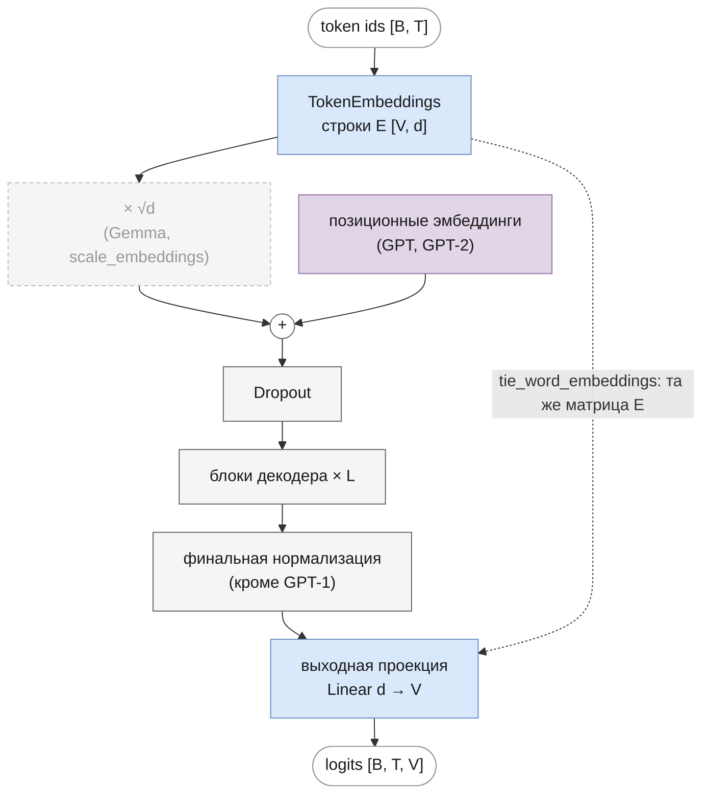

# Эмбеддинги и выходная проекция

Часть I · [← Токенизация](tokenization.md) · [Оглавление](README.md) · [Позиционное кодирование →](positional-encoding.md)

## Что вы узнаете

- Почему токен нельзя подать в сеть как число или one-hot вектор и чем эмбеддинг лучше.
- Что эмбеддинг — это строка матрицы $`E \in \mathbb{R}^{V \times d}`$, и почему выборка строки (lookup) — то же самое, что умножение one-hot вектора на матрицу.
- Как устроен градиент по матрице эмбеддингов и почему на шаге обучения меняются только строки встреченных токенов.
- Как выходная проекция (LM head) превращает скрытое состояние в логиты и что такое weight tying.
- Зачем эмбеддинги иногда умножают на $`\sqrt{d}`$ и какую долю параметров модели они занимают.
- Как всё это реализовано в [`core/token_embeddings.py`](../../llm/src/llm/core/token_embeddings.py) и в моделях репозитория.

## Предварительные знания

- [Задача языкового моделирования](language-modeling.md): модель выдаёт распределение вероятностей следующего токена, loss — cross-entropy.
- [Токенизация](tokenization.md): текст превращается в последовательность целых чисел $`x_0, x_1, \dots, x_{T-1}`$, каждое из диапазона $`0 \dots V-1`$.
- Умножение матриц, скалярное произведение, производная сложной функции.

## Зачем нужны эмбеддинги

После токенизации текст — это последовательность индексов, например `[412, 7, 3051]`. Нейросеть работает с векторами действительных чисел, поэтому индекс нужно во что-то превратить. Есть три очевидных способа.

**Подать индекс как число.** Тогда токен 412 «больше» токена 7 и «близок» к токену 413. Но номера в словаре расставлены токенизатором по частоте слияний BPE, а не по смыслу: соседние номера ничем не похожи. Сеть получила бы ложную порядковую структуру.

**One-hot вектор.** Токен $`v`$ кодируется вектором длины $`V`$, где на месте $`v`$ стоит 1, а остальное — нули:

```math
\mathbf{o}(v) = (0, \dots, 0, \underbrace{1}_{v}, 0, \dots, 0) \in \{0, 1\}^{1 \times V}
```

где:
- $`v \in \{0, \dots, V-1\}`$ — индекс токена;
- $`V`$ — размер словаря (у GPT-2 — 50 257, у Gemma — 256 000);
- $`\mathbf{o}(v)`$ — вектор-строка длины $`V`$ с единственной единицей на позиции $`v`$.

Ложного порядка здесь нет, но появляются другие проблемы:

1. **Размерность.** Вектор длины 256 000 на каждый токен — огромный вход, почти целиком из нулей.
2. **Все токены одинаково непохожи.** Скалярное произведение двух разных one-hot векторов равно 0, расстояние между любыми двумя — $`\sqrt{2}`$. «кот» так же далёк от «кошка», как от «синхрофазотрон». Сходство слов нельзя выразить, его придётся выучивать заново в каждом слое.
3. **Нет обобщения.** Что модель узнала про токен «кошка», никак не переносится на «кот»: у них нет общих координат.

**Эмбеддинг (embedding)** решает все три проблемы: каждому токену сопоставляется обучаемый плотный вектор небольшой длины $`d`$ (от сотен до нескольких тысяч). Похожим токенам обучение даёт похожие векторы, и знание переносится между ними.

## Эмбеддинг как строка матрицы

### Определение

**Матрица эмбеддингов** $`E \in \mathbb{R}^{V \times d}`$ хранит по одной строке на каждый токен словаря. **Эмбеддинг токена** $`v`$ — это $`v`$-я строка:

```math
\mathbf{e}(v) = E_{v,:} \in \mathbb{R}^{1 \times d}
```

где:
- $`E`$ — обучаемая матрица, $`V`$ строк и $`d`$ столбцов (в главе о MoE той же буквой обозначено число экспертов; в этой главе $`E`$ — всегда матрица эмбеддингов);
- $`E_{v,:}`$ — строка с номером $`v`$ (нумерация с 0);
- $`d`$ — размерность модели (`embed_dim` в конфиге); тот же размер у скрытого состояния во всех блоках декодера.

Для последовательности $`x_0, \dots, x_{T-1}`$ эмбеддинги складываются в матрицу

```math
X^{(0)} = \begin{pmatrix} E_{x_0,:} \\ E_{x_1,:} \\ \vdots \\ E_{x_{T-1},:} \end{pmatrix} \in \mathbb{R}^{T \times d}
```

где $`X^{(0)}`$ — вход в первый блок декодера (до добавления позиционной информации, о ней — в [следующей главе](positional-encoding.md)). В батче добавляется ещё одно измерение: вход `[B, T]` целых чисел превращается в тензор `[B, T, d]`.

### Lookup и умножение на one-hot — одно и то же

Возьмём линейный слой без bias, на вход которому подаётся one-hot вектор: $`\mathbf{o}(v) E`$. По определению умножения вектора на матрицу $`j`$-я координата результата

```math
\big(\mathbf{o}(v) E\big)_j = \sum_{i=0}^{V-1} o_i(v)\, E_{i,j} = 1 \cdot E_{v,j} + \sum_{i \ne v} 0 \cdot E_{i,j} = E_{v,j}
```

где:
- $`o_i(v)`$ — $`i`$-я координата one-hot вектора: 1 при $`i = v`$ и 0 иначе;
- $`E_{i,j}`$ — элемент матрицы эмбеддингов в строке $`i`$, столбце $`j`$;
- $`j \in \{0, \dots, d-1\}`$ — номер координаты результата.

Все слагаемые, кроме одного, обнуляются, и остаётся ровно строка $`v`$:

```math
\mathbf{o}(v)\, E = E_{v,:}
```

Значит, **слой эмбеддингов — это линейный слой, применённый к one-hot входу**, просто вычисленный умно. Умножение стоит $`V \cdot d`$ операций, выборка строки по индексу (lookup) — $`d`$ операций копирования. One-hot вектор при этом даже не создаётся.

Отсюда важное следствие: эмбеддинг не отменяет one-hot кодирование, а **сжимает** его. Первый линейный слой над one-hot входом всё равно имел бы $`V \times d`$ параметров — это и есть $`E`$.

**Пример.** $`V = 3`$, $`d = 2`$:

```
        столбцы:  0     1
E =  строка 0: [ 0.1   0.2 ]
     строка 1: [ 0.3  -0.1 ]
     строка 2: [ 0.0   0.5 ]

o(1) = [0, 1, 0]
o(1) · E = [0·0.1 + 1·0.3 + 0·0.0,  0·0.2 + 1·(−0.1) + 0·0.5] = [0.3, −0.1] = E[1]
```

Проверка в PyTorch:

```python
import torch
from llm.core.token_embeddings import TokenEmbeddings

emb = TokenEmbeddings(vocab_size=5, emb_size=3)
x = torch.tensor([[1, 3, 1]])                          # [B=1, T=3]
one_hot = torch.nn.functional.one_hot(x, 5).float()    # [1, 3, 5]
W = emb._embedding.weight                              # [5, 3] — матрица E
print(torch.allclose(one_hot @ W, emb(x)))             # True
```

## Градиент по матрице эмбеддингов

Эмбеддинги обучаются вместе со всей моделью обратным распространением ошибки (см. [training.md](training.md)). Какой градиент получает $`E`$?

Пусть $`\mathcal{L}`$ — loss, а $`\mathbf{g}_t = \partial \mathcal{L} / \partial \mathbf{e}_t \in \mathbb{R}^{1 \times d}`$ — градиент по эмбеддингу на позиции $`t`$, который пришёл из первого блока. Эмбеддинг позиции $`t`$ — копия строки $`x_t`$, поэтому по цепному правилу

```math
\frac{\partial \mathcal{L}}{\partial E_{v,:}} = \sum_{t\,:\,x_t = v} \mathbf{g}_t
```

где:
- $`E_{v,:}`$ — строка матрицы для токена $`v`$;
- сумма идёт по всем позициям $`t`$ (во всём батче), где стоит токен $`v`$;
- $`\mathbf{g}_t`$ — градиент loss по вектору $`\mathbf{e}_t`$, форма $`1 \times d`$.

<details><summary>Вывод</summary>

Запишем эмбеддинг позиции $`t`$ через one-hot: $`\mathbf{e}_t = \mathbf{o}(x_t) E`$, то есть $`e_{t,j} = \sum_i o_i(x_t) E_{i,j}`$. Производная одной координаты по одному элементу матрицы:

```math
\frac{\partial e_{t,j}}{\partial E_{v,k}} = o_v(x_t)\,[j = k]
```

где $`[j = k]`$ — 1, если $`j = k`$, и 0 иначе. Loss зависит от $`E`$ только через все $`\mathbf{e}_t`$, поэтому

```math
\frac{\partial \mathcal{L}}{\partial E_{v,k}} = \sum_{t} \sum_{j} \frac{\partial \mathcal{L}}{\partial e_{t,j}} \cdot \frac{\partial e_{t,j}}{\partial E_{v,k}} = \sum_t g_{t,k}\, o_v(x_t)
```

Множитель $`o_v(x_t)`$ равен 1 только там, где $`x_t = v`$. Остаётся сумма $`g_{t,k}`$ по этим позициям, что и даёт формулу выше для всей строки сразу. В матричном виде: $`\partial \mathcal{L} / \partial E = O^\top G`$, где $`O \in \{0,1\}^{T \times V}`$ — one-hot матрица входа, $`G \in \mathbb{R}^{T \times d}`$ — градиенты по эмбеддингам.

</details>

**Что это значит.**

- Строки токенов, которых нет в батче, получают **нулевой** градиент. На шаге обучения меняются только строки встреченных токенов.
- Если токен встретился несколько раз, градиенты складываются.
- Редкие токены обновляются редко, и их эмбеддинги учатся хуже. Это одна из причин, по которой словарь не делают сколь угодно большим.

**Пример.** Если в примере выше взять $`\mathcal{L} = \sum`$ всех элементов выхода, то $`\mathbf{g}_t = (1, 1, 1)`$ для каждой позиции. Токен 1 стоит на двух позициях, токен 3 — на одной:

```python
out = emb(x)            # x = [[1, 3, 1]]
out.sum().backward()
print(emb._embedding.weight.grad)
# tensor([[0., 0., 0.],
#         [2., 2., 2.],    ← токен 1 встретился дважды
#         [0., 0., 0.],
#         [1., 1., 1.],    ← токен 3 — один раз
#         [0., 0., 0.]])
```

Тонкость: нулевой градиент ещё не значит, что строка не изменится. Оптимизатор AdamW сдвигает её за счёт weight decay и накопленного момента с прошлых шагов (подробнее — в [training.md](training.md)). Кроме того, при weight tying (ниже) строки получают градиент ещё и от выходной проекции, причём все сразу.

## Геометрия эмбеддингов

### Сходство векторов

Сравнивать эмбеддинги можно скалярным произведением или косинусом угла между ними:

```math
\mathbf{a} \cdot \mathbf{b} = \sum_{j=0}^{d-1} a_j b_j, \qquad \cos(\mathbf{a}, \mathbf{b}) = \frac{\mathbf{a} \cdot \mathbf{b}}{\lVert \mathbf{a} \rVert \, \lVert \mathbf{b} \rVert}
```

где:
- $`\mathbf{a}, \mathbf{b} \in \mathbb{R}^{1 \times d}`$ — два эмбеддинга;
- $`\lVert \mathbf{a} \rVert = \sqrt{\mathbf{a} \cdot \mathbf{a}}`$ — евклидова норма;
- $`\cos \in [-1, 1]`$: 1 — векторы сонаправлены, 0 — ортогональны, −1 — противоположны.

Скалярное произведение учитывает и направление, и длину векторов; косинус — только направление. Для one-hot векторов оба равны нулю для любой пары разных токенов — никакой геометрии нет.

**Пример** (выдуманные трёхмерные векторы):

```
a = «кот»     = [ 1,   2,   0  ]
b = «кошка»   = [ 1,   1.5, 0.5]
c = «машина»  = [−1,   0,   2  ]

a·b = 1 + 3 + 0 = 4       ‖a‖ = √5 ≈ 2.236   ‖b‖ = √3.5 ≈ 1.871   cos(a, b) ≈ 0.956
a·c = −1 + 0 + 0 = −1     ‖c‖ = √5 ≈ 2.236                        cos(a, c) = −0.2
b·c = −1 + 0 + 1 = 0                                               cos(b, c) = 0
```

### Дистрибутивная гипотеза и word2vec

Почему при обучении похожие слова получают похожие векторы? Ответ даёт **дистрибутивная гипотеза** (distributional hypothesis) лингвистики середины XX века (Harris, 1954; Firth, 1957): слова, которые встречаются в похожих контекстах, имеют похожий смысл. Языковая модель учится предсказывать токен по контексту. Если «кот» и «кошка» стоят в одинаковых окружениях («... мурлычет на диване»), то градиенты сдвигают их эмбеддинги в одну сторону — так проще выдать похожие предсказания.

Нейросетевые языковые модели с обучаемыми векторами слов предложили Bengio et al. (2003). Широкую известность эмбеддинги получили после **word2vec** (Mikolov et al., 2013, [arXiv:1301.3781](https://arxiv.org/abs/1301.3781)): две простые модели — CBOW (предсказать слово по соседям) и skip-gram (предсказать соседей по слову) — обучались на миллиардах слов и давали векторы, в которых смысловые отношения становились почти линейными. Классический пример из статьи: вектор, ближайший к $`\mathbf{e}(\text{King}) - \mathbf{e}(\text{Man}) + \mathbf{e}(\text{Woman})`$, — $`\mathbf{e}(\text{Queen})`$.

Чем эмбеддинги в трансформере отличаются от word2vec:

- они обучаются **совместно со всей моделью** (end-to-end), а не отдельно заранее;
- это эмбеддинги **токенов** (подслов), а не слов: «кошка» может быть одним токеном или несколькими;
- эмбеддинг **не зависит от контекста**: токен «ключ» получает один и тот же вектор в «ключ от двери» и «горный ключ». Различать значения по контексту — работа следующих слоёв (attention и FFN). Выход последнего блока — уже **контекстный** вектор.

## Выходная проекция (LM head)

### Логиты

На выходе декодера для каждой позиции $`t`$ есть скрытое состояние $`\mathbf{h}_t \in \mathbb{R}^{1 \times d}`$ (у большинства моделей — после финальной нормализации). Из него нужно получить распределение над словарём. Это делает **выходная проекция** (output projection, LM head) — линейный слой из $`d`$ в $`V`$:

```math
\mathbf{z}_t = \mathbf{h}_t W_{out} + \mathbf{b}
```

где:
- $`\mathbf{h}_t \in \mathbb{R}^{1 \times d}`$ — скрытое состояние позиции $`t`$ после последнего блока (и финальной нормы);
- $`W_{out} \in \mathbb{R}^{d \times V}`$ — матрица проекции; её столбец $`v`$ — «выходной вектор» токена $`v`$;
- $`\mathbf{b} \in \mathbb{R}^{1 \times V}`$ — bias (есть не во всех моделях);
- $`\mathbf{z}_t \in \mathbb{R}^{1 \times V}`$ — **логиты** (logits): ненормированные оценки каждого токена словаря.

Для всей последовательности — $`Z = H W_{out} + \mathbf{b}`$, $`H \in \mathbb{R}^{T \times d}`$, $`Z \in \mathbb{R}^{T \times V}`$; в коде выход `forward` — `[B, T, V]`.

Вероятности получаются softmax:

```math
p(x_{t+1} = v \mid x_{\le t}) = \frac{\exp(z_{t,v})}{\sum_{u=0}^{V-1} \exp(z_{t,u})}
```

где $`z_{t,v}`$ — логит токена $`v`$ на позиции $`t`$. Позиция $`t`$ предсказывает **следующий** токен $`x_{t+1}`$ (см. [language-modeling.md](language-modeling.md)). Модели репозитория возвращают логиты, а softmax применяется снаружи: в функции потерь (`cross_entropy` принимает логиты) и в [генерации](generation.md).

**Интуиция.** Без bias логит $`z_{t,v} = \mathbf{h}_t \cdot W_{out[:,v]}`$ — скалярное произведение скрытого состояния с выходным вектором токена $`v`$. Модель «рисует» в $`\mathbf{h}_t`$ вектор, похожий на выходные векторы подходящих следующих токенов, и они получают большие логиты. Выходная проекция — тоже таблица векторов по одному на токен, только транспонированная.

### Цена выходной проекции

Проекция стоит $`d \cdot V`$ параметров и $`\approx 2 d V`$ операций (умножений и сложений) на каждую позицию. У Gemma 2B это $`2048 \cdot 256\,000 \approx 524`$M параметров — больше, чем все параметры attention (см. [таблицу долей](#доля-параметров-эмбеддингов) ниже). Softmax тоже считается по всему словарю: на каждую позицию — $`V`$ экспонент.

## Weight tying

### Идея

Во входе и выходе модели есть по таблице «вектор на каждый токен»: строки $`E`$ и столбцы $`W_{out}`$. **Weight tying** (связывание весов) — использовать одну матрицу для обоих:

```math
W_{out} = E^\top, \qquad \mathbf{z}_t = \mathbf{h}_t E^\top, \qquad z_{t,v} = \mathbf{h}_t \cdot E_{v,:}
```

где:
- $`E \in \mathbb{R}^{V \times d}`$ — та же матрица эмбеддингов, что на входе;
- $`E^\top \in \mathbb{R}^{d \times V}`$ — она же, транспонированная, в роли $`W_{out}`$;
- bias при этом обычно убирают (так в GPT-1, GPT-2 и Gemma).

Логит токена $`v`$ — скалярное произведение скрытого состояния с **его входным эмбеддингом**. Модель предсказывает токен, чей эмбеддинг «похож» на текущее состояние.

Идея предложена одновременно в двух работах:

- **Press & Wolf (2017)**, [arXiv:1608.05859](https://arxiv.org/abs/1608.05859): выходная матрица языковой модели сама является хорошим эмбеддингом слов; связывание входа и выхода снижает перплексию и заметно уменьшает число параметров.
- **Inan, Khosravi, Socher (2017)**, [arXiv:1611.01462](https://arxiv.org/abs/1611.01462): теоретическое обоснование — вход и выход живут в одном пространстве, и если учитывать близость слов в функции потерь, связывание получается естественным следствием.

В трансформере связывание использовано уже в исходной статье (Vaswani et al., 2017, [arXiv:1706.03762](https://arxiv.org/abs/1706.03762), разд. 3.4 «Embeddings and Softmax» — со ссылкой на Press & Wolf).

### Экономия параметров

Без связывания на словарь уходит $`V d`$ (вход) $`+ \; V d + V`$ (выход с bias) параметров, со связыванием — $`V d`$. Экономия

```math
\Delta = V \cdot d + V
```

где слагаемое $`V`$ — отброшенный bias головы (если его и так не было — $`\Delta = V d`$).

| Модель | $`V`$ | $`d`$ | $`V \cdot d`$ | Связывание в оригинале |
|---|---|---|---|---|
| GPT-1 | 40 478 | 768 | 31,1M | да (формула (2) статьи: $`\operatorname{softmax}(h_n W_e^\top)`$, и код OpenAI) |
| GPT-2 124M | 50 257 | 768 | 38,6M | да |
| Gemma 2B | 256 000 | 2048 | 524,3M | да |
| LLaMA 7B, Mistral 7B, Mixtral 8x7B | 32 000 | 4096 | 131,1M | нет (`tie_word_embeddings: false` в HF) |

Размеры словарей и $`d`$ — из глав [gpt.md](gpt.md), [gpt2.md](gpt2.md), [gemma.md](gemma.md), [llama.md](llama.md).

### Градиент при связывании

Матрица одна, поэтому её градиент — сумма двух вкладов: от входа (только строки встреченных токенов, см. выше) и от выхода. Посчитаем выходной вклад для одной позиции. Для cross-entropy с правильным токеном $`y`$ градиент по логитам равен $`\partial \mathcal{L} / \partial \mathbf{z} = \mathbf{p} - \mathbf{y}`$ ($`\mathbf{p}`$ — вектор вероятностей, $`\mathbf{y}`$ — one-hot правильного токена; см. [language-modeling.md](language-modeling.md), вывод — в [training.md](training.md)). Так как $`\mathbf{z} = \mathbf{h} E^\top`$, то $`z_v = \mathbf{h} \cdot E_{v,:}`$ и

```math
\frac{\partial \mathcal{L}}{\partial E_{v,:}}\Big|_{\text{выход}} = (p_v - y_v)\, \mathbf{h}
```

где:
- $`p_v`$ — вероятность, которую модель дала токену $`v`$;
- $`y_v`$ — 1 для правильного токена и 0 для остальных;
- $`\mathbf{h} \in \mathbb{R}^{1 \times d}`$ — скрытое состояние.

Градиент получают **все** $`V`$ строк: $`p_v > 0`$ у каждого токена. Шаг градиентного спуска ($`E \leftarrow E - \eta \nabla`$) сдвигает эмбеддинг правильного токена к $`\mathbf{h}`$ (множитель $`p_y - 1 < 0`$), а остальных — от $`\mathbf{h}`$, тем сильнее, чем выше их вероятность.

**Пример.** $`V = 3`$, $`d = 2`$, матрица $`E`$ из примера выше, $`\mathbf{h} = (1, 2)`$, правильный токен $`y = 2`$:

```
z = h·Eᵀ = [0.1·1 + 0.2·2,  0.3·1 − 0.1·2,  0·1 + 0.5·2] = [0.5, 0.1, 1.0]
p = softmax(z)            ≈ [0.301, 0.202, 0.497]
p − y                     ≈ [0.301, 0.202, −0.503]
∂L/∂E (выход) = (p − y)ᵀ·h ≈ [[ 0.301,  0.603],
                              [ 0.202,  0.404],
                              [−0.503, −1.007]]
```

Строка 2 после шага сдвинется в сторону $`\mathbf{h}`$, строки 0 и 1 — прочь от неё.

### Реализация: `output_projection` и `tie_word_embeddings`

Выходную проекцию создаёт функция `output_projection` в [`core/token_embeddings.py`](../../llm/src/llm/core/token_embeddings.py):

```python
def output_projection(token_embeddings, tie_weights=False) -> nn.Linear:
    linear = nn.Linear(
        token_embeddings.embedding_dim, token_embeddings.num_embeddings, bias=not tie_weights
    )
    if tie_weights:
        linear.weight = token_embeddings._embedding.weight
    return linear
```

Как она реализует формулу:

- `nn.Linear(d, V)` хранит вес в форме `[V, d]` (выход × вход) и считает `x @ weight.T + bias`. Значит, `linear.weight` — это $`W_{out}^\top`$.
- У `nn.Embedding(V, d)` вес тоже `[V, d]` — это $`E`$. Присваивание `linear.weight = ...weight` делает их **одним параметром**, и `linear(h)` = $`\mathbf{h} E^\top`$ — ровно формула weight tying.
- С `tie_weights=True` слой создаётся без bias (`bias=not tie_weights`).
- Параметр один, поэтому autograd складывает в его `.grad` оба вклада — от входа и от выхода.

Где используется:

| Модель | Ключ конфига | По умолчанию | Что без ключа |
|---|---|---|---|
| `GPT`, `GPT2` | `tie_word_embeddings` | `false` | отдельный `Linear` с bias (`output_projection(..., tie_weights=False)`) |
| `Gemma` | `tie_word_embeddings` | `false` | отдельный `nn.Linear` с bias по ключу `bias` |
| `Llama`, `Mistral`, `Mixtral` | нет | — | всегда отдельный `nn.Linear(embed_dim, vocab_size, bias=bias)` |

По умолчанию ключ выключен ради совместимости со старыми чекпоинтами, где есть отдельные `_linear.weight` и `_linear.bias`. Для загрузки весов OpenAI GPT-1/GPT-2 и Gemma его нужно включить (см. [gpt.md](gpt.md#weight-tying-и-веса-openai), [gemma.md](gemma.md#как-в-статье)). Проверка экономии на учебной модели:

```python
from llm.models.gpt import GPT

cfg = {"vocab_size": 50, "embed_dim": 32, "num_heads": 4, "num_layers": 2,
       "max_position_embeddings": 16, "dropout": 0.0}
untied = GPT(cfg)
tied = GPT({**cfg, "tie_word_embeddings": True})
n = lambda m: sum(p.numel() for p in m.parameters())
print(n(untied) - n(tied))                                        # 1650 = 50·32 + 50
print(tied._linear.weight is tied._token_embeddings._embedding.weight)  # True
```

`model.parameters()` возвращает общий параметр один раз, поэтому разница — ровно $`V d + V`$. В `state_dict` связанной модели оба ключа (`_token_embeddings._embedding.weight` и `_linear.weight`) всё равно присутствуют — они указывают на один тензор.

## Масштабирование эмбеддингов на √d

### Что делается

В исходном трансформере (Vaswani et al., 2017, разд. 3.4) эмбеддинги перед подачей в сеть умножаются на $`\sqrt{d}`$:

```math
X^{(0)}_{t,:} = \sqrt{d} \cdot E_{x_t,:}
```

где $`d`$ — размерность модели, $`E_{x_t,:}`$ — эмбеддинг токена на позиции $`t`$. Gemma делает то же самое (Gemma Team, 2024; в HF — множитель `normalizer`/`embed_scale`, см. [бэклог, пункт 42](../dev/backlog.md#42-эмбеддинги-не-масштабируются-на-d--p2)). В статье трансформера причина не объясняется; ниже — обоснование через нормы векторов, которое обычно приводят.

### Почему: нормы при связанных весах

При weight tying одна матрица $`E`$ служит и входом, и выходом, а масштаб, удобный для выхода, неудобен для входа.

**Выход.** Пусть элементы $`E`$ независимы, со средним 0 и дисперсией $`\sigma^2`$, а скрытое состояние после финальной RMSNorm имеет среднеквадратичное значение координат около 1, то есть $`\lVert \mathbf{h} \rVert^2 \approx d`$. Тогда дисперсия логита

```math
\operatorname{Var}(z_v) = \operatorname{Var}\Big(\sum_{j=0}^{d-1} h_j E_{v,j}\Big) = \sum_{j} h_j^2 \, \sigma^2 = \lVert \mathbf{h} \rVert^2 \sigma^2 \approx d\, \sigma^2
```

где $`h_j`$ считаются фиксированными, а $`E_{v,j}`$ — независимыми случайными величинами с дисперсией $`\sigma^2`$. Чтобы логиты в начале обучения были порядка 1 (а не порядка $`\sqrt{d}`$, как было бы при $`\sigma = 1`$, — тогда softmax сразу почти one-hot), нужно $`\sigma^2 \approx 1/d`$, то есть $`\sigma \approx 1/\sqrt{d}`$.

**Вход.** С такой дисперсией эмбеддинг — маленький вектор:

```math
\mathbb{E}\,\lVert E_{v,:} \rVert^2 = d\, \sigma^2 = 1, \qquad \text{RMS координаты} = \sigma = \frac{1}{\sqrt{d}}
```

где RMS — среднеквадратичное значение координат вектора. А residual-поток внутри модели, куда блоки прибавляют свои выходы, и синусоидальные позиционные коды (координаты в $`[-1, 1]`$) имеют координаты порядка 1. Умножение на $`\sqrt{d}`$ поднимает RMS эмбеддинга с $`1/\sqrt{d}`$ до 1 — на тот же масштаб.

Что будет без множителя: при $`d = 2048`$ вход в первый блок в $`\sqrt{2048} \approx 45`$ раз меньше «ожидаемого». В pre-LN модели каждый блок нормализует свой вход, но прибавляет выход к ненормализованному residual-потоку. Крохотный эмбеддинг тонет в первых же добавках блоков, и информация о токене теряется. Для загруженных весов Gemma без множителя результат просто неверный: сеть обучалась с ним ([gemma.md](gemma.md#как-в-статье)).

**Численный пример.** Инициализация N(0, 0.02) (GPT, HF), $`d = 2048`$: $`0.02 \approx 1/\sqrt{2048} = 0.0221`$. Норма эмбеддинга $`\approx 0.02 \cdot \sqrt{2048} \approx 0.905`$, RMS координаты — 0.02. После умножения на $`\sqrt{2048} \approx 45.25`$ RMS координаты $`\approx 0.905`$, норма $`\approx 41`$.

### Реализация: `scale_embeddings`

В репозитории масштабирование есть только у `Gemma` и включается ключом `scale_embeddings` (по умолчанию `false`). В конструкторе [`models/gemma/gemma.py`](../../llm/src/llm/models/gemma/gemma.py):

```python
self._embedding_scale = math.sqrt(config["embed_dim"]) if config.get("scale_embeddings", False) else None
```

и в `forward`:

```python
tok_out = self._token_embeddings(x)  # [batch, seq_len, emb_size]
if self._embedding_scale is not None:
    # как в HF: множитель приводится к dtype эмбеддингов
    tok_out = tok_out * torch.tensor(self._embedding_scale, dtype=tok_out.dtype)
```

Множитель приводится к dtype эмбеддингов, как в HF: в bfloat16 $`\sqrt{2048}`$ округляется до 45.25, и так же округляет эталон — иначе логиты разошлись бы в последних битах.

## Dropout на эмбеддингах

После эмбеддингов (и позиционных эмбеддингов у GPT) все модели репозитория применяют **dropout**: при обучении каждая координата с вероятностью $`p`$ обнуляется, остальные делятся на $`1 - p`$, чтобы математическое ожидание не изменилось:

```math
\tilde{x}_j = \frac{m_j}{1 - p}\, x_j, \qquad m_j \sim \text{Bernoulli}(1 - p)
```

где:
- $`x_j`$ — координата входного вектора;
- $`m_j \in \{0, 1\}`$ — случайная маска, 1 с вероятностью $`1 - p`$;
- $`p`$ — вероятность обнуления (ключ `dropout` в конфиге; не путать с вероятностями токенов $`p_v`$ из раздела о выходной проекции).

В режиме `eval()` dropout ничего не делает. Он мешает модели полагаться на отдельные координаты эмбеддингов и работает как регуляризация (Srivastava et al., 2014). В GPT-1 это `embd_pdrop = 0.1` ([gpt.md](gpt.md#конфигурация)); в Gemma dropout нет вовсе, и для соответствия оригиналу нужно `dropout: 0` ([gemma.md](gemma.md#отличия-от-gemma)).

В коде это `self._dropout = nn.Dropout(config["dropout"])`: у GPT и GPT-2 — `self._dropout(tok_out + pos_out.unsqueeze(0))`, у LLaMA, Mistral, Mixtral и Gemma — `self._dropout(tok_out)` (у Gemma — после масштабирования). Подробнее о dropout — в [training.md](training.md).

## Доля параметров эмбеддингов

Эмбеддинги — это $`V d`$ параметров, голова без связывания — ещё $`V d`$. У маленьких моделей с большим словарём это заметная доля всей модели:

| Модель | $`V \cdot d`$ | Всего параметров | Доля одной таблицы | Связывание |
|---|---|---|---|---|
| GPT-1 | 31,1M | 116,5M (со связыванием) | ≈ 27 % | да |
| GPT-2 124M | 38,6M | 124,4M (со связыванием) | ≈ 31 % | да |
| Gemma 2B | 524,3M | ≈ 2,5B (со связыванием) | ≈ 21 % | да; без него ещё +524M |
| LLaMA 7B | 131,1M | ≈ 6,7B | ≈ 2 % (≈ 4 % вместе с отдельной головой) | нет |

Число параметров GPT-1 и GPT-2 — из [gpt.md](gpt.md) и [gpt2.md](gpt2.md) (сверено с HF), Gemma — из [gemma.md](gemma.md) и [бэклога](../dev/backlog.md#43-нет-weight-tying-bias-во-всех-linear--p2).

Выводы:

- При большом словаре и маленьком $`d`$ эмбеддинги занимают до трети модели. Поэтому в маленьких моделях связывание особенно выгодно: у Gemma 2B отдельная голова добавила бы ещё пятую часть модели.
- В больших моделях доля быстро падает: число параметров блоков растёт как $`L d^2`$, а таблицы — как $`V d`$.
- Параметры таблицы почти не стоят вычислений на входе (lookup), но выходная проекция стоит $`2 V d`$ операций на токен, связана она или нет.

## Схема

Путь от индексов токенов к логитам в моделях репозитория. Пунктир — необязательные шаги.



У моделей с RoPE (LLaMA, Mistral, Mixtral, Gemma) узла сложения с позиционными эмбеддингами нет: позиция вносится поворотом Q и K внутри attention (см. [positional-encoding.md](positional-encoding.md)).

## Реализация в репозитории: `TokenEmbeddings`

Класс `TokenEmbeddings` в [`core/token_embeddings.py`](../../llm/src/llm/core/token_embeddings.py) — тонкая обёртка над `nn.Embedding`:

```python
class TokenEmbeddings(nn.Module):
    def __init__(self, vocab_size: int, emb_size: int):
        super().__init__()
        self._embedding = nn.Embedding(num_embeddings=vocab_size, embedding_dim=emb_size)

    def forward(self, x: Tensor) -> Tensor:
        return self._embedding(x)
```

- `self._embedding.weight` — матрица $`E`$ формы `[vocab_size, emb_size]` = $`V \times d`$.
- `forward` принимает целочисленный тензор любой формы `[...]` и возвращает `[..., emb_size]`: для входа модели `[B, T]` → `[B, T, d]`. Это и есть lookup $`E_{x_t,:}`$.
- Свойства `num_embeddings` ($`V`$) и `embedding_dim` ($`d`$) нужны `output_projection`, чтобы построить голову нужной формы.
- `padding_idx` не задаётся: у pad-токена обычная обучаемая строка.

Все шесть моделей создают эмбеддинги одинаково:

```python
self._token_embeddings = TokenEmbeddings(vocab_size=config["vocab_size"], emb_size=config["embed_dim"])
```

**Инициализация.** `nn.Embedding` по умолчанию заполняет $`E`$ из N(0, 1). Все шесть моделей переинициализируют все `Linear` и `Embedding` из N(0, 0.02) (`init_normal_` в [`core/weight_init.py`](../../llm/src/llm/core/weight_init.py)) — как в статьях OpenAI для `GPT` и `GPT2` и как `_init_weights` HuggingFace для `Llama`, `Mistral`, `Mixtral` и `Gemma`; стандартное отклонение — ключ `initializer_range`. При загрузке чекпоинта инициализация не важна: веса перезаписываются.

## Типичные ошибки и тонкости

- **Индекс вне словаря.** Токен $`\ge V`$ даёт `IndexError: index out of range in self` на CPU и невнятный device-side assert на CUDA. Если токенизатор и модель расходятся в `vocab_size`, ошибка всплывёт именно здесь.
- **Связывание и загрузка чекпоинтов.** Чекпоинт с `tie_word_embeddings: true` не загружается в модель с `false` и наоборот: у отдельной головы есть `_linear.bias`, у связанной — нет.
- **Связывание и копирование весов.** Присваивание `linear.weight = embedding.weight` должно выполняться после создания обоих модулей и не должно заменяться копированием (`.data.copy_`), иначе параметры разойдутся после первого шага. Перенос модели на устройство (`.to(device)`) связь сохраняет.
- **`scale_embeddings` без подходящей инициализации.** Множитель $`\sqrt{d}`$ рассчитан на малые эмбеддинги. С эмбеддингами N(0, 1) (инициализация `nn.Embedding` по умолчанию) координаты входа при обучении с нуля будут порядка $`\sqrt{d}`$ (16 при $`d = 256`$). `Gemma` в репозитории инициализирует эмбеддинги N(0, 0.02), как HF.
- **Логиты — не вероятности.** `forward` возвращает логиты; softmax нужен только для вероятностей. `cross_entropy` в PyTorch ожидает именно логиты — повторный softmax перед ней даёт неверный loss.
- **Нулевой градиент ≠ неизменная строка.** Weight decay и момент AdamW двигают и строки токенов, которых не было в батче.

## Итоги

- Эмбеддинг токена — строка обучаемой матрицы $`E \in \mathbb{R}^{V \times d}`$; lookup эквивалентен умножению one-hot вектора на $`E`$, но стоит $`d`$ операций вместо $`V d`$.
- Градиент по $`E`$ — сумма градиентов по позициям, где стоит токен; строки невстреченных токенов получают ноль.
- Похожие по употреблению токены получают близкие векторы (дистрибутивная гипотеза); сходство меряют скалярным произведением или косинусом.
- Выходная проекция $`\mathbf{z} = \mathbf{h} W_{out} + \mathbf{b}`$ даёт логиты; при weight tying $`W_{out} = E^\top`$ без bias, экономия $`V d`$ параметров. В репозитории — `output_projection` и ключ `tie_word_embeddings` (GPT, GPT-2, Gemma).
- При связанных весах масштаб $`E`$ подобран под выход (RMS координат $`\sim 1/\sqrt{d}`$), поэтому на входе эмбеддинги умножают на $`\sqrt{d}`$ (Vaswani 2017, Gemma; ключ `scale_embeddings`).
- У маленьких моделей с большим словарём таблица эмбеддингов — 20–30 % всех параметров.

## Вопросы и упражнения

1. Почему скалярное произведение любых двух разных one-hot векторов равно нулю, а расстояние между ними — $`\sqrt{2}`$? Что это говорит о «геометрии» one-hot кодирования?

<details><summary>Ответ</summary>

У $`\mathbf{o}(u)`$ и $`\mathbf{o}(v)`$ при $`u \ne v`$ единицы стоят на разных местах, поэтому в сумме $`\sum_i o_i(u)\, o_i(v)`$ все произведения нулевые. Разность векторов имеет ровно две ненулевые координаты, $`+1`$ и $`-1`$, и её норма $`\sqrt{1^2 + 1^2} = \sqrt{2}`$. Все пары токенов одинаково далеки и ортогональны — никакого понятия сходства в one-hot кодировании нет.

</details>

2. Батч из двух строк: `[[5, 2, 5], [2, 7, 5]]`. Какие строки матрицы $`E`$ получат ненулевой градиент на этом шаге? Во сколько раз градиент строки 5 больше градиента по одной позиции, если все $`\mathbf{g}_t`$ одинаковы?

<details><summary>Ответ</summary>

Ненулевой градиент получат строки 2, 5 и 7. Токен 5 встречается трижды, поэтому при одинаковых $`\mathbf{g}_t`$ его градиент — $`3\mathbf{g}`$. У токена 2 — $`2\mathbf{g}`$, у 7 — $`\mathbf{g}`$.

</details>

3. Посчитайте, сколько параметров экономит `tie_word_embeddings: true` для учебной модели GPT с `vocab_size = 1000`, `embed_dim = 256`.

<details><summary>Ответ</summary>

$`V d + V = 1000 \cdot 256 + 1000 = 257\,000`$: матрица головы и её bias.

</details>

4. Пусть $`d = 512`$, элементы $`E`$ — N(0, σ²) с $`\sigma = 1/\sqrt{512}`$. Какова ожидаемая квадратичная норма эмбеддинга до и после умножения на $`\sqrt{d}`$? Какое среднеквадратичное значение координаты получится после умножения?

<details><summary>Ответ</summary>

До: $`\mathbb{E}\lVert \mathbf{e} \rVert^2 = d \sigma^2 = 512 / 512 = 1`$. После: $`d \cdot \mathbb{E}\lVert \mathbf{e} \rVert^2 = 512`$ (норма $`\approx 22.6`$). RMS координаты после умножения — $`\sqrt{d} \cdot \sigma = 1`$.

</details>

5. В примере раздела «Градиент при связывании» ($`\mathbf{h} = (1, 2)`$, правильный токен 2) сделайте шаг градиентного спуска только по выходному вкладу с $`\eta = 0.1`$. Как изменится логит правильного токена при том же $`\mathbf{h}`$?

<details><summary>Ответ</summary>

Новая строка 2: $`(0, 0.5) - 0.1 \cdot (-0.503, -1.007) \approx (0.050, 0.601)`$. Логит: $`0.050 \cdot 1 + 0.601 \cdot 2 \approx 1.252`$ вместо 1.0 — вырос на $`\eta (1 - p_2) \lVert \mathbf{h} \rVert^2 = 0.1 \cdot 0.503 \cdot 5 \approx 0.252`$. Логиты токенов 0 и 1 уменьшатся: на $`0.1 \cdot 0.301 \cdot 5 \approx 0.151`$ и $`0.1 \cdot 0.202 \cdot 5 \approx 0.101`$.

</details>

6. Для Gemma 2B ($`V = 256\,000`$, $`d = 2048`$) оцените число операций выходной проекции на один токен и сравните с числом операций матриц Q/K/V/O одного слоя attention с MQA (8 голов Q по 256, 1 голова K/V по 256).

<details><summary>Ответ</summary>

Голова: $`2 \cdot 2048 \cdot 256\,000 \approx 1{,}05 \cdot 10^9`$ операций. Attention одного слоя: $`W_Q`$ — $`2048 \times 2048`$, $`W_K`$ и $`W_V`$ — по $`2048 \times 256`$, $`W_O`$ — $`2048 \times 2048`$, всего $`\approx 9{,}44`$M параметров, $`\approx 1{,}9 \cdot 10^7`$ операций. Выходная проекция дороже проекций attention одного слоя примерно в 55 раз и дороже проекций attention всех 18 слоёв примерно втрое.

</details>

7. Почему weight tying не применяют (или применяют реже) в больших моделях вроде LLaMA 7B? Оцените долю, которую сэкономило бы связывание.

<details><summary>Ответ</summary>

Экономия — $`32\,000 \cdot 4096 \approx 131`$M из $`\approx 6{,}7`$B, около 2 %. Выигрыш мал, а отдельные матрицы дают входу и выходу независимые масштабы и больше свободы. Решение — эмпирическое; в статье LLaMA оно не обсуждается.

</details>

8. (Код.) Используя `TokenEmbeddings` и `output_projection`, соберите «модель» без блоков декодера: `logits = head(emb(x))` со связанными весами. Какой токен будет самым вероятным следующим для входного токена $`v`$ в начале обучения и почему?

<details><summary>Ответ</summary>

Логит токена $`u`$ равен $`E_{v,:} \cdot E_{u,:}`$. Максимум почти всегда при $`u = v`$: $`\lVert E_{v,:} \rVert^2 \approx d \sigma^2`$, а скалярные произведения с другими случайными строками в среднем 0 с разбросом $`\sqrt{d}\,\sigma^2`$. Такая модель без обучения «предсказывает» повтор входного токена — побочный эффект связывания, который обучение устраняет.

</details>

## Литература

- Harris, Z. *Distributional Structure*. Word, 10(2–3), 1954 — дистрибутивная гипотеза.
- Firth, J. R. *A Synopsis of Linguistic Theory 1930–1955*. 1957 — «слово узнаётся по его окружению».
- Bengio, Ducharme, Vincent, Jauvin. *A Neural Probabilistic Language Model*. JMLR, 2003 — обучаемые векторы слов в нейросетевой языковой модели.
- Mikolov, Chen, Corrado, Dean. *Efficient Estimation of Word Representations in Vector Space*. 2013. [arXiv:1301.3781](https://arxiv.org/abs/1301.3781) — word2vec (CBOW, skip-gram).
- Srivastava, Hinton, Krizhevsky, Sutskever, Salakhutdinov. *Dropout: A Simple Way to Prevent Neural Networks from Overfitting*. JMLR, 2014.
- Press, Wolf. *Using the Output Embedding to Improve Language Models*. EACL 2017. [arXiv:1608.05859](https://arxiv.org/abs/1608.05859) — weight tying.
- Inan, Khosravi, Socher. *Tying Word Vectors and Word Classifiers: A Loss Framework for Language Modeling*. ICLR 2017. [arXiv:1611.01462](https://arxiv.org/abs/1611.01462) — weight tying.
- Vaswani et al. *Attention Is All You Need*. 2017. [arXiv:1706.03762](https://arxiv.org/abs/1706.03762) — разд. 3.4: общая матрица эмбеддингов и softmax, множитель $`\sqrt{d}`$.
- Gemma Team. *Gemma: Open Models Based on Gemini Research and Technology*. 2024. [arXiv:2403.08295](https://arxiv.org/abs/2403.08295).
