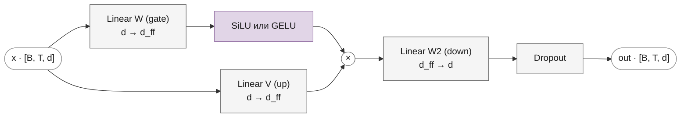

# Feed-forward сеть и активации

Часть I · [← Нормализация и residual-связи](normalization.md) · [Оглавление](README.md) · [Mixture-of-Experts →](mixture-of-experts.md)

Второй подслой каждого блока декодера — **feed-forward сеть** (FFN, иногда MLP): два-три линейных слоя с нелинейностью между ними. Она проще attention, но в ней сосредоточено около двух третей параметров блока. За шесть лет от GPT-1 до Gemma FFN менялась сильнее всех остальных частей: ReLU → GELU → gated-варианты SwiGLU и GeGLU, а скрытый размер из «всегда $`4d`$» стал отдельным гиперпараметром.

## Что вы узнаете

- Что делает FFN в блоке и почему её называют памятью «ключ–значение».
- Классический FFN Vaswani: формулу, размеры матриц и число параметров $`8d^2 + 5d`$.
- Активации ReLU, GELU (точную и tanh-аппроксимацию — откуда константы $`\sqrt{2/\pi}`$ и $`0.044715`$ и какова её ошибка), SiLU/Swish.
- Семейство GLU: SwiGLU и GeGLU, три матрицы вместо двух и роль гейта.
- Как выбирают скрытый размер: $`\tfrac{2}{3} \cdot 4d`$ с округлением у LLaMA, $`3.5d`$ у Mistral, $`8d`$ у Gemma.
- Как всё это реализовано в `FeedForward`, `SwiGLU`, `GeGLU`, `GELU`, `SiLU`.

## Предварительные знания

- Место FFN в блоке, residual-связи и нормализация — [Нормализация и residual-связи](normalization.md).
- Attention как механизм, смешивающий позиции, — [Attention и его виды](attention.md).
- Линейный слой $`y = xW + b`$, сигмоида, производная.

## Роль FFN в блоке

### Позиционно-независимая обработка

Attention — единственное место блока, где токены обмениваются информацией: выход позиции $`t`$ — смесь значений других позиций. FFN, наоборот, применяется **к каждой позиции отдельно и одинаково** — в статье трансформера она так и называется: position-wise feed-forward network ([Vaswani et al., 2017](https://arxiv.org/abs/1706.03762), разд. 3.3):

```math
\mathrm{FFN}(X)_t = f(\mathbf{x}_t), \qquad t = 0, \dots, T-1
```

где:
- $`X \in \mathbb{R}^{T \times d}`$ — вход подслоя (после нормализации), $`\mathbf{x}_t \in \mathbb{R}^{d}`$ — его строка для позиции $`t`$;
- $`f : \mathbb{R}^d \to \mathbb{R}^d`$ — одна и та же функция с одними и теми же весами для всех позиций.

Поэтому в коде FFN — это просто `nn.Linear`, применённые к тензору `[B, T, d]`: линейный слой PyTorch действует на последнюю ось, а оси батча и позиции для него — «номер примера». Схема работы блока: attention собирает для токена контекст, FFN перерабатывает собранное.

### FFN как память ключ–значение

Запишем классический FFN (см. ниже) покомпонентно. Пусть $`\mathbf{k}_i \in \mathbb{R}^d`$ — $`i`$-й столбец первой матрицы, $`\mathbf{v}_i \in \mathbb{R}^d`$ — $`i`$-я строка второй (жирные $`\mathbf{k}_i, \mathbf{v}_i`$ — векторы «ключа» и «значения» нейрона; не путать с числом экспертов $`k`$, размером словаря $`V`$ и матрицами $`K, V`$ из attention):

```math
\mathrm{FFN}(\mathbf{x}) = \sum_{i=1}^{d_{ff}} \phi\big(\mathbf{x} \cdot \mathbf{k}_i + b_i\big)\, \mathbf{v}_i + \mathbf{b}_2
```

где:
- $`d_{ff}`$ — число скрытых нейронов;
- $`\phi`$ — активация (ReLU, GELU, …);
- $`b_i`$ — $`i`$-я компонента сдвига $`\mathbf{b}_1`$ первого слоя, $`\mathbf{b}_2 \in \mathbb{R}^d`$ — сдвиг второго слоя;
- $`\mathbf{x} \cdot \mathbf{k}_i + b_i`$ — насколько вход «похож» на ключ $`\mathbf{k}_i`$;
- $`\mathbf{v}_i`$ — вектор, который добавляется в residual-поток, если ключ сработал.

Это похоже на attention без softmax, где ключи и значения — не токены контекста, а **обученные параметры**. [Geva et al., 2021](https://arxiv.org/abs/2012.14913) показали, что это не только аналогия: ключи многих нейронов срабатывают на понятные человеку шаблоны входа (в нижних слоях — поверхностные, например конкретное окончание слова, в верхних — смысловые), а значения, спроецированные на словарь, повышают вероятность токенов, которые обычно следуют за этим шаблоном (особенно в верхних слоях). FFN — основное хранилище «знаний» модели, и чем больше $`d_{ff}`$, тем больше таких пар ключ–значение.

## Классический FFN

### Формула

```math
\mathrm{FFN}(\mathbf{x}) = \phi(\mathbf{x} W_1 + \mathbf{b}_1)\, W_2 + \mathbf{b}_2
```

где:
- $`\mathbf{x} \in \mathbb{R}^{d}`$ — вход (строка; для всего тензора — `[B, T, d]`);
- $`W_1 \in \mathbb{R}^{d \times d_{ff}}`$, $`\mathbf{b}_1 \in \mathbb{R}^{d_{ff}}`$ — расширяющий слой;
- $`\phi`$ — поэлементная нелинейность; у Vaswani — ReLU, $`\max(0, z)`$;
- $`W_2 \in \mathbb{R}^{d_{ff} \times d}`$, $`\mathbf{b}_2 \in \mathbb{R}^{d}`$ — сжимающий слой;
- выход — $`\mathbb{R}^{d}`$, той же размерности, что вход, чтобы его можно было прибавить к residual-потоку.

В трансформере $`d = 512`$, $`d_{ff} = 2048`$, т. е. $`d_{ff} = 4d`$; это соотношение унаследовали GPT-1 и GPT-2 ($`d = 768`$, $`d_{ff} = 3072`$).

```mermaid
flowchart LR
    X(["x · [B, T, d]"]):::io --> L1["Linear W1<br/>d → 4d"]:::gray --> Act["активация"]:::purple --> L2["Linear W2<br/>4d → d"]:::gray --> Drop["Dropout"]:::gray --> Out(["out · [B, T, d]"]):::io

    classDef io fill:#ffffff,stroke:#999999,color:#1a1a1a;
    classDef add fill:#ffffff,stroke:#666666,color:#1a1a1a;
    classDef blue fill:#dae8fc,stroke:#6c8ebf,color:#1a1a1a;
    classDef blueHl fill:#dae8fc,stroke:#2f5f9e,stroke-width:3px,color:#1a1a1a;
    classDef purple fill:#e1d5e7,stroke:#9673a6,color:#1a1a1a;
    classDef purpleHl fill:#e1d5e7,stroke:#6a3d85,stroke-width:3px,color:#1a1a1a;
    classDef gray fill:#f5f5f5,stroke:#666666,color:#1a1a1a;
    classDef grayHl fill:#f5f5f5,stroke:#333333,stroke-width:3px,color:#1a1a1a;
    classDef gold fill:#fff2cc,stroke:#d6b656,color:#1a1a1a;
    classDef rope fill:#d5f0ec,stroke:#3a9e8f,color:#1a1a1a;
    classDef ropeHl fill:#d5f0ec,stroke:#1f6f63,stroke-width:3px,color:#1a1a1a;
    classDef dim fill:#f5f5f5,stroke:#bbbbbb,color:#999999,stroke-dasharray:4 3;
```



**Зачем нелинейность.** Без $`\phi`$ два слоя схлопываются в один: $`(\mathbf{x}W_1 + \mathbf{b}_1)W_2 + \mathbf{b}_2 = \mathbf{x}(W_1 W_2) + (\mathbf{b}_1 W_2 + \mathbf{b}_2)`$ — линейное отображение с матрицей $`W_1 W_2`$ размера $`d \times d`$. Расширение до $`d_{ff}`$ стало бы бессмысленным.

**Зачем расширение.** Каждый скрытый нейрон — одна пара ключ–значение. Широкий скрытый слой даёт много «детекторов», а сжатие обратно до $`d`$ складывает их вклады.

### Число параметров

```math
N_{\mathrm{FFN}} = \underbrace{d \cdot d_{ff} + d_{ff}}_{W_1,\ \mathbf{b}_1} + \underbrace{d_{ff} \cdot d + d}_{W_2,\ \mathbf{b}_2} = 2 d\, d_{ff} + d_{ff} + d
```

При $`d_{ff} = 4d`$: $`N_{\mathrm{FFN}} = 8d^2 + 4d + d = 8d^2 + 5d`$.

Для сравнения, attention с $`H d_h = d`$ имеет $`4d^2 + 4d`$ параметров (четыре матрицы $`d \times d`$: $`W_Q, W_K, W_V, W_O`$), поэтому FFN — около $`\tfrac{8}{12} = \tfrac{2}{3}`$ параметров блока.

**Примеры.**
- Учебный конфиг, $`d = 256`$: $`8 \cdot 65\,536 + 5 \cdot 256 = 525\,568`$.
- GPT-2 small, $`d = 768`$: $`8 \cdot 589\,824 + 3\,840 = 4\,722\,432`$ на блок, $`\approx 56.7`$ млн на 12 блоков.

Вычисления: на каждый токен примерно 2 FLOP на вес (умножение и сложение), т. е. $`\approx 16 d^2`$ FLOP — FFN доминирует и в стоимости прямого прохода при небольших $`T`$.

## Активации

### ReLU

```math
\mathrm{ReLU}(z) = \max(0, z), \qquad \mathrm{ReLU}'(z) = \begin{cases} 1, & z > 0 \\ 0, & z < 0 \end{cases}
```

где $`z \in \mathbb{R}`$ — одна компонента предактивации $`\mathbf{x}W_1 + \mathbf{b}_1`$.

Широкое распространение получила после работы Nair & Hinton (2010); в трансформере — у Vaswani. Плюсы: дёшево, градиент 1 на положительной полуоси. Минусы: излом в нуле и **нулевой градиент** при $`z < 0`$ — нейрон, который для всех входов оказался в отрицательной области, перестаёт обучаться («мёртвый» нейрон). В репозитории — вариант `activation="relu"` в `FeedForward`.

### GELU: определение

**GELU** (Gaussian Error Linear Unit, [Hendrycks & Gimpel, 2016](https://arxiv.org/abs/1606.08415)):

```math
\mathrm{GELU}(x) = x\, \Phi(x) = \frac{x}{2}\left(1 + \mathrm{erf}\!\left(\frac{x}{\sqrt{2}}\right)\right)
```

где:
- $`x \in \mathbb{R}`$ — вход (одна компонента);
- $`\Phi(x) = P(Z \le x)`$, $`Z \sim \mathcal{N}(0, 1)`$ — функция распределения стандартного нормального закона;
- $`\mathrm{erf}(u) = \frac{2}{\sqrt{\pi}} \int_0^u e^{-s^2} ds`$ — функция ошибок; связь $`\Phi(x) = \tfrac{1}{2}\big(1 + \mathrm{erf}(x/\sqrt{2})\big)`$.

**Интуиция** (разд. 2 статьи). ReLU умножает вход на 0 или 1 в зависимости от знака. GELU умножает его на «вероятность пропуска» $`\Phi(x)`$: представим случайную маску $`m \sim \mathrm{Bernoulli}(\Phi(x))`$ — чем больше $`x`$ относительно других входов (которые после нормализации примерно $`\mathcal{N}(0,1)`$), тем вероятнее он пройдёт. Математическое ожидание $`\mathbb{E}[m x] = x\Phi(x)`$ — это и есть GELU. Получается гладкий аналог ReLU: при $`x \to +\infty`$ — $`x`$, при $`x \to -\infty`$ — 0, в районе нуля — плавный переход и небольшой отрицательный «провал» (минимум $`\approx -0.170`$ при $`x \approx -0.752`$).

Производная:

```math
\mathrm{GELU}'(x) = \Phi(x) + x\, \varphi(x), \qquad \varphi(x) = \frac{1}{\sqrt{2\pi}} e^{-x^2/2}
```

где $`\varphi`$ — плотность стандартного нормального распределения. Значения: $`\mathrm{GELU}'(0) = 0.5`$, $`\mathrm{GELU}'(1) \approx 1.083`$, $`\mathrm{GELU}'(-1) \approx -0.083`$. В отличие от ReLU, градиент при $`x < 0`$ не ровно ноль, и «мёртвых» нейронов нет.

### GELU: tanh-аппроксимация

Функция $`\mathrm{erf}`$ не выражается через элементарные функции. Hendrycks и Gimpel предложили быстрое приближение через $`\tanh`$ (разд. 2):

```math
\mathrm{GELU}(x) \approx \frac{x}{2}\left(1 + \tanh\!\left(\sqrt{\frac{2}{\pi}}\,\big(x + 0.044715\, x^3\big)\right)\right)
```

где $`\sqrt{2/\pi} \approx 0.7978846`$. Именно её использовали OpenAI в коде GPT-1 и GPT-2, поэтому для совместимости с их весами нужна она, а не точная версия (см. [бэклог, пункт 13](../dev/backlog.md#13-gelu-точная-erf-версия-вместо-tanh-аппроксимации--p2)).

<details><summary>Откуда берутся константы</summary>

Нужно приблизить $`\mathrm{erf}(x/\sqrt{2})`$ функцией $`\tanh(\cdot)`$ — обе нечётные, растут от $`-1`$ до $`1`$. Ищем приближение вида $`\tanh\big(c\,(x + a x^3)\big)`$ и подбираем $`c`$ и $`a`$ так, чтобы совпали ряды Тейлора в нуле.

Ряд для $`\mathrm{erf}`$: $`\mathrm{erf}(u) = \frac{2}{\sqrt{\pi}}\left(u - \frac{u^3}{3} + \dots\right)`$. Подставим $`u = x/\sqrt{2}`$:

```math
\mathrm{erf}\!\left(\frac{x}{\sqrt{2}}\right) = \frac{2}{\sqrt{\pi}}\left(\frac{x}{\sqrt{2}} - \frac{x^3}{3 \cdot 2\sqrt{2}} + \dots\right) = \sqrt{\frac{2}{\pi}}\left(x - \frac{x^3}{6}\right) + O(x^5)
```

Ряд для $`\tanh`$: $`\tanh(v) = v - \frac{v^3}{3} + O(v^5)`$. Подставим $`v = c(x + a x^3)`$; с точностью до $`x^3`$:

```math
\tanh\big(c(x + a x^3)\big) = c x + c a x^3 - \frac{c^3 x^3}{3} + O(x^5)
```

Приравниваем коэффициенты при $`x`$: $`c = \sqrt{2/\pi}`$ — отсюда первая константа.

Приравниваем коэффициенты при $`x^3`$:

```math
c a - \frac{c^3}{3} = -\frac{c}{6} \quad\Longrightarrow\quad a = \frac{c^2}{3} - \frac{1}{6} = \frac{2}{3\pi} - \frac{1}{6} \approx 0.045540
```

Ряд Тейлора даёт $`a \approx 0.04554`$ — точное совпадение около нуля. Константа $`0.044715`$ из статьи немного меньше: она подобрана численно так, чтобы приближение было лучше **на всей прямой**, а не только около нуля. Сравнение максимальной абсолютной ошибки $`|\mathrm{GELU}_{\tanh}(x) - \mathrm{GELU}(x)|`$ по сетке $`x \in [-20, 20]`$ с шагом $`10^{-5}`$ (float64):

| $`a`$ | Максимальная ошибка | Где достигается |
|---|---|---|
| $`0`$ (без кубического члена) | $`3.4 \cdot 10^{-2}`$ | $`x \approx \pm 2.07`$ |
| $`0.045540`$ (ряд Тейлора) | $`7.5 \cdot 10^{-4}`$ | $`x \approx \pm 2.47`$ |
| $`0.044715`$ (статья) | $`4.7 \cdot 10^{-4}`$ | $`x \approx \pm 2.70`$ |

Ошибка одинакова при $`\pm x`$: и точный GELU, и приближение удовлетворяют $`g(x) - g(-x) = x`$.

</details>

**Точность.** Максимальная ошибка tanh-аппроксимации — $`4.7 \cdot 10^{-4}`$ (при $`|x| \approx 2.70`$), что меньше шага float16 около этих значений. Это посчитано так:

```python
import math, torch

x = torch.linspace(-20, 20, 4_000_001, dtype=torch.float64)
exact = 0.5 * x * (1 + torch.erf(x / math.sqrt(2)))
approx = 0.5 * x * (1 + torch.tanh(math.sqrt(2 / math.pi) * (x + 0.044715 * x**3)))
err = (approx - exact).abs()
print(err.max().item(), x[err.argmax()].item())  # 0.000473... 2.6989...
```

Модель, обученная с одной версией, работает и с другой, но выходы расходятся: для GPT-2 логиты с «не той» GELU отличались от эталона на $`\sim 10^{-4}`$ (бэклог, пункт 13). В статье есть и ещё более грубое приближение $`x\,\sigma(1.702 x)`$ (максимальная ошибка $`2.0 \cdot 10^{-2}`$) — оно родственно SiLU из следующего раздела.

**Кто что использует.**

| Модель | Вариант | Имя в HF | В репозитории |
|---|---|---|---|
| GPT-1 | tanh | `afn="gelu"` в `openai-gpt`, внутри `modeling_openai` — это `gelu_new` | `activation="gelu_tanh"` по умолчанию в `GPT` |
| GPT-2 | tanh | `activation_function="gelu_new"` | `"gelu_tanh"`, зашито в `Gpt2Decoder` |
| Gemma (в GeGLU) | tanh | `gelu_pytorch_tanh` | `GELU` из `core/gelu.py` внутри `GeGLU` |

В PyTorch точный GELU — `nn.GELU()`, tanh-вариант — `nn.GELU(approximate="tanh")`; в репозитории tanh-вариант реализован отдельным классом `GELU` (см. ниже) и совпадает с `approximate="tanh"` до $`2.4 \cdot 10^{-7}`$ во float32.

### SiLU / Swish

```math
\mathrm{SiLU}(x) = x\,\sigma(x) = \frac{x}{1 + e^{-x}}, \qquad \mathrm{Swish}_\beta(x) = x\,\sigma(\beta x)
```

где:
- $`\sigma(x) = 1/(1 + e^{-x})`$ — логистическая сигмоида;
- $`\beta`$ — параметр (константа или обучаемый); SiLU — частный случай $`\beta = 1`$.

**История.** Функцию $`x\sigma(x)`$ под именем SiLU (Sigmoid-weighted Linear Unit) предложили [Elfwing et al., 2017](https://arxiv.org/abs/1702.03118) для обучения с подкреплением. [Ramachandran et al., 2017](https://arxiv.org/abs/1710.05941) нашли её же автоматическим поиском по пространству активаций и назвали Swish. При $`\beta \to \infty`$ Swish стремится к ReLU, при $`\beta = 0`$ — к $`x/2`$. В LLM используется $`\beta = 1`$, и имена SiLU и Swish употребляются как синонимы.

Идея та же, что у GELU, — вход, умноженный на «вероятность пропуска», только вместо $`\Phi(x)`$ — сигмоида. Функция немонотонна: минимум $`\approx -0.278`$ при $`x \approx -1.278`$.

**Производная** (правило произведения и $`\sigma' = \sigma(1-\sigma)`$):

```math
\mathrm{SiLU}'(x) = \sigma(x) + x\,\sigma(x)\big(1 - \sigma(x)\big) = \sigma(x)\big(1 + x(1 - \sigma(x))\big)
```

Значения: $`\mathrm{SiLU}'(0) = 0.5`$, $`\mathrm{SiLU}'(1) \approx 0.928`$, $`\mathrm{SiLU}'(-1) \approx 0.072`$, $`\mathrm{SiLU}'(2) \approx 1.091`$ — производная может быть больше 1.

### Сравнение активаций

Вместо графиков — таблица значений (GELU и GELU-tanh различаются только в четвёртом знаке):

| $`x`$ | ReLU | GELU (erf) | GELU (tanh) | SiLU | $`\sigma(x)`$ |
|---|---|---|---|---|---|
| −3 | 0 | −0.0040 | −0.0036 | −0.1423 | 0.0474 |
| −2 | 0 | −0.0455 | −0.0454 | −0.2384 | 0.1192 |
| −1 | 0 | −0.1587 | −0.1588 | −0.2689 | 0.2689 |
| −0.5 | 0 | −0.1543 | −0.1543 | −0.1888 | 0.3775 |
| 0 | 0 | 0 | 0 | 0 | 0.5 |
| 0.5 | 0.5 | 0.3457 | 0.3457 | 0.3112 | 0.6225 |
| 1 | 1 | 0.8413 | 0.8412 | 0.7311 | 0.7311 |
| 2 | 2 | 1.9545 | 1.9546 | 1.7616 | 0.8808 |
| 3 | 3 | 2.9960 | 2.9964 | 2.8577 | 0.9526 |

Что видно из таблицы:
- все три гладкие функции при больших $`|x|`$ ведут себя как ReLU;
- SiLU «мягче» GELU: дольше отстаёт от $`x`$ на положительной полуоси и глубже уходит в минус на отрицательной;
- $`\mathrm{SiLU}(x) = x\,\sigma(x)`$: столбец SiLU — произведение $`x`$ на последний столбец.

## Gated Linear Units

### GLU

**Gated Linear Unit** ([Dauphin et al., 2017](https://arxiv.org/abs/1612.08083)) — две параллельные линейные проекции, одна из которых через сигмоиду «открывает» или «закрывает» другую:

```math
\mathrm{GLU}(\mathbf{x}) = (\mathbf{x}W + \mathbf{b}) \otimes \sigma(\mathbf{x}V + \mathbf{c})
```

где:
- $`\mathbf{x} \in \mathbb{R}^{d}`$ — вход;
- $`W, V \in \mathbb{R}^{d \times h}`$, $`\mathbf{b}, \mathbf{c} \in \mathbb{R}^{h}`$ — две независимые проекции в скрытое пространство размера $`h`$ (буквы $`W, V`$ — как в статье; здесь $`V`$ — матрица, а не размер словаря);
- $`\otimes`$ — поэлементное умножение;
- $`\sigma(\mathbf{x}V + \mathbf{c}) \in (0, 1)^h`$ — **гейт** (gate): для каждой компоненты решает, какая доля сигнала пройдёт.

У Dauphin et al. GLU применялся в свёрточной языковой модели. Аргумент авторов: градиент $`\nabla[\mathbf{a} \otimes \sigma(\mathbf{g})] = \nabla\mathbf{a} \otimes \sigma(\mathbf{g}) + \mathbf{a} \otimes \sigma'(\mathbf{g})\nabla\mathbf{g}`$ содержит **линейный путь** $`\nabla\mathbf{a} \otimes \sigma(\mathbf{g})`$ без производной нелинейности, и градиент через открытый гейт не затухает.

### GLU-варианты для трансформера

[Shazeer, 2020](https://arxiv.org/abs/2002.05202) заменил первый слой FFN на GLU с разными функциями в гейте и убрал bias:

```math
\begin{aligned}
\mathrm{FFN}_{\mathrm{GLU}}(\mathbf{x}) &= \big(\sigma(\mathbf{x}W) \otimes \mathbf{x}V\big)\, W_2 \\
\mathrm{FFN}_{\mathrm{GEGLU}}(\mathbf{x}) &= \big(\mathrm{GELU}(\mathbf{x}W) \otimes \mathbf{x}V\big)\, W_2 \\
\mathrm{FFN}_{\mathrm{SwiGLU}}(\mathbf{x}) &= \big(\mathrm{Swish}_1(\mathbf{x}W) \otimes \mathbf{x}V\big)\, W_2
\end{aligned}
```

где:
- $`W \in \mathbb{R}^{d \times d_{ff}}`$ — проекция гейта (**gate**; в HF — `gate_proj`, у Meta — `w1`);
- $`V \in \mathbb{R}^{d \times d_{ff}}`$ — линейная «полезная» проекция (**up**; `up_proj`, `w3`); как и в GLU выше, это матрица, а не размер словаря;
- $`W_2 \in \mathbb{R}^{d_{ff} \times d}`$ — сжимающая проекция (**down**; `down_proj`, `w2`);
- $`\mathrm{Swish}_1 = \mathrm{SiLU}`$.

В статье есть и другие варианты (ReGLU с ReLU, билинейный без функции). В экспериментах на T5 GEGLU и SwiGLU дали лучшую перплексию среди всех вариантов FFN при одинаковом числе параметров и вычислений. Теоретического объяснения автор не предлагает — выбор чисто эмпирический.

SwiGLU используют LLaMA, Mistral и Mixtral (в каждом эксперте), GeGLU (с tanh-GELU) — Gemma.



### Интуиция гейта

В классическом FFN скрытый нейрон $`i`$ выдаёт $`\phi(\mathbf{x}\cdot\mathbf{k}_i)`$: **один** вектор ключа решает и «сработал ли нейрон», и «насколько сильно». В gated-варианте это разделено: гейт $`\mathrm{SiLU}(\mathbf{x}\cdot\mathbf{w}_i)`$ решает, включён ли нейрон, а $`\mathbf{x}\cdot\mathbf{v}_i`$ — какое значение (со знаком) он передаёт. Выход нейрона — произведение двух линейных функций входа (с мягким «выключателем»), т. е. квадратичная форма от $`\mathbf{x}`$: такой слой может выражать мультипликативные взаимодействия признаков, которые классическому FFN даются дороже.

**Численный пример.** Пусть $`d_{ff} = 3`$ и после проекций для одного токена гейт $`\mathbf{g} = \mathbf{x}W = (2,\ -1,\ 0)`$, полезная часть $`\mathbf{u} = \mathbf{x}V = (1,\ 3,\ 5)`$.

| | Компонента 1 | Компонента 2 | Компонента 3 |
|---|---|---|---|
| $`g`$ | 2 | −1 | 0 |
| $`\mathrm{SiLU}(g)`$ | 1.7616 | −0.2689 | 0 |
| $`u`$ | 1 | 3 | 5 |
| SwiGLU: $`\mathrm{SiLU}(g)\,u`$ | 1.7616 | −0.8068 | 0 |
| $`\mathrm{GELU}_{\tanh}(g)`$ | 1.9546 | −0.1588 | 0 |
| GeGLU: $`\mathrm{GELU}(g)\,u`$ | 1.9546 | −0.4764 | 0 |

Третья компонента несёт самое большое значение $`u = 5`$, но гейт закрыт ($`g = 0`$), и она ничего не передаёт. Вторая пропущена с малым отрицательным коэффициентом. Результат (строка из трёх чисел) затем умножается на $`W_2`$ и возвращается в размерность $`d`$.

## Скрытый размер

### Равенство параметров: ⅔ · 4d

У gated-FFN три матрицы вместо двух. Чтобы сравнение с классическим FFN было честным (одинаковые параметры и FLOP), скрытый размер уменьшают. Без bias:

```math
\underbrace{2 \cdot d \cdot 4d}_{\text{классический FFN}} = \underbrace{3 \cdot d \cdot d_{ff}}_{\text{SwiGLU}}
\quad\Longrightarrow\quad
d_{ff} = \frac{8d}{3} = \frac{2}{3} \cdot 4d
```

где слева — $`W_1`$ и $`W_2`$ классического FFN с $`d_{ff} = 4d`$, справа — $`W, V, W_2`$ gated-FFN. Так делал уже Shazeer (скрытый размер 2048 вместо 3072 при $`d = 768`$), и так делает LLaMA ([Touvron et al., 2023](https://arxiv.org/abs/2302.13971), разд. 2.2).

### Округление до multiple_of

$`8d/3`$ обычно не целое и неудобно для GPU: матричные умножения быстрее, когда размеры кратны большой степени двойки. Поэтому в коде Meta результат округляют **вверх** до кратного `multiple_of` (256 для LLaMA), с необязательным множителем `ffn_dim_multiplier` (LLaMA 2 70B). В репозитории это `llama_intermediate_size` в [`models/llama/llama.py`](../../llm/src/llm/models/llama/llama.py):

```python
def llama_intermediate_size(embed_dim: int, multiple_of: int = 256, ffn_dim_multiplier: float = None) -> int:
    hidden = int(2 * 4 * embed_dim / 3)                        # ⌊8d/3⌋
    if ffn_dim_multiplier is not None:
        hidden = int(ffn_dim_multiplier * hidden)              # необязательный множитель
    return multiple_of * ((hidden + multiple_of - 1) // multiple_of)  # округление вверх
```

Формула:

```math
d_{ff} = m \cdot \left\lceil \frac{\lfloor 8d/3 \rfloor}{m} \right\rceil
```

где $`m`$ — `multiple_of`, $`\lceil\cdot\rceil`$ и $`\lfloor\cdot\rfloor`$ — округление вверх и вниз. Выражение `(hidden + m - 1) // m` — стандартный приём целочисленного деления с округлением вверх.

**Пример, LLaMA 7B** ($`d = 4096`$):
1. $`8 \cdot 4096 / 3 = 10922.67`$, `int` → $`10922`$.
2. $`10922 / 256 = 42.66`$, вверх → $`43`$.
3. $`d_{ff} = 43 \cdot 256 = 11008`$.

Параметров FFN на слой: $`3 \cdot 4096 \cdot 11008 = 135\,266\,304`$ против $`8 \cdot 4096^2 = 134\,217\,728`$ у классического FFN — на 0.8 % больше из-за округления. С тем же $`d_{ff} = 4d = 16384`$ было бы $`201\,326\,592`$ — в 1.5 раза больше ([бэклог, пункт 23](../dev/backlog.md)). Другие значения: $`d = 5120`$ (LLaMA 13B) → $`13824`$; $`d = 8192`$, `ffn_dim_multiplier=1.3`, `multiple_of=4096` (LLaMA 2 70B) → $`28672`$.

```python
from llm.models.llama import llama_intermediate_size

print(llama_intermediate_size(4096))                  # 11008
print(llama_intermediate_size(288, multiple_of=32))   # 768 (llama2.c stories15M)
```

### Mistral и Gemma: другие соотношения

Не все модели следуют правилу ⅔:

- **Mistral 7B** и эксперты **Mixtral 8x7B**: $`d_{ff} = 14336 = 3.5d`$ при $`d = 4096`$ ([mistral.md](mistral.md#отличия-от-оригинала)). FFN в $`3 \cdot 3.5 / 8 = 1.3125`$ раза тяжелее классического FFN с $`d_{ff} = 4d`$ при том же $`d`$.
- **Gemma**: $`d_{ff} = 8d`$ на каждую из матриц `gate` и `up` — 16384 при $`d = 2048`$ (2B) и 24576 при $`d = 3072`$ (7B) ([gemma.md](gemma.md#как-в-статье)). Это $`24d^2`$ параметров — втрое больше классического FFN. В табл. 1 статьи Gemma указаны вдвое большие «feedforward hidden dims» (32768 и 49152) — это сумма gate и up ([бэклог, пункт 44](../dev/backlog.md)).

### Модель → FFN → d_ff

| Модель | Тип FFN | Активация | $`d`$ | $`d_{ff}`$ | $`d_{ff}/d`$ | Параметров FFN на слой |
|---|---|---|---|---|---|---|
| Transformer (Vaswani) | классический | ReLU | 512 | 2048 | 4 | $`2\,099\,712`$ (с bias) |
| GPT-1 | классический | GELU (tanh) | 768 | 3072 | 4 | $`4\,722\,432`$ (с bias) |
| GPT-2 small | классический | GELU (tanh) | 768 | 3072 | 4 | $`4\,722\,432`$ (с bias) |
| LLaMA 7B | SwiGLU | SiLU | 4096 | 11008 | ≈ 2.69 | $`135\,266\,304`$ |
| Mistral 7B | SwiGLU | SiLU | 4096 | 14336 | 3.5 | $`176\,160\,768`$ |
| Mixtral 8x7B | 8 экспертов SwiGLU, top-2 | SiLU | 4096 | 14336 (у каждого) | 3.5 | $`8 \times 176\,160\,768`$, активно $`2 \times`$ |
| Gemma 2B | GeGLU | GELU (tanh) | 2048 | 16384 | 8 | $`100\,663\,296`$ |
| Gemma 7B | GeGLU | GELU (tanh) | 3072 | 24576 | 8 | $`226\,492\,416`$ |

У LLaMA и последующих моделей bias в FFN нет. В репозитории $`d_{ff}`$ задаётся ключом `intermediate_size` (по умолчанию $`4d`$), bias — ключом `bias` (по умолчанию `true`); классический `FeedForward` GPT всегда $`4d`$ с bias. Mixture-of-Experts разбирается в следующей главе — [Mixture-of-Experts](mixture-of-experts.md).

## Dropout в FFN

**Dropout** ([Srivastava et al., 2014](https://jmlr.org/papers/v15/srivastava14a.html)) при обучении обнуляет каждую компоненту с вероятностью $`p`$ и масштабирует оставшиеся на $`1/(1-p)`$; при инференсе (`model.eval()`) ничего не делает. В трансформере Vaswani dropout применяется к выходу каждого подслоя перед сложением с residual (разд. 5.4). В GPT это `resid_pdrop`.

В репозитории все FFN-модули устроены одинаково: **один dropout на выходе**, после сжимающей проекции, перед residual-сложением. Внутри (на скрытых активациях) dropout нет.

- `FeedForward`, `SwiGLU`, `GeGLU`: `return self._dropout(out)` в конце `forward`; вероятность — параметр `dropout` конструктора (из `config["dropout"]`).
- `MoE`: эксперты-`SwiGLU` создаются с `dropout=0.0`, dropout — один, на выходе всего слоя, иначе выход прорежался бы дважды ([`core/moe.py`](../../llm/src/llm/core/moe.py)).

Современные LLM (LLaMA, Mistral, Gemma) предобучаются на огромных корпусах почти за одну эпоху и dropout не используют: переобучение там не главная проблема. В репозитории он есть везде и отключается `"dropout": 0` в конфиге — см. [mistral.md](mistral.md#отличия-от-оригинала), [gemma.md](gemma.md#отличия-от-оригинала).

## Реализация в репозитории

| Класс | Файл | Формула | Где используется |
|---|---|---|---|
| `FeedForward` | [`core/feed_forward.py`](../../llm/src/llm/core/feed_forward.py) | $`\phi(\mathbf{x}W_1 + \mathbf{b}_1)W_2 + \mathbf{b}_2`$, $`d_{ff} = 4d`$ | GPT-1 (`GptDecoder`), GPT-2 (`Gpt2Decoder`) |
| `SwiGLU` | [`core/swi_glu.py`](../../llm/src/llm/core/swi_glu.py) | $`(\mathrm{SiLU}(\mathbf{x}W) \otimes \mathbf{x}V)W_2`$ | LLaMA, Mistral, эксперты Mixtral |
| `GeGLU` | [`core/geglu.py`](../../llm/src/llm/core/geglu.py) | $`(\mathrm{GELU}_{\tanh}(\mathbf{x}W) \otimes \mathbf{x}V)W_2`$ | Gemma |
| `GELU` | [`core/gelu.py`](../../llm/src/llm/core/gelu.py) | tanh-аппроксимация | `FeedForward(activation="gelu_tanh")`, `GeGLU` |
| `SiLU` | [`core/silu.py`](../../llm/src/llm/core/silu.py) | $`x\,\sigma(x)`$ | `SwiGLU` |

### FeedForward

`FeedForward(emb_size, dropout=0.1, activation="relu")`:

```python
self._layer1 = nn.Linear(emb_size, emb_size * 4)      # W1, b1: d → 4d
if activation == "relu":
    self._activation = nn.ReLU()
elif activation == "gelu":
    self._activation = nn.GELU()                      # точный, через erf
elif activation == "gelu_tanh":
    self._activation = GELU()                         # tanh-аппроксимация (HF: gelu_new)
else:
    raise ValueError(f"Unknown activation: {activation}")
self._layer2 = nn.Linear(emb_size * 4, emb_size)      # W2, b2: 4d → d
self._dropout = nn.Dropout(dropout)
```

`forward` — ровно формула классического FFN: `_layer1` → `_activation` → `_layer2` → `_dropout`. Особенности:
- $`d_{ff}`$ зашит как `emb_size * 4`, параметра для него нет; bias есть всегда;
- значение `activation` по умолчанию у самого класса — `"relu"`, но декодеры передают другое: `GptDecoder(activation="gelu_tanh")` по умолчанию (модель `GPT` читает `config.get("activation", "gelu_tanh")`), `Gpt2Decoder` жёстко задаёт `"gelu_tanh"`;
- `forward` не приводит веса к dtype входа: dtype модели меняют снаружи — `model.to(torch.bfloat16)` или `torch.autocast`.

### SwiGLU и GeGLU

`SwiGLU(emb_size, dropout=0.1, hidden_dim=None, bias=True)`; `GeGLU` — с той же сигнатурой.

```python
hidden_dim = 4 * emb_size if hidden_dim is None else hidden_dim   # d_ff; <= 0 → ValueError
self._gate = nn.Linear(emb_size, hidden_dim, bias=bias)            # W  (gate)
self._up   = nn.Linear(emb_size, hidden_dim, bias=bias)            # V  (up)
self._down = nn.Linear(hidden_dim, emb_size, bias=bias)            # W2 (down)
self._activation = SiLU()                                          # в GeGLU — GELU()
```

`forward`:

```python
gate_out = self._gate(x)                        # xW
activation_out = self._activation(gate_out)     # SiLU(xW)
up_out = self._up(x)                            # xV
out = up_out * activation_out                   # ⊗ — поэлементно
out = self._down(out)                           # (…) W2
return self._dropout(out)
```

Активация применяется к ветви `_gate`, а не `_up`, — как у Shazeer и в HF (`down_proj(act(gate_proj(x)) * up_proj(x))`); поэтому при загрузке весов `gate_proj` → `_gate`, `up_proj` → `_up`. Отличия от статей по умолчанию: $`d_{ff} = 4d`$ вместо $`\tfrac{2}{3}\cdot 4d`$ / $`3.5d`$ / $`8d`$ и bias во всех трёх проекциях; оба включаются ключами `intermediate_size` и `bias` (см. [llama.md](llama.md#размер-ffn-и-bias)).

Параметры для $`d = 256`$:

| Модуль | $`d_{ff}`$ | bias | Параметров |
|---|---|---|---|
| `FeedForward(256)` | 1024 | да | $`525\,568`$ |
| `SwiGLU(256)` | 1024 | да | $`788\,736`$ ($`3 \cdot 256 \cdot 1024 + 2 \cdot 1024 + 256`$) |
| `SwiGLU(256, hidden_dim=768, bias=False)` | 768 = `llama_intermediate_size(256)` | нет | $`589\,824`$ |

### GELU и SiLU

`GELU` в [`core/gelu.py`](../../llm/src/llm/core/gelu.py) — формула tanh-аппроксимации буквально:

```python
self.sqrt_2_over_pi = torch.sqrt(torch.tensor(2.0) / math.pi)
...
return 0.5 * x * (1 + torch.tanh(self.sqrt_2_over_pi * (x + 0.044715 * torch.pow(x, 3))))
```

Параметров нет; константа $`\sqrt{2/\pi}`$ — обычный атрибут-тензор (0-мерный, поэтому при умножении действует как скаляр и не меняет dtype и устройство входа). Результат совпадает с `nn.functional.gelu(x, approximate="tanh")` до $`2.4 \cdot 10^{-7}`$.

`SiLU` в [`core/silu.py`](../../llm/src/llm/core/silu.py) — `torch.sigmoid(x) * x`, совпадает с `nn.functional.silu` до ошибок округления float32.

```python
import torch
from llm.core.gelu import GELU
from llm.core.silu import SiLU
from llm.core.swi_glu import SwiGLU

x = torch.tensor([-1.0, 0.0, 1.0, 2.0])
print(GELU()(x))   # tensor([-0.1588,  0.0000,  0.8412,  1.9546])
print(SiLU()(x))   # tensor([-0.2689,  0.0000,  0.7311,  1.7616])

ffn = SwiGLU(emb_size=256, dropout=0.0, hidden_dim=768, bias=False)
print(ffn(torch.randn(2, 10, 256)).shape)  # torch.Size([2, 10, 256])
```

## Типичные ошибки и тонкости

- **Точный GELU вместо tanh (или наоборот)** при загрузке весов GPT-2 или Gemma: модель работает, но логиты расходятся с эталоном на $`\sim 10^{-4}`$. В HF имя `"gelu"` означает разное в разных моделях — смотрите реализацию.
- **Перепутанные gate и up**: $`\mathrm{SiLU}(\mathbf{x}V) \otimes \mathbf{x}W`$ — другая функция; веса HF в такой модуль загрузятся без ошибки, но результат будет неверным.
- **Неверный $`d_{ff}`$**: $`4d`$ в SwiGLU делает FFN в 1.5 раза тяжелее, чем в LLaMA, и сравнение с GPT той же ширины нечестным. Для загрузки весов `intermediate_size` должен совпадать с чекпоинтом — иначе не совпадут формы.
- **Округление вниз вместо вверх** в `multiple_of`: для $`d = 4096`$ получится $`10752`$ вместо $`11008`$.
- **Dropout при инференсе**: FFN-модули содержат `nn.Dropout`; перед генерацией или сравнением логитов нужен `model.eval()` (или `dropout: 0` в конфиге).
- **Gemma: 8d — на каждую матрицу**, а не суммарно; число из таблицы статьи — сумма gate и up.

## Итоги

- FFN применяется к каждой позиции независимо; её можно читать как память «ключ–значение», где ключи — столбцы $`W_1`$, значения — строки $`W_2`$.
- Классический FFN: $`\phi(\mathbf{x}W_1 + \mathbf{b}_1)W_2 + \mathbf{b}_2`$, $`d_{ff} = 4d`$, $`8d^2 + 5d`$ параметров, около ⅔ параметров блока.
- GELU $`= x\Phi(x)`$; tanh-аппроксимация с $`\sqrt{2/\pi}`$ (совпадение ряда Тейлора) и $`0.044715`$ (подбор) ошибается не более чем на $`4.7 \cdot 10^{-4}`$; её используют GPT-1, GPT-2 и Gemma.
- SiLU $`= x\sigma(x)`$, производная $`\sigma(x)(1 + x(1 - \sigma(x)))`$.
- SwiGLU и GeGLU: $`(\mathrm{act}(\mathbf{x}W) \otimes \mathbf{x}V)W_2`$ — три матрицы, гейт отделяет «включён ли нейрон» от «что он передаёт».
- При равенстве параметров $`d_{ff} = \tfrac{2}{3}\cdot 4d`$, в LLaMA округляется вверх до кратного 256 (11008 при $`d = 4096`$); Mistral — $`3.5d`$, Gemma — $`8d`$.
- В репозитории: `FeedForward` (GPT), `SwiGLU` (LLaMA, Mistral, Mixtral), `GeGLU` (Gemma); размер — ключ `intermediate_size`.

## Вопросы и упражнения

1. Посчитайте число параметров классического FFN (с bias, $`d_{ff} = 4d`$) для $`d = 512`$ и сравните с attention той же ширины ($`4d^2 + 4d`$).

<details><summary>Ответ</summary>

FFN: $`8 \cdot 512^2 + 5 \cdot 512 = 2\,097\,152 + 2\,560 = 2\,099\,712`$. Attention: $`4 \cdot 262\,144 + 2\,048 = 1\,050\,624`$. FFN почти вдвое больше — около ⅔ параметров блока (без учёта нормализаций).

</details>

2. Вычислите вручную $`\mathrm{GELU}(1)`$ точно ($`\Phi(1) \approx 0.8413`$) и через tanh-аппроксимацию. Какова разница?

<details><summary>Ответ</summary>

Точно: $`1 \cdot 0.8413 = 0.8413`$. Аппроксимация: аргумент $`\sqrt{2/\pi}\,(1 + 0.044715) = 0.79788 \cdot 1.044715 \approx 0.83356`$, $`\tanh(0.83356) \approx 0.68238`$, $`0.5 \cdot (1 + 0.68238) \approx 0.84119`$. Разница $`\approx 1.5 \cdot 10^{-4}`$.

</details>

3. Выведите производную $`\mathrm{SiLU}`$ и найдите, при каком условии она равна нулю. Проверьте, что точка минимума $`x \approx -1.278`$ ему удовлетворяет.

<details><summary>Ответ</summary>

$`\mathrm{SiLU}'(x) = \sigma(x)(1 + x(1 - \sigma(x)))`$. Так как $`\sigma > 0`$, ноль — когда $`1 + x(1 - \sigma(x)) = 0`$. При $`x = -1.278`$: $`\sigma(-1.278) \approx 0.2178`$, $`1 - \sigma \approx 0.7822`$, $`1 + (-1.278)(0.7822) \approx 1 - 0.9995 \approx 0`$.

</details>

4. Найдите `llama_intermediate_size(512)` и `llama_intermediate_size(2048)` (с `multiple_of=256`). Сколько параметров у SwiGLU без bias с этим размером и у классического FFN без bias с $`4d`$?

<details><summary>Ответ</summary>

$`d = 512`$: $`\lfloor 4096/3 \rfloor = 1365`$, $`\lceil 1365/256 \rceil = 6`$, $`d_{ff} = 1536`$. SwiGLU: $`3 \cdot 512 \cdot 1536 = 2\,359\,296`$; классический: $`8 \cdot 512^2 = 2\,097\,152`$ (+12.5 % из-за округления).

$`d = 2048`$: $`\lfloor 16384/3 \rfloor = 5461`$, $`\lceil 5461/256 \rceil = 22`$, $`d_{ff} = 5632`$. SwiGLU: $`3 \cdot 2048 \cdot 5632 = 34\,603\,008`$; классический: $`8 \cdot 2048^2 = 33\,554\,432`$ (+3.1 %).

</details>

5. Выведите, каким должен быть $`d_{ff}`$ у gated-FFN, чтобы его параметры равнялись параметрам классического FFN шириной $`r \cdot d`$. Во сколько раз FFN Gemma ($`8d`$) больше классического с $`4d`$?

<details><summary>Ответ</summary>

$`2 \cdot d \cdot rd = 3 \cdot d \cdot d_{ff}`$ ⇒ $`d_{ff} = \tfrac{2}{3} r d`$. Gemma: $`3 \cdot d \cdot 8d = 24d^2`$ против $`8d^2`$ — в 3 раза; эквивалентная ширина классического FFN — $`r = 12`$.

</details>

6. Для SwiGLU с гейтом $`\mathbf{g} = (-2,\ 1,\ 3)`$ и $`\mathbf{u} = (4,\ -1,\ 0.5)`$ посчитайте скрытый вектор $`\mathrm{SiLU}(\mathbf{g}) \otimes \mathbf{u}`$.

<details><summary>Ответ</summary>

$`\mathrm{SiLU}(-2) \approx -0.2384`$, $`\mathrm{SiLU}(1) \approx 0.7311`$, $`\mathrm{SiLU}(3) \approx 2.8577`$. Произведение: $`(-0.9536,\ -0.7311,\ 1.4289)`$.

</details>

7. Почему FFN без активации бесполезна, даже если $`d_{ff} \gg d`$? Каков максимальный ранг её матрицы?

<details><summary>Ответ</summary>

$`\mathbf{x}W_1W_2`$ — линейное отображение с матрицей $`W_1W_2 \in \mathbb{R}^{d \times d}`$, ранг не больше $`d`$ (и не больше $`d_{ff}`$). Такое отображение выражается одним слоем $`d \times d`$, расширение ничего не добавляет, а параметров в $`2d_{ff}/d`$ раз больше.

</details>

8. (Обсуждение) В GLU гейт и значение считаются из одного и того же $`\mathbf{x}`$. Покажите, что выход одного нейрона SwiGLU при больших положительных $`\mathbf{x}\cdot\mathbf{w}`$ — квадратичная функция $`\mathbf{x}`$, и объясните, чем это отличается от классического FFN.

<details><summary>Ответ</summary>

При $`z = \mathbf{x}\cdot\mathbf{w} \gg 0`$ $`\mathrm{SiLU}(z) \approx z`$, и нейрон выдаёт $`(\mathbf{x}\cdot\mathbf{w})(\mathbf{x}\cdot\mathbf{v}) = \mathbf{x}\,(\mathbf{w}\mathbf{v}^\top)\,\mathbf{x}^\top`$ — квадратичная форма. Нейрон классического FFN при $`z \gg 0`$ линеен: $`\mathrm{GELU}(z) \approx z`$. Gated-нейрон напрямую моделирует произведения признаков, классическому FFN для этого нужно несколько нейронов.

</details>

## Литература

- Vaswani et al. *Attention Is All You Need*. 2017. [arXiv:1706.03762](https://arxiv.org/abs/1706.03762)
- Geva, Schuster, Berant, Levy. *Transformer Feed-Forward Layers Are Key-Value Memories*. 2021. [arXiv:2012.14913](https://arxiv.org/abs/2012.14913)
- Nair, Hinton. *Rectified Linear Units Improve Restricted Boltzmann Machines*. ICML, 2010 (на arXiv не публиковалась)
- Hendrycks, Gimpel. *Gaussian Error Linear Units (GELUs)*. 2016. [arXiv:1606.08415](https://arxiv.org/abs/1606.08415)
- Elfwing, Uchibe, Doya. *Sigmoid-Weighted Linear Units for Neural Network Function Approximation in Reinforcement Learning*. 2017. [arXiv:1702.03118](https://arxiv.org/abs/1702.03118)
- Ramachandran, Zoph, Le. *Searching for Activation Functions*. 2017. [arXiv:1710.05941](https://arxiv.org/abs/1710.05941)
- Dauphin, Fan, Auli, Grangier. *Language Modeling with Gated Convolutional Networks*. 2017. [arXiv:1612.08083](https://arxiv.org/abs/1612.08083)
- Shazeer. *GLU Variants Improve Transformer*. 2020. [arXiv:2002.05202](https://arxiv.org/abs/2002.05202)
- Touvron et al. *LLaMA: Open and Efficient Foundation Language Models*. 2023. [arXiv:2302.13971](https://arxiv.org/abs/2302.13971)
- Srivastava, Hinton, Krizhevsky, Sutskever, Salakhutdinov. *Dropout: A Simple Way to Prevent Neural Networks from Overfitting*. JMLR, 2014. [PDF](https://jmlr.org/papers/v15/srivastava14a.html)
