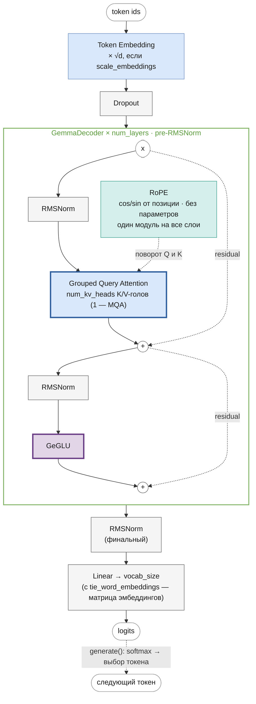

# Gemma
<!-- description: Gemma (Google DeepMind, 2024): Multi-Query Attention в 2B, GeGLU, словарь 256k и масштаб эмбеддингов на √d. -->

Часть II · [← Mixtral](mixtral.md) · [Оглавление](README.md) · [Обозначения →](notation.md)

> Реализация: [`llm/src/llm/models/gemma/gemma.py`](../../llm/src/llm/models/gemma/gemma.py) · класс `Gemma` · ноутбук: [`notebooks/gemma.ipynb`](../../notebooks/gemma.ipynb)

Место в линейке: [GPT-1](gpt.md) → [GPT-2](gpt2.md) → [LLaMA](llama.md) → [Mistral](mistral.md) → [Mixtral](mixtral.md) · **Gemma**. Gemma не продолжает Mixtral, а развивает ту же базу RoPE + RMSNorm, что LLaMA и Mistral, со своими вариантами attention и FFN. Это последняя глава части II; дальше — справочник: [обозначения](notation.md) и [глоссарий](glossary.md).

## Что вы узнаете

- Какие решения отличают Gemma от LLaMA: GeGLU, MQA в модели 2B, словарь 256k с общей матрицей эмбеддингов и выхода, масштаб эмбеддингов $`\sqrt{d}`$, RMSNorm с множителем $`(1 + w)`$.
- Почему у Gemma 7B $`H \cdot d_h \ne d`$ и как это выражается ключом `head_size`.
- Как записать прямой проход Gemma в формулах и какие ключи конфига делают модель такой же, как в статье.
- Как посчитать параметры 2B и 7B и сверить их с таблицей статьи.
- Как загрузить веса HuggingFace и почему к весам RMSNorm прибавляется 1.

## Предварительные знания

- [LLaMA](llama.md) — общая основа RoPE + RMSNorm + gated FFN.
- [Механизм внимания](attention.md) — MQA как частный случай GQA.
- [Эмбеддинги и выходная проекция](embeddings.md) — weight tying и масштаб √d.
- [Feed-forward сеть и активации](feed-forward.md) — GeGLU.

## Обзор

Gemma (Google DeepMind, 2024, [arXiv:2403.08295](https://arxiv.org/abs/2403.08295)) в этом репозитории реализована как RoPE + RMSNorm трансформер с **Multi-Query Attention** по умолчанию (MQA — одна общая голова K/V на все Q-головы, предельный случай GQA; число K/V-голов задаётся ключом `num_kv_heads`) и **GeGLU**-FFN (GELU-gated, а не SiLU-gated, как в SwiGLU). Ключи конфига из [таблицы ниже](#как-в-статье) делают модель такой же, как Gemma 2B/7B, вплоть до загрузки весов HuggingFace.

По сравнению с LLaMA у Gemma четыре заметных отличия: GeGLU вместо SwiGLU, MQA в модели 2B, словарь 256k с общей матрицей эмбеддингов и выходной проекции, умножение эмбеддингов на $`\sqrt{d}`$. Ещё одна деталь реализации — вес RMSNorm хранится как добавка к единице, $`(1 + w)`$.

### Научный вклад

Gemma Team (2024) выпустили семейство открытых моделей, построенных, по словам авторов, на исследованиях и технологиях, созданных для Gemini:

- **Два размера** — 2B и 7B, для каждого предобученный и инструктивный (instruction-tuned) чекпоинт. 2B обучена на 3 трлн токенов, 7B — на 6 трлн, преимущественно английских текстов: веб-документы, математика, код.
- **Токенизатор** — подмножество SentencePiece-токенизатора Gemini со словарём 256k: цифры разбиваются по одной, лишние пробелы сохраняются, неизвестные символы кодируются байтами ([tokenization.md](tokenization.md)).
- **Архитектура** (разд. 2 статьи) — decoder-only трансформер с контекстом 8192 токена и набором известных улучшений:
  - **Multi-Query Attention** в 2B; в 7B — обычный multi-head attention (выбор MQA для 2B авторы обосновывают абляциями, по которым MQA хорошо работает на малом масштабе);
  - **RoPE** в каждом слое ([positional-encoding.md](positional-encoding.md));
  - **GeGLU** вместо ReLU ([feed-forward.md](feed-forward.md#swiglu-и-geglu));
  - **RMSNorm** ([normalization.md](normalization.md));
  - **общие эмбеддинги** входа и выхода (weight tying, [embeddings.md](embeddings.md#weight-tying)) — при словаре 256k это экономит сотни миллионов параметров.
- **Качество.** По заявлению авторов, Gemma превосходит открытые модели сопоставимого размера на 11 из 18 текстовых задач.

Гиперпараметры (табл. 1 статьи):

| | Gemma 2B | Gemma 7B |
|---|---|---|
| $`d`$ (d_model) | 2048 | 3072 |
| $`L`$ (слоёв) | 18 | 28 |
| feedforward hidden dims | 32768 | 49152 |
| $`H`$ (голов Q) | 8 | 16 |
| $`G`$ (голов K/V) | 1 | 16 |
| $`d_h`$ (размер головы) | 256 | 256 |
| словарь | 256128 | 256128 |

Два места этой таблицы нужно читать внимательно:

- «Feedforward hidden dims» — сумма размеров ветвей `gate` и `up` GeGLU. Каждая из них имеет ширину $`d_{ff} = 16384`$ (2B) и $`24576`$ (7B) — так в HF (`intermediate_size`) и в этом репозитории. Это $`8d`$.
- В 7B $`H \cdot d_h = 16 \cdot 256 = 4096 \ne d = 3072`$: проекции Q/K/V расширяют пространство, а $`W_O`$ сжимает его обратно. Поэтому в конфиге нужен явный `head_size`.

В статье не упоминаются две детали, которые есть в эталонном коде (`gemma_pytorch`, HF `GemmaModel`): умножение эмбеддингов на $`\sqrt{d}`$ и RMSNorm с множителем $`(1 + w)`$. Без них веса Gemma не воспроизводятся. Кроме того, в статье сказано, что нормализуется и вход, и выход каждого подслоя; в опубликованной реализации HF Gemma (первого поколения) — только вход (pre-LN, `input_layernorm` и `post_attention_layernorm` перед FFN). Этот репозиторий повторяет реализацию HF.

## Архитектура блока декодера



Как RoPE поворачивает Q и K — в разделе [Attention с RoPE](llama.md#attention-с-rope) документа LLaMA.

## Прямой проход в формулах

Формулы — для Gemma «как в статье» (все ключи из [таблицы](#как-в-статье) включены). Вход — индексы токенов $`x_0, \dots, x_{T-1}`$; $`H^{(l)} \in \mathbb{R}^{T \times d}`$ — скрытые состояния после блока $`l`$.

**Эмбеддинги с масштабом:**

```math
H^{(0)} = \sqrt{d} \cdot E[x_0, \dots, x_{T-1}]
```

где $`E \in \mathbb{R}^{V \times d}`$ — матрица эмбеддингов, $`E[x_0, \dots, x_{T-1}] \in \mathbb{R}^{T \times d}`$ — её строки для токенов входа (строка $`t`$ — $`E[x_t]`$), $`H^{(0)} \in \mathbb{R}^{T \times d}`$ — вход первого блока (dropout в формулах опущен: «как в статье» он равен 0), $`\sqrt{d}`$ — константа ($`\sqrt{2048} \approx 45.25`$ для 2B, $`\sqrt{3072} \approx 55.43`$ для 7B). Тот же множитель был в исходном трансформере ([Vaswani et al., 2017](https://arxiv.org/abs/1706.03762), разд. 3.4). Зачем он при связанных весах — в [embeddings.md](embeddings.md) (раздел «Масштабирование эмбеддингов на √d»): матрица $`E`$ подобрана под роль выходной проекции, и её строки малы для входа в residual-поток.

**RMSNorm Gemma** для строки $`\mathbf{z} \in \mathbb{R}^{d}`$:

```math
\mathrm{RMSNorm}(\mathbf{z}) = \frac{\mathbf{z}}{\sqrt{\frac{1}{d}\sum_{j=1}^{d} z_j^2 + \varepsilon}} \odot (1 + \tilde{\mathbf{w}})
```

где $`\tilde{\mathbf{w}} \in \mathbb{R}^{d}`$ — обучаемый вес в параметризации Gemma (инициализируется **нулями**), $`\varepsilon = 10^{-6}`$. При $`\tilde{\mathbf{w}} = 0`$ множитель равен 1 — то же, что вес RMSNorm LLaMA, инициализированный единицами. Функционально это одна и та же нормализация: $`\mathbf{w} = 1 + \tilde{\mathbf{w}}`$. Отличается лишь то, что хранится в чекпоинте, — и, если применять weight decay к весам нормализации, к чему он их тянет: к 1 в параметризации Gemma, к 0 в обычной.

Пример: $`\mathbf{z} = (1, -1, 2, 0)`$, $`\varepsilon \approx 0`$: $`\sqrt{(1 + 1 + 4 + 0)/4} = \sqrt{1.5} = 1.2247`$, нормализованный вектор $`(0.8165,\, -0.8165,\, 1.6330,\, 0)`$. С $`\tilde{\mathbf{w}} = (0,\, 0.5,\, 0,\, -1)`$ множитель $`(1,\, 1.5,\, 1,\, 0)`$, результат $`(0.8165,\, -1.2247,\, 1.6330,\, 0)`$. В этом репозитории тот же результат даёт `RMSNorm` с весом $`\mathbf{w} = (1,\, 1.5,\, 1,\, 0)`$.

**Блок** $`l = 1, \dots, L`$ (pre-LN, как у LLaMA и Mistral):

```math
\begin{aligned}
U^{(l)} &= H^{(l-1)} + \mathrm{GQA}\big(\mathrm{RMSNorm}_1(H^{(l-1)})\big), \\
H^{(l)} &= U^{(l)} + \mathrm{GeGLU}\big(\mathrm{RMSNorm}_2(U^{(l)})\big).
\end{aligned}
```

где $`U^{(l)} \in \mathbb{R}^{T \times d}`$ — состояние после attention-подслоя блока $`l`$, $`\mathrm{RMSNorm}_1, \mathrm{RMSNorm}_2`$ — две нормализации блока со своими весами.

**Attention** — GQA с RoPE ([attention.md](attention.md#виды-по-числу-голов-kv-mha-gqa-mqa)): для нормализованного входа $`X \in \mathbb{R}^{T \times d}`$ и головы Q $`h = 0, \dots, H-1`$ с номером группы K/V $`\kappa(h) = \lfloor hG/H \rfloor`$ (как в [mixtral.md](mixtral.md#прямой-проход-в-формулах))

```math
O_h = \mathrm{softmax}\Big(\frac{\mathrm{RoPE}(XW_Q^{h})\, \mathrm{RoPE}(XW_K^{\kappa(h)})^{\top}}{\sqrt{d_h}} + M\Big) X W_V^{\kappa(h)},
\qquad
\mathrm{GQA}(X) = [\,O_0; \dots; O_{H-1}\,]\, W_O
```

где $`O_h \in \mathbb{R}^{T \times d_h}`$ — выход головы $`h`$, $`W_Q^{h}, W_K^{c}, W_V^{c} \in \mathbb{R}^{d \times d_h}`$ — проекции головы Q и группы K/V $`c = 0, \dots, G-1`$, $`W_O \in \mathbb{R}^{H d_h \times d}`$, $`M`$ — causal-маска ([masks.md](masks.md)), скользящего окна нет. У 2B $`G = 1`$: все 8 голов Q смотрят в одну пару K/V (MQA). У 7B $`G = H = 16`$ (MHA) и $`d_h = 256`$, $`H d_h = 4096 > d`$.

**GeGLU** ([feed-forward.md](feed-forward.md#swiglu-и-geglu)) для каждой строки $`\mathbf{u} \in \mathbb{R}^{d}`$ матрицы $`\mathrm{RMSNorm}_2(U^{(l)})`$:

```math
\mathrm{GeGLU}(\mathbf{u}) = \Big(\mathrm{GELU}_{\tanh}\big(\mathbf{u} W_{\text{gate}}\big) \odot \mathbf{u} W_{\text{up}}\Big) W_{\text{down}},
\qquad
\mathrm{GELU}_{\tanh}(z) = \tfrac{1}{2} z \Big(1 + \tanh\Big(\sqrt{2/\pi}\,\big(z + 0.044715\, z^3\big)\Big)\Big)
```

где $`W_{\text{gate}}, W_{\text{up}} \in \mathbb{R}^{d \times d_{ff}}`$, $`W_{\text{down}} \in \mathbb{R}^{d_{ff} \times d}`$, $`d_{ff} = 8d`$. От SwiGLU отличается только активацией на ветви `gate`: $`\mathrm{GELU}_{\tanh}`$ вместо SiLU. Для примера: $`\mathrm{GELU}_{\tanh}(1) = 0.8412`$, $`\mathrm{GELU}_{\tanh}(-1) = -0.1588`$ (у SiLU — 0.7311 и −0.2689).

**Выход** — через ту же матрицу $`E`$:

```math
Z = \mathrm{RMSNorm}_f\big(H^{(L)}\big)\, E^{\top} \in \mathbb{R}^{T \times V}
```

где $`Z`$ — логиты, $`\mathrm{RMSNorm}_f`$ — финальная нормализация. Логит токена $`v`$ — скалярное произведение нормализованного скрытого состояния со строкой $`E[v]`$ ([embeddings.md](embeddings.md#weight-tying)). Bias нет нигде.

### Multi-Query Attention и GQA

MQA предложена в [Shazeer, 2019](https://arxiv.org/abs/1911.02150), GQA — в [Ainslie et al., 2023](https://arxiv.org/abs/2305.13245) как обобщение между MQA и MHA. Gemma 2B использует MQA (одна K/V-голова), Gemma 7B — обычный MHA (16 K/V-голов, по одной на Q-голову). Поэтому блок Gemma строится на `GroupedQueryAttention` ([`core/group_query_attention.py`](../../llm/src/llm/core/group_query_attention.py)) без скользящего окна с `num_kv_heads` из конфига: `1` (по умолчанию) — MQA, `num_q_heads` — MHA. При одной K/V-голове она не копируется на все Q-головы, а транслируется в матричном умножении, так что результат побитово совпадает с прежним `MultiQueryAttention` ([`core/multi_query_attention.py`](../../llm/src/llm/core/multi_query_attention.py)); тот остался в `llm.core` как отдельный учебный модуль. KV-кэш слоя — тройка `(K, V, next_pos)`, как у Mistral. Сравнение MHA, GQA и MQA — в [attention.md](attention.md#виды-по-числу-голов-kv-mha-gqa-mqa).

Выигрыш MQA — в размере KV-кэша: на токен и слой он хранит $`2 G d_h`$ чисел. У Gemma 2B это $`2 \cdot 1 \cdot 256 = 512`$, а при MHA с теми же головами было бы $`2 \cdot 8 \cdot 256 = 4096`$ — в 8 раз больше. На 18 слоях и контексте 8192 токена в bfloat16 (2 байта) — $`512 \cdot 18 \cdot 8192 \cdot 2 = 150\,994\,944`$ байт $`= 144`$ МиБ против $`1152`$ МиБ $`\approx 1{,}1`$ ГиБ на одну последовательность (как в таблице [attention.md](attention.md#виды-по-числу-голов-kv-mha-gqa-mqa)).

## Компоненты

| Компонент | Класс | Файл |
|---|---|---|
| Токен-эмбеддинги | `TokenEmbeddings` | [`core/token_embeddings.py`](../../llm/src/llm/core/token_embeddings.py) |
| Выходная проекция | `nn.Linear` или `output_projection(..., tie_weights=True)` | [`core/token_embeddings.py`](../../llm/src/llm/core/token_embeddings.py) |
| Позиционное кодирование | `RoPE` | [`core/rope.py`](../../llm/src/llm/core/rope.py) |
| Нормализация | `RMSNorm` | [`core/rms_norm.py`](../../llm/src/llm/core/rms_norm.py) |
| Attention | `GroupedQueryAttention` (`num_kv_heads` K/V-голов, по умолчанию 1 — MQA; RoPE; без окна) | [`core/group_query_attention.py`](../../llm/src/llm/core/group_query_attention.py) |
| FFN | `GeGLU` (gated GELU-MLP) | [`core/geglu.py`](../../llm/src/llm/core/geglu.py) |
| Блок декодера | `GemmaDecoder` (pre-LN) | [`core/gemma_decoder.py`](../../llm/src/llm/core/gemma_decoder.py) |
| Модель целиком | `Gemma` | [`models/gemma/gemma.py`](../../llm/src/llm/models/gemma/gemma.py) |
| Перенос весов HF | `convert_hf_state_dict` | [`models/gemma/hf_weights.py`](../../llm/src/llm/models/gemma/hf_weights.py) |

## Разбор кода

### `GemmaDecoder`

[`core/gemma_decoder.py`](../../llm/src/llm/core/gemma_decoder.py), `GemmaDecoder(num_q_heads, emb_size, head_size, max_seq_len, rope, dropout=0.1, norm_eps=1e-6, num_kv_heads=1, intermediate_size=None, bias=True)`:

| Атрибут | Модуль | Формула |
|---|---|---|
| `_heads` | `GroupedQueryAttention(num_q_heads, num_kv_heads, emb_size, head_size, max_seq_len, rope, dropout, bias)` — без `window_size` | $`\mathrm{GQA}`$ |
| `_ff` | `GeGLU(emb_size, dropout, hidden_dim=intermediate_size, bias)` | $`\mathrm{GeGLU}`$ |
| `_norm1`, `_norm2` | `RMSNorm(emb_size, eps=norm_eps)` | $`\mathrm{RMSNorm}_1`$, $`\mathrm{RMSNorm}_2`$ |

`forward(x, use_cache=True, cache=None)` — формулы блока:

```python
norm1_out = self._norm1(x)
attention, kv_caches = self._heads(norm1_out, use_cache=use_cache, cache=cache)
out = attention + x                    # U^(l) = H^(l-1) + GQA(RMSNorm1(H^(l-1)))
norm2_out = self._norm2(out)
ffn_out = self._ff(norm2_out)          # GeGLU(RMSNorm2(U^(l)))
# возвращает (ffn_out + out, kv_caches) при use_cache, иначе (ffn_out + out, None)
```

`GeGLU` ([`core/geglu.py`](../../llm/src/llm/core/geglu.py)) — три `nn.Linear` (`_gate`, `_up`, `_down`) и активация `GELU` из [`core/gelu.py`](../../llm/src/llm/core/gelu.py) — tanh-аппроксимация, совпадающая с `gelu_pytorch_tanh` в HF: `out = self._down(self._up(x) * GELU(self._gate(x)))`, затем dropout.

`RMSNorm` ([`core/rms_norm.py`](../../llm/src/llm/core/rms_norm.py)) хранит вес `_w`, инициализированный **единицами**, и возвращает `self._w * norm_x` — то есть параметр $`\mathbf{w} = 1 + \tilde{\mathbf{w}}`$, а не $`\tilde{\mathbf{w}}`$. Для float16/bfloat16 нормализация считается во float32, результат приводится к dtype входа и только потом умножается на вес.

### `Gemma`

[`models/gemma/gemma.py`](../../llm/src/llm/models/gemma/gemma.py), наследник `BaseModel`.

`__init__(config)`:

- `head_size = resolve_head_size(config, "num_q_heads", rope=True)` — `head_size` из конфига или `embed_dim // num_q_heads`;
- необязательные ключи: `rms_norm_eps` (`1e-6`), `intermediate_size` (`None` → `4 · embed_dim` внутри `GeGLU`), `bias` (`True`), `num_kv_heads` (`1`), `rope_theta` (`10000`), `scale_embeddings` (`False`), `tie_word_embeddings` (`False`);
- `self._embedding_scale = math.sqrt(config["embed_dim"])`, если `scale_embeddings`, иначе `None`;
- `_token_embeddings`, один `_position_embeddings` (`RoPE`) на все слои, `_dropout`, `_decoders` из `num_layers` блоков `GemmaDecoder`, финальная `_norm`;
- выходная проекция: при `tie_word_embeddings` — `output_projection(self._token_embeddings, tie_weights=True)`: `nn.Linear` без bias, чей `weight` — **тот же объект** `nn.Parameter`, что и матрица эмбеддингов; иначе — отдельный `nn.Linear(embed_dim, vocab_size, bias=bias)`;
- инициализация как в HF: `init_normal_` — `Linear` и `Embedding` из $`\mathcal{N}(0, 0.02^2)`$ (ключ `initializer_range`), bias — нули.

`forward(x, use_cache=False, cache=None, attention_mask=None)`:

```python
start_pos = cache_start_pos(cache)
check_sequence_length(x.size(1), start_pos, self._max_seq_len)
padding = padding_from_attention_mask(attention_mask, x, start_pos)  # паддинг где угодно; см. masks.md
tok_out = self._token_embeddings(x)                       # [B, T, d]
if self._embedding_scale is not None:
    tok_out = tok_out * torch.tensor(self._embedding_scale, dtype=tok_out.dtype)   # × √d
out = self._dropout(tok_out)
# ... цикл по self._decoders с кэшем, как у Mixtral ...
logits = self._linear(self._norm(out))                    # Z = RMSNorm_f(H^(L)) E^T при tying
```

Множитель $`\sqrt{d}`$ приводится к dtype эмбеддингов **до** умножения, как в HF: в bfloat16 $`\sqrt{2048} \approx 45.2548`$ округляется до 45.25, а $`\sqrt{3072} \approx 55.4256`$ — до 55.5. Это важно для побитового совпадения с HF в половинной точности.

### `convert_hf_state_dict`

[`models/gemma/hf_weights.py`](../../llm/src/llm/models/gemma/hf_weights.py):

```python
def convert_hf_state_dict(hf_state_dict: dict, num_heads: int, num_kv_heads: int = None) -> dict:
    result = _convert_llama_family(hf_state_dict, num_heads=num_heads, num_kv_heads=num_kv_heads)
    for key in result:
        if key.endswith("._w"):  # веса RMSNorm: (1 + w) в HF → w здесь
            result[key] = result[key] + 1
    return result
```

Два шага:

1. **Перенос LLaMA** (`convert_hf_state_dict` из [`models/llama/hf_weights.py`](../../llm/src/llm/models/llama/hf_weights.py)): переименование `model.embed_tokens` → `_token_embeddings._embedding`, `self_attn.{q,k,v,o}_proj` → `_heads._{q,k,v,layer}`, `mlp.{gate,up,down}_proj` → `_ff._{gate,up,down}`, `input_layernorm`/`post_attention_layernorm` → `_norm1`/`_norm2`, `model.norm` → `_norm`, `lm_head` → `_linear`. Строки `q_proj` и `k_proj` переставляются внутри каждой головы: HF хранит пары RoPE как «первая половина головы | вторая половина», а `RoPE` здесь вращает соседние координаты $`(2i, 2i+1)`$ ([llama.md](llama.md#загрузка-весов-huggingface)). Поэтому нужны `num_heads` и `num_kv_heads`. Если `lm_head.weight` в чекпоинте нет, `_linear.weight` получает копию эмбеддингов.
2. **Поправка RMSNorm**: ко всем весам `._w` (обе нормы каждого блока и финальная) прибавляется 1 — переход от $`\tilde{\mathbf{w}}`$ к $`\mathbf{w} = 1 + \tilde{\mathbf{w}}`$.

При связанных весах `state_dict` модели содержит и `_token_embeddings._embedding.weight`, и `_linear.weight` — это один параметр под двумя именами; `load_state_dict` записывает в него одно и то же значение дважды.

## Подсчёт параметров

С weight tying и без bias:

```math
N = \underbrace{V d}_{\text{эмбеддинги = выход}} + L\Big(\underbrace{d \cdot H d_h + 2\, d \cdot G d_h + H d_h \cdot d}_{\text{attention}} + \underbrace{3\, d\, d_{ff}}_{\text{GeGLU}} + \underbrace{2d}_{\text{RMSNorm}}\Big) + \underbrace{d}_{\text{финальная RMSNorm}}
```

Неэмбеддинговые (non-embedding) параметры — всё, кроме $`V d`$.

**Gemma 2B:** $`d = 2048`$, $`L = 18`$, $`H = 8`$, $`G = 1`$, $`d_h = 256`$, $`d_{ff} = 16384`$, $`V = 256\,000`$.

| Часть | Формула | Параметров |
|---|---|---|
| attention слоя | $`2048 \cdot 2048 + 2 \cdot 2048 \cdot 256 + 2048 \cdot 2048`$ | 9 437 184 |
| GeGLU слоя | $`3 \cdot 2048 \cdot 16384`$ | 100 663 296 |
| RMSNorm слоя | $`2 \cdot 2048`$ | 4 096 |
| слой | | 110 104 576 |
| 18 слоёв + финальная норма | $`18 \cdot 110\,104\,576 + 2048`$ | **1 981 884 416** |
| эмбеддинги | $`256\,000 \cdot 2048`$ | 524 288 000 |
| **всего** | | **2 506 172 416 ≈ 2.5 млрд** |

**Gemma 7B:** $`d = 3072`$, $`L = 28`$, $`H = G = 16`$, $`d_h = 256`$, $`d_{ff} = 24576`$.

| Часть | Формула | Параметров |
|---|---|---|
| attention слоя | $`4 \cdot 3072 \cdot 4096`$ | 50 331 648 |
| GeGLU слоя | $`3 \cdot 3072 \cdot 24576`$ | 226 492 416 |
| RMSNorm слоя | $`2 \cdot 3072`$ | 6 144 |
| слой | | 276 830 208 |
| 28 слоёв + финальная норма | $`28 \cdot 276\,830\,208 + 3072`$ | **7 751 248 896** |
| эмбеддинги | $`256\,000 \cdot 3072`$ | 786 432 000 |
| **всего** | | **8 537 680 896 ≈ 8.5 млрд** |

**Сравнение со статьёй** (табл. 2):

| | эмбеддинговые, статья | эмбеддинговые, здесь | неэмбеддинговые, статья | неэмбеддинговые, здесь |
|---|---|---|---|---|
| 2B | 524 550 144 | 524 288 000 | 1 981 884 416 | 1 981 884 416 |
| 7B | 786 825 216 | 786 432 000 | 7 751 248 896 | 7 751 248 896 |

Неэмбеддинговые параметры совпадают до единицы — это подтверждает, что архитектура (размеры, отсутствие bias, по две нормы на блок и финальная) воспроизведена точно. Эмбеддинговые в статье посчитаны для словаря 256 128 строк ($`256\,128 \cdot 2048 = 524\,550\,144`$, $`256\,128 \cdot 3072 = 786\,825\,216`$), а в конфиге HF `vocab_size = 256000`; разница — 128 строк.

Заметьте, что «7B» — это неэмбеддинговые 7.75 млрд; с эмбеддингами модель содержит 8.5 млрд. Эмбеддинги у 2B — 21% всех параметров: без weight tying отдельная выходная матрица добавила бы ещё 524 млн (всего 3.03 млрд).

Проверка на `meta`-устройстве (память под веса не выделяется):

```python
import torch
from llm.models.gemma import Gemma

cfg = {"vocab_size": 256000, "embed_dim": 2048, "num_q_heads": 8, "num_kv_heads": 1, "head_size": 256,
       "num_layers": 18, "max_position_embeddings": 8192, "dropout": 0.0, "intermediate_size": 16384,
       "bias": False, "tie_word_embeddings": True, "scale_embeddings": True}
with torch.device("meta"):
    model = Gemma(cfg)
total = sum(p.numel() for p in model.parameters())   # общий параметр считается один раз
emb = model._token_embeddings._embedding.weight.numel()
print(total, emb, total - emb)                       # 2506172416 524288000 1981884416
```

`model.parameters()` не повторяет один и тот же `nn.Parameter`, поэтому связанная матрица учтена один раз.

**Учебный конфиг** [`gemma_train.json`](../../experiments/llm_only/configs/gemma_train.json): $`V = 1000`$, $`d = 256`$, $`H = 4`$, $`G = 1`$ (по умолчанию), $`d_h = 64`$, $`L = 4`$, $`d_{ff} = 4d`$, bias, отдельная выходная проекция:

| Часть | Параметров |
|---|---|
| attention слоя: $`(256 \cdot 256 + 256) \cdot 2 + (256 \cdot 64 + 64) \cdot 2`$ | 164 480 |
| GeGLU слоя: $`2(256 \cdot 1024 + 1024) + (1024 \cdot 256 + 256)`$ | 788 736 |
| слой (с двумя нормами по 256) | 953 728 |
| эмбеддинги + выход с bias + финальная норма | 513 256 |
| **всего** $`4 \cdot 953\,728 + 513\,256`$ | **4 328 168** |

## Конфигурация

Пример из [`experiments/llm_only/configs/gemma_train.json`](../../experiments/llm_only/configs/gemma_train.json):

| Параметр | Значение в примере | Используется? |
|---|---|---|
| `vocab_size` | (из токенизатора) | ✅ |
| `embed_dim` | 256 | ✅ |
| `num_q_heads` | 4 | ✅ число Query-голов; число K/V-голов — необязательный `num_kv_heads` (по умолчанию `1` — MQA, см. [Как в статье](#как-в-статье)) |
| `num_layers` | 4 | ✅ |
| `max_position_embeddings` | 512 | ✅ |
| `rms_norm_eps` | (нет в примере) | ✅ необязательный `eps` всех RMSNorm, по умолчанию `1e-6` — как в Gemma |
| `rope_theta` | (нет в примере) | ✅ необязательная база частот RoPE, по умолчанию `10000` — как в Gemma; см. [llama.md](llama.md#скорости-вращения-и-база-rope_theta) |
| `initializer_range` | (нет в примере) | ✅ необязательное стандартное отклонение начальных весов `Linear` и `Embedding`, по умолчанию `0.02` — как в HF; см. [training.md](training.md#какие-модели-что-используют) |
| `dropout` | 0.1 | ✅ после эмбеддингов, в attention и GeGLU; в Gemma dropout нет — для соответствия оригиналу `0` |
| `head_size` | 64 | ✅ необязательный; по умолчанию `embed_dim // num_q_heads` |

### Как в статье

Необязательные ключи; без них структура модели прежняя, и старые чекпоинты загружаются. Все, кроме `scale_embeddings`, меняют форму весов, поэтому чекпоинт одного вида в модель другого не загрузится.

| Ключ | По умолчанию | Gemma 2B | Gemma 7B |
|---|---|---|---|
| `num_kv_heads` | `1` (MQA) | `1` | `16` |
| `head_size` | `embed_dim // num_q_heads` | `256` | `256` (≠ 3072 / 16) |
| `intermediate_size` | `4 · embed_dim` | `16384` (8·d) | `24576` (8·d) |
| `bias` | `true` | `false` | `false` |
| `tie_word_embeddings` | `false` | `true` | `true` |
| `scale_embeddings` | `false` | `true` | `true` |
| `rms_norm_eps` | `1e-6` | `1e-6` | `1e-6` |
| `dropout` | — | `0` | `0` |

`scale_embeddings` умножает выход эмбеддингов на `√embed_dim` (множитель приводится к dtype эмбеддингов, как в HF). При tied embeddings одна матрица служит и входом, и выходом, и её норма рассчитана на выходную проекцию; без множителя вход в первый блок был бы на порядок меньше. `tie_word_embeddings` особенно заметен у Gemma: словарь 256 000 токенов, и отдельная голова для 2B — это ещё ~524M параметров.

При обучении **с нуля** важна инициализация. `Gemma`, как HF, инициализирует `Linear` и `Embedding` из $`\mathcal{N}(0, 0.02^2)`$ (`init_normal_`, ключ `initializer_range`), и с `tie_word_embeddings` и `scale_embeddings` начальный cross-entropy на учебном конфиге ($`d = 256`$, $`V = 1000`$) — 7.06 при $`\ln 1000 \approx 6.9`$ (std логитов 0.36). С инициализацией `nn.Embedding` по умолчанию, $`\mathcal{N}(0, 1)`$, те же ключи дают логиты порядка $`\sqrt{d}`$: стандартное отклонение ≈18, начальный cross-entropy ≈258. Почему нужны малые эмбеддинги — в [embeddings.md](embeddings.md) (раздел «Масштабирование эмбеддингов на √d»).

## Загрузка весов HuggingFace

С ключами из таблицы выше загружаются веса `GemmaForCausalLM` — через `convert_hf_state_dict` из [`models/gemma/hf_weights.py`](../../llm/src/llm/models/gemma/hf_weights.py). Это перенос LLaMA ([llama.md](llama.md#загрузка-весов-huggingface): те же имена слоёв и перестановка строк `q_proj`/`k_proj` под RoPE на чередующихся парах) плюс одна поправка: `GemmaRMSNorm` умножает на `(1 + w)`, а `RMSNorm` здесь — на `w`, поэтому к весам всех RMSNorm прибавляется 1 (разбор — в [Разборе кода](#convert_hf_state_dict)).

```python
from transformers import GemmaForCausalLM
from llm.models.gemma import Gemma, convert_hf_state_dict

hf = GemmaForCausalLM.from_pretrained("google/gemma-2b")
c = hf.config
model = Gemma({"vocab_size": c.vocab_size, "embed_dim": c.hidden_size, "num_q_heads": c.num_attention_heads,
               "num_kv_heads": c.num_key_value_heads, "head_size": c.head_dim, "num_layers": c.num_hidden_layers,
               "max_position_embeddings": c.max_position_embeddings, "dropout": 0.0,
               "rms_norm_eps": c.rms_norm_eps, "rope_theta": c.rope_theta, "intermediate_size": c.intermediate_size,
               "bias": False, "tie_word_embeddings": True, "scale_embeddings": True})
model.load_state_dict(convert_hf_state_dict(hf.state_dict(), num_heads=c.num_attention_heads,
                                            num_kv_heads=c.num_key_value_heads))
```

Сверено со случайными `GemmaForCausalLM` из `transformers` в двух формах — MQA с `head_dim = hidden / heads` (как 2B) и MHA с `head_dim ≠ hidden / heads` (как 7B): логиты совпадают до ~1e-5, greedy-генерация с KV-кэшем — токен в токен (`llm/tests/models/test_gemma_hf_parity.py`). Без `scale_embeddings` или без `+1` к весам RMSNorm результат HF не воспроизводится — это тоже проверяет тест. Настоящие веса `google/gemma-2b` закрыты лицензией (доступ после принятия условий на HuggingFace), в проверке они не использовались.

В bfloat16 возможна разница в последних битах: `GemmaRMSNorm` умножает на вес ещё во float32, а `RMSNorm` здесь — после приведения к dtype входа, как `LlamaRMSNorm`.

## Отличия от оригинала

Сравнение с Gemma 2B/7B (статья и `GemmaConfig`/`GemmaModel` в HF). Подробности, воспроизведение и варианты исправления — в [бэклоге](../dev/backlog.md#gemma) (номера пунктов в скобках).

| | Gemma | Здесь |
|---|---|---|
| Масштаб эмбеддингов | умножаются на `√d` перед первым блоком | по умолчанию нет; `scale_embeddings: true` — как в оригинале (42) |
| Выходная проекция | привязана к эмбеддингам (`tie_word_embeddings`) | по умолчанию отдельный `Linear`; `tie_word_embeddings: true` — как в оригинале (43) |
| Bias | нет ни в одной проекции | по умолчанию во всех `Linear`; `bias: false` — как в оригинале (43) |
| Скрытый слой GeGLU | 8·d на каждую из `gate`/`up` (16384 при d = 2048) | по умолчанию 4·d; `intermediate_size` — любой (44) |
| Attention | 2B — MQA, 7B — MHA с 16 головами и `head_dim = 256` ≠ d / heads | по умолчанию MQA; `num_kv_heads` и `head_size` из конфига (45) |
| RMSNorm | вес с нуля, множитель `(1 + w)`, вычисление во float32 | вес с единиц, множитель `w` — при загрузке весов HF к ним прибавляется 1; для float16/bfloat16 нормализация во float32 (46) |
| Dropout | нет | после эмбеддингов, в attention и в GeGLU (55); `dropout: 0` убирает его полностью |

Активация GeGLU — tanh-аппроксимация GELU — совпадает с оригиналом (`gelu_pytorch_tanh` в HF).

## Генерация

`Gemma.generate(...)` — унифицированная сигнатура (см. [gpt.md](gpt.md#генерация) и [generation.md](generation.md)). Благодаря MQA KV-кэш Gemma 2B в 8 раз меньше, чем при MHA с тем же числом голов Q (см. [выше](#multi-query-attention-и-gqa)).

## Типичные ошибки и тонкости

- **Загрузка без `scale_embeddings` или без +1 к весам RMSNorm.** Формы совпадут, ошибки не будет, но результат HF не воспроизведётся. `+1` прибавляет `convert_hf_state_dict`, а `"scale_embeddings": true` нужно задать в конфиге.
- **Gemma 7B без `head_size`.** У 7B $`H d_h = 16 \cdot 256 = 4096 \ne d = 3072`$; без явного `head_size: 256` получится $`d_h = 3072 / 16 = 192`$, и веса не загрузятся.
- **Gemma 7B с `num_kv_heads` по умолчанию.** По умолчанию `1` — MQA, как у 2B; у 7B 16 голов K/V.
- **Эмбеддинги с инициализацией `nn.Embedding` по умолчанию.** С `scale_embeddings` и `tie_word_embeddings` $`\mathcal{N}(0, 1)`$ даёт логиты со стандартным отклонением ≈18 и начальный cross-entropy ≈258; при обучении с нуля оставьте `init_normal_` с `initializer_range`.
- **Сравнение с HF в bfloat16.** `GemmaRMSNorm` умножает на вес во float32, а `RMSNorm` здесь — после приведения к dtype входа; разница в последних битах — не ошибка.
- **Собственный BPE с весами Google.** Индексы токенов не совпадут: нужен токенизатор Gemma из `transformers` со словарём 256 000.

## Линейка от GPT-1 до Gemma

Шесть моделей части II — это одна и та же схема decoder-only трансформера ([language-modeling.md](language-modeling.md)), в которой менялись отдельные узлы:

| | позиция | нормализация | attention | FFN | выход |
|---|---|---|---|---|---|
| [GPT-1](gpt.md) | обучаемые эмбеддинги | LayerNorm, post-LN | MHA | GELU | связан с эмбеддингами (опция) |
| [GPT-2](gpt2.md) | обучаемые эмбеддинги | LayerNorm, pre-LN | MHA | GELU | связан с эмбеддингами (опция) |
| [LLaMA](llama.md) | RoPE | RMSNorm, pre-LN | MHA | SwiGLU | отдельный |
| [Mistral](mistral.md) | RoPE | RMSNorm, pre-LN | GQA + окно | SwiGLU | отдельный |
| [Mixtral](mixtral.md) | RoPE | RMSNorm, pre-LN | GQA | MoE из SwiGLU | отдельный |
| [Gemma](gemma.md) | RoPE | RMSNorm $`(1+w)`$, pre-LN | MQA / MHA | GeGLU | связан, эмбеддинги × √d |

## Итоги

- Gemma — decoder-only трансформер на базе RoPE + RMSNorm с GeGLU ($`d_{ff} = 8d`$ на каждую ветвь), MQA в 2B и MHA в 7B, словарём 256k, связанными эмбеддингами и выходом и умножением эмбеддингов на $`\sqrt{d}`$.
- У 7B $`H d_h = 4096 \ne d = 3072`$, поэтому в конфиге нужен явный `head_size`.
- RMSNorm Gemma хранит добавку $`\tilde{\mathbf{w}}`$ к единице; при загрузке весов HF к весам нормализаций прибавляется 1.
- Параметры: 2 506 172 416 у 2B и 8 537 680 896 у 7B при словаре 256 000; неэмбеддинговые совпадают с табл. 2 статьи до единицы.
- В библиотеке оригинальная структура включается ключами `num_kv_heads`, `head_size`, `intermediate_size`, `bias: false`, `tie_word_embeddings`, `scale_embeddings`; по умолчанию они выключены ради старых чекпоинтов.

## Вопросы и упражнения

1. Почему в Gemma 7B $`H \cdot d_h \ne d`$ — и какие матрицы из-за этого не квадратные? Запишите их формы.

   <details><summary>Ответ</summary>

   $`H d_h = 16 \cdot 256 = 4096`$, $`d = 3072`$. $`W_Q, W_K, W_V \in \mathbb{R}^{3072 \times 4096}`$ (в `nn.Linear` — `weight` формы `[4096, 3072]`), $`W_O \in \mathbb{R}^{4096 \times 3072}`$. Attention работает в пространстве размерности 4096 и сжимает результат обратно в 3072.

   </details>

2. Сколько параметров сэкономила бы Gemma 2B, если бы вместо MQA использовала GQA с $`G = 2`$, — или, наоборот, сколько бы добавилось? А при MHA ($`G = 8`$)?

   <details><summary>Ответ</summary>

   K и V слоя: $`2 \cdot 2048 \cdot G \cdot 256`$. При $`G = 1`$ — 1 048 576, при $`G = 2`$ — 2 097 152 (+1 048 576 на слой, +18 874 368 на модель), при $`G = 8`$ — 8 388 608 (+7 340 032 на слой, +132 120 576 ≈ 132 млн на модель). MQA экономит немного параметров, но главное — в 8 раз меньший KV-кэш.

   </details>

3. Вес RMSNorm в чекпоинте HF равен $`\tilde{w} = -0.3`$. Какое значение окажется в `_w` после `convert_hf_state_dict`? Каким будет выход для нормализованной координаты 2.0?

   <details><summary>Ответ</summary>

   `_w = 1 + (−0.3) = 0.7`; выход $`0.7 \cdot 2.0 = 1.4`$ — так же, как в HF: $`(1 + \tilde{w}) \cdot 2.0 = 1.4`$.

   </details>

4. Токен имеет эмбеддинг с RMS координат 0.02 (инициализация HF). Каков RMS после `scale_embeddings` у Gemma 2B и 7B?

   <details><summary>Ответ</summary>

   $`0.02 \cdot \sqrt{2048} \approx 0.905`$ и $`0.02 \cdot \sqrt{3072} \approx 1.109`$ — порядка 1, как и задумано.

   </details>

5. Повторите подсчёт параметров Gemma 7B на `meta`-устройстве. Затем выключите `tie_word_embeddings`. Сколько параметров добавится и почему у выходной проекции не появляется bias при `bias: false`?

   <details><summary>Ответ</summary>

   Всего с tying — 8 537 680 896; без — 9 324 112 896, то есть $`+256\,000 \cdot 3072 = 786\,432\,000`$. Отдельная проекция создаётся как `nn.Linear(embed_dim, vocab_size, bias=bias)`, и при `bias: false` bias у неё нет. (При tying bias нет в любом случае: `output_projection(..., tie_weights=True)` создаёт `Linear` с `bias=not tie_weights`.)

   </details>

6. Что сломается, если загрузить веса HF Gemma без `+1` к весам RMSNorm? Оцените: чему равен множитель после нормализации у только что инициализированной HF-модели, если её веса загрузить без поправки?

   <details><summary>Ответ</summary>

   У свежей HF-модели $`\tilde{\mathbf{w}} = 0`$. Без поправки `_w = 0`, и каждая RMSNorm выдаёт нули. Attention и GeGLU без bias на нулевом входе дают нули, так что каждый блок просто пропускает residual-поток (эмбеддинги) без изменений; финальная норма обнуляет и его, и все логиты равны 0. У обученных весов $`\tilde{w}`$ не нули, но результат всё равно неверен — множители на 1 меньше нужных.

   </details>

7. (Код.) В `Gemma.forward` множитель $`\sqrt{d}`$ сначала превращается в тензор с dtype эмбеддингов. Проверьте в Python, какое значение получается для $`d = 3072`$ в bfloat16, и объясните, почему `tok_out * math.sqrt(3072)` дал бы в bfloat16 другой результат, чем HF.

   <details><summary>Ответ</summary>

   `torch.tensor(3072 ** 0.5, dtype=torch.bfloat16)` — 55.5 (у bfloat16 8 бит мантиссы, соседние представимые числа около 55 отстоят на 0.25). HF умножает на это округлённое значение. При умножении bfloat16-тензора на Python-float PyTorch использует неокруглённый множитель 55.4256… и округляет только произведение, поэтому результат другой: на 10 000 случайных bfloat16-числах он отличается от умножения на 55.5 примерно в четверти элементов. Явный тензор с dtype эмбеддингов даёт тот же множитель, что и в HF.

   </details>

8. (Ноутбук.) В [`notebooks/gemma.ipynb`](../../notebooks/gemma.ipynb) обучите учебную Gemma дважды: с ключами по умолчанию и с `tie_word_embeddings: true`, `scale_embeddings: true`. Сравните начальный loss и кривые обучения. Как исправить начальный loss во втором случае, не меняя код модели? (Подсказка: `llm.core.weight_init`.)

## Литература

Основная статья:

- Gemma Team. *Gemma: Open Models Based on Gemini Research and Technology*. 2024. [arXiv:2403.08295](https://arxiv.org/abs/2403.08295)

Компоненты:

- Shazeer. *Fast Transformer Decoding: One Write-Head is All You Need*. 2019. [arXiv:1911.02150](https://arxiv.org/abs/1911.02150) — Multi-Query Attention
- Ainslie et al. *GQA: Training Generalized Multi-Query Transformer Models from Multi-Head Checkpoints*. 2023. [arXiv:2305.13245](https://arxiv.org/abs/2305.13245)
- Shazeer. *GLU Variants Improve Transformer*. 2020. [arXiv:2002.05202](https://arxiv.org/abs/2002.05202) — SwiGLU и GeGLU
- Hendrycks, Gimpel. *Gaussian Error Linear Units (GELUs)*. 2016. [arXiv:1606.08415](https://arxiv.org/abs/1606.08415)
- Su et al. *RoFormer: Enhanced Transformer with Rotary Position Embedding*. 2021. [arXiv:2104.09864](https://arxiv.org/abs/2104.09864)
- Zhang, Sennrich. *Root Mean Square Layer Normalization*. 2019. [arXiv:1910.07467](https://arxiv.org/abs/1910.07467)
- Vaswani et al. *Attention Is All You Need*. 2017. [arXiv:1706.03762](https://arxiv.org/abs/1706.03762) — масштабирование эмбеддингов на √d (разд. 3.4)
