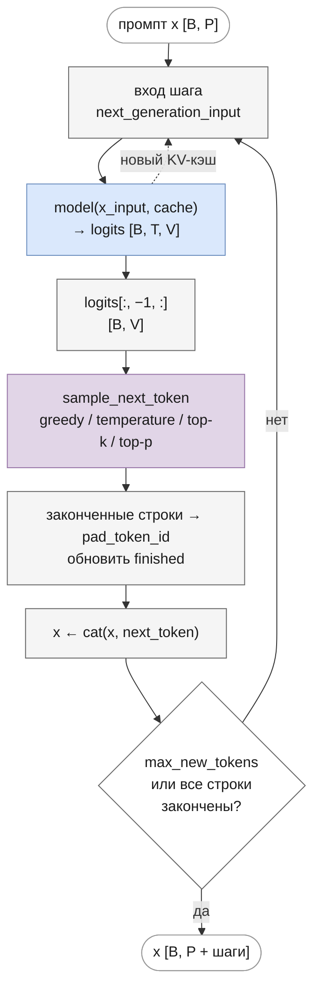
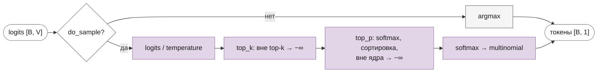

# Генерация текста

Часть I · [← Обучение](training.md) · [Оглавление](README.md) · [GPT-1 →](gpt.md)

## Что вы узнаете

- Как обученная языковая модель пишет текст: авторегрессивный цикл «предсказать → выбрать → дописать».
- Чем отличаются жадный выбор (greedy) и семплирование, что делают температура, top-k и top-p (nucleus), и в каком порядке они применяются в коде.
- Как останавливать генерацию по токену конца текста в батче (`eos_token_id`, `pad_token_id`).
- Зачем нужен KV-кэш, что такое фазы prefill и decode и сколько памяти занимает кэш.
- Что происходит, когда текст становится длиннее контекста модели $`T_{\max}`$.
- Как всё это устроено в `BaseModel.generate` ([`core/base_model.py`](../../llm/src/llm/core/base_model.py)) и [`core/generation.py`](../../llm/src/llm/core/generation.py).

## Предварительные знания

- [Языковое моделирование](language-modeling.md): модель задаёт $`p(x_{t+1} \mid x_{\le t})`$, авторегрессия, цепное правило.
- [Эмбеддинги и выходная проекция](embeddings.md): модель выдаёт логиты $`\mathbf{z} \in \mathbb{R}^{V}`$, вероятности — их softmax.
- [Attention](attention.md): K, V, causal-маска, размер KV-кэша; [маски](masks.md) — `attention_mask` и паддинг.
- [Позиционное кодирование](positional-encoding.md): абсолютные позиции и RoPE.

## Авторегрессивный цикл

Языковая модель не выдаёт текст целиком. По префиксу $`x_0, \dots, x_{t}`$ она даёт распределение **следующего** токена. Цепное правило (см. [language-modeling.md](language-modeling.md)) раскладывает вероятность продолжения в произведение таких условных вероятностей:

```math
p(x_{P}, \dots, x_{P+N-1} \mid x_0, \dots, x_{P-1}) = \prod_{t=P}^{P+N-1} p(x_t \mid x_0, \dots, x_{t-1})
```

где:
- $`x_0, \dots, x_{P-1}`$ — **промпт** (prompt), заданное начало текста длины $`P`$;
- $`x_P, \dots, x_{P+N-1}`$ — $`N`$ генерируемых токенов (`max_new_tokens`);
- $`p(x_t \mid x_{<t})`$ — softmax логитов последней позиции модели.

Отсюда алгоритм: посчитать распределение следующего токена, **выбрать** из него токен, дописать его к последовательности и повторить. Выбранный токен становится частью входа на следующем шаге — поэтому генерация **авторегрессивная** (autoregressive) и строго последовательная: шаг $`t+1`$ нельзя начать, пока не выбран токен шага $`t`$.

```
x ← промпт                                    # [B, P]
повторить max_new_tokens раз:
    logits ← model(x)                          # [B, T, V]
    z ← logits[:, −1, :]                        # логиты последней позиции, [B, V]
    x_next ← выбрать_токен(z)                   # greedy или семплирование, [B, 1]
    x ← concat(x, x_next)                       # [B, T + 1]
    если все строки сгенерировали eos: стоп
вернуть x
```

Нужны логиты только **последней** позиции: остальные предсказывают токены, которые уже известны. При обучении, наоборот, используются все позиции сразу (teacher forcing).



Главный вопрос — как **выбрать** токен из распределения. Этому посвящены следующие разделы.

## Жадный выбор (greedy decoding)

Самое простое — брать самый вероятный токен:

```math
x_t = \arg\max_{v \in \{0, \dots, V-1\}} z_{t-1, v}
```

где $`z_{t-1, v}`$ — логит токена $`v`$ на последней позиции $`t-1`$. Softmax монотонен, поэтому argmax логитов совпадает с argmax вероятностей, и считать softmax не нужно. В коде: `logits.argmax(dim=-1, keepdim=True)` при `do_sample=False`.

**Плюсы:** результат детерминирован, воспроизводим, быстр. Жадный выбор удобен для отладки и сравнения реализаций: в этом репозитории совпадение с HuggingFace проверяют именно greedy-генерацией «токен в токен».

**Минусы:**

1. **Повторения.** Жадный выбор легко попадает в цикл: фраза повысила вероятность самой себя, и модель повторяет её до конца. Holtzman et al. (2020, [arXiv:1904.09751](https://arxiv.org/abs/1904.09751)) показали, что у максимизирующих методов (greedy, beam search) вероятность повтора растёт с каждым повторением — петля самоусиливается. Даже случайная необученная модель из примера ниже в одной из строк уходит в цикл `15 19 20 35 15 19 20 35 …`.
2. **Скучный текст.** Человеческий текст не состоит из самых вероятных слов. Holtzman et al. показали, что вероятность токенов человеческого текста заметно «скачет», а у greedy и beam search она неестественно высока и ровна.
3. **Локальная оптимальность.** Цепочка из самых вероятных токенов на каждом шаге не обязательно самая вероятная последовательность целиком: токен с чуть меньшей вероятностью сейчас может открыть продолжение, у которого произведение вероятностей больше. Эту проблему частично решает beam search (см. [в конце главы](#другие-методы-декодирования)).

## Семплирование из softmax

Вместо argmax можно **семплировать** — выбирать токен случайно с вероятностями модели:

```math
x_t \sim \operatorname{Categorical}(\mathbf{p}), \qquad p_v = \frac{\exp(z_v)}{\sum_{u=0}^{V-1} \exp(z_u)}
```

где:
- $`\mathbf{z} \in \mathbb{R}^{V}`$ — логиты последней позиции;
- $`\mathbf{p}`$ — распределение над словарём, $`\sum_v p_v = 1`$;
- $`\operatorname{Categorical}(\mathbf{p})`$ — случайный выбор индекса $`v`$ с вероятностью $`p_v`$.

В коде это `torch.multinomial(probs, num_samples=1)`. Генерация становится разнообразной, и от петель повторения она уходит сама. Но у чистого семплирования обратная проблема: хвост распределения. Из десятков тысяч маловероятных токенов каждый почти невероятен, но **вместе** они набирают заметную массу. Если 1000 «мусорных» токенов имеют по 0.0001, то с вероятностью 10 % на этом шаге будет выбран один из них, а за 50 шагов такое случится почти наверняка. Одна неудачная выборка сбивает весь последующий текст. Температура, top-k и top-p управляют именно этим компромиссом: разнообразие против надёжности.

Для воспроизводимости семплирования задают seed: `torch.manual_seed(0)` перед `generate`.

## Температура

### Определение

**Температура** (temperature) $`\tau > 0`$ делит логиты перед softmax:

```math
p_i = \frac{\exp(z_i / \tau)}{\sum_{j=0}^{V-1} \exp(z_j / \tau)}
```

где:
- $`z_i`$ — логит токена $`i`$;
- $`\tau`$ — температура (`temperature`), по умолчанию 1 — исходное распределение модели;
- $`p_i`$ — вероятность токена $`i`$ после масштабирования.

Название — из статистической физики: это распределение Больцмана, где $`-z_i`$ играет роль энергии состояния, а $`\tau`$ — температуры. В нейросетях та же форма softmax с температурой используется, например, при дистилляции (Hinton, Vinyals, Dean, 2015, [arXiv:1503.02531](https://arxiv.org/abs/1503.02531)).

**Интуиция.** Отношение вероятностей двух токенов

```math
\frac{p_i}{p_j} = \exp\!\left(\frac{z_i - z_j}{\tau}\right)
```

где $`z_i - z_j`$ — разница логитов. При $`\tau < 1`$ разница «растягивается», сильные токены становятся ещё сильнее — распределение **острее**, текст консервативнее. При $`\tau > 1`$ разница «сжимается» — распределение **ровнее**, текст разнообразнее и рискованнее. Порядок токенов по вероятности температура не меняет.

### Пределы

- $`\tau \to 0^+`$: распределение стремится к one-hot на $`\arg\max`$ (при единственном максимуме) — это **greedy**.
- $`\tau \to \infty`$: распределение стремится к **равномерному** $`1/V`$ — логиты перестают значить что-либо.

<details><summary>Вывод</summary>

Пусть $`z_m`$ — единственный максимальный логит. Разделим числитель и знаменатель на $`\exp(z_m / \tau)`$:

```math
p_i = \frac{\exp\big((z_i - z_m)/\tau\big)}{\sum_j \exp\big((z_j - z_m)/\tau\big)}
```

При $`\tau \to 0^+`$ для $`j \ne m`$ показатель $`(z_j - z_m)/\tau \to -\infty`$ (числитель дроби отрицателен, знаменатель стремится к нулю сверху), поэтому $`\exp(\cdot) \to 0`$. Слагаемое $`j = m`$ равно $`\exp(0) = 1`$. Знаменатель стремится к 1, а числитель — к 1 при $`i = m`$ и к 0 иначе. Получаем $`p_m \to 1`$, $`p_i \to 0`$ для $`i \ne m`$.

Если максимумов несколько ($`n`$ штук), то в знаменателе остаётся $`n`$ единиц, и вероятность делится поровну между ними: $`1/n`$.

При $`\tau \to \infty`$ каждый показатель $`z_j / \tau \to 0`$, все $`\exp(z_j/\tau) \to 1`$, знаменатель стремится к $`V`$, и $`p_i \to 1/V`$.

</details>

В коде нулевая температура запрещена (деление на ноль): при `do_sample=True` и `temperature <= 0` — `ValueError`. Для жадной генерации используйте `do_sample=False`: там температура не используется и не проверяется.

### Численный пример

Логиты трёх токенов $`\mathbf{z} = (2, 1, 0)`$:

| $`\tau`$ | $`\mathbf{z}/\tau`$ | $`\mathbf{p}`$ |
|---|---|---|
| 0.5 | (4, 2, 0) | (0.867, 0.117, 0.016) |
| 1 | (2, 1, 0) | (0.665, 0.245, 0.090) |
| 2 | (1, 0.5, 0) | (0.506, 0.307, 0.186) |
| 100 | (0.02, 0.01, 0) | (0.337, 0.333, 0.330) |

Проверка для $`\tau = 1`$: $`e^2 \approx 7.389`$, $`e^1 \approx 2.718`$, $`e^0 = 1`$, сумма $`\approx 11.107`$; $`7.389 / 11.107 \approx 0.665`$. При $`\tau = 0.5`$ отношение $`p_0 / p_1 = e^{(2-1)/0.5} = e^2 \approx 7.4`$ вместо $`e \approx 2.7`$ при $`\tau = 1`$.

## Top-k

**Top-k sampling** (Fan, Lewis, Dauphin, 2018, [arXiv:1805.04833](https://arxiv.org/abs/1805.04833)) отрезает хвост грубо: оставляет $`k`$ самых вероятных токенов, обнуляет остальные и нормирует заново:

```math
p'_i = \begin{cases} \dfrac{p_i}{\sum_{j \in S_k} p_j}, & i \in S_k \\ 0, & i \notin S_k \end{cases}
```

где:
- $`S_k`$ — множество $`k`$ токенов с наибольшими вероятностями (или логитами — порядок тот же);
- $`k`$ — `top_k`, целое $`\ge 1`$ (в этой главе $`k`$ — параметр семплирования, а не число экспертов MoE);
- $`p'_i`$ — вероятность после отсечения.

На практике это делается на логитах: у токенов вне $`S_k`$ логит заменяется на $`-\infty`$, и softmax сам даёт нули и нормировку ($`\exp(-\infty) = 0`$).

**Пример.** $`\mathbf{p} = (0.5, 0.3, 0.15, 0.05)`$, $`k = 2`$: остаются первые два, $`\mathbf{p}' = (0.5/0.8,\; 0.3/0.8,\; 0,\; 0) = (0.625, 0.375, 0, 0)`$.

**Недостаток:** $`k`$ фиксировано, а форма распределения меняется от шага к шагу. Когда модель уверена (после «Эйфелева» почти наверняка «башня»), $`k = 50`$ оставляет 49 лишних кандидатов. Когда вариантов много (начало нового предложения), $`k = 50`$ может отрезать разумные продолжения. $`k = 1`$ — это greedy.

## Top-p (nucleus sampling)

### Определение

**Top-p**, или **nucleus sampling** (Holtzman et al., 2020, [arXiv:1904.09751](https://arxiv.org/abs/1904.09751)), выбирает число кандидатов адаптивно. **Ядро** (nucleus) $`\mathcal{V}^{(p_{\text{top}})}`$ — **минимальное** по размеру множество самых вероятных токенов, суммарная вероятность которого не меньше порога $`p_{\text{top}}`$:

```math
\mathcal{V}^{(p_{\text{top}})} = \text{наименьшее } S \subseteq \{0, \dots, V-1\} \text{ такое, что } \sum_{v \in S} p_v \ge p_{\text{top}}
```

где:
- $`p_{\text{top}} \in (0, 1]`$ — порог (`top_p`), обычно 0.9–0.95 (в статье Holtzman et al. он обозначен просто $`p`$, здесь индекс отличает его от вероятностей $`p_v`$; каллиграфическое $`\mathcal{V}`$ — множество токенов, а не размер словаря $`V`$);
- $`p_v`$ — вероятность токена $`v`$ (после температуры);
- минимальное множество набирается из самых вероятных токенов — сначала самый вероятный, потом следующий и так далее.

Затем, как и в top-k, вероятности вне ядра обнуляются, а внутри — нормируются. Когда модель уверена, ядро — один-два токена; когда не уверена — сотни.

### Как это реализовано

Отсортируем вероятности по убыванию: $`p_{(1)} \ge p_{(2)} \ge \dots \ge p_{(V)}`$. Токен с рангом $`r`$ входит в ядро, если **сумма вероятностей более вероятных токенов** (без него самого) меньше порога:

```math
r \in \mathcal{V}^{(p_{\text{top}})} \iff \sum_{s=1}^{r-1} p_{(s)} < p_{\text{top}}
```

где $`p_{(s)}`$ — $`s`$-я по величине вероятность, а сумма при $`r = 1`$ пустая и равна 0.

Почему это то же самое, что «минимальное множество с суммой $`\ge p_{\text{top}}`$». Пусть $`c_r = \sum_{s=1}^{r} p_{(s)}`$ — накопленная сумма ($`c_0 = 0`$), и $`r^*`$ — первый ранг, на котором $`c_{r^*} \ge p_{\text{top}}`$. Минимальное ядро — ранги $`1 \dots r^*`$: любое множество из меньшего числа токенов набирает не больше $`c_{r^*-1} < p_{\text{top}}`$, потому что $`r^*-1`$ самых вероятных токенов дают наибольшую сумму среди множеств такого размера. Для $`r \le r^*`$ сумма до токена $`c_{r-1} < p_{\text{top}}`$ (иначе $`r^*`$ был бы меньше), для $`r > r^*`$ — $`c_{r-1} \ge c_{r^*} \ge p_{\text{top}}`$. Значит, условие выделяет ровно ранги $`1 \dots r^*`$, и **токен $`r^*`$, на котором сумма переходит порог, в ядро входит**.

Два следствия: самый вероятный токен остаётся всегда (сумма до него $`0 < p_{\text{top}}`$), а при $`p_{\text{top}} = 1`$ остаётся весь словарь (все $`c_{r-1} < 1`$, если у последнего токена ненулевая вероятность).

В [`core/generation.py`](../../llm/src/llm/core/generation.py), функция `sample_next_token`:

```python
sorted_probs, sorted_indices = torch.sort(
    torch.softmax(logits, dim=-1), descending=True, dim=-1
)
prob_before = torch.cumsum(sorted_probs, dim=-1) - sorted_probs   # c_{r−1}
keep_sorted = prob_before < top_p                                 # условие входа в ядро
keep = torch.zeros_like(logits, dtype=torch.bool).scatter_(-1, sorted_indices, keep_sorted)
logits = logits.masked_fill(~keep, float("-inf"))
```

`scatter_` возвращает маску из отсортированного порядка в порядок словаря. Так же работает `TopPLogitsWarper` в HuggingFace. Частая ошибка — условие `cumsum <= top_p`: оно выбрасывает токен, на котором сумма пересекает порог, и ядро оказывается меньше, чем задано.

### Численный пример

$`\mathbf{p} = (0.5, 0.3, 0.15, 0.05)`$ (уже отсортированы):

```
ранг r            1      2      3      4
p_(r)             0.50   0.30   0.15   0.05
c_(r−1) (до)      0.00   0.50   0.80   0.95
c_r (включая)     0.50   0.80   0.95   1.00
```

| `top_p` | Условие $`c_{r-1} < p_{\text{top}}`$ | Ядро | $`\mathbf{p}'`$ |
|---|---|---|---|
| 0.3 | только $`0 < 0.3`$ | {1} | (1, 0, 0, 0) |
| 0.7 | $`0, 0.5 < 0.7`$ | {1, 2} | (0.625, 0.375, 0, 0) |
| 0.9 | $`0, 0.5, 0.8 < 0.9`$ | {1, 2, 3} | (0.526, 0.316, 0.158, 0) |
| 1.0 | все | {1, 2, 3, 4} | (0.5, 0.3, 0.15, 0.05) |

При `top_p = 0.7` сумма переходит порог на втором токене ($`0.5 < 0.7 \le 0.8`$), и он входит в ядро. Старое условие `cumsum <= 0.7` оставило бы только первый токен. При `top_p = 0.9` сумма ядра $`c_3 = 0.95`$, и нормировка даёт $`0.5/0.95 \approx 0.526`$, $`0.3/0.95 \approx 0.316`$, $`0.15/0.95 \approx 0.158`$.

Граничный случай: при `top_p = 0.8` ровно $`c_2 = 0.8`$, и третий токен входит в ядро, только если $`0.8 < 0.8`$ — нет. Но во float32 сумма $`0.5 + 0.3`$ может оказаться чуть больше или меньше 0.8, так что результат на точной границе зависит от округления.

## Порядок применения в коде

`sample_next_token(logits, do_sample, temperature, top_k, top_p)` в [`core/generation.py`](../../llm/src/llm/core/generation.py) получает логиты последней позиции `[B, V]` и выполняет шаги строго в таком порядке:



1. `do_sample=False` → сразу `argmax`, остальные параметры игнорируются.
2. Деление на температуру: `logits = logits / temperature` (новый тензор; входные логиты не изменяются).
3. Если задан `top_k`: `top_k = min(top_k, V)`, логиты вне `torch.topk` → $`-\infty`$. Значение больше словаря означает весь словарь.
4. Если задан `top_p`: ядро считается по `softmax` **уже масштабированных** логитов, вне ядра → $`-\infty`$.
5. `softmax` и `torch.multinomial` — один токен на строку батча.

Порядок важен в одном месте: **температура применяется до top-p**, поэтому она меняет размер ядра. Та же последовательность (температура, затем top-k, затем top-p) — в HuggingFace. Для top-k порядок с температурой безразличен: деление на положительное число не меняет, какие $`k`$ логитов наибольшие.

**Пример.** $`\mathbf{p} = (0.5, 0.3, 0.15, 0.05)`$, `top_p = 0.6`. При $`\tau = 1`$ ядро {1, 2}: $`0.5 < 0.6`$. При $`\tau = 0.5`$ вероятности возводятся в квадрат и нормируются (так как $`\exp(2 \ln p_i) = p_i^2`$): $`(0.685, 0.247, 0.062, 0.007)`$, и уже первый токен набирает $`0.685 \ge 0.6`$ — ядро {1}, генерация становится жадной.

Одновременно `top_k` и `top_p` задавать нельзя (см. ниже), поэтому порядок шагов 3 и 4 на практике не проявляется.

## Проверка аргументов: `validate_sampling_args`

`generate` первым делом вызывает `validate_sampling_args(do_sample, temperature, top_k, top_p)` из [`core/generation.py`](../../llm/src/llm/core/generation.py). Проверки действуют **только при `do_sample=True`**: при жадной генерации эти параметры не влияют на результат, и, например, `temperature=0` там допустима.

| Условие (при `do_sample=True`) | Результат |
|---|---|
| `temperature <= 0` | `ValueError`: деление на ноль или «перевёрнутое» распределение при отрицательной температуре |
| заданы и `top_k`, и `top_p` | `ValueError`: «top_k и top_p нельзя задавать одновременно» |
| `top_k <= 0` | `ValueError` |
| `top_p` вне $`(0, 1]`$ | `ValueError` |

Запрет комбинации `top_k` + `top_p` — выбор этого репозитория: в HuggingFace их можно задавать вместе. Без проверок `top_k=0` падал бы с невнятной ошибкой в `torch.multinomial`.

## Конец текста: `eos_token_id` и `pad_token_id`

Модель учится выдавать специальный токен **конца текста** (end of sequence, EOS). Генерировать после него бессмысленно. В батче строки заканчиваются в разное время, а тензор должен оставаться прямоугольным. `generate` решает это так:

```python
if pad_token_id is None:
    pad_token_id = eos_token_id
finished = torch.zeros(x.size(0), dtype=torch.bool, device=x.device)   # [B]
...
    if eos_token_id is not None:
        next_token = next_token.masked_fill(finished.unsqueeze(-1), pad_token_id)
        finished |= next_token.squeeze(-1) == eos_token_id
    x = torch.cat([x, next_token], dim=1)
    if eos_token_id is not None and bool(finished.all()):
        break
```

- `finished[b]` — закончила ли строка `b`. В начале все `False`: EOS внутри промпта строку не завершает.
- Строка, которая **уже** закончена, получает `pad_token_id` вместо того, что выбрала модель.
- Строка, выбравшая EOS на этом шаге, помечается законченной; сам EOS остаётся в выходе.
- Когда закончены **все** строки, цикл прерывается раньше `max_new_tokens`. Тогда выход короче `P + max_new_tokens`.
- `pad_token_id` по умолчанию — тот же `eos_token_id`, как в HF. Без `eos_token_id` параметр `pad_token_id` ни на что не влияет.

**Пример.** Две строки, EOS = 21, pad = 0. Первая строка выдала 21 на втором шаге, вторая не выдала EOS:

```
строка 0: [промпт …] 11 21  0  0  0 …     ← после EOS — паддинг
строка 1: [промпт …] 9 16 36 28  3 …       ← генерирует дальше
```

Генерация идёт, пока не закончатся все строки или шаги. Законченные строки продолжают проходить через модель (батч не сжимается) — вычисления на них тратятся впустую, но код проще.

## KV-кэш при генерации

### Проблема: повторные вычисления

Без кэша на каждом шаге модель заново обрабатывает **всю** последовательность, хотя изменился только последний токен. Благодаря causal-маске представления старых позиций от новых токенов не зависят: K и V позиции $`j`$ в каждом слое одни и те же на всех шагах. Их можно посчитать один раз и хранить — это **KV-кэш** (доказательство корректности и формат кэша — в [attention.md](attention.md#kv-кэш)).

### Сложность

Пусть промпт длины $`P`$, генерируется $`N`$ токенов, итоговая длина $`T = P + N`$. Назовём «проходом токена» вычисление всех линейных слоёв (проекции Q/K/V/O, FFN, голова) для одной позиции — это основная часть вычислений, $`O(L d^2)`$ операций.

**Без кэша** шаг $`s`$ ($`s = 0, \dots, N-1`$) обрабатывает $`P + s`$ токенов:

```math
\sum_{s=0}^{N-1} (P + s) = N P + \frac{N (N-1)}{2} = O(T^2) \text{ проходов токена}
```

**С кэшем** первый шаг обрабатывает промпт, а каждый следующий — один новый токен:

```math
P + (N - 1) = O(T) \text{ проходов токена}
```

где $`P`$, $`N`$, $`T`$ — как выше; $`O(\cdot)`$ — при $`N`$ порядка $`T`$.

Скалярные произведения в attention кэш тоже сокращает: без него шаг $`s`$ строит матрицу весов $`(P+s) \times (P+s)`$ — всего $`O(T^3)`$; с кэшем новый токен сравнивается с $`P + s`$ ключами — всего $`O(T^2)`$. От квадратичной стоимости attention по длине кэш не избавляет.

**Пример:** $`P = 100`$, $`N = 100`$. Без кэша $`100 \cdot 100 + 4950 = 14\,950`$ проходов токена, с кэшем $`100 + 99 = 199`$ — в 75 раз меньше.

### Prefill и decode

С кэшем генерация делится на две фазы:

- **Prefill** — первый шаг: весь промпт $`[B, P]`$ проходит через модель одним вызовом, заполняя кэш. Много токенов обрабатываются параллельно, работа упирается в вычисления (большие матричные умножения).
- **Decode** — остальные шаги: в модель подаётся один токен $`[B, 1]`$ и кэш. Вычислений мало, а читать из памяти нужно все веса модели и весь кэш — работа упирается в пропускную способность памяти.

В `generate` это получается само: на первом шаге кэша нет, и `next_generation_input` возвращает весь `x`; дальше — только `x[:, -1:]` и кэш. Позиция нового токена берётся из кэша функцией `cache_start_pos`: для кэша `(K, V)` — длина K, для кэша GQA `(K, V, next_pos)` — `next_pos` (K и V со скользящим окном обрезаны, и их длина не равна позиции).

### Объём кэша

На каждый токен каждый слой хранит K и V для всех голов K/V (та же формула — в [attention.md](attention.md#объём-кэша)):

```math
\text{KV-кэш (байт)} = 2 \cdot L \cdot G \cdot d_h \cdot T \cdot \text{bytes}
```

где:
- 2 — K и V;
- $`L`$ — число слоёв (`num_layers`);
- $`G`$ — число голов K/V (`num_kv_heads`; в MHA $`G = H`$);
- $`d_h`$ — размер головы (`head_size`);
- $`T`$ — число закэшированных токенов (у скользящего окна — не больше ширины окна);
- bytes — байт на число (2 для float16/bfloat16, 4 для float32).

Всё это умножается ещё на размер батча $`B`$. **Пример** (Mistral 7B, $`L = 32`$, $`G = 8`$, $`d_h = 128`$, $`T = 4096`$, float16): $`2 \cdot 32 \cdot 8 \cdot 128 \cdot 4096 \cdot 2 = 536\,870\,912`$ байт = 512 МиБ на одну последовательность. Для Gemma 2B ($`L = 18`$, $`G = 1`$, $`d_h = 256`$) при тех же $`T = 4096`$ и float16 — $`2 \cdot 18 \cdot 1 \cdot 256 \cdot 4096 \cdot 2`$ байт = 72 МиБ. Сравнение MHA, GQA и MQA — в [attention.md](attention.md#зачем-делить-kv-размер-kv-кэша).

В `generate` кэш включён по умолчанию (`use_cache=True`). Результат с ним и без него одинаков (для greedy — токен в токен, это проверяют тесты `test_kv_cache.py`), меняется только скорость.

## Выход за пределы контекста

### Что делает `generate`

Модель умеет обрабатывать не больше $`T_{\max}`$ = `max_position_embeddings` позиций: у обучаемых позиционных эмбеддингов GPT столько строк, таблицы RoPE и causal-маска построены на столько позиций. `forward` каждой модели проверяет это функцией `check_sequence_length(seq_len, start_pos, max_seq_len)`: если `start_pos + seq_len > max_seq_len`, где `start_pos = cache_start_pos(cache)`, — `ValueError`.

Если же генерировать дольше, `generate` не падает, а работает со **скользящим окном** последних $`T_{\max}`$ токенов. Это решает `next_generation_input(x, cache, use_cache, max_seq_len)`:

```python
if x.size(1) > max_seq_len:
    return x[:, -max_seq_len:], None      # окно последних T_max токенов, кэш сброшен
if use_cache and cache is not None:
    return x[:, -1:], cache               # decode: только новый токен
return x, None                            # prefill или генерация без кэша
```

Пока длина $`\le T_{\max}`$, работает обычная схема prefill → decode. Как только последовательность стала длиннее, на **каждом** следующем шаге модель пересчитывает последние $`T_{\max}`$ токенов с нуля, с позициями $`0 \dots T_{\max}-1`$. Кэш, который `forward` при этом возвращает, на следующем шаге выбрасывается. Поэтому генерация за пределами контекста идёт со скоростью генерации без кэша.

### Почему кэш нельзя продолжить

Казалось бы, можно выбросить из кэша самый старый токен и продолжить. Это неверно по двум причинам.

1. **Позиции сдвигаются.** После сдвига окна токен, бывший на позиции $`j`$, оказывается на $`j - 1`$. У GPT позиционный эмбеддинг прибавляется к входу и входит во все K и V всех слоёв — закэшированные K/V посчитаны со старыми позициями. У RoPE ключ повёрнут на угол старой позиции. Для RoPE сдвиг всех позиций на одно и то же число скалярные произведения $`\mathbf{q} \cdot \mathbf{k}`$ не меняет (они зависят от разности позиций), но продолжить нумерацию дальше $`T_{\max}`$ нельзя: таблиц углов для таких позиций нет, а модель на них не обучалась.
2. **Старый контекст «вшит» в кэш.** K и V во втором и следующих слоях вычислены из скрытых состояний, которые смотрели на **выброшенный** токен. Даже если исправить позиции, кэш описывает состояния с контекстом, которого в окне уже нет. Честный результат для окна — прогнать его заново.

Поэтому `generate` пересчитывает окно: результат совпадает с эталоном, который на каждом шаге заново прогоняет последние $`T_{\max}`$ токенов (это проверяет `test_kv_cache.py`).

Скользящее окно внимания Mistral здесь не помогает: оно ограничивает, какие токены **видны**, но позиции продолжают расти, и `check_sequence_length` ограничивает их тем же `max_position_embeddings`.

## `attention_mask` в `generate`

Батч промптов разной длины дополняют **слева**: новые токены должны дописываться сразу после текста каждой строки. `generate` принимает `attention_mask` той же формы, что промпт, `[B, P]` (1 — токен, 0 — паддинг), и проверяет её функцией `check_generation_mask`: последний токен каждой строки должен быть настоящим, иначе `ValueError`. Так отклоняется правый паддинг — с ним генерация продолжилась бы с pad-токена. Маска из одних единиц равносильна `None`.

Дальше маска растёт вместе с последовательностью: на каждом шаге к ней дописывается столбец единиц, и в `forward` она передаётся целиком — вместе с частью, соответствующей кэшу (`[B, cache_len + 1]`). Когда последовательность становится длиннее $`T_{\max}`$, маска обрезается вместе с ней до последних $`T_{\max}`$ столбцов. Внутри `forward` маска превращается в маску ключей и позиции `cumsum(mask) − 1`, поэтому каждая строка батча даёт то же, что её промпт, сгенерированный отдельно. Подробно — в [masks.md](masks.md#attention_mask-и-паддинг).

## `torch.no_grad`

`BaseModel.generate` обёрнут декоратором `@torch.no_grad()`. Без него autograd строил бы граф вычислений на всю генерацию: каждый шаг сохранял бы активации для обратного прохода, и память росла бы с числом шагов. При генерации градиенты не нужны. Без декоратора и логиты в режиме `eval()` имели бы `requires_grad=True`: `eval()` отключает dropout, но не autograd.

`no_grad` не переключает режим модели: dropout выключается только `model.eval()`. Перед генерацией обученной модели вызывайте `model.eval()` (метод `BaseModel.load` возвращает модель уже в `eval`).

## Сигнатура `BaseModel.generate`

Один метод для всех шести моделей ([`core/base_model.py`](../../llm/src/llm/core/base_model.py)); наследники реализуют только `forward` и задают `_max_seq_len`:

```python
@torch.no_grad()
def generate(self, x, max_new_tokens, do_sample, temperature=1.0, top_k=None, top_p=None,
             use_cache=True, attention_mask=None, eos_token_id=None, pad_token_id=None) -> torch.Tensor
```

| Параметр | Тип, по умолчанию | Смысл |
|---|---|---|
| `x` | `LongTensor [B, P]` | промпт — индексы токенов |
| `max_new_tokens` | `int`, обязательный | сколько токенов сгенерировать (меньше — если все строки выдали EOS) |
| `do_sample` | `bool`, обязательный | `False` — greedy (argmax); `True` — семплирование |
| `temperature` | `float`, `1.0` | температура $`\tau > 0`$; только при `do_sample=True` |
| `top_k` | `int` или `None` | оставить `top_k` самых вероятных токенов; больше словаря — весь словарь |
| `top_p` | `float` из $`(0, 1]`$ или `None` | nucleus sampling; нельзя вместе с `top_k` |
| `use_cache` | `bool`, `True` | KV-кэш: тот же результат, быстрее |
| `attention_mask` | `Tensor [B, P]` или `None` | маска промпта; паддинг — только слева (последний токен строки настоящий) |
| `eos_token_id` | `int` или `None` | токен конца текста; остановка, когда все строки его выдали |
| `pad_token_id` | `int` или `None` | чем заполнять законченные строки; по умолчанию `eos_token_id` |

**Возвращает** `LongTensor [B, P + n]`, где `n` — число сделанных шагов (`max_new_tokens` или меньше). Промпт входит в выход.

**Исключения:** `ValueError` — неверные параметры семплирования (см. [выше](#проверка-аргументов-validate_sampling_args)), `attention_mask` не той формы или с паддингом в конце строки; `TypeError` — неизвестный именованный аргумент: опечатка вроде `max_lenght` не проглатывается молча.

## Примеры

Учебная модель со случайными весами — чтобы запустить без обучения:

```python
import torch
from llm.models.gpt import GPT

torch.manual_seed(0)
model = GPT({"vocab_size": 50, "embed_dim": 32, "num_heads": 4, "num_layers": 2,
             "max_position_embeddings": 16, "dropout": 0.0}).eval()
x = torch.randint(0, 50, (2, 10))                         # промпт [B=2, P=10]

# greedy; 30 > 16 — выход за контекст обрабатывается окном
out = model.generate(x, max_new_tokens=20, do_sample=False)
print(out.shape)                                          # torch.Size([2, 30])

# кэш не меняет результат
same = model.generate(x, max_new_tokens=20, do_sample=False, use_cache=False)
print(torch.equal(out, same))                             # True

# семплирование
torch.manual_seed(42)
model.generate(x, max_new_tokens=20, do_sample=True, temperature=0.8)
model.generate(x, max_new_tokens=20, do_sample=True, top_k=10)
model.generate(x, max_new_tokens=20, do_sample=True, top_p=0.9, eos_token_id=3, pad_token_id=0)

# ошибки
model.generate(x, 5, do_sample=True, top_k=5, top_p=0.9)  # ValueError
model.generate(x, 5, do_sample=True, temperature=0)       # ValueError
model.generate(x, 5, do_sample=False, temperature=0)      # можно: greedy температуру не использует
```

С токенизатором (см. [tokenization.md](tokenization.md)) промпт получается кодированием текста, а выход декодируется обратно; для моделей с весами HF — примеры в [gpt.md](gpt.md#загрузка-весов-huggingface) и [gemma.md](gemma.md#загрузка-весов-huggingface).

## Другие методы декодирования

В репозитории реализованы только greedy, температура, top-k и top-p. Для полноты — чем ещё пользуются на практике.

- **Beam search** (лучевой поиск). Хранит $`b`$ лучших частичных последовательностей и на каждом шаге расширяет каждую, оставляя $`b`$ лучших по суммарной log-вероятности. Приближает самую вероятную последовательность целиком — хорош для перевода (использовался, например, в Sutskever, Vinyals, Le, 2014, [arXiv:1409.3215](https://arxiv.org/abs/1409.3215)), но для открытой генерации даёт те же повторения и «скучный» текст, что greedy (Holtzman et al., 2020).
- **Repetition penalty** (штраф за повторения). Логиты уже сгенерированных токенов делятся на коэффициент $`\theta > 1`$, и эти токены становятся менее вероятными (в реализации HF отрицательные логиты на него умножаются). Предложен в CTRL (Keskar et al., 2019, [arXiv:1909.05858](https://arxiv.org/abs/1909.05858)).
- **Speculative decoding** (спекулятивное декодирование). Маленькая «черновая» модель быстро предлагает несколько токенов, большая проверяет их за один проход, а схема принятия/отклонения гарантирует, что распределение выхода совпадает с распределением большой модели (Leviathan, Kalman, Matias, 2023, [arXiv:2211.17192](https://arxiv.org/abs/2211.17192); Chen et al., 2023, [arXiv:2302.01318](https://arxiv.org/abs/2302.01318)). Ускоряет фазу decode, упирающуюся в память.

## Типичные ошибки и тонкости

- **Забыли `model.eval()`.** `no_grad` не выключает dropout — генерация будет шумной и невоспроизводимой.
- **`temperature=0` с `do_sample=True`.** Даёт `ValueError`. Для детерминированного результата — `do_sample=False`.
- **Ожидание, что выход — только новые токены.** `generate` возвращает промпт вместе с продолжением; новые токены — `out[:, x.size(1):]`.
- **Батч промптов разной длины.** Паддинг в `generate` не поддерживается; генерируйте по одному или выровняйте длины.
- **Длинная генерация медленная.** После $`T_{\max}`$ токенов каждый шаг пересчитывает всё окно, кэш не помогает.
- **Top-p на границе.** Если накопленная сумма ровно равна `top_p`, включение следующего токена зависит от округления float32.
- **Сравнение семплирования с кэшем и без.** Для greedy результаты совпадают токен в токен. Для семплирования с тем же seed они обычно тоже совпадают, но крошечные расхождения логитов в последних битах могут изменить выбор, если случайное число попало на границу.

## Итоги

- Генерация — цикл: логиты последней позиции → выбор токена → дописать → повторить.
- Greedy детерминирован, но склонен к повторениям; семплирование разнообразно, но рискует хвостом распределения.
- Температура $`\tau`$ делит логиты: $`\tau \to 0`$ — greedy, $`\tau \to \infty`$ — равномерное распределение.
- Top-k оставляет $`k`$ лучших токенов; top-p — минимальное ядро с суммой $`\ge p_{\text{top}}`$, включая токен, пересекающий порог. В коде: температура → top-k → top-p → softmax → multinomial; `top_k` и `top_p` вместе запрещены.
- `eos_token_id` завершает строки, законченные строки заполняются `pad_token_id`, цикл останавливается, когда закончены все.
- KV-кэш сокращает проходы токенов с $`O(T^2)`$ до $`O(T)`$; prefill — промпт целиком, decode — по одному токену; объём кэша $`2 L G d_h T \cdot \text{bytes}`$.
- За пределами $`T_{\max}`$ `generate` пересчитывает последние $`T_{\max}`$ токенов без кэша: позиции сдвинулись, а старые K/V помнят выброшенный контекст.

## Вопросы и упражнения

1. Логиты $`\mathbf{z} = (1, 1, 0)`$. Чему равны вероятности при $`\tau = 1`$ и в пределе $`\tau \to 0`$?

<details><summary>Ответ</summary>

При $`\tau = 1`$: $`e / (2e + 1) \approx 2.718 / 6.437 \approx 0.422`$ для первых двух и $`1 / 6.437 \approx 0.155`$ для третьего. При $`\tau \to 0`$ максимумов два, и вероятность делится между ними поровну: $`(0.5, 0.5, 0)`$.

</details>

2. Вероятности $`(0.4, 0.3, 0.2, 0.1)`$. Какое ядро и какое распределение после нормировки получатся при `top_p = 0.3`, `0.5`, `0.75`?

<details><summary>Ответ</summary>

Суммы до токена: $`0, 0.4, 0.7, 0.9`$. При `top_p = 0.3` входит только первый токен: $`(1, 0, 0, 0)`$ — хотя его вероятность 0.4 больше порога, самый вероятный токен остаётся всегда. При `top_p = 0.5` входят ранги с суммой до $`< 0.5`$: {1, 2} → $`(0.571, 0.429, 0, 0)`$; второй токен пересекает порог ($`0.4 < 0.5 \le 0.7`$) и входит. При `top_p = 0.75` — {1, 2, 3} → $`(0.444, 0.333, 0.222, 0)`$.

</details>

3. Покажите, что `do_sample=True, top_k=1` даёт тот же результат, что `do_sample=False` (если максимум единственный). А `top_p` — при каком значении?

<details><summary>Ответ</summary>

При `top_k=1` все логиты, кроме максимального, заменяются на $`-\infty`$, softmax даёт one-hot, и `multinomial` всегда выбирает argmax. Для top-p нужно `top_p` $`\le p_{(1)}`$: тогда уже у второго токена сумма до него $`p_{(1)} \ge p_{\text{top}}`$, и в ядре остаётся один токен. Порог зависит от распределения на каждом шаге, поэтому «универсального» значения нет; очень малое `top_p` (например, $`10^{-6}`$) почти всегда даёт greedy.

</details>

4. Промпт $`P = 500`$, генерируется $`N = 500`$ токенов. Во сколько раз меньше проходов токена нужно с кэшем? Как изменится ответ, если $`T_{\max} = 512`$?

<details><summary>Ответ</summary>

Без кэша: $`500 \cdot 500 + 500 \cdot 499 / 2 = 374\,750`$. С кэшем при $`T_{\max} \ge 1000`$: $`500 + 499 = 999`$, в $`\approx 375`$ раз меньше. При $`T_{\max} = 512`$: шаги с длиной входа $`\le 512`$ — prefill 500 и ещё 12 шагов по 1 токену (длины 501…512). Остальные 487 шагов (длины 513…999) пересчитывают окно из 512 токенов. Итого $`500 + 12 + 487 \cdot 512 = 249\,856`$. Без кэша при том же $`T_{\max}`$ вход тоже обрезается до 512: $`\sum_{s=0}^{499} \min(500 + s, 512) = 255\,922`$. Выигрыш от кэша почти исчезает.

</details>

5. Посчитайте объём KV-кэша LLaMA 7B ($`L = 32`$, $`G = H = 32`$, $`d_h = 128`$) на 4096 токенов во float16 для батча из 8 последовательностей.

<details><summary>Ответ</summary>

На одну последовательность $`2 \cdot 32 \cdot 32 \cdot 128 \cdot 4096 \cdot 2 = 2^{31}`$ байт = 2 ГиБ (как в [attention.md](attention.md#зачем-делить-kv-размер-kv-кэша)). На батч 8 — 16 ГиБ, больше, чем веса модели во float16 (~13,4 ГБ).

</details>

6. Почему `generate` не может просто удалить первый элемент из K и V каждого слоя при выходе за $`T_{\max}`$? Приведите оба аргумента и скажите, какой из них остаётся для модели с RoPE.

<details><summary>Ответ</summary>

(1) Позиции всех токенов сдвигаются на единицу, а в кэше K/V посчитаны со старыми позициями; (2) K/V второго и дальнейших слоёв зависят от скрытых состояний, видевших выброшенный токен. Для RoPE сдвиг всех позиций сам по себе скалярные произведения не меняет, но продолжать нумерацию за $`T_{\max}`$ нельзя (нет таблиц и модель там не обучалась), а аргумент (2) остаётся в силе для любой схемы позиций.

</details>

7. (Код.) Сгенерируйте батч из 4 строк с `eos_token_id` и убедитесь, что после первого EOS в каждой строке стоят только `pad_token_id`. Что вернёт `generate`, если EOS выдали все строки на третьем шаге при `max_new_tokens=10`?

<details><summary>Ответ</summary>

Тензор формы `[4, P + 3]`: цикл прерывается после шага, на котором закончилась последняя строка.

</details>

8. Температура и nucleus: при каких $`\tau`$ ядро `top_p = 0.9` для распределения $`(0.5, 0.3, 0.15, 0.05)`$ станет больше трёх токенов? (Подсказка: при $`\tau > 1`$ распределение выравнивается; проверьте численно, например $`\tau = 2`$.)

<details><summary>Ответ</summary>

При температуре $`\tau`$ вероятности пропорциональны $`p_i^{1/\tau}`$. При $`\tau = 2`$: $`\sqrt{p} = (0.707, 0.548, 0.387, 0.224)`$, сумма 1.866, нормировано $`(0.379, 0.294, 0.208, 0.120)`$. Сумма первых трёх $`0.880 < 0.9`$, поэтому ядро — все четыре токена. При $`\tau = 1.5`$ сумма первых трёх ещё $`\approx 0.909`$. Порог — решение уравнения $`\sum_{i\le3} p_i^{1/\tau} = 0.9 \sum_i p_i^{1/\tau}`$, численно $`\tau \approx 1.64`$: при больших температурах ядро — все четыре токена.

</details>

## Литература

- Sutskever, Vinyals, Le. *Sequence to Sequence Learning with Neural Networks*. 2014. [arXiv:1409.3215](https://arxiv.org/abs/1409.3215) — beam search в нейросетевом переводе.
- Hinton, Vinyals, Dean. *Distilling the Knowledge in a Neural Network*. 2015. [arXiv:1503.02531](https://arxiv.org/abs/1503.02531) — softmax с температурой.
- Fan, Lewis, Dauphin. *Hierarchical Neural Story Generation*. 2018. [arXiv:1805.04833](https://arxiv.org/abs/1805.04833) — top-k sampling.
- Keskar et al. *CTRL: A Conditional Transformer Language Model for Controllable Generation*. 2019. [arXiv:1909.05858](https://arxiv.org/abs/1909.05858) — repetition penalty.
- Holtzman, Buys, Du, Forbes, Choi. *The Curious Case of Neural Text Degeneration*. ICLR 2020. [arXiv:1904.09751](https://arxiv.org/abs/1904.09751) — nucleus (top-p) sampling, вырождение greedy и beam search.
- Leviathan, Kalman, Matias. *Fast Inference from Transformers via Speculative Decoding*. 2023. [arXiv:2211.17192](https://arxiv.org/abs/2211.17192).
- Chen et al. *Accelerating Large Language Model Decoding with Speculative Sampling*. 2023. [arXiv:2302.01318](https://arxiv.org/abs/2302.01318).
