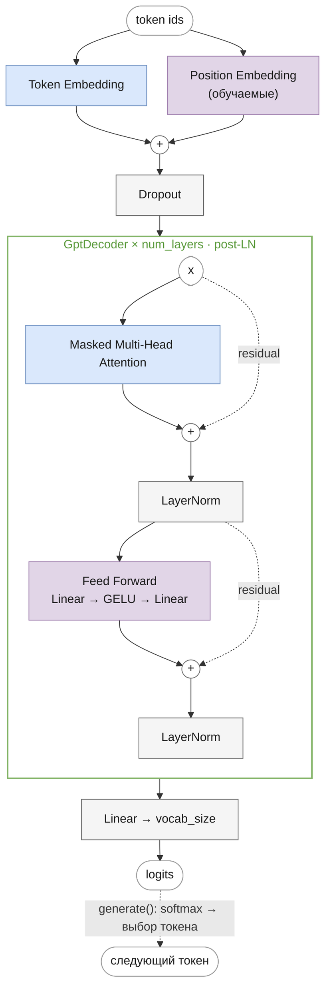
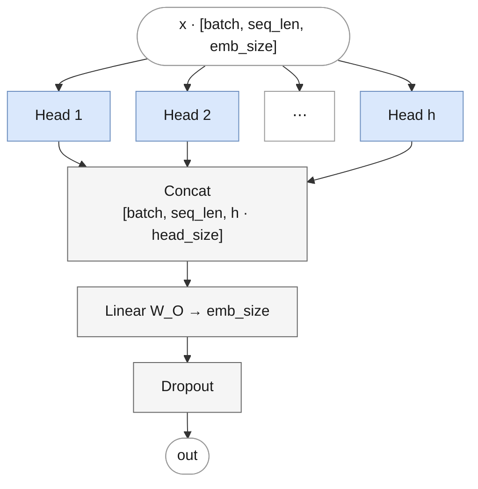
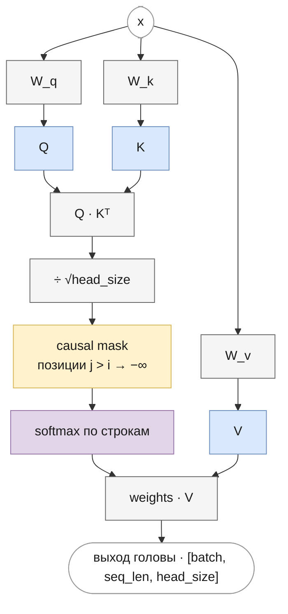
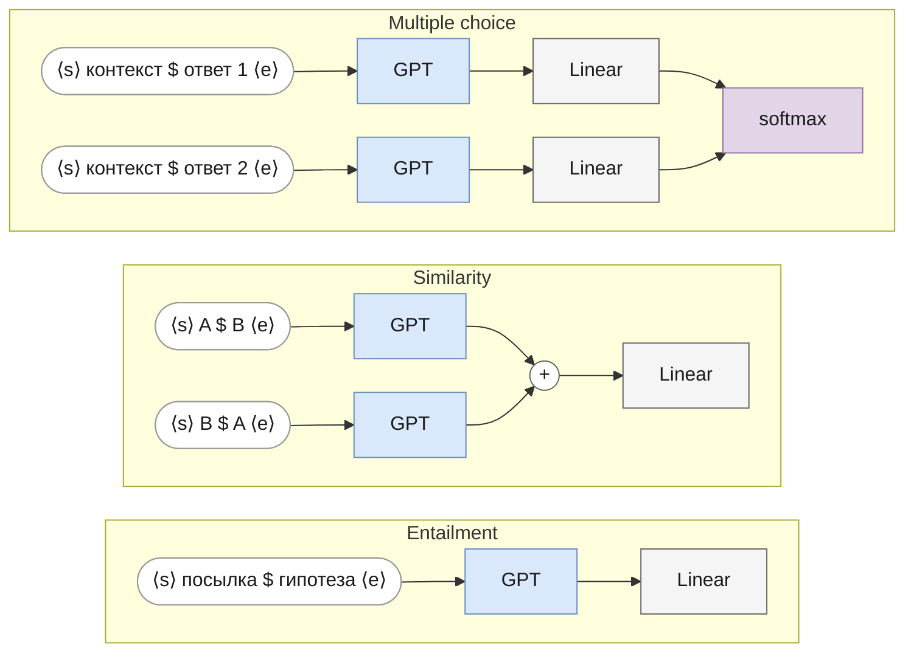

# GPT-1
<!-- description: GPT-1 (OpenAI, 2018): decoder-only трансформер с обучаемыми позициями и post-LN — статья, формулы, код и загрузка весов. -->

Часть II · [← Генерация текста](generation.md) · [Оглавление](README.md) · [GPT-2 →](gpt2.md)

> Реализация: [`llm/src/llm/models/gpt/gpt.py`](../../llm/src/llm/models/gpt/gpt.py) · класс `GPT`
> Ноутбук: [`notebooks/gpt.ipynb`](../../notebooks/gpt.ipynb)

Место в линейке: **GPT-1** → [GPT-2](gpt2.md) → [LLaMA](llama.md) → [Mistral](mistral.md) → [Mixtral](mixtral.md) · [Gemma](gemma.md)

## Что вы узнаете

- какую задачу решала статья GPT-1 и в чём её научный вклад: генеративное предобучение плюс дискриминативное дообучение;
- как устроен прямой проход GPT-1 от индексов токенов до логитов — формулами, с формами тензоров;
- что такое post-LN блок декодера и чем он отличается от pre-LN;
- как посчитать число параметров модели по конфигу и сверить его с кодом;
- как GPT-1 дообучали на классификации, entailment, сходстве и тестах с выбором ответа;
- как всё это реализовано в классах `GPT` и `GptDecoder` и как загрузить в них веса OpenAI.

## Предварительные знания

Эта глава собирает механизмы части I в одну модель и не повторяет их выводы. Понадобятся:

- [языковое моделирование](language-modeling.md) — цепное правило, cross-entropy, общая схема decoder-only трансформера;
- [токенизация](tokenization.md) — BPE;
- [эмбеддинги](embeddings.md) — таблица эмбеддингов, выходная проекция, weight tying;
- [позиционное кодирование](positional-encoding.md) — обучаемые абсолютные позиции;
- [attention](attention.md) и [маски](masks.md) — scaled dot-product, multi-head, causal-маска, KV-кэш;
- [нормализация](normalization.md) — LayerNorm, post-LN и pre-LN;
- [feed-forward](feed-forward.md) — FFN и GELU;
- [обучение](training.md) и [генерация](generation.md).

## Исторический контекст и вклад статьи

К 2018 году в обработке естественного языка было два подхода. Первый — обучать отдельную модель под каждую задачу (классификация, логический вывод, ответы на вопросы) на размеченных данных; таких данных мало, и они дорогие. Второй — брать из неразмеченного текста только представления слов или контекстные представления и подавать их в модель, архитектура которой всё равно подбирается под задачу (обзор этих работ — в разд. 2 статьи GPT-1).

Radford, Narasimhan, Salimans, Sutskever в статье *Improving Language Understanding by Generative Pre-Training* (OpenAI, 2018) предложили переносить **всю модель**, а не только представления. Схема из двух этапов:

1. **Генеративное предобучение (generative pre-training)** — трансформер-декодер обучается как языковая модель, предсказывать следующий токен на большом неразмеченном корпусе.
2. **Дискриминативное дообучение (discriminative fine-tuning)** — к той же модели добавляется один линейный слой, и она дообучается на размеченных данных конкретной задачи. Структурированные входы (пара предложений, вопрос с вариантами ответа) преобразуются в одну последовательность токенов, поэтому архитектура под задачу почти не меняется (см. [Дообучение на задачах](#дообучение-на-задачах)).

Главный научный вклад — показать, что такое предобучение трансформера на длинных связных текстах даёт универсальную модель: по аннотации статьи, общая задаче-независимая модель улучшила лучший известный результат в 9 из 12 исследованных задач. В разделе 5 статьи авторы также показали, что качество на задачах без дообучения (zero-shot, по эвристикам вроде сравнения вероятностей) растёт в ходе предобучения — эта линия станет центральной в [GPT-2](gpt2.md).

Факты о модели и обучении из статьи (разд. 4.1, «Model specifications»):

| Что | Значение в статье |
|---|---|
| Корпус предобучения | BooksCorpus — более 7000 неопубликованных книг разных жанров; выбран за длинные фрагменты связного текста |
| Архитектура | 12-слойный декодер с masked self-attention, 768-мерные состояния, 12 голов |
| Скрытый размер FFN | 3072 |
| Контекст | последовательности из 512 токенов |
| Словарь | BPE с 40 000 слияний; в чекпоинте `openai-community/openai-gpt` — 40 478 токенов (`vocab_size`) |
| Позиции | обучаемые позиционные эмбеддинги вместо синусоид оригинального трансформера |
| Активация | GELU |
| Инициализация | $`\mathcal{N}(0,\ 0{,}02^2)`$ |
| Регуляризация | dropout 0,1 на residual, эмбеддингах и attention; модифицированная L2-регуляризация с $`w = 0{,}01`$ |
| Оптимизация | Adam, максимальный learning rate $`2{,}5 \cdot 10^{-4}`$, линейный warmup 2000 шагов, затем косинусное затухание до 0; 100 эпох, батчи из 64 последовательностей по 512 токенов |

Архитектурно GPT-1 опирается на decoder-only трансформер из работы Liu et al. (2018) — оригинальный трансформер Vaswani et al. (2017) без энкодера и cross-attention.

## Архитектура блока декодера



Обратите внимание: `LayerNorm` стоит **после** сложения с residual-связью (`x + Attention(x)`, затем норма) — это ключевое отличие от GPT-2 и всех более поздних архитектур в этом репозитории, которые используют pre-LN. Финальной нормализации после стека блоков нет: выход последнего блока уже нормализован его `LayerNorm`.

## Прямой проход в формулах

Разберём forward целиком, блок за блоком. Вход — батч индексов токенов $`x \in \{0, \dots, V-1\}^{B \times T}`$, $`T \le T_{\max}`$. Для краткости формулы записаны для одной последовательности (матрицы $`T \times d`$); в коде ко всем тензорам спереди добавляется ось батча $`B`$.

### Шаг 1. Эмбеддинги токенов и позиций

```math
H^{(0)} = \mathrm{Dropout}\big(E[x_0, \dots, x_{T-1}] + P[0, \dots, T-1]\big)
```

где:
- $`E \in \mathbb{R}^{V \times d}`$ — таблица токенных эмбеддингов; $`E[x_t]`$ — её строка с номером $`x_t`$, вектор $`\in \mathbb{R}^{d}`$;
- $`E[x_0, \dots, x_{T-1}] \in \mathbb{R}^{T \times d}`$ — строки, выбранные для всех токенов последовательности;
- $`P \in \mathbb{R}^{T_{\max} \times d}`$ — таблица обучаемых позиционных эмбеддингов; берутся её первые $`T`$ строк (при генерации с кэшем — строки $`s, \dots, s+T-1`$, где $`s`$ — длина кэша);
- $`H^{(0)} \in \mathbb{R}^{T \times d}`$ — вход первого блока.

Каждая строка $`H^{(0)}`$ — «что это за токен» плюс «где он стоит». Позиция нужна, потому что attention сам по себе не различает порядок (см. [positional-encoding.md](positional-encoding.md)). Пример при $`d = 2`$: токен с эмбеддингом $`(0{,}1;\ 0{,}2)`$ на позиции с эмбеддингом $`(0{,}3;\ -0{,}1)`$ даёт вектор $`(0{,}4;\ 0{,}1)`$; тот же токен на другой позиции даст другой вектор.

### Шаг 2. L блоков декодера (post-LN)

Для $`l = 1, \dots, L`$:

```math
\begin{aligned}
U^{(l)} &= \mathrm{LN}_1\big(H^{(l-1)} + \mathrm{MHA}(H^{(l-1)})\big), \\
H^{(l)} &= \mathrm{LN}_2\big(U^{(l)} + \mathrm{FFN}(U^{(l)})\big),
\end{aligned}
```

где:
- $`H^{(l-1)} \in \mathbb{R}^{T \times d}`$ — вход блока $`l`$, $`H^{(l)} \in \mathbb{R}^{T \times d}`$ — его выход;
- $`\mathrm{MHA} : \mathbb{R}^{T \times d} \to \mathbb{R}^{T \times d}`$ — masked multi-head attention (формулы — в [Устройство компонентов](#устройство-компонентов));
- $`\mathrm{FFN} : \mathbb{R}^{T \times d} \to \mathbb{R}^{T \times d}`$ — позиционно-независимая двухслойная сеть, применяется к каждой строке отдельно;
- $`U^{(l)} \in \mathbb{R}^{T \times d}`$ — промежуточное состояние после attention-подблока;
- $`\mathrm{LN}_1, \mathrm{LN}_2`$ — два LayerNorm со своими параметрами $`\gamma, \beta \in \mathbb{R}^{d}`$, применяются к каждой строке.

Форма сохраняется: каждый блок принимает и отдаёт $`T \times d`$, поэтому блоки можно ставить друг за другом в любом количестве. Смешивание информации между позициями происходит только в MHA; FFN и LayerNorm работают с каждой позицией независимо.

### Шаг 3. Выходная проекция и распределение

```math
Z = H^{(L)} W_{\text{out}} + b_{\text{out}}, \qquad p(x_{t+1} \mid x_{\le t}) = \mathrm{softmax}(Z_t)
```

где:
- $`H^{(L)} \in \mathbb{R}^{T \times d}`$ — выход последнего блока;
- $`W_{\text{out}} \in \mathbb{R}^{d \times V}`$, $`b_{\text{out}} \in \mathbb{R}^{V}`$ — веса выходной проекции; при weight tying $`W_{\text{out}} = E^{\top}`$ и $`b_{\text{out}}`$ нет (см. [Weight tying и веса OpenAI](#weight-tying-и-веса-openai));
- $`Z \in \mathbb{R}^{T \times V}`$ — логиты; строка $`Z_t`$ — ненормированные оценки всех токенов словаря как продолжения префикса $`x_0, \dots, x_t`$;
- $`p(x_{t+1} \mid x_{\le t}) \in \mathbb{R}^{V}`$ — распределение следующего токена.

`forward` возвращает только логиты $`Z`$; softmax считается в функции потерь (cross-entropy, см. [language-modeling.md](language-modeling.md)) или в `generate`. Благодаря causal-маске строка $`Z_t`$ зависит только от $`x_0, \dots, x_t`$, поэтому один проход даёт $`T`$ предсказаний сразу — это teacher forcing при обучении.

Сводка форм для учебного конфига (`B = 2`, `T = 16`, `d = 256`, `H = 4`, `V = 1000`):

```
x                       [2, 16]           индексы токенов
E[x], P[0:16]           [2, 16, 256], [16, 256]
H^(0)                   [2, 16, 256]
Q, K, V одного блока    [2, 4, 16, 64]    после разбиения на головы
веса внимания           [2, 4, 16, 16]
H^(l), l = 1..4         [2, 16, 256]
Z (logits)              [2, 16, 1000]
```

## Устройство компонентов

Этот раздел напоминает формулы компонентов с подробными схемами; выводы и обоснования — в главах части I: [attention.md](attention.md), [masks.md](masks.md), [feed-forward.md](feed-forward.md), [normalization.md](normalization.md).

### Multi-Head Attention

Обзор всех видов attention в репозитории (MHA, GQA, MQA, скользящее окно) — в [attention.md](attention.md); GPT-1 использует обычный MHA — у каждой из $`H`$ голов свои Q, K и V (см. [виды по числу голов K/V](attention.md#виды-по-числу-голов-kv-mha-gqa-mqa)).

$`H`$ = `num_heads` голов считаются параллельно; в коде это не отдельные модули, а одна проекция `Linear(emb_size, H · head_size)` для каждого из Q, K, V с последующим `reshape` на головы.

```math
Q = X W_Q + b_Q, \quad K = X W_K + b_K, \quad V = X W_V + b_V
```

где:
- $`X \in \mathbb{R}^{T \times d}`$ — вход подблока (в GPT-1 это $`H^{(l-1)}`$ без нормализации);
- $`W_Q, W_K, W_V \in \mathbb{R}^{d \times H d_h}`$, $`b_Q, b_K, b_V \in \mathbb{R}^{H d_h}`$ — параметры проекций;
- $`Q, K, V \in \mathbb{R}^{T \times H d_h}`$; столбцы $`i d_h, \dots, (i+1) d_h - 1`$ образуют $`Q_i, K_i, V_i \in \mathbb{R}^{T \times d_h}`$ — запросы, ключи и значения головы $`i`$.

По умолчанию $`d_h = d / H`$, так что $`H d_h = d`$ (768 / 12 = 64 в GPT-1). Выход:

```math
\mathrm{MHA}(X) = \mathrm{Dropout}\big(\mathrm{Concat}(\mathrm{head}_1, \dots, \mathrm{head}_H)\, W_O + b_O\big)
```

где $`\mathrm{head}_i \in \mathbb{R}^{T \times d_h}`$ — выход головы $`i`$ (ниже), $`\mathrm{Concat}(\cdot) \in \mathbb{R}^{T \times H d_h}`$ — склейка голов по последней оси, $`W_O \in \mathbb{R}^{H d_h \times d}`$, $`b_O \in \mathbb{R}^{d}`$ — выходная проекция, которая возвращает результат в пространство модели и смешивает головы.



### Одна голова: scaled dot-product attention с causal-маской

```math
\mathrm{head}_i = \mathrm{Dropout}_{\text{attn}}\!\left(\mathrm{softmax}\!\left(\frac{Q_i K_i^{\top}}{\sqrt{d_h}} + M\right)\right) V_i,
\qquad
M_{ts} = \begin{cases} 0, & s \le t \\ -\infty, & s > t \end{cases}
```

где:
- $`Q_i K_i^{\top} \in \mathbb{R}^{T \times T}`$ — матрица оценок: элемент $`(t, s)`$ — скалярное произведение запроса позиции $`t`$ и ключа позиции $`s`$;
- $`\sqrt{d_h}`$ — масштаб, удерживающий дисперсию оценок порядка 1 (вывод — в [attention.md](attention.md));
- $`M \in \mathbb{R}^{T \times T}`$ — causal-маска: запрещает позиции $`t`$ смотреть на будущие позиции $`s > t`$ (см. [masks.md](masks.md));
- softmax берётся по каждой строке (по $`s`$), так что веса в строке неотрицательны и дают в сумме 1;
- $`\mathrm{Dropout}_{\text{attn}}`$ — dropout на весах внимания (`attention_dropout`, по умолчанию 0);
- $`\mathrm{head}_i \in \mathbb{R}^{T \times d_h}`$ — для каждой позиции взвешенное среднее значений $`V_i`$ видимых позиций.

После `softmax` веса замаскированных позиций становятся нулевыми: $`e^{-\infty} = 0`$.



В коде ([`core/multi_head_attention.py`](../../llm/src/llm/core/multi_head_attention.py), `MultiHeadAttention.forward`): `scores = q @ k.transpose(-2, -1) / self._head_size ** 0.5` — дробь под softmax; `scores.masked_fill(~causal_mask, float('-inf'))` — прибавление $`M`$ (маска — нижнетреугольный буфер `_tril_mask`); `weights @ v` — умножение на $`V_i`$ для всех голов сразу, потому что Q, K, V имеют форму `[batch, num_heads, seq_len, head_size]`.

### Feed Forward

```math
\mathrm{FFN}(x) = \mathrm{Dropout}\big(\mathrm{GELU}(x W_1 + b_1)\, W_2 + b_2\big)
```

где:
- $`x \in \mathbb{R}^{d}`$ — одна строка состояния (FFN применяется к каждой позиции отдельно);
- $`W_1 \in \mathbb{R}^{d \times d_{ff}}`$, $`b_1 \in \mathbb{R}^{d_{ff}}`$ — расширяющий слой; $`W_2 \in \mathbb{R}^{d_{ff} \times d}`$, $`b_2 \in \mathbb{R}^{d}`$ — сжимающий;
- $`d_{ff} = 4d`$ — в коде зашито (`emb_size * 4`); для GPT-1 это 3072, как в статье.

GELU по умолчанию — tanh-аппроксимация (`activation="gelu_tanh"`, класс `GELU` в [`core/gelu.py`](../../llm/src/llm/core/gelu.py)), как в оригинальном коде OpenAI:

```math
\mathrm{GELU}(z) \approx \tfrac{1}{2} z \left(1 + \tanh\!\left(\sqrt{2/\pi}\,\big(z + 0{,}044715\, z^3\big)\right)\right)
```

где $`z`$ — скаляр (активация применяется поэлементно). Точная форма $`\mathrm{GELU}(z) = z\,\Phi(z)`$ с функцией распределения стандартного нормального закона $`\Phi`$ и сравнение с ReLU — в [feed-forward.md](feed-forward.md).

```mermaid
flowchart LR
    X(["x"]):::io --> L1["Linear<br/>emb_size → 4·emb_size"]:::gray --> Act["GELU"]:::purple --> L2["Linear<br/>4·emb_size → emb_size"]:::gray --> Drop["Dropout"]:::gray --> Out(["out"]):::io

    classDef io fill:#ffffff,stroke:#999999,color:#1a1a1a;
    classDef add fill:#ffffff,stroke:#666666,color:#1a1a1a;
    classDef blue fill:#dae8fc,stroke:#6c8ebf,color:#1a1a1a;
    classDef blueHl fill:#dae8fc,stroke:#2f5f9e,stroke-width:3px,color:#1a1a1a;
    classDef purple fill:#e1d5e7,stroke:#9673a6,color:#1a1a1a;
    classDef purpleHl fill:#e1d5e7,stroke:#6a3d85,stroke-width:3px,color:#1a1a1a;
    classDef gray fill:#f5f5f5,stroke:#666666,color:#1a1a1a;
    classDef grayHl fill:#f5f5f5,stroke:#333333,stroke-width:3px,color:#1a1a1a;
    classDef gold fill:#fff2cc,stroke:#d6b656,color:#1a1a1a;
    classDef rope fill:#d5f0ec,stroke:#3a9e8f,color:#1a1a1a;
    classDef ropeHl fill:#d5f0ec,stroke:#1f6f63,stroke-width:3px,color:#1a1a1a;
    classDef dim fill:#f5f5f5,stroke:#bbbbbb,color:#999999,stroke-dasharray:4 3;
```



### LayerNorm

```math
\mathrm{LN}(x) = \gamma \odot \frac{x - \mu}{\sqrt{\sigma^2 + \varepsilon}} + \beta,
\qquad \mu = \frac{1}{d}\sum_{j=1}^{d} x_j,\quad \sigma^2 = \frac{1}{d}\sum_{j=1}^{d} (x_j - \mu)^2
```

где $`x \in \mathbb{R}^{d}`$ — одна строка состояния; $`\mu, \sigma^2`$ — скаляры, среднее и дисперсия её координат; $`\gamma, \beta \in \mathbb{R}^{d}`$ — обучаемые масштаб и сдвиг; $`\varepsilon = 10^{-5}`$ (значение по умолчанию `nn.LayerNorm`) защищает от деления на ноль; $`\odot`$ — поэлементное умножение. Подробно — в [normalization.md](normalization.md).

## Post-LN: где стоит нормализация

В GPT-1, как и в оригинальном трансформере, нормализация стоит **после** residual-сложения (**post-LN**): $`\mathrm{LN}(x + f(x))`$. Начиная с GPT-2 её ставят **перед** подблоком (**pre-LN**): $`x + f(\mathrm{LN}(x))`$.

Разница существенна для обучения. В post-LN каждый LayerNorm стоит на основном (residual) пути, и сигнал, и градиент проходят через $`2L`$ нормализаций подряд. Xiong et al. (2020) показали, что у post-LN градиенты параметров у выхода велики в начале обучения, поэтому ему нужен warmup learning rate; в pre-LN residual-путь от входа до выхода — чистая сумма без нормализаций, и глубокие стеки обучаются стабильнее. Подробный разбор — в [normalization.md](normalization.md).

Маленький пример при $`d = 2`$, $`\gamma = (1, 1)`$, $`\beta = 0`$, $`\varepsilon \to 0`$. Пусть $`x = (1, 3)`$ и подблок выдал $`f = (1, 1)`$.
- Post-LN: $`x + f = (2, 4)`$, $`\mu = 3`$, $`\sigma^2 = 1`$, выход $`\mathrm{LN}(2, 4) = (-1, 1)`$. Норма исходного вектора потеряна — на выходе всегда вектор с нулевым средним и единичной дисперсией.
- Pre-LN: $`\mathrm{LN}(x) = (-1, 1)`$ идёт в подблок, а выход $`x + f(\mathrm{LN}(x))`$ сохраняет $`x = (1, 3)`$ целиком как слагаемое.

У post-LN есть плюс: выход каждого блока нормализован, поэтому GPT-1 не нужна финальная нормализация перед выходной проекцией. В pre-LN residual-поток ничем не нормализован, и GPT-2 добавляет финальный LayerNorm.

## Компоненты

| Компонент | Класс | Файл |
|---|---|---|
| Токен-эмбеддинги | `TokenEmbeddings` | [`core/token_embeddings.py`](../../llm/src/llm/core/token_embeddings.py) |
| Позиционные эмбеддинги | `PositionalEmbeddings` (обучаемые, абсолютные) | [`core/positional_embeddings.py`](../../llm/src/llm/core/positional_embeddings.py) |
| Attention | `MultiHeadAttention` (стандартный causal MHA, без RoPE/GQA) | [`core/multi_head_attention.py`](../../llm/src/llm/core/multi_head_attention.py) |
| FFN | `FeedForward` (2-слойный MLP, tanh-аппроксимация GELU — `activation="gelu_tanh"`, как в оригинальном коде OpenAI; меняется ключом `activation` в конфиге) | [`core/feed_forward.py`](../../llm/src/llm/core/feed_forward.py) |
| Блок декодера | `GptDecoder` (**post-LN**) | [`core/gpt_decoder.py`](../../llm/src/llm/core/gpt_decoder.py) |
| Модель целиком | `GPT` | [`models/gpt/gpt.py`](../../llm/src/llm/models/gpt/gpt.py) |

`GptDecoder.forward`:
```
attn_out       = Attention(x)
out            = Norm1(attn_out + x)
ffn_out        = FFN(out)
result         = Norm2(ffn_out + out)
```

Важная деталь: после последнего блока декодера **нет** финальной нормализации — `GPT.forward` идёт напрямую из стека декодеров в `Linear`-проекцию на словарь. (GPT-2 в этом смысле отличается — см. [gpt2.md](gpt2.md).)

## Подсчёт параметров

Посчитаем параметры по компонентам. Предполагаем $`H d_h = d`$ (так по умолчанию) и $`d_{ff} = 4d`$ (так в коде всегда).

| Компонент | Параметры | Откуда |
|---|---|---|
| Токенные эмбеддинги $`E`$ | $`V d`$ | таблица $`V \times d`$ |
| Позиционные эмбеддинги $`P`$ | $`T_{\max} d`$ | таблица $`T_{\max} \times d`$ |
| Attention одного блока | $`4d^2 + 4d`$ | $`W_Q, W_K, W_V, W_O`$ по $`d \times d`$ и четыре bias по $`d`$ |
| FFN одного блока | $`8d^2 + 5d`$ | $`W_1`$: $`d \cdot 4d`$, $`b_1`$: $`4d`$; $`W_2`$: $`4d \cdot d`$, $`b_2`$: $`d`$ |
| Два LayerNorm одного блока | $`4d`$ | по $`\gamma`$ и $`\beta`$ размера $`d`$ у каждого |
| Выходная проекция | $`V d + V`$ без tying; $`0`$ с tying | $`W_{\text{out}}`$ и $`b_{\text{out}}`$; при tying — общая с $`E`$ матрица |

Один блок: $`(4d^2 + 4d) + (8d^2 + 5d) + 4d = 12d^2 + 13d`$. Вся модель:

```math
N_{\text{GPT}} = V d + T_{\max} d + L\,(12 d^2 + 13 d) + \begin{cases} 0, & \text{с weight tying} \\ V d + V, & \text{без него} \end{cases}
```

где $`N_{\text{GPT}}`$ — число обучаемых параметров, остальные символы — из таблицы обозначений ($`V`$ — словарь, $`d`$ — размерность модели, $`T_{\max}`$ — максимальный контекст, $`L`$ — число блоков).

Главный член — $`12 L d^2`$: при большом $`d`$ линейные слои блоков доминируют, а эмбеддинги растут лишь линейно по $`d`$.

**GPT-1** ($`V = 40\,478`$, $`T_{\max} = 512`$, $`d = 768`$, $`L = 12`$, с tying):

```
V·d               = 40 478 · 768            =  31 087 104
T_max·d           =    512 · 768            =     393 216
блок: 12·768² + 13·768 = 7 077 888 + 9 984 =   7 087 872
L · блок          = 12 · 7 087 872          =  85 054 464
итого                                          116 534 784
```

Это совпадает с числом параметров HF-модели `openai-community/openai-gpt`, записанным в [backlog.md](../dev/backlog.md). Блоки — 73 % параметров, эмбеддинги — 27 %. Без tying добавляется $`V d + V = 31\,127\,582`$, итого 147 662 366. В самой статье GPT-1 число параметров не приводится; в статье GPT-2 (табл. 2) самая маленькая модель, 117M, названа эквивалентной исходному GPT.

**Учебный конфиг** [`gpt_train.json`](../../experiments/llm_only/configs/gpt_train.json) ($`d = 256`$, $`L = 4`$, $`T_{\max} = 128`$; `vocab_size` берётся из токенизатора, при `bpe_vocab_size = 1000` возьмём $`V = 1000`$), по умолчанию без tying:

```
V·d = 256 000;  T_max·d = 32 768;  блок = 12·256² + 13·256 = 789 760;  4 блока = 3 159 040
с tying:   256 000 + 32 768 + 3 159 040            = 3 447 808
без tying: 3 447 808 + 1000·256 + 1000             = 3 704 808
```

Проверка на модели из репозитория (`parameters()` возвращает общий тензор при tying один раз, поэтому двойного счёта нет):

```python
from llm.models.gpt import GPT

cfg = {"vocab_size": 40478, "embed_dim": 768, "num_heads": 12, "num_layers": 12,
       "max_position_embeddings": 512, "dropout": 0.0, "tie_word_embeddings": True}
print(sum(p.numel() for p in GPT(cfg).parameters()))  # 116534784
```

Для учебного конфига с `vocab_size=1000` тот же код печатает 3 704 808 (без tying) и 3 447 808 (с tying).

## Конфигурация

Пример из [`experiments/llm_only/configs/gpt_train.json`](../../experiments/llm_only/configs/gpt_train.json):

| Параметр | Значение в примере | Значение в GPT-1 | Смысл |
|---|---|---|---|
| `vocab_size` | (из токенизатора) | 40478 | размер словаря $`V`$ |
| `embed_dim` | 256 | 768 | размерность эмбеддингов и скрытого состояния $`d`$ |
| `num_heads` | 4 | 12 | число attention-голов $`H`$ (`head_size = embed_dim / num_heads`; `embed_dim` должен делиться на `num_heads`, иначе `ValueError`) |
| `head_size` | (нет в примере) | 64 | необязательный размер головы $`d_h`$; по умолчанию `embed_dim // num_heads` (тогда `embed_dim` обязан делиться на `num_heads`). Если задан, `num_heads · head_size` может не совпадать с `embed_dim` |
| `num_layers` | 4 | 12 | число блоков `GptDecoder` в стеке $`L`$ |
| `max_position_embeddings` | 128 | 512 | максимальная длина последовательности $`T_{\max}`$ (размер таблицы позиционных эмбеддингов и causal-маски) |
| `dropout` | 0.1 | 0.1 | dropout на эмбеддингах и на выходах attention и FFN перед residual (`embd_pdrop` и `resid_pdrop` в оригинале) |
| `attention_dropout` | (нет в примере) | 0.1 | необязательный dropout на весах внимания после softmax (`attn_pdrop`), по умолчанию `0.0` |
| `activation` | (нет в примере) | GELU | необязательный: активация FFN — `"gelu_tanh"` (по умолчанию, tanh-аппроксимация GELU, как в оригинальном коде OpenAI), `"gelu"` (точный GELU через erf) или `"relu"` |
| `initializer_range` | (нет в примере) | 0.02 | необязательное стандартное отклонение начальных весов, по умолчанию `0.02` (см. ниже) |
| `tie_word_embeddings` | (нет в примере) | да | необязательный: `true` — выходная проекция без bias делит веса с токенными эмбеддингами, как в оригинале (см. ниже); по умолчанию `false` — отдельный `Linear` с bias |

### Инициализация весов

Как в статье (разд. 4.1) и коде OpenAI, веса `Linear` и `Embedding` инициализируются $`\mathcal{N}(0,\ 0{,}02^2)`$, bias — нулями, `LayerNorm` — весом 1 и нулевым сдвигом (функция `init_normal_` в [`core/weight_init.py`](../../llm/src/llm/core/weight_init.py)). Инициализация PyTorch по умолчанию даёт эмбеддинги $`\mathcal{N}(0, 1)`$ и веса `Linear` с std ≈ $`1/\sqrt{3 \cdot \text{fan\_in}}`$; с $`\mathcal{N}(0,\ 0{,}02^2)`$ логиты свежей модели близки к нулю, и начальный loss — около $`\ln V`$, как у равномерного распределения. Например, у свежей модели учебного конфига с $`V = 1000`$ loss на случайных токенах ≈ 6,9, а $`\ln 1000 \approx 6{,}91`$. Инициализация важна только при обучении с нуля: загрузка чекпоинта её перезаписывает.

Из-за post-LN и малых весов у свежей модели скалярные произведения Q·K почти нулевые и внимание почти равномерное — модель начинает учитывать порядок токенов по мере обучения. Общая теория инициализации — в [training.md](training.md).

### Weight tying и веса OpenAI

В GPT-1 логиты считаются умножением скрытого состояния на ту же матрицу, что хранит токенные эмбеддинги: $`Z = H^{(L)} E^{\top}`$, без bias. Это **weight tying** (связывание весов). Оно видно в формуле (2) статьи — $`P(u) = \mathrm{softmax}(h_n W_e^{\top})`$, где $`W_e`$ — матрица эмбеддингов токенов, — и в оригинальном коде OpenAI (`finetune-transformer-lm/train.py`: `tf.matmul(h, we, transpose_b=True)`), и в HuggingFace (`OpenAIGPTLMHeadModel`). Зачем это нужно и почему это разумно, разобрано в [embeddings.md](embeddings.md).

Здесь tying включается ключом `"tie_word_embeddings": true` (функция `output_projection` в [`core/token_embeddings.py`](../../llm/src/llm/core/token_embeddings.py)): `_linear.weight` — тот же параметр, что `_token_embeddings._embedding.weight`, и градиенты от входа и от выхода складываются в нём. Модель становится меньше на `vocab_size · embed_dim + vocab_size` параметров. По умолчанию ключ выключен, чтобы загружались чекпоинты, сохранённые раньше: в них есть отдельные `_linear.weight` и `_linear.bias`. Чекпоинт одного вида в модель другого не загружается.

`nn.Linear` хранит вес в форме `[out, in]` и считает $`x W^{\top} + b`$. У выходной проекции `weight` имеет форму `[V, d]` — ровно как таблица эмбеддингов, поэтому связывание — это просто один и тот же тензор в двух модулях, без транспонирования.

С `tie_word_embeddings` загружаются веса [`openai-community/openai-gpt`](https://huggingface.co/openai-community/openai-gpt) — через `convert_hf_state_dict` из [`models/gpt/hf_weights.py`](../../llm/src/llm/models/gpt/hf_weights.py):

```python
from transformers import OpenAIGPTLMHeadModel
from llm.models.gpt import GPT, convert_hf_state_dict

hf = OpenAIGPTLMHeadModel.from_pretrained("openai-community/openai-gpt")
model = GPT({"vocab_size": 40478, "embed_dim": 768, "num_heads": 12, "num_layers": 12,
             "max_position_embeddings": 512, "dropout": 0.0, "tie_word_embeddings": True})
model.load_state_dict(convert_hf_state_dict(hf.state_dict()))
```

Логиты совпадают с HF с точностью до ~2e-5, greedy-генерация — токен в токен. Активация по умолчанию подходит: `afn="gelu"` в конфиге HF для этой модели означает tanh-аппроксимацию (своя таблица активаций в `modeling_openai.py`), то есть наш `"gelu_tanh"`. Для генерации текста нужен и токенизатор этой модели (`OpenAIGPTTokenizer` из `transformers`): собственный BPE репозитория ([tokenization.md](tokenization.md)) даёт другие индексы.

Что делает `convert_hf_state_dict` (одна функция для GPT-1 и GPT-2):

1. Снимает префикс `transformer.` и переименовывает верхнеуровневые ключи: `tokens_embed` (GPT-1) и `wte` (GPT-2) → `_token_embeddings._embedding`, `positions_embed` / `wpe` → `_position_embeddings.embedding`, `ln_f` → `_norm` (есть только у GPT-2).
2. `lm_head.weight` пропускает — он совпадает с эмбеддингами; пропускает и буферы causal-маски старых чекпоинтов (`attn.bias`, `attn.masked_bias`).
3. В блоках HF использует слой `Conv1D`, который хранит вес в форме `[in, out]` (и считает $`xW + b`$), а `nn.Linear` — `[out, in]`, поэтому веса `c_attn`, `c_proj`, `c_fc` транспонируются.
4. HF хранит Q, K, V одной матрицей `c_attn` формы `[d, 3d]`; после транспонирования `[3d, d]` она режется `torch.chunk(value, 3, dim=0)` на `_heads._q`, `_heads._k`, `_heads._v`. Остальные имена: `attn.c_proj` → `_heads._layer`, `mlp.c_fc` → `_ff._layer1`, `mlp.c_proj` → `_ff._layer2`, `ln_1` → `_norm1`, `ln_2` → `_norm2`.
5. В конце добавляет `_linear.weight` — ссылку на ту же матрицу эмбеддингов: `load_state_dict` ждёт оба ключа.

Неизвестный ключ даёт `KeyError` — так не получится молча загрузить чекпоинт другой архитектуры.

## Как это устроено в коде

### `GPT.__init__`

[`models/gpt/gpt.py`](../../llm/src/llm/models/gpt/gpt.py), класс `GPT` (наследник `BaseModel` из [`core/base_model.py`](../../llm/src/llm/core/base_model.py), который даёт `generate`, `save`, `load`):

| Строка кода | Что создаёт | В формулах |
|---|---|---|
| `head_size = resolve_head_size(config, "num_heads")` | размер головы с проверкой делимости ([`core/config_checks.py`](../../llm/src/llm/core/config_checks.py)) | $`d_h`$ |
| `self._max_seq_len = config["max_position_embeddings"]` | предел длины для проверок и `generate` | $`T_{\max}`$ |
| `self._token_embeddings = TokenEmbeddings(...)` | `nn.Embedding(V, d)` | $`E`$ |
| `self._position_embeddings = PositionalEmbeddings(...)` | `nn.Embedding(T_max, d)` | $`P`$ |
| `self._dropout = nn.Dropout(config["dropout"])` | dropout на сумме эмбеддингов | Dropout шага 1 |
| `self._decoders = nn.ModuleList([GptDecoder(...) ...])` | $`L`$ блоков | шаг 2 |
| `self._linear = output_projection(...)` | `Linear(d, V)`; при tying — без bias и с общим весом | $`W_{\text{out}}, b_{\text{out}}`$ |
| `self.apply(partial(init_normal_, std=...))` | инициализация $`\mathcal{N}(0,\ 0{,}02^2)`$ | |

`GptDecoder.__init__` ([`core/gpt_decoder.py`](../../llm/src/llm/core/gpt_decoder.py)) создаёт `_heads = MultiHeadAttention(...)`, `_ff = FeedForward(..., activation=activation)`, `_norm1`, `_norm2 = nn.LayerNorm(emb_size)`. Отдельный класс `GptDecoder` нужен именно из-за post-LN: остальные блоки декодера в репозитории — pre-LN.

### `GPT.forward`

```python
def forward(self, x, attention_mask=None, use_cache=False, cache=None):
    start_pos = cache_start_pos(cache)                              # s — длина кэша
    check_sequence_length(x.size(1), start_pos, self._max_seq_len)  # s + T ≤ T_max
    padding = padding_from_attention_mask(attention_mask, x, start_pos)  # None без нулей в маске
    tok_out = self._token_embeddings(x)                             # E[x]     [B, T, d]
    pos_out = self._position_embeddings(seq_len, start_pos=start_pos).unsqueeze(0)  # P[s:s+T] [1, T, d]
    # при паддинге: self._position_embeddings(seq_len, positions=padding.positions)  [B, T, d]
    out = self._dropout(tok_out + pos_out)                          # H^(0)    [B, T, d]
    for i, decoder in enumerate(self._decoders):                    # H^(l), padding передаётся в каждый блок
        ...
    logits = self._linear(out)                                      # Z        [B, T, V]
```

(фрагмент сокращён: цикл передаёт в каждый блок `padding` и собирает новый KV-кэш по слоям, если `use_cache=True`). Возвращается кортеж `(logits, new_cache)`; при `use_cache=False` второй элемент — `None`.

Детали:

- Без паддинга `.unsqueeze(0)` превращает `[T, d]` в `[1, T, d]`, и сложение с `[B, T, d]` проходит по правилам broadcasting: одни и те же позиционные векторы прибавляются к каждой последовательности батча.
- `check_sequence_length` запрещает выйти за $`T_{\max}`$: у обучаемых позиций нет строки для позиции $`T_{\max}`$ и дальше.
- `padding_from_attention_mask` по маске с нулями строит маску ключей и позиции `cumsum(mask) − 1` для каждой строки батча; паддинг допускается в любом месте строки (см. [masks.md](masks.md#attention_mask-и-паддинг)).
- Порядок позиционных аргументов у `GPT.forward` — `(x, attention_mask, use_cache, cache)`, а у `GPT2.forward` — `(x, use_cache, cache, attention_mask)`. `generate` передаёт их по имени, так что это безопасно; в своём коде тоже передавайте по имени.

`GptDecoder.forward` реализует шаг 2 буквально: `out = self._norm1(attention + x)` — это $`U^{(l)}`$, `result = self._norm2(ffn_out + out)` — это $`H^{(l)}`$.

## Дообучение на задачах

> В репозитории дообучения GPT-1 на задачах нет: `GPT` — только языковая модель, у неё нет классификационной головы, специальных токенов и функции потерь для задач. Раздел описывает, как это сделано в статье (разд. 3.2–3.3, рис. 1).

После предобучения модель дообучается на размеченном наборе $`\mathcal{C}`$, где каждый пример — последовательность токенов $`x^1, \dots, x^m`$ и метка $`y`$. Вход прогоняется через предобученную модель, берётся состояние последнего блока на последнем токене $`h_l^m \in \mathbb{R}^{d}`$ и подаётся в новый линейный слой:

```math
P(y \mid x^1, \dots, x^m) = \mathrm{softmax}\big(h_l^m W_y\big)
```

где $`W_y \in \mathbb{R}^{d \times C}`$ — единственные новые параметры ($`C`$ — число классов), $`h_l^m`$ — выход последнего блока на позиции последнего токена (из-за causal-маски только он «видел» весь вход).

Функция потерь дообучения — сумма потерь задачи и вспомогательной потери языкового моделирования:

```math
L_3(\mathcal{C}) = L_2(\mathcal{C}) + \lambda \cdot L_1(\mathcal{C})
```

где $`L_2`$ — log-правдоподобие меток $`\sum_{(x, y)} \log P(y \mid x^1, \dots, x^m)`$, $`L_1`$ — log-правдоподобие языковой модели на тех же текстах, $`\lambda = 0{,}5`$ в экспериментах статьи (статья записывает правдоподобия, которые максимизируются; в коде это были бы cross-entropy со знаком минус). По разд. 5 статьи вспомогательная потеря помогает на больших наборах и почти не помогает на маленьких.

Ключевая идея — **входные преобразования (input transformations)**: задачи со структурированным входом сводятся к одной или нескольким последовательностям токенов, которые понимает языковая модель. Добавляются случайно инициализированные специальные токены: начало `<s>`, разделитель `$` и конец (extract) `<e>`.

| Задача | Как строится вход | Как получается ответ |
|---|---|---|
| Классификация (тональность, грамматичность) | `<s> текст <e>` | $`h_l^m`$ → линейный слой |
| Логический вывод (entailment): посылка и гипотеза | `<s> посылка $ гипотеза <e>` | $`h_l^m`$ → линейный слой (3 класса: следует, противоречит, нейтрально) |
| Сходство двух предложений | две последовательности: `<s> A $ B <e>` и `<s> B $ A <e>` — у пары нет естественного порядка | обе прогоняются независимо, их $`h_l^m`$ складываются поэлементно → линейный слой |
| Вопросы с выбором ответа (multiple choice), здравый смысл | для каждого варианта $`a_k`$: `<s> контекст вопрос $ a_k <e>` | каждая прогоняется независимо, линейный слой даёт скаляр, softmax по вариантам |



Все «GPT» на схеме — одна и та же модель с общими весами. Гиперпараметры дообучения в статье: dropout классификатора 0,1, learning rate $`6{,}25 \cdot 10^{-5}`$, батч 32, как правило 3 эпохи, линейный warmup на 0,2 % обучения.

Чтобы воспроизвести это на `GPT` из репозитория, пришлось бы добавить специальные токены в словарь (строки в $`E`$), получить скрытые состояния последнего блока (сейчас `forward` возвращает только логиты) и добавить $`W_y`$ с функцией потерь $`L_3`$.

## Генерация

Генерация одинакова для всех моделей репозитория и подробно разобрана в главе [generation.md](generation.md). Кратко:

- `generate(x, max_new_tokens, do_sample, temperature=1.0, top_k=None, top_p=None, use_cache=True, attention_mask=None, eos_token_id=None, pad_token_id=None)` — один метод `BaseModel.generate` ([`core/base_model.py`](../../llm/src/llm/core/base_model.py)); выбор токена — `sample_next_token` в [`core/generation.py`](../../llm/src/llm/core/generation.py): greedy (`do_sample=False`), sampling с температурой, top-k, top-p.
- С `eos_token_id` законченные строки дополняются `pad_token_id` (по умолчанию тем же `eos_token_id`); генерация останавливается, когда закончены все строки. Градиенты не считаются; неизвестный именованный аргумент — `TypeError`.
- С KV-кэшем в `forward` подаётся только новый токен, а его позиция берётся из длины кэша (`cache_start_pos`); при паддинге — из `attention_mask`: номер токена среди настоящих токенов строки.
- Когда последовательность становится длиннее `max_position_embeddings`, `generate` берёт последние `max_position_embeddings` токенов и пересчитывает их без кэша: при сдвиге окна абсолютные позиции всех токенов меняются, и закэшированные K/V больше не годятся.
- Промпты разной длины генерируются одним батчем с левым паддингом и `attention_mask`; каждая строка даёт то же, что её промпт отдельно — см. [masks.md](masks.md#attention_mask-и-паддинг).

```python
import torch
from llm.models.gpt import GPT

model = GPT({"vocab_size": 1000, "embed_dim": 256, "num_heads": 4, "num_layers": 4,
             "max_position_embeddings": 128, "dropout": 0.1})
model.eval()
prompt = torch.randint(0, 1000, (2, 4))
out = model.generate(prompt, max_new_tokens=5, do_sample=False)  # [2, 9]
```

## Отличия от оригинала

| Что | Статья / код OpenAI | Этот репозиторий |
|---|---|---|
| Weight tying | есть (формула (2) статьи) | ключ `tie_word_embeddings`, по умолчанию выключен (отдельный `Linear` с bias) |
| Dropout внимания | 0,1 | `attention_dropout`, по умолчанию 0 |
| Токенизатор | BPE с 40 000 слияний, предобработка ftfy и spaCy | собственный BPE ([tokenization.md](tokenization.md)); для весов OpenAI нужен токенизатор HF |
| Регуляризация | модифицированная L2 с $`w = 0{,}01`$ | не реализована в модели (относится к оптимизатору, см. [training.md](training.md)) |
| Дообучение | классификационная голова, специальные токены, потеря $`L_3`$ | нет |
| Размер FFN | 3072 = $`4d`$ | всегда $`4d`$, не настраивается |
| Активация | GELU (в коде OpenAI — tanh-аппроксимация) | `"gelu_tanh"` по умолчанию, можно `"gelu"` или `"relu"` |

## Что изменилось в GPT-2

- нормализация: **post-LN → pre-LN**;
- появляется финальная нормализация перед выходной проекцией;
- выходные проекции residual-подблоков инициализируются с уменьшенным std;
- словарь — byte-level BPE на 50 257 токенов, контекст — 1024;
- FFN и attention переиспользуют ту же математику (GELU, стандартный MHA), но собраны в отдельный класс `Gpt2Decoder` вместо параметризуемого `GptDecoder`.

Подробности — в [gpt2.md](gpt2.md).

## Итоги

- GPT-1 ввёл схему «генеративное предобучение языковой модели + дискриминативное дообучение всей модели» и улучшил лучший результат в 9 из 12 задач.
- Архитектура: обучаемые эмбеддинги токенов и позиций → $`L`$ post-LN блоков (MHA + GELU-FFN) → линейная проекция на словарь, связанная с эмбеддингами.
- Post-LN нормализует выход каждого блока, поэтому финальной нормализации нет; ценой этого — менее стабильное обучение глубоких стеков.
- Параметры: $`Vd + T_{\max} d + L(12d^2 + 13d)`$ с tying; для GPT-1 — 116 534 784.
- В репозитории — классы `GPT` и `GptDecoder`; веса OpenAI загружаются через `convert_hf_state_dict` при `tie_word_embeddings=True`.

## Вопросы и упражнения

1. Почему в GPT-1 нет LayerNorm между последним блоком и выходной проекцией, а в GPT-2 он есть?

<details><summary>Ответ</summary>

В post-LN блок заканчивается нормализацией $`\mathrm{LN}_2`$, поэтому $`H^{(L)}`$ уже нормализован. В pre-LN блок заканчивается residual-сложением, выход не нормализован, и перед проекцией нужен отдельный LayerNorm.

</details>

2. Посчитайте число параметров GPT-1 без weight tying.

<details><summary>Ответ</summary>

$`116\,534\,784 + V d + V = 116\,534\,784 + 31\,087\,104 + 40\,478 = 147\,662\,366`$.

</details>

3. Сколько параметров в одном блоке `GptDecoder` при $`d = 256`$? Какая доля приходится на FFN?

<details><summary>Ответ</summary>

$`12 \cdot 256^2 + 13 \cdot 256 = 786\,432 + 3\,328 = 789\,760`$. FFN: $`8 \cdot 256^2 + 5 \cdot 256 = 525\,568`$, то есть около 66,5 % блока. Attention: $`4 \cdot 256^2 + 4 \cdot 256 = 263\,168`$ (33,3 %), LayerNorm — 1024.

</details>

4. Модель с `max_position_embeddings = 128` получила вход длины 130. Что произойдёт в `forward`? А в `generate`, если промпт короче, но генерация выходит за 128 токенов?

<details><summary>Ответ</summary>

`forward` выбросит `ValueError` из `check_sequence_length`: для позиций 128 и 129 нет строк в таблице $`P`$. `generate` не падает: когда длина превысит 128, он подаёт последние 128 токенов без кэша (`next_generation_input`).

</details>

5. Как бы вы оформили для GPT-1 задачу «перефразирование ли это» (paraphrase detection) и почему вход строится дважды?

<details><summary>Ответ</summary>

Это задача сходства: `<s> A $ B <e>` и `<s> B $ A <e>`, оба прохода, сумма $`h_l^m`$, линейный слой на 2 класса. Из-за causal-маски модель читает текст слева направо, и порядок предложений влияет на представление; сумма по двум порядкам делает ответ симметричным.

</details>

6. Используя пример из раздела про post-LN, проверьте: если подблок выдал $`f = (5, 5)`$ при $`x = (1, 3)`$, каким будет выход post-LN блока? Что это говорит о постоянной составляющей выхода подблока?

<details><summary>Ответ</summary>

$`x + f = (6, 8)`$, $`\mu = 7`$, $`\sigma^2 = 1`$, $`\mathrm{LN} = (-1, 1)`$ — то же, что при $`f = (1, 1)`$. Добавка одинакового числа ко всем координатам полностью убирается вычитанием среднего.

</details>

7. (Код.) Проверьте, что при `tie_word_embeddings=True` выходная проекция и эмбеддинги — один объект и что `parameters()` не считает его дважды.

<details><summary>Ответ</summary>

```python
m = GPT({..., "tie_word_embeddings": True})
assert m._linear.weight is m._token_embeddings._embedding.weight
assert m._linear.bias is None
```

`nn.Module.parameters()` по умолчанию пропускает повторяющиеся тензоры, поэтому сумма `numel()` совпадает с формулой с tying.

</details>

## Литература

Основная статья:

- Radford, Narasimhan, Salimans, Sutskever. *Improving Language Understanding by Generative Pre-Training*. OpenAI, 2018. [PDF](https://cdn.openai.com/research-covers/language-unsupervised/language_understanding_paper.pdf) (на arXiv не публиковалась)

Компоненты и связанные работы:

- Vaswani et al. *Attention Is All You Need*. 2017. [arXiv:1706.03762](https://arxiv.org/abs/1706.03762)
- Liu et al. *Generating Wikipedia by Summarizing Long Sequences*. 2018. [arXiv:1801.10198](https://arxiv.org/abs/1801.10198) — decoder-only трансформер, на который опирается GPT-1
- Hendrycks, Gimpel. *Gaussian Error Linear Units (GELUs)*. 2016. [arXiv:1606.08415](https://arxiv.org/abs/1606.08415)
- Ba, Kiros, Hinton. *Layer Normalization*. 2016. [arXiv:1607.06450](https://arxiv.org/abs/1607.06450)
- Xiong et al. *On Layer Normalization in the Transformer Architecture*. 2020. [arXiv:2002.04745](https://arxiv.org/abs/2002.04745) — почему pre-LN обучается стабильнее post-LN
- Radford, Wu, Child, Luan, Amodei, Sutskever. *Language Models are Unsupervised Multitask Learners*. OpenAI, 2019. [PDF](https://cdn.openai.com/better-language-models/language_models_are_unsupervised_multitask_learners.pdf) — GPT-2; упоминание о размере исходного GPT (табл. 2)
