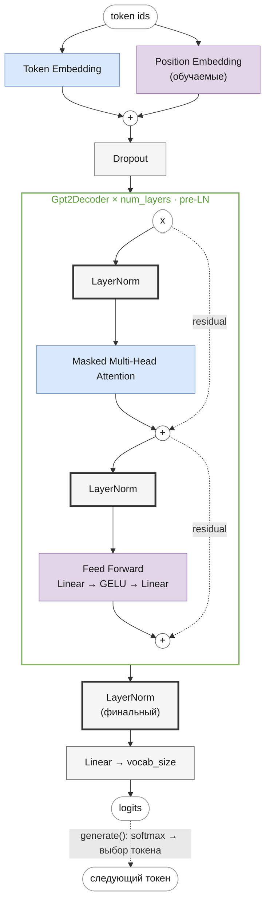

# GPT-2
<!-- description: GPT-2 (OpenAI, 2019): pre-LN, финальная нормализация и масштабированная инициализация — статья, формулы, код и загрузка весов. -->

Часть II · [← GPT-1](gpt.md) · [Оглавление](README.md) · [LLaMA →](llama.md)

> Реализация: [`llm/src/llm/models/gpt/gpt2.py`](../../llm/src/llm/models/gpt/gpt2.py) · класс `GPT2` · ноутбук: [`notebooks/gpt2.ipynb`](../../notebooks/gpt2.ipynb)

Место в линейке: [GPT-1](gpt.md) → **GPT-2** → [LLaMA](llama.md) → [Mistral](mistral.md) → [Mixtral](mixtral.md) · [Gemma](gemma.md)

## Что вы узнаете

- какую идею проверяла статья GPT-2: языковая модель как решатель задач без дообучения (zero-shot), корпус WebText, byte-level BPE;
- какие три изменения архитектуры отличают GPT-2 от GPT-1: pre-LN, финальный LayerNorm, масштаб инициализации residual-слоёв;
- как выглядит прямой проход GPT-2 в формулах и почему pre-LN обучается стабильнее;
- как посчитать параметры GPT-2 (124 439 808 у самой маленькой модели) и откуда расхождение с «117M» из статьи;
- как устроены классы `GPT2` и `Gpt2Decoder` и как загрузить веса OpenAI.

## Предварительные знания

Глава опирается на [GPT-1](gpt.md): эмбеддинги, attention и FFN у GPT-2 те же, и их формулы здесь только напоминаются. Нужны также [нормализация](normalization.md) (post-LN и pre-LN), [токенизация](tokenization.md) (BPE) и [обучение](training.md) (инициализация).

## Обзор

GPT-1 показал, что предобученную языковую модель выгодно дообучать на каждой задаче. Radford, Wu, Child, Luan, Amodei, Sutskever в статье *Language Models are Unsupervised Multitask Learners* (OpenAI, 2019) пошли дальше: можно ли обойтись **без дообучения вообще**?

Идея (разд. 2 статьи): модель, решающая задачу, оценивает $`p(\text{output} \mid \text{input})`$; универсальная система должна оценивать $`p(\text{output} \mid \text{input}, \text{task})`$. В тексте задача часто описана естественным языком прямо рядом с примером — «переведи на французский», пары «английская фраза = французская фраза». Поэтому достаточно большая языковая модель, обученная на достаточно разнообразном тексте, может научиться выполнять такие задачи, просто предсказывая следующий токен. Задача тогда задаётся **промптом** (prompt), а не новой головой и не градиентными шагами: например, для суммаризации в статье к статье дописывается `TL;DR:`.

### Научный вклад

1. **Корпус WebText** (разд. 2.1). Вместо книг (GPT-1) или неотфильтрованного Common Crawl авторы собрали исходящие ссылки с Reddit, получившие не меньше 3 karma, — как грубый фильтр «люди сочли это интересным». Около 45 млн ссылок; после дедупликации и очистки — чуть больше 8 млн документов, 40 ГБ текста. Все документы Википедии удалены, чтобы не пересекаться с тестовыми наборами.
2. **Byte-level BPE** (разд. 2.2). BPE работает не над символами Unicode, а над байтами UTF-8: базовый словарь — 256 байтов, поэтому любую строку можно закодировать, и неизвестных токенов (`<unk>`) нет. Чтобы не появлялись токены вроде `dog.`, `dog!`, `dog?`, слияния между разными категориями символов запрещены, кроме пробелов. Итоговый словарь — 50 257 токенов (подробно — в [tokenization.md](tokenization.md)).
3. **Масштаб** (разд. 2.3, табл. 2). Четыре модели одной архитектуры, от размера GPT-1 до в 10 с лишним раз большей; самую большую авторы и называют GPT-2.
4. **Zero-shot-результаты** (разд. 3). По аннотации статьи, самая большая модель получила лучший известный результат на 7 из 8 проверенных наборов языкового моделирования без обучения на них, при этом всё ещё недообучена на WebText. На задачах вроде ответов на вопросы, перевода и суммаризации zero-shot-качество было ниже специализированных систем, но устойчиво росло с размером модели.

### Размеры моделей

Модели из табл. 2 статьи и подсчёт параметров по формуле ниже (для конфигурации кода с tying):

| Модель в статье | $`L`$ | $`d`$ | Параметров по формуле |
|---|---|---|---|
| 117M (эквивалент GPT-1) | 12 | 768 | 124 439 808 |
| 345M | 24 | 1024 | 354 823 168 |
| 762M | 36 | 1280 | 774 030 080 |
| 1542M (GPT-2) | 48 | 1600 | 1 557 611 200 |

Цифры статьи и точный подсчёт расходятся (117M против 124,4M). Точный подсчёт для 124M совпадает с числом параметров HF-чекпоинта `openai-community/gpt2` ([backlog.md](../dev/backlog.md)), а для 345M проверен созданием модели в репозитории; в статье расхождение не объясняется. Общими для всех четырёх моделей в статье указаны словарь 50 257, контекст 1024 токена (у GPT-1 было 512) и батч 512.

## Изменения относительно GPT-1

Статья перечисляет их в разд. 2.3; механизмы (эмбеддинги, MHA, GELU-FFN) те же, что в GPT-1, меняется их **расстановка** и инициализация.

1. **Pre-LN.** LayerNorm перенесён на вход каждого подблока — по аналогии с pre-activation ResNet (He et al., 2016), где нормализация и активация тоже стоят перед весовым слоем, а не после сложения.
2. **Финальный LayerNorm** после последнего блока, перед выходной проекцией.
3. **Масштаб инициализации residual-слоёв:** веса слоёв, пишущих в residual-поток, при инициализации умножаются на $`1/\sqrt{N}`$, где $`N`$ — число residual-слоёв.
4. Словарь 50 257 (byte-level BPE), контекст 1024 вместо 512.

## Архитектура блока декодера

Жирной обводкой выделено то, что изменилось по сравнению с GPT-1.



## Прямой проход в формулах

Обозначения — как в [gpt.md](gpt.md#прямой-проход-в-формулах): вход $`x \in \{0, \dots, V-1\}^{B \times T}`$, формулы записаны для одной последовательности, в коде спереди добавляется ось батча.

**Шаг 1. Эмбеддинги** — без изменений:

```math
H^{(0)} = \mathrm{Dropout}\big(E[x_0, \dots, x_{T-1}] + P[0, \dots, T-1]\big)
```

где $`E \in \mathbb{R}^{V \times d}`$ (`wte` в оригинале) — токенные эмбеддинги, $`P \in \mathbb{R}^{T_{\max} \times d}`$ (`wpe`) — обучаемые позиционные эмбеддинги, $`H^{(0)} \in \mathbb{R}^{T \times d}`$.

**Шаг 2. $`L`$ pre-LN блоков.** Для $`l = 1, \dots, L`$:

```math
\begin{aligned}
U^{(l)} &= H^{(l-1)} + \mathrm{MHA}\big(\mathrm{LN}_1(H^{(l-1)})\big), \\
H^{(l)} &= U^{(l)} + \mathrm{FFN}\big(\mathrm{LN}_2(U^{(l)})\big),
\end{aligned}
```

где:
- $`H^{(l-1)}, U^{(l)}, H^{(l)} \in \mathbb{R}^{T \times d}`$ — вход блока, состояние после attention-подблока и выход блока;
- $`\mathrm{LN}_1, \mathrm{LN}_2`$ — LayerNorm со своими $`\gamma, \beta \in \mathbb{R}^{d}`$ ([normalization.md](normalization.md));
- $`\mathrm{MHA}`$ — тот же masked multi-head attention, что в GPT-1 ([формулы](gpt.md#формулы-компонентов), [attention.md](attention.md));
- $`\mathrm{FFN}(x) = \mathrm{Dropout}\big(\mathrm{GELU}(x W_1 + b_1) W_2 + b_2\big)`$, $`W_1 \in \mathbb{R}^{d \times 4d}`$, $`W_2 \in \mathbb{R}^{4d \times d}`$, GELU в tanh-аппроксимации ([feed-forward.md](feed-forward.md)).

**Шаг 3. Финальная нормализация и выходная проекция:**

```math
Z = \mathrm{LN}_f\big(H^{(L)}\big)\, E^{\top}, \qquad p(x_{t+1} \mid x_{\le t}) = \mathrm{softmax}(Z_t)
```

где $`\mathrm{LN}_f`$ — финальный LayerNorm (`ln_f` в оригинале, `_norm` в коде), $`E^{\top} \in \mathbb{R}^{d \times V}`$ — транспонированная матрица эмбеддингов (weight tying, как в оригинале; без tying — отдельные $`W_{\text{out}} \in \mathbb{R}^{d \times V}`$ и $`b_{\text{out}} \in \mathbb{R}^{V}`$), $`Z \in \mathbb{R}^{T \times V}`$ — логиты.

Сводка форм — та же, что у GPT-1: `[B, T]` → `[B, T, d]` → ($`L`$ блоков) `[B, T, d]` → `LN_f` `[B, T, d]` → `[B, T, V]`.

### Почему pre-LN и зачем финальный LayerNorm

Раскроем рекурсию шага 2. Выход последнего блока — это вход плюс сумма вкладов всех $`2L`$ подблоков:

```math
H^{(L)} = H^{(0)} + \sum_{l=1}^{L} \Big( \mathrm{MHA}\big(\mathrm{LN}_1(H^{(l-1)})\big) + \mathrm{FFN}\big(\mathrm{LN}_2(U^{(l)})\big) \Big)
```

Это равенство — прямое следствие двух формул шага 2: подставляем $`U^{(l)}`$ в $`H^{(l)}`$ и складываем по $`l`$. В post-LN (GPT-1) такого разложения нет: каждый LayerNorm стоит на основном пути и перенормирует всю сумму.

Следствия:

- **Путь градиента.** Производная $`H^{(L)}`$ по $`H^{(0)}`$ содержит единичное слагаемое (тождественный путь по residual-связям), поэтому градиент доходит до нижних слоёв, не проходя через нормализации. Xiong et al. (2020) показали, что у pre-LN градиенты в начале обучения хорошо ведут себя и без warmup, тогда как post-LN warmup необходим. Подробно — в [normalization.md](normalization.md).
- **Финальный LayerNorm нужен.** $`H^{(L)}`$ — ненормализованная сумма $`2L + 1`$ слагаемых, её масштаб растёт с глубиной. $`\mathrm{LN}_f`$ приводит её к единому масштабу перед умножением на $`E^{\top}`$. В GPT-1 эту роль играл последний $`\mathrm{LN}_2`$.

### Масштаб инициализации residual-слоёв

Из того же разложения видно, почему растёт масштаб residual-потока. Пусть в начале обучения вклады $`2L`$ подблоков в одну координату — независимые случайные величины со средним 0 и дисперсией $`\sigma^2`$. Тогда дисперсия их суммы:

```math
\mathrm{Var}\Big(\sum_{k=1}^{2L} f_k\Big) = \sum_{k=1}^{2L} \mathrm{Var}(f_k) = 2L\,\sigma^2
```

где $`f_k`$ — вклад $`k`$-го подблока в координату residual-потока, $`\sigma^2`$ — дисперсия одного вклада, $`2L`$ — число residual-подблоков (attention и FFN в каждом из $`L`$ блоков). Первое равенство верно для независимых слагаемых.

Стандартное отклонение суммы растёт как $`\sqrt{2L}`$: при $`L = 12`$ — примерно в 4,9 раза. Вклад подблока линеен по весам его выходной проекции ($`W_O`$ у attention, $`W_2`$ у FFN). Если уменьшить std этих весов в $`\sqrt{2L}`$ раз, дисперсия каждого вклада уменьшится в $`2L`$ раз, и сумма снова будет иметь дисперсию $`\sigma^2`$ — независимо от глубины.

В коде $`N = 2L`$, как в `GPT2PreTrainedModel._init_weights` в HuggingFace:

```math
W_O,\ W_2 \sim \mathcal{N}\!\left(0,\ \left(\frac{0{,}02}{\sqrt{2L}}\right)^2\right)
```

Для $`L = 12`$: $`0{,}02 / \sqrt{24} \approx 0{,}00408`$; для учебного конфига ($`L = 4`$): $`0{,}02 / \sqrt{8} \approx 0{,}00707`$. Остальные `Linear` и `Embedding` — $`\mathcal{N}(0,\ 0{,}02^2)`$, bias — нули, LayerNorm — $`\gamma = 1`$, $`\beta = 0`$.

## Компоненты

| Компонент | Класс | Файл |
|---|---|---|
| Токен-эмбеддинги | `TokenEmbeddings` | [`core/token_embeddings.py`](../../llm/src/llm/core/token_embeddings.py) |
| Позиционные эмбеддинги | `PositionalEmbeddings` (обучаемые, абсолютные — как в GPT-1) | [`core/positional_embeddings.py`](../../llm/src/llm/core/positional_embeddings.py) |
| Attention | `MultiHeadAttention` (тот же класс, что и в GPT-1) | [`core/multi_head_attention.py`](../../llm/src/llm/core/multi_head_attention.py) |
| FFN | `FeedForward` с tanh-аппроксимацией GELU (`activation="gelu_tanh"` — как в оригинальном коде OpenAI; в HF — `gelu_new`), активация зашита внутри декодера и не настраивается из конфига | [`core/feed_forward.py`](../../llm/src/llm/core/feed_forward.py), [`core/gpt2_decoder.py`](../../llm/src/llm/core/gpt2_decoder.py) |
| Блок декодера | `Gpt2Decoder` (**pre-LN**) | [`core/gpt2_decoder.py`](../../llm/src/llm/core/gpt2_decoder.py) |
| Финальная нормализация | `nn.LayerNorm` (`GPT2._norm`) | [`models/gpt/gpt2.py`](../../llm/src/llm/models/gpt/gpt2.py) |
| Модель целиком | `GPT2` | [`models/gpt/gpt2.py`](../../llm/src/llm/models/gpt/gpt2.py) |

`Gpt2Decoder.forward`:
```
norm1_out = Norm1(x)
attn_out  = Attention(norm1_out)
out       = attn_out + x
norm2_out = Norm2(out)
ffn_out   = FFN(norm2_out)
result    = ffn_out + out
```

В отличие от GPT-1, `GPT2.forward` добавляет финальный `nn.LayerNorm` **после** стека декодеров и **перед** проекцией на словарь ([`models/gpt/gpt2.py`](../../llm/src/llm/models/gpt/gpt2.py)) — стандартная практика pre-LN трансформеров (без неё выход последнего блока не нормализован).

`Gpt2Decoder` — самостоятельный класс, а не переиспользование параметризуемого `CachedDecoder` (которым, например, пользуются LLaMA и другие более новые архитектуры в этом репозитории): FFN и pre-LN расстановка захардкожены внутри него.

## Разбор кода

### `GPT2.__init__`

[`models/gpt/gpt2.py`](../../llm/src/llm/models/gpt/gpt2.py), класс `GPT2`. Конструктор повторяет `GPT.__init__` ([разбор](gpt.md#разбор-кода)) с тремя отличиями:

| Строка кода | Что делает | Отличие от GPT-1 |
|---|---|---|
| `Gpt2Decoder(num_heads=..., emb_size=..., head_size=..., max_seq_len=..., dropout=..., attention_dropout=...)` | $`L`$ pre-LN блоков | нет аргумента `activation` — GELU (tanh) зашит в блоке |
| `self._norm = nn.LayerNorm(config["embed_dim"])` | $`\mathrm{LN}_f`$ | новый модуль |
| `scale_residual_projections_([...], num_layers=..., std=std)` | std $`/\sqrt{2L}`$ для $`W_O`$ и $`W_2`$ | новая инициализация |

`Gpt2Decoder.__init__` ([`core/gpt2_decoder.py`](../../llm/src/llm/core/gpt2_decoder.py)) создаёт те же четыре модуля, что `GptDecoder`: `_heads`, `_ff` (с `activation="gelu_tanh"`), `_norm1`, `_norm2`. Имена модулей совпадают, поэтому `convert_hf_state_dict` годится для обеих моделей, а `scale_residual_projections_` находит проекции по `decoder._heads._layer` и `decoder._ff._layer2`.

### `GPT2.forward`

Отличается от `GPT.forward` одной строкой перед проекцией:

```python
for i, decoder in enumerate(self._decoders):   # H^(l) = pre-LN блок
    ...
out = self._norm(out)                          # LN_f(H^(L))   [B, T, d]
logits = self._linear(out)                     # Z             [B, T, V]
```

`Gpt2Decoder.forward` реализует шаг 2 буквально: `out = attention + x` — это $`U^{(l)}`$ (attention применён к `self._norm1(x)`), `result = ffn_out + out` — это $`H^{(l)}`$ (FFN применён к `self._norm2(out)`).

## Подсчёт параметров

По сравнению с GPT-1 ([подсчёт](gpt.md#подсчёт-параметров)) добавляется только финальный LayerNorm — $`2d`$ параметров ($`\gamma`$ и $`\beta`$). Блок по-прежнему содержит $`12d^2 + 13d`$: attention $`4d^2 + 4d`$, FFN $`8d^2 + 5d`$, два LayerNorm $`4d`$.

```math
N_{\text{GPT-2}} = V d + T_{\max} d + L\,(12 d^2 + 13 d) + 2d + \begin{cases} 0, & \text{с weight tying} \\ V d + V, & \text{без него} \end{cases}
```

где $`V`$ — словарь, $`d`$ — размерность модели, $`T_{\max}`$ — контекст, $`L`$ — число блоков, $`2d`$ — финальный LayerNorm.

**GPT-2 124M** ($`V = 50\,257`$, $`T_{\max} = 1024`$, $`d = 768`$, $`L = 12`$, с tying):

```
V·d        = 50 257 · 768 =  38 597 376
T_max·d    =  1 024 · 768 =     786 432
12 блоков  = 12 · 7 087 872 = 85 054 464
ln_f       = 2 · 768      =       1 536
итого                       124 439 808
```

Совпадает с числом параметров HF-модели `openai-community/gpt2` ([backlog.md](../dev/backlog.md)). Без tying: $`124\,439\,808 + 38\,597\,376 + 50\,257 = 163\,087\,441`$. Эмбеддинги здесь — 31,6 % модели, у GPT-1 — 27 %: словарь больше, а блоки те же. С ростом $`d`$ доля блоков растёт: у модели 1542M они дают около 95 % параметров.

**Учебный конфиг** [`gpt2_train.json`](../../experiments/llm_only/configs/gpt2_train.json) ($`d = 256`$, $`L = 4`$, $`T_{\max} = 128`$, при `vocab_size = 1000`): на $`2d = 512`$ больше, чем у GPT-1, — 3 448 320 с tying и 3 705 320 без него (по умолчанию).

```python
from llm.models.gpt import GPT2

cfg = {"vocab_size": 50257, "embed_dim": 768, "num_heads": 12, "num_layers": 12,
       "max_position_embeddings": 1024, "dropout": 0.0, "tie_word_embeddings": True}
print(sum(p.numel() for p in GPT2(cfg).parameters()))  # 124439808
```

## Конфигурация

Пример из [`experiments/llm_only/configs/gpt2_train.json`](../../experiments/llm_only/configs/gpt2_train.json) — набор параметров тот же, что у GPT-1, кроме `activation` (у GPT-2 активация не настраивается):

| Параметр | Значение в примере | Значение в GPT-2 124M | Смысл |
|---|---|---|---|
| `vocab_size` | (из токенизатора) | 50257 | размер словаря $`V`$ |
| `embed_dim` | 256 | 768 | размерность эмбеддингов $`d`$ |
| `num_heads` | 4 | 12 | число attention-голов $`H`$ |
| `head_size` | (нет в примере) | 64 | необязательный размер головы; по умолчанию `embed_dim // num_heads` |
| `num_layers` | 4 | 12 | число блоков `Gpt2Decoder` $`L`$ |
| `max_position_embeddings` | 128 | 1024 | максимальная длина последовательности $`T_{\max}`$ |
| `dropout` | 0.1 | 0.1 | dropout на эмбеддингах и на выходах attention и FFN перед residual |
| `attention_dropout` | (нет в примере) | 0.1 | необязательный dropout на весах внимания после softmax, по умолчанию `0.0`; в HF — `attn_pdrop = 0.1` |
| `initializer_range` | (нет в примере) | 0.02 | необязательное стандартное отклонение начальных весов, по умолчанию `0.02` |
| `tie_word_embeddings` | (нет в примере) | да | необязательный: `true` — выходная проекция без bias делит веса с `wte`, как в оригинале и HF (см. ниже); по умолчанию `false` — отдельный `Linear` с bias |

Значения dropout для 124M — из конфига HF (`resid_pdrop`, `embd_pdrop`, `attn_pdrop`); в статье GPT-2 dropout не описан. Число голов в статье тоже не приводится; 12 — из конфига HF.

### Инициализация весов

Как в GPT-1 ([gpt.md](gpt.md#инициализация-весов)), веса `Linear` и `Embedding` — $`\mathcal{N}(0,\ 0{,}02^2)`$, bias — нули. Дополнительно выходные проекции, которые пишут в residual-поток, — выход attention и второй слой FFN, по две на блок, — инициализируются со стандартным отклонением $`0{,}02/\sqrt{2L}`$, где $`L`$ = `num_layers`. Статья GPT-2 (разд. 2.3) масштабирует веса residual-слоёв на $`1/\sqrt{N}`$, где $`N`$ — число residual-слоёв, чтобы дисперсия residual-потока не росла с глубиной; здесь $`N = 2L`$ — как в `GPT2PreTrainedModel._init_weights` в HuggingFace (обоснование — в разделе [Масштаб инициализации residual-слоёв](#масштаб-инициализации-residual-слоёв)). В коде OpenAI `wpe` инициализируется с 0.01, здесь, как в HF, — 0.02.

В коде это две строки `GPT2.__init__`: сначала `self.apply(partial(init_normal_, std=std))` для всех модулей, затем `scale_residual_projections_` ([`core/weight_init.py`](../../llm/src/llm/core/weight_init.py)) переинициализирует `decoder._heads._layer` и `decoder._ff._layer2` каждого блока со std $`= \text{std} / \sqrt{2L}`$. Bias этих слоёв остаются нулевыми.

### Weight tying

В оригинале (`gpt-2/src/model.py`: `tf.matmul(h, wte, transpose_b=True)`) и в HF (`GPT2LMHeadModel`) выходная проекция — та же матрица, что `wte`, без bias. Здесь это ключ `"tie_word_embeddings": true`, как в GPT-1 ([gpt.md](gpt.md#weight-tying)). Для конфигурации 124M он экономит около 38,6M параметров (`50257 · 768` плюс bias): 124,4M вместо 163,1M.

## Загрузка весов HuggingFace

С `tie_word_embeddings` загружаются веса [`openai-community/gpt2`](https://huggingface.co/openai-community/gpt2):

```python
from transformers import GPT2LMHeadModel
from llm.models.gpt import GPT2, convert_hf_state_dict

hf = GPT2LMHeadModel.from_pretrained("openai-community/gpt2")
model = GPT2({"vocab_size": 50257, "embed_dim": 768, "num_heads": 12, "num_layers": 12,
              "max_position_embeddings": 1024, "dropout": 0.0, "tie_word_embeddings": True})
model.load_state_dict(convert_hf_state_dict(hf.state_dict()))
```

Логиты совпадают с HF с точностью до ~1e-4 (при значениях логитов порядка 100), greedy-генерация — токен в токен. Для текста нужен токенизатор GPT-2 из `transformers` (`GPT2Tokenizer`): собственный BPE репозитория ([tokenization.md](tokenization.md)) даёт другие индексы.

`convert_hf_state_dict` ([`models/gpt/hf_weights.py`](../../llm/src/llm/models/gpt/hf_weights.py)) — та же функция, что для GPT-1; как она переименовывает ключи, транспонирует веса `Conv1D` и режет `c_attn` на Q, K, V, разобрано в [gpt.md](gpt.md#загрузка-весов-huggingface). Специфичны для GPT-2 только верхнеуровневые имена: `wte` → `_token_embeddings._embedding`, `wpe` → `_position_embeddings.embedding`, `ln_f` → `_norm`. Имена внутри блоков (`h.{i}.attn.c_attn`, `h.{i}.mlp.c_fc`, `h.{i}.ln_1` …) у GPT-1 и GPT-2 в HF совпадают, различается только смысл `ln_1`/`ln_2`: в GPT-2 они стоят перед подблоками, а не после. Функции это безразлично — она переносит параметры, а расстановку задаёт класс блока.

## Отличия от оригинала

| Что | Статья / код OpenAI / HF | Этот репозиторий |
|---|---|---|
| Weight tying | есть | ключ `tie_word_embeddings`, по умолчанию выключен |
| Dropout внимания | `attn_pdrop = 0.1` в HF | `attention_dropout`, по умолчанию 0 |
| Инициализация `wpe` | 0.01 в коде OpenAI | 0.02, как в HF |
| Токенизатор | byte-level BPE, 50 257 токенов | собственный BPE ([tokenization.md](tokenization.md)); для весов OpenAI нужен токенизатор HF |
| Активация FFN | GELU (tanh-аппроксимация) | то же, не настраивается |
| Размер FFN | $`4d`$ | всегда $`4d`$ |

## Генерация

`GPT2.generate(...)` — та же унифицированная сигнатура, что у всех моделей репозитория (кратко — [gpt.md](gpt.md#генерация), подробно — [generation.md](generation.md)). Промпт в духе статьи — то, как GPT-2 решает задачи без дообучения: задача описывается текстом, модель его продолжает.

```python
import torch
from llm.models.gpt import GPT2

model = GPT2({"vocab_size": 1000, "embed_dim": 256, "num_heads": 4, "num_layers": 4,
              "max_position_embeddings": 128, "dropout": 0.1})
model.eval()
out = model.generate(torch.randint(0, 1000, (1, 8)), max_new_tokens=20,
                     do_sample=True, temperature=0.8, top_k=40)  # [1, 28]
```

## Типичные ошибки и тонкости

- **Аргументы `forward` по позиции.** Сигнатура `GPT2.forward(x, use_cache=False, cache=None, attention_mask=None)` отличается порядком аргументов от `GPT.forward(x, attention_mask=None, use_cache=False, cache=None)`. Передавайте их по имени.
- **`use_cache` у блока.** У `Gpt2Decoder.forward` `use_cache` по умолчанию `True` (у `GptDecoder` — `False`). `GPT2.forward` всегда передаёт его явно, так что на модель это не влияет, но при прямом вызове блока вернётся кэш.
- **Ключ `activation`.** `GPT2` его не читает: значение молча игнорируется, FFN всегда использует GELU с tanh-аппроксимацией.
- **Веса OpenAI без `"tie_word_embeddings": true`.** Как и у GPT-1, `load_state_dict` не примет результат `convert_hf_state_dict`: в модели будут отдельные `_linear.weight` и `_linear.bias`.
- **Собственный BPE с весами OpenAI.** Индексы токенов не совпадут; нужен `GPT2Tokenizer` из `transformers`.
- **Сверка логитов с HF.** Разница до ~1e-4 при логитах порядка 100 — погрешность вычислений во float32, а не ошибка реализации.
- **Масштаб инициализации residual-проекций.** Он влияет только на обучение с нуля: загрузка чекпоинта перезаписывает веса.

## Что изменилось в LLaMA

- обучаемые абсолютные позиционные эмбеддинги → **RoPE** (относительное, ротационное позиционное кодирование, встроено в attention);
- `LayerNorm` → **RMSNorm**;
- GELU-FFN → **SwiGLU**;
- pre-LN и финальная нормализация сохраняются;
- attention остаётся стандартным multi-head (см. [llama.md](llama.md#отличия-от-оригинала)) — GQA появится только в Mistral.

Подробности — в [llama.md](llama.md).

## Итоги

- GPT-2 проверил идею: достаточно большая языковая модель на разнообразном тексте (WebText, 40 ГБ) решает задачи zero-shot, по промпту; лучший результат на 7 из 8 наборов языкового моделирования без обучения на них.
- Byte-level BPE на 50 257 токенов кодирует любую строку без `<unk>`.
- Архитектура та же, что у GPT-1, но: pre-LN, финальный LayerNorm, инициализация residual-проекций со std $`0{,}02/\sqrt{2L}`$, контекст 1024.
- Pre-LN превращает выход стека в сумму вкладов подблоков — градиент идёт по тождественному пути, глубокие стеки обучаются стабильнее.
- Параметры: формула GPT-1 плюс $`2d`$; для 124M — 124 439 808 (в статье — «117M»).
- В репозитории — классы `GPT2` и `Gpt2Decoder`; веса OpenAI загружаются той же `convert_hf_state_dict`.

## Вопросы и упражнения

1. Раскройте формулу шага 2 для $`L = 2`$ и запишите $`H^{(2)}`$ как $`H^{(0)}`$ плюс сумма четырёх слагаемых.

<details><summary>Ответ</summary>

$`H^{(2)} = H^{(0)} + \mathrm{MHA}_1(\mathrm{LN}(H^{(0)})) + \mathrm{FFN}_1(\mathrm{LN}(U^{(1)})) + \mathrm{MHA}_2(\mathrm{LN}(H^{(1)})) + \mathrm{FFN}_2(\mathrm{LN}(U^{(2)}))`$, где у каждого LN свои параметры.

</details>

2. Каким std инициализируются `_heads._layer.weight` и `_ff._layer2.weight` у GPT-2 1542M ($`L = 48`$)? Во сколько раз это меньше обычных 0,02?

<details><summary>Ответ</summary>

$`0{,}02 / \sqrt{96} \approx 0{,}00204`$, то есть в $`\sqrt{96} \approx 9{,}8`$ раза меньше.

</details>

3. Посчитайте параметры модели 345M по формуле и проверьте, какая доля приходится на эмбеддинги.

<details><summary>Ответ</summary>

$`V d = 50\,257 \cdot 1024 = 51\,463\,168`$; $`T_{\max} d = 1\,048\,576`$; блок $`12 \cdot 1024^2 + 13 \cdot 1024 = 12\,596\,480`$, 24 блока — $`302\,315\,520`$; $`\mathrm{LN}_f`$ — 2048. Итого $`354\,823\,168`$. Эмбеддинги: $`52\,511\,744`$, около 14,8 %.

</details>

4. Почему при переходе от post-LN к pre-LN пришлось добавить финальный LayerNorm, и что будет, если его убрать у обученной модели?

<details><summary>Ответ</summary>

В pre-LN выход стека — ненормализованная сумма вкладов, её масштаб растёт с глубиной. Обученная модель рассчитывает, что в проекцию придёт нормализованный (и масштабированный $`\gamma, \beta`$ из `ln_f`) вектор; без `ln_f` логиты получат другой масштаб и сдвиг, и предсказания испортятся.

</details>

5. Почему byte-level BPE не нужен токен `<unk>`? Какой ценой?

<details><summary>Ответ</summary>

Любая строка — последовательность байтов UTF-8, а все 256 байтов есть в базовом словаре, поэтому любую строку можно закодировать. Цена — редкие символы (например, кириллица или иероглифы, мало представленные в корпусе) разбиваются на несколько байтовых токенов, и последовательности становятся длиннее.

</details>

6. (Код.) Создайте `GPT2` с учебным конфигом и проверьте, что std весов `_decoders[0]._ff._layer2.weight` близко к $`0{,}02/\sqrt{8}`$, а std `_decoders[0]._ff._layer1.weight` — к 0,02.

<details><summary>Ответ</summary>

```python
m = GPT2({"vocab_size": 1000, "embed_dim": 256, "num_heads": 4, "num_layers": 4,
          "max_position_embeddings": 128, "dropout": 0.1})
print(m._decoders[0]._ff._layer2.weight.std())  # ≈ 0.0071
print(m._decoders[0]._ff._layer1.weight.std())  # ≈ 0.020
```

</details>

7. В каком порядке надо передать аргументы, чтобы `model(x, None, True)` одинаково работал у `GPT` и `GPT2`? Почему лучше так не делать?

<details><summary>Ответ</summary>

Никак: у `GPT` второй позиционный аргумент — `attention_mask`, у `GPT2` — `use_cache`. `model(x, None, True)` у `GPT` означает `attention_mask=None, use_cache=True`, а у `GPT2` — `use_cache=None, cache=True`. Поэтому аргументы нужно передавать по имени: `model(x, use_cache=True)`.

</details>

## Литература

Основная статья:

- Radford, Wu, Child, Luan, Amodei, Sutskever. *Language Models are Unsupervised Multitask Learners*. OpenAI, 2019. [PDF](https://cdn.openai.com/better-language-models/language_models_are_unsupervised_multitask_learners.pdf) (на arXiv не публиковалась)

Компоненты и связанные работы:

- Radford, Narasimhan, Salimans, Sutskever. *Improving Language Understanding by Generative Pre-Training*. OpenAI, 2018. [PDF](https://cdn.openai.com/research-covers/language-unsupervised/language_understanding_paper.pdf) (на arXiv не публиковалась)
- Xiong et al. *On Layer Normalization in the Transformer Architecture*. 2020. [arXiv:2002.04745](https://arxiv.org/abs/2002.04745) — почему pre-LN обучается стабильнее post-LN
- He, Zhang, Ren, Sun. *Identity Mappings in Deep Residual Networks*. 2016. [arXiv:1603.05027](https://arxiv.org/abs/1603.05027) — pre-activation ResNet, образец для pre-LN
- Sennrich, Haddow, Birch. *Neural Machine Translation of Rare Words with Subword Units*. 2016. [arXiv:1508.07909](https://arxiv.org/abs/1508.07909) — BPE-токенизация
- Hendrycks, Gimpel. *Gaussian Error Linear Units (GELUs)*. 2016. [arXiv:1606.08415](https://arxiv.org/abs/1606.08415)
- Ba, Kiros, Hinton. *Layer Normalization*. 2016. [arXiv:1607.06450](https://arxiv.org/abs/1607.06450)
