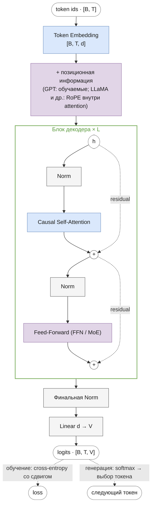

# Языковое моделирование
<!-- description: Вероятность текста, предсказание следующего токена, cross-entropy и перплексия; общая схема decoder-only трансформера. -->

Часть I · [Оглавление](README.md) · [Токенизация →](tokenization.md)

## Что вы узнаете

- Что такое языковая модель и почему «предсказать следующий токен» — это то же самое, что задать вероятность любого текста.
- Как логиты превращаются в вероятности через softmax и почему softmax считают с вычитанием максимума.
- Что такое cross-entropy (отрицательное логарифмическое правдоподобие), как она связана с методом максимального правдоподобия и KL-дивергенцией, и что такое перплексия.
- Как устроено обучение методом teacher forcing: сдвиг меток на один токен, метка `-100`, causal-маска — и где это сделано в коде репозитория.
- Общую схему decoder-only трансформера, на которой построены все шесть моделей библиотеки, и карту остальных глав пособия.

## Предварительные знания

Эта глава — первая, других глав она не требует. Нужны школьная вероятность (условная вероятность, произведение вероятностей), логарифм и экспонента, умение читать код на Python. Обозначения — в [notation.md](notation.md), термины — в [glossary.md](glossary.md).

## Задача: вероятность текста

Представим, что текст уже разбит на **токены** (tokens) — кусочки из конечного **словаря** (vocabulary) размера $`V`$. Как именно режут текст, разбирается в следующей главе, [tokenization.md](tokenization.md); пока достаточно знать, что каждый токен — это целое число от $`0`$ до $`V-1`$, а текст — последовательность таких чисел $`x_0, x_1, \dots, x_{T-1}`$ длины $`T`$.

**Языковая модель** (language model) — это модель, которая каждой последовательности токенов сопоставляет вероятность $`P(x_0, x_1, \dots, x_{T-1})`$. Хорошая языковая модель даёт осмысленному тексту («кошка сидит на ковре») большую вероятность, а бессмыслице («ковре на кошка сидит») — маленькую.

Зачем такая модель нужна:

- **оценивать** тексты: выбрать из нескольких вариантов перевода или распознанной речи самый правдоподобный;
- **порождать** тексты: выбирать токен за токеном, следуя вероятностям модели (подробно — в [generation.md](generation.md));
- **учить представления**: чтобы хорошо предсказывать текст, модель вынуждена выучить грамматику, факты и логику; GPT-1 показал, что такую модель затем легко дообучить на другие задачи ([Radford et al., 2018](https://cdn.openai.com/research-covers/language-unsupervised/language_understanding_paper.pdf)).

Задать вероятность «в лоб» — таблицей для всех возможных текстов — нельзя: при $`V = 32\,000`$ и $`T = 20`$ различных последовательностей $`V^T \approx 10^{90}`$, больше, чем атомов в наблюдаемой Вселенной. Нужен способ разложить эту огромную вероятность на небольшие части.

## Цепное правило

Из определения условной вероятности $`P(A, B) = P(A)\,P(B \mid A)`$ следует **цепное правило** (chain rule) — разложение совместной вероятности в произведение условных:

```math
P(x_0, x_1, \dots, x_{T-1}) = \prod_{t=0}^{T-1} P(x_t \mid x_0, \dots, x_{t-1}) = \prod_{t=0}^{T-1} P(x_t \mid x_{<t})
```

где:

- $`x_t \in \{0, \dots, V-1\}`$ — токен на позиции $`t`$ (позиции нумеруются с 0);
- $`x_{<t} = (x_0, \dots, x_{t-1})`$ — **префикс** (контекст), все токены до позиции $`t`$; при $`t = 0`$ префикс пуст, и множитель равен $`P(x_0)`$;
- $`P(x_t \mid x_{<t})`$ — вероятность, что следующим после префикса будет именно токен $`x_t`$;
- $`T`$ — длина последовательности.

<details><summary>Вывод для трёх токенов</summary>

Применим определение условной вероятности дважды. Сначала отделим последний токен, считая $`A = (x_0, x_1)`$, $`B = x_2`$:

```math
P(x_0, x_1, x_2) = P(x_0, x_1)\, P(x_2 \mid x_0, x_1)
```

Затем разложим $`P(x_0, x_1)`$ так же, с $`A = x_0`$, $`B = x_1`$:

```math
P(x_0, x_1) = P(x_0)\, P(x_1 \mid x_0)
```

Подставляя, получаем

```math
P(x_0, x_1, x_2) = P(x_0)\, P(x_1 \mid x_0)\, P(x_2 \mid x_0, x_1)
```

Для произвольного $`T`$ то же рассуждение повторяется по индукции: $`P(x_{\le t}) = P(x_{<t})\,P(x_t \mid x_{<t})`$.

</details>

**Интуиция.** Цепное правило — не приближение, а точное тождество: оно верно для любого распределения. Мы ничего не потеряли, но задача поменялась. Вместо одного распределения над $`V^T`$ текстами нужно уметь для любого префикса выдавать распределение над **одним** следующим токеном — это всего $`V`$ чисел.

**Пример.** Пусть токены — слова, и модель считает, что $`P(\text{кошка}) = 0.01`$, $`P(\text{сидит} \mid \text{кошка}) = 0.2`$, $`P(\text{на} \mid \text{кошка сидит}) = 0.5`$. Тогда

```math
P(\text{кошка сидит на}) = 0.01 \cdot 0.2 \cdot 0.5 = 0.001
```

Вероятности длинных текстов быстро становятся крошечными: уже при сотне множителей порядка $`0.1`$ получается $`10^{-100}`$. Поэтому на практике работают с логарифмом, и произведение превращается в сумму:

```math
\log P(x_0, \dots, x_{T-1}) = \sum_{t=0}^{T-1} \log P(x_t \mid x_{<t})
```

В примере: $`\ln 0.001 = \ln 0.01 + \ln 0.2 + \ln 0.5 \approx -4.605 - 1.609 - 0.693 = -6.908`$.

## Авторегрессивная факторизация

Модель, которая порождает последовательность слева направо, каждый раз предсказывая следующий элемент по предыдущим, называется **авторегрессивной** (autoregressive). Языковая модель с параметрами $`\theta`$ приближает каждый множитель цепного правила:

```math
P_\theta(x_0, \dots, x_{T-1}) = \prod_{t=0}^{T-1} p_\theta(x_t \mid x_{<t})
```

где:

- $`\theta`$ — все обучаемые параметры модели (матрицы эмбеддингов, attention, FFN и т. д.);
- $`p_\theta(\cdot \mid x_{<t})`$ — распределение над словарём, которое модель выдаёт, прочитав префикс $`x_{<t}`$: вектор из $`V`$ неотрицательных чисел с суммой 1.

Все модели этой библиотеки — GPT-1, GPT-2, LLaMA, Mistral, Mixtral, Gemma — именно такие: **causal language models**, «причинные» языковые модели, которые видят только прошлое.

Первый токен в библиотеке отдельно не моделируется: модель получает на вход готовую последовательность и предсказывает токены с позиции 1. Если нужно моделировать и $`x_0`$, в начало добавляют специальный токен `<bos>` (begin of sequence), и тогда $`P(x_0) = p_\theta(x_0 \mid \langle \text{bos} \rangle)`$. Специальные токены описаны в [tokenization.md](tokenization.md#специальные-токены).

**Альтернативы.** Авторегрессия — не единственный способ. BERT ([Devlin et al., 2018](https://arxiv.org/abs/1810.04805)) обучается как **маскированная** языковая модель: восстанавливает закрытые токены по контексту с обеих сторон. Такая модель хорошо понимает текст, но не задаёт вероятность последовательности через цепное правило и не умеет естественно порождать текст слева направо. В этом пособии речь только об авторегрессивных моделях.

## Следующий токен как классификация на V классов

Предсказание следующего токена — это задача **классификации**: по контексту выбрать один из $`V`$ классов. Нейросеть не выдаёт вероятности напрямую. Она выдаёт $`V`$ вещественных чисел — **логитов** (logits), по одному на токен словаря:

```math
\mathbf{z}_t = \mathbf{h}_t W_{\text{out}} + \mathbf{b}
```

где:

- $`\mathbf{h}_t \in \mathbb{R}^{1 \times d}`$ — скрытое состояние на позиции $`t`$ после всех блоков трансформера (строка, $`d`$ — размерность модели, `embed_dim`);
- $`W_{\text{out}} \in \mathbb{R}^{d \times V}`$ — матрица выходной проекции («голова» языковой модели, LM head);
- $`\mathbf{b} \in \mathbb{R}^{1 \times V}`$ — смещение (bias); в части моделей его нет;
- $`\mathbf{z}_t \in \mathbb{R}^{1 \times V}`$ — логиты: чем больше $`z_{t,i}`$, тем «увереннее» модель, что следующий токен — $`i`$.

В коде это последний `nn.Linear(embed_dim, vocab_size)` модели, например `self._linear` в `Llama` ([`models/llama/llama.py`](../../llm/src/llm/models/llama/llama.py)): `logits = self._linear(out)`. Модель возвращает логиты для **всех** позиций сразу — тензор формы `[batch, seq_len, vocab_size]`, то есть $`B \times T \times V`$. Как устроена эта проекция и когда она делит веса с эмбеддингами (weight tying), разбирается в [embeddings.md](embeddings.md).

## Softmax: от логитов к вероятностям

Логиты могут быть любыми числами, в том числе отрицательными, и в сумме не дают 1. Превращает их в распределение функция **softmax**:

```math
\operatorname{softmax}(\mathbf{z})_i = \frac{e^{z_i}}{\sum_{j=0}^{V-1} e^{z_j}}, \qquad i = 0, \dots, V-1
```

где:

- $`\mathbf{z} \in \mathbb{R}^{V}`$ — вектор логитов для одной позиции;
- $`z_i`$ — логит токена $`i`$;
- $`e^{z_i}`$ — экспонента: делает каждое слагаемое положительным;
- знаменатель — нормирующая сумма (статистическая сумма, partition function), одна на весь вектор.

Итого $`p_\theta(x_t = i \mid x_{<t}) = \operatorname{softmax}(\mathbf{z}_t)_i`$.

**Свойства softmax.**

1. Все выходы положительны и в сумме дают 1 — это корректное распределение. Ни один токен не получает вероятность ровно 0.
2. **Монотонность**: больший логит даёт большую вероятность; порядок токенов сохраняется.
3. **Инвариантность к сдвигу**: $`\operatorname{softmax}(\mathbf{z} + c) = \operatorname{softmax}(\mathbf{z})`$ для любого числа $`c`$. Важны только **разности** логитов: $`p_i / p_j = e^{z_i - z_j}`$.
4. **Чувствительность к масштабу**: если умножить логиты на число больше 1, распределение становится «острее» (ближе к выбору одного максимума), если на число меньше 1 — «площе». На этом основана температура при генерации ([generation.md](generation.md)).
5. Название: softmax — «мягкий» (дифференцируемый) вариант argmax. При $`\mathbf{z} \cdot \lambda`$, $`\lambda \to \infty`$ вся вероятность уходит на максимальный логит (если максимум единственный; при нескольких равных максимумах она делится между ними поровну).

<details><summary>Доказательство инвариантности к сдвигу</summary>

Вынесем общий множитель $`e^{c}`$ из числителя и знаменателя:

```math
\frac{e^{z_i + c}}{\sum_j e^{z_j + c}} = \frac{e^{c}\, e^{z_i}}{e^{c} \sum_j e^{z_j}} = \frac{e^{z_i}}{\sum_j e^{z_j}}
```

</details>

**Пример.** Словарь из трёх токенов, логиты $`\mathbf{z} = (2, 1, 0)`$:

```
e^z      = (7.389, 2.718, 1.000),   сумма = 11.107
softmax  = (0.665, 0.245, 0.090)
```

Разница логитов на 1 означает отношение вероятностей $`e \approx 2.718`$: $`0.665 / 0.245 \approx 2.718`$.

### Численная устойчивость: вычитание максимума

В float32 экспонента переполняется уже при $`z > 88.7`$ ($`e^{88.7} \approx 3.4 \cdot 10^{38}`$ — максимум float32). Логиты такого размера встречаются, и наивная формула даёт `inf / inf = nan`. Решение следует из свойства 3: вычтем из всех логитов максимум $`m = \max_j z_j`$:

```math
\operatorname{softmax}(\mathbf{z})_i = \frac{e^{z_i - m}}{\sum_j e^{z_j - m}}
```

Теперь наибольший показатель равен $`0`$, все экспоненты лежат в $`(0, 1]`$, а знаменатель — не меньше 1 (слагаемое для максимума равно $`e^0 = 1`$). Переполнения нет, деления на ноль тоже.

```python
import torch

def stable_softmax(z):
    z = z - z.max(dim=-1, keepdim=True).values   # сдвиг не меняет результат
    e = z.exp()
    return e / e.sum(dim=-1, keepdim=True)

z = torch.tensor([1000.0, 999.0, 998.0])
print(z.exp() / z.exp().sum())    # tensor([nan, nan, nan])
print(stable_softmax(z))          # tensor([0.6652, 0.2447, 0.0900]) — как для (2, 1, 0)
print(torch.softmax(z, dim=-1))   # то же: torch.softmax вычитает максимум сам
```

Для логарифма вероятности используют тот же приём — функцию **log-sum-exp**:

```math
\log \operatorname{softmax}(\mathbf{z})_i = z_i - m - \log \sum_j e^{z_j - m}
```

Так `torch.log_softmax` и `F.cross_entropy` считают логарифм вероятности, не вычисляя саму вероятность: даже если $`p_i \approx 10^{-50}`$ (в float32 это 0, и $`\log 0 = -\infty`$), логарифм получается конечным.

## Функция потерь: cross-entropy

### Максимальное правдоподобие

Пусть есть обучающий корпус — последовательности токенов. Естественное требование к параметрам: модель должна давать **наблюдаемым** текстам как можно большую вероятность. Это **метод максимального правдоподобия** (maximum likelihood estimation, MLE):

```math
\theta^{*} = \arg\max_{\theta} \prod_{\text{тексты}} \prod_{t} p_\theta(x_t \mid x_{<t})
```

где $`\theta^{*}`$ — искомые параметры, внешнее произведение берётся по всем текстам корпуса (они считаются независимыми), внутреннее — по позициям $`t`$ внутри текста; $`x_t`$ и $`x_{<t}`$ — токены этого текста.

Логарифм — монотонная функция, поэтому максимум произведения достигается там же, где максимум суммы логарифмов. Поменяем знак, чтобы получить задачу минимизации, и усредним по числу предсказаний $`N`$. Получаем **отрицательное логарифмическое правдоподобие** (negative log-likelihood, NLL):

```math
\mathcal{L}(\theta) = -\frac{1}{N} \sum_{n=1}^{N} \log p_\theta\big(y_n \mid \text{контекст}_n\big)
```

где:

- $`N`$ — число позиций, для которых считается loss (в батче $`B \times (T-1)`$ минус игнорируемые, см. ниже);
- $`y_n`$ — правильный следующий токен в $`n`$-м предсказании (метка, label);
- $`p_\theta(y_n \mid \cdot) = \operatorname{softmax}(\mathbf{z}_n)_{y_n}`$ — вероятность, которую модель дала правильному токену;
- логарифм натуральный, поэтому loss измеряется в **натах** (nats); чтобы перевести в биты, делят на $`\ln 2 \approx 0.693`$.

Каждое слагаемое $`-\log p`$ — «штраф за удивление»: если модель дала правильному токену вероятность 1, штраф 0; если 0.5 — штраф $`\ln 2 \approx 0.693`$; если 0.001 — штраф $`6.9`$. Уверенная ошибка стоит очень дорого: при $`p \to 0`$ штраф уходит в бесконечность.

### Почему «cross-entropy»

Для одной позиции запишем правильный ответ как **one-hot** вектор $`\mathbf{y} \in \{0, 1\}^V`$: единица на месте правильного токена, остальные нули. Тогда

```math
-\log p_{y} = -\sum_{i=0}^{V-1} y_i \log p_i = H(\mathbf{y}, \mathbf{p})
```

где:

- $`\mathbf{p} = \operatorname{softmax}(\mathbf{z}) \in \mathbb{R}^V`$ — распределение модели;
- $`H(\mathbf{q}, \mathbf{p}) = -\sum_i q_i \log p_i`$ — **перекрёстная энтропия** (cross-entropy) распределения $`\mathbf{p}`$ относительно $`\mathbf{q}`$ (буква $`H`$ здесь и в следующем разделе — энтропия, а не число голов attention из [notation.md](notation.md)).

В сумме выживает только слагаемое с $`y_i = 1`$, поэтому cross-entropy с one-hot целью и NLL — одно и то же. В PyTorch это функция `F.cross_entropy(logits, targets)`: она принимает **логиты** (не вероятности), сама применяет log-softmax устойчивым способом и берёт элемент правильного класса.

**Пример.** Логиты $`(2, 1, 0)`$, правильный токен — 0. Вероятность $`0.665`$, loss $`-\ln 0.665 = 0.408`$. Если бы правильным был токен 2: $`-\ln 0.090 = 2.408`$. Разница ровно 2 — это разница логитов, как и должно быть по формуле log-softmax.

### Связь с KL-дивергенцией

Пусть у языка есть «истинное» распределение следующего токена $`q`$ (для данного контекста), а модель выдаёт $`p_\theta`$. Ожидаемый loss по данным — это cross-entropy $`H(q, p_\theta)`$, и она раскладывается так:

```math
H(q, p_\theta) = H(q) + D_{\mathrm{KL}}(q \,\|\, p_\theta)
```

где:

- $`H(q) = -\sum_i q_i \log q_i`$ — **энтропия** истинного распределения: неустранимая неопределённость самого языка (после «Я пошёл в» возможны десятки продолжений);
- $`D_{\mathrm{KL}}(q \,\|\, p_\theta) = \sum_i q_i \log \dfrac{q_i}{p_{\theta,i}}`$ — **дивергенция Кульбака — Лейблера**: насколько модель отличается от истины; она неотрицательна и равна нулю только при $`p_\theta = q`$.

<details><summary>Вывод</summary>

Прибавим и вычтем $`\sum_i q_i \log q_i`$:

```math
\begin{aligned}
H(q, p) &= -\sum_i q_i \log p_i \\
&= -\sum_i q_i \log q_i + \sum_i q_i \log q_i - \sum_i q_i \log p_i \\
&= H(q) + \sum_i q_i \log \frac{q_i}{p_i} \\
&= H(q) + D_{\mathrm{KL}}(q \,\|\, p)
\end{aligned}
```

Неотрицательность KL (неравенство Гиббса) следует из неравенства $`\log u \le u - 1`$ при $`u = p_i / q_i`$:

```math
-D_{\mathrm{KL}}(q \,\|\, p) = \sum_i q_i \log \frac{p_i}{q_i} \le \sum_i q_i \left(\frac{p_i}{q_i} - 1\right) = \sum_i p_i - \sum_i q_i \le 1 - 1 = 0
```

(суммы по тем $`i`$, где $`q_i > 0`$; равенство — только при $`p_i = q_i`$ для всех $`i`$).

</details>

**Интуиция.** $`H(q)`$ от модели не зависит, поэтому минимизировать cross-entropy — то же самое, что минимизировать KL-дивергенцию до истинного распределения. Loss никогда не опустится ниже энтропии языка. Если на валидации loss перестал падать, это может значить, что модель упёрлась либо в свою ёмкость, либо в $`H(q)`$.

### Градиент по логитам

Для одной позиции производная loss по логитам получается очень простой:

```math
\frac{\partial \mathcal{L}}{\partial \mathbf{z}} = \mathbf{p} - \mathbf{y}
```

где $`\mathbf{p} = \operatorname{softmax}(\mathbf{z})`$, $`\mathbf{y}`$ — one-hot правильного токена. Логит правильного токена тянется вверх с силой $`1 - p_y`$, логиты остальных — вниз пропорционально их вероятностям. В примере с логитами $`(2, 1, 0)`$ и правильным токеном 0 градиент равен $`(0.665 - 1,\ 0.245,\ 0.090) = (-0.335,\ 0.245,\ 0.090)`$. Вывод этой формулы и то, как градиент идёт дальше по сети, — в [training.md](training.md).

## Перплексия

Loss в натах трудно интерпретировать. Удобнее **перплексия** (perplexity, PPL) — экспонента от среднего NLL:

```math
\mathrm{PPL} = \exp(\mathcal{L}) = \exp\!\left(-\frac{1}{N}\sum_{n=1}^{N} \log p_\theta(y_n \mid \cdot)\right) = \left(\prod_{n=1}^{N} p_\theta(y_n \mid \cdot)\right)^{-1/N}
```

где $`\mathcal{L}`$ — средний loss в натах на токен, $`N`$ — число предсказаний. Последнее выражение — величина, обратная **среднему геометрическому** вероятностей правильных токенов.

**Интерпретация.** Перплексия — «эффективное число вариантов», между которыми модель в среднем колеблется на каждом шаге. PPL = 10 означает, что модель удивлена так же, как если бы на каждом шаге равновероятно выбирала из 10 токенов. Меньше — лучше; минимум 1 (модель всегда уверена и права).

**Пример 1: равномерное распределение.** Необученная модель, которая всем $`V`$ токенам даёт вероятность $`1/V`$:

```math
\mathcal{L} = -\log \frac{1}{V} = \ln V, \qquad \mathrm{PPL} = e^{\ln V} = V
```

Отсюда полезная проверка: **начальный loss свежей модели должен быть около $`\ln V`$**. Логиты свежей модели с малыми весами близки к нулю, а по свойству 3 softmax одинаковых логитов — равномерное распределение. Для словаря GPT-2 ($`V = 50\,257`$) это $`\ln 50\,257 \approx 10.82`$; для учебного токенизатора из `experiments/llm_only` на встроенном корпусе ($`V = 426`$) — $`\ln 426 \approx 6.05`$. Свежие `GPT`, `GPT2` и `Llama` с таким словарём дают на старте 6.04–6.29. Если начальный loss намного больше $`\ln V`$, модель на старте уверенно ошибается — обычно из-за слишком крупной инициализации (см. [gpt.md](gpt.md#инициализация-весов)).

**Пример 2.** Модель дала правильным токенам вероятности $`0.5,\ 0.25,\ 0.125,\ 0.5`$:

```
-ln p   = 0.693, 1.386, 2.079, 0.693     среднее L = 1.213 ната
PPL     = e^1.213 = 3.36                 (= 2^1.75: вероятности — степени двойки)
```

**Тонкости.** Перплексия зависит от токенизатора: у модели с более крупными токенами меньше предсказаний на тот же текст, и сравнивать PPL моделей с разными словарями напрямую нельзя. Для такого сравнения loss нормируют на символ или байт текста (bits per character, bits per byte). Кроме того, PPL — среднее по позициям, и оно зависит от того, какие позиции попали в усреднение (см. про паддинг ниже).

## Обучение: teacher forcing и сдвиг меток

### Teacher forcing

При генерации модель на каждом шаге получает свой же предыдущий выход. При обучении так не делают: модели всегда подают **истинный** префикс из корпуса и спрашивают следующий токен. Этот приём называется **teacher forcing** («форсирование учителем»; термин восходит к [Williams & Zipser, 1989](https://doi.org/10.1162/neco.1989.1.2.270)).

Плюсы: предсказания всех позиций независимы при известном тексте, поэтому их можно считать **одновременно**, за один прямой проход, — трансформер как раз так и устроен. Минус — **exposure bias**: при обучении модель не видит собственных ошибок, а при генерации ошибки накапливаются ([Bengio et al., 2015](https://arxiv.org/abs/1506.03099)). Для больших моделей этот эффект на практике обычно терпим, и teacher forcing остаётся стандартом.

### Сдвиг на один токен

Модель читает последовательность $`x_0, \dots, x_{T-1}`$ и на **каждой** позиции $`t`$ выдаёт логиты $`\mathbf{z}_t`$ — прогноз токена $`x_{t+1}`$. Значит, вход и цель — одна и та же последовательность со сдвигом на один:

```
позиция t          0         1                    2            3     4             5
вход x_t           Мир       ␣программирования    ␣прекрасен   ␣и    ␣удивителен   .
логиты z_t → цель  ␣програм… ␣прекрасен           ␣и           ␣удив…  .           (нет цели)
```

(токены — реальный результат `BPETokenizer` из `experiments/llm_only` для первой строки учебного корпуса; `␣` — пробел, который токенизатор прикрепляет к началу слова.) Из $`T`$ позиций получается $`T - 1`$ обучающих примеров: логиты последней позиции не с чем сравнить.

В репозитории датасеты возвращают `labels`, **совпадающие** с `input_ids` (`labels = input_ids.clone()` в `TextDataset`, `StreamingTextDataset`, `TextWithSpecialTokensDataset` — [`datasets/`](../../llm/src/llm/datasets)), а сдвиг делает `Trainer.compute_lm_loss` ([`training/trainer.py`](../../llm/src/llm/training/trainer.py)):

```python
shift_logits = logits[..., :-1, :].contiguous()   # [B, T-1, V]: прогнозы позиций 0 … T-2
shift_labels = labels[..., 1:].contiguous()       # [B, T-1]:    токены позиций 1 … T-1
loss = F.cross_entropy(
    shift_logits.view(-1, shift_logits.size(-1)), # [B·(T-1), V]
    shift_labels.view(-1),                        # [B·(T-1)]
    ignore_index=-100,
)
```

Это та же договорённость, что в HuggingFace (`labels` равны входу, сдвиг внутри модели или loss). Формула, которую реализует этот код:

```math
\mathcal{L} = -\frac{1}{|\mathcal{M}|} \sum_{(b, t) \in \mathcal{M}} \log \operatorname{softmax}(\mathbf{z}_{b,t})_{x_{b,t+1}}, \qquad \mathcal{M} = \{(b, t) : 0 \le t \le T-2,\ \text{label}_{b,t+1} \ne -100\}
```

где:

- $`b`$ — номер последовательности в батче ($`0 \le b < B`$), $`t`$ — позиция;
- $`\mathbf{z}_{b,t} \in \mathbb{R}^V`$ — логиты позиции $`t`$ последовательности $`b`$ (элемент тензора `logits` формы `[B, T, V]`);
- $`x_{b,t+1}`$ — правильный следующий токен (элемент `labels[b, t+1]`);
- $`\mathcal{M}`$ — множество учитываемых позиций, $`|\mathcal{M}|`$ — их число: усреднение идёт только по ним (`reduction="mean"` по умолчанию).

Проверить, что это работает, можно на свежей модели: loss должен быть около $`\ln V`$.

```python
import torch
import torch.nn.functional as F
from llm.models.gpt import GPT

V = 426
model = GPT({"vocab_size": V, "embed_dim": 256, "num_heads": 4, "num_layers": 4,
             "max_position_embeddings": 128, "dropout": 0.0})
input_ids = torch.randint(0, V, (2, 16))     # [B, T]
labels = input_ids.clone()                   # как в TextDataset
logits, _ = model(input_ids)                 # [B, T, V]; все модели возвращают (logits, cache)
loss = F.cross_entropy(logits[:, :-1].reshape(-1, V), labels[:, 1:].reshape(-1), ignore_index=-100)
print(loss.item(), torch.log(torch.tensor(float(V))).item())   # около 6.1–6.3 и 6.05
print(loss.exp().item())                                        # перплексия порядка V (сотни)
```

### Метка -100: игнорируемые позиции

Не все позиции нужно учить. Если короткую последовательность дополнили pad-токенами до длины батча, предсказывать «после паддинга снова паддинг» бессмысленно — это только размывает loss. Для таких позиций в `labels` ставят **`-100`**: это `ignore_index` в `F.cross_entropy` (и его значение по умолчанию). Позиции с меткой `-100` не входят ни в сумму, ни в знаменатель среднего и не дают градиента. Так же `-100` используют, чтобы не учить модель на промпте при дообучении на инструкциях, — loss считают только по ответу.

В репозитории метки `-100` на паддинге ставят датасеты `llm/datasets` (функция `lm_example`: `input_ids` дополняются `pad_token_id`, `labels` — значением `-100`) и коллатор [hf-proxy](../../hf-proxy/README.md) (`pad` в `HFTokenizerAdapter`). Подробнее — в разделе «Типичные ошибки и тонкости» ниже и в [training.md](training.md#данные-от-текста-к-батчу).

## Почему нужна causal-маска

При teacher forcing все $`T`$ позиций обрабатываются одним проходом, и модель видит весь вход целиком — в том числе $`x_{t+1}`$, который она должна предсказать на позиции $`t`$. Без ограничений задача вырождается: достаточно скопировать следующий входной токен, loss быстро падает почти до нуля, но при генерации, где будущего нет, модель бесполезна.

Поэтому внимание на позиции $`t`$ разрешено только к позициям $`j \le t`$. Это **causal-маска** (причинная маска): перед softmax в attention к оценкам прибавляется матрица

```math
M_{ij} = \begin{cases} 0, & j \le i \\ -\infty, & j > i \end{cases}
```

где $`i`$ — позиция запроса (кто смотрит), $`j`$ — позиция ключа (на кого смотрят). После softmax $`e^{-\infty} = 0`$, и веса «будущих» позиций обнуляются. Для $`T = 4`$ (1 — можно смотреть, 0 — нельзя):

```
        j=0 j=1 j=2 j=3
i=0      1   0   0   0
i=1      1   1   0   0
i=2      1   1   1   0
i=3      1   1   1   1
```

С маской выход на позиции $`t`$ зависит только от $`x_0, \dots, x_t`$ — ровно то, что требует $`p_\theta(x_{t+1} \mid x_{\le t})`$. Один проход по последовательности длины $`T`$ эквивалентен $`T`$ отдельным проходам по префиксам, но гораздо дешевле. В коде маска — буфер `_tril_mask = torch.tril(...)` в модулях attention и `masked_fill(~mask, float("-inf"))` перед softmax (`MultiHeadAttention` в [`core/multi_head_attention.py`](../../llm/src/llm/core/multi_head_attention.py)). Остальные виды масок — в [masks.md](masks.md), сам attention — в [attention.md](attention.md).

## Общая схема decoder-only трансформера

Все шесть моделей библиотеки — **decoder-only трансформеры**: стопка одинаковых блоков с causal-вниманием, без энкодера. Схема общая, модели различаются начинкой блоков.



Здесь показан **pre-LN** блок (нормализация перед подслоем), как в GPT-2, LLaMA, Mistral, Mixtral и Gemma. GPT-1 использует **post-LN** (нормализация после сложения) и не имеет финальной нормализации — см. [gpt.md](gpt.md) и [normalization.md](normalization.md).

Пошагово, с формами тензоров:

1. **Токены** `input_ids` формы $`B \times T`$ — целые числа из словаря ([tokenization.md](tokenization.md)).
2. **Эмбеддинги**: каждый индекс заменяется строкой обучаемой матрицы $`E \in \mathbb{R}^{V \times d}`$ (здесь $`E`$ — матрица эмбеддингов, а не число экспертов MoE); получаем $`B \times T \times d`$ ([embeddings.md](embeddings.md)).
3. **Позиции**: attention сам по себе не знает порядка токенов, его нужно сообщить — сложением с позиционными эмбеддингами (GPT, GPT-2) или поворотом Q и K (RoPE: LLaMA, Mistral, Mixtral, Gemma) ([positional-encoding.md](positional-encoding.md)).
4. **$`L`$ блоков декодера**. В каждом два подслоя с residual-связями:
   - **causal self-attention** смешивает информацию между позициями (только из прошлого) ([attention.md](attention.md), [masks.md](masks.md));
   - **FFN** обрабатывает каждую позицию отдельно — нелинейное преобразование «внутри токена» ([feed-forward.md](feed-forward.md)); в Mixtral вместо него — смесь экспертов ([mixture-of-experts.md](mixture-of-experts.md)).
5. **Финальная нормализация** ([normalization.md](normalization.md)).
6. **Проекция на словарь** $`d \to V`$ — логиты для каждой позиции.
7. Дальше — либо loss (эта глава и [training.md](training.md)), либо выбор следующего токена ([generation.md](generation.md)).

### Residual-поток как «шина»

Pre-LN блок записывается так:

```math
\begin{aligned}
X' &= X + \operatorname{Attn}\big(\operatorname{Norm}(X)\big) \\
X'' &= X' + \operatorname{FFN}\big(\operatorname{Norm}(X')\big)
\end{aligned}
```

где:

- $`X \in \mathbb{R}^{T \times d}`$ — вход блока (матрица состояний всех позиций одной последовательности, строка $`t`$ — вектор $`\mathbf{h}_t`$; для батча добавляется измерение $`B`$);
- $`\operatorname{Norm}`$ — LayerNorm или RMSNorm, применяется к каждой строке отдельно;
- $`\operatorname{Attn}, \operatorname{FFN}`$ — подслои; их выходы той же формы $`T \times d`$;
- $`X'`$ — состояние после подслоя attention, $`X''`$ — выход блока, вход следующего.

Обозначим через $`X^{(l)}`$ выход блока $`l`$. Развернув рекурсию по всем $`L`$ блокам, получаем, что финальное состояние — это сумма эмбеддинга и вкладов всех подслоёв:

```math
X^{(L)} = X^{(0)} + \sum_{l=1}^{L} \Big(\operatorname{Attn}_l\big(\operatorname{Norm}(X^{(l-1)})\big) + \operatorname{FFN}_l\big(\operatorname{Norm}(X'^{(l)})\big)\Big)
```

где $`X^{(0)}`$ — эмбеддинги (с позициями), $`X^{(L)}`$ — состояние после последнего блока, $`X'^{(l)}`$ — состояние внутри блока $`l`$ после подслоя attention, $`\operatorname{Attn}_l`$ и $`\operatorname{FFN}_l`$ — подслои блока $`l`$.

**Интуиция.** Удобно представлять строку $`\mathbf{h}_t`$ матрицы $`X`$ как общую **шину** (residual stream) шириной $`d`$ на позиции $`t`$: каждый подслой читает с шины (через нормализацию), что-то вычисляет и **дописывает** результат обратно сложением, ничего не стирая ([Elhage et al., 2021](https://transformer-circuits.pub/2021/framework/index.html)). Attention переносит информацию по шине между позициями, FFN перерабатывает её внутри позиции. Голова LM в конце читает с шины прогноз следующего токена.

Residual-связи ([He et al., 2015](https://arxiv.org/abs/1512.03385)) важны и для обучения: производная $`X + f(X)`$ по $`X`$ содержит единичное слагаемое (якобиан равен $`I + \partial f / \partial X`$), и градиент доходит до нижних слоёв напрямую, не затухая при перемножении десятков матриц. Если убрать residual-связи, глубокий трансформер почти не обучается.

## Краткая история

| Год | Подход | Идея | Ограничение |
|---|---|---|---|
| 1948 | n-граммы ([Shannon, 1948](https://people.math.harvard.edu/~ctm/home/text/others/shannon/entropy/entropy.pdf)) | $`P(x_t \mid x_{<t}) \approx P(x_t \mid x_{t-n+1}, \dots, x_{t-1})`$: учитываются только $`n-1`$ предыдущих токенов, вероятности — частоты в корпусе | контекст в несколько слов; число n-грамм растёт как $`V^n`$, большинство не встречается в корпусе — нужно сглаживание ([Kneser & Ney, 1995](https://doi.org/10.1109/ICASSP.1995.479394)) |
| 2003 | нейросетевая LM ([Bengio et al., 2003](https://www.jmlr.org/papers/v3/bengio03a.html)) | контекст фиксированной длины → эмбеддинги слов → MLP → softmax по словарю | контекст по-прежнему фиксированный |
| 2010 | RNN LM ([Mikolov et al., 2010](https://www.isca-archive.org/interspeech_2010/mikolov10_interspeech.html)); LSTM ([Hochreiter & Schmidhuber, 1997](https://doi.org/10.1162/neco.1997.9.8.1735)) | скрытое состояние переносит информацию через всю последовательность; LSTM с гейтами борется с затуханием градиента | обработка строго последовательная — плохо параллелится; дальние зависимости всё равно даются тяжело |
| 2014 | attention в переводе ([Bahdanau et al., 2014](https://arxiv.org/abs/1409.0473)) | декодер на каждом шаге взвешенно смотрит на все состояния энкодера | всё ещё поверх RNN |
| 2017 | трансформер ([Vaswani et al., 2017](https://arxiv.org/abs/1706.03762)) | только attention и FFN, без рекуррентности; обучение параллельно по всем позициям | квадратичная по $`T`$ стоимость attention |
| 2018 | decoder-only LM: [Liu et al., 2018](https://arxiv.org/abs/1801.10198), GPT-1 ([Radford et al., 2018](https://cdn.openai.com/research-covers/language-unsupervised/language_understanding_paper.pdf)) | от трансформера остаётся только декодер с causal-маской; предобучение на большом корпусе + дообучение на задачах | — |

Трансформер Vaswani et al. был encoder-decoder моделью для перевода. Liu et al. (2018) показали, что для порождения текста достаточно одного декодера, а GPT-1 применил такую модель как универсальную предобученную основу. Дальнейшая линия — GPT-2 (масштаб и pre-LN), LLaMA (RoPE, RMSNorm, SwiGLU), Mistral (GQA, скользящее окно), Mixtral (MoE), Gemma (MQA, GeGLU) — это изменения внутри той же схемы decoder-only.

## Модели репозитория

| Модель | Год | Класс | Attention | Позиции | Норма | FFN | Словарь оригинала |
|---|---|---|---|---|---|---|---|
| [GPT-1](gpt.md) | 2018 | `llm.models.gpt.GPT` | MHA | обучаемые | LayerNorm, post-LN | GELU | BPE, 40 000 слияний, $`V = 40\,478`$ |
| [GPT-2](gpt2.md) | 2019 | `llm.models.gpt.GPT2` | MHA | обучаемые | LayerNorm, pre-LN + финальная | GELU | byte-level BPE, $`V = 50\,257`$ |
| [LLaMA](llama.md) | 2023 | `llm.models.llama.Llama` | MHA | RoPE | RMSNorm | SwiGLU | SentencePiece BPE, $`V = 32\,000`$ |
| [Mistral](mistral.md) | 2023 | `llm.models.mistral.Mistral` | GQA + скользящее окно | RoPE | RMSNorm | SwiGLU | SentencePiece, $`V = 32\,000`$ |
| [Mixtral](mixtral.md) | 2023 | `llm.models.mixtral.Mixtral` | GQA (окно — опционально) | RoPE | RMSNorm | MoE из SwiGLU | SentencePiece, $`V = 32\,000`$ |
| [Gemma](gemma.md) | 2024 | `llm.models.gemma.Gemma` | MQA (или GQA/MHA) | RoPE | RMSNorm | GeGLU | SentencePiece, $`V = 256\,000`$ |

Все модели наследуют `BaseModel` ([`core/base_model.py`](../../llm/src/llm/core/base_model.py)): `forward` принимает `x` и необязательные `use_cache=False`, `cache=None`, `attention_mask=None` и возвращает кортеж `(logits, cache)`, а метод `generate` общий. (У `GPT` порядок позиционных аргументов другой — `forward(x, attention_mask, use_cache, cache)`, поэтому их надёжнее передавать по имени.) В экспериментах `experiments/llm_only` все модели обучаются с одним и тем же учебным BPE-токенизатором (`BPETokenizer`), а `vocab_size` модели берётся из токенизатора — словари оригинальных моделей используются только при загрузке весов HuggingFace.

## Карта пособия

Часть I — механизмы, из которых собраны модели:

| Глава | О чём |
|---|---|
| Языковое моделирование (эта глава) | задача, цепное правило, cross-entropy, перплексия, общая схема |
| [Токенизация](tokenization.md) | как текст превращается в индексы; BPE; `llm/tokenizers` |
| [Эмбеддинги](embeddings.md) | индексы → векторы; weight tying; выходная проекция и логиты |
| [Позиционное кодирование](positional-encoding.md) | обучаемые, синусоидальные, RoPE |
| [Attention](attention.md) | scaled dot-product, multi-head, GQA/MQA, скользящее окно, KV-кэш |
| [Маски](masks.md) | causal, скользящее окно, паддинг |
| [Нормализация](normalization.md) | LayerNorm, RMSNorm, pre-LN и post-LN |
| [Feed-forward](feed-forward.md) | FFN, GELU, SiLU, SwiGLU, GeGLU |
| [Mixture-of-Experts](mixture-of-experts.md) | роутинг top-k, load-balancing loss |
| [Обучение](training.md) | градиент loss, AdamW, расписание lr, clipping, инициализация, `Trainer` |
| [Генерация](generation.md) | greedy, температура, top-k, top-p, KV-кэш |

Часть II — сами архитектуры по порядку появления: [GPT-1](gpt.md) → [GPT-2](gpt2.md) → [LLaMA](llama.md) → [Mistral](mistral.md) → [Mixtral](mixtral.md), и параллельная ветка [Gemma](gemma.md). Если нужно быстро понять одну модель, можно начать с её главы: она ссылается на нужные разделы части I.

## Типичные ошибки и тонкости

- **Softmax перед `F.cross_entropy`.** Функция ждёт логиты и сама применяет log-softmax. Если подать вероятности, softmax применится дважды: loss будет считаться неверно, а обучение резко замедлится.
- **Забытый сдвиг.** Если сравнивать `logits[:, t]` с `labels[:, t]`, модель учится копировать текущий вход, а не предсказывать следующий. Loss быстро падает, генерация бессмысленна. В репозитории сдвиг делает `Trainer.compute_lm_loss`; при собственном цикле обучения его нужно сделать самому.
- **Двойной сдвиг.** Обратная ошибка: сдвинуть метки в датасете **и** использовать `Trainer`, который сдвигает ещё раз. Тогда модель учится предсказывать токен через один.
- **Паддинг в loss.** Если дополнить `labels` значением `pad_token_id`, а не `-100`, pad-позиции входят в loss. В `experiments/llm_only` каждая строка корпуса — отдельный пример, дополненный до `max_position_embeddings = 128` токенов, а строки короткие (первая — 6 токенов), и большая часть позиций в loss оказалась бы предсказанием паддинга после паддинга. Модель быстро учит это тривиальное правило, и средний loss получается заниженным относительно качества на настоящем тексте. Корректный вариант — `-100` на pad-позициях (так делают датасеты `llm/datasets` и коллатор hf-proxy) или склейка текстов в непрерывный поток, нарезанный на куски длины $`T`$ без паддинга (так готовят данные для предобучения).
- **Первый токен не моделируется.** Loss считается по $`T - 1`$ позициям; $`x_0`$ не предсказывается, если в начало не добавлен `<bos>`.
- **Перплексия с разными токенизаторами несравнима** — см. раздел «Перплексия».
- **Натуральный логарифм.** `F.cross_entropy` возвращает наты; перплексия — `exp(loss)`, а не `2 ** loss`.

## Итоги

- Языковая модель задаёт вероятность последовательности; по цепному правилу она раскладывается в произведение вероятностей следующего токена.
- Предсказание следующего токена — классификация на $`V`$ классов: логиты $`\to`$ softmax. Softmax инвариантен к сдвигу, поэтому его считают с вычитанием максимума.
- Функция потерь — средний $`-\log p`$ правильного токена (cross-entropy = NLL); её минимизация — это максимальное правдоподобие и минимизация KL до истинного распределения.
- Перплексия $`= e^{\mathcal{L}}`$ — эффективное число вариантов на шаг; у равномерной модели $`\mathrm{PPL} = V`$, начальный loss $`\approx \ln V`$.
- Teacher forcing + causal-маска позволяют обучать все позиции за один проход; метки сдвигаются на один токен, позиции с меткой `-100` игнорируются.
- Все модели репозитория — decoder-only: эмбеддинги → $`L`$ блоков (attention + FFN с residual и нормализацией) → финальная норма → проекция на словарь.

## Вопросы и упражнения

1. Запишите цепное правило для последовательности из четырёх токенов. Какие множители меняются, если заменить последний токен?

<details><summary>Ответ</summary>

$`P(x_0, x_1, x_2, x_3) = P(x_0)\,P(x_1 \mid x_0)\,P(x_2 \mid x_0, x_1)\,P(x_3 \mid x_0, x_1, x_2)`$. Замена $`x_3`$ меняет только последний множитель: он единственный, где $`x_3`$ встречается.

</details>

2. Вычислите softmax логитов $`(0, \ln 3)`$. Что изменится, если к обоим логитам прибавить 100?

<details><summary>Ответ</summary>

$`e^0 = 1`$, $`e^{\ln 3} = 3`$, сумма 4, softmax $`= (0.25, 0.75)`$. Прибавление 100 ничего не меняет (инвариантность к сдвигу), но наивный расчёт в float32 даст переполнение: $`e^{100 + \ln 3} > 3.4 \cdot 10^{38}`$. Устойчивая версия вычтет максимум $`100 + \ln 3`$ и получит те же $`(0.25, 0.75)`$.

</details>

3. Модель дала правильным токенам вероятности $`0.2,\ 0.5,\ 0.1`$. Найдите средний loss и перплексию.

<details><summary>Ответ</summary>

$`-\ln 0.2 = 1.609`$, $`-\ln 0.5 = 0.693`$, $`-\ln 0.1 = 2.303`$; среднее $`\mathcal{L} = 4.605 / 3 = 1.535`$. $`\mathrm{PPL} = e^{1.535} = 4.64`$ — то же, что $`(0.2 \cdot 0.5 \cdot 0.1)^{-1/3} = 0.01^{-1/3}`$.

</details>

4. Какой начальный loss и какую перплексию ожидать у свежей модели со словарём GPT-2 ($`V = 50\,257`$)? Сколько это в битах на токен?

<details><summary>Ответ</summary>

$`\ln 50\,257 \approx 10.82`$ ната, $`\mathrm{PPL} \approx 50\,257`$; в битах $`\log_2 50\,257 \approx 15.6`$.

</details>

5. Батч из $`B = 8`$ последовательностей длины $`T = 128`$. Сколько слагаемых в loss `Trainer.compute_lm_loss`, если меток `-100` нет? А если в каждой последовательности последние 28 позиций помечены `-100`?

<details><summary>Ответ</summary>

Без `-100`: $`8 \cdot 127 = 1016`$. С `-100` на позициях 100…127: метки сдвинутой последовательности — позиции 1…127, из них игнорируются 28, остаётся 99 на последовательность, всего $`8 \cdot 99 = 792`$. Среднее берётся по 792 позициям.

</details>

6. Объясните, почему без causal-маски loss при обучении быстро падает почти до нуля, а генерация не работает.

<details><summary>Ответ</summary>

Без маски на позиции $`t`$ attention видит вход $`x_{t+1}`$ — ровно то, что нужно предсказать. Модель учится копировать его с соседней позиции, это легко, и loss близок к нулю. При генерации будущего токена во входе нет, и выученное правило ничего не даёт.

</details>

7. Докажите, что $`H(q, p) \ge H(q)`$, и объясните, что это значит для loss на реальных данных.

<details><summary>Ответ</summary>

$`H(q, p) = H(q) + D_{\mathrm{KL}}(q \,\|\, p)`$, а $`D_{\mathrm{KL}} \ge 0`$ (вывод — в разделе «Связь с KL-дивергенцией»). Значит, loss на данных не может быть ниже энтропии самого языка: даже идеальная модель не угадывает следующий токен наверняка, если продолжений несколько.

</details>

8. (Код.) Возьмите `TextDataset` из `llm.datasets.text_dataset` и токенизатор, обученный на паре предложений, с `block_size=32`. Посчитайте, какая доля позиций в `labels` равна `-100`. Замените `labels` на `input_ids` (паддинг войдёт в loss) и сравните loss необученной модели в обоих случаях.

## Литература

- Radford, Narasimhan, Salimans, Sutskever. *Improving Language Understanding by Generative Pre-Training*. OpenAI, 2018. [PDF](https://cdn.openai.com/research-covers/language-unsupervised/language_understanding_paper.pdf)
- Vaswani et al. *Attention Is All You Need*. 2017. [arXiv:1706.03762](https://arxiv.org/abs/1706.03762)
- Liu et al. *Generating Wikipedia by Summarizing Long Sequences*. 2018. [arXiv:1801.10198](https://arxiv.org/abs/1801.10198)
- Devlin, Chang, Lee, Toutanova. *BERT: Pre-training of Deep Bidirectional Transformers for Language Understanding*. 2018. [arXiv:1810.04805](https://arxiv.org/abs/1810.04805)
- Shannon. *A Mathematical Theory of Communication*. Bell System Technical Journal, 1948. [PDF](https://people.math.harvard.edu/~ctm/home/text/others/shannon/entropy/entropy.pdf)
- Kneser, Ney. *Improved Backing-off for M-gram Language Modeling*. ICASSP, 1995. [doi:10.1109/ICASSP.1995.479394](https://doi.org/10.1109/ICASSP.1995.479394)
- Bengio, Ducharme, Vincent, Jauvin. *A Neural Probabilistic Language Model*. JMLR 3, 2003. [JMLR](https://www.jmlr.org/papers/v3/bengio03a.html)
- Hochreiter, Schmidhuber. *Long Short-Term Memory*. Neural Computation 9(8), 1997. [doi:10.1162/neco.1997.9.8.1735](https://doi.org/10.1162/neco.1997.9.8.1735)
- Mikolov, Karafiát, Burget, Černocký, Khudanpur. *Recurrent Neural Network Based Language Model*. Interspeech, 2010. [ISCA](https://www.isca-archive.org/interspeech_2010/mikolov10_interspeech.html)
- Bahdanau, Cho, Bengio. *Neural Machine Translation by Jointly Learning to Align and Translate*. 2014. [arXiv:1409.0473](https://arxiv.org/abs/1409.0473)
- Williams, Zipser. *A Learning Algorithm for Continually Running Fully Recurrent Neural Networks*. Neural Computation 1(2), 1989. [doi:10.1162/neco.1989.1.2.270](https://doi.org/10.1162/neco.1989.1.2.270)
- Bengio, Vinyals, Jaitly, Shazeer. *Scheduled Sampling for Sequence Prediction with Recurrent Neural Networks*. 2015. [arXiv:1506.03099](https://arxiv.org/abs/1506.03099)
- He, Zhang, Ren, Sun. *Deep Residual Learning for Image Recognition*. 2015. [arXiv:1512.03385](https://arxiv.org/abs/1512.03385)
- Elhage et al. *A Mathematical Framework for Transformer Circuits*. Anthropic, 2021. [transformer-circuits.pub](https://transformer-circuits.pub/2021/framework/index.html)
