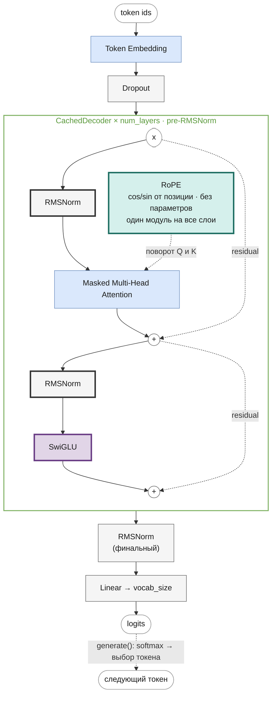
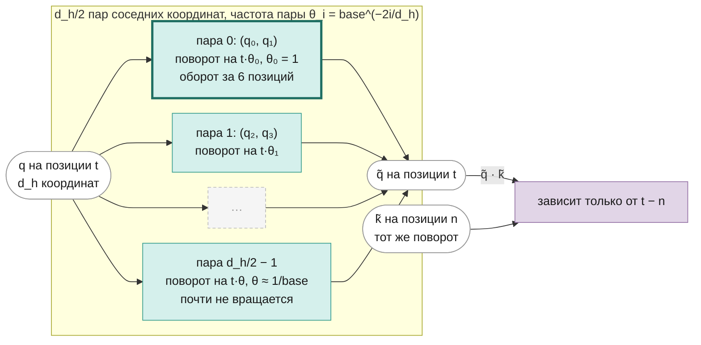
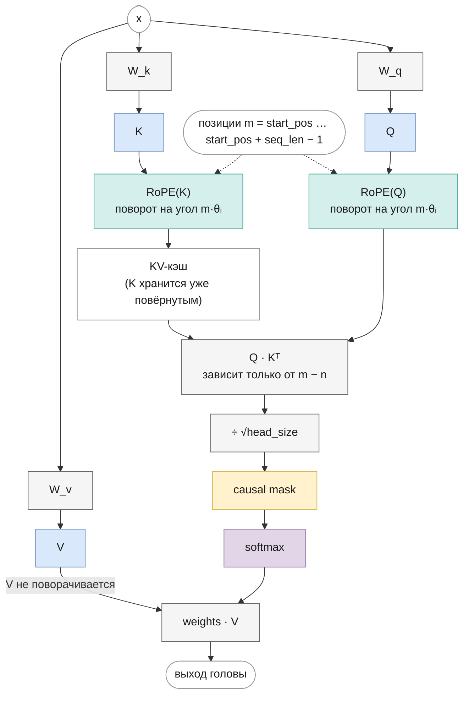

# LLaMA
<!-- description: LLaMA (Meta, 2023): RoPE, RMSNorm и SwiGLU — статья, формулы, подсчёт параметров, код и загрузка весов HuggingFace. -->

Часть II · [← GPT-2](gpt2.md) · [Оглавление](README.md) · [Mistral →](mistral.md)

> Реализация: [`llm/src/llm/models/llama/llama.py`](../../llm/src/llm/models/llama/llama.py) · класс `Llama` · ноутбук: [`notebooks/llama.ipynb`](../../notebooks/llama.ipynb)

Место в линейке: [GPT-1](gpt.md) → [GPT-2](gpt2.md) → **LLaMA** → [Mistral](mistral.md) → [Mixtral](mixtral.md) · [Gemma](gemma.md)

## Что вы узнаете

- Чем LLaMA важна для науки: обучение только на открытых данных и ставка на дешёвый инференс, а не на минимум вычислений при обучении.
- Три замены относительно GPT-2 — pre-RMSNorm, SwiGLU, RoPE — с формулами и объяснением, зачем каждая.
- Как выглядит полный прямой проход LLaMA в формулах и как он записан в классах `Llama` и `CachedDecoder`.
- Как посчитать число параметров по компонентам и проверить подсчёт программно, не выделяя память под 7 млрд чисел.
- Как загрузить веса HuggingFace и почему строки матриц Q и K при этом переставляются.
- Что изменилось в LLaMA 2 и откуда в линейке взялся GQA.

## Предварительные знания

- Общая схема decoder-only трансформера и pre-LN — [language-modeling.md](language-modeling.md), [gpt2.md](gpt2.md).
- Attention и KV-кэш — [attention.md](attention.md).
- RMSNorm и LayerNorm — [normalization.md](normalization.md).
- FFN, SiLU и SwiGLU — [feed-forward.md](feed-forward.md).
- Позиционное кодирование и полный вывод RoPE — [positional-encoding.md](positional-encoding.md).

## Обзор

**LLaMA** (Touvron et al., [*LLaMA: Open and Efficient Foundation Language Models*](https://arxiv.org/abs/2302.13971), Meta, 2023) — семейство decoder-only моделей размером от 7 до 65 млрд параметров. Архитектурно это GPT-2 с тремя заменами, взятыми из более ранних работ: RMSNorm ([Zhang & Sennrich, 2019](https://arxiv.org/abs/1910.07467)) вместо LayerNorm, SwiGLU ([Shazeer, 2020](https://arxiv.org/abs/2002.05202)) вместо GELU-FFN и RoPE ([Su et al., 2021](https://arxiv.org/abs/2104.09864)) вместо обучаемых позиционных эмбеддингов (разд. 2.2 статьи). Ни одна из них не придумана в LLaMA; вклад статьи — в том, как и на чём обучены модели, и в том, что веса стали доступны исследователям. Этот набор приёмов стал базой для большинства последующих открытых моделей, в том числе Mistral, Mixtral и Gemma из этого пособия.

### Научный вклад

**Только открытые данные.** Все 1,4 трлн токенов обучающего корпуса собраны из публично доступных источников (разд. 2.1, табл. 1): CommonCrawl — 67 %, C4 — 15 %, GitHub — 4,5 %, Википедия — 4,5 %, книги (Gutenberg и Books3) — 4,5 %, ArXiv — 2,5 %, StackExchange — 2 %. Для сравнения: GPT-3, Chinchilla и PaLM обучались в том числе на закрытых данных. Статья показала, что модели уровня лучших закрытых можно получить на открытом корпусе, — а значит, их обучение можно воспроизвести.

**Ориентир на инференс, а не на бюджет обучения.** Работа Chinchilla ([Hoffmann et al., 2022](https://arxiv.org/abs/2203.15556)) ищет, как при заданном бюджете *обучения* выбрать размер модели и число токенов; по её рекомендации модель на 10B стоит учить примерно на 200B токенах. Авторы LLaMA возражают (разд. 1): модель обучают один раз, а применяют миллионы раз, и важнее бюджет *инференса*. Меньшая модель, обученная дольше оптимума Chinchilla, дешевле в применении при том же качестве. Качество 7B, по наблюдению авторов, продолжало расти и после 1 трлн токенов.

**Результат.** LLaMA-13B превосходит GPT-3 (175B) на большинстве бенчмарков, будучи в 10 раз меньше, а LLaMA-65B конкурирует с Chinchilla-70B и PaLM-540B (аннотация и разд. 3 статьи).

### Размеры моделей

Табл. 2 статьи:

| Модель | $`d`$ | $`H`$ | $`L`$ | learning rate | батч (токенов) | токенов обучения |
|---|---|---|---|---|---|---|
| LLaMA 7B (6,7B) | 4096 | 32 | 32 | $`3{,}0 \cdot 10^{-4}`$ | 4M | 1,0T |
| LLaMA 13B | 5120 | 40 | 40 | $`3{,}0 \cdot 10^{-4}`$ | 4M | 1,0T |
| LLaMA 33B (32,5B) | 6656 | 52 | 60 | $`1{,}5 \cdot 10^{-4}`$ | 4M | 1,4T |
| LLaMA 65B (65,2B) | 8192 | 64 | 80 | $`1{,}5 \cdot 10^{-4}`$ | 4M | 1,4T |

Во всех моделях $`d_h = d / H = 128`$. Контекст — 2048 токенов, словарь — 32 000 токенов BPE (SentencePiece). Обучение (разд. 2.3): AdamW с $`\beta_1 = 0{,}9`$, $`\beta_2 = 0{,}95`$, weight decay 0,1, gradient clipping 1,0, 2000 шагов warmup и косинусное затухание до 10 % от максимальной скорости (подробнее об этих приёмах — в [training.md](training.md)). Модель 65B обучалась около 21 дня на 2048 GPU A100 80GB (разд. 2.4).

## Изменения относительно GPT-2

Остальное — decoder-only стек, causal-attention, residual-связи, pre-norm, финальная нормализация — то же, что в [GPT-2](gpt2.md). Ниже каждое изменение кратко: формула, смысл, ссылка на главу с полным разбором.

### 1. Pre-RMSNorm вместо pre-LayerNorm

Нормализация по-прежнему стоит *перед* каждым подслоем (pre-norm, как в GPT-2 и GPT-3), но LayerNorm заменён на RMSNorm:

```math
\mathrm{RMSNorm}(\mathbf{x}) = \frac{\mathbf{x}}{\sqrt{\frac{1}{d}\sum_{j=1}^{d} x_j^2 + \varepsilon}} \odot \mathbf{g}
```

где:
- $`\mathbf{x} \in \mathbb{R}^{d}`$ — вектор скрытого состояния одной позиции;
- $`\varepsilon`$ — малая константа против деления на ноль (`rms_norm_eps`, по умолчанию $`10^{-6}`$);
- $`\mathbf{g} \in \mathbb{R}^{d}`$ — обучаемый масштаб, инициализируется единицами (в коде — параметр `_w`);
- $`\odot`$ — поэлементное умножение.

В отличие от LayerNorm, RMSNorm не вычитает среднее и не имеет сдвига $`\boldsymbol{\beta}`$: только делит на среднеквадратичное значение. Zhang & Sennrich показали, что для стабилизации обучения важна именно нормировка масштаба, а центрирование почти ничего не добавляет, при этом RMSNorm дешевле.

Пример: $`\mathbf{x} = (3, 4)`$, $`\mathbf{g} = (1, 1)`$. Среднее квадратов $`(9 + 16)/2 = 12{,}5`$, корень — $`3{,}536`$, результат $`(0{,}849;\ 1{,}131)`$. LayerNorm дал бы $`(-1, 1)`$: сначала вычел бы среднее $`3{,}5`$. RMSNorm сохраняет направление вектора, LayerNorm — нет.

Подробно — в [normalization.md](normalization.md). В коде — [`core/rms_norm.py`](../../llm/src/llm/core/rms_norm.py), класс `RMSNorm`; для входа в float16/bfloat16 норма считается во float32.

### 2. SwiGLU вместо GELU-FFN

FFN GPT-2 — два линейных слоя с GELU между ними. В LLaMA — вентильный (gated) вариант с тремя матрицами:

```math
\mathrm{SwiGLU}(\mathbf{x}) = \big(\mathrm{SiLU}(\mathbf{x} W_{\text{gate}}) \odot \mathbf{x} W_{\text{up}}\big)\, W_{\text{down}}, \qquad \mathrm{SiLU}(z) = z \cdot \sigma(z) = \frac{z}{1 + e^{-z}}
```

где:
- $`\mathbf{x} \in \mathbb{R}^{d}`$ — вход (выход второй RMSNorm);
- $`W_{\text{gate}}, W_{\text{up}} \in \mathbb{R}^{d \times d_{ff}}`$ — проекции «ворот» и «значения»;
- $`W_{\text{down}} \in \mathbb{R}^{d_{ff} \times d}`$ — обратная проекция;
- $`d_{ff}`$ — скрытый размер (`intermediate_size`);
- $`\sigma`$ — логистическая сигмоида.

В [feed-forward.md](feed-forward.md) те же матрицы обозначены, как в статье Шазира: $`W`$, $`V`$ и $`W_2`$; в коде это `_gate`, `_up` и `_down`.

Интуиция: $`\mathrm{SiLU}(\mathbf{x} W_{\text{gate}})`$ решает, *сколько* пропустить по каждому из $`d_{ff}`$ каналов, а $`\mathbf{x} W_{\text{up}}`$ — *что* пропустить. Шазир показал, что такие GLU-варианты дают меньшую перплексию, чем обычный FFN того же размера; LLaMA следует выбору PaLM.

Пример на одном канале: $`\mathbf{x} W_{\text{gate}} = 1`$, $`\mathbf{x} W_{\text{up}} = 2`$. $`\mathrm{SiLU}(1) = 1 \cdot \sigma(1) = 0{,}731`$, выход канала до $`W_{\text{down}}`$ — $`0{,}731 \cdot 2 = 1{,}462`$. При $`\mathbf{x} W_{\text{gate}} = -1`$ ворота почти закрыты: $`\mathrm{SiLU}(-1) = -0{,}269`$.

Матриц три, а не две, поэтому при $`d_{ff} = 4d`$ FFN был бы в 1,5 раза тяжелее. LLaMA берёт $`d_{ff} \approx \tfrac{2}{3} \cdot 4d`$, чтобы число параметров осталось прежним: $`3 \cdot d \cdot \tfrac{8d}{3} = 8d^2 = 2 \cdot d \cdot 4d`$ (см. [Размер FFN и bias](#размер-ffn-и-bias)).

Подробно — в [feed-forward.md](feed-forward.md). В коде — [`core/swi_glu.py`](../../llm/src/llm/core/swi_glu.py), класс `SwiGLU` (поля `_gate`, `_up`, `_down`).

### 3. RoPE вместо обучаемых позиционных эмбеддингов

В GPT-2 к эмбеддингу токена прибавляется обучаемый вектор позиции. В LLaMA позиционных эмбеддингов на входе нет: позиция вносится внутри каждого attention **поворотом** векторов Q и K на угол, пропорциональный позиции. Формулы — в следующем разделе, [Attention с RoPE](#attention-с-rope); полный вывод — в [positional-encoding.md](positional-encoding.md).

Что это даёт: скалярное произведение запроса и ключа зависит только от расстояния между токенами, у кодирования нет параметров, а таблица позиций не привязана к обученной длине так жёстко, как обучаемые эмбеддинги.

## Архитектура блока декодера

Жирная обводка — то, что изменилось по сравнению с GPT-2.



Отдельного блока позиционных эмбеддингов на входе больше нет. RoPE стоит сбоку и подключён к attention пунктиром: он не прибавляется к основному потоку, а поворачивает Q и K внутри attention каждого слоя.

## Прямой проход в формулах

Вход — токены $`x_0, \dots, x_{T-1}`$. Прямой проход `Llama.forward` (без кэша, режим обучения):

```math
\begin{aligned}
H^{(0)} &= \mathrm{Dropout}\big(E[x_0, \dots, x_{T-1}]\big) \\
U^{(l)} &= H^{(l-1)} + \mathrm{MHA}_{\text{RoPE}}\big(\mathrm{RMSNorm}^{(l)}_1(H^{(l-1)})\big), \qquad l = 1, \dots, L \\
H^{(l)} &= U^{(l)} + \mathrm{SwiGLU}^{(l)}\big(\mathrm{RMSNorm}^{(l)}_2(U^{(l)})\big) \\
Z &= \mathrm{RMSNorm}_f\big(H^{(L)}\big)\, W_{\text{out}} + \mathbf{b}_{\text{out}}
\end{aligned}
```

где:
- $`E \in \mathbb{R}^{V \times d}`$ — матрица эмбеддингов токенов, $`E[x_t]`$ — её строка с номером $`x_t`$, $`E[x_0, \dots, x_{T-1}] \in \mathbb{R}^{T \times d}`$ — строки для всех токенов (как в [gpt.md](gpt.md#прямой-проход-в-формулах));
- $`H^{(l)}, U^{(l)} \in \mathbb{R}^{T \times d}`$ — скрытые состояния после блока $`l`$ и после его attention-подслоя (нормализация применяется к каждой строке отдельно);
- $`\mathrm{RMSNorm}^{(l)}_1, \mathrm{RMSNorm}^{(l)}_2`$ — две нормализации блока $`l`$ со своими масштабами $`\mathbf{g}`$; $`\mathrm{RMSNorm}_f`$ — финальная;
- $`W_{\text{out}} \in \mathbb{R}^{d \times V}`$, $`\mathbf{b}_{\text{out}} \in \mathbb{R}^{V}`$ — голова на словарь (bias — только при `bias: true`); веса не связаны с $`E`$;
- $`Z \in \mathbb{R}^{T \times V}`$ — logits; строка $`t`$ задаёт распределение следующего токена $`x_{t+1}`$.

Attention-подслой для головы $`j = 1, \dots, H`$:

```math
\begin{aligned}
Q_j &= \mathrm{RoPE}\big(X W_Q^{(j)}\big), \quad K_j = \mathrm{RoPE}\big(X W_K^{(j)}\big), \quad V_j = X W_V^{(j)} \\
\mathrm{head}_j &= \mathrm{softmax}\!\left(\frac{Q_j K_j^{\top}}{\sqrt{d_h}} + M\right) V_j, \qquad M_{tu} = \begin{cases} 0, & u \le t \\ -\infty, & u > t \end{cases} \\
\mathrm{MHA}_{\text{RoPE}}(X) &= \mathrm{Dropout}\big([\mathrm{head}_1; \dots; \mathrm{head}_H]\, W_O\big)
\end{aligned}
```

где $`X \in \mathbb{R}^{T \times d}`$ — выход первой нормализации, $`W_Q^{(j)}, W_K^{(j)}, W_V^{(j)} \in \mathbb{R}^{d \times d_h}`$ — проекции головы $`j`$ (в коде все головы — одна матрица `nn.Linear(d, H·d_h)`), $`Q_j, K_j, V_j \in \mathbb{R}^{T \times d_h}`$, $`M`$ — causal-маска ([masks.md](masks.md)), $`W_O \in \mathbb{R}^{Hd_h \times d}`$ — выходная проекция (при `bias: true` к Q, K, V и выходу добавляются сдвиги, в формуле они опущены). $`\mathrm{RoPE}`$ поворачивает строку $`t`$ на углы, зависящие от $`t`$ (следующий раздел). V не поворачивается.

Dropout в коде — после эмбеддингов, после $`W_O`$ и после $`W_{\text{down}}`$ в SwiGLU; на сами веса внимания (после softmax) он не применяется. В оригинальной LLaMA dropout нет вовсе; для загрузки чужих весов и инференса задавайте `dropout: 0` или вызывайте `model.eval()`.

## Attention с RoPE

**RoPE** (Rotary Position Embedding, [Su et al., 2021](https://arxiv.org/abs/2104.09864)) кодирует позицию поворотом. Вектор головы $`\mathbf{q} \in \mathbb{R}^{d_h}`$ на позиции $`t`$ разбивается на $`d_h/2`$ пар соседних координат, и пара $`i`$ поворачивается на угол $`t\theta_i`$:

```math
\begin{pmatrix} \tilde q_{2i} \\ \tilde q_{2i+1} \end{pmatrix}
=
\begin{pmatrix} \cos t\theta_i & -\sin t\theta_i \\ \sin t\theta_i & \cos t\theta_i \end{pmatrix}
\begin{pmatrix} q_{2i} \\ q_{2i+1} \end{pmatrix},
\qquad \theta_i = \text{base}^{-2i/d_h}, \quad i = 0, \dots, \tfrac{d_h}{2} - 1
```

где:
- $`q_{2i}, q_{2i+1}`$ — координаты пары $`i`$ вектора запроса (для ключа — то же самое);
- $`t`$ — абсолютная позиция токена (с 0);
- $`\theta_i`$ — частота пары $`i`$ (радиан на позицию);
- $`\text{base}`$ — база частот, ключ `rope_theta` (по умолчанию 10 000).

Главное свойство — повороты складываются, и в скалярном произведении остаётся только разность позиций. Для одной пары, где $`R(\alpha)`$ — матрица поворота на угол $`\alpha`$:

```math
\big(R(m\theta)\,\mathbf{q}\big) \cdot \big(R(n\theta)\,\mathbf{k}\big) = \mathbf{q} \cdot R\big((n - m)\theta\big)\,\mathbf{k}
```

Пример: $`\mathbf{q} = \mathbf{k} = (1, 0)`$, $`\theta = 1`$. При $`m = 3, n = 1`$ получаем $`(\cos 3, \sin 3) \cdot (\cos 1, \sin 1) = \cos 2 = -0{,}416`$; при $`m = 5, n = 3`$ — то же $`\cos 2`$. Результат зависит только от расстояния 2.

Следствия:

- **Относительная позиция.** Attention «видит» расстояние между токенами, хотя каждый вектор повёрнут по своей абсолютной позиции.
- **Норма сохраняется.** Поворот не меняет длину векторов, масштаб $`QK^\top`$ прежний.
- **Нет обучаемых параметров.** Таблицы `cos`/`sin` размером $`T_{\max} \times d_h/2`$ вычисляются один раз; один экземпляр `RoPE` создаётся в `Llama.__init__` и передаётся во все слои.
- **V не поворачивается:** позиция нужна, чтобы решить, *куда* смотреть, а не *что* забирать.

Полный вывод свойства, связь с комплексными числами и сравнение с синусоидальным кодированием — в [positional-encoding.md](positional-encoding.md).

Как поворот устроен по координатам: вектор режется на пары, у каждой пары своя скорость вращения.



Схема одной головы attention с RoPE:



**В коде** ([`core/rope.py`](../../llm/src/llm/core/rope.py), класс `RoPE`): конструктор вычисляет `freqs = 1 / base ** (2·arange(d_h/2) / d_h)` — это $`\theta_i`$ — и буферы `cos_matrix`, `sin_matrix` формы `[max_seq_len, d_h/2]` со значениями $`\cos t\theta_i`$, $`\sin t\theta_i`$. `forward(x, start_pos)` берёт строки `start_pos : start_pos + seq_len`, делит `x` на чётные (`x[..., 0::2]`) и нечётные (`x[..., 1::2]`) координаты и собирает `x_even·cos − x_odd·sin`, `x_even·sin + x_odd·cos` — ровно формулу выше. Применяется в `MultiHeadAttention.forward` к `q` и `k` после разбиения на головы и до склейки с кэшем.

**KV-кэш.** `start_pos` равен длине кэша `cache[0].size(2)` (в Mistral и Mixtral, где кэш обрезается окном, — хранимой позиции `next_pos`, см. [mistral.md](mistral.md)). Кэш хранит K уже повёрнутыми, поэтому старые ключи не пересчитываются. Позиций дальше `max_position_embeddings` в таблицах нет: `forward` за этой границей даёт `ValueError`, а `generate` продолжает по последним `max_position_embeddings` токенам и пересчитывает их без кэша — при сдвиге окна позиции всех токенов меняются, и повёрнутые K из кэша больше не годятся (см. [gpt.md](gpt.md#генерация) и [generation.md](generation.md)).

**Какие координаты образуют пару.** Здесь пары — соседние координаты $`(q_0, q_1), (q_2, q_3), \dots`$, как в эталонном коде Meta. В HuggingFace пары другие — $`(q_i, q_{i + d_h/2})`$, половины вектора (`rotate_half`). Математически это та же операция после перестановки координат, но веса Q и K между двумя вариантами без перестановки строк не переносятся (см. [Загрузка весов HuggingFace](#загрузка-весов-huggingface)).

### Скорости вращения и база (`rope_theta`)

Частоты $`\theta_i = \text{base}^{-2i/d_h}`$ убывают геометрически: от $`\theta_0 = 1`$ радиана на позицию у первой пары до $`\approx 1/\text{base}`$ у последней. Период пары — через сколько токенов её угол повторяется — $`2\pi/\theta_i`$. Для $`d_h = 64`$:

| Пара $`i`$ | $`\theta_i`$ при base $`= 10^4`$ | период | $`\theta_i`$ при base $`= 10^6`$ | период |
|---|---|---|---|---|
| 0 | 1 | 6 токенов | 1 | 6 токенов |
| 16 | 0,01 | 628 | 0,001 | 6 283 |
| 31 | $`1{,}3 \cdot 10^{-4}`$ | ~47 000 | $`1{,}5 \cdot 10^{-6}`$ | ~4 000 000 |

Быстрые пары точно кодируют соседство, но на больших расстояниях их угол проворачивается много раз; дальние расстояния однозначно различают только медленные пары. **База задаёт, насколько медленной будет последняя пара**, то есть под какую длину контекста рассчитана «шкала». При base $`= 10^4`$ самая медленная пара ($`d_h = 64`$) к позиции 4096 повернётся на 31°, а к 32 768 — уже на 250°; при base $`= 10^6`$ к позиции 32 768 — лишь на 3°. Цена большой базы — все пары, кроме первой, вращаются медленнее, и ближние расстояния кодируются грубее.

| Модель | `rope_theta` | Контекст |
|---|---|---|
| RoFormer, LLaMA, Llama 2, Mistral 7B v0.1, Gemma | 10 000 | до 8k |
| Code Llama ([Rozière et al., 2023](https://arxiv.org/abs/2308.12950)) | 1 000 000 | 16k (обучение) |
| Mixtral 8x7B | 1 000 000 | 32k |

В репозитории база задаётся ключом конфига `rope_theta` (по умолчанию `10000`) у LLaMA, Mistral, Mixtral и Gemma и передаётся в `RoPE(head_size, max_seq_len, base=…)`. База должна быть больше 1 — иначе частоты перестают убывать; `RoPE` проверяет это и бросает `ValueError`. Для учебных конфигов ($`T_{\max} \le 512`$) разница между $`10^4`$ и $`10^6`$ почти не видна: самая медленная пара при $`10^4`$ к позиции 512 поворачивается примерно на 4°.

База — не обучаемый параметр, но веса выучиваются под конкретные углы. Поэтому у обученной модели её **нельзя менять** без дообучения. Увеличение базы с последующим коротким дообучением — один из способов расширить контекст готовой модели (так сделано в Code Llama).

Подробный вывод, таблица периодов для всех пар и методы расширения контекста — в [positional-encoding.md](positional-encoding.md). Mistral, Mixtral и Gemma используют тот же класс `RoPE` и применяют его так же — к Q и K внутри своих вариантов attention.

## Компоненты

| Компонент | Класс | Файл |
|---|---|---|
| Токен-эмбеддинги | `TokenEmbeddings` (без отдельных позиционных эмбеддингов) | [`core/token_embeddings.py`](../../llm/src/llm/core/token_embeddings.py) |
| Позиционное кодирование | `RoPE` — поворот Q/K на угол, зависящий от позиции | [`core/rope.py`](../../llm/src/llm/core/rope.py) |
| Нормализация | `RMSNorm` (pre-norm, оба подслоя, и финальная) | [`core/rms_norm.py`](../../llm/src/llm/core/rms_norm.py) |
| FFN | `SwiGLU` (gated SiLU-MLP) | [`core/swi_glu.py`](../../llm/src/llm/core/swi_glu.py) |
| Attention | `MultiHeadAttention` + RoPE | [`core/multi_head_attention.py`](../../llm/src/llm/core/multi_head_attention.py) |
| Блок декодера | `CachedDecoder` (параметризован `norm_layer`, `feed_forward_layer`) | [`core/cached_decoder.py`](../../llm/src/llm/core/cached_decoder.py) |
| Модель целиком | `Llama`, `llama_intermediate_size` | [`models/llama/llama.py`](../../llm/src/llm/models/llama/llama.py) |
| Перенос весов HF | `convert_hf_state_dict` | [`models/llama/hf_weights.py`](../../llm/src/llm/models/llama/hf_weights.py) |

## Разбор кода

### Класс `Llama`

`Llama` наследует `BaseModel` ([`core/base_model.py`](../../llm/src/llm/core/base_model.py)), откуда берёт `generate`, `save`, `load`. Конструктор:

1. `head_size = resolve_head_size(config, "num_heads", rope=True)` — $`d_h`$ из ключа `head_size` или $`d / H`$; проверяет делимость и чётность (RoPE поворачивает пары) — [`core/config_checks.py`](../../llm/src/llm/core/config_checks.py).
2. Читает необязательные ключи: `rms_norm_eps` (1e-6), `intermediate_size` ($`4d`$), `bias` (`True`), `rope_theta` (10000).
3. Создаёт `TokenEmbeddings`, **один** `RoPE` и `nn.Dropout`.
4. Строит `num_layers` блоков `CachedDecoder`, передавая каждому `norm_layer=partial(RMSNorm, eps=norm_eps)`, свежий `SwiGLU(...)` и общий `rope`.
5. Финальный `RMSNorm` и голову `nn.Linear(embed_dim, vocab_size, bias=bias)`.
6. Инициализирует веса как HF: `self.apply(partial(init_normal_, std=initializer_range))` — `Linear` и `Embedding` из $`\mathcal{N}(0, 0.02^2)`$, bias — нули ([training.md](training.md#какие-модели-что-используют)).

`forward(x, use_cache=False, cache=None, attention_mask=None)`:

```python
start_pos = cache_start_pos(cache)
check_sequence_length(x.size(1), start_pos, self._max_seq_len)  # позиции < T_max
padding = padding_from_attention_mask(attention_mask, x, start_pos)  # маска ключей и позиции или None
out = self._dropout(self._token_embeddings(x))      # H^(0); позиций на входе нет
for i, decoder in enumerate(self._decoders):        # блоки l = 1..L, у каждого свой кэш
    out, layer_cache = decoder(out, use_cache=use_cache, cache=cache[i] if cache else None, padding=padding)
logits = self._linear(self._norm(out))              # Z = RMSNorm_f(H^(L)) W_out + b
```

(фрагмент упрощён; в исходнике кэш слоёв собирается в список `new_cache` и возвращается как `(logits, new_cache)` или `(logits, None)`). Кэш — список из $`L`$ пар `(K, V)` формы `[B, H, T_cache, d_h]`. Как `attention_mask` превращается в маску ключей и позиции RoPE — в [masks.md](masks.md#attention_mask-и-паддинг).

### Класс `CachedDecoder`

[`core/cached_decoder.py`](../../llm/src/llm/core/cached_decoder.py). Это общий pre-norm блок с подставляемыми нормализацией и FFN; attention в нём всегда `MultiHeadAttention` (с RoPE, если передан `rope`). По умолчанию `norm_layer=nn.LayerNorm`, и тогда это классический pre-LN блок GPT-2. LLaMA подставляет RMSNorm и SwiGLU:

```
norm1_out = Norm1(x)                 # RMSNorm_1
attn_out  = Attention(norm1_out)     # MHA + RoPE (+ KV-кэш)
out       = attn_out + x             # U = H + MHA(...)
norm2_out = Norm2(out)               # RMSNorm_2
ffn_out   = FFN(norm2_out)           # SwiGLU
result    = ffn_out + out            # H' = U + SwiGLU(...)
```

Строки один в один соответствуют второй и третьей строкам формулы forward. `norm_layer` вызывается как `norm_layer(emb_size)`, поэтому eps передаётся через `functools.partial`. `bias` уходит в `MultiHeadAttention` (Q, K, V, выходная проекция), а bias SwiGLU задаётся при создании `SwiGLU` в `Llama`.

## Подсчёт параметров

Обозначим $`\beta = 1`$, если `bias: true`, и $`\beta = 0`$ иначе. Пусть $`H d_h = d`$ (так при `head_size` по умолчанию). По компонентам:

| Компонент | Параметров | Откуда |
|---|---|---|
| Эмбеддинги $`E`$ | $`Vd`$ | `nn.Embedding(V, d)` |
| Q, K, V одного слоя | $`3(d^2 + \beta d)`$ | три `nn.Linear(d, H·d_h)` |
| $`W_O`$ одного слоя | $`d^2 + \beta d`$ | `nn.Linear(H·d_h, d)` |
| SwiGLU одного слоя | $`3 d\, d_{ff} + \beta(2 d_{ff} + d)`$ | `_gate`, `_up`: $`d \to d_{ff}`$; `_down`: $`d_{ff} \to d`$ |
| Две RMSNorm слоя | $`2d`$ | только масштабы $`\mathbf{g}`$ |
| Финальная RMSNorm | $`d`$ | |
| Голова | $`Vd + \beta V`$ | `nn.Linear(d, V)`, не связана с $`E`$ |

Итого:

```math
P = 2Vd + \beta V + d + L\,\big(4d^2 + 3d\,d_{ff} + 2d + \beta\,(4d + 2d_{ff} + d)\big)
```

где $`V`$ — словарь, $`d`$ — `embed_dim`, $`L`$ — `num_layers`, $`d_{ff}`$ — `intermediate_size`. Число голов $`H`$ в формулу не входит: при $`Hd_h = d`$ проекции имеют размер $`d \times d`$ при любом $`H`$.

**Учебный конфиг** [`experiments/llm_only/configs/llama_train.json`](../../experiments/llm_only/configs/llama_train.json): $`d = 256`$, $`L = 4`$, $`H = 4`$, по умолчанию $`d_{ff} = 4d = 1024`$ и $`\beta = 1`$. `vocab_size` в файле равен `null` и берётся из токенизатора (`bpe_vocab_size: 1000`); примем $`V = 1000`$.

```math
\begin{aligned}
\text{слой} &= 4 \cdot 65\,536 + 3 \cdot 256 \cdot 1024 + 512 + (1024 + 2048 + 256) = 1\,052\,416 \\
P &= 2 \cdot 256\,000 + 1000 + 256 + 4 \cdot 1\,052\,416 = 4\,722\,920
\end{aligned}
```

С настройками как в LLaMA (`"bias": false`, `"intermediate_size": llama_intermediate_size(256)` $`= 768`$) — 3 922 176.

**LLaMA 7B**: $`V = 32\,000`$, $`d = 4096`$, $`L = 32`$, $`d_{ff} = 11\,008`$, $`\beta = 0`$:

```math
\begin{aligned}
\text{attention слоя} &= 4 \cdot 4096^2 = 67\,108\,864 \\
\text{SwiGLU слоя} &= 3 \cdot 4096 \cdot 11\,008 = 135\,266\,304 \\
\text{слой} &= 67\,108\,864 + 135\,266\,304 + 8192 = 202\,383\,360 \\
P &= 2 \cdot 32\,000 \cdot 4096 + 4096 + 32 \cdot 202\,383\,360 = 6\,738\,415\,616 \approx 6{,}74\text{B}
\end{aligned}
```

Это «6,7B» из табл. 2 статьи. Две трети параметров слоя — в FFN, треть — в attention; эмбеддинги и голова — около 4 % модели.

**Программная проверка.** Модель на 6,7 млрд параметров во float32 заняла бы 27 ГБ. На **мета-устройстве** (`torch.device("meta")`, PyTorch ≥ 2.0) тензоры имеют форму, но не имеют данных, и память не выделяется:

```python
import json, torch
from llm.models.llama import Llama, llama_intermediate_size

def count(model):
    return sum(p.numel() for p in model.parameters())

cfg = json.load(open("experiments/llm_only/configs/llama_train.json"))["model_config"]
cfg["vocab_size"] = 1000
print(count(Llama(cfg)))                    # 4722920

cfg_7b = {"vocab_size": 32000, "embed_dim": 4096, "num_heads": 32, "num_layers": 32,
          "max_position_embeddings": 2048, "dropout": 0.0,
          "intermediate_size": llama_intermediate_size(4096), "bias": False}   # 11008
with torch.device("meta"):
    model = Llama(cfg_7b)
print(count(model))                         # 6738415616
```

По той же формуле для остальных размеров (с $`d_{ff}`$ = `llama_intermediate_size(d)`):

| Модель | $`d_{ff}`$ | Параметров по формуле | В статье |
|---|---|---|---|
| 7B | 11 008 | 6 738 415 616 | 6,7B |
| 13B | 13 824 | 13 015 864 320 | 13,0B |
| 33B | 17 920 | 32 528 943 616 | 32,5B |
| 65B | 22 016 | 65 285 660 672 | 65,2B |

## Конфигурация

Пример из [`experiments/llm_only/configs/llama_train.json`](../../experiments/llm_only/configs/llama_train.json):

| Параметр | Значение в примере | Смысл |
|---|---|---|
| `vocab_size` | (из токенизатора) | размер словаря $`V`$ |
| `embed_dim` | 256 | размерность модели $`d`$ |
| `num_heads` | 4 | число голов $`H`$ (одинаковое для Q, K и V — это MHA) |
| `num_layers` | 4 | число блоков `CachedDecoder`, $`L`$ |
| `max_position_embeddings` | 128 | $`T_{\max}`$: максимальная длина и размер таблиц RoPE |
| `dropout` | 0.1 | dropout после эмбеддингов, на выходах attention и FFN |
| `head_size` | (нет в примере) | необязательный $`d_h`$, по умолчанию `embed_dim // num_heads`; должен быть чётным |
| `rms_norm_eps` | (нет в примере) | необязательный $`\varepsilon`$ всех RMSNorm, по умолчанию `1e-6` — как в LLaMA |
| `rope_theta` | (нет в примере) | необязательная база частот RoPE, по умолчанию `10000` — как в LLaMA; см. [Скорости вращения и база](#скорости-вращения-и-база-rope_theta) |
| `initializer_range` | (нет в примере) | необязательное стандартное отклонение начальных весов `Linear` и `Embedding`, по умолчанию `0.02` — как в HF; см. [training.md](training.md#какие-модели-что-используют) |
| `intermediate_size` | (нет в примере) | необязательный $`d_{ff}`$ SwiGLU, по умолчанию `4 · embed_dim`; в LLaMA — `llama_intermediate_size(embed_dim)`, см. [Размер FFN и bias](#размер-ffn-и-bias) |
| `bias` | (нет в примере) | необязательный: bias во всех `Linear` (Q/K/V, выход attention, три матрицы SwiGLU, голова), по умолчанию `true`; в LLaMA — `false` |

### Размер FFN и bias

По умолчанию два отличия от оригинала сохранены, чтобы загружались чекпоинты, сохранённые раньше. Оба включаются ключами конфига и меняют форму весов, поэтому чекпоинт одного вида в модель другого не загрузится.

**Скрытый размер SwiGLU.** В SwiGLU три матрицы, а не две, поэтому LLaMA (разд. 2.2 статьи, `FeedForward` в коде Meta) берёт $`d_{ff} = \tfrac{2}{3} \cdot 4d`$, чтобы FFN весил столько же, сколько обычный FFN шириной $`4d`$, и округляет вверх до кратного `multiple_of`:

```math
d_{ff} = m \cdot \left\lceil \frac{\lfloor 8d/3 \rfloor}{m} \right\rceil
```

где $`m`$ — `multiple_of` (256 у Meta; 32 у маленьких моделей llama2.c). Округление делает размеры матриц удобными для GPU. Пример для 7B: $`\lfloor 8 \cdot 4096 / 3 \rfloor = 10\,922`$, $`10\,922 / 256 = 42{,}66`$, вверх — 43, $`d_{ff} = 43 \cdot 256 = 11\,008`$ вместо $`4d = 16\,384`$: около 135M параметров FFN на слой вместо 201M.

В коде — `llama_intermediate_size(embed_dim, multiple_of=256, ffn_dim_multiplier=None)` из `llm.models.llama`: `hidden = int(2 * 4 * embed_dim / 3)`, затем необязательное умножение на `ffn_dim_multiplier` (его использует Llama 2 70B у Meta), затем `multiple_of * ((hidden + multiple_of - 1) // multiple_of)` — целочисленное округление вверх.

```python
from llm.models.llama import Llama, llama_intermediate_size

llama_intermediate_size(4096)                   # 11008 — LLaMA 7B
llama_intermediate_size(288, multiple_of=32)    # 768 — llama2.c stories15M
config = {..., "embed_dim": 4096, "intermediate_size": llama_intermediate_size(4096), "bias": False}
```

**Bias.** У Meta все проекции без bias. По умолчанию здесь bias есть в Q/K/V, выходной проекции attention, трёх матрицах SwiGLU и голове на словарь; `"bias": false` убирает все.

## Загрузка весов HuggingFace

С этими ключами загружаются веса `LlamaForCausalLM` — через `convert_hf_state_dict` из [`models/llama/hf_weights.py`](../../llm/src/llm/models/llama/hf_weights.py):

```python
from transformers import LlamaForCausalLM
from llm.models.llama import Llama, convert_hf_state_dict

hf = LlamaForCausalLM.from_pretrained("nickypro/tinyllama-15M")
c = hf.config
model = Llama({"vocab_size": c.vocab_size, "embed_dim": c.hidden_size, "num_heads": c.num_attention_heads,
               "num_layers": c.num_hidden_layers, "max_position_embeddings": c.max_position_embeddings,
               "dropout": 0.0, "rms_norm_eps": c.rms_norm_eps, "rope_theta": c.rope_theta,
               "intermediate_size": c.intermediate_size, "bias": False})
model.load_state_dict(convert_hf_state_dict(hf.state_dict(), num_heads=c.num_attention_heads))
```

Что делает `convert_hf_state_dict(hf_state_dict, num_heads, num_kv_heads=None)`:

- **переименовывает ключи**: `model.embed_tokens.weight` → `_token_embeddings._embedding.weight`, `model.layers.N.self_attn.q_proj` → `_decoders.N._heads._q`, `mlp.gate_proj`/`up_proj`/`down_proj` → `_ff._gate`/`_up`/`_down`, `input_layernorm` и `post_attention_layernorm` → `_norm1` и `_norm2` (параметр `_w`), `model.norm` → `_norm._w`, `lm_head` → `_linear`; незнакомый ключ — `KeyError`;
- **пропускает** буферы `rotary_emb.inv_freq` из старых чекпоинтов — таблицы RoPE здесь вычисляются заново;
- **переставляет строки** `q_proj` и `k_proj` (ниже);
- если в чекпоинте нет `lm_head.weight` (эмбеддинги привязаны, `tie_word_embeddings`), голова получает **копию** эмбеддингов: результат тот же, но параметров больше на $`Vd`$.

**Перестановка строк Q и K.** RoPE здесь, как в коде Meta, поворачивает пары $`(2i, 2i+1)`$, а HF (`rotate_half`) — пары $`(i, i + d_h/2)`$. При конвертации весов Meta в формат HF скрипт HF переставил строки `q_proj` и `k_proj` так, чтобы пара Meta $`(2i, 2i+1)`$ оказалась на местах $`(i, i + d_h/2)`$. `_hf_to_meta_rows` делает обратное. Внутри головы $`h`$ (строки `nn.Linear.weight` — выходные координаты):

```math
W^{\text{здесь}}\big[h d_h + 2i + s\big] = W^{\text{HF}}\big[h d_h + s \cdot \tfrac{d_h}{2} + i\big], \qquad i = 0, \dots, \tfrac{d_h}{2} - 1,\quad s \in \{0, 1\}
```

где:
- $`W[r]`$ — строка $`r`$ матрицы `weight` формы `[H·d_h, d]` (или элемент bias);
- $`h`$ — номер головы, $`i`$ — номер пары, $`s`$ — первая ($`0`$) или вторая ($`1`$) координата пары.

Для $`d_h = 4`$ строки головы HF `[0, 1, 2, 3]` = $`[x_0, x_1, y_0, y_1]`$ превращаются в `[0, 2, 1, 3]` = $`[x_0, y_0, x_1, y_1]`$. В коде это `value.reshape(H, 2, d_h/2, ...).transpose(1, 2).reshape(value.shape)`: ось «половина» ($`s`$) и ось «номер пары» ($`i`$) меняются местами.

Почему перестановка ничего не ломает: переставить строки $`W_Q`$ — значит переставить координаты вектора $`\mathbf{q}`$. Одна и та же перестановка $`\pi`$ координат $`\mathbf{q}`$ и $`\mathbf{k}`$ сохраняет скалярное произведение, $`\pi(\mathbf{q}) \cdot \pi(\mathbf{k}) = \mathbf{q} \cdot \mathbf{k}`$, а пара $`i`$ в обоих вариантах вращается с той же частотой $`\theta_i`$. После перестановки пары HF стоят на соседних местах, и RoPE Meta поворачивает их так же, как `rotate_half` — исходные. $`W_V`$ и $`W_O`$ не переставляются: V не поворачивается.

Подходят модели с обычным MHA (`num_key_value_heads == num_attention_heads`) и без `rope_scaling`. Проверено на пяти открытых моделях архитектуры LLaMA ([`llm/tests/models/test_llama_hf_parity.py`](../../llm/tests/models/test_llama_hf_parity.py)): логиты совпадают с HF с точностью до ~1e-4, greedy-генерация с KV-кэшем — токен в токен.

| Модель | `intermediate_size` | Совпадает с `llama_intermediate_size` | max \|Δ логитов\| |
|---|---|---|---|
| `nickypro/tinyllama-15M` (llama2.c) | 768 | да, `multiple_of=32` | 4.0e-5 |
| `nickypro/tinyllama-42M` | 1376 | да, `multiple_of=32` | 3.3e-5 |
| `nickypro/tinyllama-110M` | 2048 | да, `multiple_of=32` | 2.0e-5 |
| `JackFram/llama-68m` | 3072 (= 4d) | — | 4.1e-5 |
| `JackFram/llama-160m` | 3072 (= 4d) | — | 1.1e-4 |

Чекпоинты с GQA (Llama 2 70B и производные) в `Llama` не загрузятся — см. [LLaMA 2 и GQA](#llama-2-и-gqa).

## Отличия от оригинала

Реализован **LLaMA-1** в исходном виде: RoPE + RMSNorm + SwiGLU + обычный MHA. `Llama.__init__` читает из конфига только `num_heads` и строит `MultiHeadAttention` через `CachedDecoder`; GQA появилась только в Llama 2 (34B и 70B), а в этом репозитории реализована в [Mistral](mistral.md).

Ещё отличия от оригинала:

| | LLaMA (Meta) | Здесь |
|---|---|---|
| Bias | нет ни в одной проекции | во всех `Linear` по умолчанию; `"bias": false` — как в оригинале |
| Скрытый размер SwiGLU | `llama_intermediate_size(d)`, для 7B — 11008 | $`4d`$ по умолчанию; `intermediate_size` — как в оригинале |
| Dropout | нет | после эмбеддингов, на выходах attention и SwiGLU; `dropout: 0` убирает |
| Пары RoPE | соседние координаты | соседние координаты (в HF — половины вектора) |

Оба первых отличия отключаются, см. [Размер FFN и bias](#размер-ffn-и-bias).

## Генерация

`Llama.generate(...)` — унифицированная сигнатура `BaseModel.generate` (см. [gpt.md](gpt.md#генерация) и [generation.md](generation.md)): greedy или сэмплирование с temperature, top-k, top-p, KV-кэш по умолчанию, `eos_token_id`/`pad_token_id`.

```python
import torch
tokens = torch.tensor([[1, 15, 27]])
model.eval()
out = model.generate(tokens, max_new_tokens=20, do_sample=True, temperature=0.8, top_k=50)
```

С кэшем первый вызов обрабатывает весь промпт, дальше в модель подаётся только последний токен, а RoPE получает `start_pos` = длина кэша. Кэш LLaMA растёт на $`2 \cdot L \cdot H \cdot d_h`$ чисел за токен: для 7B во float16 это 0,5 МиБ на токен, 1 ГиБ на полный контекст 2048.

## LLaMA 2 и GQA

**Llama 2** (Touvron et al., [*Llama 2: Open Foundation and Fine-Tuned Chat Models*](https://arxiv.org/abs/2307.09288), 2023) сохраняет архитектуру LLaMA и меняет обучение (разд. 2, табл. 1 статьи):

- 2 трлн токенов вместо 1–1,4 трлн;
- контекст 4096 вместо 2048;
- размеры 7B, 13B, 34B, 70B; в 34B и 70B вместо MHA — **Grouped Query Attention** ([Ainslie et al., 2023](https://arxiv.org/abs/2305.13245));
- дообученные для диалога версии Llama 2-Chat (SFT и RLHF).

В GQA на $`H`$ голов Q приходится $`G < H`$ голов K/V: каждая пара K/V обслуживает группу из $`H/G`$ голов Q. KV-кэш уменьшается в $`H/G`$ раз — у Llama 2 70B, где 64 головы Q и 8 голов K/V (конфиг опубликованных весов), в 8 раз. Формулы и подсчёт экономии — в [mistral.md](mistral.md) и [attention.md](attention.md#виды-по-числу-голов-kv-mha-gqa-mqa).

Класс `Llama` здесь GQA не поддерживает. Но блок `Mistral` без ключа `window_size` — это ровно LLaMA с GQA (RoPE, RMSNorm, SwiGLU, полное causal-внимание), и `convert_hf_state_dict` принимает `num_kv_heads`. Проверено на случайной `LlamaForCausalLM` с `num_key_value_heads < num_attention_heads`: после загрузки в `Mistral` логиты совпадают с HF до ~1e-7.

## Типичные ошибки и тонкости

- **Загрузка весов без `"bias": false` и `intermediate_size`.** Формы не совпадут, `load_state_dict` упадёт. Значения по умолчанию сохранены ради старых чекпоинтов, а не ради совпадения с LLaMA.
- **Загрузка q/k без перестановки.** Если скопировать `q_proj` и `k_proj` из HF как есть, формы совпадут и ошибки не будет, но логиты окажутся неверными. Используйте `convert_hf_state_dict`.
- **Смена `rope_theta` у обученной модели.** Позиции начнут поворачиваться на другие углы; качество упадёт без дообучения.
- **Нечётный `head_size`.** RoPE поворачивает пары; конструктор отклонит такой конфиг с `ValueError`.
- **Контекст длиннее `max_position_embeddings`.** Таблицы RoPE не содержат этих позиций: `forward` бросает `ValueError`, `generate` обрезает контекст до последних $`T_{\max}`$ токенов и сбрасывает кэш.
- **Привязанные эмбеддинги в HF-чекпоинте.** Голова получает копию; дальнейшее дообучение будет менять две матрицы независимо.

## Что изменилось в Mistral

- обычный MHA → **Grouped Query Attention** (раздельное число голов Q и K/V);
- добавляется **Sliding Window Attention** — окно внимания ограниченной ширины вместо полной causal-маски — и KV-кэш, ограниченный окном;
- $`d_{ff} = 14\,336 = 3{,}5d`$ вместо $`\tfrac{8}{3}d`$ при $`d = 4096`$;
- RMSNorm, SwiGLU и RoPE остаются без изменений.

Подробности — в [mistral.md](mistral.md).

## Итоги

- LLaMA — GPT-2 с тремя заменами: pre-RMSNorm, SwiGLU, RoPE; научный вклад — обучение только на открытых данных и ставка на дешёвый инференс (меньше модель, больше токенов).
- RMSNorm нормирует только масштаб; SwiGLU добавляет вентиль и требует $`d_{ff} \approx \tfrac{8}{3}d`$ для того же числа параметров; RoPE поворачивает Q и K, и их скалярное произведение зависит только от расстояния.
- Число параметров: $`P = 2Vd + d + L(4d^2 + 3d\,d_{ff} + 2d)`$ без bias; для 7B — 6 738 415 616; программно проверяется на `torch.device("meta")`.
- В репозитории LLaMA собирается из общего `CachedDecoder` с подставленными `RMSNorm` и `SwiGLU`; по умолчанию bias и $`4d`$, как в LLaMA — `"bias": false` и `llama_intermediate_size`.
- Веса HF загружаются `convert_hf_state_dict`, который переставляет строки Q и K из пар «половин» в пары соседних координат.
- Llama 2 добавила GQA (34B, 70B); здесь GQA — в `Mistral`.

## Вопросы и упражнения

1. Почему в LLaMA нет модуля позиционных эмбеддингов на входе, а информация о позиции всё равно есть? Где именно в коде она появляется?

2. Вычислите `llama_intermediate_size(5120)` (LLaMA 13B) вручную.

   <details><summary>Ответ</summary>

   $`\lfloor 8 \cdot 5120 / 3 \rfloor = \lfloor 13\,653{,}3 \rfloor = 13\,653`$; $`13\,653 / 256 = 53{,}33`$, вверх — 54; $`54 \cdot 256 = 13\,824`$.

   </details>

3. Какая доля параметров одного слоя LLaMA 7B приходится на attention, а какая на FFN?

   <details><summary>Ответ</summary>

   Attention: $`4d^2 = 67\,108\,864`$; FFN: $`3 d\, d_{ff} = 135\,266\,304`$; слой (с нормализациями) — $`202\,383\,360`$. Attention — 33,2 %, FFN — 66,8 %, нормализации — 0,004 %.

   </details>

4. По формуле подсчёта параметров найдите число параметров учебного конфига, если задать `"bias": false` и оставить $`d_{ff} = 4d`$ ($`V = 1000`$). Проверьте программно.

   <details><summary>Ответ</summary>

   Слой: $`4 \cdot 65\,536 + 3 \cdot 256 \cdot 1024 + 512 = 1\,049\,088`$. Итого $`2 \cdot 256\,000 + 256 + 4 \cdot 1\,049\,088 = 4\,708\,608`$. Разница с $`\beta = 1`$ — $`1000 + 4 \cdot 3328 = 14\,312`$ параметров bias.

   </details>

5. Покажите на примере, что RoPE даёт зависимость только от расстояния: $`\mathbf{q} = \mathbf{k} = (1, 0)`$, $`\theta = 1`$; сравните $`\tilde{\mathbf{q}}_m \cdot \tilde{\mathbf{k}}_n`$ для $`(m, n) = (3, 1)`$, $`(5, 3)`$ и $`(1, 3)`$.

   <details><summary>Ответ</summary>

   $`\tilde{\mathbf{q}}_m = (\cos m, \sin m)`$, $`\tilde{\mathbf{k}}_n = (\cos n, \sin n)`$, произведение $`\cos m \cos n + \sin m \sin n = \cos(m - n)`$. Для $`(3, 1)`$ и $`(5, 3)`$ — $`\cos 2 = -0{,}416`$; для $`(1, 3)`$ — $`\cos(-2) = -0{,}416`$. В этом примере результат зависит только от $`|m - n|`$, потому что $`\mathbf{q} = \mathbf{k}`$; в общем случае знак разности важен.

   </details>

6. Для одной головы с $`d_h = 6`$ запишите, в каком порядке `convert_hf_state_dict` расставляет строки HF `[0, 1, 2, 3, 4, 5]`.

   <details><summary>Ответ</summary>

   По формуле $`W^{\text{здесь}}[2i + s] = W^{\text{HF}}[3s + i]`$: `[0, 3, 1, 4, 2, 5]`. Пары HF $`(0, 3), (1, 4), (2, 5)`$ становятся соседними.

   </details>

7. Сколько памяти займёт KV-кэш LLaMA 7B во float16 для одной последовательности длиной 2048? А для Llama 2 70B (80 слоёв, 8 голов K/V, $`d_h = 128`$) длиной 4096?

   <details><summary>Ответ</summary>

   LLaMA 7B: $`2 \cdot 32 \cdot 32 \cdot 128 \cdot 2048 \cdot 2`$ байт $`= 1`$ ГиБ. Llama 2 70B: $`2 \cdot 80 \cdot 8 \cdot 128 \cdot 4096 \cdot 2`$ байт $`= 1{,}25`$ ГиБ; при MHA с 64 головами было бы в 8 раз больше — 10 ГиБ.

   </details>

8. Почему авторы LLaMA обучали 7B на 1 трлн токенов, хотя по Chinchilla (около 20 токенов на параметр) для такого размера оптимально около 140 млрд? Что при этом проигрывается и что выигрывается?

   <details><summary>Ответ</summary>

   Chinchilla минимизирует вычисления *обучения* при заданном качестве. LLaMA минимизирует стоимость *инференса*: маленькая модель, обученная дольше, дешевле в каждом применении. Проигрыш — больше вычислений на обучение, чем минимально нужно для такого качества; выигрыш — меньше памяти и времени на каждый токен при использовании.

   </details>

## Литература

Основные статьи:

- Touvron et al. *LLaMA: Open and Efficient Foundation Language Models*. 2023. [arXiv:2302.13971](https://arxiv.org/abs/2302.13971)
- Touvron et al. *Llama 2: Open Foundation and Fine-Tuned Chat Models*. 2023. [arXiv:2307.09288](https://arxiv.org/abs/2307.09288) — GQA в линейке LLaMA появляется здесь (34B, 70B)

Компоненты и контекст:

- Su et al. *RoFormer: Enhanced Transformer with Rotary Position Embedding*. 2021. [arXiv:2104.09864](https://arxiv.org/abs/2104.09864)
- Zhang, Sennrich. *Root Mean Square Layer Normalization*. 2019. [arXiv:1910.07467](https://arxiv.org/abs/1910.07467)
- Shazeer. *GLU Variants Improve Transformer*. 2020. [arXiv:2002.05202](https://arxiv.org/abs/2002.05202) — SwiGLU и GeGLU
- Hoffmann et al. *Training Compute-Optimal Large Language Models*. 2022. [arXiv:2203.15556](https://arxiv.org/abs/2203.15556) — Chinchilla
- Ainslie et al. *GQA: Training Generalized Multi-Query Transformer Models from Multi-Head Checkpoints*. 2023. [arXiv:2305.13245](https://arxiv.org/abs/2305.13245)
- Rozière et al. *Code Llama: Open Foundation Models for Code*. 2023. [arXiv:2308.12950](https://arxiv.org/abs/2308.12950) — увеличение базы RoPE до $`10^6`$
