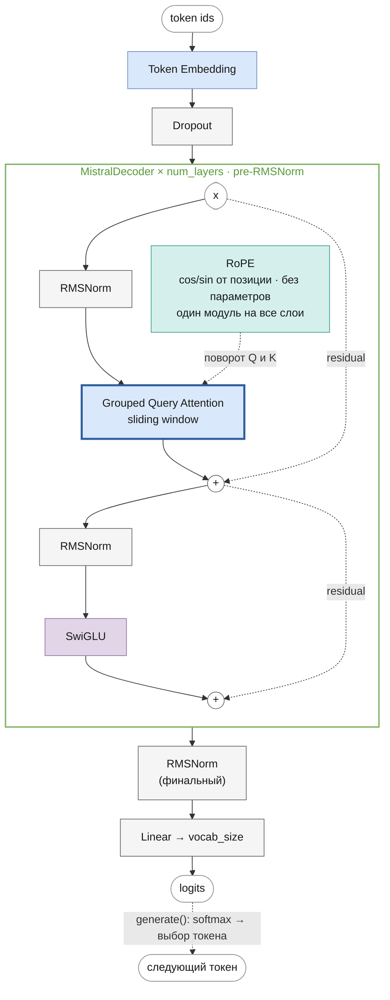

# Mistral

Часть II · [← LLaMA](llama.md) · [Оглавление](README.md) · [Mixtral →](mixtral.md)

> Реализация: [`llm/src/llm/models/mistral/mistral.py`](../../llm/src/llm/models/mistral/mistral.py) · класс `Mistral`
> Ноутбук: [`notebooks/mistral.ipynb`](../../notebooks/mistral.ipynb)

Место в линейке: [GPT-1](gpt.md) → [GPT-2](gpt2.md) → [LLaMA](llama.md) → **Mistral** → [Mixtral](mixtral.md) · [Gemma](gemma.md)

## Что вы узнаете

- Что предложила статья Mistral 7B и за счёт чего модель на 7B обходит Llama 2 13B.
- Как устроен Grouped Query Attention и сколько памяти и параметров он экономит.
- Как скользящее окно (sliding window attention) ограничивает внимание, почему дальность зависимостей всё равно растёт с глубиной и почему окно здесь шириной $`W + 1`$.
- Как работает кольцевой кэш (rolling buffer cache), чем его заменяет эта реализация и как обрабатывать длинный промпт кусками (chunked prefill).
- Как посчитать 7,24 млрд параметров Mistral 7B и проверить подсчёт программно.
- Что в классах `Mistral`, `MistralDecoder` и `GroupedQueryAttention` отличается от LLaMA.

## Предварительные знания

- Архитектура LLaMA: RMSNorm, SwiGLU, RoPE — [llama.md](llama.md).
- Multi-head attention, MHA/GQA/MQA, KV-кэш — [attention.md](attention.md).
- Causal-маска и маска скользящего окна — [masks.md](masks.md).
- Авторегрессивная генерация с кэшем — [generation.md](generation.md).

## Обзор

**Mistral 7B** (Jiang et al., [*Mistral 7B*](https://arxiv.org/abs/2310.06825), Mistral AI, 2023) — decoder-only модель на 7,24 млрд параметров. Её блок — это блок LLaMA (pre-RMSNorm, SwiGLU, RoPE) с двумя изменениями в attention, нацеленными на дешёвый инференс:

- **Grouped Query Attention** (GQA, [Ainslie et al., 2023](https://arxiv.org/abs/2305.13245)): 32 головы Q делят 8 голов K/V — KV-кэш в 4 раза меньше;
- **Sliding Window Attention** (SWA): каждый токен в слое смотрит только на последние $`W = 4096`$ позиций — кэш можно ограничить окном.

### Научный вклад

Статья показывает, что аккуратно спроектированная маленькая модель может превзойти модели крупнее (аннотация и разд. 3 статьи):

- Mistral 7B превосходит **Llama 2 13B** на всех бенчмарках, которые оценивали авторы, и **LLaMA 1 34B** (так в статье Mistral; у Meta эта модель — 33B) — на задачах рассуждения, математики и генерации кода;
- дообученная для диалога Mistral 7B – Instruct превосходит Llama 2 13B – Chat.

Архитектурные средства (разд. 2):

- **GQA** ускоряет инференс и уменьшает память кэша, позволяя увеличить батч;
- **SWA** снижает стоимость внимания на длинных последовательностях: для длины 16K и $`W = 4096`$ доработки FlashAttention и xFormers дают ускорение в 2 раза по сравнению с обычным вниманием;
- **rolling buffer cache** — кэш фиксированного размера $`W`$ с записью по позиции $`i \bmod W`$: на последовательности 32K память кэша уменьшается в 8 раз без потери качества;
- **pre-fill и chunking** — промпт известен заранее, поэтому кэш заполняется им сразу, а длинный промпт — кусками размером с окно.

Веса опубликованы под лицензией Apache 2.0.

Гиперпараметры (табл. 1 статьи):

| Параметр | Значение | Здесь |
|---|---|---|
| `dim` | 4096 | `embed_dim` ($`d`$) |
| `n_layers` | 32 | `num_layers` ($`L`$) |
| `head_dim` | 128 | `head_size` ($`d_h`$) |
| `hidden_dim` | 14336 | `intermediate_size` ($`d_{ff}`$) |
| `n_heads` | 32 | `num_q_heads` ($`H`$) |
| `n_kv_heads` | 8 | `num_kv_heads` ($`G`$) |
| `window_size` | 4096 | `window_size` ($`W`$, но см. [Ширина окна: W + 1](#ширина-окна-w--1)) |
| `context_len` | 8192 | `max_position_embeddings` ($`T_{\max}`$) |
| `vocab_size` | 32000 | `vocab_size` ($`V`$) |

## Архитектура блока декодера

Жирная обводка — то, что изменилось по сравнению с LLaMA.



Прямой проход тот же, что у LLaMA (формулы — в [llama.md](llama.md#полный-forward-в-формулах)), с заменой $`\mathrm{MHA}_{\text{RoPE}}`$ на $`\mathrm{GQA}_{\text{RoPE}}`$ с маской окна:

```math
\begin{aligned}
U^{(l)} &= H^{(l-1)} + \mathrm{GQA}^{W}_{\text{RoPE}}\big(\mathrm{RMSNorm}^{(l)}_1(H^{(l-1)})\big) \\
H^{(l)} &= U^{(l)} + \mathrm{SwiGLU}^{(l)}\big(\mathrm{RMSNorm}^{(l)}_2(U^{(l)})\big)
\end{aligned}
```

где $`H^{(l)} \in \mathbb{R}^{T \times d}`$ — выход блока $`l = 1, \dots, L`$, $`U^{(l)} \in \mathbb{R}^{T \times d}`$ — состояние после его attention-подслоя, $`\mathrm{GQA}^{W}_{\text{RoPE}}`$ — grouped query attention с RoPE и маской окна ширины $`W`$ (формулы ниже). Как RoPE поворачивает Q и K — в [llama.md](llama.md#attention-с-rope).

## Grouped Query Attention

Общая часть — виды attention по числу голов K/V и таблица размеров кэша реальных моделей — в [attention.md](attention.md#виды-по-числу-голов-kv-mha-gqa-mqa). Здесь — формулы и то, что относится к Mistral.

В MHA у каждой из $`H`$ голов Q свои K и V. В **GQA** голов K/V меньше, $`G`$, и $`H`$ делится на $`G`$: головы Q разбиты на $`G`$ групп по $`r = H/G`$, и группа делит одну пару K/V. Для головы $`j = 0, \dots, H-1`$:

```math
\begin{aligned}
g(j) &= \left\lfloor j / r \right\rfloor, \qquad r = H / G \\
Q_j &= \mathrm{RoPE}\big(X W_Q^{(j)}\big), \quad K_g = \mathrm{RoPE}\big(X W_K^{(g)}\big), \quad V_g = X W_V^{(g)} \\
\mathrm{head}_j &= \mathrm{softmax}\!\left(\frac{Q_j K_{g(j)}^{\top}}{\sqrt{d_h}} + M^{W}\right) V_{g(j)} \\
\mathrm{GQA}(X) &= [\mathrm{head}_0; \dots; \mathrm{head}_{H-1}]\, W_O
\end{aligned}
```

где:
- $`X \in \mathbb{R}^{T \times d}`$ — вход (выход RMSNorm);
- $`W_Q^{(j)} \in \mathbb{R}^{d \times d_h}`$ — проекция запроса головы $`j`$, всего $`H`$ штук;
- $`W_K^{(g)}, W_V^{(g)} \in \mathbb{R}^{d \times d_h}`$ — проекции ключа и значения группы $`g`$, всего $`G`$ штук;
- $`g(j)`$ — номер группы головы $`j`$: головы $`0, \dots, r-1`$ — группа 0, следующие $`r`$ — группа 1 и т. д.;
- $`Q_j, K_g, V_g \in \mathbb{R}^{T \times d_h}`$;
- $`M^{W} \in \{0, -\infty\}^{T \times T}`$ — маска скользящего окна ([ниже](#sliding-window-attention));
- $`W_O \in \mathbb{R}^{H d_h \times d}`$ — выходная проекция.

$`G = H`$ — это MHA, $`G = 1`$ — Multi-Query Attention ([Shazeer, 2019](https://arxiv.org/abs/1911.02150)). У Mistral 7B $`H = 32`$, $`G = 8`$, $`r = 4`$: головы Q 0–3 читают K/V группы 0, головы 4–7 — группы 1 и т. д.

**Интуиция.** Головы Q задают, *что* ищет токен, и их много. K и V — *что* токен предлагает; их разнообразие, как показали Ainslie et al., можно уменьшить в несколько раз почти без потери качества. Зато K и V — именно то, что хранится в кэше при генерации.

### Сколько экономит GQA

**KV-кэш.** На токен в одном слое хранится $`2 G d_h`$ чисел (K и V) вместо $`2 H d_h`$ — в $`r = H/G`$ раз меньше. Для всей модели и последовательности длины $`T`$:

```math
\text{KV-кэш (байт)} = 2 \cdot L \cdot G \cdot d_h \cdot T \cdot s
```

где $`s`$ — байт на число (2 для float16/bfloat16), множитель 2 — K и V. Для Mistral 7B: $`2 \cdot 32 \cdot 8 \cdot 128 \cdot 2 = 131\,072`$ байт $`= 128`$ КиБ на токен. При MHA ($`G = 32`$) было бы 512 КиБ.

| Mistral 7B, float16, один запрос | 4096 токенов | 32 768 токенов |
|---|---|---|
| MHA ($`G = 32`$), полный кэш | 2 ГиБ | 16 ГиБ |
| GQA ($`G = 8`$), полный кэш | 512 МиБ | 4 ГиБ |
| GQA + кэш, ограниченный окном $`W = 4096`$ | 512 МиБ | 512 МиБ |

Последняя строка — вклад скользящего окна: кэш перестаёт расти после $`W`$ токенов; на 32K это те самые «в 8 раз» из статьи.

**Параметры.** $`W_K`$ и $`W_V`$ имеют форму $`d \times G d_h`$ вместо $`d \times H d_h`$. Для Mistral 7B — $`2 \cdot 4096 \cdot 1024 = 8{,}4`$M вместо $`33{,}6`$M на слой; на 32 слоях экономия $`805`$M параметров.

**Вычисления.** $`\mathrm{softmax}(QK^\top)V`$ GQA не удешевляет: каждая из $`H`$ голов Q по-прежнему считает свои веса по всем ключам. Экономятся проекции K, V и — главное — чтение кэша из памяти, которое и ограничивает скорость генерации.

## Sliding Window Attention

Идея локального внимания со скользящим окном — из [Longformer](https://arxiv.org/abs/2004.05150) (Beltagy et al., 2020). В обычной causal-маске токен $`i`$ видит все позиции $`j \le i`$; в маске окна — только последние:

```math
M^{W}_{ij} = \begin{cases} 0, & 0 \le i - j \le W \\ -\infty, & \text{иначе} \end{cases}
```

где:
- $`i`$ — позиция запроса, $`j`$ — позиция ключа (абсолютные, с 0);
- $`W`$ — `window_size`;
- $`0`$ — пара разрешена, $`-\infty`$ — после softmax её вес станет нулём.

Условие $`i - j \ge 0`$ — обычная causal-часть, $`i - j \le W`$ — окно. Токен видит $`W + 1`$ позиций вместе с собой (почему именно столько — в [Ширина окна: W + 1](#ширина-окна-w--1)). Маска для $`W = 4`$, $`T = 8`$ (строки — запросы, столбцы — ключи; вывод `GroupedQueryAttention._tril_mask[:8, :8]`):

```
      j: 0 1 2 3 4 5 6 7
i = 0:   1 . . . . . . .
i = 1:   1 1 . . . . . .
i = 2:   1 1 1 . . . . .
i = 3:   1 1 1 1 . . . .
i = 4:   1 1 1 1 1 . . .
i = 5:   . 1 1 1 1 1 . .
i = 6:   . . 1 1 1 1 1 .
i = 7:   . . . 1 1 1 1 1
```

Пока $`i \le W`$, маска совпадает с causal; дальше диагональная полоса ширины $`W + 1`$ сдвигается вправо.

**Стоимость.** Строка $`i`$ имеет не больше $`W + 1`$ ненулевых весов, поэтому внимание на слой требует $`O(T \cdot W)`$ операций вместо $`O(T^2)`$ — если ядро вычисляет только полосу. **Реализация здесь этого не делает:** `GroupedQueryAttention` считает полную матрицу $`QK^\top`$ и затем обнуляет лишнее маской. Экономия по памяти здесь есть только в кэше при генерации (ниже); по вычислениям при обучении и префилле её нет.

### Рецептивное поле растёт со слоями

Внутри одного слоя токен не видит дальше $`W`$ позиций назад. Но скрытое состояние позиции $`j`$ в слое $`k - 1`$ уже содержит информацию о позициях до $`j - (k - 1)W`$ входа. По индукции (разд. 2 статьи):

```math
\text{состояние } \mathbf{h}^{(k)}_i \text{ зависит от входных токенов } x_{j} \text{ с } \; i - kW \le j \le i
```

- База: $`k = 1`$ — это определение маски.
- Шаг: $`\mathbf{h}^{(k)}_i`$ смотрит на $`\mathbf{h}^{(k-1)}_{j}`$ с $`j \ge i - W`$, а те — на входы с номерами $`\ge j - (k-1)W \ge i - kW`$.

После $`L`$ слоёв дальность — до $`L \cdot W`$ токенов. Для Mistral 7B: $`32 \cdot 4096 = 131\,072 \approx 131`$K токенов — теоретическое поле внимания, в 16 раз больше контекста 8192. «Теоретическое» — потому что информация на каждом шаге передаётся через сжатое скрытое состояние и по пути теряется; это верхняя граница, а не гарантия.

Для учебного конфига ($`L = 4`$, $`W = 16`$) поле — 64 токена при $`T_{\max} = 512`$: модель видит в прошлое намного меньше своего контекста.

### Ширина окна: W + 1

Здесь `W = window_size`. Реализация пропускает **W + 1** позиций: маска `i − j ≤ W` (включая сам токен). Источники определяют окно по-разному:

| Источник | Позиций видно (вместе с токеном) |
|---|---|
| [Статья Mistral 7B](https://arxiv.org/abs/2310.06825), раздел 2, текст: «attends to all hidden states from the previous layer with positions between i − W and i» | **W + 1** |
| Эталонный код Mistral AI ([`one_file_ref.py`](https://github.com/mistralai/mistral-inference/blob/147c4e68279b90eb61b19bdea44e16f5539d5a5d/one_file_ref.py)), prefill: `torch.triu(mask, diagonal=-sliding_window)` | **W + 1** |
| Статья, подпись к рисунку 1: «each token can attend to at most W tokens» | W |
| Статья, Rolling Buffer Cache: кэш фиксированного размера W, текущий токен тоже в нём | W |
| Эталонный код Mistral AI, генерация с кэшем (буфер из W ячеек) | W |
| HuggingFace Transformers (`sliding_window_overlay`: `kv_idx > q_idx − sliding_window`) | W |

Реализация следует тексту статьи и prefill в эталонном коде, причём одинаково с кэшем и без. **От HuggingFace она отличается на одну позицию**: при загрузке весов Mistral из HF окно нужно задать на единицу меньше, `window_size = sliding_window − 1` (см. [Загрузка весов HuggingFace](#загрузка-весов-huggingface)); с тем же числом логиты не совпадут — это проверяет тест. Для `window_size = 4096` (Mistral 7B) разница несущественна, для учебных конфигов с `window_size = 16` — около 6 %.

## Кэш, ограниченный окном

### Rolling buffer cache в статье

Ключи старше $`W`$ позиций больше никогда не понадобятся: ни один будущий запрос до них не дотянется. Поэтому кэш можно держать фиксированного размера $`W`$ и перезаписывать по кругу (разд. 2 статьи):

```math
\text{ячейка}(i) = i \bmod W
```

где $`i`$ — абсолютная позиция токена, ячейка — индекс в буфере из $`W`$ элементов (для каждого слоя и каждой головы K/V). K и V позиции $`i`$ записываются в ячейку $`i \bmod W`$ и затирают то, что там лежало, — позицию $`i - W`$.

Пример, $`W = 4`$, пишем позиции 0–9:

```
после позиции:  ячейка 0  ячейка 1  ячейка 2  ячейка 3
      3            0         1         2         3
      4            4         1         2         3      ← 4 mod 4 = 0, затёрта позиция 0
      5            4         5         2         3
      9            8         9         6         7
```

Порядок ячеек не совпадает с порядком позиций, но attention это не важно: softmax берётся по множеству ключей, а позиция уже «вшита» в K поворотом RoPE. Запись одного токена — $`O(1)`$ без копирования.

### Как это сделано здесь

Кольцевого буфера здесь нет. `GroupedQueryAttention.forward` на каждом шаге приклеивает новые K/V к кэшу через `torch.cat` и обрезает результат срезом до последних $`W`$ позиций:

```python
k = torch.cat([k_cache, k], dim=2)        # [B, G, cache_len + T, d_h]
...
if self._window_size is not None:         # после вычисления attention
    k = k[:, :, -self._window_size:, :]   # остаются последние W позиций
    v = v[:, :, -self._window_size:, :]
kv_cache = (k, v, start_pos + seq_len)    # тройка: K, V, next_pos
```

Содержимое то же, что в кольцевом буфере, но в порядке позиций; цена — копирование $`O(W)`$ на каждом шаге вместо записи $`O(1)`$.

Из-за обрезки длина кэша перестаёт совпадать с позицией токена, поэтому кэш — это **тройка** `(K, V, next_pos)`: `next_pos` — абсолютная позиция следующего токена. Её RoPE использует как `start_pos` (`start_pos = cache[2]`), и по ней же модель проверяет длину (`cache_start_pos` в [`core/generation.py`](../../llm/src/llm/core/generation.py)). Маска берётся срезом абсолютной маски:

```python
cache_len = k.size(2) - seq_len
window_mask = self._tril_mask[start_pos : start_pos + seq_len,              # строки — новые запросы
                              start_pos - cache_len : start_pos + seq_len]  # столбцы — ключи кэша и новые
```

Пример, $`W = 4`$: после 6 токенов (позиции 0–5) кэш хранит K/V позиций 2, 3, 4, 5, `next_pos = 6`. Токен на позиции 6 видит кэш (2–5) и себя (6) — пять позиций, $`W + 1`$, как и маска без кэша: $`6 - 2 = 4 \le W`$. В кольцевом буфере статьи тот же токен занял бы ячейку позиции 2 и видел бы позиции 3–6 — $`W`$ позиций (строка таблицы выше про рисунок и буфер).

Без `window_size` кэш не обрезается и растёт, как у LLaMA, но тоже остаётся тройкой.

## Pre-fill и chunking

При генерации промпт известен целиком, поэтому его K и V можно вычислить за один проход — **pre-fill** — и только потом генерировать по токену. Если промпт очень длинный, матрица внимания $`T \times T`$ не помещается в память; статья предлагает делить промпт на куски (**chunking**) размером с окно $`W`$ и заполнять кэш кусок за куском (разд. 2, рис. 3). Каждый кусок длины $`C`$ (в статье $`C = W`$) смотрит на кэш (предыдущее окно, не больше $`W`$ позиций) и на себя с causal-маской, поэтому матрица оценок внимания куска имеет размер не больше $`C \times (W + C)`$ вместо $`T \times T`$.

**Здесь.** `generate` делает pre-fill всего промпта за один вызов `forward`. Префилл кусками получается вручную: `forward` с кэшем принимает кусок любой длины, и срез маски выше правильно обрабатывает несколько новых запросов сразу:

```python
cache = None
for s in range(0, prompt.size(1), chunk):
    logits, cache = model(prompt[:, s:s + chunk], use_cache=True, cache=cache)
next_token = logits[:, -1].argmax(-1, keepdim=True)   # дальше — по токену с тем же кэшем
```

Проверено: для модели с $`W = 4`$ и 13 токенами логиты при кусках по 1, 3, 4 и 7 токенов совпадают с проходом целиком до ~5·10⁻⁷. Размер куска может быть и больше $`W`$: кэш после куска всё равно обрезается до $`W`$, а каждому запросу нужно не больше $`W`$ ключей до себя. Матрица внимания куска — `[B, H, C, cache_len + C]`, где `cache_len ≤ W`.

## Компоненты

| Компонент | Класс | Файл |
|---|---|---|
| Токен-эмбеддинги | `TokenEmbeddings` | [`core/token_embeddings.py`](../../llm/src/llm/core/token_embeddings.py) |
| Позиционное кодирование | `RoPE` | [`core/rope.py`](../../llm/src/llm/core/rope.py) |
| Нормализация | `RMSNorm` | [`core/rms_norm.py`](../../llm/src/llm/core/rms_norm.py) |
| Attention | `GroupedQueryAttention` (GQA + скользящее окно + RoPE) | [`core/group_query_attention.py`](../../llm/src/llm/core/group_query_attention.py) |
| FFN | `SwiGLU` | [`core/swi_glu.py`](../../llm/src/llm/core/swi_glu.py) |
| Блок декодера | `MistralDecoder` (pre-norm) | [`core/mistral_decoder.py`](../../llm/src/llm/core/mistral_decoder.py) |
| Модель целиком | `Mistral` | [`models/mistral/mistral.py`](../../llm/src/llm/models/mistral/mistral.py) |

## Разбор кода

Общая часть — то же, что у LLaMA ([Разбор кода](llama.md#разбор-кода)): pre-norm блок, один `RoPE` на все слои, финальная `RMSNorm`, голова без связи с эмбеддингами, `generate` из `BaseModel`. Ниже — только отличия.

### Класс `Mistral`

[`models/mistral/mistral.py`](../../llm/src/llm/models/mistral/mistral.py):

- размер головы — `resolve_head_size(config, "num_q_heads", rope=True)`: ключ `head_size` или `embed_dim // num_q_heads`;
- в каждый `MistralDecoder` передаются `num_q_heads`, `num_kv_heads`, `window_size=config.get("window_size")` (`None` — окна нет), `norm_eps`, `intermediate_size` (`None` — $`4d`$ внутри `SwiGLU`) и `bias`;
- `forward` устроен как у `Llama`; позиция для проверки длины берётся из `next_pos` кэша через `cache_start_pos` — функция отличает тройку `(K, V, next_pos)` от пары `(K, V)` LLaMA.

### Класс `MistralDecoder`

[`core/mistral_decoder.py`](../../llm/src/llm/core/mistral_decoder.py). В отличие от параметризуемого `CachedDecoder`, здесь состав зафиксирован: `GroupedQueryAttention` (`_heads`), `SwiGLU` (`_ff`), две `RMSNorm` (`_norm1`, `_norm2`). Имена полей те же, что у `CachedDecoder`, поэтому одна функция `convert_hf_state_dict` обслуживает обе модели. `forward`:

```
norm1_out = RMSNorm1(x)
attn_out  = GQA(norm1_out)           # с RoPE и маской окна
out       = attn_out + x
norm2_out = RMSNorm2(out)
ffn_out   = SwiGLU(norm2_out)
result    = ffn_out + out
```

### Класс `GroupedQueryAttention`

[`core/group_query_attention.py`](../../llm/src/llm/core/group_query_attention.py). Специфичное для GQA и окна:

**Конструктор.** Проверяет, что `num_q_heads % num_kv_heads == 0` (иначе `ValueError`). Проекции: `_q = nn.Linear(d, H·d_h)`, `_k` и `_v = nn.Linear(d, G·d_h)`, `_layer = nn.Linear(H·d_h, d)` — это $`W_O`$. Маска строится один раз на $`T_{\max} \times T_{\max}`$ методом `_create_sliding_window_mask`:

```python
causal_mask = col_indices <= row_indices             # j ≤ i
window_mask = row_indices - col_indices <= window_size   # i − j ≤ W
mask = causal_mask & window_mask
```

— ровно формула $`M^W`$. Без `window_size` в качестве окна подставляется `max_seq_len`, и маска становится обычной causal.

**Повтор голов K/V.** После RoPE и склейки с кэшем K и V имеют форму `[B, G, T_k, d_h]`, а Q — `[B, H, T, d_h]`. `_repeat_kv_heads` размножает K/V до $`H`$ голов:

```python
kv = kv.unsqueeze(2)                          # [B, G, 1, T_k, d_h]
kv = kv.repeat(1, 1, num_repeats, 1, 1)       # [B, G, r, T_k, d_h]
kv = kv.reshape(batch_size, num_q_heads, seq_len, head_size)   # [B, H, T_k, d_h]
```

После `reshape` голова с номером $`j = g \cdot r + s`$ ($`s = 0, \dots, r-1`$) получает копию группы $`g`$ — это и есть $`g(j) = \lfloor j/r \rfloor`$. Порядок важен для загрузки весов HF: там используется та же схема (`repeat_kv`). При $`G = 1`$ повтор пропускается — `[B, 1, T_k, d_h]` транслируется (broadcast) по головам при умножении. Копии создаются только на время вычисления; в кэш идут K/V с $`G`$ головами.

**Маска с кэшем** берётся срезом по абсолютным позициям, **кэш обрезается** до $`W`$ и возвращается тройкой — см. [Как это сделано здесь](#как-это-сделано-здесь). Dropout — только на выходе $`W_O`$; на веса внимания не применяется.

## Подсчёт параметров

Обозначим $`\beta = 1`$, если `bias: true`, иначе $`0`$. Отличие от LLaMA — только в K и V:

| Компонент | Параметров |
|---|---|
| Эмбеддинги | $`Vd`$ |
| $`W_Q`$, $`W_O`$ одного слоя | $`2 \cdot d \cdot H d_h + \beta(H d_h + d)`$ |
| $`W_K`$, $`W_V`$ одного слоя | $`2 \cdot d \cdot G d_h + \beta \cdot 2 G d_h`$ |
| SwiGLU одного слоя | $`3 d\, d_{ff} + \beta(2 d_{ff} + d)`$ |
| Две RMSNorm слоя | $`2d`$ |
| Финальная RMSNorm | $`d`$ |
| Голова | $`Vd + \beta V`$ |

Итого без bias:

```math
P = 2Vd + d + L\,\big(2d \cdot H d_h + 2d \cdot G d_h + 3 d\, d_{ff} + 2d\big)
```

где $`V`$ — словарь, $`d`$ — `embed_dim`, $`L`$ — `num_layers`, $`H`$, $`G`$ — головы Q и K/V, $`d_h`$ — `head_size`, $`d_{ff}`$ — `intermediate_size`.

**Mistral 7B**: $`d = 4096`$, $`L = 32`$, $`H = 32`$, $`G = 8`$, $`d_h = 128`$, $`d_{ff} = 14\,336`$, $`V = 32\,000`$:

```math
\begin{aligned}
\text{attention слоя} &= 2 \cdot 4096 \cdot 4096 + 2 \cdot 4096 \cdot 1024 = 33\,554\,432 + 8\,388\,608 = 41\,943\,040 \\
\text{SwiGLU слоя} &= 3 \cdot 4096 \cdot 14\,336 = 176\,160\,768 \\
\text{слой} &= 41\,943\,040 + 176\,160\,768 + 8192 = 218\,112\,000 \\
P &= 2 \cdot 32\,000 \cdot 4096 + 4096 + 32 \cdot 218\,112\,000 = 262\,148\,096 + 6\,979\,584\,000 = 7\,241\,732\,096
\end{aligned}
```

$`\approx 7{,}24`$ млрд. FFN — 81 % параметров слоя; attention — 19 % (у LLaMA 7B — 33 %): GQA урезал K/V, а FFN стал шире. С MHA ($`G = 32`$) было бы 8 047 038 464.

**Учебный конфиг** [`experiments/llm_only/configs/mistral_train.json`](../../experiments/llm_only/configs/mistral_train.json): $`d = 256`$, $`H = 4`$, $`G = 2`$, $`d_h = 64`$, $`L = 4`$, $`d_{ff} = 4d = 1024`$, $`\beta = 1`$, $`V = 1000`$ (из токенизатора):

```math
\begin{aligned}
\text{attention слоя} &= (65\,536 + 256) \cdot 2 + (32\,768 + 128) \cdot 2 = 197\,376 \\
\text{слой} &= 197\,376 + 788\,736 + 512 = 986\,624 \\
P &= 2 \cdot 256\,000 + 1000 + 256 + 4 \cdot 986\,624 = 4\,459\,752
\end{aligned}
```

**Программная проверка** на мета-устройстве (`torch.device("meta")`: тензоры без данных, память не выделяется; PyTorch ≥ 2.0):

```python
import json, torch
from llm.models.mistral import Mistral

def count(model):
    return sum(p.numel() for p in model.parameters())

cfg = json.load(open("experiments/llm_only/configs/mistral_train.json"))["model_config"]
cfg["vocab_size"] = 1000
print(count(Mistral(cfg)))                      # 4459752

cfg_7b = {"vocab_size": 32000, "embed_dim": 4096, "num_q_heads": 32, "num_kv_heads": 8,
          "head_size": 128, "num_layers": 32, "max_position_embeddings": 8192,
          "window_size": 4096, "dropout": 0.0, "intermediate_size": 14336,
          "bias": False, "rms_norm_eps": 1e-5}
with torch.device("meta"):
    model = Mistral(cfg_7b)
print(count(model))                             # 7241732096
```

## Конфигурация

Пример из [`experiments/llm_only/configs/mistral_train.json`](../../experiments/llm_only/configs/mistral_train.json):

| Параметр | Значение в примере | Смысл |
|---|---|---|
| `vocab_size` | (из токенизатора) | размер словаря |
| `embed_dim` | 256 | размерность эмбеддингов |
| `num_q_heads` | 4 | число Query-голов |
| `num_kv_heads` | 2 | число Key/Value-голов; `num_q_heads` должно делиться на него |
| `head_size` | 64 | необязательный размер головы; по умолчанию `embed_dim // num_q_heads` (тогда `embed_dim` обязан делиться на `num_q_heads`). Если задан, `num_q_heads · head_size` может не совпадать с `embed_dim`; для RoPE — чётный |
| `num_layers` | 4 | число блоков `MistralDecoder` |
| `max_position_embeddings` | 512 | максимальная длина последовательности |
| `rms_norm_eps` | (нет в примере) | необязательный `eps` всех RMSNorm, по умолчанию `1e-6`; у Mistral 7B — `1e-5` |
| `rope_theta` | (нет в примере) | необязательная база частот RoPE, по умолчанию `10000` — как в Mistral 7B v0.1; что она задаёт — в [llama.md](llama.md#скорости-вращения-и-база-rope_theta) |
| `initializer_range` | (нет в примере) | необязательное стандартное отклонение начальных весов `Linear` и `Embedding`, по умолчанию `0.02` — как в HF; см. [training.md](training.md#какие-модели-что-используют) |
| `window_size` | 16 | необязательная ширина скользящего окна внимания (окно — `window_size + 1` позиций, см. [выше](#ширина-окна-w--1)); без ключа окна нет — обычное causal-внимание, как в Mistral 7B v0.2+ |
| `intermediate_size` | (нет в примере) | необязательный скрытый размер SwiGLU, по умолчанию `4 · embed_dim`; у Mistral 7B — `14336` (3.5·d) |
| `bias` | (нет в примере) | необязательный: bias во всех `Linear` (Q/K/V, выход attention, три матрицы SwiGLU, голова), по умолчанию `true`; в Mistral 7B — `false` |
| `dropout` | 0.1 | dropout после эмбеддингов и на выходах attention и FFN; в Mistral 7B dropout нет — для соответствия оригиналу `0` |

Все ключи используются конструктором `Mistral.__init__`. `intermediate_size` и `bias` меняют форму весов: по умолчанию сохранена прежняя структура, чтобы загружались старые чекпоинты. Неверные сочетания отклоняются с `ValueError` уже в конструкторе: `embed_dim`, не делящийся на `num_q_heads` без явного `head_size`, `num_q_heads`, не делящееся на `num_kv_heads`, нечётный `head_size`.

## Отличия от Mistral 7B

Подробности, воспроизведение и варианты исправления — в [бэклоге](../dev/backlog.md#mistral) (номера пунктов в скобках).

| | Mistral 7B | Здесь |
|---|---|---|
| Скрытый слой SwiGLU | `hidden_dim = 14336` при `dim = 4096` (3.5·d) | 4·d по умолчанию; `intermediate_size: 14336` — как в оригинале (30) |
| Bias | нет ни в одной проекции | во всех `Linear` по умолчанию; `bias: false` — как в оригинале (24) |
| Dropout | нет | после эмбеддингов, на выходах attention и SwiGLU (51); `dropout: 0` убирает его полностью |
| Ширина окна | `W + 1` позиций в тексте статьи и prefill эталона, `W` в HF | `W + 1` (см. [выше](#ширина-окна-w--1)) |
| `eps` RMSNorm | `1e-5` | `1e-6` по умолчанию, задаётся ключом `rms_norm_eps` |
| KV-кэш | кольцевой буфер (запись по `pos % W`) | `torch.cat` и обрезка срезом; результат тот же |
| Внимание в окне | ядра, считающие только полосу окна ($`O(TW)`$) | полная матрица $`QK^\top`$ и маска ($`O(T^2)`$) |
| Префилл кусками | размером с окно | `generate` — весь промпт сразу; кусками — вручную через `forward` с кэшем |

Скользящее окно есть только в Mistral 7B v0.1 (`sliding_window: 4096`); в v0.2 и v0.3 его убрали (`sliding_window: null` в конфиге HF). Здесь это ключ `window_size`: без него окна нет.

### Загрузка весов HuggingFace

С ключами `intermediate_size` и `"bias": false` загружаются веса `MistralForCausalLM` — той же функцией `convert_hf_state_dict`, что у [LLaMA](llama.md#загрузка-весов-huggingface) (реэкспорт в `llm.models.mistral`); строки `q_proj` переставляются по `num_attention_heads`, `k_proj` — по `num_key_value_heads`.

```python
from transformers import MistralForCausalLM
from llm.models.mistral import Mistral, convert_hf_state_dict

hf = MistralForCausalLM.from_pretrained(...)
c = hf.config
config = {"vocab_size": c.vocab_size, "embed_dim": c.hidden_size, "num_q_heads": c.num_attention_heads,
          "num_kv_heads": c.num_key_value_heads, "head_size": c.head_dim or c.hidden_size // c.num_attention_heads,
          "num_layers": c.num_hidden_layers, "max_position_embeddings": c.max_position_embeddings,
          "dropout": 0.0, "rms_norm_eps": c.rms_norm_eps, "rope_theta": c.rope_theta,
          "intermediate_size": c.intermediate_size, "bias": False}
if c.sliding_window is not None:
    config["window_size"] = c.sliding_window - 1  # окно здесь на позицию шире, см. «Ширина окна: W + 1»
model = Mistral(config)
model.load_state_dict(convert_hf_state_dict(hf.state_dict(), num_heads=c.num_attention_heads,
                                            num_kv_heads=c.num_key_value_heads))
```

Сверено со случайными `MistralForCausalLM` из `transformers` (со скользящим окном и без него, с `head_dim`, не равным `hidden_size / num_attention_heads`): логиты совпадают до ~1e-5, greedy-генерация с KV-кэшем дольше окна — токен в токен ([`llm/tests/models/test_mistral_mixtral_hf_parity.py`](../../llm/tests/models/test_mistral_mixtral_hf_parity.py)). Настоящие веса (Mistral 7B — около 14 ГБ) для проверки слишком велики.

`Mistral` без `window_size` — это LLaMA с GQA, поэтому так же загружаются и чекпоинты `LlamaForCausalLM` с `num_key_value_heads < num_attention_heads` (Llama 2 70B и производные): проверено на случайной модели, логиты совпадают до ~1e-7.

## Генерация

`Mistral.generate(...)` — унифицированная сигнатура `BaseModel.generate` (см. [gpt.md](gpt.md#генерация) и [generation.md](generation.md)). Отличия от LLaMA — в кэше: при заданном `window_size` он не растёт дальше $`W`$ позиций на слой, а позиция следующего токена хранится в нём явно (`next_pos`). Позиции по-прежнему ограничены `max_position_embeddings`: когда текст длиннее, `generate` продолжает по последним $`T_{\max}`$ токенам без кэша — как у всех моделей.

## Что изменилось в Mixtral

- плотный `SwiGLU`-FFN → **Mixture-of-Experts**: 8 параллельных SwiGLU-экспертов и роутер, на каждый токен работают 2 из них;
- GQA, RoPE и RMSNorm остаются; блок декодера отличается только FFN-частью;
- скользящего окна в Mixtral 8x7B нет, а база RoPE увеличена до $`10^6`$ под контекст 32K (в репозитории `window_size` у Mixtral остаётся необязательным ключом).

Подробности — в [mixtral.md](mixtral.md) и [mixture-of-experts.md](mixture-of-experts.md).

## Типичные ошибки и тонкости

- **`window_size = sliding_window` при загрузке из HF.** Окно окажется на позицию шире, логиты разойдутся; нужно `sliding_window − 1`.
- **Ожидание, что окно ускоряет обучение.** Здесь маска накладывается на полную матрицу $`QK^\top`$; вычислений окно не экономит, экономит только кэш при генерации.
- **Позиция по длине кэша.** С окном длина кэша ≤ $`W`$ и не равна позиции; позицию берите из третьего элемента кэша (`next_pos`), как делает `cache_start_pos`.
- **`num_q_heads`, не кратное `num_kv_heads`.** Группы не получатся равными; конструктор бросает `ValueError`.
- **Путаница голов Q и K/V при перестановке строк.** `q_proj` переставляется по числу голов Q, `k_proj` — по числу голов K/V; `convert_hf_state_dict` без `num_kv_heads` для GQA-чекпоинта даст неверные K.
- **Рецептивное поле ≠ контекст.** $`L \cdot W`$ может быть и больше, и меньше $`T_{\max}`$ (у учебного конфига — 64 против 512).

## Итоги

- Mistral 7B = блок LLaMA + GQA ($`H = 32`$, $`G = 8`$) + скользящее окно ($`W = 4096`$) + более широкий FFN ($`d_{ff} = 3{,}5d`$); по статье превосходит Llama 2 13B.
- GQA: головы Q делятся на $`G`$ групп с общими K/V; кэш и проекции K/V меньше в $`H/G`$ раз, вычисления внимания те же.
- Окно: маска $`0 \le i - j \le W`$ ($`W + 1`$ позиций здесь, $`W`$ в HF); дальность через слои — $`L \cdot W`$, у Mistral 7B ≈ 131K.
- Кэш, ограниченный окном: в статье — кольцевой буфер с записью в $`i \bmod W`$, здесь — `torch.cat` и срез, кэш — тройка `(K, V, next_pos)`.
- Префилл кусками здесь работает через `forward` с кэшем для кусков любой длины.
- $`P = 7\,241\,732\,096`$ для Mistral 7B; проверяется на `torch.device("meta")`.

## Вопросы и упражнения

1. У модели $`H = 8`$, $`G = 2`$. Какую группу K/V читает голова Q с номером 5? А при $`G = 4`$?

   <details><summary>Ответ</summary>

   $`r = 8/2 = 4`$, $`g(5) = \lfloor 5/4 \rfloor = 1`$. При $`G = 4`$: $`r = 2`$, $`g(5) = \lfloor 5/2 \rfloor = 2`$.

   </details>

2. Сколько места займёт KV-кэш Mistral 7B во float16 для одного запроса длиной 16 384 токена без окна и с окном $`W = 4096`$ (по кольцевому буферу статьи)?

   <details><summary>Ответ</summary>

   128 КиБ на токен (см. [Сколько экономит GQA](#сколько-экономит-gqa)). Без окна: $`128 \cdot 16\,384`$ КиБ $`= 2`$ ГиБ. С окном: $`128 \cdot 4096`$ КиБ $`= 512`$ МиБ, в 4 раза меньше.

   </details>

3. Кольцевой буфер, $`W = 4`$, записаны позиции 0–10. В какой ячейке позиция 10 и какие позиции лежат в буфере?

   <details><summary>Ответ</summary>

   $`10 \bmod 4 = 2`$. В ячейках 0, 1, 2, 3 — позиции 8, 9, 10, 7.

   </details>

4. Какое рецептивное поле у учебного конфига `mistral_train.json`? Хватает ли его, чтобы последний токен при $`T = 512`$ зависел от первого?

   <details><summary>Ответ</summary>

   $`L \cdot W = 4 \cdot 16 = 64`$ позиции. Не хватает: при $`T = 512`$ последний токен зависит только от 64 предыдущих токенов входа (и от себя).

   </details>

5. Сколько параметров сэкономил GQA в Mistral 7B по сравнению с MHA при тех же остальных размерах? Какая это доля модели?

   <details><summary>Ответ</summary>

   На слой: $`2 \cdot 4096 \cdot (4096 - 1024) = 25\,165\,824`$; на 32 слоя — $`805\,306\,368`$. MHA-вариант — $`8\,047\,038\,464`$ параметров, экономия — 10 % от него.

   </details>

6. В HF-конфиге `sliding_window = 4096`. Какой `window_size` задать здесь и сколько позиций тогда видит токен?

   <details><summary>Ответ</summary>

   `window_size = 4095`; токен видит $`4095 + 1 = 4096`$ позиций — как в HF.

   </details>

7. Промпт из 12 токенов обрабатывается кусками по 4 в модели с $`W = 4`$. Какой формы матрица оценок внимания (без осей батча и голов) на каждом куске и сколько позиций в кэше после каждого?

   <details><summary>Ответ</summary>

   Кусок 1: кэша нет, оценки $`4 \times 4`$, после — кэш 4 позиции (0–3). Кусок 2: $`4 \times (4 + 4) = 4 \times 8`$, кэш снова 4 (4–7). Кусок 3: $`4 \times 8`$, кэш — позиции 8–11, `next_pos = 12`.

   </details>

8. Почему GQA не уменьшает число операций в $`\mathrm{softmax}(QK^\top)V`$, но всё равно ускоряет генерацию?

   <details><summary>Ответ</summary>

   Каждая из $`H`$ голов Q по-прежнему умножается на все ключи: $`O(H \cdot T_k \cdot d_h)`$ на токен. Но при генерации по одному токену время упирается не в арифметику, а в чтение кэша из памяти, а кэш меньше в $`H/G`$ раз. Кроме того, освободившаяся память позволяет обрабатывать больший батч.

   </details>

## Литература

Основная статья:

- Jiang et al. *Mistral 7B*. 2023. [arXiv:2310.06825](https://arxiv.org/abs/2310.06825)

Компоненты:

- Ainslie et al. *GQA: Training Generalized Multi-Query Transformer Models from Multi-Head Checkpoints*. 2023. [arXiv:2305.13245](https://arxiv.org/abs/2305.13245)
- Shazeer. *Fast Transformer Decoding: One Write-Head is All You Need*. 2019. [arXiv:1911.02150](https://arxiv.org/abs/1911.02150) — Multi-Query Attention
- Beltagy, Peters, Cohan. *Longformer: The Long-Document Transformer*. 2020. [arXiv:2004.05150](https://arxiv.org/abs/2004.05150) — sliding window attention
- Touvron et al. *LLaMA: Open and Efficient Foundation Language Models*. 2023. [arXiv:2302.13971](https://arxiv.org/abs/2302.13971) — базовая архитектура (RoPE, RMSNorm, SwiGLU)
- Touvron et al. *Llama 2: Open Foundation and Fine-Tuned Chat Models*. 2023. [arXiv:2307.09288](https://arxiv.org/abs/2307.09288) — модели, с которыми сравнивается Mistral 7B
