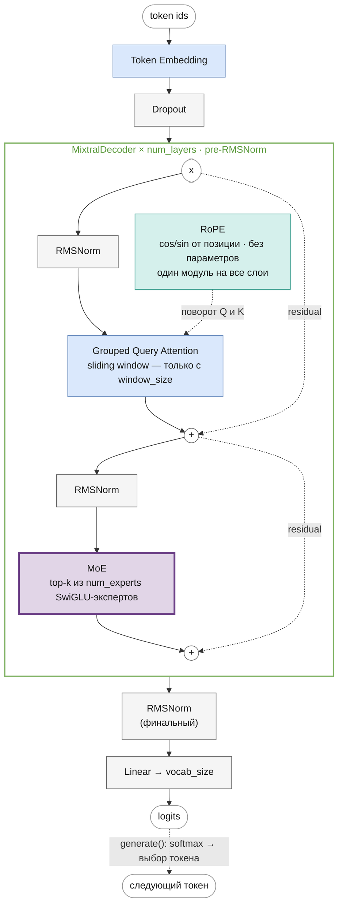
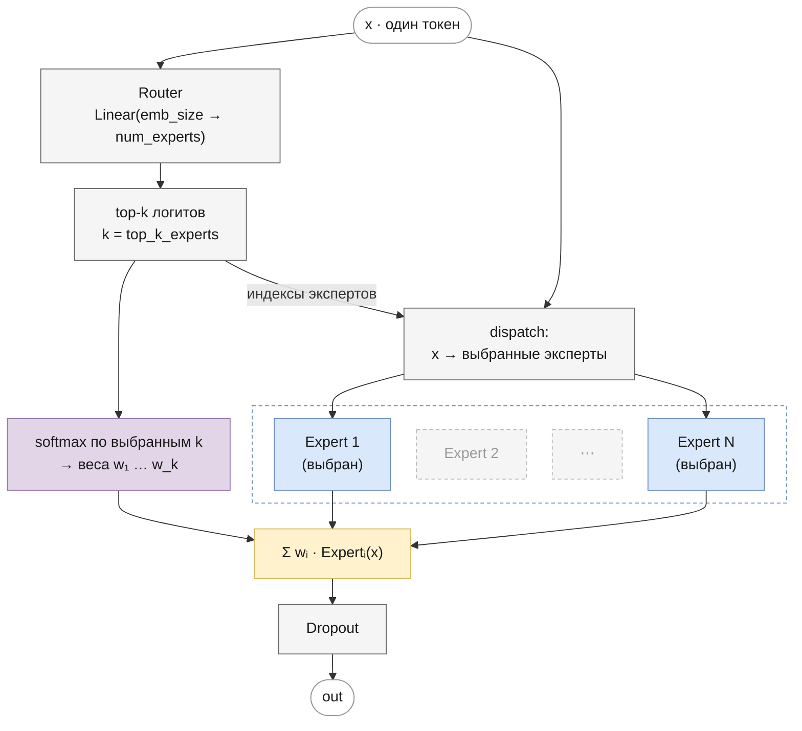

# Mixtral
<!-- description: Mixtral 8x7B (Mistral AI, 2024): Mixture-of-Experts — роутер выбирает два эксперта из восьми для каждого токена. -->

Часть II · [← Mistral](mistral.md) · [Оглавление](README.md) · [Gemma →](gemma.md)

> Реализация: [`llm/src/llm/models/mixtral/mixtral.py`](../../llm/src/llm/models/mixtral/mixtral.py) · класс `Mixtral`
> Ноутбук: [`notebooks/mixtral.ipynb`](../../notebooks/mixtral.ipynb)

Место в линейке: [GPT-1](gpt.md) → [GPT-2](gpt2.md) → [LLaMA](llama.md) → [Mistral](mistral.md) → **Mixtral** · [Gemma](gemma.md)

## Что вы узнаете

- Чем Mixtral отличается от Mistral: MoE-слой из 8 SwiGLU-экспертов с top-2 роутингом вместо плотного FFN.
- Что показала статья: качество уровня Llama 2 70B при ≈13 млрд активных параметров и отсутствие тематической специализации экспертов.
- Как записать прямой проход Mixtral в формулах и где каждая формула реализована в коде.
- Как посчитать общее и активное число параметров (46,7 и 12,9 млрд) и проверить подсчёт без выделения памяти.
- Как загрузить веса HuggingFace и в чём реализация отличается от оригинала.

## Предварительные знания

- [Mistral](mistral.md) — вся часть модели, кроме FFN.
- [Mixture-of-Experts](mixture-of-experts.md) — роутер, top-k, load-balancing loss, алгоритм dispatch/combine.
- [Feed-forward сеть и активации](feed-forward.md) — SwiGLU, из которого состоит каждый эксперт.

## Обзор

Mixtral 8x7B (Mistral AI, 2024, [arXiv:2401.04088](https://arxiv.org/abs/2401.04088)) — это [Mistral](mistral.md) с одним структурным изменением: плотный SwiGLU-FFN каждого блока заменён на слой **Mixture-of-Experts** (MoE) — 8 параллельных SwiGLU-экспертов, из которых на каждый токен работают только 2. Всё остальное — RMSNorm в pre-LN схеме, GQA, RoPE, словарь 32 000 — как у Mistral 7B.

Attention в оригинале — GQA + RoPE с плотным вниманием на весь контекст 32k: скользящее окно Mistral 7B v0.1 в Mixtral **не используется** (`sliding_window=None` в HF `MixtralConfig`). В этом репозитории Mixtral переиспользует `GroupedQueryAttention`; окно включается только ключом `window_size`, без него внимание плотное, как в оригинале.

Теория MoE — роутер, top-k, стоимость, load-balancing loss, алгоритм — подробно разобрана в главе [Mixture-of-Experts](mixture-of-experts.md). Здесь — как она применена в Mixtral и в коде репозитория.

### Научный вклад

Статья Jiang et al. (2024) описывает разреженную MoE-модель с открытыми весами (лицензия Apache 2.0), которая по качеству сопоставима с крупнейшими плотными открытыми моделями того времени:

- **Архитектура** (табл. 1 статьи): $`d = 4096`$, $`L = 32`$ слоя, $`H = 32`$ головы Q размера $`d_h = 128`$, $`G = 8`$ голов K/V, скрытый размер эксперта $`d_{ff} = 14336`$, словарь $`V = 32\,000`$, контекст 32 768 токенов, $`E = 8`$ экспертов, $`k = 2`$ на токен.
- **Разреженность.** Формула слоя — $`\mathbf{y} = \sum_{i} \mathrm{Softmax}(\mathrm{Top2}(\mathbf{x}W_g))_i \cdot \mathrm{SwiGLU}_i(\mathbf{x})`$, где $`\mathbf{x} \in \mathbb{R}^{d}`$ — вектор токена, $`W_g \in \mathbb{R}^{d \times E}`$ — матрица роутера (ниже — $`W_r`$), $`\mathrm{Top2}`$ оставляет два наибольших логита, а остальные заменяет на $`-\infty`$, $`\mathrm{SwiGLU}_i`$ — эксперт $`i`$. Каждый токен имеет доступ к 47 млрд параметров, но использует около 13 млрд — стоимость вычислений как у плотной модели на 13 млрд (проверка — в разделе [Подсчёт параметров](#подсчёт-параметров)).
- **Качество.** По результатам статьи Mixtral не уступает или превосходит Llama 2 70B и GPT-3.5 на большинстве рассмотренных бенчмарков, особенно в математике, генерации кода и многоязычных задачах, используя примерно в 5 раз меньше активных параметров, чем Llama 2 70B. Модель обучалась с контекстом 32k токенов. Вариант Mixtral 8x7B – Instruct дообучен с SFT и DPO.
- **Анализ роутинга** (разд. 5 статьи). Авторы смотрели, к каким экспертам попадают токены разных подмножеств датасета The Pile (ArXiv, PubMed, PhilPapers, Wikipedia, GitHub, DM Mathematics). Явной **тематической** специализации не обнаружилось: распределения по экспертам для статей ArXiv, биологии и философии почти одинаковы, заметно отличается лишь DM Mathematics. Зато роутер проявляет **синтаксическую** структуру: например, токен `self` в Python и слово `Question` в английском часто идут к одному и тому же эксперту, отступы в коде — к одним и тем же экспертам. Кроме того, **последовательные токены** заметно чаще, чем при случайном выборе, попадают к тем же экспертам, особенно в верхних слоях. Вывод: эксперты — не «специалисты по темам», а скорее по типам токенов и локальному контексту.

В статье нет описания load-balancing loss и capacity factor — их устройство берут из Switch Transformer и эталонных реализаций (HF `MixtralForCausalLM`); см. [ниже](#load-balancing-loss).

## Архитектура блока декодера



Как RoPE поворачивает Q и K — в разделе [Attention с RoPE](llama.md#attention-с-rope) документа LLaMA и в главе [positional-encoding.md](positional-encoding.md).

## Прямой проход в формулах

Вход — индексы токенов $`x_0, \dots, x_{T-1}`$. Обозначим $`H^{(l)} \in \mathbb{R}^{T \times d}`$ — скрытые состояния после блока $`l`$ (для одной последовательности; батч обрабатывается так же).

**Эмбеддинги** ([embeddings.md](embeddings.md)):

```math
H^{(0)} = \mathrm{Dropout}\big(E_{\text{tok}}[x_0], \dots, E_{\text{tok}}[x_{T-1}]\big)
```

где $`E_{\text{tok}} \in \mathbb{R}^{V \times d}`$ — матрица эмбеддингов, $`E_{\text{tok}}[x_t]`$ — её строка $`x_t`$. Позиционных эмбеддингов нет — позиция попадает в attention через RoPE; масштабирования на $`\sqrt{d}`$, как у [Gemma](gemma.md), тоже нет.

**Блок** $`l = 1, \dots, L`$ (pre-LN, [normalization.md](normalization.md)):

```math
\begin{aligned}
U^{(l)} &= H^{(l-1)} + \mathrm{GQA}\big(\mathrm{RMSNorm}_1(H^{(l-1)})\big), \\
H^{(l)} &= U^{(l)} + \mathrm{MoE}\big(\mathrm{RMSNorm}_2(U^{(l)})\big).
\end{aligned}
```

где $`U^{(l)} \in \mathbb{R}^{T \times d}`$ — состояние после attention-подслоя блока $`l`$, $`\mathrm{RMSNorm}_1, \mathrm{RMSNorm}_2`$ — две нормализации блока со своими весами.

**RMSNorm** применяется к каждой строке $`\mathbf{z} \in \mathbb{R}^{d}`$:

```math
\mathrm{RMSNorm}(\mathbf{z}) = \frac{\mathbf{z}}{\sqrt{\frac{1}{d}\sum_{j=1}^{d} z_j^2 + \varepsilon}} \odot \boldsymbol{\gamma}
```

где $`\boldsymbol{\gamma} \in \mathbb{R}^{d}`$ — обучаемый масштаб (инициализируется единицами, в коде — `_w`; в [normalization.md](normalization.md) он обозначен $`\mathbf{g}`$, здесь — $`\boldsymbol{\gamma}`$, чтобы не путать с логитами роутера $`\mathbf{g}`$ ниже), $`\varepsilon`$ — `rms_norm_eps` (у Mixtral 8x7B $`10^{-5}`$).

**GQA с RoPE** ([attention.md](attention.md#виды-по-числу-голов-kv-mha-gqa-mqa)). Для нормализованного входа $`X \in \mathbb{R}^{T \times d}`$, головы Q $`h = 0, \dots, H-1`$ и номера её группы K/V $`\kappa(h) = \lfloor h G / H \rfloor = \lfloor h / r \rfloor`$, $`r = H/G`$ (в [mistral.md](mistral.md#grouped-query-attention) — $`g(j)`$):

```math
\begin{aligned}
Q_h &= \mathrm{RoPE}(X W_Q^{h}), \quad K_{c} = \mathrm{RoPE}(X W_K^{c}), \quad V_{c} = X W_V^{c}, \\
O_h &= \mathrm{softmax}\Big(\frac{Q_h K_{\kappa(h)}^{\top}}{\sqrt{d_h}} + M\Big) V_{\kappa(h)}, \\
\mathrm{GQA}(X) &= [\,O_0;\, \dots;\, O_{H-1}\,]\, W_O
\end{aligned}
```

где $`c = 0, \dots, G-1`$ — номер группы K/V, $`W_Q^{h}, W_K^{c}, W_V^{c} \in \mathbb{R}^{d \times d_h}`$ — проекции головы Q и группы K/V (в коде склеены в `_q`, `_k`, `_v`), $`O_h \in \mathbb{R}^{T \times d_h}`$ — выход головы $`h`$, $`W_O \in \mathbb{R}^{H d_h \times d}`$ — выходная проекция (`_layer`), $`M \in \{0, -\infty\}^{T \times T}`$ — causal-маска ([masks.md](masks.md)); с `window_size` — ещё и скользящее окно. Четыре головы Q делят одну пару K/V при $`H = 32`$, $`G = 8`$.

**MoE** ([mixture-of-experts.md](mixture-of-experts.md)) для каждой строки $`\mathbf{u} \in \mathbb{R}^{d}`$ матрицы $`\mathrm{RMSNorm}_2(U^{(l)})`$:

```math
\begin{aligned}
\mathbf{g} &= \mathbf{u} W_r, \qquad \mathcal{S} = \mathrm{TopK}(\mathbf{g}, k), \qquad w_i = \frac{e^{g_i}}{\sum_{j \in \mathcal{S}} e^{g_j}} \;(i \in \mathcal{S}), \\
\mathrm{MoE}(\mathbf{u}) &= \sum_{i \in \mathcal{S}} w_i \Big(\mathrm{SiLU}\big(\mathbf{u} W^{(i)}_{\text{gate}}\big) \odot \mathbf{u} W^{(i)}_{\text{up}}\Big) W^{(i)}_{\text{down}}
\end{aligned}
```

где $`\mathbf{g} \in \mathbb{R}^{E}`$ — логиты роутера, $`\mathcal{S}`$ — множество $`k`$ экспертов с наибольшими логитами, $`w_i`$ — вес эксперта $`i`$ (softmax только по выбранным), $`W_r \in \mathbb{R}^{d \times E}`$ — роутер, $`W^{(i)}_{\text{gate}}, W^{(i)}_{\text{up}} \in \mathbb{R}^{d \times d_{ff}}`$, $`W^{(i)}_{\text{down}} \in \mathbb{R}^{d_{ff} \times d}`$ — веса эксперта $`i`$.

**Выход:**

```math
Z = \mathrm{RMSNorm}_f\big(H^{(L)}\big)\, W_{\text{out}}, \qquad W_{\text{out}} \in \mathbb{R}^{d \times V}
```

$`Z \in \mathbb{R}^{T \times V}`$ — логиты, $`\mathrm{RMSNorm}_f`$ — финальная нормализация, $`W_{\text{out}}`$ — отдельная матрица, не привязанная к эмбеддингам (так и в Mixtral 8x7B; bias — только при `bias: true`). Строка $`t`$ логитов — оценки следующего токена после $`x_t`$ ([language-modeling.md](language-modeling.md)).

### MoE изнутри



Кратко, что делает [`MoE.forward`](../../llm/src/llm/core/moe.py) (подробный разбор — в [mixture-of-experts.md](mixture-of-experts.md#реализация-в-репозитории)):

1. Роутер `nn.Linear(emb_size, num_experts)` выдаёт логит на каждого эксперта для каждого токена.
2. `torch.topk` выбирает `top_k_experts` экспертов; веса — softmax **только по выбранным k**, во float32.
3. Каждый эксперт — самостоятельный `SwiGLU` и обрабатывает только выбравшие его токены; невыбранный эксперт не вызывается.
4. Выход — взвешенная сумма выходов выбранных экспертов, затем dropout.

Статья записывает веса как $`\mathrm{Softmax}(\mathrm{TopK}(\mathbf{x}W_g))`$, HF — как softmax по всем экспертам → top-k → перенормировка. Это одно и то же: общий знаменатель сокращается ([доказательство](mixture-of-experts.md#эквивалентность)).

#### Алгоритм

Вместо цикла по токенам — цикл по экспертам: каждый эксперт получает все свои токены одним вызовом.

```
X = x.reshape(N, D)                          # N = batch · seq_len
topk_logits, topk_idx = topk(X @ W_r, K)     # [N, K]
W = softmax(float32(topk_logits)).to(dtype)  # [N, K]
Y = zeros(N, D)
for e in 0 … E−1:
    tok, slot = where(topk_idx == e)         # dispatch: токены эксперта e и место e в их top-k
    if tok пуст: continue
    Y.index_add_(0, tok, W[tok, slot, None] · Expert_e(X[tok]))   # combine
return dropout(Y).reshape(batch, seq_len, D)
```

Каждый токен получает ровно $`k`$ слагаемых; всего эксперты обрабатывают $`kN`$ строк — $`k/E = 1/4`$ от «все эксперты на все токены» для Mixtral. Ёмкости эксперта и отбрасывания токенов нет (dropless), как в HF `MixtralSparseMoeBlock` и эталонном `MoeLayer` Mistral. Пошаговый разбор, пример dispatch и сравнение с capacity factor Switch Transformer — в [mixture-of-experts.md](mixture-of-experts.md#алгоритм-dispatch-и-combine). Корректность проверяет тест против наивного цикла по токенам (`llm/tests/core/test_moe.py`).

#### Load-balancing loss

Без ограничений роутер схлопывается на нескольких «любимых» экспертов. При обучении к loss языковой модели прибавляется вспомогательный loss (Switch Transformer, разд. 2.2; `load_balancing_loss_func` в HF Mixtral; в статье Mixtral не описан):

```math
\mathcal{L} = \mathcal{L}_{\text{LM}} + \alpha \cdot E \sum_{s=1}^{k}\sum_{i=0}^{E-1} f_{s,i}\, P_i
```

где:
- $`f_{s,i}`$ — доля токенов, у которых эксперт $`i`$ стоит на месте $`s`$ в top-k (фактическая загрузка, недифференцируема);
- $`P_i`$ — средняя по токенам вероятность эксперта $`i`$ в softmax роутера по **всем** $`E`$ экспертам;
- $`\alpha`$ — `router_aux_loss_coef`;
- статистика собирается по всем слоям MoE и всем настоящим (не паддинговым) токенам сразу.

При равномерной загрузке вспомогательное слагаемое равно $`\alpha k`$ (для $`k = 2`$ — $`2\alpha`$), перекос его увеличивает. Градиент идёт через $`P_i`$ с «весом» загрузки: логиты перегруженных экспертов уменьшаются. Вывод, численные примеры и тонкости — в [mixture-of-experts.md](mixture-of-experts.md#коллапс-роутера-и-load-balancing-loss).

В коде: `MoE` запоминает `router_logits` последнего прохода, `load_balancing_loss` в [`core/moe.py`](../../llm/src/llm/core/moe.py) считает формулу (совпадает с HF до float), `Mixtral.auxiliary_loss()` возвращает `router_aux_loss_coef · aux`, а `Trainer` и `HFGPTAdapter` прибавляют его к loss при обучении (loss оценки — только языковой модели). По умолчанию коэффициент `0` — loss выключен, как и в HF, где он включается `output_router_logits=True` (коэффициент там по умолчанию 0.001).

## Компоненты

| Компонент | Класс | Файл |
|---|---|---|
| Токен-эмбеддинги | `TokenEmbeddings` | [`core/token_embeddings.py`](../../llm/src/llm/core/token_embeddings.py) |
| Позиционное кодирование | `RoPE` | [`core/rope.py`](../../llm/src/llm/core/rope.py) |
| Нормализация | `RMSNorm` | [`core/rms_norm.py`](../../llm/src/llm/core/rms_norm.py) |
| Attention | `GroupedQueryAttention` (тот же класс, что у [Mistral](mistral.md)) | [`core/group_query_attention.py`](../../llm/src/llm/core/group_query_attention.py) |
| FFN | `MoE` (top-k роутинг по `SwiGLU`-экспертам) | [`core/moe.py`](../../llm/src/llm/core/moe.py) |
| Блок декодера | `MixtralDecoder` (pre-LN) | [`core/mixtral_decoder.py`](../../llm/src/llm/core/mixtral_decoder.py) |
| Модель целиком | `Mixtral` | [`models/mixtral/mixtral.py`](../../llm/src/llm/models/mixtral/mixtral.py) |

## Разбор кода

### `MixtralDecoder`

[`core/mixtral_decoder.py`](../../llm/src/llm/core/mixtral_decoder.py). Конструктор создаёт четыре модуля:

| Атрибут | Модуль | Формула |
|---|---|---|
| `_heads` | `GroupedQueryAttention(num_q_heads, num_kv_heads, emb_size, head_size, max_seq_len, window_size, rope, dropout, bias)` | $`\mathrm{GQA}`$ |
| `_ff` | `MoE(emb_size, num_experts, top_k_experts, dropout, hidden_dim=intermediate_size, bias)` | $`\mathrm{MoE}`$ |
| `_norm1`, `_norm2` | `RMSNorm(emb_size, eps=norm_eps)` | $`\mathrm{RMSNorm}_1`$, $`\mathrm{RMSNorm}_2`$ |

`forward(x, use_cache=True, cache=None)` — дословно формулы блока:

```python
norm1_out = self._norm1(x)
attention, kv_caches = self._heads(norm1_out, use_cache=use_cache, cache=cache)
out = attention + x                    # U^(l) = H^(l-1) + GQA(RMSNorm1(H^(l-1)))
norm2_out = self._norm2(out)
ffn_out = self._ff(norm2_out)          # MoE(RMSNorm2(U^(l)))
# возвращает (ffn_out + out, kv_caches) при use_cache, иначе (ffn_out + out, None)
```

Та же схема, что у `MistralDecoder`, с заменой `SwiGLU` на `MoE`. Кэш слоя — тройка `(K, V, next_pos)` из `GroupedQueryAttention` ([mistral.md](mistral.md)). MoE в кэше не участвует: он применяется к каждому токену независимо, и при генерации роутер просто вызывается на новом токене.

### `Mixtral`

[`models/mixtral/mixtral.py`](../../llm/src/llm/models/mixtral/mixtral.py), наследник `BaseModel`.

`__init__(config)`:

- `resolve_head_size(config, "num_q_heads", rope=True)` — размер головы: `head_size` из конфига или `embed_dim // num_q_heads`, с проверками (для RoPE — чётный);
- читает необязательные `rms_norm_eps` (по умолчанию `1e-6`), `intermediate_size` (`None` → `4 · embed_dim` внутри SwiGLU), `bias` (`True`), `router_aux_loss_coef` (`0.0`; отрицательный — `ValueError`), `rope_theta` (`10000`), `window_size` (`None`);
- создаёт `_token_embeddings` (`TokenEmbeddings`), **один** модуль `_position_embeddings` (`RoPE`) на все слои, `_dropout`, список `_decoders` из `num_layers` блоков `MixtralDecoder`, финальную `_norm` и `_linear = nn.Linear(embed_dim, vocab_size, bias=bias)` — отдельную, без weight tying;
- инициализирует веса как HF: `init_normal_` — `Linear` (включая роутер и экспертов) и `Embedding` из $`\mathcal{N}(0, 0.02^2)`$ (ключ `initializer_range`), bias — нули.

Проверка `top_k_experts` в диапазоне `1 … num_experts` делается в конструкторе `MoE`, так что неверный конфиг падает с `ValueError` при создании модели.

`forward(x, use_cache=False, cache=None, attention_mask=None)`:

1. `check_sequence_length` — длина с учётом кэша не больше `max_position_embeddings`; `padding_from_attention_mask` — маска ключей и позиции при паддинге в любом месте строки ([masks.md](masks.md#attention_mask-и-паддинг)).
2. Запоминает `self._aux_token_mask` — плоскую маску настоящих новых токенов из `attention_mask` (для aux loss) или `None`.
3. $`H^{(0)}`$: `self._dropout(self._token_embeddings(x))`.
4. Цикл по `_decoders` с передачей кэша своего слоя и `padding`; при `use_cache` собирает новый кэш.
5. `logits = self._linear(self._norm(out))`; возвращает `(logits, new_cache)` или `(logits, None)`.

`auxiliary_loss()`:

```python
if self._router_aux_loss_coef == 0:
    return None
router_logits = [decoder._ff.router_logits for decoder in self._decoders]
loss = load_balancing_loss(router_logits, self._num_experts, self._top_k_experts, self._aux_token_mask)
return self._router_aux_loss_coef * loss
```

Метод работает с данными **последнего** прямого прохода: логиты роутера хранит каждый `MoE`, маску — модель. Поэтому его вызывают сразу после `forward` на том же батче — так делают `Trainer.train` и `HFGPTAdapter.forward` (только в режиме обучения).

## Подсчёт параметров

Без bias (как в оригинале), с отдельной выходной проекцией:

```math
\begin{aligned}
N_{\text{attn}} &= d \cdot H d_h + 2\, d \cdot G d_h + H d_h \cdot d, \\
N_{\text{exp}} &= 3\, d\, d_{ff}, \\
N_{\text{total}} &= \underbrace{V d}_{\text{эмбеддинги}} + L\big(N_{\text{attn}} + \underbrace{d E}_{\text{роутер}} + E\, N_{\text{exp}} + 2d\big) + \underbrace{d}_{\text{финальная RMSNorm}} + \underbrace{d V}_{W_{\text{out}}}, \\
N_{\text{active}} &= V d + L\big(N_{\text{attn}} + d E + k\, N_{\text{exp}} + 2d\big) + d + d V
\end{aligned}
```

где $`2d`$ в скобках — веса двух RMSNorm блока. Эмбеддинги считаются «активными» условно: из матрицы берутся только строки токенов входа.

**Mixtral 8x7B:** $`d = 4096`$, $`L = 32`$, $`H = 32`$, $`G = 8`$, $`d_h = 128`$, $`d_{ff} = 14336`$, $`E = 8`$, $`k = 2`$, $`V = 32\,000`$.

| Часть | Формула | Параметров |
|---|---|---|
| attention одного слоя | $`4096 \cdot 4096 + 2 \cdot 4096 \cdot 1024 + 4096 \cdot 4096`$ | 41 943 040 |
| роутер одного слоя | $`4096 \cdot 8`$ | 32 768 |
| один эксперт | $`3 \cdot 4096 \cdot 14336`$ | 176 160 768 |
| 8 экспертов слоя | | 1 409 286 144 |
| RMSNorm слоя | $`2 \cdot 4096`$ | 8 192 |
| **слой целиком** | | **1 451 270 144** |
| 32 слоя | | 46 440 644 608 |
| эмбеддинги + $`W_{\text{out}}`$ | $`2 \cdot 32000 \cdot 4096`$ | 262 144 000 |
| финальная RMSNorm | | 4 096 |
| **всего** | | **46 702 792 704 ≈ 46.7 млрд** |
| активных на токен | $`32 \cdot (41\,943\,040 + 32\,768 + 2 \cdot 176\,160\,768 + 8\,192) + 262\,148\,096`$ | **12 879 925 248 ≈ 12.9 млрд** |

Эксперты — 96.6% всех параметров ($`45\,097\,156\,608`$), attention — 2.9%, роутеры всех слоёв вместе — около миллиона. Результат совпадает с «47B всего, 13B активных» из статьи. Проверка на коде репозитория без выделения памяти — модель создаётся на `meta`-устройстве:

```python
import torch
from llm.models.mixtral import Mixtral

with torch.device("meta"):
    model = Mixtral({"vocab_size": 32000, "embed_dim": 4096, "num_q_heads": 32, "num_kv_heads": 8,
                     "head_size": 128, "num_layers": 32, "max_position_embeddings": 32768,
                     "num_experts": 8, "top_k_experts": 2, "dropout": 0.0, "intermediate_size": 14336,
                     "bias": False, "rope_theta": 1e6, "rms_norm_eps": 1e-5})
total = sum(p.numel() for p in model.parameters())
one_expert = sum(p.numel() for p in model._decoders[0]._ff._experts[0].parameters())
experts = sum(p.numel() for n, p in model.named_parameters() if "_experts" in n)
print(total)                                   # 46702792704
print(total - experts + 32 * 2 * one_expert)   # 12879925248
```

**Учебный конфиг** [`mixtral_train.json`](../../experiments/llm_only/configs/mixtral_train.json): $`V = 1000`$ (BPE-словарь), $`d = 256`$, $`H = 4`$, $`G = 2`$, $`d_h = 64`$, $`L = 4`$, $`E = 8`$, $`k = 2`$, $`d_{ff} = 4d = 1024`$, bias включён. С bias каждый `Linear` получает ещё $`d_{out}`$ параметров:

| Часть | Параметров |
|---|---|
| attention слоя: $`(256 \cdot 256 + 256) \cdot 2 + (256 \cdot 128 + 128) \cdot 2`$ | 197 376 |
| роутер слоя: $`256 \cdot 8 + 8`$ | 2 056 |
| эксперт: $`2(256 \cdot 1024 + 1024) + (1024 \cdot 256 + 256)`$ | 788 736 |
| слой: $`197\,376 + 2\,056 + 8 \cdot 788\,736 + 512`$ | 6 509 832 |
| эмбеддинги $`1000 \cdot 256`$ + выход $`256 \cdot 1000 + 1000`$ + финальная норма 256 | 513 256 |
| **всего** $`4 \cdot 6\,509\,832 + 513\,256`$ | **26 552 584** |
| активных: всего $`- 4 \cdot 6 \cdot 788\,736`$ | 7 622 920 |

## Конфигурация

Пример из [`experiments/llm_only/configs/mixtral_train.json`](../../experiments/llm_only/configs/mixtral_train.json) — все ключи используются `Mixtral.__init__`; неверные сочетания (как у [Mistral](mistral.md#конфигурация), а также `top_k_experts` вне `1 … num_experts`) дают `ValueError` в конструкторе:

| Параметр | Значение в примере | Смысл |
|---|---|---|
| `vocab_size` | (из токенизатора) | размер словаря |
| `embed_dim` | 256 | размерность эмбеддингов |
| `num_q_heads` | 4 | число Query-голов |
| `num_kv_heads` | 2 | число Key/Value-голов |
| `head_size` | 64 | необязательный размер головы; по умолчанию `embed_dim // num_q_heads` (тогда `embed_dim` обязан делиться на `num_q_heads`). Если задан, `num_q_heads · head_size` может не совпадать с `embed_dim`; для RoPE — чётный |
| `num_layers` | 4 | число блоков `MixtralDecoder` |
| `max_position_embeddings` | 512 | максимальная длина последовательности |
| `rms_norm_eps` | (нет в примере) | необязательный `eps` всех RMSNorm, по умолчанию `1e-6`; у Mixtral 8x7B — `1e-5` |
| `rope_theta` | (нет в примере) | необязательная база частот RoPE, по умолчанию `10000`; у Mixtral 8x7B — `1e6` (медленнее вращение, рассчитано на контекст 32k, см. [llama.md](llama.md#скорости-вращения-и-база-rope_theta)) |
| `initializer_range` | (нет в примере) | необязательное стандартное отклонение начальных весов `Linear` и `Embedding`, по умолчанию `0.02` — как в HF; см. [training.md](training.md#какие-модели-что-используют) |
| `router_aux_loss_coef` | (нет в примере) | необязательный коэффициент [load-balancing loss](#load-balancing-loss) роутера, по умолчанию `0` — выключен; в HF при включении — `0.001` |
| `num_experts` | 8 | общее число экспертов MoE на слой |
| `top_k_experts` | 2 | сколько экспертов активируется на токен |
| `window_size` | (нет в примере) | необязательная ширина скользящего окна внимания, как в [Mistral](mistral.md#ширина-окна-w--1); без ключа окна нет — как в Mixtral 8x7B |
| `intermediate_size` | (нет в примере) | необязательный скрытый размер каждого эксперта SwiGLU, по умолчанию `4 · embed_dim`; у Mixtral 8x7B — `14336` |
| `bias` | (нет в примере) | необязательный: bias во всех `Linear`, включая роутер и экспертов, по умолчанию `true`; в Mixtral 8x7B — `false` |
| `dropout` | 0.1 | dropout после эмбеддингов, в attention и на выходе MoE (эксперты без собственного); в Mixtral 8x7B dropout нет — для соответствия оригиналу `0` |

## Загрузка весов HuggingFace

С ключами `intermediate_size` и `"bias": false` загружаются веса `MixtralForCausalLM` — той же функцией `convert_hf_state_dict`, что у [LLaMA](llama.md#загрузка-весов-huggingface) (реэкспорт в `llm.models.mixtral`); строки `q_proj` переставляются по `num_attention_heads`, `k_proj` — по `num_key_value_heads`; роутер `block_sparse_moe.gate` становится `_ff._router`, эксперты `w1`/`w3`/`w2` — `_gate`/`_up`/`_down`.

```python
from transformers import MixtralForCausalLM
from llm.models.mixtral import Mixtral, convert_hf_state_dict

hf = MixtralForCausalLM.from_pretrained(...)
c = hf.config
config = {"vocab_size": c.vocab_size, "embed_dim": c.hidden_size, "num_q_heads": c.num_attention_heads,
          "num_kv_heads": c.num_key_value_heads, "head_size": c.head_dim or c.hidden_size // c.num_attention_heads,
          "num_layers": c.num_hidden_layers, "max_position_embeddings": c.max_position_embeddings,
          "num_experts": c.num_local_experts, "top_k_experts": c.num_experts_per_tok,
          "dropout": 0.0, "rms_norm_eps": c.rms_norm_eps, "rope_theta": c.rope_theta,
          "intermediate_size": c.intermediate_size, "bias": False}
if c.sliding_window is not None:
    config["window_size"] = c.sliding_window - 1  # окно здесь на позицию шире, см. «Ширина окна: W + 1»
model = Mixtral(config)
model.load_state_dict(convert_hf_state_dict(hf.state_dict(), num_heads=c.num_attention_heads,
                                            num_kv_heads=c.num_key_value_heads))
```

Роутер переносится без изменений: HF считает softmax по всем экспертам и перенормирует top-k, здесь — softmax по top-k логитам; веса совпадают ([доказательство](mixture-of-experts.md#эквивалентность)).

Сверено со случайными `MixtralForCausalLM` из `transformers` (GQA, 4 эксперта, top-2, без окна): логиты совпадают до ~1e-5, greedy-генерация с KV-кэшем дольше окна — токен в токен (`llm/tests/models/test_mistral_mixtral_hf_parity.py`). Настоящие веса (Mixtral 8x7B — около 90 ГБ) для проверки слишком велики.

## Отличия от оригинала

Реализация учебная и сознательно маленькая, но часть отличий от оригинала меняет поведение модели. Подробности, воспроизведение и варианты исправления — в [бэклоге](../dev/backlog.md#mixtral) (номера пунктов в скобках).

| | Mixtral 8x7B | Здесь |
|---|---|---|
| Внимание | плотное на весь контекст 32k | так же без ключа `window_size`; с ним — скользящее окно, как в Mistral 7B v0.1 (52) |
| База RoPE (`rope_theta`) | 1 000 000 | 10 000 по умолчанию, задаётся ключом `rope_theta` (53) |
| Скрытый слой эксперта | `hidden_dim = 14336` при `dim = 4096` (3.5·d) | 4·d по умолчанию; `intermediate_size: 14336` — как в оригинале (23, 30) |
| Bias | нет ни в одной проекции, включая роутер | во всех `Linear`, включая роутер, по умолчанию; `bias: false` — как в оригинале (24, 40) |
| Load-balancing loss | в HF-реализации при обучении (`output_router_logits=True`) | есть, ключ `router_aux_loss_coef`, по умолчанию выключен (37) |
| Dropout | нет | после эмбеддингов, в attention и один на выходе MoE (эксперты без собственного, 38); `dropout: 0` убирает его полностью |
| Softmax роутера | во float32 (HF, эталон Mistral) | так же, явно во float32 с приведением к dtype входа (54) |

## Генерация

`Mixtral.generate(...)` — унифицированная сигнатура (см. [gpt.md](gpt.md#генерация) и [generation.md](generation.md)). На каждом шаге генерации с KV-кэшем роутер каждого слоя вызывается на одном новом токене, и работают только его $`k`$ экспертов. Load-balancing loss при генерации не нужен: `auxiliary_loss()` вызывают только при обучении.

## Типичные ошибки и тонкости

- **Свой цикл обучения без `auxiliary_loss()`.** `Trainer` сам прибавляет load-balancing loss к loss языковой модели; в своём цикле его нужно прибавить вручную, иначе `router_aux_loss_coef` ни на что не влияет.
- **Обучение с `router_aux_loss_coef = 0`.** Это значение по умолчанию: ничто не мешает роутеру отправлять почти все токены к одним и тем же экспертам, и остальные перестают обучаться (см. [mixture-of-experts.md](mixture-of-experts.md)).
- **`rope_theta` по умолчанию при загрузке весов.** У Mixtral 8x7B база RoPE — $`10^6`$, а по умолчанию здесь `10000`: формы совпадут, ошибки не будет, но логиты разойдутся. Берите `c.rope_theta` из конфига HF.
- **Окно «как у Mistral».** У Mixtral 8x7B скользящего окна нет; если задать `window_size`, внимание будет отличаться от оригинала.
- **Память и вычисления.** На токен работают 2 эксперта из 8, но в памяти должны лежать все: 46,7 млрд параметров при 12,9 млрд активных.
- **`top_k_experts` вне `1 … num_experts`.** Конструктор бросает `ValueError`.

## Что изменилось в Gemma

- Mixture-of-Experts → снова **плотный FFN**, но **GeGLU** вместо SwiGLU;
- GQA → **Multi-Query Attention** в модели 2B (одна голова K/V на все головы Q); у 7B — обычный MHA;
- словарь 32 000 → **256 000** токенов, эмбеддинги и выходная проекция — одна матрица;
- эмбеддинги умножаются на $`\sqrt{d}`$, вес RMSNorm хранится как добавка к единице, $`(1 + w)`$;
- RoPE и RMSNorm в pre-LN схеме остаются.

Подробности — в [gemma.md](gemma.md).

## Итоги

- Mixtral 8x7B — это Mistral 7B, в котором каждый FFN заменён MoE-слоем: $`E = 8`$ SwiGLU-экспертов, на токен работают $`k = 2`$ с весами softmax по двум лучшим логитам роутера.
- Параметров 46,7 млрд, но на токен используется 12,9 млрд: вычисления как у плотной модели на 13 млрд, память — как у модели на 47 млрд.
- В оригинале внимание плотное на контекст 32k (без скользящего окна), `rope_theta = 1e6`; в библиотеке окно включается только ключом `window_size`.
- Load-balancing loss в статье не описан; здесь он включается `router_aux_loss_coef`, как в HF.
- Роутер переносится из HF без изменений: softmax по top-k логитам и перенормировка softmax по всем экспертам дают одинаковые веса.

## Вопросы и упражнения

1. Почему Mixtral 8x7B содержит около 47, а не $`8 \cdot 7 = 56`$ млрд параметров? Какая часть Mistral 7B «размножена» восемь раз?

   <details><summary>Ответ</summary>

   Размножен только FFN каждого слоя: 8 экспертов по $`3 \cdot 4096 \cdot 14336 \approx 176`$ млн. Attention (≈42 млн на слой), нормализации, эмбеддинги и выходная проекция общие и есть в одном экземпляре. Mistral 7B с теми же размерами содержит ≈7.24 млрд параметров, из них FFN — $`32 \cdot 176.2`$ млн ≈ 5.64 млрд, остальное ≈1.60 млрд. Восемь копий Mistral дали бы ≈57.9 млрд, но не-FFN часть не копируется 7 лишних раз: $`57.9 - 7 \cdot 1.60 \approx 46.7`$ млрд (плюс ≈1 млн параметров роутеров).

   </details>

2. Сколько параметров добавилось бы к Mixtral 8x7B при $`E = 16`$ экспертах (остальное прежнее)? Как изменилось бы число активных параметров при $`k = 2`$?

   <details><summary>Ответ</summary>

   Добавляется $`32 \cdot 8 \cdot 176\,160\,768 = 45\,097\,156\,608`$ параметров экспертов и $`32 \cdot 4096 \cdot 8 = 1\,048\,576`$ параметров роутеров: всего $`\approx 91.8`$ млрд. Активных — почти столько же, $`12\,879\,925\,248 + 1\,048\,576 \approx 12.88`$ млрд: выросли только роутеры.

   </details>

3. Посчитайте долю FLOPs FFN-части одного слоя Mixtral 8x7B от FLOPs всего слоя без квадратичной части attention (на токен, $`\approx 2 \times`$ число активных параметров слоя).

   <details><summary>Ответ</summary>

   Активные параметры слоя: attention 41 943 040, роутер 32 768, два эксперта 352 321 536 (нормализации пренебрежимы). Доля FFN: $`352.3 / (41.9 + 0.03 + 352.3) \approx 0.894`$ — около 89%.

   </details>

4. В каком порядке в `MixtralDecoder.forward` применяются нормализации и residual-связи? Запишите блок формулами и укажите, какая строка кода реализует каждую.

   <details><summary>Ответ</summary>

   $`U = H + \mathrm{GQA}(\mathrm{RMSNorm}_1(H))`$ — строки `norm1_out = self._norm1(x)`, `attention, kv_caches = self._heads(...)`, `out = attention + x`. $`H' = U + \mathrm{MoE}(\mathrm{RMSNorm}_2(U))`$ — `norm2_out = self._norm2(out)`, `ffn_out = self._ff(norm2_out)`, возврат `ffn_out + out`.

   </details>

5. Модель создана с `router_aux_loss_coef: 0.01`. Вы вызываете `model(ids_a)`, затем `model(ids_b)`, затем `model.auxiliary_loss()`. Для какого батча посчитан loss? Почему `Trainer` вызывает `auxiliary_loss()` сразу после `forward`?

   <details><summary>Ответ</summary>

   Для `ids_b`: каждый `MoE` перезаписывает `self.router_logits` при каждом проходе, модель — `_aux_token_mask`. `Trainer` вызывает `auxiliary_loss()` сразу после `forward` того же батча, чтобы loss относился к нему и градиент прошёл по графу этого прохода.

   </details>

6. Почему MoE не участвует в KV-кэше, а attention — участвует?

   <details><summary>Ответ</summary>

   Attention нового токена смотрит на ключи и значения всех прошлых позиций — их и хранят в кэше. MoE, как и любой FFN, применяется к каждой позиции независимо: выход для нового токена зависит только от его собственного вектора, прошлые позиции не нужны.

   </details>

7. (Код.) Создайте Mixtral 8x7B на `meta`-устройстве (пример в разделе [Подсчёт параметров](#подсчёт-параметров)) и посчитайте, какую долю параметров составляет attention. Затем повторите с `num_kv_heads: 32` (MHA вместо GQA). На сколько выросла модель?

   <details><summary>Ответ</summary>

   С GQA attention — $`32 \cdot 41\,943\,040 = 1\,342\,177\,280`$, около 2.9%. С MHA K и V становятся $`4096 \times 4096`$: attention слоя $`4 \cdot 4096^2 = 67\,108\,864`$, прирост $`32 \cdot (67\,108\,864 - 41\,943\,040) = 805\,306\,368`$ — около 0.8 млрд, всего ≈47.5 млрд.

   </details>

8. (Ноутбук.) В [`notebooks/mixtral.ipynb`](../../notebooks/mixtral.ipynb) обучите модель и после обучения посмотрите, как токены распределяются по экспертам в разных слоях (`decoder._ff.router_logits`). Видна ли «синтаксическая» специализация, о которой пишут авторы статьи, — например, одинаковые эксперты для знаков препинания?

## Литература

Основная статья:

- Jiang et al. *Mixtral of Experts*. 2024. [arXiv:2401.04088](https://arxiv.org/abs/2401.04088)

Компоненты:

- Shazeer et al. *Outrageously Large Neural Networks: The Sparsely-Gated Mixture-of-Experts Layer*. 2017. [arXiv:1701.06538](https://arxiv.org/abs/1701.06538)
- Fedus, Zoph, Shazeer. *Switch Transformers: Scaling to Trillion Parameter Models with Simple and Efficient Sparsity*. 2021. [arXiv:2101.03961](https://arxiv.org/abs/2101.03961) — load-balancing loss для роутера
- Jiang et al. *Mistral 7B*. 2023. [arXiv:2310.06825](https://arxiv.org/abs/2310.06825)
- Ainslie et al. *GQA: Training Generalized Multi-Query Transformer Models from Multi-Head Checkpoints*. 2023. [arXiv:2305.13245](https://arxiv.org/abs/2305.13245)
- Shazeer. *GLU Variants Improve Transformer*. 2020. [arXiv:2002.05202](https://arxiv.org/abs/2002.05202) — SwiGLU
- Su et al. *RoFormer: Enhanced Transformer with Rotary Position Embedding*. 2021. [arXiv:2104.09864](https://arxiv.org/abs/2104.09864)
- Zhang, Sennrich. *Root Mean Square Layer Normalization*. 2019. [arXiv:1910.07467](https://arxiv.org/abs/1910.07467)
- Beltagy, Peters, Cohan. *Longformer: The Long-Document Transformer*. 2020. [arXiv:2004.05150](https://arxiv.org/abs/2004.05150) — sliding window attention (в Mistral 7B; в Mixtral 8x7B не используется)
