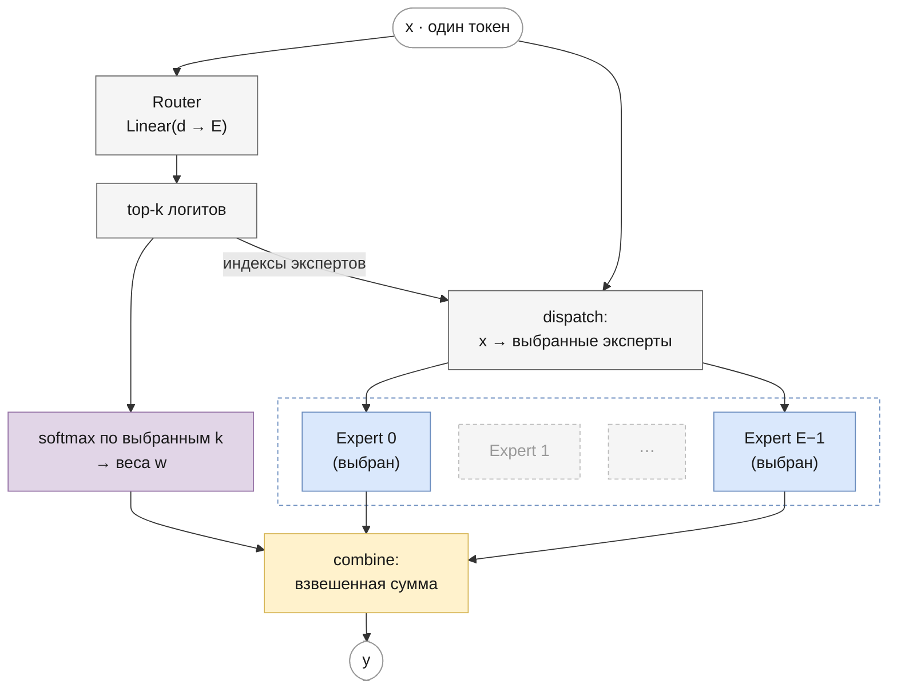

# Mixture-of-Experts
<!-- description: Mixture-of-Experts: роутер, выбор top-k экспертов, разреженные вычисления и load-balancing loss. -->

Часть I · [← Feed-forward сеть](feed-forward.md) · [Оглавление](README.md) · [Обучение →](training.md)

> Реализация: [`llm/src/llm/core/moe.py`](../../llm/src/llm/core/moe.py) · класс `MoE`, функция `load_balancing_loss`
> Где используется: [Mixtral](mixtral.md)

## Что вы узнаете

- Что такое **условные вычисления** (conditional computation) и почему смесь экспертов позволяет увеличить число параметров модели почти без роста стоимости одного токена.
- Как устроен слой **Mixture-of-Experts** (MoE): роутер, выбор top-k экспертов, взвешенная сумма их выходов.
- Почему «softmax по выбранным k» (Mixtral) и «softmax по всем, затем перенормировка» (HuggingFace) — одно и то же, с доказательством.
- Как считать общее и активное число параметров и FLOPs слоя MoE.
- Что такое коллапс роутера, как с ним борется **load-balancing loss** и почему его градиент идёт через вероятности, а не через доли токенов.
- Как MoE реализован в этом репозитории: алгоритм dispatch/combine циклом по экспертам, softmax роутера во float32, вспомогательный loss в `Trainer`.

## Предварительные знания

- Feed-forward сеть и SwiGLU — [feed-forward.md](feed-forward.md): каждый эксперт в этой главе — обычный SwiGLU-блок.
- Softmax и его производная — [notation.md](notation.md).
- Блок декодера и residual-связи — [language-modeling.md](language-modeling.md).
- Функция потерь и градиентный спуск — [training.md](training.md) (достаточно общего представления).

## Зачем условные вычисления

В плотном (dense) трансформере каждый токен проходит через **все** параметры каждого слоя. Стоимость прямого прохода на один токен поэтому пропорциональна числу параметров: грубо, $`\approx 2N_{\text{par}}`$ операций с плавающей точкой (FLOPs) на токен для модели с $`N_{\text{par}}`$ параметрами (одно умножение и одно сложение на каждый вес матрицы). Хотите модель в 8 раз больше — платите в 8 раз больше за каждый токен и при обучении, и при генерации.

Большая часть параметров трансформера сосредоточена в feed-forward сетях (FFN). У модели с $`d = 4096`$ и SwiGLU со скрытым размером $`d_{ff} = 14336`$ FFN одного слоя содержит $`3 \cdot 4096 \cdot 14336 \approx 176`$ млн параметров, а attention с GQA — около 42 млн (см. подсчёт в [mixtral.md](mixtral.md#подсчёт-параметров)).

**Условные вычисления** (conditional computation) разрывают связь «параметры = стоимость»: сеть содержит много параметров, но для каждого входа включается только их часть, выбранная в зависимости от самого входа. **Mixture-of-Experts** (смесь экспертов) — самый успешный способ сделать это в трансформерах: вместо одного FFN слой содержит $`E`$ параллельных FFN — **экспертов** (experts), — а маленькая сеть-**роутер** (router, gating network) для каждого токена выбирает, к каким $`k \ll E`$ из них его отправить.

Интуиция: разные токены требуют разной «обработки» — код, математика, разговорная речь, служебные слова. Один большой FFN должен уметь всё сразу; набор экспертов позволяет разделить эту работу, и каждый токен платит только за тех, кто его действительно обрабатывает.

## История: от смеси экспертов к разреженным трансформерам

- **1991 — смесь экспертов.** Jacobs, Jordan, Nowlan, Hinton, *Adaptive Mixtures of Local Experts* (Neural Computation, 3(1), 1991). Несколько сетей-экспертов и gating-сеть, которая выдаёт softmax-распределение по экспертам; выход — взвешенная сумма выходов **всех** экспертов. Идея — разделение задачи между специалистами; вычисления ещё плотные: считаются все эксперты.
- **2017 — разреженный MoE-слой.** Shazeer et al., *Outrageously Large Neural Networks: The Sparsely-Gated Mixture-of-Experts Layer* ([arXiv:1701.06538](https://arxiv.org/abs/1701.06538)). Gating становится **разреженным**: оставляются только $`k`$ наибольших значений (noisy top-k gating — к логитам роутера добавляется гауссов шум, амплитуда которого тоже вычисляется обучаемым слоем), остальные эксперты не вычисляются вовсе. MoE-слой вставлялся между слоями LSTM; модели достигали 137 млрд параметров. Для равномерной загрузки экспертов предложены вспомогательные потери (importance loss и load loss).
- **2020 — GShard.** Lepikhin et al., *GShard: Scaling Giant Models with Conditional Computation and Automatic Sharding* ([arXiv:2006.16668](https://arxiv.org/abs/2006.16668)). MoE-слой заменяет FFN в каждом втором блоке трансформера; top-2 роутинг, ограниченная **ёмкость эксперта** (expert capacity), вспомогательный loss балансировки и распределение экспертов по тысячам устройств.
- **2021 — Switch Transformer.** Fedus, Zoph, Shazeer, *Switch Transformers: Scaling to Trillion Parameter Models with Simple and Efficient Sparsity* ([arXiv:2101.03961](https://arxiv.org/abs/2101.03961)). Упрощение до $`k = 1`$ (каждый токен — ровно к одному эксперту), простая дифференцируемая формула load-balancing loss (разд. 2.2), capacity factor, вычисления роутера во float32 (разд. 2.4, «selective precision»).
- **2024 — Mixtral 8x7B.** Jiang et al., *Mixtral of Experts* ([arXiv:2401.04088](https://arxiv.org/abs/2401.04088)). Каждый FFN [Mistral 7B](mistral.md) заменён на 8 SwiGLU-экспертов с top-2 роутингом; все токены обрабатываются (без отбрасывания). Подробно — в [mixtral.md](mixtral.md).

## Слой MoE: определение

Пусть $`\mathbf{x} \in \mathbb{R}^{d}`$ — вектор одного токена на входе FFN-подслоя (после нормализации). Слой MoE вычисляет

```math
\mathbf{y} = \sum_{i \in \mathcal{S}(\mathbf{x})} w_i(\mathbf{x}) \cdot \mathrm{Expert}_i(\mathbf{x}),
\qquad
\mathcal{S}(\mathbf{x}) = \mathrm{TopK}\big(\mathbf{g}(\mathbf{x}),\, k\big),
\qquad
\mathbf{g}(\mathbf{x}) = \mathbf{x} W_r
```

где:
- $`\mathbf{y} \in \mathbb{R}^{d}`$ — выход слоя для этого токена (той же размерности, что вход, — он прибавляется к residual-потоку);
- $`E`$ — число экспертов, $`k`$ — сколько из них выбирается на токен ($`1 \le k \le E`$);
- $`W_r \in \mathbb{R}^{d \times E}`$ — матрица **роутера**; $`\mathbf{g}(\mathbf{x}) \in \mathbb{R}^{E}`$ — **логиты роутера** (router logits), по одному числу на эксперта;
- $`\mathcal{S}(\mathbf{x}) \subset \{0, \dots, E-1\}`$ — множество индексов $`k`$ экспертов с наибольшими логитами;
- $`w_i(\mathbf{x}) \ge 0`$ — **вес** (gate) эксперта $`i`$, $`\sum_{i \in \mathcal{S}} w_i = 1`$; как именно он считается — в следующем разделе;
- $`\mathrm{Expert}_i : \mathbb{R}^{d} \to \mathbb{R}^{d}`$ — $`i`$-я FFN-сеть. В Mixtral и в этом репозитории это SwiGLU ([feed-forward.md](feed-forward.md)):

```math
\mathrm{Expert}_i(\mathbf{x}) = \Big(\mathrm{SiLU}\big(\mathbf{x} W^{(i)}_{\text{gate}}\big) \odot \mathbf{x} W^{(i)}_{\text{up}}\Big) W^{(i)}_{\text{down}}
```

где $`W^{(i)}_{\text{gate}}, W^{(i)}_{\text{up}} \in \mathbb{R}^{d \times d_{ff}}`$, $`W^{(i)}_{\text{down}} \in \mathbb{R}^{d_{ff} \times d}`$ — собственные веса эксперта $`i`$; $`\odot`$ — поэлементное произведение.

Всё это применяется **независимо к каждому токену**: роутер смотрит только на вектор этого токена, соседние позиции не участвуют. Для матрицы $`X \in \mathbb{R}^{N \times d}`$ из $`N = B \cdot T`$ токенов (далее в главе $`N`$ без индекса — всегда число токенов; число параметров обозначается $`N`$ с индексом, например $`N_{\text{exp}}`$) слой — это $`N`$ независимых вычислений по формуле выше, и разные токены одного предложения могут попасть к разным экспертам.

Интуиция: если $`k = E`$ и веса считаются softmax-ом по всем экспертам, получается «плотная» смесь 1991 года — дорого, но гладко. Если $`k = 1`$, каждый токен целиком отдаётся одному эксперту — дёшево, но выбор жёсткий. Mixtral берёт $`E = 8`$, $`k = 2`$: каждый токен смешивает мнения двух специалистов из восьми.

## Роутер

Роутер — один линейный слой $`\mathbf{g} = \mathbf{x} W_r`$ (в оригинале без bias). Логит $`g_i`$ — это скалярное произведение вектора токена со столбцом $`i`$ матрицы $`W_r`$: столбец можно понимать как «обучаемый ключ» эксперта $`i`$, и токен идёт к экспертам, чьи ключи на него больше похожи.

Роутер очень дешёвый: $`d \cdot E`$ параметров (для Mixtral $`4096 \cdot 8 = 32\,768`$ на слой — в пять тысяч раз меньше одного эксперта). Обучается он вместе со всей сетью обычным градиентным спуском — отдельной разметки «какой эксперт для чего» нет.

В коде: `self._router = nn.Linear(emb_size, num_experts, bias=bias)` в `MoE.__init__`, вызов `router_logits = self._router(x_flat)` в `MoE.forward` ([`core/moe.py`](../../llm/src/llm/core/moe.py)).

## Top-k gating

### Две записи весов

Встречаются две записи одного и того же правила.

**Форма A — softmax по выбранным k** (статья Mixtral, эталонный код Mistral, этот репозиторий):

```math
w_i = \frac{e^{g_i}}{\sum_{j \in \mathcal{S}} e^{g_j}}, \qquad i \in \mathcal{S}
```

В статье Mixtral это записано как $`\mathrm{Softmax}(\mathrm{Top2}(\mathbf{x} W_g))`$, где $`\mathrm{TopK}`$ оставляет $`k`$ наибольших логитов, а остальные заменяет на $`-\infty`$ (после экспоненты они дают ноль).

**Форма B — softmax по всем, затем перенормировка** (HuggingFace `MixtralSparseMoeBlock`):

```math
p_i = \frac{e^{g_i}}{\sum_{j=0}^{E-1} e^{g_j}}, \qquad
w_i = \frac{p_i}{\sum_{j \in \mathcal{S}} p_j}, \qquad i \in \mathcal{S}
```

где $`\mathbf{p} \in \mathbb{R}^{E}`$ — распределение роутера по **всем** экспертам, а $`\mathcal{S}`$ в форме B выбирается как top-k по $`\mathbf{p}`$, а не по $`\mathbf{g}`$.

### Эквивалентность

**Утверждение.** Формы A и B выбирают одно и то же множество $`\mathcal{S}`$ и дают одинаковые веса $`w_i`$.

<details><summary>Доказательство</summary>

Шаг 1 — одинаковое множество. Обозначим $`Z = \sum_{j=0}^{E-1} e^{g_j} > 0`$. Тогда $`p_i = e^{g_i} / Z`$. Функция $`t \mapsto e^{t}/Z`$ строго возрастает, поэтому

```math
g_i > g_j \iff p_i > p_j .
```

Порядок экспертов по $`\mathbf{p}`$ совпадает с порядком по $`\mathbf{g}`$, и $`k`$ наибольших элементов у них одни и те же (при точных вычислениях; о совпадающих значениях — в «Тонкостях»).

Шаг 2 — одинаковые веса. Подставим $`p_i = e^{g_i}/Z`$ в форму B:

```math
w_i^{B} = \frac{p_i}{\sum_{j \in \mathcal{S}} p_j}
= \frac{e^{g_i}/Z}{\sum_{j \in \mathcal{S}} e^{g_j}/Z}
= \frac{e^{g_i}/Z}{\big(\sum_{j \in \mathcal{S}} e^{g_j}\big)/Z}
= \frac{e^{g_i}}{\sum_{j \in \mathcal{S}} e^{g_j}}
= w_i^{A}.
```

Общий знаменатель $`Z`$ — сумма по невыбранным экспертам в том числе — сокращается. ∎

</details>

Интуиция: softmax задаёт веса с точностью до общего множителя; перенормировка выбрасывает этот множитель. Поэтому неважно, считали ли вы экспоненты невыбранных экспертов: в веса они не попадают.

Эквивалентность нужна на практике: веса HF Mixtral загружаются в модель этого репозитория без изменений роутера, и выходы совпадают (тест `llm/tests/models/test_mistral_mixtral_hf_parity.py`). Для load-balancing loss (ниже) всё же нужно полное распределение $`\mathbf{p}`$ по всем $`E`$ экспертам — форма B естественна там.

Не путайте с вариантом **без перенормировки**, $`w_i = p_i`$ (Switch Transformer при $`k = 1`$ и часть других моделей; в GShard веса двух выбранных экспертов, наоборот, перенормируются): там сумма весов меньше 1, и выход слоя по норме меньше. Это другая модель, и веса между этими вариантами не переносятся.

### Численный пример: E = 4, k = 2

Логиты роутера для одного токена: $`\mathbf{g} = (2.0,\; 1.0,\; 0.5,\; -1.0)`$.

Top-2 — эксперты 0 и 1. Форма A:

```math
w_0 = \frac{e^{2}}{e^{2} + e^{1}} = \frac{7.389}{7.389 + 2.718} = \frac{7.389}{10.107} = 0.7311,
\qquad
w_1 = \frac{2.718}{10.107} = 0.2689 .
```

Форма B: $`Z = e^{2} + e^{1} + e^{0.5} + e^{-1} = 7.389 + 2.718 + 1.649 + 0.368 = 12.124`$, откуда

```
p = (0.6095, 0.2242, 0.1360, 0.0303)          сумма = 1
p_0 + p_1 = 0.8337
w_0 = 0.6095 / 0.8337 = 0.7311
w_1 = 0.2242 / 0.8337 = 0.2689
```

— те же веса. Пусть эксперты на этом токене выдают $`\mathrm{Expert}_0(\mathbf{x}) = (1,\, 0)`$ и $`\mathrm{Expert}_1(\mathbf{x}) = (0,\, 2)`$ (здесь $`d = 2`$). Тогда

```math
\mathbf{y} = 0.7311 \cdot (1, 0) + 0.2689 \cdot (0, 2) = (0.7311,\; 0.5378).
```

Эксперты 2 и 3 для этого токена не вычисляются вовсе. Проверка на коде репозитория:

```python
import torch
from llm.core.moe import MoE

torch.manual_seed(0)
moe = MoE(emb_size=2, num_experts=4, top_k_experts=2, dropout=0.0, bias=False)
with torch.no_grad():
    # логиты роутера для x = (1, 0) — первый столбец матрицы роутера
    moe._router.weight[:] = torch.tensor([[2.0, 0.0], [1.0, 0.0], [0.5, 0.0], [-1.0, 0.0]])

x = torch.tensor([[[1.0, 0.0]]])                 # [B=1, T=1, d=2]
y = moe(x)
print(moe.router_logits)                         # tensor([[ 2.0000,  1.0000,  0.5000, -1.0000]], ...)
e0, e1 = moe._experts[0](x), moe._experts[1](x)
print(torch.allclose(y, 0.7311 * e0 + 0.2689 * e1, atol=1e-4))   # True
```

(`nn.Linear` хранит матрицу транспонированной, `weight` имеет форму `[E, d]`, поэтому логиты задаются строками.)

### Как через top-k проходит градиент

$`\mathrm{TopK}`$ — выбор индексов, у него нет производной. Градиент loss языковой модели доходит до роутера только через веса $`w_i`$ выбранных экспертов:

```math
\frac{\partial w_i}{\partial g_j} = w_i\,(\delta_{ij} - w_j), \qquad i, j \in \mathcal{S},
```

где $`\delta_{ij}`$ — символ Кронекера (1 при $`i = j`$, иначе 0). Роутер учится **перераспределять вес между уже выбранными** экспертами: если эксперт 0 дал более полезный выход, чем эксперт 1, вес $`w_0`$ растёт. Логиты невыбранных экспертов от основного loss градиента не получают.

Отсюда важное следствие для $`k = 1`$: в форме A единственный вес $`w = e^{g}/e^{g} = 1`$ — константа, и роутер **вообще не обучается** от loss языковой модели. Поэтому Switch Transformer при $`k = 1`$ использует $`w_i = p_i`$ (softmax по всем экспертам, без перенормировки) — тогда вес зависит от всех логитов. Shazeer et al. (2017) предполагали, что для обучения роутера нужно $`k > 1`$, чтобы было что сравнивать; Switch показал, что $`k = 1`$ работает, если вес — это $`p_i`$.

## Разреженность: параметры и FLOPs

### Общее и активное число параметров

Слой MoE хранит всех экспертов, но токен проходит только через $`k`$ из них. Отсюда два числа:

```math
N_{\text{MoE}}^{\text{total}} = d E + E \cdot N_{\text{exp}},
\qquad
N_{\text{MoE}}^{\text{active}} = d E + k \cdot N_{\text{exp}},
\qquad
N_{\text{exp}} = 3\, d\, d_{ff}
```

где:
- $`d E`$ — параметры роутера (он вычисляется всегда);
- $`N_{\text{exp}}`$ — параметры одного SwiGLU-эксперта без bias (три матрицы $`d \times d_{ff}`$);
- **общее** (total) число — сколько весов нужно хранить в памяти;
- **активное** (active) число — через сколько весов проходит один токен, то есть что определяет стоимость вычислений.

Во всей модели остальные части — эмбеддинги, attention, нормализации, выходная проекция — общие и активны всегда. Для Mixtral 8x7B ($`d = 4096`$, $`d_{ff} = 14336`$, $`E = 8`$, $`k = 2`$, $`L = 32`$ слоя) расчёт в [mixtral.md](mixtral.md#подсчёт-параметров) даёт:

| | параметров |
|---|---|
| всего | $`46\,702\,792\,704 \approx 46.7`$ млрд |
| активных на токен | $`12\,879\,925\,248 \approx 12.9`$ млрд |

Это совпадает с цифрами статьи (Jiang et al., 2024): «47B параметров, из которых на токен используется 13B». Название «8x7B» вводит в заблуждение: модель не $`8 \cdot 7 = 56`$ млрд, потому что размножен только FFN, а attention и эмбеддинги у экспертов общие.

### FLOPs

Прямой проход через линейный слой $`d_{in} \times d_{out}`$ стоит около $`2 d_{in} d_{out}`$ FLOPs на токен (умножение и сложение на каждый вес). Для FFN-части одного слоя:

```math
\text{FLOPs}_{\text{MoE}} \approx 2 d E + k \cdot 2 \cdot 3 d\, d_{ff},
\qquad
\frac{\text{FLOPs}_{\text{MoE}}}{\text{FLOPs}_{\text{все эксперты}}} \approx \frac{k}{E}
```

(плюс поэлементные SiLU и произведение — $`O(d_{ff})`$, ими пренебрегаем). Для Mixtral $`k/E = 2/8 = 1/4`$: FFN-часть стоит как два плотных FFN, а параметров в ней как в восьми. Вся модель на токен — около $`2 \cdot 12.9 \approx 26`$ GFLOPs (без квадратичной части attention), тогда как плотная модель на 47 млрд параметров стоила бы около 93 GFLOPs.

### Чего MoE не экономит

- **Память.** Хранить нужно все $`E`$ экспертов: для инференса Mixtral 8x7B нужна память под 47 млрд параметров, хотя считает он как 13-миллиардная модель.
- **Пропускную способность памяти при генерации по одному токену.** На маленьком батче разные токены выбирают разных экспертов, и с каждого шага читаются веса почти всех экспертов.
- **Коммуникацию.** При обучении на многих устройствах эксперты разнесены по ним, и токены приходится пересылать туда, где лежит их эксперт (all-to-all обмен в GShard/Switch).

## Схема слоя



## Коллапс роутера и load-balancing loss

### Проблема

Роутер и эксперты учатся одновременно, и в этом есть положительная обратная связь. Пусть в начале обучения роутер случайно чуть чаще выбирает эксперта 0. Эксперт 0 получает больше токенов → больше градиентных шагов → быстрее становится полезным → роутер (градиент через $`w_i`$) ещё сильнее его предпочитает. Остальные эксперты получают мало токенов и почти не учатся. В пределе MoE вырождается в $`k`$ «любимых» экспертов — по сути, плотный FFN, а остальные $`E - k`$ экспертов — мёртвый груз в памяти. Это называют **коллапсом роутера** (router collapse); о нём предупреждали уже Shazeer et al. (2017).

При распределённом обучении неравномерность плоха и сама по себе: устройство с перегруженным экспертом считает дольше всех, и остальные его ждут.

### Формула

Стандартное средство — **вспомогательный loss балансировки** (auxiliary load-balancing loss), который прибавляется к loss языковой модели. Формула Switch Transformer (разд. 2.2) для $`k = 1`$:

```math
\mathcal{L}_{\text{aux}} = \alpha \cdot E \cdot \sum_{i=0}^{E-1} f_i\, P_i,
\qquad
f_i = \frac{1}{N} \sum_{t=1}^{N} \mathbb{1}\big[\arg\max_j p_{t,j} = i\big],
\qquad
P_i = \frac{1}{N} \sum_{t=1}^{N} p_{t,i}
```

где:
- $`N`$ — число токенов в батче, $`t`$ — номер токена;
- $`\mathbf{p}_t = \mathrm{softmax}(\mathbf{g}_t) \in \mathbb{R}^{E}`$ — распределение роутера по **всем** экспертам для токена $`t`$;
- $`f_i \in [0, 1]`$ — **доля токенов**, отправленных к эксперту $`i`$ (фактическая загрузка); $`\sum_i f_i = 1`$;
- $`P_i \in [0, 1]`$ — **средняя вероятность** эксперта $`i`$ по батчу; $`\sum_i P_i = 1`$;
- $`\mathbb{1}[\cdot]`$ — индикатор (1, если условие верно, иначе 0);
- $`\alpha`$ — коэффициент (в Switch $`10^{-2}`$); множитель $`E`$ делает значение при равномерной загрузке равным 1 независимо от $`E`$.

Для $`k > 1`$ HuggingFace (`load_balancing_loss_func` в Mixtral) и этот репозиторий считают долю отдельно для каждой позиции top-k:

```math
\mathcal{L}_{\text{aux}} = E \cdot \sum_{s=1}^{k} \sum_{i=0}^{E-1} f_{s,i}\, P_i,
\qquad
f_{s,i} = \frac{1}{N} \sum_{t=1}^{N} \mathbb{1}\big[\text{эксперт } i \text{ стоит на месте } s \text{ в top-k токена } t\big]
```

где $`s = 1, \dots, k`$ — позиция в top-k (1 — эксперт с наибольшей вероятностью). Для каждого $`s`$ $`\sum_i f_{s,i} = 1`$. Удобно обозначить $`F_i = \sum_s f_{s,i}`$ — долю токенов, у которых эксперт $`i`$ вообще попал в top-k; $`\sum_i F_i = k`$, и

```math
\mathcal{L}_{\text{aux}} = E \sum_{i} F_i\, P_i .
```

Коэффициент $`\alpha`$ в коде вынесен наружу: `load_balancing_loss` возвращает $`\mathcal{L}_{\text{aux}}`$ без него, а `Mixtral.auxiliary_loss()` умножает на `router_aux_loss_coef`.

### Значение при равномерной загрузке: k, а не 1

Если загрузка равномерна, $`F_i = k/E`$ для всех $`i`$, и

```math
\mathcal{L}_{\text{aux}} = E \sum_i \frac{k}{E} P_i = k \sum_i P_i = k .
```

Заметьте: здесь даже не нужно, чтобы $`P_i`$ были равны, — достаточно равномерных $`F_i`$. Аналогично, если все $`P_i = 1/E`$, то $`\mathcal{L}_{\text{aux}} = \sum_i F_i = k`$ при любой загрузке. У Switch ($`k = 1`$) это значение равно 1, у формулы HF/репозитория с $`k = 2`$ — 2. Некоторые реализации дополнительно делят на $`k`$; при сравнении значений aux loss между кодовыми базами это надо учитывать.

Проверка на коде (4 токена, $`E = 4`$, $`k = 2`$; каждый эксперт выбран ровно двумя токенами):

```python
import torch
from llm.core.moe import load_balancing_loss

balanced = torch.tensor([[2., 1., 0., 0.], [0., 2., 1., 0.], [0., 0., 2., 1.], [1., 0., 0., 2.]])
collapsed = torch.tensor([[2., 1., 0., 0.]] * 4)
print(load_balancing_loss([balanced], num_experts=4, top_k=2))    # tensor(2.0000)
print(load_balancing_loss([collapsed], num_experts=4, top_k=2))   # tensor(3.3392)
```

Во втором случае все токены выбирают экспертов 0 и 1: $`F = (1, 1, 0, 0)`$, $`\mathbf{p}_t = \mathrm{softmax}(2, 1, 0, 0) = (0.6103,\, 0.2245,\, 0.0826,\, 0.0826)`$, и $`\mathcal{L}_{\text{aux}} = 4 \cdot (0.6103 + 0.2245) = 3.339`$. В пределе полного коллапса ($`p \to (0.5, 0.5, 0, 0)`$) значение стремится к $`E \cdot 1 = 4`$ — максимуму для $`k = 2`$, $`E = 4`$.

### Почему минимум — при равномерном распределении

Строго говоря, $`\mathcal{L}_{\text{aux}}`$ — функция двух связанных, но разных величин: дискретных долей $`F_i`$ и гладких вероятностей $`P_i`$. Утверждение «минимум при равномерной загрузке» делается для **согласованного** случая, когда роутер «честен»: фактическая загрузка совпадает с вероятностями. Для $`k = 1`$ это $`f_i = P_i`$.

<details><summary>Вывод</summary>

Пусть $`f_i = P_i`$ для всех $`i`$, $`\sum_i P_i = 1`$. Тогда

```math
\mathcal{L}_{\text{aux}} = E \sum_{i=0}^{E-1} P_i^2 .
```

По неравенству Коши — Буняковского для векторов $`(P_0, \dots, P_{E-1})`$ и $`(1, \dots, 1)`$:

```math
\Big(\sum_i P_i \cdot 1\Big)^2 \le \Big(\sum_i P_i^2\Big)\Big(\sum_i 1^2\Big)
\quad\Longrightarrow\quad
1 \le E \sum_i P_i^2 .
```

Равенство достигается, только когда векторы пропорциональны, то есть все $`P_i`$ равны: $`P_i = 1/E`$. Значит, $`\mathcal{L}_{\text{aux}} \ge 1`$ с минимумом ровно при равномерном распределении. Максимум $`E`$ — когда вся масса у одного эксперта ($`\sum_i P_i^2 = 1`$).

Для top-k при $`F_i = k P_i`$ (каждый эксперт попадает в top-k пропорционально своей вероятности) то же рассуждение даёт $`\mathcal{L}_{\text{aux}} = kE\sum_i P_i^2 \ge k`$.

</details>

Без условия согласованности значение может опуститься ниже $`k`$. Пример ($`E = 2`$, $`k = 1`$): два токена с $`\mathbf{p} = (0.51, 0.49)`$ идут к эксперту 0, один токен с $`\mathbf{p} \approx (0, 1)`$ — к эксперту 1. Тогда $`f = (2/3,\, 1/3)`$, $`P = (0.34,\, 0.66)`$ и $`\mathcal{L}_{\text{aux}} = 2(0.667 \cdot 0.34 + 0.333 \cdot 0.66) = 0.893 < 1`$. Поэтому точнее думать о load-balancing loss не как о функции с минимумом, а как о **направлении градиента**, которое он задаёт роутеру.

### Почему градиент идёт через P, а не через f

$`f_{s,i}`$ — это счётчик: доля токенов, у которых $`\arg\max`$ или $`\mathrm{TopK}`$ выбрал эксперта $`i`$. Малое изменение логитов либо не меняет выбора (производная 0), либо меняет его скачком (производная не определена). Поэтому $`f`$ — кусочно-постоянная функция логитов, и в коде она вычисляется из `torch.topk` и `F.one_hot`, через которые градиент не проходит. $`P_i`$ же — среднее гладких softmax-вероятностей, и она дифференцируема.

При обратном проходе $`F_i`$ ведут себя как константы-«веса» при $`P_i`$:

```math
\frac{\partial \mathcal{L}_{\text{aux}}}{\partial P_i} = E\, F_i .
```

Чем сильнее загружен эксперт, тем сильнее loss наказывает его вероятность. Дойдём до логитов токена $`t`$. Так как $`P_i = \frac{1}{N}\sum_t p_{t,i}`$ и $`\partial p_{t,i} / \partial g_{t,j} = p_{t,i}(\delta_{ij} - p_{t,j})`$:

```math
\frac{\partial \mathcal{L}_{\text{aux}}}{\partial g_{t,j}}
= \frac{E}{N} \sum_i F_i\, p_{t,i}\,(\delta_{ij} - p_{t,j})
= \frac{E}{N}\, p_{t,j}\Big(F_j - \sum_i F_i\, p_{t,i}\Big).
```

Величина $`\bar F_t = \sum_i F_i p_{t,i}`$ — средняя загрузка экспертов «с точки зрения» токена $`t`$. Градиентный спуск меняет логит на $`-\eta\, \partial\mathcal{L}/\partial g_{t,j}`$, то есть **уменьшает** логиты экспертов с загрузкой выше $`\bar F_t`$ и **увеличивает** логиты недогруженных. На следующих шагах top-k начинает чаще выбирать недогруженных экспертов — и так $`F`$ меняется косвенно, через $`P`$.

Численно для «схлопнувшегося» батча выше ($`F = (1, 1, 0, 0)`$, $`\mathbf{p}_t = (0.6103, 0.2245, 0.0826, 0.0826)`$, $`E/N = 1`$): $`\bar F_t = 0.8348`$, и градиент по логитам одного токена

```
∂L/∂g = (0.6103·(1 − 0.8348), 0.2245·(1 − 0.8348), 0.0826·(0 − 0.8348), 0.0826·(0 − 0.8348))
      = (0.1008, 0.0371, −0.0690, −0.0690)
```

— логиты перегруженных экспертов 0 и 1 пойдут вниз, недогруженных 2 и 3 — вверх. Это же значение выдаёт autograd для `load_balancing_loss`.

Если бы вместо $`F_i`$ стояла «гладкая» загрузка $`P_i`$ (то есть loss $`E\sum_i P_i^2`$), он поощрял бы равномерность вероятностей, но не фактического распределения токенов: роутер мог бы сделать все $`p_{t,i}`$ почти равными, а top-k всё равно выбирал бы одних и тех же экспертов. Множитель $`F_i`$ привязывает штраф к реальной загрузке.

### Статистика по слоям и паддинг

В HF и в этом репозитории логиты роутера **всех** слоёв MoE склеиваются в один тензор `[L·N, E]`, и $`F_i`$, $`P_i`$ считаются по этим $`L \cdot N`$ строкам сразу. Значит, это не сумма потерь по слоям, а одна общая статистика: при равномерной загрузке она равна $`k`$, а не $`L \cdot k`$. Побочный эффект: перекосы разных слоёв в противоположные стороны (слой 1 перегружает эксперта 0, слой 2 — эксперта 1) частично компенсируют друг друга в общей статистике.

Паддинг в статистику не должен входить: иначе одинаковые pad-токены, которые все идут к одному эксперту, выглядят как перекос. Для этого у `load_balancing_loss` есть аргумент `token_mask`: при нём $`F`$ и $`P`$ — средние только по настоящим токенам.

## Ёмкость эксперта и отбрасывание токенов

В GShard и Switch Transformer вычисления распределены по устройствам, и каждому эксперту заранее выделяется буфер фиксированного размера — **ёмкость эксперта** (expert capacity):

```math
C = \left\lceil \frac{k \cdot N}{E} \cdot c \right\rceil
```

где $`N`$ — число токенов в батче (или в группе), $`kN/E`$ — сколько токенов досталось бы эксперту при идеально равномерной загрузке, $`c \ge 1`$ — **capacity factor** (коэффициент запаса; в экспериментах Switch — от 1.0 до 2.0). Фиксированный размер нужен, потому что на ускорителях (TPU) формы тензоров должны быть известны заранее.

Если к эксперту пришло больше $`C`$ токенов, лишние **отбрасываются** (token dropping): для них этот эксперт не вычисляется, и токен проходит слой только по residual-связи (у Switch с $`k = 1`$ — выход FFN для него просто ноль). Пример: $`N = 8`$, $`E = 4`$, $`k = 1`$, $`c = 1`$ → $`C = 2`$. Если 4 токена выбрали эксперта 0, два из них отброшены.

Большой $`c`$ уменьшает отбрасывание, но тратит память и вычисления на пустые слоты; малый $`c`$ экономит, но теряет токены. Load-balancing loss снижает и эту проблему.

**В этом репозитории ёмкости нет**, как и в Mixtral (HF `MixtralSparseMoeBlock`, эталонный код Mistral): реализация **без отбрасывания** (dropless) — каждый эксперт обрабатывает все выбравшие его токены, сколько бы их ни было. Это возможно, потому что эксперт вызывается на тензоре переменной длины (ниже). Цена — неравномерная загрузка по времени при распределённом обучении, но на результат вычислений она не влияет.

## Алгоритм: dispatch и combine

Формула слоя записана для одного токена. Наивная реализация — цикл по токенам: для каждого роутер, top-k и $`k`$ вызовов экспертов на векторе длины $`d`$. Это медленно: матричные умножения на одном векторе не используют параллелизм.

[`MoE.forward`](../../llm/src/llm/core/moe.py) делает наоборот — **цикл по экспертам**, и каждый эксперт обрабатывает сразу все свои токены одним вызовом:

```
X = x.reshape(N, d)                          # N = B · T токенов; батч и позиция неважны
G = X @ W_r                                  # [N, E]  логиты роутера
topk_logits, topk_idx = topk(G, k)           # [N, k]  k лучших экспертов на токен
w = softmax(float32(topk_logits)).to(dtype)  # [N, k]  веса, сумма по k равна 1
Y = zeros(N, d)
for e in 0 … E−1:
    tok, slot = where(topk_idx == e)         # токены, выбравшие e, и место e в их top-k
    if tok пуст: continue                    # эксперт никем не выбран — не считается
    Y.index_add_(0, tok, w[tok, slot, None] · Expert_e(X[tok]))
return dropout(Y).reshape(B, T, d)
```

- **Dispatch** (рассылка) — `where(topk_idx == e)`: номера токенов, у которых `e` попал в top-k, и позиция `e` в их top-k (по ней берётся вес). В top-k одного токена эксперты не повторяются, поэтому токен встречается у эксперта не больше одного раза. `X[tok]` собирает эти токены в плотную матрицу `[n_e, d]`, где $`n_e`$ — сколько токенов у эксперта $`e`$.
- **Combine** (сборка) — `index_add_(0, tok, …)`: взвешенный выход эксперта прибавляется в строки его токенов. Каждый токен получает ровно $`k`$ слагаемых — от своих экспертов, — и сумма даёт формулу слоя.
- **Стоимость.** $`\sum_e n_e = kN`$: каждый эксперт считает ровно столько строк, сколько токенов его выбрало, итого $`k/E`$ от «все эксперты на все токены». Python-цикл — $`E`$ итераций на слой, а не $`N \cdot k`$.
- **Без отбрасывания.** Размер `X[tok]` определяется во время выполнения, поэтому ёмкость не нужна. Эксперт без токенов пропускается целиком (`continue`), и его параметры в этом проходе не получают градиента.

Так же устроены `MixtralSparseMoeBlock` в HuggingFace и `MoeLayer` в эталонном коде Mistral. Корректность проверяет тест `test_matches_naive_per_token_reference` в [`llm/tests/core/test_moe.py`](../../llm/tests/core/test_moe.py): результат совпадает с наивным циклом по токенам.

<details><summary>Пример dispatch на 3 токенах</summary>

$`N = 3`$, $`E = 4`$, $`k = 2`$, пусть

```
topk_idx = [[0, 1],     # токен 0 → эксперты 0 и 1
            [1, 3],     # токен 1 → 1 и 3
            [0, 3]]     # токен 2 → 0 и 3
```

| эксперт `e` | `where(topk_idx == e)` → `(tok, slot)` | вызов эксперта |
|---|---|---|
| 0 | `([0, 2], [0, 1])` | на 2 строках `X[[0, 2]]` |
| 1 | `([0, 1], [1, 0])` | на 2 строках `X[[0, 1]]` |
| 2 | `([], [])` | не вызывается |
| 3 | `([1, 2], [1, 1])` | на 2 строках `X[[1, 2]]` |

Всего 6 строк $`= kN`$. Токен 0 получает вклады от экспертов 0 (вес `w[0, 0]`) и 1 (вес `w[0, 1]`) и т. д.

</details>

## Softmax роутера во float32

Модели часто обучают и запускают в bfloat16 или float16. У bfloat16 всего 8 бит мантиссы (относительная точность около $`2^{-8} \approx 0.4\%`$), и близкие веса экспертов в нём различаются грубо. Switch Transformer (разд. 2.4, selective precision) показал, что вычисления роутера в bfloat16 делают обучение нестабильным, и предложил приводить вход роутера к float32 и вести во float32 всё вычисление внутри роутера (логиты, softmax, выбор экспертов), а результат — возвращать в bfloat16; остальная модель остаётся в bfloat16.

В этом репозитории, как в HF Mixtral, во float32 переводится только softmax весов (логиты роутера считаются в dtype входа):

```python
topk_weights = F.softmax(topk_logits.float(), dim=-1).to(x.dtype)  # [N, top_k]
```

В HF Mixtral это `softmax(router_logits, dtype=torch.float)`, эталонный код Mistral поступает так же. Встроенный softmax PyTorch и так накапливает сумму во float32 для половинной точности, так что, например, на CPU результат не меняется; явное приведение делает точность весов независимой от реализации на конкретном backend (тест `test_router_softmax_in_float32`). `load_balancing_loss` тоже считает всё во float32 (`torch.cat(...).float()`).

## Реализация в репозитории

### Класс `MoE`

[`llm/src/llm/core/moe.py`](../../llm/src/llm/core/moe.py), `MoE(emb_size, num_experts, top_k_experts, dropout=0.1, hidden_dim=None, bias=True)`:

| Параметр | Смысл |
|---|---|
| `emb_size` | $`d`$ |
| `num_experts` | $`E`$; меньше 1 — `ValueError` |
| `top_k_experts` | $`k`$; вне `1 … num_experts` — `ValueError` (при $`k = 0`$ слой молча возвращал бы нули) |
| `dropout` | вероятность единственного dropout — на выходе слоя; эксперты создаются с `dropout=0.0`, чтобы выход не прореживался дважды |
| `hidden_dim` | $`d_{ff}`$ каждого эксперта; по умолчанию `4 * emb_size` (у Mixtral 8x7B — 14336) |
| `bias` | bias у роутера и всех матриц экспертов; в Mixtral его нет (`bias=False`) |

Атрибуты: `_router` (`nn.Linear(emb_size, num_experts)`), `_experts` (`nn.ModuleList` из `num_experts` блоков [`SwiGLU`](../../llm/src/llm/core/swi_glu.py) с матрицами `_gate`, `_up`, `_down`), `_dropout`.

Соответствие формулам в `MoE.forward`:

| Формула | Код |
|---|---|
| $`X \in \mathbb{R}^{N \times d}`$ | `x_flat = x.reshape(-1, emb_size)` |
| $`\mathbf{g} = \mathbf{x}W_r`$ | `router_logits = self._router(x_flat)` |
| $`\mathcal{S} = \mathrm{TopK}(\mathbf{g}, k)`$ | `topk_logits, topk_indices = torch.topk(router_logits, k=self._top_k_experts, dim=-1)` |
| $`w_i`$, форма A | `topk_weights = F.softmax(topk_logits.float(), dim=-1).to(x.dtype)` |
| $`\mathrm{Expert}_e`$ на своих токенах | `self._experts[expert_id](x_flat[token_idx].unsqueeze(0)).squeeze(0)` — SwiGLU ждёт `[batch, seq, emb]`, выбранные токены становятся одной «последовательностью» |
| $`\sum_i w_i \cdot \mathrm{Expert}_i`$ | `output.index_add_(0, token_idx, weights * expert_output)` |

Кроме выхода, `forward` сохраняет `self.router_logits` (`[N, E]`) последнего прохода — для load-balancing loss. Логиты хранятся вместе с графом вычислений, поэтому градиент aux loss доходит до роутера.

### Функция `load_balancing_loss`

`load_balancing_loss(router_logits, num_experts, top_k, token_mask=None)` в том же файле:

```python
logits = torch.cat(list(router_logits), dim=0).float()  # [L·N, E]  все слои MoE вместе
probs = F.softmax(logits, dim=-1)                       # p_t — по всем E экспертам
_, selected = torch.topk(probs, top_k, dim=-1)          # [L·N, k]
expert_mask = F.one_hot(selected, num_experts).float()  # [L·N, k, E]  без градиента
tokens_per_expert = expert_mask.mean(dim=0)             # f_{s,i}: [k, E]
prob_per_expert = probs.mean(dim=0)                     # P_i: [E]
return num_experts * (tokens_per_expert * prob_per_expert.unsqueeze(0)).sum()
```

(с `token_mask` средние взвешиваются маской настоящих токенов, повторённой на все слои). Формула совпадает с HF `load_balancing_loss_func` до точности float — это проверяет [`llm/tests/core/test_load_balancing_loss.py`](../../llm/tests/core/test_load_balancing_loss.py). Здесь top-k берётся по вероятностям, а в `MoE.forward` — по логитам; по доказательству выше это одно и то же множество.

### Подключение к обучению

- `Mixtral.auxiliary_loss()` ([`models/mixtral/mixtral.py`](../../llm/src/llm/models/mixtral/mixtral.py)) собирает `decoder._ff.router_logits` всех слоёв, вызывает `load_balancing_loss` с маской настоящих токенов из последнего `forward` и умножает на `router_aux_loss_coef`. При коэффициенте 0 (по умолчанию) возвращает `None`.
- `BaseModel.auxiliary_loss()` по умолчанию возвращает `None` — у плотных моделей вспомогательного loss нет.
- `Trainer` ([`training/trainer.py`](../../llm/src/llm/training/trainer.py)) после `compute_lm_loss` прибавляет `self.model.auxiliary_loss()`, если он не `None`, и делает `backward` от суммы. При оценке (`evaluate`) — только loss языковой модели. Так же поступает `HFGPTAdapter` в `hf-proxy` (aux loss только при `self.training`).

```python
import torch
from llm.models.mixtral import Mixtral

model = Mixtral({"vocab_size": 1000, "embed_dim": 256, "num_q_heads": 4, "num_kv_heads": 2,
                 "num_layers": 2, "max_position_embeddings": 64, "num_experts": 8,
                 "top_k_experts": 2, "dropout": 0.0, "router_aux_loss_coef": 0.01})
ids = torch.randint(0, 1000, (2, 16))
logits, _ = model(ids)
aux = model.auxiliary_loss()     # ≈ 0.01 · 2 в начале обучения: загрузка почти равномерная
```

## Типичные ошибки и тонкости

- **Совпадающие логиты.** При равных логитах `torch.topk` выбирает по своему правилу (обычно меньший индекс). HF берёт top-k по вероятностям во float32, здесь — по логитам в dtype входа; в bfloat16 два близких логита могут округлиться в одно число, и выбор эксперта в редких случаях разойдётся. На случайных весах это не проявляется, но при сравнении в половинной точности иногда видно.
- **$`k = 1`$ с softmax по выбранным.** Вес всегда 1, роутер не получает градиента от основного loss — только от aux loss (см. [выше](#как-через-top-k-проходит-градиент)). В этом репозитории `top_k_experts: 1` допустим, но для обучения роутера нужен `router_aux_loss_coef > 0` или другая формула весов.
- **Aux loss не выключен при оценке.** Если прибавлять его к loss валидации, перплексия будет завышена. `Trainer.evaluate` его не прибавляет.
- **Сравнение значений aux loss.** Равномерная загрузка даёт $`k`$ (HF, здесь) или 1 (Switch, либо реализации с делением на $`k`$); коэффициенты 0.01 и 0.001 в разных статьях относятся к разным нормировкам.
- **Паддинг в статистике.** Без маски pad-токены искажают $`F`$ и $`P`$. `Mixtral.forward` запоминает маску из `attention_mask`; `Trainer` передаёт её из батча (датасеты `llm/datasets` её возвращают). Без `attention_mask` учитываются все токены.
- **MoE — не ансамбль.** Эксперты не обучаются отдельно на разных подзадачах; их «специализация» возникает сама и часто не совпадает с интуитивными темами (см. анализ роутинга в [mixtral.md](mixtral.md#научный-вклад)).
- **Dropout.** В этой реализации один dropout на выходе MoE; в Mixtral 8x7B dropout нет вовсе — для воспроизведения оригинала `dropout: 0`.

## Итоги

- MoE заменяет один FFN на $`E`$ экспертов и роутер; каждый токен обрабатывают только $`k`$ экспертов с наибольшими логитами, выход — их взвешенная сумма.
- Softmax по выбранным $`k`$ и softmax по всем с перенормировкой дают одинаковые веса: общий знаменатель сокращается.
- Общее число параметров растёт как $`E`$, стоимость токена — как $`k`$: Mixtral 8x7B хранит 46.7 млрд параметров, а считает 12.9 млрд на токен. Память MoE не экономит.
- Без балансировки роутер схлопывается на немногих экспертов. Load-balancing loss $`E\sum_i F_i P_i`$ равен $`k`$ при равномерной загрузке; его градиент идёт через гладкие $`P_i`$ и понижает логиты перегруженных экспертов.
- Switch/GShard ограничивают ёмкость эксперта и отбрасывают лишние токены; Mixtral и этот репозиторий обрабатывают все токены (dropless) циклом по экспертам с `index_add_`.
- Softmax весов роутера считается во float32 (как в HF Mixtral и эталонном коде Mistral).

## Вопросы и упражнения

1. Логиты роутера $`\mathbf{g} = (0,\; 3,\; 1,\; 3)`$, $`E = 4`$, $`k = 2`$. Какие эксперты выбраны и с какими весами? Что изменится при $`k = 3`$?

   <details><summary>Ответ</summary>

   Выбраны эксперты 1 и 3 (логиты по 3), веса $`e^3/(e^3 + e^3) = 0.5`$ каждый. При $`k = 3`$ добавляется эксперт 2: веса $`e^3 : e^3 : e^1 = 20.09 : 20.09 : 2.718`$, сумма $`42.89`$, то есть $`(0.4683,\; 0.4683,\; 0.0634)`$ для экспертов 1, 3, 2.

   </details>

2. Докажите, что прибавление одной и той же константы $`c`$ ко всем логитам роутера не меняет ни выбранных экспертов, ни весов. Следует ли отсюда, что bias роутера (одинаковый для всех токенов, но разный для экспертов) бесполезен?

   <details><summary>Ответ</summary>

   Порядок $`g_i + c`$ тот же, что у $`g_i`$, а $`e^{g_i + c}/\sum_{j\in\mathcal{S}} e^{g_j + c} = e^{c}e^{g_i}/(e^{c}\sum_{j\in\mathcal{S}} e^{g_j})`$ — множитель $`e^c`$ сокращается. Bias роутера — это **разные** константы $`b_i`$ для разных экспертов; они меняют порядок и веса (например, заранее сдвигают предпочтение к эксперту с большим $`b_i`$), так что сам по себе он не бесполезен. В Mixtral bias у роутера нет.

   </details>

3. Посчитайте общее и активное число параметров слоя MoE учебного конфига Mixtral из [`mixtral_train.json`](../../experiments/llm_only/configs/mixtral_train.json): $`d = 256`$, $`E = 8`$, $`k = 2`$, $`d_{ff} = 4d`$, bias включён.

   <details><summary>Ответ</summary>

   Эксперт SwiGLU с bias: $`2(d \cdot d_{ff} + d_{ff}) + (d_{ff} \cdot d + d) = 2(262\,144 + 1024) + (262\,144 + 256) = 788\,736`$. Роутер: $`256 \cdot 8 + 8 = 2056`$. Всего: $`2056 + 8 \cdot 788\,736 = 6\,311\,944`$. Активных: $`2056 + 2 \cdot 788\,736 = 1\,579\,528`$ — в 4 раза меньше.

   </details>

4. Почему при $`k = 1`$ и весах «softmax по выбранным» роутер не обучается от loss языковой модели? Что делает Switch Transformer, чтобы этого избежать?

   <details><summary>Ответ</summary>

   Softmax от одного числа всегда равен 1: $`w = 1`$ независимо от логитов, производная по логитам нулевая, а $`\mathrm{TopK}`$ не дифференцируем. Switch использует вес $`w_i = p_i`$ — вероятность эксперта из softmax по всем $`E`$ логитам, без перенормировки; он зависит от всех логитов, и градиент доходит до роутера.

   </details>

5. В батче из 4 токенов, $`E = 2`$, $`k = 1`$: все токены выбрали эксперта 0, $`P = (0.7,\; 0.3)`$. Посчитайте $`\mathcal{L}_{\text{aux}}`$ и знак градиента по логитам $`g_{t,0}`$ и $`g_{t,1}`$ токена с $`\mathbf{p}_t = (0.7, 0.3)`$.

   <details><summary>Ответ</summary>

   $`f = (1, 0)`$, $`\mathcal{L}_{\text{aux}} = 2 \cdot (1 \cdot 0.7 + 0 \cdot 0.3) = 1.4`$. $`\bar F_t = 1 \cdot 0.7 + 0 \cdot 0.3 = 0.7`$. $`\partial\mathcal{L}/\partial g_{t,0} = \frac{2}{4}\cdot 0.7 \cdot (1 - 0.7) = 0.105 > 0`$, $`\partial\mathcal{L}/\partial g_{t,1} = \frac{2}{4} \cdot 0.3 \cdot (0 - 0.7) = -0.105 < 0`$. Градиентный спуск уменьшит логит перегруженного эксперта 0 и увеличит логит эксперта 1.

   </details>

6. Батч из $`N = 12`$ токенов, $`E = 4`$, $`k = 1`$, capacity factor $`c = 1.25`$. Какова ёмкость эксперта? Сколько токенов будет отброшено, если загрузка экспертов $`(6, 3, 2, 1)`$? А в реализации этого репозитория?

   <details><summary>Ответ</summary>

   $`C = \lceil 12/4 \cdot 1.25 \rceil = \lceil 3.75 \rceil = 4`$. У эксперта 0 лишних $`6 - 4 = 2`$ токена — они отброшены (проходят слой только по residual). Остальные в пределах ёмкости. В этом репозитории ёмкости нет: эксперт 0 обработает все 6 токенов, отбрасывания не происходит.

   </details>

7. (Код.) Почему в `MoE.forward` можно использовать `index_add_`, а не присваивание `output[token_idx] = ...`? Что сломается при присваивании?

   <details><summary>Ответ</summary>

   Каждый токен получает $`k`$ вкладов от разных экспертов в разных итерациях цикла; их надо **сложить**. Присваивание перезаписало бы вклад предыдущего эксперта, и при $`k = 2`$ у токена остался бы только выход последнего по номеру эксперта с весом $`w < 1`$. Внутри одной итерации индексы `token_idx` уникальны (эксперт не повторяется в top-k токена), так что конфликтов записи нет.

   </details>

8. (Исследование.) Обучите учебный Mixtral из [`mixtral_train.json`](../../experiments/llm_only/configs/mixtral_train.json) дважды: с `router_aux_loss_coef: 0` и `0.01`. После обучения прогоните валидационный текст и постройте гистограмму выбора экспертов по слоям (используйте `decoder._ff.router_logits` и `torch.topk`). Как меняется равномерность и loss языковой модели?

## Литература

- Jacobs, Jordan, Nowlan, Hinton. *Adaptive Mixtures of Local Experts*. Neural Computation, 3(1), 1991 (на arXiv не публиковалась).
- Shazeer et al. *Outrageously Large Neural Networks: The Sparsely-Gated Mixture-of-Experts Layer*. 2017. [arXiv:1701.06538](https://arxiv.org/abs/1701.06538)
- Lepikhin et al. *GShard: Scaling Giant Models with Conditional Computation and Automatic Sharding*. 2020. [arXiv:2006.16668](https://arxiv.org/abs/2006.16668)
- Fedus, Zoph, Shazeer. *Switch Transformers: Scaling to Trillion Parameter Models with Simple and Efficient Sparsity*. 2021. [arXiv:2101.03961](https://arxiv.org/abs/2101.03961) — load-balancing loss (разд. 2.2), selective precision (разд. 2.4), capacity factor
- Jiang et al. *Mixtral of Experts*. 2024. [arXiv:2401.04088](https://arxiv.org/abs/2401.04088)
- Shazeer. *GLU Variants Improve Transformer*. 2020. [arXiv:2002.05202](https://arxiv.org/abs/2002.05202) — SwiGLU, из которого сделан каждый эксперт
