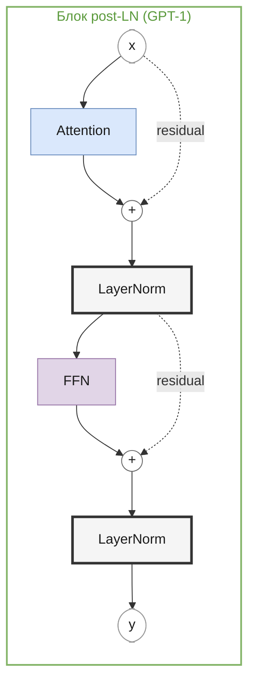
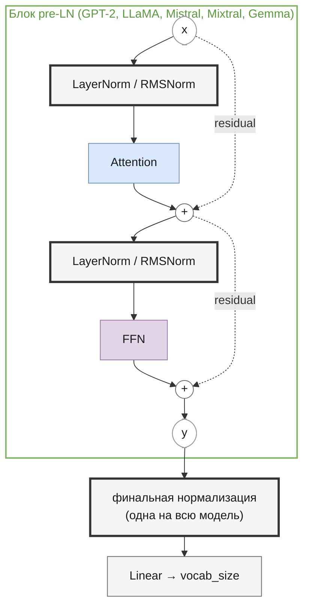

# Нормализация и residual-связи
<!-- description: LayerNorm и RMSNorm, residual-связи, post-LN и pre-LN: почему глубокие трансформеры обучаются стабильно. -->

Часть I · [← Маски](masks.md) · [Оглавление](README.md) · [Feed-forward сеть →](feed-forward.md)

Блок декодера любой модели репозитория — это два подслоя (attention и FFN), каждый из которых обёрнут в одну и ту же «упаковку»: **residual-связь** и **нормализацию**. Без этой упаковки стек из десятков блоков либо не обучается вовсе, либо требует очень аккуратного подбора скорости обучения. В этой главе разбираем, что именно делает каждая часть упаковки, почему она устроена так, а не иначе, и как она менялась от GPT-1 к Gemma.

## Что вы узнаете

- Как residual-связь сохраняет градиент в глубокой сети и что такое residual-поток.
- Почему BatchNorm не прижился в языковых моделях и как устроены LayerNorm и RMSNorm — с формулами и численными примерами.
- Зачем RMSNorm нужен `eps`, почему у Mistral он `1e-5`, а у LLaMA `1e-6`, и что за множитель `(1 + w)` у Gemma.
- Почему нормализацию в половинной точности считают во float32.
- Чем post-LN отличается от pre-LN, почему post-LN требует warmup и зачем pre-LN-модели финальная нормализация.
- Как всё это реализовано в декодерах `llm/core`.

## Предварительные знания

- Общая схема decoder-only трансформера — [Языковое моделирование](language-modeling.md).
- Что такое подслой attention — [Attention и его виды](attention.md).
- Производная сложной функции (цепное правило) и понятие градиента; обратное распространение в общих чертах — [Обучение](training.md).

## Residual-связи

### Проблема глубины

Блок декодера — функция $`F`$, которая переводит скрытые состояния $`X \in \mathbb{R}^{T \times d}`$ в новые той же формы. Модель из $`L`$ блоков — композиция $`F_L \circ \dots \circ F_1`$. По цепному правилу градиент функции потерь по входу первого блока — произведение $`L`$ якобианов. Если типичный «коэффициент усиления» каждого множителя меньше единицы, произведение экспоненциально стремится к нулю (**затухание градиента**, vanishing gradient), если больше — к бесконечности (**взрыв градиента**, exploding gradient). При $`L = 32`$ даже множитель $`0.9`$ даёт $`0.9^{32} \approx 0.034`$.

Эмпирически это выглядело так: He et al. обнаружили, что простая свёрточная сеть из 56 слоёв имеет *большую ошибку на обучающей выборке*, чем сеть из 20 слоёв, — более глубокая модель хуже даже оптимизируется ([He et al., 2016](https://arxiv.org/abs/1512.03385), разд. 1, рис. 1).

### Определение

**Residual-связь** (residual connection, skip connection) прибавляет к выходу подслоя его же вход:

```math
\mathbf{y} = \mathbf{x} + F(\mathbf{x})
```

где:
- $`\mathbf{x} \in \mathbb{R}^{d}`$ — вход подслоя для одного токена (строка матрицы $`X`$);
- $`F : \mathbb{R}^{d} \to \mathbb{R}^{d}`$ — сам подслой (attention или FFN вместе с их нормализацией); вход и выход обязаны иметь одинаковую размерность $`d`$, иначе складывать нельзя;
- $`\mathbf{y} \in \mathbb{R}^{d}`$ — выход.

Идея из [He et al., 2016](https://arxiv.org/abs/1512.03385) (разд. 3, формула (1)): подслою не нужно выучивать всё отображение целиком, ему достаточно выучить **поправку** (residual, «остаток») $`F(\mathbf{x}) = \mathbf{y} - \mathbf{x}`$ к тождественному отображению. Если слой бесполезен, ему проще всего выучить $`F \approx 0`$, и тогда блок просто пропускает сигнал дальше — добавление слоя не может сделать сеть хуже.

### Почему помогает градиенту

Продифференцируем $`\mathbf{y} = \mathbf{x} + F(\mathbf{x})`$ по $`\mathbf{x}`$:

```math
\frac{\partial \mathbf{y}}{\partial \mathbf{x}} = I + \frac{\partial F}{\partial \mathbf{x}}
```

где:
- $`I \in \mathbb{R}^{d \times d}`$ — единичная матрица (производная слагаемого $`\mathbf{x}`$ по самому себе);
- $`\partial F / \partial \mathbf{x} \in \mathbb{R}^{d \times d}`$ — якобиан подслоя.

В скалярном случае ($`d = 1`$) это просто $`1 + F'(x)`$. Единица — главный смысл конструкции: даже если $`F'`$ мал, производная блока около единицы, а не около нуля.

Для стека $`\mathbf{x}_{l+1} = \mathbf{x}_l + F_l(\mathbf{x}_l)`$, $`l = 0, \dots, L-1`$, градиент от выхода к входу блока $`l`$ равен произведению:

```math
\frac{\partial \mathbf{x}_L}{\partial \mathbf{x}_l} = \prod_{m=l}^{L-1} \left( I + \frac{\partial F_m}{\partial \mathbf{x}_m} \right) = I + \sum_{m=l}^{L-1} \frac{\partial F_m}{\partial \mathbf{x}_m} + (\text{произведения двух и более якобианов})
```

где $`\mathbf{x}_l`$ — вход блока $`l`$, $`\mathbf{x}_L`$ — выход последнего блока, $`m`$ — индекс блока в произведении; множители — матрицы, и произведение берётся в порядке от последнего блока к первому (при раскрытии скобок порядок на слагаемое $`I`$ и сумму первого порядка не влияет). Раскрывая скобки, получаем слагаемое $`I`$: градиент функции потерь $`\partial \mathcal{L} / \partial \mathbf{x}_L`$ попадает на любой слой **напрямую**, без умножения на якобианы промежуточных слоёв. Этот аргумент подробно разобран в продолжении работы — [He et al., 2016b](https://arxiv.org/abs/1603.05027).

**Пример.** Пусть каждый из 10 слоёв — скалярное умножение $`F(x) = wx`$ с $`w = 0.1`$.

| | Производная одного слоя | Производная 10 слоёв |
|---|---|---|
| без residual: $`x_{l+1} = w x_l`$ | $`0.1`$ | $`0.1^{10} = 10^{-10}`$ |
| с residual: $`x_{l+1} = x_l + w x_l`$ | $`1.1`$ | $`1.1^{10} \approx 2.594`$ |

Без residual сигнал ошибки до первого слоя фактически не доходит.

### Residual-поток

В трансформере residual-связи стоят вокруг каждого подслоя, поэтому удобно смотреть на модель так: есть **residual-поток** (residual stream) — вектор $`\mathbf{x} \in \mathbb{R}^d`$ для каждого токена, который проходит от эмбеддинга до выходной проекции, а каждый подслой *читает* из него (через нормализацию) и *дописывает* в него поправку. Для pre-LN (см. ниже) выход стека буквально равен сумме:

```math
\mathbf{x}_L = \mathbf{x}_0 + \sum_{l=0}^{L-1} \Big( \mathrm{Attn}_l(\cdot) + \mathrm{FFN}_l(\cdot) \Big)
```

где $`\mathbf{x}_0`$ — эмбеддинг токена (с позиционным, если он есть), а в скобках — вклады attention и FFN каждого блока (их аргументы опущены). Термин и эта точка зрения популярны в работах по интерпретируемости, см. [Elhage et al., 2021](https://transformer-circuits.pub/2021/framework/index.html).

Из этой формулы видно ограничение: все подслои пишут в одно пространство размерности $`d`$, и именно поэтому выходные проекции attention ($`W_O`$) и FFN (второй линейный слой) возвращают размерность к $`d`$.

## Проблема масштаба активаций

Residual решает проблему градиента, но создаёт другую: **масштаб residual-потока растёт с глубиной**. Если вклады подслоёв примерно независимы и каждый имеет дисперсию $`\sigma^2`$ по каждой компоненте, то после $`L`$ сложений:

```math
\mathrm{Var}(x_L) = \mathrm{Var}(x_0) + L \sigma^2
```

где $`x_L`$ — одна компонента вектора после $`L`$ слоёв, $`x_0`$ — компонента эмбеддинга. Дисперсия суммы независимых слагаемых равна сумме дисперсий.

**Пример.** $`\mathrm{Var}(x_0) = 1`$, 12 блоков по два подслоя, каждый добавляет дисперсию 1: $`\mathrm{Var} = 1 + 24 = 25`$, стандартное отклонение выросло с 1 до 5.

Чем это плохо:
- следующий подслой получает на вход векторы разного масштаба в зависимости от глубины — его веса должны подстраиваться под этот масштаб;
- в attention скалярные произведения $`\mathbf{q}\cdot\mathbf{k}`$ растут квадратично с масштабом входа, softmax насыщается;
- при обучении распределение входов каждого слоя «плывёт» по мере изменения весов предыдущих слоёв.

Два средства применяются вместе:
1. **Инициализация**, уменьшающая вклад подслоёв (в GPT-2 — веса выходных проекций $`\mathcal{N}\big(0,\, (0.02/\sqrt{2L})^2\big)`$, т. е. со стандартным отклонением $`0.02/\sqrt{2L}`$, см. [gpt2.md](gpt2.md)).
2. **Нормализация** — явное приведение вектора к фиксированному масштабу перед подслоем (или после сложения). Ей посвящена оставшаяся часть главы.

## BatchNorm и почему он не подходит

Первой широко используемой нормализацией был **Batch Normalization** ([Ioffe & Szegedy, 2015](https://arxiv.org/abs/1502.03167)). Для каждого признака $`j`$ он вычисляет среднее и дисперсию **по батчу**:

```math
\mu_j = \frac{1}{B} \sum_{b=1}^{B} x_{b,j}, \qquad \sigma_j^2 = \frac{1}{B} \sum_{b=1}^{B} (x_{b,j} - \mu_j)^2, \qquad \hat{x}_{b,j} = \frac{x_{b,j} - \mu_j}{\sqrt{\sigma_j^2 + \epsilon}}
```

где:
- $`x_{b,j}`$ — признак $`j`$ примера $`b`$;
- $`B`$ — размер батча (для последовательностей усреднение шло бы по $`B \cdot T`$ позициям);
- $`\mu_j, \sigma_j^2`$ — статистики признака $`j`$, общие для всего батча;
- $`\epsilon`$ — малая константа против деления на ноль.

Нормализация идёт **вдоль столбца** матрицы «примеры × признаки». Для языковых моделей это неудобно по нескольким причинам:

- **Зависимость от батча.** Выход для одного примера зависит от остальных примеров батча. При генерации батч часто из одной последовательности, и статистики приходится брать из скользящих средних, накопленных при обучении, — поведение при обучении и инференсе расходится.
- **Утечка из будущего.** Если усреднять по позициям $`T`$, статистика позиции $`t`$ включает токены $`t+1, t+2, \dots`$ — то, что causal-маска старательно скрывает (см. [Маски](masks.md)).
- **Паддинг и разная длина.** Pad-токены попадают в статистики, если их специально не исключать.
- **Шум статистик.** В NLP-трансформерах статистики батча сильно колеблются от шага к шагу, и BatchNorm работает заметно хуже LayerNorm ([Shen et al., 2020](https://arxiv.org/abs/2003.07845)).

Нужна нормализация, которая смотрит на **один вектор одного токена** и не зависит ни от батча, ни от соседних позиций.

## LayerNorm

**Layer Normalization** ([Ba, Kiros & Hinton, 2016](https://arxiv.org/abs/1607.06450)) считает статистики по признакам одного вектора:

```math
\mu = \frac{1}{d} \sum_{i=1}^{d} x_i, \qquad
\sigma^2 = \frac{1}{d} \sum_{i=1}^{d} (x_i - \mu)^2, \qquad
\hat{x}_i = \frac{x_i - \mu}{\sqrt{\sigma^2 + \epsilon}}, \qquad
y_i = \gamma_i \hat{x}_i + \beta_i
```

где:
- $`\mathbf{x} = (x_1, \dots, x_d) \in \mathbb{R}^d`$ — скрытое состояние одного токена (одна строка $`X`$);
- $`\mu \in \mathbb{R}`$ — среднее компонент, $`\sigma^2 \in \mathbb{R}`$ — их дисперсия (делится на $`d`$, а не на $`d-1`$);
- $`\epsilon`$ — константа устойчивости (в `nn.LayerNorm` по умолчанию $`10^{-5}`$);
- $`\hat{\mathbf{x}} \in \mathbb{R}^d`$ — нормализованный вектор;
- $`\boldsymbol{\gamma}, \boldsymbol{\beta} \in \mathbb{R}^d`$ — обучаемые масштаб (gain) и сдвиг (bias), инициализируются единицами и нулями;
- $`\mathbf{y} \in \mathbb{R}^d`$ — выход.

**Ось нормализации.** Для тензора `[B, T, d]` статистики считаются по последней оси: у каждой из $`B \cdot T`$ позиций свои $`\mu`$ и $`\sigma^2`$. Ни батч, ни соседние токены на результат не влияют — все проблемы BatchNorm из предыдущего раздела исчезают. В PyTorch это `nn.LayerNorm(d)`: `normalized_shape = d` означает «нормализовать по последнему измерению размера $`d`$».

**Интуиция.** После нормализации у $`\hat{\mathbf{x}}`$ среднее 0 и средний квадрат почти 1, т. е. длина $`\|\hat{\mathbf{x}}\| \approx \sqrt{d}`$. Геометрически: вычитание среднего проецирует вектор на гиперплоскость, перпендикулярную вектору $`(1, \dots, 1)`$, а деление — растягивает до сферы радиуса $`\sqrt{d}`$. Затем $`\boldsymbol{\gamma}`$ и $`\boldsymbol{\beta}`$ возвращают сети свободу: если ей нужен другой масштаб или сдвиг по какому-то признаку, она их выучит. Без $`\boldsymbol{\gamma}, \boldsymbol{\beta}`$ нормализация жёстко ограничивала бы то, что может представить слой.

**Инвариантность.** Для любых $`\alpha > 0`$ и $`c \in \mathbb{R}`$ (при $`\epsilon \to 0`$):

```math
\mathrm{LN}(\alpha \mathbf{x} + c \mathbf{1}) = \mathrm{LN}(\mathbf{x})
```

где $`\mathbf{1} = (1, \dots, 1)`$. Сдвиг $`c`$ уходит при вычитании среднего, множитель $`\alpha`$ — при делении на стандартное отклонение. Значит, никакое растяжение residual-потока до подслоя не доходит.

### Численный пример

Возьмём $`d = 4`$, $`\mathbf{x} = (1, 2, 3, 6)`$, $`\boldsymbol{\gamma} = \mathbf{1}`$, $`\boldsymbol{\beta} = \mathbf{0}`$, $`\epsilon`$ пренебрежём.

1. Среднее: $`\mu = (1 + 2 + 3 + 6)/4 = 3`$.
2. Отклонения: $`\mathbf{x} - \mu = (-2, -1, 0, 3)`$.
3. Дисперсия: $`\sigma^2 = (4 + 1 + 0 + 9)/4 = 3.5`$, $`\sqrt{3.5} \approx 1.8708`$.
4. Выход: $`\hat{\mathbf{x}} = (-2, -1, 0, 3)/1.8708 \approx (-1.0690,\ -0.5345,\ 0,\ 1.6036)`$.

Проверка: сумма $`\hat{x}_i`$ равна 0, сумма квадратов $`1.1428 + 0.2857 + 0 + 2.5714 = 4 = d`$.

```python
import torch
from torch import nn

x = torch.tensor([[1., 2., 3., 6.]])
print(nn.LayerNorm(4)(x))  # tensor([[-1.0690, -0.5345,  0.0000,  1.6036]], ...)
print(nn.LayerNorm(4)(3 * x + 10))  # то же самое: инвариантность к масштабу и сдвигу
```

## RMSNorm

### Определение

**RMSNorm** (Root Mean Square Layer Normalization, [Zhang & Sennrich, 2019](https://arxiv.org/abs/1910.07467)) убирает из LayerNorm центрирование и сдвиг:

```math
\mathrm{RMS}(\mathbf{x}) = \sqrt{\frac{1}{d} \sum_{i=1}^{d} x_i^2 + \epsilon}, \qquad
y_i = \frac{x_i}{\mathrm{RMS}(\mathbf{x})} \, g_i
```

где:
- $`\mathbf{x} \in \mathbb{R}^d`$ — скрытое состояние одного токена;
- $`\mathrm{RMS}(\mathbf{x}) \in \mathbb{R}`$ — среднеквадратичное значение компонент (корень из среднего квадрата), $`\epsilon`$ — под корнем;
- $`\mathbf{g} \in \mathbb{R}^d`$ — обучаемый масштаб (аналог $`\boldsymbol{\gamma}`$), инициализируется единицами; в коде — параметр `_w`;
- $`\mathbf{y} \in \mathbb{R}^d`$ — выход.

Ось та же, что у LayerNorm, — последняя. Если среднее $`\mu = 0`$ и $`\boldsymbol{\beta} = \mathbf{0}`$, RMSNorm и LayerNorm совпадают: при $`\mu = 0`$ дисперсия равна среднему квадрату.

### Что убрано и почему

Убраны вычитание среднего $`\mu`$ и сдвиг $`\boldsymbol{\beta}`$. Гипотеза авторов: успех LayerNorm объясняется в первую очередь **инвариантностью к масштабу** (re-scaling invariance), а инвариантность к сдвигу (re-centering) не так важна. RMSNorm сохраняет первую и теряет вторую:

```math
\mathrm{RMSNorm}(\alpha \mathbf{x}) = \mathrm{RMSNorm}(\mathbf{x}) \quad (\alpha > 0), \qquad
\mathrm{RMSNorm}(\mathbf{x} + c\mathbf{1}) \neq \mathrm{RMSNorm}(\mathbf{x}) \ \text{в общем случае}
```

<details><summary>Вывод инвариантности к масштабу</summary>

При $`\epsilon = 0`$:

```math
\mathrm{RMS}(\alpha \mathbf{x}) = \sqrt{\frac{1}{d} \sum_i \alpha^2 x_i^2} = |\alpha| \sqrt{\frac{1}{d} \sum_i x_i^2} = \alpha\, \mathrm{RMS}(\mathbf{x}) \quad (\alpha > 0)
```

Поэтому

```math
\frac{\alpha x_i}{\mathrm{RMS}(\alpha \mathbf{x})} = \frac{\alpha x_i}{\alpha\, \mathrm{RMS}(\mathbf{x})} = \frac{x_i}{\mathrm{RMS}(\mathbf{x})}
```

Со сдвигом так не выходит: $`\mathrm{RMS}(\mathbf{x} + c\mathbf{1})`$ не выражается через $`\mathrm{RMS}(\mathbf{x})`$ одним множителем, и направление вектора $`\mathbf{x} + c\mathbf{1}`$ отличается от направления $`\mathbf{x}`$. При $`\epsilon > 0`$ инвариантность приближённая: она нарушается, только когда средний квадрат сравним с $`\epsilon`$.

</details>

Геометрически RMSNorm просто проецирует вектор на сферу радиуса $`\sqrt{d}`$ (направление сохраняется), а LayerNorm сначала ещё и убирает компоненту вдоль $`\mathbf{1}`$.

**Вычислительная экономия.** LayerNorm требует двух редукций по вектору (среднее, затем дисперсия — или сумма и сумма квадратов в один проход), вычитания и сложения с $`\boldsymbol{\beta}`$; RMSNorm — одной редукции (сумма квадратов) и одного умножения. Параметров вдвое меньше: $`d`$ вместо $`2d`$. По данным авторов, замена LayerNorm на RMSNorm ускоряла обучение разных моделей на 7–64 % при сопоставимом качестве (аннотация статьи). В масштабе всей LLM нормализация — малая доля FLOP, но это операция, ограниченная пропускной способностью памяти, и лишний проход по тензору заметен.

### Численный пример

Тот же вектор $`\mathbf{x} = (1, 2, 3, 6)`$, $`\mathbf{g} = \mathbf{1}`$:

1. Квадраты: $`(1, 4, 9, 36)`$, средний квадрат $`50/4 = 12.5`$.
2. $`\mathrm{RMS} = \sqrt{12.5} \approx 3.5355`$.
3. Выход: $`(1, 2, 3, 6)/3.5355 \approx (0.2828,\ 0.5657,\ 0.8485,\ 1.6971)`$.

В отличие от LayerNorm, все компоненты остались положительными: среднее не вычиталось. Сдвинем вход на 10: $`\mathbf{x} + 10 = (11, 12, 13, 16)`$ даёт $`(0.8375,\ 0.9137,\ 0.9898,\ 1.2182)`$ — другой результат, а $`3\mathbf{x}`$ — тот же, что у $`\mathbf{x}`$.

```python
import torch
from llm.core.rms_norm import RMSNorm

norm = RMSNorm(4)                         # eps=1e-6 по умолчанию
x = torch.tensor([[1., 2., 3., 6.]])
print(norm(x))       # tensor([[0.2828, 0.5657, 0.8485, 1.6971]], ...)
print(norm(3 * x))   # то же
print(norm(x + 10))  # tensor([[0.8375, 0.9137, 0.9898, 1.2182]], ...)
```

### eps и его роль

$`\epsilon`$ решает две задачи.

1. **Защита от деления на ноль.** Для нулевого вектора $`\mathrm{RMS} = \sqrt{\epsilon} > 0`$.
2. **Ограничение усиления.** Выход равен $`\mathbf{x} / \sqrt{m + \epsilon}`$, где $`m`$ — средний квадрат. Когда $`m \gg \epsilon`$, $`\epsilon`$ ни на что не влияет; когда вектор почти нулевой, множитель не превышает $`1/\sqrt{\epsilon}`$, и шум не раздувается до единичной нормы.

| Средний квадрат $`m`$ | Множитель при $`\epsilon = 10^{-6}`$ | Множитель при $`\epsilon = 10^{-5}`$ |
|---|---|---|
| $`1`$ | $`0.9999995`$ | $`0.999995`$ |
| $`10^{-2}`$ | $`9.9995`$ | $`9.9950`$ |
| $`10^{-4}`$ | $`99.50`$ | $`95.35`$ |
| $`10^{-6}`$ | $`707.1`$ | $`301.5`$ |
| $`\to 0`$ | $`\to 1000`$ | $`\to 316.2`$ |

Значение $`\epsilon`$ — гиперпараметр, с которым модель обучалась: у LLaMA и Gemma $`10^{-6}`$, у Mistral 7B и Mixtral 8x7B $`10^{-5}`$ (ключ `rms_norm_eps` конфига HF и этого репозитория). При типичном $`m \approx 1`$ разница выходов — около $`4.5 \cdot 10^{-6}`$ относительно, но при загрузке чужих весов её лучше не вносить: ошибки накапливаются по $`2L + 1`$ нормализациям. В репозитории `eps` задаётся ключом `rms_norm_eps` (по умолчанию `1e-6`) — см. [бэклог, пункт 50](../dev/backlog.md#50-eps-в-rmsnorm-зашит-как-1e-6--p3).

### Вариант Gemma: множитель (1 + w)

В Gemma (реализация HF `GemmaRMSNorm`) вес хранится иначе:

```math
y_i = \frac{x_i}{\mathrm{RMS}(\mathbf{x})} \, (1 + w_i), \qquad w_i = 0 \ \text{при инициализации}
```

где $`\mathbf{w} \in \mathbb{R}^d`$ — хранимый параметр. Это та же функция, что обычный RMSNorm с $`\mathbf{g} = \mathbf{1} + \mathbf{w}`$: при инициализации обе дают множитель 1. Разница — в параметризации: «нулевая точка» параметра соответствует тождественному масштабу. Одно из практических следствий: weight decay, стягивающий параметры к нулю, в такой параметризации тянет масштаб к 1, а не к 0 (это наше объяснение; в статье Gemma мотивация не приводится).

В репозитории отдельного класса для Gemma нет: `RMSNorm` умножает на сам вес, а при загрузке весов HF к ним прибавляется 1 — `convert_hf_state_dict` в [`models/gemma/hf_weights.py`](../../llm/src/llm/models/gemma/hf_weights.py):

```python
for key in result:
    if key.endswith("._w"):  # веса RMSNorm: (1 + w) в HF → w здесь
        result[key] = result[key] + 1
```

Подробнее — [gemma.md](gemma.md#отличия-от-оригинала) и [бэклог, пункт 46](../dev/backlog.md#46-rmsnorm-без-1--w-и-вычислений-во-float32--p3).

## Нормализация в половинной точности

### Проблема

В float16 наибольшее конечное число — $`65504`$. Квадрат числа переполняется, как только $`|x| > \sqrt{65504} \approx 255.9`$. Значения такого порядка в residual-потоке вполне возможны: он не нормализован (в pre-LN — сумма вкладов всех слоёв), и отдельные компоненты у обученных моделей бывают большими.

**Пример.** Вектор $`\mathbf{x} = (300, 1, 1, 1)`$ во float16:
- $`300^2 = 90000 > 65504`$ → `inf`;
- средний квадрат `inf`, $`\mathrm{RMS} = \infty`$;
- выход $`\mathbf{x}/\infty = (0, 0, 0, 0)`$ — вся информация о токене потеряна.

Правильный ответ: средний квадрат $`(90000 + 3)/4 = 22500.75`$, $`\mathrm{RMS} \approx 150.0`$, выход $`\approx (2.0,\ 0.0067,\ 0.0067,\ 0.0067)`$.

У bfloat16 диапазон как у float32 (до $`\approx 3.4 \cdot 10^{38}`$), переполнения нет, но мантисса короткая — 8 значащих бит (около 2–3 десятичных знаков), и сумма тысяч квадратов теряет точность.

### Решение в репозитории

`RMSNorm.forward` в [`core/rms_norm.py`](../../llm/src/llm/core/rms_norm.py) для float16/bfloat16 считает нормализацию во float32:

```python
x_compute = x.float() if x.dtype in (torch.float16, torch.bfloat16) else x   # 1. повышаем точность
rms = (x_compute.pow(2).mean(-1, keepdim=True) + self._eps) ** 0.5        # 2. RMS по последней оси
norm_x = (x_compute / rms).to(x.dtype)                                    # 3. делим и возвращаем dtype
return self._w * norm_x                                                   # 4. умножаем на вес g
```

- Строка 1: только для половинной точности; для float32/float64 ничего не меняется, результат побитово прежний.
- Строка 2 — формула $`\mathrm{RMS}(\mathbf{x})`$ целиком, $`\epsilon`$ под корнем; `mean(-1)` — ось признаков.
- Строка 3: нормализованный вектор по модулю не больше $`\sqrt{d}`$, его уже можно безопасно вернуть в исходный dtype.
- Строка 4: умножение на вес — после приведения, как в `LlamaRMSNorm` HF. `GemmaRMSNorm` умножает на $`(1 + w)`$ ещё во float32, поэтому в bf16 результаты могут расходиться в последних битах ([gemma.md](gemma.md)).

```python
import torch
from llm.core.rms_norm import RMSNorm

h = torch.tensor([[300., 1., 1., 1.]], dtype=torch.float16)
naive = h / (h.pow(2).mean(-1, keepdim=True) + 1e-6) ** 0.5
print(naive)                  # tensor([[0., 0., 0., 0.]], dtype=torch.float16)
print(RMSNorm(4).half()(h))   # tensor([[2.0000, 0.0067, 0.0067, 0.0067]], dtype=torch.float16, ...)
```

`nn.LayerNorm` (GPT-1, GPT-2) заботиться об этом не нужно: встроенная реализация PyTorch сама накапливает статистики в повышенной точности.

## Где ставить нормализацию: post-LN и pre-LN

### Post-LN

В исходном трансформере ([Vaswani et al., 2017](https://arxiv.org/abs/1706.03762), разд. 3.1) и в GPT-1 нормализация стоит **после** residual-сложения — **post-LN**:

```math
\begin{aligned}
\mathbf{x}' &= \mathrm{LN}_1\big(\mathbf{x} + \mathrm{Attn}(\mathbf{x})\big) \\
\mathbf{y} &= \mathrm{LN}_2\big(\mathbf{x}' + \mathrm{FFN}(\mathbf{x}')\big)
\end{aligned}
```

где $`\mathbf{x}`$ — вход блока, $`\mathbf{x}'`$ — промежуточное состояние после attention, $`\mathbf{y}`$ — выход блока; все — $`\mathbb{R}^{T \times d}`$, LN применяется к каждой строке.



Нормализация лежит **на пути residual**: сигнал от входа к выходу блока проходит через два LN. Residual-потока в чистом виде нет — после каждого сложения вектор снова приводится к единичному масштабу.

### Pre-LN

В GPT-2 нормализацию перенесли **на вход подслоя** — **pre-LN** ([Radford et al., 2019](https://cdn.openai.com/better-language-models/language_models_are_unsupervised_multitask_learners.pdf), разд. 2.3, по аналогии с pre-activation ResNet из [He et al., 2016b](https://arxiv.org/abs/1603.05027)):

```math
\begin{aligned}
\mathbf{x}' &= \mathbf{x} + \mathrm{Attn}\big(\mathrm{LN}_1(\mathbf{x})\big) \\
\mathbf{y} &= \mathbf{x}' + \mathrm{FFN}\big(\mathrm{LN}_2(\mathbf{x}')\big)
\end{aligned}
```

и после всего стека добавили **финальную нормализацию**:

```math
\mathrm{logits} = \mathrm{LN}_f(\mathbf{x}_L)\, W_{out}
```

где $`\mathbf{x}_L \in \mathbb{R}^{T \times d}`$ — выход последнего блока, $`\mathrm{LN}_f`$ — финальная нормализация, $`W_{out} \in \mathbb{R}^{d \times V}`$ — выходная проекция на словарь.



Теперь путь residual — **чистое тождество**: от эмбеддинга до финальной нормализации сигнал только складывается, и производная по нему содержит слагаемое $`I`$ из раздела про residual-связи. Нормализация стоит на *ответвлении* и влияет лишь на то, что подслой читает.

### Анализ Xiong et al.: почему post-LN нужен warmup

Практики давно заметили, что post-LN-трансформер плохо обучается без **warmup** — фазы, в которой скорость обучения линейно растёт от нуля за первые тысячи шагов (см. [Обучение](training.md)). [Xiong et al., 2020](https://arxiv.org/abs/2002.04745) объяснили это теоретически, анализируя градиенты **в момент инициализации**:

- **Post-LN** (теорема 1): норма градиента по весам последнего FFN оценивается как $`O\big(d \sqrt{\ln d}\big)`$ — **не уменьшается** с глубиной $`L`$. Более того, ожидаемая величина градиентов **растёт с номером слоя**: у слоёв ближе к выходу градиенты крупнее (там же; подтверждается экспериментами статьи).
- **Pre-LN**: та же норма — $`O\big(d \sqrt{\ln d / L}\big)`$, то есть убывает как $`1/\sqrt{L}`$, и градиенты по слоям примерно одинаковы.

где $`d`$ — размерность модели, $`L`$ — число слоёв; оценки — с большой вероятностью при случайной инициализации.

**Интуиция.** В post-LN слагаемое $`\mathbf{x}`$ проходит через LN каждого следующего блока. LN делит на стандартное отклонение суммы $`\mathbf{x} + F(\mathbf{x})`$, которое больше, чем у $`\mathbf{x}`$, поэтому вклад ранних слоёв и градиент к ним последовательно «сжимаются», а последние слои получают крупные градиенты. Большой градиент у выхода плюс большая скорость обучения с первого шага — и обучение расходится. Warmup даёт время, пока оптимизатор (Adam) накопит статистики, а веса выйдут из опасной области. В pre-LN градиенты хорошо обусловлены с самого начала; авторы показывают, что pre-LN-трансформер обучается **без warmup** и быстрее.

Цена pre-LN — растущий масштаб residual-потока: вклады слоёв только складываются, норма $`\mathbf{x}_L`$ увеличивается с глубиной, и каждый следующий подслой меняет поток относительно всё меньше. Для моделей из репозитория (до десятков слоёв) это не мешает; на практике pre-LN стал стандартом.

### Зачем pre-LN нужна финальная нормализация

В post-LN последняя операция блока — LN, поэтому выход стека уже нормализован и сразу идёт в выходную проекцию. В репозитории у GPT-1 финальной нормализации нет (см. [gpt.md](gpt.md)).

В pre-LN выход стека $`\mathbf{x}_L = \mathbf{x}_0 + \sum(\dots)`$ — ненормализованная сумма с масштабом, растущим с $`L`$. Если подать её прямо в $`W_{out}`$, логиты будут иметь масштаб, зависящий от глубины и от конкретного токена, и softmax станет неоправданно острым или плоским. Финальная нормализация ($`\mathrm{LN}_f`$ в GPT-2 — `ln_f`, в LLaMA/Mistral/Mixtral/Gemma — `norm`) приводит состояние к фиксированному масштабу перед проекцией. GPT-2 добавил её одновременно с переходом на pre-LN (разд. 2.3 статьи).

## Какие модели что используют

| Модель | Расстановка | Нормализация | $`\epsilon`$ | Финальная норма | Параметров на одну норму |
|---|---|---|---|---|---|
| Transformer (Vaswani, 2017) | post-LN | LayerNorm | — | нет | $`2d`$ |
| [GPT-1](gpt.md) | post-LN | LayerNorm | `1e-5` (`nn.LayerNorm`) | нет | $`2d`$ |
| [GPT-2](gpt2.md) | pre-LN | LayerNorm | `1e-5` | да | $`2d`$ |
| [LLaMA](llama.md) | pre-LN | RMSNorm | `1e-6` | да | $`d`$ |
| [Mistral 7B](mistral.md) | pre-LN | RMSNorm | `1e-5` | да | $`d`$ |
| [Mixtral 8x7B](mixtral.md) | pre-LN | RMSNorm | `1e-5` | да | $`d`$ |
| [Gemma](gemma.md) | pre-LN | RMSNorm, $`(1 + w)`$, во float32 | `1e-6` | да | $`d`$ |

В каждом блоке две нормализации, поэтому всего в модели $`2L + 1`$ нормализаций у pre-LN и $`2L`$ у post-LN. Параметров в них ничтожно мало: у LLaMA 7B ($`L = 32`$, $`d = 4096`$) — $`(2 \cdot 32 + 1) \cdot 4096 = 266\,240`$ из 6,7 млрд.

## Реализация в репозитории

| Модель | Блок | Расстановка | Нормализация в блоке | Финальная |
|---|---|---|---|---|
| GPT-1 | `GptDecoder` в [`core/gpt_decoder.py`](../../llm/src/llm/core/gpt_decoder.py) | post-LN | `nn.LayerNorm(emb_size)` ×2 | нет |
| GPT-2 | `Gpt2Decoder` в [`core/gpt2_decoder.py`](../../llm/src/llm/core/gpt2_decoder.py) | pre-LN | `nn.LayerNorm(emb_size)` ×2 | `GPT2._norm = nn.LayerNorm` |
| LLaMA | `CachedDecoder` в [`core/cached_decoder.py`](../../llm/src/llm/core/cached_decoder.py) | pre-LN | `norm_layer(emb_size)` ×2, LLaMA передаёт `partial(RMSNorm, eps=norm_eps)` | `Llama._norm = RMSNorm` |
| Mistral | `MistralDecoder` в [`core/mistral_decoder.py`](../../llm/src/llm/core/mistral_decoder.py) | pre-LN | `RMSNorm(emb_size, eps=norm_eps)` ×2 | `Mistral._norm = RMSNorm` |
| Mixtral | `MixtralDecoder` в [`core/mixtral_decoder.py`](../../llm/src/llm/core/mixtral_decoder.py) | pre-LN | `RMSNorm(emb_size, eps=norm_eps)` ×2 | `Mixtral._norm = RMSNorm` |
| Gemma | `GemmaDecoder` в [`core/gemma_decoder.py`](../../llm/src/llm/core/gemma_decoder.py) | pre-LN | `RMSNorm(emb_size, eps=norm_eps)` ×2 | `Gemma._norm = RMSNorm` |

**Post-LN** — `GptDecoder.forward`: сложение внутри вызова нормализации.

```python
attention, kv_caches = self._heads(x, use_cache=use_cache, cache=cache)
out = self._norm1(attention + x)        # x' = LN1(x + Attn(x))
ffn_out = self._ff(out)
result = self._norm2(ffn_out + out)     # y  = LN2(x' + FFN(x'))
```

**Pre-LN** — `Gpt2Decoder.forward`, `CachedDecoder.forward` и декодеры Mistral, Mixtral, Gemma устроены одинаково (у последних трёх — те же строки с другими модулями):

```python
norm1_out = self._norm1(x)              # LN1(x)
attention, kv_caches = self._heads(norm1_out, use_cache=use_cache, cache=cache)
out = attention + x                     # x' = x + Attn(LN1(x))
norm2_out = self._norm2(out)            # LN2(x')
ffn_out = self._ff(norm2_out)
result = ffn_out + out                  # y  = x' + FFN(LN2(x'))
```

Финальная нормализация применяется в `forward` модели после цикла по декодерам: `out = self._norm(out)`, затем `logits = self._linear(out)` (например, [`models/gpt/gpt2.py`](../../llm/src/llm/models/gpt/gpt2.py), [`models/llama/llama.py`](../../llm/src/llm/models/llama/llama.py)).

Детали `RMSNorm`:
- конструктор `RMSNorm(dim, eps=1e-6)`; `eps <= 0` — `ValueError`;
- вес — `nn.Parameter(torch.ones(dim))` с именем `_w` (в `state_dict` ключи вида `_decoders.0._norm1._w`), поэтому конвертеры весов HF переименовывают `input_layernorm.weight` → `_norm1._w` ([`models/llama/hf_weights.py`](../../llm/src/llm/models/llama/hf_weights.py));
- `eps` не параметр и не буфер — в чекпоинт не попадает, задаётся конфигом (`rms_norm_eps`).

Модели читают `eps` так: `norm_eps = config.get("rms_norm_eps", 1e-6)` и передают его во все $`2L + 1`$ нормализаций.

## Типичные ошибки и тонкости

- **Нормализация «не по той оси».** LayerNorm и RMSNorm нормализуют вектор одного токена (последнюю ось), а не столбец признака по батчу. Если по ошибке нормализовать по оси $`T`$, в статистику попадут будущие токены.
- **Забытая финальная нормализация** в pre-LN-модели: модель обучится, но хуже, а загруженные веса дадут неверные логиты.
- **Несовпадающий `eps`** при загрузке весов: расхождение маленькое, но накапливается по слоям. Для Mistral/Mixtral — `"rms_norm_eps": 1e-5`.
- **Gemma без `+1`**: если загрузить веса `GemmaRMSNorm` как есть, все масштабы окажутся около нуля вместо единицы, и выход модели будет бессмысленным.
- **Нормализация в float16 без повышения точности**: при $`|x| > 255.9`$ квадрат переполняется, и выход обнуляется или становится `nan`.
- **Post-LN без warmup** расходится или обучается медленно; pre-LN к этому гораздо устойчивее.
- **Weight decay на весах нормализации** — распространённая практика их исключать; в варианте $`(1 + w)`$ этот вопрос стоит иначе (см. выше).

## Итоги

- Residual-связь $`\mathbf{y} = \mathbf{x} + F(\mathbf{x})`$ даёт производную $`I + \partial F/\partial \mathbf{x}`$: градиент доходит до любого слоя напрямую.
- Residual-поток растёт по масштабу с глубиной; нормализация приводит вход подслоя к фиксированному масштабу.
- BatchNorm зависит от батча и соседних позиций и в языковых моделях не используется.
- LayerNorm: центрирование, деление на стандартное отклонение, $`\boldsymbol{\gamma}`$ и $`\boldsymbol{\beta}`$, $`2d`$ параметров; инвариантен к масштабу и сдвигу.
- RMSNorm: только деление на RMS и масштаб $`\mathbf{g}`$, $`d`$ параметров; инвариантен к масштабу, но не к сдвигу; дешевле.
- $`\epsilon`$ ограничивает усиление почти нулевых векторов; он — часть обученной модели (`1e-6` LLaMA/Gemma, `1e-5` Mistral/Mixtral).
- В половинной точности RMSNorm считается во float32: во float16 квадрат переполняется уже при $`|x| > 255.9`$.
- Post-LN (GPT-1) даёт крупные градиенты у выхода и требует warmup; pre-LN (GPT-2 и все последующие) — чистый residual-путь и финальная нормализация.

## Вопросы и упражнения

1. Посчитайте вручную LayerNorm и RMSNorm (без $`\epsilon`$, $`\boldsymbol{\gamma} = \mathbf{g} = \mathbf{1}`$, $`\boldsymbol{\beta} = \mathbf{0}`$) для $`\mathbf{x} = (2, 4, 4, 6)`$.

<details><summary>Ответ</summary>

LayerNorm: $`\mu = 4`$, отклонения $`(-2, 0, 0, 2)`$, $`\sigma^2 = 8/4 = 2`$, выход $`(-2, 0, 0, 2)/\sqrt{2} \approx (-1.4142,\ 0,\ 0,\ 1.4142)`$.

RMSNorm: средний квадрат $`(4 + 16 + 16 + 36)/4 = 18`$, $`\mathrm{RMS} = \sqrt{18} \approx 4.2426`$, выход $`\approx (0.4714,\ 0.9428,\ 0.9428,\ 1.4142)`$.

</details>

2. Докажите, что $`\mathrm{LN}(\alpha\mathbf{x} + c\mathbf{1}) = \mathrm{LN}(\mathbf{x})`$ при $`\alpha > 0`$ и $`\epsilon = 0`$. Верно ли это при $`\alpha < 0`$?

<details><summary>Ответ</summary>

Среднее: $`\mu' = \alpha\mu + c`$. Отклонения: $`\alpha x_i + c - \mu' = \alpha(x_i - \mu)`$. Дисперсия: $`\sigma'^2 = \alpha^2 \sigma^2`$, стандартное отклонение $`|\alpha|\sigma`$. Итог: $`\hat{x}'_i = \alpha(x_i - \mu)/(|\alpha|\sigma) = \mathrm{sign}(\alpha)\, \hat{x}_i`$. При $`\alpha > 0`$ выход тот же, при $`\alpha < 0`$ — меняет знак.

</details>

3. Сколько обучаемых параметров во всех нормализациях GPT-2 small ($`L = 12`$, $`d = 768`$) и LLaMA 7B ($`L = 32`$, $`d = 4096`$)?

<details><summary>Ответ</summary>

GPT-2: $`2L + 1 = 25`$ LayerNorm по $`2d = 1536`$ параметров — $`38\,400`$. LLaMA 7B: $`2L + 1 = 65`$ RMSNorm по $`d = 4096`$ — $`266\,240`$.

</details>

4. Модель из 20 слоёв, каждый слой — $`F(x) = wx`$, $`w = 0.05`$. Найдите производную выхода по входу без residual-связей и с ними. Что будет с residual при $`w = -1`$?

<details><summary>Ответ</summary>

Без residual: $`0.05^{20} \approx 9.5 \cdot 10^{-27}`$. С residual: $`1.05^{20} \approx 2.653`$. При $`w = -1`$ каждый множитель $`1 + w = 0`$, и производная — ноль: residual гарантирует слагаемое $`I`$, но якобиан подслоя может его сократить. На практике такое вырождение при обучении не возникает, но это напоминание, что «единица» — не магия.

</details>

5. Во float16 вектор $`\mathbf{x} = (256, 0, 0, 0)`$. Что вернёт наивный RMSNorm (все вычисления во float16) и что — `RMSNorm` из репозитория? Каким должен быть правильный ответ?

<details><summary>Ответ</summary>

$`256^2 = 65536 > 65504`$ — переполнение, средний квадрат `inf`, наивный выход $`(0, 0, 0, 0)`$. `RMSNorm` из репозитория считает во float32: средний квадрат $`65536/4 = 16384`$, $`\mathrm{RMS} = 128`$, выход $`(2, 0, 0, 0)`$ — это и есть правильный ответ.

</details>

6. Почему у GPT-1 в репозитории нет финальной нормализации, а у GPT-2 есть? Что произойдёт, если удалить `_norm` из обученной GPT-2?

<details><summary>Ответ</summary>

В post-LN последняя операция каждого блока — LayerNorm, выход стека уже нормализован. В pre-LN выход — ненормализованная сумма вкладов всех слоёв, её масштаб растёт с глубиной. Без `_norm` на вход `_linear` пойдут векторы гораздо большего и разного масштаба, чем при обучении, и логиты станут неверными (слишком «острое» распределение).

</details>

7. В чекпоинте Gemma вес нормализации $`w = (-0.25,\ 0,\ 0.5)`$. Какие значения окажутся в `_w` после `convert_hf_state_dict` и какой множитель применится к нормализованному вектору?

<details><summary>Ответ</summary>

`_w` $`= w + 1 = (0.75,\ 1,\ 1.5)`$; `RMSNorm` умножает на `_w`, т. е. на те же $`(1 + w)`$, что `GemmaRMSNorm`.

</details>

8. (Обсуждение) Xiong et al. показывают, что в post-LN градиенты у выхода не уменьшаются с глубиной, а в pre-LN убывают как $`1/\sqrt{L}`$. Объясните, почему из этого следует, что post-LN нужна меньшая начальная скорость обучения (warmup), а pre-LN — нет.

<details><summary>Ответ</summary>

Шаг обновления весов пропорционален скорости обучения, умноженной на градиент (для SGD буквально, для Adam — через ещё не накопленные моменты). Если градиенты последних слоёв post-LN крупные, при обычной скорости обучения первые шаги слишком велики и выводят модель в плохую область. Warmup делает начальные шаги маленькими. В pre-LN градиенты с самого начала меньше и равномерны по слоям, поэтому полная скорость обучения безопасна сразу.

</details>

## Литература

- He, Zhang, Ren, Sun. *Deep Residual Learning for Image Recognition*. 2016. [arXiv:1512.03385](https://arxiv.org/abs/1512.03385)
- He, Zhang, Ren, Sun. *Identity Mappings in Deep Residual Networks*. 2016. [arXiv:1603.05027](https://arxiv.org/abs/1603.05027) — pre-activation, анализ прямого пути градиента
- Ioffe, Szegedy. *Batch Normalization: Accelerating Deep Network Training by Reducing Internal Covariate Shift*. 2015. [arXiv:1502.03167](https://arxiv.org/abs/1502.03167)
- Ba, Kiros, Hinton. *Layer Normalization*. 2016. [arXiv:1607.06450](https://arxiv.org/abs/1607.06450)
- Zhang, Sennrich. *Root Mean Square Layer Normalization*. 2019. [arXiv:1910.07467](https://arxiv.org/abs/1910.07467)
- Shen, Yao, Gholami, Mahoney, Keutzer. *PowerNorm: Rethinking Batch Normalization in Transformers*. 2020. [arXiv:2003.07845](https://arxiv.org/abs/2003.07845)
- Xiong et al. *On Layer Normalization in the Transformer Architecture*. 2020. [arXiv:2002.04745](https://arxiv.org/abs/2002.04745)
- Vaswani et al. *Attention Is All You Need*. 2017. [arXiv:1706.03762](https://arxiv.org/abs/1706.03762)
- Radford, Wu, Child, Luan, Amodei, Sutskever. *Language Models are Unsupervised Multitask Learners*. OpenAI, 2019. [PDF](https://cdn.openai.com/better-language-models/language_models_are_unsupervised_multitask_learners.pdf)
- Elhage et al. *A Mathematical Framework for Transformer Circuits*. Anthropic, 2021. [transformer-circuits.pub](https://transformer-circuits.pub/2021/framework/index.html)
