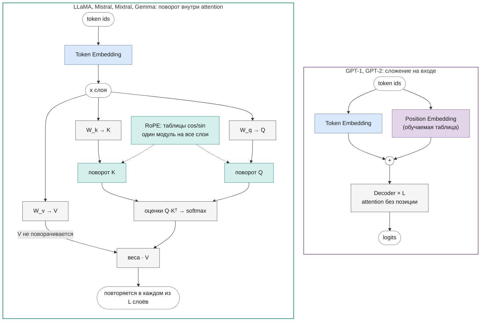

# Позиционное кодирование

Часть I · [← Эмбеддинги](embeddings.md) · [Оглавление](README.md) · [Attention →](attention.md)

> Реализация: [`core/positional_embeddings.py`](../../llm/src/llm/core/positional_embeddings.py) · класс `PositionalEmbeddings` (GPT-1, GPT-2);
> [`core/rope.py`](../../llm/src/llm/core/rope.py) · класс `RoPE` (LLaMA, Mistral, Mixtral, Gemma)

## Что вы узнаете

- Почему механизм внимания сам по себе не знает порядка токенов и как это строго доказать.
- Как устроены обучаемые абсолютные позиционные эмбеддинги GPT-1 и GPT-2 и чем ограничена их длина.
- Как синусоидальное кодирование из «Attention Is All You Need» превращает сдвиг позиции в поворот — и почему это прямой путь к RoPE.
- Полный вывод RoPE: матрицы поворота, частоты $`\theta_i`$, доказательство того, что оценка внимания зависит только от расстояния между токенами, эффективная реализация и перенос весов из HuggingFace.
- Как база `rope_theta` связана с длиной контекста и как RoPE работает вместе с KV-кэшем.

## Предварительные знания

- Авторегрессия и общая схема decoder-only трансформера — [language-modeling.md](language-modeling.md).
- Эмбеддинги токенов и матрица $`E`$ — [embeddings.md](embeddings.md).
- Формулу attention мы кратко напомним ниже; подробный разбор — в следующей главе, [attention.md](attention.md).
- Из математики: скалярное произведение, умножение матриц, транспонирование, $`\sin`$ и $`\cos`$ суммы углов. Для одного необязательного вывода — комплексные числа в форме $`e^{i\varphi} = \cos\varphi + i\sin\varphi`$.

Обозначения — как во всём пособии ([notation.md](notation.md)): $`T`$ — длина последовательности, $`d`$ — размерность модели, $`d_h`$ — размер головы, $`T_{\max}`$ — максимальная длина контекста (`max_position_embeddings`), позиции нумеруются с 0.

## Зачем нужна позиция

### Attention не знает порядка

Напомним формулу одной головы внимания без маски (подробно — в [attention.md](attention.md)):

```math
\operatorname{Attn}(X) = \operatorname{softmax}\!\left(\frac{Q K^\top}{\sqrt{d_h}}\right) V,
\qquad Q = X W_q,\quad K = X W_k,\quad V = X W_v
```

где:

- $`X \in \mathbb{R}^{T \times d}`$ — матрица входных состояний, строка $`t`$ — вектор токена на позиции $`t`$;
- $`W_q, W_k, W_v \in \mathbb{R}^{d \times d_h}`$ — матрицы проекций;
- $`Q, K, V \in \mathbb{R}^{T \times d_h}`$ — запросы (queries), ключи (keys) и значения (values);
- $`\operatorname{softmax}`$ применяется к каждой строке матрицы $`T \times T`$ отдельно;
- $`\sqrt{d_h}`$ — нормирующий множитель.

В этой формуле нет ни одного места, где использовался бы номер строки. Вес, с которым токен $`i`$ смотрит на токен $`j`$, зависит только от **содержимого** векторов $`x_i`$ и $`x_j`$. Отсюда следует свойство, которое называется **переставочной эквивариантностью (permutation equivariance)**: если переставить токены на входе, выход переставится точно так же и больше никак не изменится.

Формально: пусть $`P \in \{0,1\}^{T \times T}`$ — **матрица перестановки** (в каждой строке и каждом столбце ровно одна единица; в следующем разделе буквой $`P`$ будет обозначена другая матрица — позиционных эмбеддингов). Умножение $`PX`$ переставляет строки $`X`$. Утверждение:

```math
\operatorname{Attn}(PX) = P \, \operatorname{Attn}(X)
```

<details><summary>Доказательство</summary>

Шаг 1. Проекции переставляются вместе со входом, потому что умножение справа на $`W`$ действует на каждую строку отдельно:

```math
Q' = (PX) W_q = P (X W_q) = P Q,\qquad K' = P K,\qquad V' = P V
```

Шаг 2. Матрица оценок:

```math
S' = \frac{Q' K'^\top}{\sqrt{d_h}} = \frac{P Q (P K)^\top}{\sqrt{d_h}} = \frac{P Q K^\top P^\top}{\sqrt{d_h}} = P S P^\top
```

Умножение слева на $`P`$ переставляет строки $`S`$, справа на $`P^\top`$ — столбцы, той же перестановкой.

Шаг 3. Softmax по строкам коммутирует с такой двойной перестановкой: перестановка строк просто меняет порядок, в котором строки обрабатываются, а перестановка столбцов внутри строки переставляет слагаемые знаменателя $`\sum_j e^{s_{ij}}`$ (сумма от этого не меняется) и числители. Поэтому

```math
\operatorname{softmax}(P S P^\top) = P \, \operatorname{softmax}(S) \, P^\top
```

Шаг 4. Для матрицы перестановки $`P^\top P = I`$ (это ортогональная матрица). Собираем:

```math
\operatorname{Attn}(PX) = P\,\operatorname{softmax}(S)\,P^\top \cdot P V = P\,\operatorname{softmax}(S)\,(P^\top P)\, V = P\,\operatorname{softmax}(S)\, V = P\,\operatorname{Attn}(X)
```

Шаг 5. Остальные части блока трансформера — FFN, LayerNorm/RMSNorm, residual-сложение — применяются к каждой строке независимо, а значит, тоже эквивариантны. Композиция эквивариантных отображений эквивариантна, поэтому эквивариантен и весь стек слоёв.

</details>

**Что это значит на практике.** Фразы «кот ест рыбу» и «рыбу ест кот» состоят из одних и тех же токенов. Без позиционной информации вектор слова «кот» на выходе будет одинаковым в обеих фразах: модель видит **мешок токенов**, а не последовательность. Для языка это неприемлемо: смысл определяется порядком. Нужно как-то сообщить модели, где стоит каждый токен.

Проверить эквивариантность можно численно:

```python
import torch

torch.manual_seed(0)
T, d, d_h = 6, 16, 8
X = torch.randn(T, d)
W_q, W_k, W_v = torch.randn(3, d, d_h)

def attn(X):
    S = (X @ W_q) @ (X @ W_k).T / d_h ** 0.5
    return torch.softmax(S, dim=-1) @ (X @ W_v)

perm = torch.randperm(T)
print(torch.allclose(attn(X[perm]), attn(X)[perm], atol=1e-5))  # True
```

### Что меняет causal-маска

В decoder-only моделях к оценкам добавляется **causal-маска** ([masks.md](masks.md)): токен $`i`$ видит только $`j \le i`$. Маска привязана к номерам строк, поэтому она сама нарушает эквивариантность: в коде выше с маской `allclose` даёт `False`. Косвенно модель может извлечь из маски позицию — например, первый токен смотрит только на себя, а сотый усредняет сто векторов. Haviv et al. ([2022](https://arxiv.org/abs/2203.16634)) показали, что языковые модели с causal-маской и вовсе без позиционного кодирования учатся почти так же хорошо. Но это неявная и грубая информация; все модели этого пособия кодируют позицию явно.

### Абсолютная и относительная позиция

Позицию можно сообщить модели двумя способами:

- **абсолютная позиция (absolute position)** — каждому токену сообщается его номер $`t`$: «я пятый»;
- **относительная позиция (relative position)** — паре токенов сообщается расстояние между ними $`i - j`$: «ты на три токена левее меня».

Для языка важнее относительная: смысл «прилагательное перед существительным» не зависит от того, стоит пара в начале документа или на тысячной позиции. Дальше мы увидим, как методы постепенно шли от абсолютной позиции к относительной — и как RoPE получает относительную позицию, поворачивая векторы по абсолютной.

## Обучаемые абсолютные эмбеддинги (GPT-1, GPT-2)

### Формула

Самый простой способ: завести для каждой позиции свой обучаемый вектор и прибавить его к эмбеддингу токена. Так сделано в GPT-1 (Radford et al., 2018, раздел 4.1: авторы явно выбирают обучаемые позиционные эмбеддинги вместо синусоидальных) и GPT-2 (Radford et al., 2019):

```math
X^{(0)}_{t} = E[x_t] + P[t], \qquad t = 0, 1, \dots, T-1
```

где:

- $`x_t`$ — индекс токена на позиции $`t`$;
- $`E \in \mathbb{R}^{V \times d}`$ — матрица эмбеддингов токенов, $`E[x_t] \in \mathbb{R}^{d}`$ — её строка ([embeddings.md](embeddings.md));
- $`P \in \mathbb{R}^{T_{\max} \times d}`$ — **матрица позиционных эмбеддингов**, обучаемый параметр (не матрица перестановки из предыдущего раздела); $`P[t] \in \mathbb{R}^{d}`$ — строка для позиции $`t`$;
- $`X^{(0)}_{t} \in \mathbb{R}^{d}`$ — вход первого блока декодера для позиции $`t`$ (строка $`t`$ матрицы $`X^{(0)} \in \mathbb{R}^{T \times d}`$, как в [embeddings.md](embeddings.md)). Для всей последовательности $`X^{(0)} = E[x_{0:T}] + P[0:T]`$, где $`E[x_{0:T}]`$ и $`P[0:T]`$ — строки с номерами $`x_0, \dots, x_{T-1}`$ и $`0, \dots, T-1`$ соответственно.

**Интуиция.** Позиционный вектор — такой же «словарный» вектор, только словарь состоит из номеров позиций $`0, 1, \dots, T_{\max}-1`$. После сложения вектор строки $`t`$ несёт одновременно «что за токен» и «где он стоит», и эквивариантность нарушается: одинаковые токены на разных позициях дают разные входы. Сложение, а не конкатенация, не увеличивает размерность; модель сама учится разносить информацию о токене и позиции по разным направлениям $`d`$-мерного пространства.

**Численный пример.** Пусть $`d = 2`$, $`E[\text{«кот»}] = (0.5, -1)`$, $`P[0] = (0.1, 0.2)`$, $`P[3] = (-0.3, 0.4)`$. Тогда «кот» на позиции 0 даёт $`(0.6, -0.8)`$, а на позиции 3 — $`(0.2, -0.6)`$: attention увидит два разных вектора.

### Стоимость и ограничение длины

Параметров $`T_{\max} \cdot d`$: для GPT-1 ($`T_{\max} = 512`$, $`d = 768`$) — 393 216, для GPT-2 small ($`T_{\max} = 1024`$, $`d = 768`$) — 786 432, около 0,6 % от 124,4M параметров модели ([gpt2.md](gpt2.md)). Немного.

Главный недостаток — **жёсткий предел длины**. Строк $`P[t]`$ для $`t \ge T_{\max}`$ нет вовсе, и модель не может обработать больше $`T_{\max}`$ токенов за раз. Даже если добавить строки, их нечем обучить. Кроме того, строки для редких больших позиций обучаются хуже: длинных примеров в данных меньше. И каждая позиция кодируется независимо, поэтому связь «позиции 17 и 18 соседние» модель должна выучить сама.

### Реализация: `PositionalEmbeddings`

Класс [`PositionalEmbeddings`](../../llm/src/llm/core/positional_embeddings.py) — обёртка над `nn.Embedding(max_seq_len, emb_size)`: его матрица весов и есть $`P`$. Метод `forward(seq_len, start_pos=0, positions=None)` возвращает строки матрицы $`P`$ с номерами `start_pos … start_pos + seq_len − 1` формы `[seq_len, emb_size]`, а с `positions` формы `[batch, seq_len]` — строки с этими номерами, `[batch, seq_len, emb_size]`:

```python
if positions is not None:          # паддинг: своя позиция у каждой строки
    return self.embedding(positions)                # [batch, seq_len, emb_size]
if seq_len < 1 or start_pos + seq_len > self.max_seq_len:
    raise IndexError(...)
...
positions = torch.arange(start=start_pos, end=start_pos + seq_len, device=...)
return self.embedding(positions)
```

В моделях [`GPT`](../../llm/src/llm/models/gpt/gpt.py) и [`GPT2`](../../llm/src/llm/models/gpt/gpt2.py) сложение выглядит так (`forward`):

```python
tok_out = self._token_embeddings(x)                              # [batch, seq_len, emb_size]
if padding is None:
    pos_out = self._position_embeddings(seq_len, start_pos=start_pos).unsqueeze(0)  # [1, seq_len, emb_size]
else:
    pos_out = self._position_embeddings(seq_len, positions=padding.positions)       # [batch, seq_len, emb_size]
out = self._dropout(tok_out + pos_out)                           # broadcast по батчу без паддинга
```

Без паддинга `unsqueeze(0)` превращает `[seq_len, emb_size]` в `[1, seq_len, emb_size]`, и одна и та же матрица позиций прибавляется ко всем примерам батча. С паддингом в `attention_mask` позиции у строк разные: позиция токена — его номер среди настоящих токенов строки, `cumsum(mask) − 1` (у строки `[pad, pad, a, b]` токен `a` — на позиции 0). Их считает `padding_from_attention_mask` из [`core/padding.py`](../../llm/src/llm/core/padding.py) и передаёт в `positions`; подробно — в [masks.md](masks.md#attention_mask-и-паддинг). Веса $`P`$ инициализируются вместе с остальными `Embedding`/`Linear` нормальным распределением ($`\mathcal{N}(0, 0.02^2)`$ по умолчанию, `init_normal_` в [`core/weight_init.py`](../../llm/src/llm/core/weight_init.py)). При загрузке весов OpenAI/HF матрица приходит из ключа `wpe.weight` (GPT-2) или `positions_embed.weight` (GPT-1), см. [`models/gpt/hf_weights.py`](../../llm/src/llm/models/gpt/hf_weights.py).

Докстринг `PositionalEmbeddings` упоминает и синусоидальный вариант, но реализован только обучаемый: синусоидального кодирования в репозитории нет.

### `start_pos` и KV-кэш

При генерации с KV-кэшем ([generation.md](generation.md)) модель на каждом шаге получает только новый токен, `seq_len = 1`. Его позиция — не 0, а число уже обработанных токенов. Эту позицию считает функция `cache_start_pos` в [`core/generation.py`](../../llm/src/llm/core/generation.py): для кэша слоёв MHA она равна длине закэшированной последовательности `K`. Модель передаёт её в `PositionalEmbeddings` как `start_pos` и сначала проверяет `check_sequence_length`: если `start_pos + seq_len > max_position_embeddings`, выбрасывается `ValueError`.

Что будет, если забыть `start_pos`? Каждый новый токен получит $`P[0]`$ — модель будет «думать», что каждое следующее слово стоит в начале текста.

Когда генерация выходит за $`T_{\max}`$, `generate` (функция `next_generation_input`) берёт последние $`T_{\max}`$ токенов и пересчитывает их **без кэша**: окно сдвинулось, позиции всех токенов уменьшились на единицу, и старые K/V, посчитанные со старыми позициями, больше не годятся.

## Синусоидальное кодирование (Vaswani et al., 2017)

### Формулы

В исходном трансформере ([Vaswani et al., 2017](https://arxiv.org/abs/1706.03762), раздел 3.5) позиционный вектор не обучается, а вычисляется по формуле и так же прибавляется к эмбеддингу токена:

```math
\mathrm{PE}(t, 2i) = \sin\!\left(\frac{t}{10000^{2i/d}}\right),
\qquad
\mathrm{PE}(t, 2i+1) = \cos\!\left(\frac{t}{10000^{2i/d}}\right)
```

где:

- $`t`$ — позиция токена;
- $`i = 0, 1, \dots, d/2 - 1`$ — номер **пары** координат; координаты $`2i`$ и $`2i+1`$ используют одну частоту;
- $`d`$ — размерность модели (в статье $`d_{\text{model}}`$);
- $`\mathrm{PE}(t) \in \mathbb{R}^{d}`$ — позиционный вектор, $`\mathrm{PE} \in \mathbb{R}^{T_{\max} \times d}`$ — таблица для всех позиций; параметров нет.

Обозначим частоту пары $`\omega_i = 10000^{-2i/d}`$. Тогда пара $`i`$ — это точка $`(\sin \omega_i t, \cos \omega_i t)`$ на единичной окружности, которая с ростом $`t`$ равномерно вращается с угловой скоростью $`\omega_i`$ радиан на позицию.

### Частоты в геометрической прогрессии

Частоты образуют **геометрическую прогрессию**: $`\omega_{i+1} / \omega_i = 10000^{-2/d}`$ — постоянное отношение. Периоды (длины волн) $`\lambda_i = 2\pi / \omega_i`$ растут от $`2\pi`$ (пара 0) до почти $`10000 \cdot 2\pi`$ (последняя пара) — так и сказано в статье.

**Интуиция: двоичный счётчик.** Запишите числа 0, 1, 2, … в двоичной системе: младший разряд меняется каждый шаг, следующий — каждые два шага, дальше — каждые четыре. Синусоидальное кодирование — «гладкий» аналог такого счётчика: быстрые пары различают соседние позиции, медленные — далёкие. Геометрическая прогрессия частот даёт шкалу, одинаково подробную на всех масштабах (как разряды числа).

**Численный пример.** $`d = 4`$: частоты $`\omega_0 = 1`$, $`\omega_1 = 10000^{-1/2} = 0.01`$. Для $`t = 1`$:

```math
\mathrm{PE}(1) = (\sin 1,\ \cos 1,\ \sin 0.01,\ \cos 0.01) \approx (0.841,\ 0.540,\ 0.010,\ 1.000)
```

Первая пара заметно повернулась, вторая — почти нет: её «стрелка» пройдёт полный круг только за $`2\pi / 0.01 \approx 628`$ позиций.

### Сдвиг позиции — линейная функция

Авторы выбрали синусоиды, потому что, по их гипотезе, модели будет легко научиться обращать внимание по относительным позициям: для любого фиксированного сдвига $`k`$ вектор $`\mathrm{PE}(t+k)`$ — **линейная функция** $`\mathrm{PE}(t)`$, причём матрица не зависит от $`t`$.

Выведем это для одной пары. По формулам синуса и косинуса суммы:

```math
\begin{aligned}
\sin(\omega(t+k)) &= \sin(\omega t)\cos(\omega k) + \cos(\omega t)\sin(\omega k) \\
\cos(\omega(t+k)) &= \cos(\omega t)\cos(\omega k) - \sin(\omega t)\sin(\omega k)
\end{aligned}
```

В матричном виде:

```math
\begin{pmatrix} \sin(\omega(t+k)) \\ \cos(\omega(t+k)) \end{pmatrix}
=
\underbrace{\begin{pmatrix} \cos \omega k & \sin \omega k \\ -\sin \omega k & \cos \omega k \end{pmatrix}}_{M_k}
\begin{pmatrix} \sin \omega t \\ \cos \omega t \end{pmatrix}
```

где:

- $`\omega`$ — частота пары;
- $`k`$ — сдвиг позиции;
- $`M_k \in \mathbb{R}^{2 \times 2}`$ — **матрица поворота** на угол $`\omega k`$ (здесь по часовой стрелке, потому что порядок координат «синус, косинус»). Она зависит от $`k`$, но **не от $`t`$**.

Для всего вектора матрица сдвига блочно-диагональная: на диагонали стоят блоки $`2 \times 2`$, по одному на каждую пару со своей частотой $`\omega_i`$. Итак, **сдвиг позиции на $`k`$ — это поворот каждой пары на угол $`\omega_i k`$**.

Второе следствие: скалярное произведение двух позиционных векторов зависит только от расстояния:

```math
\mathrm{PE}(t) \cdot \mathrm{PE}(t+k) = \sum_{i=0}^{d/2-1} \left[\sin(\omega_i t)\sin(\omega_i (t+k)) + \cos(\omega_i t)\cos(\omega_i (t+k))\right] = \sum_{i=0}^{d/2-1} \cos(\omega_i k)
```

(использована формула $`\cos(a - b) = \cos a \cos b + \sin a \sin b`$). Например, при $`d = 8`$ произведения $`\mathrm{PE}(3)\cdot\mathrm{PE}(10)`$ и $`\mathrm{PE}(20)\cdot\mathrm{PE}(27)`$ оба равны $`\approx 3.516`$.

**Почему этого недостаточно.** Хорошее свойство есть у самих векторов $`\mathrm{PE}`$, но в модель они попадают через сложение с эмбеддингом токена, а затем через проекции $`W_q`$, $`W_k`$. Оценка внимания $`(e_i + \mathrm{PE}(i)) W_q W_k^\top (e_j + \mathrm{PE}(j))^\top`$ раскладывается на четыре слагаемых, и в трёх из них позиция смешана с содержимым произвольными матрицами. Относительность не гарантирована — модель должна её выучить. RoPE берёт ту же идею «сдвиг = поворот» и применяет поворот **прямо к $`q`$ и $`k`$**, где он работает точно.

**История.** Vaswani et al. сравнили синусоиды с обучаемыми эмбеддингами и получили почти одинаковое качество (таблица 3, строка E); синусоиды выбрали в надежде на экстраполяцию на длины, большие, чем при обучении. GPT-1 и GPT-2 вернулись к обучаемым эмбеддингам.

В этом репозитории синусоидальное кодирование **не реализовано**.

## Относительные позиции: Shaw et al., T5, ALiBi

Эти методы в репозитории не реализованы; они нужны как контекст, чтобы увидеть, какое место занимает RoPE.

**Shaw et al. ([2018](https://arxiv.org/abs/1803.02155))** первыми встроили относительную позицию прямо в attention. Для каждой пары $`(i, j)`$ берётся обучаемый вектор $`a_{ij}^K`$, зависящий только от обрезанного расстояния $`\operatorname{clip}(j - i, -k, k)`$, и прибавляется к ключу:

```math
e_{ij} = \frac{x_i W_q \,(x_j W_k + a_{ij}^K)^\top}{\sqrt{d_h}}
```

где $`k`$ — максимальное учитываемое расстояние (обозначение статьи; здесь это число, а не вектор ключа), дальше все расстояния считаются одинаковыми; аналогичный вектор $`a_{ij}^V`$ прибавляется к значениям. Цена — дополнительные параметры и тензор оценок, зависящий от пары позиций, что усложняет эффективную реализацию.

**T5** ([Raffel et al., 2019](https://arxiv.org/abs/1910.10683)) упростил идею: к оценке $`e_{ij}`$ прибавляется обучаемое **число** (скаляр), зависящее от расстояния $`j - i`$, разбитого на корзины (buckets), своё для каждой головы.

**ALiBi** ([Press et al., 2022](https://arxiv.org/abs/2108.12409)) обходится без обучаемых параметров: к оценке прибавляется штраф, линейно растущий с расстоянием,

```math
e_{ij} = \frac{q_i k_j^\top}{\sqrt{d_h}} - m_h \,(i - j), \qquad j \le i
```

где $`m_h > 0`$ — фиксированный наклон головы $`h`$; наклоны образуют геометрическую прогрессию (для 8 голов — $`1/2, 1/4, \dots, 1/256`$). Далёкие токены получают меньший вес, «крутизна» у каждой головы своя. Позиционных эмбеддингов на входе нет. Статья называется «Train Short, Test Long»: главный аргумент — модель, обученная на коротких последовательностях, продолжает работать на более длинных (экстраполяция).

## RoPE: поворот вместо сложения

### Идея

RoPE (Rotary Position Embedding, «ротационные позиционные эмбеддинги»; [Su et al., 2021](https://arxiv.org/abs/2104.09864)) ставит задачу так: найти преобразование $`f(x, m)`$ вектора $`x`$, стоящего на позиции $`m`$, такое, что скалярное произведение преобразованных запроса и ключа зависит от позиций **только через разность**:

```math
\langle f(q, m),\, f(k, n) \rangle = g(q, k, m - n)
```

где:

- $`q, k \in \mathbb{R}^{d_h}`$ — запрос токена на позиции $`m`$ и ключ токена на позиции $`n`$ (одной головы, уже после проекций $`W_q`$, $`W_k`$);
- $`\langle \cdot, \cdot \rangle`$ — скалярное произведение;
- $`g`$ — какая-то функция, в которую позиции входят только как $`m - n`$.

Ответ RoFormer (раздел 3.2): $`f(x, m) = R_m x`$, где $`R_m`$ — поворот на угол, пропорциональный $`m`$. Разберём по шагам.

В этом разделе удобнее считать $`q`$ и $`k`$ **векторами-столбцами** и записывать скалярное произведение как $`q^\top k`$; в коде векторы — строки, но скалярное произведение от этого не меняется.

### Поворот на плоскости

**Матрица поворота** на угол $`\alpha`$ против часовой стрелки:

```math
R(\alpha) = \begin{pmatrix} \cos\alpha & -\sin\alpha \\ \sin\alpha & \cos\alpha \end{pmatrix}
```

где $`\alpha`$ — угол в радианах; $`R(\alpha) \in \mathbb{R}^{2 \times 2}`$ действует на столбец $`(x_0, x_1)^\top`$.

Пример: $`R(90°)`$ переводит $`(1, 0)^\top`$ в $`(0, 1)^\top`$, а $`(0, 1)^\top`$ — в $`(-1, 0)^\top`$.

Нам понадобятся три свойства.

1. **Повороты складываются:** $`R(\alpha) R(\beta) = R(\alpha + \beta)`$.
2. **Обратный поворот — транспонирование:** $`R(\alpha)^\top = R(-\alpha)`$, и $`R(\alpha)^\top R(\alpha) = I`$ (матрица **ортогональна**).
3. Как следствие: $`R(\alpha)^\top R(\beta) = R(\beta - \alpha)`$.

<details><summary>Вывод свойств</summary>

Свойство 1. Перемножаем матрицы:

```math
R(\alpha)R(\beta) =
\begin{pmatrix}
\cos\alpha\cos\beta - \sin\alpha\sin\beta & -\cos\alpha\sin\beta - \sin\alpha\cos\beta \\
\sin\alpha\cos\beta + \cos\alpha\sin\beta & -\sin\alpha\sin\beta + \cos\alpha\cos\beta
\end{pmatrix}
```

По формулам $`\cos(\alpha+\beta) = \cos\alpha\cos\beta - \sin\alpha\sin\beta`$ и $`\sin(\alpha+\beta) = \sin\alpha\cos\beta + \cos\alpha\sin\beta`$ это ровно

```math
\begin{pmatrix} \cos(\alpha+\beta) & -\sin(\alpha+\beta) \\ \sin(\alpha+\beta) & \cos(\alpha+\beta) \end{pmatrix} = R(\alpha+\beta)
```

Свойство 2. Транспонирование меняет местами внедиагональные элементы:

```math
R(\alpha)^\top = \begin{pmatrix} \cos\alpha & \sin\alpha \\ -\sin\alpha & \cos\alpha \end{pmatrix}
= \begin{pmatrix} \cos(-\alpha) & -\sin(-\alpha) \\ \sin(-\alpha) & \cos(-\alpha) \end{pmatrix} = R(-\alpha)
```

(косинус чётный, синус нечётный). Тогда по свойству 1: $`R(\alpha)^\top R(\alpha) = R(-\alpha)R(\alpha) = R(0) = I`$.

Свойство 3. $`R(\alpha)^\top R(\beta) = R(-\alpha) R(\beta) = R(\beta - \alpha)`$.

</details>

### Блочно-диагональная матрица для вектора головы

Вектор головы имеет размерность $`d_h`$ (чётную). Разобьём его на $`d_h/2`$ пар соседних координат $`(x_0, x_1), (x_2, x_3), \dots`$ и повернём каждую пару $`i`$ на свой угол $`m\theta_i`$:

```math
R_m =
\begin{pmatrix}
R(m\theta_0) & 0 & \cdots & 0 \\
0 & R(m\theta_1) & \cdots & 0 \\
\vdots & \vdots & \ddots & \vdots \\
0 & 0 & \cdots & R(m\theta_{d_h/2-1})
\end{pmatrix}
\in \mathbb{R}^{d_h \times d_h}
```

где:

- $`m`$ — позиция токена (целое, $`0 \le m < T_{\max}`$);
- $`\theta_i`$ — **частота** пары $`i`$ (в радианах на позицию); здесь $`\theta`$ — не параметры модели, а фиксированные числа;
- $`R(m\theta_i)`$ — блок $`2 \times 2`$ из предыдущего пункта; вне диагональных блоков — нули.

Запрос и ключ преобразуются так:

```math
\tilde q_m = R_m\, q_m, \qquad \tilde k_n = R_n\, k_n
```

где $`q_m = W_q^\top x_m`$ и $`k_n = W_k^\top x_n`$ — обычные проекции (в столбцовой записи). Для пары $`i`$ это покоординатно:

```math
\begin{aligned}
\tilde x_{2i}   &= x_{2i}\cos(m\theta_i) - x_{2i+1}\sin(m\theta_i) \\
\tilde x_{2i+1} &= x_{2i}\sin(m\theta_i) + x_{2i+1}\cos(m\theta_i)
\end{aligned}
```

Именно эти две строки записаны в докстринге класса `RoPE` и реализованы в `forward`.

Все свойства поворотов переносятся на $`R_m`$ поблочно: блоки не взаимодействуют, поэтому $`R_a R_b = R_{a+b}`$, $`R_m^\top = R_{-m}`$, $`R_m^\top R_m = I`$ и $`R_a^\top R_b = R_{b-a}`$.

### Частоты

Частоты берутся как в синусоидальном кодировании:

```math
\theta_i = \text{base}^{-2i/d_h}, \qquad i = 0, 1, \dots, d_h/2 - 1
```

где:

- $`\text{base}`$ — **база** (в конфигах `rope_theta`), обычно $`10^4`$; должна быть больше 1;
- $`d_h`$ — размер головы (не $`d`$ модели: поворачиваются векторы голов);
- $`\theta_0 = 1`$ радиан на позицию, последняя частота $`\theta_{d_h/2-1} = \text{base}^{-(d_h-2)/d_h} \approx 1/\text{base}`$.

Как и у Vaswani, частоты убывают в геометрической прогрессии: у пары 0 угол растёт на радиан за токен, у последней — на десятитысячную долю радиана. Подробнее о выборе базы — в разделе [«Скорости вращения и база»](#скорости-вращения-и-база).

**Пример.** $`d_h = 4`$, $`\text{base} = 100`$ (маленькая база для наглядности): $`\theta_0 = 100^{0} = 1`$, $`\theta_1 = 100^{-2/4} = 0.1`$.

### Главное свойство: оценка зависит только от m − n

**Утверждение.** Для любых $`q, k \in \mathbb{R}^{d_h}`$ и позиций $`m, n`$:

```math
(R_m q)^\top (R_n k) = q^\top R_{n-m}\, k
```

Правая часть зависит от позиций **только через разность** $`n - m`$.

**Доказательство.**

Шаг 1. Транспонирование произведения: $`(R_m q)^\top = q^\top R_m^\top`$. Значит,

```math
(R_m q)^\top (R_n k) = q^\top R_m^\top R_n\, k
```

Шаг 2. $`R_m^\top = R_{-m}`$ (ортогональность поворота, свойство 2 поблочно).

Шаг 3. $`R_{-m} R_n = R_{n-m}`$ (повороты складываются, свойство 1 поблочно: блок $`i`$ равен $`R(-m\theta_i)R(n\theta_i) = R((n-m)\theta_i)`$).

Шаг 4. Подставляем: $`(R_m q)^\top (R_n k) = q^\top R_{n-m}\, k`$. ∎

**Интуиция.** Каждый вектор поворачивается на угол, зависящий от **своей абсолютной** позиции. Но скалярное произведение двух векторов зависит только от их длин и угла **между ними**. Если оба вектора повернуть ещё на один и тот же угол $`c\theta_i`$ (сдвинуть обе позиции на $`c`$), угол между ними не изменится. Поэтому $`(m, n)`$ и $`(m + c, n + c)`$ дают одну и ту же оценку внимания.

**Явная формула.** Распишем вклад одной пары. Пусть $`\delta = m - n`$, а $`(q_e, q_o)`$ и $`(k_e, k_o)`$ — пары $`i`$ векторов $`q`$ и $`k`$ (чётная и нечётная координаты). Тогда

```math
(R_m q)^\top (R_n k) = \sum_{i=0}^{d_h/2-1} \Big[ a_i \cos(\delta\theta_i) + b_i \sin(\delta\theta_i) \Big],
\qquad a_i = q_e k_e + q_o k_o,\quad b_i = q_e k_o - q_o k_e
```

где $`a_i`$ — скалярное произведение пар, $`b_i`$ — их «косое» произведение (площадь параллелограмма со знаком). Оценка — это сумма синусоид по расстоянию $`\delta`$ с частотами $`\theta_i`$ и амплитудами, которые задаёт содержимое $`q`$ и $`k`$. Модель через $`W_q`$ и $`W_k`$ управляет амплитудами и может, например, сделать голову, которая смотрит на соседний токен.

<details><summary>Вывод явной формулы</summary>

По доказанному, вклад пары $`i`$ равен $`q^\top R(-\delta\theta_i) k`$ (с учётом $`n - m = -\delta`$). Обозначим $`\varphi = \delta\theta_i`$. Поворот на $`-\varphi`$:

```math
R(-\varphi)\begin{pmatrix} k_e \\ k_o \end{pmatrix} = \begin{pmatrix} k_e\cos\varphi + k_o\sin\varphi \\ -k_e\sin\varphi + k_o\cos\varphi \end{pmatrix}
```

Скалярно умножаем на $`(q_e, q_o)`$:

```math
q_e k_e\cos\varphi + q_e k_o\sin\varphi - q_o k_e \sin\varphi + q_o k_o\cos\varphi = (q_e k_e + q_o k_o)\cos\varphi + (q_e k_o - q_o k_e)\sin\varphi
```

Суммируем по парам.

</details>

### Та же выкладка в комплексных числах

Поворот на плоскости — это умножение на комплексное число единичной длины. Сопоставим паре $`i`$ вектора $`x`$ комплексное число:

```math
z_i = x_{2i} + \mathrm{i}\, x_{2i+1} \in \mathbb{C}
```

где $`\mathrm{i}`$ — мнимая единица. Тогда поворот пары на угол $`m\theta_i`$ — это умножение на $`e^{\mathrm{i} m\theta_i} = \cos(m\theta_i) + \mathrm{i}\sin(m\theta_i)`$:

```math
z_i\, e^{\mathrm{i} m\theta_i} = \big(x_{2i}\cos m\theta_i - x_{2i+1}\sin m\theta_i\big) + \mathrm{i}\,\big(x_{2i}\sin m\theta_i + x_{2i+1}\cos m\theta_i\big)
```

— те же формулы, что для $`\tilde x_{2i}`$, $`\tilde x_{2i+1}`$ выше. Весь RoPE — это $`d_h/2`$ комплексных умножений (RoFormer, раздел 3.4.1; так же устроен эталонный код Meta, который переводит пары в комплексные числа).

**Скалярное произведение через комплексные числа.** Для пар $`z = a + \mathrm{i}b`$ и $`w = c + \mathrm{i}f`$ (вещественные $`a, b, c, f`$ — координаты двух пар): $`z\bar w = (a + \mathrm{i}b)(c - \mathrm{i}f) = (ac + bf) + \mathrm{i}(bc - af)`$, так что $`\operatorname{Re}(z \bar w) = ac + bf`$ — скалярное произведение пар $`(a, b)`$ и $`(c, f)`$. Поэтому

```math
q^\top k = \operatorname{Re} \sum_{i=0}^{d_h/2-1} z_i^{(q)}\, \overline{z_i^{(k)}}
```

где $`z_i^{(q)}`$, $`z_i^{(k)}`$ — комплексные числа пар $`q`$ и $`k`$, черта — комплексное сопряжение.

**Относительное свойство.** Сопряжение произведения — произведение сопряжений, и $`\overline{e^{\mathrm{i}\varphi}} = e^{-\mathrm{i}\varphi}`$. Тогда

```math
(R_m q)^\top (R_n k)
= \operatorname{Re} \sum_i z_i^{(q)} e^{\mathrm{i} m\theta_i}\; \overline{z_i^{(k)}}\, e^{-\mathrm{i} n\theta_i}
= \operatorname{Re} \sum_i z_i^{(q)}\, \overline{z_i^{(k)}}\; e^{\mathrm{i}(m-n)\theta_i}
```

Абсолютные позиции сократились в показателе экспоненты: осталась только разность $`m - n`$. Это одна строчка вместо четырёх шагов матричного доказательства — показатели экспонент складываются так же, как углы поворотов.

### Норма сохраняется

Поворот не меняет длину вектора:

```math
\lVert R_m x \rVert^2 = (R_m x)^\top (R_m x) = x^\top R_m^\top R_m\, x = x^\top x = \lVert x \rVert^2
```

где $`\lVert \cdot \rVert`$ — евклидова норма. Следствия: масштаб оценок $`q^\top k / \sqrt{d_h}`$ после RoPE остаётся тем же, что без него, и нормирование на $`\sqrt{d_h}`$ по-прежнему корректно ([attention.md](attention.md)). Позиция не «раздувает» и не «гасит» векторы, как это может делать прибавленный позиционный вектор. И при $`m = n`$ (токен смотрит на себя) $`R_0 = I`$ в формуле $`q^\top R_{n-m} k`$ — оценка та же, что без RoPE.

### Почему V не поворачивается

RoPE применяется только к $`Q`$ и $`K`$. Причины:

1. **Позиция нужна, чтобы решить, куда смотреть.** Относительная позиция должна влиять на **веса** внимания $`\operatorname{softmax}(QK^\top)`$ — а они вычисляются только из $`Q`$ и $`K`$. Значения $`V`$ — это то, **что** забирается с выбранных позиций.
2. **Поворот V сломал бы относительность.** Выход головы — взвешенная сумма $`\sum_j w_{ij} v_j`$. Если бы $`v_j`$ были повёрнуты на угол своей абсолютной позиции $`j`$, в выход попала бы **абсолютная** позиция каждого источника: одинаковый контекст, сдвинутый на $`c`$ позиций, давал бы другой выход. В скалярном произведении $`q^\top k`$ повороты сокращаются, а во взвешенной сумме сокращаться нечему.

Итог: RoPE не добавляет позицию к содержимому, которое передаётся дальше по residual-потоку, а только управляет маршрутизацией внимания.

### Численный пример

Возьмём $`d_h = 4`$, $`\text{base} = 100`$, то есть $`\theta_0 = 1`$, $`\theta_1 = 0.1`$, и векторы

```math
q = (1,\ 2,\ 0,\ 1), \qquad k = (0,\ 1,\ 1,\ 1)
```

Без RoPE $`q^\top k = 0 + 2 + 0 + 1 = 3`$.

**Поворот $`q`$ на позиции $`m = 3`$.** Пара 0, угол $`3 \cdot 1 = 3`$: $`\cos 3 = -0.9900`$, $`\sin 3 = 0.1411`$.

```
x̃₀ = 1·(−0.9900) − 2·0.1411 = −1.2722
x̃₁ = 1·0.1411 + 2·(−0.9900) = −1.8389
```

Пара 1, угол $`3 \cdot 0.1 = 0.3`$: $`\cos 0.3 = 0.9553`$, $`\sin 0.3 = 0.2955`$.

```
x̃₂ = 0·0.9553 − 1·0.2955 = −0.2955
x̃₃ = 0·0.2955 + 1·0.9553 =  0.9553
```

**Поворот $`k`$ на позиции $`n = 1`$.** Пара 0, угол 1: $`\cos 1 = 0.5403`$, $`\sin 1 = 0.8415`$ → $`(0 - 0.8415,\ 0 + 0.5403) = (-0.8415,\ 0.5403)`$. Пара 1, угол 0.1: $`\cos 0.1 = 0.9950`$, $`\sin 0.1 = 0.0998`$ → $`(0.9950 - 0.0998,\ 0.0998 + 0.9950) = (0.8952,\ 1.0948)`$.

**Скалярное произведение:**

```
пара 0: (−1.2722)(−0.8415) + (−1.8389)(0.5403) = 1.0706 − 0.9936 = 0.0770
пара 1: (−0.2955)(0.8952)  + (0.9553)(1.0948)  = −0.2645 + 1.0459 = 0.7814
итого:                                                            0.8584
```

**Проверка по явной формуле.** $`\delta = m - n = 2`$. Пара 0: $`a_0 = 1\cdot 0 + 2 \cdot 1 = 2`$, $`b_0 = 1\cdot 1 - 2\cdot 0 = 1`$, вклад $`2\cos 2 + \sin 2 = -0.8323 + 0.9093 = 0.0770`$. Пара 1: $`a_1 = 0 + 1 = 1`$, $`b_1 = 0\cdot 1 - 1\cdot 1 = -1`$, вклад $`\cos 0.2 - \sin 0.2 = 0.9801 - 0.1987 = 0.7814`$. Совпадает.

**Сдвиг обеих позиций.** Те же векторы на других позициях:

| $`m`$ | $`n`$ | $`\tilde q_m`$ | $`\tilde k_n`$ | $`\tilde q_m^\top \tilde k_n`$ |
|---|---|---|---|---|
| 3 | 1 | (−1.2722, −1.8389, −0.2955, 0.9553) | (−0.8415, 0.5403, 0.8952, 1.0948) | 0.8584 |
| 5 | 3 | (2.2015, −0.3916, −0.4794, 0.8776) | (−0.1411, −0.9900, 0.6598, 1.2509) | 0.8584 |
| 10 | 8 | (0.2490, −2.2222, −0.8415, 0.5403) | (−0.9894, −0.1455, −0.0206, 1.4141) | 0.8584 |
| 1 | 3 | (−1.1426, 1.9221, −0.0998, 0.9950) | (−0.1411, −0.9900, 0.6598, 1.2509) | −0.5629 |
| 0 | 2 | (1, 2, 0, 1) | (−0.9093, −0.4161, 0.7814, 1.1787) | −0.5629 |

Повёрнутые векторы в каждой строке разные, а оценки при одинаковой разности $`m - n`$ совпадают. При $`m - n = -2`$ оценка другая: $`g`$ зависит от **знака** разности, то есть RoPE различает «ключ слева» и «ключ справа» (в causal-модели нужен только случай $`n \le m`$).

Тот же результат даёт класс из репозитория:

```python
import torch
from llm.core.rope import RoPE

rope = RoPE(head_size=4, max_seq_len=16, base=100)
q = torch.tensor([1., 2., 0., 1.]).expand(1, 1, 16, 4)  # один и тот же q на всех 16 позициях
k = torch.tensor([0., 1., 1., 1.]).expand(1, 1, 16, 4)
q_rot, k_rot = rope(q)[0, 0], rope(k)[0, 0]             # [16, 4]
print(q_rot[3] @ k_rot[1], q_rot[5] @ k_rot[3])          # tensor(0.8584) tensor(0.8584)
print(torch.allclose(q_rot.norm(dim=-1), torch.tensor(6.0).sqrt()))  # True: норма √6 сохранилась
```

### Эффективная реализация без матриц

Хранить и умножать матрицу $`R_m \in \mathbb{R}^{d_h \times d_h}`$ расточительно: она почти вся из нулей, а умножение стоило бы $`O(d_h^2)`$ операций на вектор. Раскроем формулы поворота так, чтобы остались только поэлементные операции (RoFormer, раздел 3.4.2):

```math
\tilde x = x \odot \cos_m + \operatorname{rotate}(x) \odot \sin_m
```

где:

- $`x \in \mathbb{R}^{d_h}`$ — вектор головы на позиции $`m`$;
- $`\odot`$ — поэлементное умножение;
- $`\cos_m = (\cos m\theta_0,\ \cos m\theta_0,\ \cos m\theta_1,\ \cos m\theta_1,\ \dots)`$ — каждая частота повторена дважды, по разу на координату пары; $`\sin_m`$ — аналогично;
- $`\operatorname{rotate}(x) = (-x_1,\ x_0,\ -x_3,\ x_2,\ \dots)`$ — в каждой паре координаты меняются местами, у первой меняется знак (поворот пары на 90°).

Проверим для пары 0: $`\tilde x_0 = x_0\cos m\theta_0 + (-x_1)\sin m\theta_0`$, $`\tilde x_1 = x_1\cos m\theta_0 + x_0\sin m\theta_0`$ — ровно формулы поворота. Стоимость — $`O(d_h)`$ на вектор, а таблицы $`\cos`$ и $`\sin`$ для всех позиций можно посчитать заранее.

В [`RoPE.forward`](../../llm/src/llm/core/rope.py) то же записано чуть иначе — через раздельные чётные и нечётные координаты, без повторения частот:

```python
x_even = x[..., 0::2]                          # x₀, x₂, x₄, …   [B, H, T, d_h/2]
x_odd = x[..., 1::2]                           # x₁, x₃, x₅, …
x_rotated_even = x_even * cos - x_odd * sin    # x̃₂ᵢ
x_rotated_odd = x_even * sin + x_odd * cos     # x̃₂ᵢ₊₁
x_rotated = torch.stack([x_rotated_even, x_rotated_odd], dim=-1).flatten(-2)  # чередуем обратно
```

`stack(..., dim=-1)` даёт тензор `[..., d_h/2, 2]` с парами $`(\tilde x_{2i}, \tilde x_{2i+1})`$, а `flatten(-2)` раскладывает его обратно в порядок $`\tilde x_0, \tilde x_1, \tilde x_2, \dots`$.

### Два способа выбрать пары: соседние координаты и половины вектора

Какие координаты объединять в пару — вопрос соглашения. Существуют два варианта:

| | Пара $`i`$ | Функция поворота | Где |
|---|---|---|---|
| **чередующиеся пары** (interleaved) | $`(x_{2i},\ x_{2i+1})`$ | $`(-x_1, x_0, -x_3, x_2, \dots)`$ | статья RoFormer, эталонный код Meta (LLaMA), **этот репозиторий** |
| **половины вектора** | $`(x_i,\ x_{i + d_h/2})`$ | `rotate_half`: $`(-x_{d_h/2}, \dots, -x_{d_h-1},\ x_0, \dots, x_{d_h/2-1})`$ | HuggingFace `transformers` |

В HF-варианте $`\cos_m = (\cos m\theta_0, \dots, \cos m\theta_{d_h/2-1},\ \cos m\theta_0, \dots, \cos m\theta_{d_h/2-1})`$ — таблица частот повторена целиком, а не поэлементно; сами частоты те же.

Математически это одна и та же операция в разных системах координат: переставьте координаты вектора так, чтобы $`x_i`$ и $`x_{i+d_h/2}`$ оказались соседями, — и половинный вариант превратится в чередующийся. Обозначим эту перестановку матрицей $`\Pi`$. Для скалярного произведения $`(\Pi q)^\top (\Pi k) = q^\top \Pi^\top \Pi k = q^\top k`$ — перестановка, применённая к $`q`$ и $`k`$ одинаково, оценок не меняет.

**Следствие для весов.** Модель, обученная с одним вариантом, не работает с другим: её $`W_q`$, $`W_k`$ выучены так, что пары частот лежат в определённых координатах. Но перестановку можно «впечатать» в веса: переставить выходы (столбцы $`W_q`$, $`W_k`$ в нашей записи $`xW`$) — тогда проекция сразу выдаёт векторы в нужном порядке.

Функция `_hf_to_meta_rows` в [`models/llama/hf_weights.py`](../../llm/src/llm/models/llama/hf_weights.py) делает именно это. В PyTorch `nn.Linear` хранит вес формы `[out, in]`, то есть $`W^\top`$, поэтому переставляются **строки** тензора веса. Внутри каждой головы $`h`$ для $`i = 0, \dots, d_h/2 - 1`$ и $`s \in \{0, 1\}`$:

```math
W^{\text{здесь}}\big[h\,d_h + 2i + s,\ :\big] = W^{\text{HF}}\big[h\,d_h + s \cdot \tfrac{d_h}{2} + i,\ :\big]
```

где:

- $`W^{\text{HF}}, W^{\text{здесь}} \in \mathbb{R}^{(H d_h) \times d}`$ — веса `q_proj.weight` из HF и `_q.weight` в этом репозитории (для `k_proj` — $`G`$ голов вместо $`H`$);
- $`s = 0`$ — первая координата пары, $`s = 1`$ — вторая;
- $`h`$ — номер головы; перестановка не выходит за пределы головы.

Словами: строки головы в HF идут как $`[x_0 \dots x_{d_h/2-1} \mid y_0 \dots y_{d_h/2-1}]`$ (первые и вторые координаты пар), здесь — $`[x_0, y_0, x_1, y_1, \dots]`$. Для $`d_h = 8`$ строка $`j`$ здесь берётся из строки HF

```
j здесь:   0  1  2  3  4  5  6  7
строка HF: 0  4  1  5  2  6  3  7
```

В коде это три операции с формой:

```python
value.reshape(num_heads, 2, head_size // 2, *rest)  # [голова, s, i, …]
     .transpose(1, 2)                               # [голова, i, s, …]
     .reshape(value.shape)                          # строка h·d_h + 2i + s
```

Применяется к `q_proj` с `num_heads` и к `k_proj` с `num_kv_heads` (у GQA голов K меньше). `v_proj` и `o_proj` не переставляются: V не поворачивается, и порядок его координат ни с чем не должен совпадать. Скрипт конвертации HF (`convert_llama_weights_to_hf.py`) при переходе от весов Meta к HF делает прямую перестановку; здесь — обратная. Подробнее о загрузке весов — в [llama.md](llama.md#загрузка-весов-huggingface).

Проверить эквивалентность можно так: посчитать оценки $`QK^\top`$ HF-способом (`rotate_half`) на исходных весах и способом этого репозитория на переставленных — они совпадут; без перестановки — нет.

### Затухание дальних зависимостей

RoFormer (раздел 3.4.3) отмечает ещё одно свойство — **затухание на больших расстояниях (long-term decay)**. Запишем оценку в комплексной форме: $`\sum_i h_i\, e^{\mathrm{i}\delta\theta_i}`$, где $`h_i = z_i^{(q)} \overline{z_i^{(k)}}`$, $`\delta = m - n`$. Суммирование по частям (преобразование Абеля) даёт оценку сверху:

```math
\Big| \sum_{i=0}^{d_h/2-1} h_i\, e^{\mathrm{i}\delta\theta_i} \Big| \le \Big( \max_i |h_{i+1} - h_i| \Big) \sum_{j=1}^{d_h/2} |S_j|,
\qquad S_j = \sum_{i=0}^{j-1} e^{\mathrm{i}\delta\theta_i}
```

где $`S_j`$ — частичные суммы единичных векторов с углами $`\delta\theta_i`$ (считаем $`h_{d_h/2} = 0`$). При $`\delta = 0`$ все слагаемые $`S_j`$ смотрят в одну сторону, и $`|S_j| = j`$. С ростом $`\delta`$ углы расходятся, единичные векторы начинают гасить друг друга, и суммы уменьшаются. Среднее $`\frac{2}{d_h}\sum_j |S_j|`$ при $`d_h = 128`$, $`\text{base} = 10^4`$:

| $`\delta`$ | 0 | 1 | 5 | 10 | 50 | 100 | 200 | 1000 |
|---|---|---|---|---|---|---|---|---|
| среднее $`\lvert S_j \rvert`$ | 32.5 | 31.5 | 20.8 | 18.0 | 12.6 | 10.2 | 7.2 | 4.5 |

Спад идёт с колебаниями (например, при $`\delta = 300`$ — 7.2, больше, чем при 250 — 6.5). Это **верхняя граница**, а не сама оценка: она не запрещает модели смотреть далеко, но при прочих равных далёкие пары токенов получают меньше «максимально возможного» веса. Такое смещение в сторону близких токенов считается желательным для языка.

### Скорости вращения и база

Пары вращаются с разной скоростью: $`\theta_i = \text{base}^{-2i/d_h}`$ убывает от $`\theta_0 = 1`$ радиана на позицию у первой пары до $`\approx 1/\text{base}`$ у последней. Это похоже на часы с $`d_h/2`$ стрелками: быстрые делают оборот за несколько токенов, медленные — за тысячи. **Период** пары — через сколько токенов её угол повторяется — равен $`2\pi / \theta_i`$. Для $`d_h = 64`$:

| Пара $`i`$ | $`\theta_i`$ при base = 10⁴ | период | $`\theta_i`$ при base = 10⁶ | период |
|---|---|---|---|---|
| 0 | 1 | 6 токенов | 1 | 6 токенов |
| 8 | 0.1 | 63 | 0.032 | 199 |
| 16 | 0.01 | 628 | 0.001 | 6 283 |
| 24 | 0.001 | 6 283 | 3.2·10⁻⁵ | ~199 000 |
| 31 | 1.3·10⁻⁴ | ~47 000 | 1.5·10⁻⁶ | ~4 000 000 |

Каждая пара различает расстояния на своём масштабе. Быстрые пары точно кодируют соседство, но на большом расстоянии их угол успевает много раз провернуться, и расстояния 1000 и 1006 для них почти неразличимы ($`6 \approx 2\pi`$). Дальние расстояния однозначно кодируют только медленные пары — пока их угол в пределах контекста не делает полного оборота.

**База задаёт, насколько медленной будет последняя пара**, то есть под какую длину контекста рассчитана «шкала». Угол самой медленной пары ($`d_h = 64`$, $`i = 31`$) на позиции $`m`$:

| Позиция $`m`$ | 512 | 4 096 | 8 192 | 32 768 |
|---|---|---|---|---|
| base = 10⁴ | 3.9° | 31° | 63° | 250° |
| base = 10⁶ | 0.04° | 0.4° | 0.7° | 2.9° |

При базе $`10^4`$ для контекста 32k запаса почти нет: медленная пара проходит больше двух третей оборота. При $`10^6`$ она поворачивается лишь на 3°. Цена большой базы — все пары, кроме первой, вращаются медленнее, и ближние расстояния кодируются грубее (сравните строки 8 и 16 первой таблицы).

| Модель | `rope_theta` | Контекст |
|---|---|---|
| RoFormer, LLaMA-1, Mistral 7B v0.1, Gemma | 10 000 | до 8k |
| Mixtral 8x7B | 1 000 000 | 32k |

В репозитории база задаётся ключом конфига `rope_theta` (по умолчанию `10000`) у LLaMA, Mistral, Mixtral и Gemma и передаётся в `RoPE(head_size, max_seq_len, base=...)`. Для учебных конфигов ($`T_{\max} \le 512`$) разница между $`10^4`$ и $`10^6`$ почти не видна: самая медленная пара при $`10^4`$ к позиции 512 поворачивается примерно на 4°.

База — не обучаемый параметр, но веса модели выучиваются под конкретные углы. Поэтому у обученной модели её **нельзя менять** без дообучения: с другой базой те же позиции дают другие повороты, и внимание работает хуже.

### Расширение контекста

Что будет, если подать модели позицию больше той, на которой её обучали? Быстрые пары при этом не видят ничего нового — их углы давно прошли все значения на окружности. А медленные пары получают углы, которых модель никогда не видела, и оценки внимания становятся непредсказуемыми. Chen et al. ([2023](https://arxiv.org/abs/2306.15595)) показали, что прямая экстраполяция LLaMA за длину обучения быстро разрушает качество. Известные способы расширить контекст готовой модели (в репозитории их **нет**: конфига `rope_scaling` не существует, и [`hf_weights.py`](../../llm/src/llm/models/llama/hf_weights.py) рассчитан на модели без него):

- **Position Interpolation** (Chen et al., 2023): позиции сжимаются, $`m \to m \cdot L / L'`$, где $`L`$ — длина обучения, $`L'`$ — новая длина. Все углы остаются в знакомом диапазоне, но становятся дробными. После короткого дообучения (порядка 1000 шагов) LLaMA работает с контекстом до 32 768.
- **Увеличение базы** («NTK-aware»-масштабирование, описано в [YaRN, Peng et al., 2023](https://arxiv.org/abs/2309.00071)): вместо равномерного сжатия увеличивается база. Быстрые пары почти не меняются (ближние расстояния кодируются как раньше), медленные замедляются сильнее.
- **Llama 2 Long** ([Xiong et al., 2023](https://arxiv.org/abs/2309.16039)): база увеличена с 10 000 до 500 000 и модель дообучена на длинных последовательностях (контекст 32k).
- **Code Llama** ([Rozière et al., 2023](https://arxiv.org/abs/2308.12950)): база 1 000 000, дообучение на последовательностях 16k; модель устойчиво работает на ещё более длинных входах.

Mixtral 8x7B сразу обучен с базой $`10^6`$ под контекст 32k.

### RoPE и KV-кэш

При генерации с KV-кэшем ([generation.md](generation.md)) ключи прошлых токенов не пересчитываются, а берутся из кэша. Для RoPE это означает:

- **Кэш хранит K уже повёрнутыми.** Поворот $`R_n`$ зависит только от позиции $`n`$ ключа, а она не меняется, пока токен в окне. Поэтому ключ поворачивают один раз, когда токен появился, и кладут в кэш. V кэшируется как есть.
- **Новый токен поворачивается по своей абсолютной позиции.** Это `start_pos` — позиция первого нового токена. `RoPE.forward(x, start_pos)` берёт строки таблиц `cos/sin[start_pos : start_pos + seq_len]`.
- **Откуда берётся `start_pos`.** В `MultiHeadAttention` (LLaMA) — длина кэша: `start_pos = cache[0].size(2)`. В `GroupedQueryAttention` (Mistral, Mixtral, Gemma) кэш со скользящим окном обрезается до `window_size` позиций, и его длина перестаёт совпадать с позицией токена; поэтому слой хранит кэш как тройку `(K, V, next_pos)` и берёт `start_pos = cache[2]`, а после шага записывает `next_pos = start_pos + seq_len`.

Если `start_pos` передать неправильно (например, 0 на каждом шаге), новый запрос будет повёрнут так, будто он стоит в начале текста, и все расстояния до ключей из кэша окажутся неверными.

Когда генерация выходит за $`T_{\max}`$, `generate` пересчитывает последние $`T_{\max}`$ токенов без кэша — как и у GPT: при сдвиге окна позиции всех токенов меняются, и повёрнутые K из кэша больше не годятся. Заметим, что для RoPE оценки зависят только от разностей позиций, поэтому математически старые K можно было бы оставить; однако в таблицах `cos/sin` нет строк за $`T_{\max}`$, и реализация выбирает простой путь.

## Где позиция входит в модель

У GPT позиция добавляется **один раз**, на входе, и дальше путешествует по residual-потоку вместе с содержимым. У RoPE-моделей позиции на входе нет вовсе: она вносится **в каждом слое**, в каждой голове, и только в $`Q`$ и $`K`$.



Разница существенная. У GPT информация о позиции должна «дожить» до глубоких слоёв через residual-поток и смешивается с содержимым. У RoPE каждый слой получает точную относительную позицию заново, а в residual-поток она не попадает.

## Реализация RoPE в репозитории

Класс [`RoPE`](../../llm/src/llm/core/rope.py) — модуль без обучаемых параметров. Один экземпляр создаётся в `__init__` модели (`Llama`, `Mistral`, `Mixtral`, `Gemma`) и под именем `_position_embeddings` передаётся во все слои attention:

```python
self._position_embeddings = RoPE(
    head_size=head_size,
    max_seq_len=config["max_position_embeddings"],
    base=config.get("rope_theta", 10_000),
)
```

### Конструктор: проверки и таблицы

```python
def __init__(self, head_size: int, max_seq_len: int, base: float = 10_000):
    super().__init__()
    if base <= 1:
        raise ValueError(f"base должна быть > 1, получено {base}")
    if head_size % 2 != 0:
        raise ValueError(f"head_size={head_size} должен быть чётным: RoPE поворачивает пары координат")
```

- **База больше 1.** При $`\text{base} = 1`$ все частоты равны 1 — все пары вращаются одинаково быстро, и медленных «стрелок» нет. При $`\text{base} < 1`$ частоты растут, а не убывают. Оба случая — почти наверняка ошибка в конфиге.
- **Чётный `head_size`.** Поворачиваются пары координат, одна координата осталась бы без пары. Модели проверяют это ещё раньше, при разборе конфига: `resolve_head_size(config, ..., rope=True)` в [`core/config_checks.py`](../../llm/src/llm/core/config_checks.py).

```python
freqs = 1.0 / (base ** (2 * torch.arange(head_size // 2).float() / head_size))  # θᵢ, [d_h/2]
positions = torch.arange(max_seq_len).float()                                   # m,  [T_max]
freq_matrix = positions.unsqueeze(1) * freqs.unsqueeze(0)                        # m·θᵢ, [T_max, d_h/2]
```

- `freqs` — формула $`\theta_i = \text{base}^{-2i/d_h}`$ для $`i = 0, \dots, d_h/2 - 1`$ (`arange(head_size // 2)` даёт $`i`$, умножение на 2 — $`2i`$).
- `freq_matrix` — **внешнее произведение** векторов позиций и частот: `[T_max, 1] * [1, d_h/2]` → `[T_max, d_h/2]`, элемент $`(m, i)`$ равен углу $`m\theta_i`$.

```python
self.register_buffer("cos_matrix", torch.cos(freq_matrix), persistent=False)
self.register_buffer("sin_matrix", torch.sin(freq_matrix), persistent=False)
```

- Таблицы вычисляются один раз и хранятся как **буферы**: они переезжают на GPU вместе с моделью (`model.to(device)`), но не являются параметрами и не обучаются.
- `persistent=False` — буферы **не попадают в `state_dict`**. Их незачем хранить: они полностью определяются `head_size`, `max_seq_len` и `base`. К тому же один объект `RoPE` зарегистрирован и в модели, и в каждом слое attention, и с `persistent=True` чекпоинт содержал бы одни и те же таблицы `num_layers + 1` раз.
- `_load_from_state_dict` выбрасывает ключи `cos_matrix`/`sin_matrix`, если они есть в старом чекпоинте (сохранённом до перехода на `persistent=False`), поэтому такие чекпоинты загружаются и с `strict=True`.

Размер таблиц: $`2 \cdot T_{\max} \cdot d_h / 2 = T_{\max} \cdot d_h`$ чисел — не зависит ни от числа слоёв, ни от числа голов.

### `forward(x, start_pos, positions=None)`

```python
assert x.ndim == 4, "RoPE поддерживает только 4D-вход [batch, num_heads, seq_len, head_size]"
batch_size, num_heads, seq_len, head_size = x.shape

if positions is None:
    cos = self.cos_matrix[start_pos:start_pos+seq_len].to(x.dtype)  # [seq_len, head_size//2]
    sin = self.sin_matrix[start_pos:start_pos+seq_len].to(x.dtype)
    cos = cos.reshape(1, 1, seq_len, head_size // 2)
    sin = sin.reshape(1, 1, seq_len, head_size // 2)
else:
    cos = self.cos_matrix[positions].to(x.dtype).unsqueeze(1)  # [batch, 1, seq_len, head_size//2]
    sin = self.sin_matrix[positions].to(x.dtype).unsqueeze(1)
```

1. Вход — $`Q`$ или $`K`$ уже после разбиения на головы: `[B, H, T, d_h]` (для K в GQA — `[B, G, T, d_h]`).
2. Срез `[start_pos : start_pos + seq_len]` выбирает углы для абсолютных позиций новых токенов. Без кэша `start_pos = 0`.
3. `.to(x.dtype)` приводит таблицы (они во float32) к типу входа, например bfloat16.
4. `reshape(1, 1, seq_len, d_h/2)` готовит таблицы к **broadcasting**: одни и те же углы для всех примеров батча и всех голов — позиция токена от головы не зависит.
5. При паддинге в `attention_mask` вместо `start_pos` передаются `positions` формы `[B, T]` — позиции токенов среди настоящих токенов своей строки (`cumsum(mask) − 1`, см. [masks.md](masks.md#attention_mask-и-паддинг)). Индексация `cos_matrix[positions]` берёт для каждой строки свои углы, `unsqueeze(1)` добавляет ось голов: углы по-прежнему общие для всех голов, но уже свои у каждого примера батча.

Далее — разделение на чётные/нечётные координаты, поворот и обратная склейка, разобранные в разделе [«Эффективная реализация без матриц»](#эффективная-реализация-без-матриц). Результат — новый тензор той же формы и типа, вход не изменяется.

### Где вызывается

В [`MultiHeadAttention`](../../llm/src/llm/core/multi_head_attention.py) (LLaMA) и [`GroupedQueryAttention`](../../llm/src/llm/core/group_query_attention.py) (Mistral, Mixtral, Gemma) — после разбиения на головы и **до** склейки с кэшем:

```python
positions = padding.positions if padding is not None else None
if self._rope is not None:
    q = self._rope(q, start_pos=start_pos, positions=positions)
    k = self._rope(k, start_pos=start_pos, positions=positions)
# затем: k = torch.cat([k_cache, k], dim=2) — в кэше K уже повёрнуты
```

Перед этим слой проверяет, что `start_pos + seq_len` не превышает `max_seq_len`, и выбрасывает `ValueError`. Сам `RoPE.forward` границу не проверяет: при выходе за таблицу срез окажется короче `seq_len`, и `reshape` упадёт с `RuntimeError`. При прямом использовании класса следите за длиной сами.

Для GPT-1 и GPT-2 параметр `rope` у `MultiHeadAttention` равен `None`, и поворот не применяется.

## Сравнение методов

| Метод | Где входит позиция | Обучаемых параметров | Относительная позиция | За пределами длины обучения | Где используется | В репозитории |
|---|---|---|---|---|---|---|
| Обучаемые абсолютные | сумма с эмбеддингом на входе | $`T_{\max} \cdot d`$ | нет, только если модель выучит | невозможно: строк $`P[t]`$ нет | GPT-1, GPT-2 | `PositionalEmbeddings` |
| Синусоидальные (Vaswani) | сумма с эмбеддингом на входе | 0 | сдвиг = линейное отображение $`\mathrm{PE}`$, но после проекций не гарантирована | формула определена для любых $`t`$, качество не гарантировано | исходный Transformer | нет |
| Shaw et al. | векторы $`a_{ij}^K, a_{ij}^V`$ в attention | $`2(2k+1) d_h`$ на слой | да, до расстояния $`k`$ | дальше $`k`$ расстояния неразличимы | — | нет |
| T5 bias | скаляр к оценке | число корзин × число голов | да | дальние корзины общие | T5 | нет |
| ALiBi | линейный штраф к оценке | 0 | да | главное преимущество: работает на длинах больше обучения | — | нет |
| RoPE | поворот Q и K в каждом слое | 0 | да, точно: $`q^\top R_{n-m} k`$ | плохо без дообучения; расширяется интерполяцией или увеличением базы | LLaMA, Mistral, Mixtral, Gemma | `RoPE` |

## Типичные ошибки и тонкости

- **Забытый `start_pos` при генерации с кэшем.** И для `PositionalEmbeddings`, и для `RoPE` новый токен получит позицию 0. В репозитории `start_pos` вычисляется из кэша автоматически; ошибка возможна при самостоятельной сборке модели из модулей `core`.
- **Несовпадение соглашения о парах при переносе весов.** Веса HF нельзя загрузить «как есть»: без перестановки строк `q_proj`/`k_proj` модель выдаёт мусор, хотя все формы тензоров совпадают. Ошибка не видна по формам — только по качеству.
- **Поворот V.** Лишний поворот $`V`$ не вызывает ошибок формы, но ломает относительность и расходится с эталонными весами.
- **Смена `rope_theta` у обученной модели.** Меняет все углы; без дообучения качество падает. При загрузке весов HF `rope_theta` в конфиге должен совпадать с HF (для Mixtral 8x7B — $`10^6`$).
- **Нечётный `head_size`.** RoPE неприменим; конфиг отклоняется с `ValueError`.
- **`d_h`, а не `d`.** Частоты считаются по размеру головы. Если перепутать, углы будут другими, и веса HF не подойдут.
- **Точность.** Углы $`m\theta_i`$ считаются во float32 один раз при создании модуля. Таблицы приводятся к типу входа (`.to(x.dtype)`); в bfloat16 (8 бит мантиссы) это даёт ошибку до $`\approx 2 \cdot 10^{-3}`$ в значениях $`\cos`$/$`\sin`$ — так же поступает и HF.
- **Causal-маска тоже несёт позицию.** Модель без позиционного кодирования, но с causal-маской — не «мешок токенов» (см. [выше](#что-меняет-causal-маска)). Поэтому «позиция не нужна» — неверный вывод из того, что модель без неё как-то обучилась.

## Итоги

- Attention без маски переставочно-эквивариантен: $`\operatorname{Attn}(PX) = P\,\operatorname{Attn}(X)`$. Без позиционной информации модель видит мешок токенов.
- GPT-1/GPT-2 прибавляют к эмбеддингу токена обучаемый вектор позиции $`P[t]`$: просто, $`T_{\max} \cdot d`$ параметров, жёсткий предел длины $`T_{\max}`$.
- Синусоидальное кодирование: частоты в геометрической прогрессии, сдвиг позиции — поворот пар координат. Эта идея ведёт к RoPE.
- RoPE поворачивает $`q`$ и $`k`$ на углы $`m\theta_i`$: $`(R_m q)^\top (R_n k) = q^\top R_{n-m}\,k`$ — оценка зависит только от расстояния, норма сохраняется, параметров нет, V не поворачивается.
- Реализация — поэлементно через таблицы $`\cos`$/$`\sin`$ за $`O(d_h)`$; соседние пары (Meta, этот репозиторий) и половины вектора (HF) эквивалентны с точностью до перестановки строк $`W_q`$, $`W_k`$.
- База `rope_theta` задаёт самую медленную частоту и тем самым длину контекста, под которую рассчитана шкала; $`10^4`$ — классика, $`10^6`$ — Mixtral 32k.
- С KV-кэшем K хранятся повёрнутыми, а новые токены поворачиваются по абсолютной позиции `start_pos` (в GQA — `next_pos` из кэша).

## Вопросы и упражнения

1. Докажите, что без маски attention переставочно-эквивариантен, а с causal-маской — нет. Приведите пример из двух токенов, где перестановка меняет выход первого токена.

   <details><summary>Ответ</summary>

   Доказательство — в разделе [«Attention не знает порядка»](#attention-не-знает-порядка). Пример с маской: токены $`a, b`$. В порядке $`(a, b)`$ первый токен $`a`$ видит только себя, его выход — $`v_a`$. В порядке $`(b, a)`$ токен $`a`$ стоит вторым, видит $`b`$ и себя, его выход — взвешенная сумма $`v_a`$ и $`v_b`$, в общем случае не равная $`v_a`$. Значит, выход токена $`a`$ зависит от его места.

   </details>

2. Сколько параметров занимают позиционные эмбеддинги GPT-2 small ($`T_{\max} = 1024`$, $`d = 768`$)? Какую долю это составляет от 124,4M?

   <details><summary>Ответ</summary>

   $`1024 \cdot 768 = 786\,432`$ параметров, около $`0{,}63\,\%`$.

   </details>

3. Выведите из формул суммы углов, что $`R(\alpha)R(\beta) = R(\alpha + \beta)`$, и объясните, почему отсюда следует $`R_m^\top R_n = R_{n-m}`$ для блочно-диагональных матриц RoPE.

   <details><summary>Ответ</summary>

   Вывод для $`2 \times 2`$ — в разделе [«Поворот на плоскости»](#поворот-на-плоскости). Блочно-диагональные матрицы перемножаются поблочно: $`i`$-й блок произведения равен произведению $`i`$-х блоков. Поэтому $`R_m^\top R_n`$ имеет блоки $`R(m\theta_i)^\top R(n\theta_i) = R(-m\theta_i)R(n\theta_i) = R((n-m)\theta_i)`$, то есть это $`R_{n-m}`$.

   </details>

4. Посчитайте частоты $`\theta_i`$ и периоды для $`d_h = 8`$, $`\text{base} = 10^4`$.

   <details><summary>Ответ</summary>

   $`\theta_i = 10^{4 \cdot (-2i/8)} = 10^{-i}`$: $`\theta = (1,\ 0.1,\ 0.01,\ 0.001)`$, периоды $`2\pi/\theta_i \approx (6.3,\ 63,\ 628,\ 6283)`$ токенов.

   </details>

5. Почему одной частоты мало? Пусть $`d_h = 2`$, $`\theta_0 = 1`$, $`q = k = (1, 0)`$. Найдите оценку $`\tilde q_m^\top \tilde k_n`$ как функцию $`\delta = m - n`$ и сравните $`\delta = 0`$ и $`\delta = 44`$.

   <details><summary>Ответ</summary>

   По явной формуле $`a = 1`$, $`b = 0`$: оценка $`\cos\delta`$. При $`\delta = 0`$ — 1, при $`\delta = 44`$ — $`\cos 44 \approx 0.9998`$ ($`44 \approx 7 \cdot 2\pi`$). Одна быстрая частота не отличает «тот же токен» от «44 токена назад». Медленные частоты разрешают эту неоднозначность — поэтому их набор в геометрической прогрессии.

   </details>

6. Почему RoPE применяют к Q и K, но не к V? Что сломается, если повернуть и V?

   <details><summary>Ответ</summary>

   См. раздел [«Почему V не поворачивается»](#почему-v-не-поворачивается): позиция должна влиять на веса внимания, а они вычисляются из $`QK^\top`$, где повороты сокращаются до $`R_{n-m}`$. В выходе $`\sum_j w_{ij} v_j`$ повороты $`R_j v_j`$ не сокращаются, и выход начнёт зависеть от абсолютных позиций источников; кроме того, веса, обученные без поворота V, перестанут подходить.

   </details>

7. Для $`d_h = 4`$ запишите, из каких строк HF-матрицы `q_proj.weight` одной головы берутся строки 0, 1, 2, 3 в этом репозитории. Проверьте ответ вызовом `_hf_to_meta_rows`.

   <details><summary>Ответ</summary>

   По формуле $`2i + s \leftarrow s \cdot d_h/2 + i`$ с $`d_h/2 = 2`$: строка 0 ← 0, 1 ← 2, 2 ← 1, 3 ← 3.

   ```python
   import torch
   from llm.models.llama.hf_weights import _hf_to_meta_rows
   rows = torch.arange(4.).unsqueeze(1)                        # «вес» [4, 1]: номер строки HF
   print(_hf_to_meta_rows(rows, num_heads=1).squeeze(1))       # tensor([0., 2., 1., 3.])
   ```

   </details>

8. Самая медленная пара RoPE при $`d_h = 64`$: через сколько токенов она делает полный оборот при базе $`10^4`$ и при базе $`5 \cdot 10^5`$ (Llama 2 Long)? Почему для контекста 32k удобнее вторая?

   <details><summary>Ответ</summary>

   $`\theta_{31} = \text{base}^{-62/64}`$. При $`10^4`$: $`\theta_{31} \approx 1.33 \cdot 10^{-4}`$, период $`\approx 47\,000`$. При $`5 \cdot 10^5`$: $`\theta_{31} \approx 3.0 \cdot 10^{-6}`$, период $`\approx 2\,085\,000`$. При базе $`10^4`$ на контексте 32k медленная пара проходит $`250°`$ — больше двух третей оборота, и её угол становится неоднозначным ближе к краю контекста; при $`5 \cdot 10^5`$ она поворачивается на несколько градусов и остаётся однозначной мерой дальних расстояний.

   </details>

## Литература

- Vaswani et al. *Attention Is All You Need*. 2017. [arXiv:1706.03762](https://arxiv.org/abs/1706.03762) — раздел 3.5, синусоидальное кодирование
- Radford, Narasimhan, Salimans, Sutskever. *Improving Language Understanding by Generative Pre-Training*. OpenAI, 2018. [PDF](https://cdn.openai.com/research-covers/language-unsupervised/language_understanding_paper.pdf) — обучаемые позиционные эмбеддинги GPT-1
- Radford, Wu, Child, Luan, Amodei, Sutskever. *Language Models are Unsupervised Multitask Learners*. OpenAI, 2019. [PDF](https://cdn.openai.com/better-language-models/language_models_are_unsupervised_multitask_learners.pdf) — GPT-2
- Shaw, Uszkoreit, Vaswani. *Self-Attention with Relative Position Representations*. 2018. [arXiv:1803.02155](https://arxiv.org/abs/1803.02155)
- Raffel et al. *Exploring the Limits of Transfer Learning with a Unified Text-to-Text Transformer*. 2019. [arXiv:1910.10683](https://arxiv.org/abs/1910.10683) — T5, относительный bias
- Press, Smith, Lewis. *Train Short, Test Long: Attention with Linear Biases Enables Input Length Extrapolation*. 2022. [arXiv:2108.12409](https://arxiv.org/abs/2108.12409) — ALiBi
- Su et al. *RoFormer: Enhanced Transformer with Rotary Position Embedding*. 2021. [arXiv:2104.09864](https://arxiv.org/abs/2104.09864) — RoPE; разделы 3.2, 3.4.1–3.4.3
- Haviv, Ram, Press, Izsak, Levy. *Transformer Language Models without Positional Encodings Still Learn Positional Information*. 2022. [arXiv:2203.16634](https://arxiv.org/abs/2203.16634)
- Chen, Wong, Chen, Tian. *Extending Context Window of Large Language Models via Positional Interpolation*. 2023. [arXiv:2306.15595](https://arxiv.org/abs/2306.15595)
- Peng, Quesnelle, Fan, Shippole. *YaRN: Efficient Context Window Extension of Large Language Models*. 2023. [arXiv:2309.00071](https://arxiv.org/abs/2309.00071) — в том числе обзор «NTK-aware»-масштабирования
- Xiong et al. *Effective Long-Context Scaling of Foundation Models*. 2023. [arXiv:2309.16039](https://arxiv.org/abs/2309.16039) — Llama 2 Long
- Rozière et al. *Code Llama: Open Foundation Models for Code*. 2023. [arXiv:2308.12950](https://arxiv.org/abs/2308.12950)
- Jiang et al. *Mixtral of Experts*. 2024. [arXiv:2401.04088](https://arxiv.org/abs/2401.04088)
