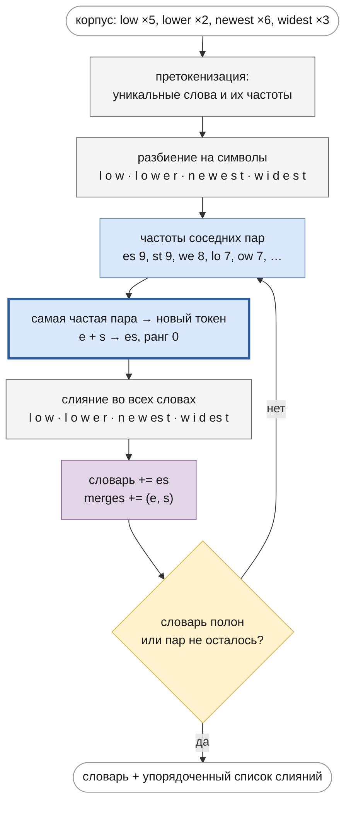
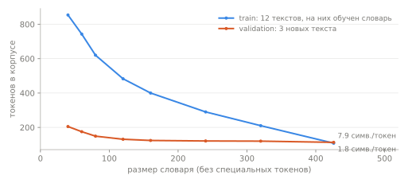
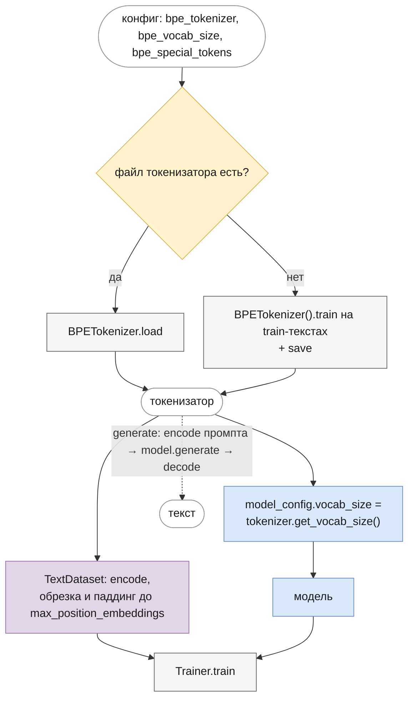

# Токенизация
<!-- description: Как текст превращается в токены: подслова, алгоритм BPE, претокенизация и специальные токены. -->

Часть I · [← Языковое моделирование](language-modeling.md) · [Оглавление](README.md) · [Эмбеддинги →](embeddings.md)

## Что вы узнаете

- Зачем текст режут на токены и чем плохи символы и целые слова в роли токенов.
- Как работает BPE (Byte Pair Encoding): обучение слияний по шагам на полном ручном примере, кодирование нового текста и декодирование.
- Что такое претокенизация, byte-level BPE (GPT-2), SentencePiece и Unigram — и какие токенизаторы у LLaMA, Mistral и Gemma.
- Зачем нужны специальные токены `<pad>`, `<unk>`, `<bos>`, `<eos>`.
- Как размер словаря влияет на число параметров и длину последовательности.
- Как устроены `BaseTokenizer`, `BPETokenizer`, `SimpleBPETokenizer` в `llm/tokenizers` и как их используют эксперименты.

## Предварительные знания

[Языковое моделирование](language-modeling.md): модель работает с последовательностью индексов $`x_0, \dots, x_{T-1}`$ из словаря размера $`V`$ и выдаёт распределение над следующим токеном.

## Зачем нужна токенизация

Нейросеть работает с числами, а текст — строка символов. **Токенизатор** (tokenizer) — это преобразование в обе стороны:

- **кодирование** (encode): строка → последовательность **токенов** (кусочков текста из фиксированного словаря) → последовательность их индексов (id);
- **декодирование** (decode): индексы → строки токенов → исходный текст.

Словарь фиксируется **до** обучения модели и дальше не меняется: от его размера $`V`$ зависят матрица эмбеддингов $`V \times d`$ и выходная проекция $`d \times V`$ ([embeddings.md](embeddings.md)). Поэтому токенизатор обучают отдельно, заранее, а модель с ним — неразлучная пара: веса модели бессмысленны с чужим словарём.

От токенизатора требуется:

1. **Полнота**: любую строку можно закодировать (нет «непредставимых» текстов).
2. **Обратимость**: `decode(encode(s)) == s`, чтобы сгенерированные токены превращались в нормальный текст.
3. **Короткие последовательности**: чем меньше токенов на тот же текст, тем дешевле обучение и генерация и тем больше текста помещается в контекст $`T_{\max}`$.
4. **Разумный размер словаря**: каждый токен — строка матрицы эмбеддингов, и её нужно хорошо обучить.

Требования 3 и 4 тянут в разные стороны — это главный компромисс токенизации.

## Уровни токенизации: символы, слова, подслова

| Уровень | Словарь | «непредсказуемость» | Плюсы | Минусы |
|---|---|---|---|---|
| Символы | ~сотни (алфавиты, цифры, знаки) | 17 токенов | нет неизвестных слов, маленький словарь | длинные последовательности; модели приходится самой собирать слова из букв |
| Слова | сотни тысяч и больше | 1 токен (если слово есть в словаре) | короткие последовательности, токен = единица смысла | огромный словарь; любое новое слово — «неизвестное» |
| Подслова | $`10^4`$–$`2.6 \cdot 10^5`$ | например, `не` `предсказ` `уем` `ость` | частые слова — один токен, редкие собираются из частей | алгоритм сложнее; разбиение не всегда совпадает с морфемами |

(Разбиение на подслова в таблице — иллюстрация, конкретный результат зависит от корпуса.)

### Проблема OOV

При словарном подходе любое слово вне словаря — **OOV** (out-of-vocabulary) — заменяется одним токеном `<unk>`, и информация о нём пропадает. Для языков с богатой морфологией, как русский, это особенно болезненно: у одного существительного десяток форм, у глагола — десятки, и все их нужно держать в словаре отдельно. Новые слова, имена, опечатки, код, числа — всё становится `<unk>`.

### Длина последовательности

Символьная токенизация решает OOV, но делает последовательности в несколько раз длиннее. Для трансформера это дорого вдвойне: стоимость attention растёт как $`T^2`$ ([attention.md](attention.md)), а контекст $`T_{\max}`$ ограничен — в него помещается меньше текста.

**Подслова** (subwords) — компромисс: частые слова и их части становятся одним токеном, а редкое слово раскладывается на несколько частых кусков, в худшем случае на отдельные символы. OOV исчезает (если в словаре есть все символы), а последовательности остаются короткими. Самый распространённый алгоритм построения такого словаря — BPE.

## BPE: Byte Pair Encoding

### История

BPE придуман как алгоритм **сжатия данных** ([Gage, 1994](#литература)): самая частая пара соседних байтов заменяется новым, не встречающимся в данных байтом, и так повторяется, пока есть что сжимать. [Sennrich, Haddow & Birch (2016)](https://arxiv.org/abs/1508.07909) применили ту же идею к словам в нейронном машинном переводе: начинаем с символов и раз за разом **сливаем** (merge) самую частую пару соседних токенов в новый токен. Список слияний, выученный на корпусе, и есть токенизатор.

### Алгоритм обучения

Вход: корпус текстов и желаемый размер словаря. Выход: словарь и **упорядоченный** список слияний.

1. **Претокенизация.** Текст режется на «слова» (подробнее — в разделе [«Претокенизация»](#претокенизация)). Считается частота каждого уникального слова. Слияния не пересекают границы слов.
2. **Начальный словарь** — все символы, встретившиеся в корпусе. Каждое слово представлено как последовательность символов.
3. **Подсчёт пар.** Для каждой пары соседних токенов внутри слов считается частота — сумма частот слов, где пара встречается (с учётом повторов внутри слова).
4. **Слияние.** Самая частая пара $`(a, b)`$ объявляется новым токеном $`ab`$: он добавляется в словарь, пара записывается в список слияний под следующим номером (**рангом**), и во всех словах все вхождения $`a\,b`$ заменяются на $`ab`$.
5. Шаги 3–4 повторяются, пока словарь не достигнет нужного размера или пока не останется пар (каждое слово стало одним токеном).

Формально на шаге 4 выбирается

```math
(a, b)^{*} = \arg\max_{(a, b)} \sum_{w \in \mathcal{W}} f(w) \cdot c_{(a,b)}(w)
```

где:

- $`\mathcal{W}`$ — множество уникальных слов корпуса после претокенизации;
- $`f(w)`$ — частота слова $`w`$ в корпусе;
- $`c_{(a,b)}(w)`$ — сколько раз пара соседних токенов $`(a, b)`$ встречается в текущем разбиении слова $`w`$.

Псевдокод:

```
function train_bpe(texts, vocab_size):
    word_freq ← Counter(pretokenize(text) for text in texts)
    words     ← {w: list(w) for w in word_freq}        # слово → список токенов
    vocab     ← sorted(set of all characters)
    merges    ← []                                     # упорядоченный список пар
    while |vocab| < vocab_size:
        pair_freq ← {}
        for w, symbols in words:
            for (a, b) in adjacent_pairs(symbols):
                pair_freq[(a, b)] += word_freq[w]
        if pair_freq is empty: break                   # все слова — один токен
        (a, b) ← argmax(pair_freq)                     # при равенстве — правило разрешения ничьих
        merges.append((a, b))
        vocab.add(a + b)
        for w in words: replace every "a b" by "ab" in words[w]
    return vocab, merges
```

**Интуиция.** Каждое слияние — жадный шаг сжатия: пара, встречающаяся $`n`$ раз, после слияния экономит $`n`$ токенов в корпусе. Поэтому первыми токенами становятся частые окончания, приставки и короткие слова, а редкие слова так и остаются разбитыми на части.

Тот же цикл схемой, с первым шагом на корпусе из следующего раздела:



### Полный пример

Возьмём корпус из примера в статье Sennrich et al.: слово `low` встречается 5 раз, `lower` — 2, `newest` — 6, `widest` — 3. (В статье к каждому слову добавлен символ конца слова `</w>`; реализация репозитория и GPT-2 вместо него прикрепляют пробел к **началу** следующего слова, поэтому здесь маркера нет.)

**Начальное состояние.** Алфавит — 10 символов: `d e i l n o r s t w`.

```
слово    частота   разбиение
low         5      l o w
lower       2      l o w e r
newest      6      n e w e s t
widest      3      w i d e s t
```

**Шаг 1: подсчёт пар.** Каждая пара получает частоту своего слова:

```
low    (×5): lo +5, ow +5
lower  (×2): lo +2, ow +2, we +2, er +2
newest (×6): ne +6, ew +6, we +6, es +6, st +6
widest (×3): wi +3, id +3, de +3, es +3, st +3

итого: es 9, st 9, we 8, lo 7, ow 7, ne 6, ew 6, wi 3, id 3, de 3, er 2
```

Максимум 9 у двух пар: `es` и `st`. Нужно правило **разрешения ничьих**; в `BPETokenizer` побеждает пара, встреченная первой при обходе слов в порядке их первого появления в корпусе и слева направо внутри слова. `es` встречается в `newest` раньше, чем `st`, поэтому первое слияние — `e + s → es`.

После слияния пара `st` исчезла: `s` теперь внутри `es`. Пара `we` из `newest` превратилась в `w es`. Частоты пар **пересчитываются** на каждом шаге именно поэтому.

**Все шаги:**

| Шаг | Слияние | Частота | Разбиения после шага |
|---|---|---|---|
| 1 | `e` + `s` → `es` | 9 | `l o w` · `l o w e r` · `n e w es t` · `w i d es t` |
| 2 | `es` + `t` → `est` | 9 | `l o w` · `l o w e r` · `n e w est` · `w i d est` |
| 3 | `l` + `o` → `lo` | 7 | `lo w` · `lo w e r` · `n e w est` · `w i d est` |
| 4 | `lo` + `w` → `low` | 7 | `low` · `low e r` · `n e w est` · `w i d est` |
| 5 | `n` + `e` → `ne` | 6 | `low` · `low e r` · `ne w est` · `w i d est` |
| 6 | `ne` + `w` → `new` | 6 | `low` · `low e r` · `new est` · `w i d est` |
| 7 | `new` + `est` → `newest` | 6 | `low` · `low e r` · `newest` · `w i d est` |
| 8 | `w` + `i` → `wi` | 3 | `low` · `low e r` · `newest` · `wi d est` |
| 9 | `wi` + `d` → `wid` | 3 | `low` · `low e r` · `newest` · `wid est` |
| 10 | `wid` + `est` → `widest` | 3 | `low` · `low e r` · `newest` · `widest` |
| 11 | `low` + `e` → `lowe` | 2 | `low` · `lowe r` · `newest` · `widest` |
| 12 | `lowe` + `r` → `lower` | 2 | `low` · `lower` · `newest` · `widest` |

Ничьи по тому же правилу: на шаге 3 — `lo` и `ow` (по 7), на шаге 5 — `ne`, `ew` и `w est` (по 6), на шаге 8 — `wi`, `id`, `d est` (по 3), на шаге 11 — `low e` и `e r` (по 2).

После шага 12 каждое слово — один токен, пар не осталось, и обучение останавливается, даже если запрошенный размер словаря больше: в словаре $`10 + 12 = 22`$ токена. При `vocab_size=20` обучение остановится после шага 10 (10 символов + 10 слияний).

Всё это воспроизводится реальным токенизатором репозитория:

```python
from llm.tokenizers import BPETokenizer

texts = ["low"] * 5 + ["lower"] * 2 + ["newest"] * 6 + ["widest"] * 3
tok = BPETokenizer()
tok.train(texts, vocab_size=20)

print(sorted(tok.merges, key=tok.merges.get))
# [('e', 's'), ('es', 't'), ('l', 'o'), ('lo', 'w'), ('n', 'e'), ('ne', 'w'),
#  ('new', 'est'), ('w', 'i'), ('wi', 'd'), ('wid', 'est')]
print(tok.vocab_list[10:])
# ['es', 'est', 'lo', 'low', 'ne', 'new', 'newest', 'wi', 'wid', 'widest']
print(len(tok), tok.pad_token_id, tok.eos_token_id)
# 24 20 23  — 20 обученных токенов + 4 специальных в конце
```

Обратите внимание: в словаре остались и промежуточные токены (`lo`, `ne`, `wi`, `wid`), хотя в корпусе они больше не встречаются отдельно. Они нужны для кодирования новых слов.

### Кодирование нового текста

Классический способ, из статьи Sennrich et al. и функции `bpe()` в коде GPT-2: **применить выученные слияния в том же порядке**, в каком они были выучены.

1. Претокенизировать текст так же, как при обучении.
2. Каждое слово разбить на символы.
3. Среди всех соседних пар найти пару с **наименьшим рангом** (самым ранним слиянием). Если ни одна пара не встречается в списке слияний — стоп.
4. Слить все её вхождения в слове и вернуться к шагу 3.
5. Заменить токены индексами из словаря.

```python
def bpe_encode_word(word, merges):
    """Применяет слияния по порядку ранга (как функция bpe() в GPT-2)."""
    symbols = list(word)
    while len(symbols) > 1:
        pairs = list(zip(symbols, symbols[1:]))
        best = min(pairs, key=lambda p: merges.get(p, float("inf")))
        if best not in merges:
            break                                   # применимых слияний не осталось
        symbols = BPETokenizer._merge_pair(symbols, best, best[0] + best[1])
    return symbols

print(bpe_encode_word("lowest", tok.merges))   # ['low', 'est']
print(bpe_encode_word("nest", tok.merges))     # ['n', 'est']
```

(`tok.merges` — словарь `пара → ранг` из `BPETokenizer`, `_merge_pair` — его статический метод замены пары.)

Разберём `lowest` вручную. Пары `l o`, `o w`, `w e`, `e s`, `s t`; из них в списке слияний `e s` (ранг 0) и `l o` (ранг 2). Самый ранний — `e s`: `l o w es t`. Теперь есть `es t` (ранг 1): `l o w est`. Затем `l o` (2): `lo w est`, затем `lo w` (3): `low est`. Пары `low est` в списке нет — готово: **`low` + `est`**. Слово `lowest` не встречалось в корпусе, но закодировано двумя осмысленными частями.

Слово `nest`: `n e s t` → `n es t` → `n est`. Пары `n e` больше нет (буква `e` ушла в `est`), пары `n est` нет в списке — результат **`n` + `est`**.

**Почему порядок важен.** Слияния выучены на корпусе, где каждое следующее применялось к результату предыдущих. Применяя их в том же порядке, мы разбиваем новое слово так же, как было бы разбито такое слово в обучающем корпусе.

### Как кодирует BPETokenizer репозитория

`BPETokenizer.encode` ([`tokenizers/bpe_tokenizer.py`](../../llm/src/llm/tokenizers/bpe_tokenizer.py)) делает ровно это: после претокенизации каждое слово разбивает метод `_bpe_word` — тот же цикл, что `bpe_encode_word` выше. Слово из обучающего корпуса поэтому разбивается так же, как в конце обучения, а разбиение совпадает с эталонным BPE из библиотеки HuggingFace `tokenizers` на тех же словаре и слияниях (это проверяет тест). Разбиение слова запоминается на время вызова `encode`: повторяющиеся слова не разбираются заново.

Есть и другой, на первый взгляд похожий способ: идти по слову слева направо и на каждой позиции брать **самый длинный токен словаря**, с которого начинается остаток слова. Это жадный longest-match — так кодирует текст WordPiece-токенизатор BERT (применение WordPiece в нейронном переводе описано у [Wu et al., 2016](https://arxiv.org/abs/1609.08144)); список слияний он не использует. Часто результаты совпадают, но не всегда:

| Слово | По порядку слияний (`BPETokenizer`) | Жадный longest-match |
|---|---|---|
| `lowest` | `low` `est` | `low` `est` |
| `newest` | `newest` | `newest` |
| `nest` | `n` `est` | `ne` `s` `t` |

В `nest` жадный поиск с позиции 0 находит самый длинный подходящий токен `ne`, после чего `est` уже не собрать, и остаются отдельные `s` и `t`. Перебор всех строк длины 2–6 из алфавита этого примера находит 4 320 таких расхождений (около 0.4 % строк). Оба способа дают корректное, обратимое кодирование; различается только разбиение (и иногда число токенов). Но модель, обученная с одним способом, видит при другом непривычные разбиения, поэтому для загрузки чужих весов нужен **в точности** их токенизатор. Кроме того, наивный жадный поиск перебирает весь словарь на каждой позиции — $`O(n \cdot V)`$ для текста из $`n`$ символов.

`BPETokenizer` кодирует жадным поиском только в одном случае — если у него **нет слияний**: в файлах старого формата без поля `merges` по одному словарю порядок слияний не восстановить. Чтобы кодировать по слияниям, такой токенизатор нужно переобучить.

### Декодирование

Декодирование в BPE тривиально: индексы заменяются строками токенов, строки склеиваются. Так как претокенизация сохраняет пробелы внутри «слов» (` мир`), а слияния только склеивают строки, `"".join(tokens)` восстанавливает исходный текст — если в нём не было неизвестных символов. В репозитории это `BPETokenizer.decode`: `"".join(self._ids_to_tokens(ids))`, по умолчанию с выбрасыванием специальных токенов (`skip_special_tokens=True`).

## Претокенизация

Перед BPE текст режут на «слова» — **претокенизация** (pre-tokenization). Без неё самые частые пары оказались бы на стыках слов (`о␣`, `␣и`), и в словарь попали бы токены вроде `а␣в`, склеивающие хвост одного слова с началом другого. GPT-2 ([Radford et al., 2019](https://cdn.openai.com/better-language-models/language_models_are_unsupervised_multitask_learners.pdf), разд. 2.2) приводит пример: без ограничений BPE выучил бы отдельные токены `dog.`, `dog!`, `dog?` и тратил бы на такие варианты место в словаре.

В `BPETokenizer` претокенизацию выполняет функция `pretokenize` с регулярным выражением

```
 ?\w+| ?[^\s\w]+|\s+(?!\S)|\s+
```

Альтернативы по порядку:

| Шаблон | Что захватывает |
|---|---|
| ` ?\w+` | слово (буквы, цифры, `_`) с одним пробелом **перед** ним |
| ` ?[^\s\w]+` | серия знаков препинания/символов, тоже с пробелом перед ней |
| `\s+(?!\S)` | пробелы, после которых нет непробельного символа (лишние пробелы перед словом, хвост строки) |
| `\s+` | остальные пробельные символы (например, одиночный перевод строки перед словом) |

Примеры (реальный вывод `pretokenize`):

```
"Привет, мир!"      → ['Привет', ',', ' мир', '!']
"Hello  world\n"    → ['Hello', ' ', ' world', '\n']
"GPT-2 (2019)"      → ['GPT', '-', '2', ' (', '2019', ')']
"don't stop"        → ['don', "'", 't', ' stop']
"abc123 x_y"        → ['abc123', ' x_y']
```

Свойства:

- **Конкатенация кусков даёт исходный текст** — это и обеспечивает обратимость декодирования.
- **Пробел — часть следующего слова.** Поэтому `the` в начале текста и ` the` в середине — разные токены. На корпусе `["the cat sat on the mat", "the dog sat on the log", "a cat and a dog"]` `BPETokenizer` выучивает и `the`, и ` the`; `"the cat sat"` кодируется как `['the', ' cat', ' sat']`.
- **Два пробела подряд**: первый уходит отдельным куском, второй прикрепляется к слову (`' '`, `' world'`) — так слово сохраняет привычный токен с одним пробелом.

**Отличия от GPT-2.** Регулярное выражение GPT-2 (`encoder.py` в репозитории openai/gpt-2) отдельно выделяет английские сокращения (`'s`, `'t`, `'re`, `'ve`, `'m`, `'ll`, `'d`) и разделяет буквы и цифры (`\p{L}+` и `\p{N}+`). В `pretokenize` сокращений нет (`don't` → `don` `'` `t`), а `\w` объединяет буквы, цифры и подчёркивание (`abc123` — одно слово). Идея та же: пробел в начале слова, пунктуация отдельно, слияния внутри слова.

## Byte-level BPE (GPT-2)

У символьного BPE остаётся проблема: алфавит Unicode огромен (около 150 000 символов), и символ, которого не было в корпусе (редкий иероглиф, эмодзи), всё равно даёт `<unk>`. GPT-2 ([Radford et al., 2019](https://cdn.openai.com/better-language-models/language_models_are_unsupervised_multitask_learners.pdf), разд. 2.2) применяет BPE не к символам, а к **байтам** UTF-8:

- начальный словарь — ровно 256 байтов, и любой текст в UTF-8 — последовательность байтов, поэтому `<unk>` не нужен вовсе;
- поверх байтов учатся слияния; словарь GPT-2 — $`50\,257`$ токенов: 256 байтов, 50 000 слияний и специальный токен `<|endoftext|>`;
- чтобы не сливать байты разных категорий символов, используется претокенизация (см. выше);
- технически байты отображаются в печатные символы Unicode (функция `bytes_to_unicode` в коде GPT-2), чтобы с ними можно было работать как со строками.

Цена — длина последовательности для нелатинских письменностей: буква кириллицы в UTF-8 занимает 2 байта (`"мир"` — 6 байтов), иероглиф — 3. Если в корпусе токенизатора мало текстов на языке, слияний для него выучено мало, и тот же смысл кодируется в несколько раз большим числом токенов, чем по-английски ([Petrov et al., 2023](https://arxiv.org/abs/2305.15425)).

`BPETokenizer` репозитория — **символьный** BPE: начальный словарь — символы Unicode из корпуса, неизвестный символ кодируется как `<unk>`.

## SentencePiece и Unigram

**SentencePiece** ([Kudo & Richardson, 2018](https://arxiv.org/abs/1808.06226)) — библиотека токенизации, которая работает с сырым текстом без внешней претокенизации: пробел считается обычным символом и заменяется видимым `▁` (U+2581), поэтому декодирование обратимо и не зависит от языка (важно для языков без пробелов — японского, китайского). SentencePiece реализует два алгоритма: BPE и Unigram.

**Unigram language model** ([Kudo, 2018](https://arxiv.org/abs/1804.10959)) устроен наоборот по сравнению с BPE. Словарь не растёт слияниями, а **сокращается**: начинают с большого набора кандидатов (например, частых подстрок) и удаляют те, без которых правдоподобие корпуса падает меньше всего. Вероятность разбиения $`\mathbf{s} = (s_1, \dots, s_M)`$ считается как произведение независимых вероятностей токенов:

```math
P(\mathbf{s}) = \prod_{i=1}^{M} p(s_i), \qquad \mathbf{s}^{*}(X) = \arg\max_{\mathbf{s} \in S(X)} P(\mathbf{s})
```

где:

- $`X`$ — слово или предложение (строка текста; здесь это не матрица скрытых состояний из [notation.md](notation.md)), $`S(X)`$ — множество всех его разбиений на токены словаря;
- $`s_i`$ — $`i`$-й токен разбиения, $`M`$ — число токенов;
- $`p(s_i)`$ — вероятность токена, $`\sum_{s \in \text{словарь}} p(s) = 1`$; оценивается EM-алгоритмом по корпусу;
- $`\mathbf{s}^{*}(X)`$ — наиболее вероятное разбиение; ищется алгоритмом Витерби (динамическое программирование).

Unigram даёт не одно разбиение, а распределение над ними. Kudo использует это для **subword regularization**: при обучении модели разбиения сэмплируются, и модель становится устойчивее к вариантам разбиения.

**Токенизаторы моделей из пособия:**

| Модель | Токенизатор | Словарь |
|---|---|---|
| GPT-1 | BPE, 40 000 слияний ([Radford et al., 2018](https://cdn.openai.com/research-covers/language-unsupervised/language_understanding_paper.pdf), разд. 4.1) | 40 478 |
| GPT-2 | byte-level BPE (разд. 2.2) | 50 257 |
| LLaMA | BPE в реализации SentencePiece; числа разбиваются на отдельные цифры, неизвестные символы UTF-8 раскладываются на байты — byte fallback ([Touvron et al., 2023](https://arxiv.org/abs/2302.13971), разд. 2.1) | 32 000 ([Llama 2](https://arxiv.org/abs/2307.09288), разд. 2.2: тот же токенизатор) |
| Mistral, Mixtral | SentencePiece (опубликованный `tokenizer.model`) | 32 000 (табл. 1 статей) |
| Gemma | подмножество SentencePiece-токенизатора Gemini; цифры разбиваются, лишние пробелы не удаляются, неизвестные символы — байтами ([Gemma Team, 2024](https://arxiv.org/abs/2403.08295)) | 256 000 |

В этом репозитории модели этими токенизаторами не пользуются: эксперименты `experiments/llm_only` обучают один общий `BPETokenizer`, а при загрузке весов HuggingFace индексы получают токенизатором из `transformers` (см. главы [LLaMA](llama.md#загрузка-весов-huggingface) и [Mistral](mistral.md#загрузка-весов-huggingface)).

## Специальные токены

Кроме кусочков текста, в словаре есть **специальные токены** — служебные символы, которые не встречаются в обычном тексте:

| Токен | Назначение | Где в репозитории |
|---|---|---|
| `<pad>` | **паддинг**: дополняет короткие последовательности до общей длины батча. На pad-позиции модели смотреть нельзя (маска) и учить их не нужно (метка `-100`) | `TextDataset` дополняет `input_ids` значением `pad_token_id`, `labels` — значением `-100`, и возвращает `attention_mask`; маски — в [masks.md](masks.md) |
| `<unk>` | **неизвестный** токен: замена символа, которого нет в словаре | `BPETokenizer.encode` подставляет `unk_token_id` вместо неизвестного символа |
| `<bos>` | **начало последовательности** (begin of sequence): даёт модели «пустой» контекст, чтобы предсказать первый настоящий токен; отмечает начало документа | `encode(..., add_special_tokens=True)`; `TextWithSpecialTokensDataset(add_bos=True)` |
| `<eos>` | **конец последовательности** (end of sequence): модель учится его генерировать, когда текст закончен; по нему останавливается генерация и разделяются документы в потоке | `encode(..., add_special_tokens=True)`; `generate(..., eos_token_id=...)` — [generation.md](generation.md) |

В разных моделях специальные токены называются по-разному: у GPT-2 единственный `<|endoftext|>` служит и началом, и концом, и разделителем документов; у LLaMA — `<s>` и `</s>`. Byte-level токенизаторам и токенизаторам с byte fallback `<unk>` практически не нужен.

Специальные токены — такие же строки матрицы эмбеддингов, как и обычные: модель выучивает их векторы. Важно, чтобы при обучении и при генерации они использовались одинаково.

## Размер словаря: компромисс

Размер словаря $`V`$ — гиперпараметр, который влияет сразу на несколько величин.

**Параметры.** Матрица эмбеддингов и выходная проекция:

```math
N_{\text{emb}} = V \cdot d, \qquad N_{\text{head}} = V \cdot d \;(+V \text{ при bias})
```

где $`V`$ — размер словаря, $`d`$ — размерность модели (`embed_dim`). С weight tying обе матрицы — одна ([embeddings.md](embeddings.md)).

| Модель | $`V`$ | $`d`$ | $`V \cdot d`$ |
|---|---|---|---|
| GPT-2 124M | 50 257 | 768 | 38.6M (≈ 31% модели) |
| LLaMA 7B | 32 000 | 4 096 | 131M |
| Gemma 2B | 256 000 | 2 048 | 524M |

**Вычисления на токен.** Выходная проекция стоит $`d \cdot V`$ умножений-сложений на каждую позицию, а softmax и cross-entropy — $`O(V)`$. При малом $`d`$ и большом $`V`$ голова может стоить больше всех блоков.

**Длина последовательности.** Чем больше $`V`$, тем длиннее средний токен и тем меньше $`T`$ для того же текста. Это ускоряет attention ($`O(T^2)`$) и позволяет уместить больше текста в контекст $`T_{\max}`$.

**Обученность редких токенов.** Частоты токенов распределены очень неравномерно. При огромном словаре многие токены редки, их эмбеддинги получают мало градиентных обновлений и остаются плохо обученными.

Эффект хорошо виден на учебном корпусе `experiments/llm_only` (12 обучающих строк на русском, 854 символа; ещё 3 строки — валидация): начальный алфавит — 50 символов.

| `vocab_size` | обучено токенов | токенов на train | символов на токен (train) | символов на токен (val) |
|---|---|---|---|---|
| 50 | 50 (только символы) | 854 | 1.00 | 1.00 |
| 100 | 100 | 548 | 1.56 | 1.46 |
| 200 | 200 | 331 | 2.58 | 1.63 |
| 300 | 300 | 231 | 3.70 | 1.65 |
| 1000 | 422 (остановка) | 108 | 7.91 | 1.75 |



На train при `vocab_size=1000` обучение останавливается на 422 токенах: каждое из 82 уникальных «слов» корпуса (всего в train 108 словоупотреблений — отсюда 108 токенов) стало одним токеном, и строка — это просто последовательность слов. На валидации выигрыш почти исчез: 1.75 символа на токен, потому что незнакомые слова распадаются на буквы и короткие куски. Токенизатор **переобучился** — выучил слова корпуса, а не общие части слов. На реальных корпусах в миллиарды символов такого не происходит, но принцип тот же: слишком большой словарь на слишком маленьком корпусе бесполезен.

## Реализация в репозитории

Модуль [`llm/src/llm/tokenizers/`](../../llm/src/llm/tokenizers) экспортирует три класса:

```python
from llm.tokenizers import BaseTokenizer, BPETokenizer, SimpleBPETokenizer
```

### BaseTokenizer

Абстрактный базовый класс ([`base_tokenizer.py`](../../llm/src/llm/tokenizers/base_tokenizer.py)). Хранит:

- `vocab: Dict[str, int]` — строка токена → id; `inverse_vocab: Dict[int, str]` — обратно; `vocab_size: int`;
- имена специальных токенов `pad_token = "<pad>"`, `unk_token = "<unk>"`, `bos_token = "<bos>"`, `eos_token = "<eos>"` и их id `pad_token_id`, `unk_token_id`, `bos_token_id`, `eos_token_id` (`None`, пока токен не добавлен в словарь).

| Метод | Что делает |
|---|---|
| `train(texts, vocab_size=1000, **kwargs)` | абстрактный: обучение на списке строк |
| `encode(text, **kwargs) -> List[int]` | абстрактный: текст → id |
| `decode(tokens, **kwargs) -> str` | абстрактный: id → текст |
| `tokenize(text, **kwargs) -> List[str]` | `encode`, затем id → строки токенов через `inverse_vocab` |
| `get_vocab()`, `get_vocab_size()`, `len(tok)` | копия словаря, размер словаря |
| `add_special_tokens(special_tokens)` | добавляет отсутствующие токены в **конец** словаря (`id = len(vocab)`) и обновляет четыре `*_token_id` |
| `save(filepath)` / `load(filepath)` | JSON со словарём, размером и именами специальных токенов |

### BPETokenizer

[`bpe_tokenizer.py`](../../llm/src/llm/tokenizers/bpe_tokenizer.py), наследник `BaseTokenizer`. Дополнительные поля: `merges: Dict[Tuple[str, str], int]` — пара → ранг слияния, `vocab_list: List[str]` — токены в порядке id.

**`train(texts, vocab_size=1000, special_tokens=[...])`** — алгоритм из раздела «Алгоритм обучения»:

- `pretokenize` каждого текста, `Counter` частот слов;
- начальный словарь — отсортированные уникальные символы;
- цикл `while len(tokens) < vocab_size`: частоты пар с учётом частоты слова, самая частая пара через `max(pair_freq, key=pair_freq.get)` (ничья — первая встреченная), замена пары во всех словах (`_merge_pair`); выход, если пар не осталось;
- если одна и та же строка получается разными слияниями (`а`+`бв` и `аб`+`в`), в словарь она добавляется один раз, а в `merges` записываются оба слияния;
- после цикла — специальные токены через `add_special_tokens`. По умолчанию это `["<pad>", "<unk>", "<bos>", "<eos>"]`; список можно передать ключом `special_tokens`.

Итоговый размер: `vocab_size` в `train` — число **обученных** токенов, без специальных; `len(tokenizer)` = обученные + специальные (в примере выше 20 + 4 = 24). Если символов в корпусе больше `vocab_size`, слияний не будет вовсе, а в словарь попадут все символы. Id раскладываются так: сначала символы (по алфавиту), затем токены слияний в порядке обучения, в конце специальные.

**`encode(text, add_special_tokens=False)`**:

1. `pretokenize(text)`;
2. каждое слово — применение слияний по порядку ранга (`_bpe_word`; у токенизатора без слияний — жадный longest-match по `vocab_list`, см. [«Как кодирует BPETokenizer репозитория»](#как-кодирует-bpetokenizer-репозитория));
3. символ, которого нет в словаре, становится `unk_token_id`; если `<unk>` в словаре нет — `ValueError`;
4. при `add_special_tokens=True` — `bos_token_id` в начало и `eos_token_id` в конец (если они есть в словаре).

Специальные токены **внутри текста не распознаются**: строка `"<eos>"` в тексте разбивается как обычные символы `<`, `eos`, `>`. Специальный токен можно вставить только по id.

**`decode(tokens, skip_special_tokens=True)`**: принимает список, `torch.Tensor` или `numpy`-массив (через `.tolist()`); по умолчанию выбрасывает все четыре специальных id — включая `<unk>`, поэтому неизвестные символы при декодировании **молча пропадают**; склеивает строки токенов. Неизвестный id декодируется в строку `<unk>`.

**`save(filepath)` / `load(filepath)`** — JSON:

```json
{
  "vocab": {"d": 0, "e": 1, "...": "...", "widest": 19, "<pad>": 20, "<unk>": 21, "<bos>": 22, "<eos>": 23},
  "vocab_size": 24,
  "pad_token": "<pad>", "unk_token": "<unk>", "bos_token": "<bos>", "eos_token": "<eos>",
  "tokenizer_type": "BPETokenizer",
  "merges": [["e", "s"], ["es", "t"], ["l", "o"], "..."],
  "vocab_list": ["d", "e", "...", "widest"]
}
```

Слияния хранятся списком пар в порядке ранга: пара `[левый, правый]` переживает JSON без потерь, даже если токен содержит запятую. `load` восстанавливает `merges` из этого списка, а также понимает старый формат — словарь `{"a,b": ранг}`. `vocab_list` содержит только обученные токены (без специальных) — именно по нему идёт поиск при кодировании.

`BaseTokenizer.save` сохраняет только словарь и специальные токены, без `merges` и `vocab_list`; `BPETokenizer` переопределяет оба метода. Загружать BPE-токенизатор нужно через `BPETokenizer.load`.

### SimpleBPETokenizer

`class SimpleBPETokenizer(BPETokenizer): pass` — псевдоним без отличий: наследует всю реализацию `BPETokenizer`. Оставлен для совместимости и демонстраций.

### Полный цикл

```python
from llm.tokenizers import BPETokenizer

texts = ["the cat sat on the mat", "the dog sat on the log", "a cat and a dog"]
tok = BPETokenizer()
tok.train(texts, vocab_size=40, special_tokens=["<pad>", "<unk>", "<bos>", "<eos>"])

ids = tok.encode("the cat sat", add_special_tokens=True)
print(tok.tokenize("the cat sat"))                     # ['the', ' cat', ' sat']
print(tok.decode(ids))                                 # 'the cat sat' — <bos>/<eos> выброшены
print(tok.decode(ids, skip_special_tokens=False))      # '<bos>the cat sat<eos>'

tok.save("bpe_tokenizer.json")
tok2 = BPETokenizer.load("bpe_tokenizer.json")
assert tok2.encode("the cat sat") == tok.encode("the cat sat")
```

(При `vocab_size=40` обучение остановится на 33 токенах — 13 символов и 20 слияний: к этому моменту все 11 уникальных «слов» корпуса (`the`, ` the`, ` cat`, `a`, ` a`, …) стали отдельными токенами.)

## Токенизатор в экспериментах

Скрипт [`experiments/llm_only/run_llm_experiment.py`](../../experiments/llm_only/run_llm_experiment.py) использует `BPETokenizer` так:



1. **`train`**: если по пути `config["bpe_tokenizer"]` (во всех конфигах — `checkpoints/bpe_tokenizer.json`) уже есть файл, токенизатор загружается `BPETokenizer.load`; иначе обучается на train-части корпуса `TRAIN_TEXTS` из `experiments/shared/configs.py` с `vocab_size=config["bpe_vocab_size"]` (1000) и `special_tokens=config["bpe_special_tokens"]` и сохраняется. Токенизатор общий для всех шести моделей: при повторных запусках `bpe_vocab_size` уже не применяется.
2. Для каждого `test_prompts` печатается `encode` → `decode` — быстрая проверка обратимости.
3. `model_config["vocab_size"] = tokenizer.get_vocab_size()` — размер словаря модели берётся из токенизатора (с учётом специальных токенов; на встроенном корпусе 422 + 4 = 426).
4. `TextDataset(train_texts, tokenizer, block_size=model_config["max_position_embeddings"])` кодирует каждую строку (`add_special_tokens=False`), обрезает или дополняет её `pad_token_id` до `block_size`; на pad-позициях `labels = -100`, так что паддинг не входит в loss.
5. **`generate`**: `tokenizer.encode(prompt, add_special_tokens=False)` → `model.generate(...)` → `tokenizer.decode(generated_ids[0].tolist())`.

**Тонкость.** Корпус `TRAIN_TEXTS` — русский, поэтому промпты `test_prompts` в конфигах тоже русские и составлены из символов обучающей части корпуса. Латинских букв в корпусе почти нет, и английский промпт кодировался бы в основном в `<unk>`: `"GPT language model"` → `['GPT', ' ', '<unk>', '<unk>', 'n', ...]`, а при декодировании `<unk>` выбрасываются, и печатается обрывок `GPT n o`. Это не ошибка токенизатора, а следствие символьного BPE на маленьком корпусе: символов, которых не было при обучении, в словаре нет. Byte-level BPE такой проблемы не имеет.

## Типичные ошибки и тонкости

- **Модель и токенизатор — пара.** Веса, обученные с одним словарём, бессмысленны с другим, даже если размер словаря совпадает: id означают другие строки. После переобучения токенизатора модель нужно обучать заново.
- **`vocab_size` модели — из токенизатора**, с учётом специальных токенов: `tokenizer.get_vocab_size()`, а не значение `bpe_vocab_size` из конфига. Иначе id специальных токенов выйдут за пределы матрицы эмбеддингов.
- **Нет `<unk>` в словаре.** Если обучить `BPETokenizer` со своим списком `special_tokens` без `"<unk>"`, то `unk_token_id` равен `None`, и на тексте с неизвестным символом `encode` бросает `ValueError` со списком таких символов. Без этой проверки на месте символа оказался бы `None`, и падение случилось бы позже — при превращении списка в тензор.
- **Неизвестные символы пропадают при декодировании** (`skip_special_tokens=True` выбрасывает и `<unk>` — так же, как `skip_special_tokens` в HuggingFace). Проверка «`decode(encode(s)) == s`» выявляет их; `decode(ids, skip_special_tokens=False)` показывает `<unk>` на их месте.
- **`pad_token_id` — не 0.** Специальные токены добавляются в конец словаря, поэтому `<pad>` получает id, равный числу обученных токенов (в примере — 20). Код, который считает паддингом нули, ошибётся.
- **Пробел в начале слова.** `"мир"` и `" мир"` — разные токены. Промпт с пробелом на конце (`"The Llama model is "`) заканчивается отдельным токеном пробела, которого модель почти не видела в конце текста — генерация от этого страдает.
- **Разные способы кодирования.** Порядок слияний и жадный longest-match дают разные разбиения (см. `nest`). Сравнивать с чужими токенизаторами «токен в токен» нельзя. Модель, обученная, когда `BPETokenizer` кодировал жадным поиском, на словах, которые при обучении токенизатора не слились в один токен, теперь видит другие разбиения.

## Итоги

- Токенизатор переводит текст в индексы словаря и обратно; словарь фиксируется до обучения модели.
- Подслова — компромисс между символами (длинные последовательности) и словами (огромный словарь, OOV).
- BPE учит упорядоченный список слияний самых частых пар внутри слов; новый текст кодируют, применяя слияния по порядку ранга, — так кодирует и `BPETokenizer` репозитория.
- Претокенизация в стиле GPT-2 прикрепляет пробел к началу слова и не даёт слияниям пересекать границы слов.
- Byte-level BPE (GPT-2) избавляется от `<unk>`; SentencePiece (LLaMA, Mistral, Gemma) работает с сырым текстом и поддерживает BPE и Unigram.
- Размер словаря влияет на число параметров ($`V \cdot d`$ на эмбеддинги и столько же на голову), стоимость выходной проекции и длину последовательностей.

## Вопросы и упражнения

1. Продолжите пример из раздела «Полный пример»: какое слияние будет одиннадцатым при `vocab_size=21` и почему? Сколько токенов будет в `len(tok)`?

<details><summary>Ответ</summary>

После шага 10 остались пары `low e` и `e r` (по 2, обе из `lower`). Ничья разрешается в пользу первой встреченной — `low e`, новый токен `lowe`. Обученных токенов 21, со специальными `len(tok) = 25`.

</details>

2. Закодируйте слова `widen` и `newer` двумя способами — применением слияний по порядку и жадным longest-match — по словарю из примера с `vocab_size=20`. Совпадают ли результаты?

<details><summary>Ответ</summary>

`widen`: по слияниям `w i d e n` → (`w i`, ранг 7) `wi d e n` → (`wi d`, ранг 8) `wid e n`; дальше применимых пар нет: `wid` `e` `n`. Longest-match: с позиции 0 самый длинный подходящий токен `wid`, затем `e`, `n` — то же. `newer`: по слияниям `n e w e r` → (`n e`, ранг 4) `ne w e r` → (`ne w`, ранг 5) `new e r`: `new` `e` `r`; longest-match даёт то же. Совпадают.

</details>

3. Почему при обучении с `vocab_size=1000` на корпусе `experiments/llm_only` словарь получается всего 422 токена (426 со специальными)?

<details><summary>Ответ</summary>

Слияния идут только внутри слов после претокенизации. Когда каждое уникальное «слово» корпуса стало одним токеном, пар для слияния не осталось, и цикл `train` прерывается (`if not pair_freq: break`), не дойдя до 1000.

</details>

4. Сколько параметров занимает матрица эмбеддингов у модели с $`V = 32\,000`$, $`d = 4096`$? Сколько добавит отдельная выходная проекция с bias?

<details><summary>Ответ</summary>

$`32\,000 \cdot 4096 = 131\,072\,000 \approx 131`$M. Отдельная голова с bias: ещё $`131\,072\,000 + 32\,000 = 131\,104\,000`$. С weight tying голова не добавляет параметров матрицы (только bias, если он есть).

</details>

5. Сколько байтов UTF-8 занимает слово `привет`? Сколько начальных токенов было бы у него в byte-level BPE и в символьном BPE?

<details><summary>Ответ</summary>

Шесть букв кириллицы по 2 байта — 12 байтов. Byte-level BPE начинает с 12 байтовых токенов, символьный — с 6 символов. Итоговое число токенов зависит от выученных слияний.

</details>

6. Что вернёт `decode(encode("lowZ"))` для токенизатора из примера? Почему? Как увидеть, что символ был потерян?

<details><summary>Ответ</summary>

`"low"`. `Z` нет в словаре, `encode` даёт `[13, 21]` (`low`, `<unk>`), а `decode` по умолчанию выбрасывает специальные токены, включая `<unk>`. Увидеть потерю можно через `decode(ids, skip_special_tokens=False)` → `"low<unk>"` или проверкой `unk_token_id in ids`.

</details>

7. Объясните, почему токенизатор без претокенизации на корпусе «кот сидит. кот спит.» мог бы выучить токен `т␣с`, и чем это плохо.

<details><summary>Ответ</summary>

Пара `т` + `␣` (конец «кот» и пробел) и затем `␣с` встречаются часто, и BPE сольёт их через границу слов. Такой токен склеивает хвост одного слова с началом другого: он не переносится на другие контексты, занимает место в словаре и мешает модели видеть слова как единицы.

</details>

8. (Код.) Реализуйте метод кодирования по порядку слияний (функция `bpe_encode_word` выше) для целого текста с претокенизацией и сравните, сколько токенов он даёт на валидационной части корпуса `experiments/llm_only` по сравнению с `BPETokenizer.encode`.

## Литература

- Gage, P. *A New Algorithm for Data Compression*. The C Users Journal 12(2), 1994.
- Sennrich, Haddow, Birch. *Neural Machine Translation of Rare Words with Subword Units*. ACL 2016. [arXiv:1508.07909](https://arxiv.org/abs/1508.07909)
- Radford, Narasimhan, Salimans, Sutskever. *Improving Language Understanding by Generative Pre-Training*. OpenAI, 2018. [PDF](https://cdn.openai.com/research-covers/language-unsupervised/language_understanding_paper.pdf)
- Radford, Wu, Child, Luan, Amodei, Sutskever. *Language Models are Unsupervised Multitask Learners*. OpenAI, 2019. [PDF](https://cdn.openai.com/better-language-models/language_models_are_unsupervised_multitask_learners.pdf)
- Wu et al. *Google's Neural Machine Translation System: Bridging the Gap between Human and Machine Translation*. 2016. [arXiv:1609.08144](https://arxiv.org/abs/1609.08144) — WordPiece
- Kudo. *Subword Regularization: Improving Neural Network Translation Models with Multiple Subword Candidates*. ACL 2018. [arXiv:1804.10959](https://arxiv.org/abs/1804.10959)
- Kudo, Richardson. *SentencePiece: A simple and language independent subword tokenizer and detokenizer for Neural Text Processing*. EMNLP 2018. [arXiv:1808.06226](https://arxiv.org/abs/1808.06226)
- Touvron et al. *LLaMA: Open and Efficient Foundation Language Models*. 2023. [arXiv:2302.13971](https://arxiv.org/abs/2302.13971)
- Touvron et al. *Llama 2: Open Foundation and Fine-Tuned Chat Models*. 2023. [arXiv:2307.09288](https://arxiv.org/abs/2307.09288)
- Jiang et al. *Mistral 7B*. 2023. [arXiv:2310.06825](https://arxiv.org/abs/2310.06825)
- Jiang et al. *Mixtral of Experts*. 2024. [arXiv:2401.04088](https://arxiv.org/abs/2401.04088)
- Gemma Team. *Gemma: Open Models Based on Gemini Research and Technology*. 2024. [arXiv:2403.08295](https://arxiv.org/abs/2403.08295)
- Petrov, La Malfa, Torr, Bibi. *Language Model Tokenizers Introduce Unfairness Between Languages*. 2023. [arXiv:2305.15425](https://arxiv.org/abs/2305.15425)
