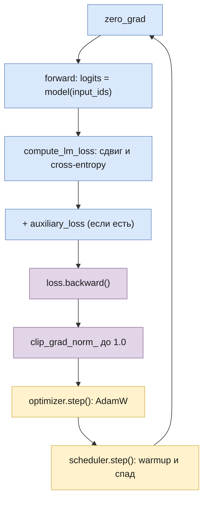

# Обучение

Часть I · [← Mixture-of-Experts](mixture-of-experts.md) · [Оглавление](README.md) · [Генерация →](generation.md)

> Реализация: [`llm/src/llm/training/trainer.py`](../llm/src/llm/training/trainer.py) (класс `Trainer`), [`training/optimizer.py`](../llm/src/llm/training/optimizer.py) (`get_optimizer`), [`training/scheduler.py`](../llm/src/llm/training/scheduler.py) (`get_linear_schedule_with_warmup`), [`core/weight_init.py`](../llm/src/llm/core/weight_init.py), [`datasets/`](../llm/src/llm/datasets)

## Что вы узнаете

- Какую функцию минимизирует обучение языковой модели и как тексты превращаются в батчи `input_ids`/`labels`.
- Почему градиент cross-entropy по логитам равен $`p - y`$ и как autograd доводит его до каждого веса.
- Как устроены SGD, момент, Adam и AdamW, чем weight decay в AdamW отличается от L2-регуляризации и что из этого реализовано в `get_optimizer`.
- Зачем нужны warmup, линейный спад learning rate, gradient clipping и правильная инициализация; откуда берётся начальный loss $`\approx \ln V`$.
- Что такое dropout, вспомогательный loss MoE, форматы float32/float16/bfloat16 и сколько памяти занимает обучение.
- Как по шагам работает `Trainer`, как запустить обучение и что делать, если loss не падает или стал NaN.

## Предварительные знания

- [Языковое моделирование](language-modeling.md): авторегрессия, cross-entropy, перплексия, teacher forcing.
- [Эмбеддинги](embeddings.md): выходная проекция и логиты.
- [Нормализация](normalization.md): post-LN и pre-LN — нужны для разговора о warmup.
- [Mixture-of-Experts](mixture-of-experts.md): load-balancing loss.
- Производная сложной функции (цепное правило) из курса математического анализа.

## Задача обучения

### Функция потерь

Модель с параметрами $`\theta`$ для каждой позиции $`t`$ выдаёт распределение $`p_\theta(\cdot \mid x_0, \dots, x_t)`$ над словарём. Обучение — это подбор $`\theta`$, при котором реальный следующий токен получает высокую вероятность. Формально минимизируется **средняя cross-entropy** (средний отрицательный логарифм правдоподобия) по всем предсказаниям в батче:

```math
\mathcal{L}(\theta) = -\frac{1}{|\mathcal{M}|} \sum_{(b,\,t) \in \mathcal{M}} \log p_\theta\!\left(x^{(b)}_{t+1} \,\middle|\, x^{(b)}_0, \dots, x^{(b)}_t\right)
```

где:

- $`b`$ — номер последовательности в батче, $`0 \le b < B`$;
- $`t`$ — позиция, на которой делается предсказание, $`0 \le t \le T-2`$ (для последней позиции $`T-1`$ нет «следующего» токена);
- $`x^{(b)}_{t+1}`$ — правильный следующий токен (индекс в словаре);
- $`\mathcal{M}`$ — множество пар $`(b, t)`$, участвующих в loss: все позиции, кроме тех, чья метка равна `-100` (см. ниже); $`|\mathcal{M}| \le B \cdot (T-1)`$;
- $`p_\theta(\cdot)`$ — softmax от логитов модели $`z^{(b)}_t \in \mathbb{R}^{V}`$.

Это оценка математического ожидания cross-entropy по корпусу: батч — случайная выборка, и среднее по ней — несмещённая оценка среднего по всему корпусу. Минимум по всему корпусу — та же задача максимального правдоподобия, что и в главе [«Языковое моделирование»](language-modeling.md); $`\exp(\mathcal{L})`$ — перплексия.

Все $`T-1`$ предсказаний одной последовательности считаются **за один проход**: causal-маска не даёт позиции $`t`$ видеть токены правее, поэтому модель честно предсказывает $`x_{t+1}`$ по префиксу, а правильные токены префикса берутся из данных, а не из собственных предсказаний модели (teacher forcing).

**Интуиция.** Если модель даёт правильному токену вероятность 1, слагаемое равно 0; вероятность 0.5 — штраф $`\ln 2 \approx 0.69`$; вероятность $`1/V`$ (случайное угадывание) — штраф $`\ln V`$. Loss измеряется в натах на токен.

В коде это `Trainer.compute_lm_loss`:

```python
shift_logits = logits[..., :-1, :].contiguous()   # предсказания позиций 0 … T-2
shift_labels = labels[..., 1:].contiguous()       # правильные токены 1 … T-1
loss = F.cross_entropy(shift_logits.view(-1, shift_logits.size(-1)),
                       shift_labels.view(-1), ignore_index=-100)
```

`F.cross_entropy` с редукцией по умолчанию (`mean`) делит сумму на число позиций с меткой, отличной от `-100`, — это и есть $`|\mathcal{M}|`$. Если таких позиций в батче нет ($`\mathcal{M}`$ пусто: батч из пустых строк или строк из одного токена), среднее не определено и `F.cross_entropy` вернула бы NaN, который через `backward()` испортил бы веса; поэтому `compute_lm_loss` в этом случае возвращает 0 — шаг не меняет веса.

### Данные: от текста к батчу

В библиотеке три датасета ([`llm/src/llm/datasets/`](../llm/src/llm/datasets)). Все принимают **список строк**, токенизатор и `block_size` ($`T`$) и возвращают словари `{"input_ids": [T], "attention_mask": [T], "labels": [T]}`:

| Класс | Когда токенизирует | Что делает со строкой |
|---|---|---|
| `TextDataset` | один раз, в `__init__` | `encode(text, add_special_tokens=False)`; длиннее $`T`$ — обрезает конец, короче — дополняет `pad_token_id` |
| `StreamingTextDataset` | при каждом `__getitem__` | то же, но токенизирует на лету; это обычный `Dataset` (не `IterableDataset`), строки всё равно лежат в памяти списком |
| `TextWithSpecialTokensDataset` | в `__init__` | как `TextDataset`, плюс `add_bos`/`add_eos` добавляют по одному BOS/EOS; при обрезке для них оставляется место |

Важно понимать, что датасеты **не нарезают** длинный текст на последовательные блоки: каждая строка — ровно один пример, всё после $`T`$-го токена отбрасывается. Метки — копия входа, но на pad-позициях стоит `-100`, а `attention_mask` отмечает настоящие токены единицами; сдвиг на одну позицию делает не датасет, а `compute_lm_loss`. Всё это собирает одна функция `lm_example` ([`datasets/lm_example.py`](../llm/src/llm/datasets/lm_example.py)). Схема для строки из 5 токенов при $`T = 8`$:

```
позиция t          0    1    2    3    4    5    6    7
input_ids         17   42    8   99    5  PAD  PAD  PAD
attention_mask     1    1    1    1    1    0    0    0
labels            17   42    8   99    5 -100 -100 -100

после сдвига в compute_lm_loss:
предсказание      z_0  z_1  z_2  z_3  z_4  z_5  z_6         (logits[:, :-1])
цель               42    8   99    5 -100 -100 -100         (labels[:, 1:])
```

В loss входят 4 цели из 7: предсказания паддинга (`-100`) отбрасываются `ignore_index`. Паддинг определяется **по месту**, а не по значению токена: `pad_token_id` может совпадать с настоящим токеном (0 по умолчанию, pad = EOS у GPT-2), и сравнение `input_ids == pad_token_id` выбросило бы из loss и настоящие токены.

`Trainer` передаёт `attention_mask` из батча в модель: `model(input_ids, attention_mask=...)`. При правом паддинге на выход настоящих токенов она не влияет — causal-маска и так не даёт им смотреть на паддинг, — но Mixtral по ней исключает паддинг из статистики роутера (см. [ниже](#вспомогательный-loss-moe)). Если в батче нет `attention_mask` (свой датасет), модель вызывается как раньше, `model(input_ids)`.

До исправления (пункт 57 [бэклога](backlog.md)) датасеты дополняли и `labels` значением `pad_token_id`, `ignore_index=-100` не срабатывал, и **предсказания pad-токенов входили в loss**. В примере выше это 3 из 7 целей, а на учебном корпусе экспериментов (`experiments/shared/configs.py`, в среднем 9 токенов на строку при $`T = 128`$) — около 94%: loss в основном измерял, насколько хорошо модель научилась предсказывать «после PAD снова PAD». Чем это заметно — в разделе [«Диагностика»](#диагностика).

Классический способ подготовки данных для предобучения (так готовят данные GPT-2 и nanoGPT) другой: все документы склеиваются в один поток токенов через разделитель EOS, и поток режется на куски длины $`T`$ без паддинга. В библиотеке такого датасета нет; для коротких строк учебного корпуса хватает `TextDataset`.

Батч собирает `torch.utils.data.DataLoader`: `Trainer` создаёт его с `shuffle=True`, так что порядок примеров в каждой эпохе новый — это и делает градиентный спуск *стохастическим*. Число шагов оптимизатора за всё обучение:

```math
N_{\text{steps}} = \left\lceil \frac{|D|}{B} \right\rceil \cdot n_{\text{epochs}}
```

где $`|D|`$ — число примеров, $`B`$ — `batch_size`, $`n_{\text{epochs}}`$ — `num_epochs`; последний неполный батч не отбрасывается. Для учебного эксперимента: 12 строк, $`B = 2`$, 3 эпохи — всего 18 шагов.

## Градиент функции потерь

### Градиент cross-entropy по логитам

Возьмём одну позицию. Модель выдала логиты $`z \in \mathbb{R}^{V}`$, правильный токен — $`y`$ (индекс). Обозначим $`\mathbf{y} \in \{0,1\}^V`$ его one-hot вектор. Тогда

```math
p_i = \frac{e^{z_i}}{\sum_{j=1}^{V} e^{z_j}}, \qquad \ell(z) = -\log p_y
```

где $`p \in \mathbb{R}^V`$ — вероятности после softmax, $`\ell`$ — вклад одной позиции в loss. Главный результат:

```math
\frac{\partial \ell}{\partial z} = p - \mathbf{y}
```

<details><summary>Вывод</summary>

Шаг 1. Подставим softmax в логарифм и разложим логарифм частного:

```math
\ell = -\log \frac{e^{z_y}}{\sum_j e^{z_j}} = -z_y + \log \sum_{j=1}^{V} e^{z_j}
```

Шаг 2. Продифференцируем первое слагаемое по $`z_i`$: $`z_y`$ зависит только от самой себя, поэтому

```math
\frac{\partial (-z_y)}{\partial z_i} = -\mathbb{1}[i = y] = -\mathbf{y}_i
```

Шаг 3. Второе слагаемое — логарифм суммы. По цепному правилу $`(\log u)' = u'/u`$, а в сумме от $`z_i`$ зависит только слагаемое $`e^{z_i}`$:

```math
\frac{\partial}{\partial z_i} \log \sum_j e^{z_j} = \frac{1}{\sum_j e^{z_j}} \cdot e^{z_i} = p_i
```

Шаг 4. Складываем: $`\partial \ell / \partial z_i = p_i - \mathbf{y}_i`$ для каждого $`i`$, то есть $`\partial \ell / \partial z = p - \mathbf{y}`$.

</details>

**Интуиция.** Градиент — это «сколько лишней вероятности модель дала каждому токену». У правильного токена компонента $`p_y - 1 \le 0`$: шаг против градиента увеличивает его логит. У остальных $`p_i \ge 0`$: их логиты уменьшаются тем сильнее, чем больше вероятности они забрали. Сумма компонент равна $`\sum_i p_i - 1 = 0`$: softmax не меняется от прибавления константы ко всем логитам, и градиент эту «бесполезную» сторону не трогает. Когда модель уверена и права ($`p_y \to 1`$), градиент стремится к нулю — обучение на этом примере затухает само.

При усреднении по $`|\mathcal{M}|`$ позициям градиент каждой позиции делится на $`|\mathcal{M}|`$: $`\partial \mathcal{L} / \partial z_t = (p_t - \mathbf{y}_t)/|\mathcal{M}|`$.

**Пример.** $`V = 3`$, $`z = (2, 1, 0)`$, правильный токен $`y = 0`$:

```
e^z         = (7.389, 2.718, 1.000),   сумма = 11.107
p           = (0.6652, 0.2447, 0.0900)
loss        = -ln 0.6652 = 0.4076
p - y       = (-0.3348, 0.2447, 0.0900)     сумма компонент = 0
```

То же даёт autograd PyTorch:

```python
import torch
import torch.nn.functional as F

z = torch.tensor([[2.0, 1.0, 0.0]], requires_grad=True)
loss = F.cross_entropy(z, torch.tensor([0]))
loss.backward()
print(loss.item())   # 0.4076
print(z.grad)        # tensor([[-0.3348,  0.2447,  0.0900]])
```

### Обратное распространение ошибки

Модель — это композиция функций: эмбеддинги → $`L`$ блоков декодера → нормализация → выходная проекция → softmax → loss. **Граф вычислений** (computational graph) — ориентированный граф, где вершины — промежуточные тензоры, а рёбра — операции. **Обратное распространение ошибки** (backpropagation, Rumelhart, Hinton, Williams, 1986) — это цепное правило, применённое к этому графу от loss к параметрам.

```mermaid
flowchart LR
    X["input_ids"] --> E["эмбеддинги"]
    E --> D["блоки декодера"]
    D --> H["скрытое состояние h"]
    H --> Z["выходная проекция: logits"]
    Z --> LS["loss"]
    LS -. "градиент по logits" .-> Z
    Z -. "градиент по h" .-> H
    H -. "градиент" .-> D
    D -. "градиент" .-> E

    classDef io fill:#ffffff,stroke:#999999,color:#1a1a1a;
    classDef blue fill:#dae8fc,stroke:#6c8ebf,color:#1a1a1a;
    classDef gold fill:#fff2cc,stroke:#d6b656,color:#1a1a1a;
    class X,LS io;
    class E,D,H blue;
    class Z gold;
```



Сплошные стрелки — прямой проход (forward), пунктирные — обратный (backward): каждая операция получает градиент по своему выходу и превращает его в градиенты по своим входам и параметрам.

Разберём последнюю операцию — выходную проекцию $`z = hW + b`$ для одной позиции:

```math
\frac{\partial \ell}{\partial W} = h^{\top} (p - \mathbf{y}), \qquad \frac{\partial \ell}{\partial b} = p - \mathbf{y}, \qquad \frac{\partial \ell}{\partial h} = (p - \mathbf{y})\, W^{\top}
```

где:

- $`h \in \mathbb{R}^{1 \times d}`$ — скрытое состояние позиции (строка);
- $`W \in \mathbb{R}^{d \times V}`$, $`b \in \mathbb{R}^{1 \times V}`$ — веса и смещение выходной проекции;
- $`p - \mathbf{y} \in \mathbb{R}^{1 \times V}`$ — градиент по логитам из предыдущего раздела;
- $`h^{\top}(p - \mathbf{y}) \in \mathbb{R}^{d \times V}`$ — внешнее произведение, той же формы, что $`W`$;
- $`\partial \ell / \partial h \in \mathbb{R}^{1 \times d}`$ — «сигнал ошибки», который уходит в последний блок декодера.

Каждый элемент $`W_{ij}`$ влияет на loss только через логит $`z_j = \sum_i h_i W_{ij} + b_j`$, поэтому $`\partial \ell / \partial W_{ij} = h_i \cdot (p_j - \mathbf{y}_j)`$ — это и записано в матричной форме. Градиент по $`h`$ собирается со всех $`V`$ логитов: $`\partial \ell / \partial h_i = \sum_j (p_j - \mathbf{y}_j) W_{ij}`$. Дальше блок декодера делает то же самое со своими операциями, и так до эмбеддингов. Если тензор используется в нескольких местах (например, residual-соединение $`x + f(x)`$), градиенты от всех использований **складываются**.

В PyTorch это делает **autograd**: во время forward каждая операция над тензорами с `requires_grad=True` записывается в граф, а `loss.backward()` проходит граф в обратном порядке и **прибавляет** градиенты к полю `.grad` каждого параметра. Именно потому, что градиенты накапливаются, перед каждым шагом нужен `optimizer.zero_grad()`. Стоимость backward — примерно вдвое больше forward (для каждой матрицы нужны два произведения: по входу и по весам), отсюда оценка «6 FLOP на параметр на токен» в разделе о [законах масштабирования](#законы-масштабирования).

## Оптимизаторы

### Градиентный спуск и SGD

**Градиентный спуск** (gradient descent) делает шаг против градиента:

```math
\theta_{t} = \theta_{t-1} - \eta\, g_t, \qquad g_t = \nabla_\theta \mathcal{L}(\theta_{t-1})
```

где $`\theta_t`$ — все параметры после шага $`t`$ (шаги нумеруются с 1; в разделах об оптимизаторах $`t`$ — номер шага, а не позиция в тексте), $`\eta > 0`$ — **learning rate** (шаг обучения), $`g_t`$ — градиент той же формы, что $`\theta`$. Градиент показывает направление быстрейшего роста loss, поэтому малый шаг против него уменьшает loss.

Точный градиент по всему корпусу слишком дорог. **Стохастический градиентный спуск** (SGD) считает $`g_t`$ по случайному мини-батчу: это несмещённая, но шумная оценка. Шум при малом шаге усредняется по многим шагам, а каждый шаг в тысячи раз дешевле.

### Момент

У SGD две беды: шум мини-батчей и «овраги» — направления, где loss круто меняется поперёк оврага и полого вдоль. Шаг, подходящий для крутого направления, слишком мал для пологого. **Момент** (momentum, Polyak, 1964) накапливает экспоненциально затухающую сумму градиентов. В форме PyTorch (`torch.optim.SGD`):

```math
u_t = \mu\, u_{t-1} + g_t, \qquad \theta_t = \theta_{t-1} - \eta\, u_t
```

где $`u_t`$ — «скорость» той же формы, что $`\theta`$, $`u_0 = 0`$, $`\mu \in [0, 1)`$ — коэффициент момента. При постоянном градиенте $`u_t \to g/(1-\mu)`$: для $`\mu = 0.9`$ шаг вдоль устойчивого направления в 10 раз больше, а колебания поперёк оврага (градиент меняет знак) взаимно гасятся.

В репозитории: `get_optimizer(model, optimizer_type="sgd")` создаёт `optim.SGD(..., momentum=0.9)` с теми же группами weight decay, что и AdamW (см. [ниже](#какие-параметры-исключать-из-weight-decay)); в SGD это L2 через градиент. (До исправления пункта 61 [бэклога](backlog.md) аргумент `weight_decay` в этой ветке не передавался.)

### Adam

**Adam** (Kingma, Ba, 2015, [arXiv:1412.6980](https://arxiv.org/abs/1412.6980), алгоритм 1) даёт каждому параметру свой масштаб шага. Все операции ниже — поэлементные:

```math
\begin{aligned}
m_t &= \beta_1 m_{t-1} + (1 - \beta_1)\, g_t \\
v_t &= \beta_2 v_{t-1} + (1 - \beta_2)\, g_t^2 \\
\hat m_t &= \frac{m_t}{1 - \beta_1^t}, \qquad \hat v_t = \frac{v_t}{1 - \beta_2^t} \\
\theta_t &= \theta_{t-1} - \eta\, \frac{\hat m_t}{\sqrt{\hat v_t} + \varepsilon}
\end{aligned}
```

где:

- $`g_t`$ — градиент на шаге $`t`$; $`g_t^2`$ — его поэлементный квадрат;
- $`m_t`$ — **первый момент**: экспоненциальное скользящее среднее градиента (как момент в SGD, но нормированный множителем $`1-\beta_1`$); $`m_0 = 0`$;
- $`v_t`$ — **второй момент**: скользящее среднее квадрата градиента, оценка «типичного размера» градиента параметра; $`v_0 = 0`$;
- $`\beta_1, \beta_2 \in [0,1)`$ — коэффициенты сглаживания; по умолчанию в PyTorch $`0.9`$ и $`0.999`$ (среднее примерно по последним $`1/(1-\beta)`$ шагам: 10 и 1000);
- $`\hat m_t, \hat v_t`$ — моменты с **поправкой смещения** (bias correction); $`\beta^t`$ — степень;
- $`\varepsilon`$ — малое число против деления на ноль, в PyTorch $`10^{-8}`$;
- $`\eta`$ — learning rate; $`m, v, \hat m, \hat v`$ имеют ту же форму, что $`\theta`$.

**Интуиция.** Отношение $`\hat m / \sqrt{\hat v}`$ безразмерно: если все градиенты параметра умножить на 100, отношение не изменится. Поэтому величина шага каждого параметра порядка $`\eta`$ независимо от масштаба его градиента. Параметры с редкими или маленькими градиентами (например, эмбеддинги редких токенов) получают такой же по порядку шаг, как и параметры с большими. Когда градиент устойчиво одного знака, $`|\hat m| \approx \sqrt{\hat v}`$ и шаг близок к $`\eta`$; когда знак скачет (шум), $`\hat m`$ мал по сравнению с $`\sqrt{\hat v}`$, и шаг автоматически уменьшается.

**Зачем поправка смещения.** Моменты стартуют с нуля и в первые шаги занижены. Без поправки на первом шаге $`m_1 = 0.1 g_1`$, $`v_1 = 0.001 g_1^2`$, и

```math
\frac{m_1}{\sqrt{v_1}} = \frac{0.1\, g_1}{\sqrt{0.001}\, |g_1|} \approx 3.16 \cdot \operatorname{sign}(g_1)
```

— первый шаг был бы в 3 раза больше номинального. С поправкой $`\hat m_1 = g_1`$, $`\hat v_1 = g_1^2`$ и шаг равен ровно $`\eta \cdot \operatorname{sign}(g_1)`$.

<details><summary>Вывод поправки смещения</summary>

Раскроем рекуррентность для $`m_t`$ при $`m_0 = 0`$:

```math
m_t = (1-\beta_1) \sum_{i=1}^{t} \beta_1^{\,t-i}\, g_i
```

Пусть градиенты — случайные величины с одинаковым средним $`\mathbb{E}[g_i] = \mathbb{E}[g]`$. Тогда

```math
\mathbb{E}[m_t] = \mathbb{E}[g]\,(1-\beta_1) \sum_{i=1}^{t} \beta_1^{\,t-i} = \mathbb{E}[g]\,(1-\beta_1) \cdot \frac{1-\beta_1^{t}}{1-\beta_1} = \mathbb{E}[g]\,(1-\beta_1^{t})
```

(сумма геометрической прогрессии $`1 + \beta_1 + \dots + \beta_1^{t-1}`$). Значит, $`m_t`$ занижает среднее в $`1-\beta_1^t`$ раз, и деление на этот множитель убирает смещение. Для $`v_t`$ всё то же с $`\beta_2`$ и $`g^2`$. При больших $`t`$ множители стремятся к 1 и поправка перестаёт действовать; для $`\beta_2 = 0.999`$ это происходит лишь через несколько тысяч шагов.

</details>

Adam хранит на каждый параметр два дополнительных числа ($`m`$ и $`v`$) — это важно для [подсчёта памяти](#память-при-обучении).

### AdamW: weight decay отдельно от градиента

**Weight decay** — регуляризация, которая на каждом шаге немного тянет веса к нулю: $`\theta \leftarrow (1 - \eta\lambda)\,\theta`$. Для обычного SGD это то же самое, что **L2-регуляризация** — прибавить к loss $`\tfrac{\lambda}{2}\|\theta\|^2`$: её градиент $`\lambda\theta`$ добавляется к $`g_t`$, и шаг SGD даёт $`\theta - \eta(g_t + \lambda\theta)`$.

Loshchilov и Hutter (2019, [arXiv:1711.05101](https://arxiv.org/abs/1711.05101)) показали, что для Adam это **не** одно и то же. При L2 член $`\lambda\theta`$ попадает в $`g_t`$ и затем, как и весь градиент, делится на $`\sqrt{\hat v_t}`$:

```math
\text{Adam + L2:}\quad \theta_t = \theta_{t-1} - \eta\, \frac{\hat m_t}{\sqrt{\hat v_t} + \varepsilon}, \quad \text{где } m_t, v_t \text{ считаются по } g_t + \lambda \theta_{t-1}
```

Веса с большими градиентами (большое $`\hat v`$) в итоге почти не регуляризуются, а веса с маленькими — регуляризуются очень сильно. **AdamW** (decoupled weight decay, «отделённое» затухание весов) применяет затухание напрямую, мимо адаптивной нормировки. В форме PyTorch (`torch.optim.AdamW`):

```math
\begin{aligned}
\theta' &= \theta_{t-1} - \eta_t \lambda\, \theta_{t-1} \\
\theta_t &= \theta' - \eta_t\, \frac{\hat m_t}{\sqrt{\hat v_t} + \varepsilon}
\end{aligned}
```

где $`\lambda`$ — коэффициент weight decay (`weight_decay`), $`\eta_t`$ — текущий learning rate с учётом расписания, $`\hat m_t, \hat v_t`$ считаются по **чистому** градиенту $`g_t`$ без $`\lambda\theta`$.

**Пример.** Два веса, оба $`\theta = 1`$, $`\lambda = 0.01`$. У первого $`\sqrt{\hat v} = 10`$, у второго $`0.01`$. В Adam + L2 вклад затухания в шаг равен $`\eta\lambda\theta/\sqrt{\hat v}`$ (грубо, считая, что $`\lambda\theta`$ мало меняет $`\hat v`$): $`0.001\eta`$ для первого и $`1 \cdot \eta`$ для второго — разница в тысячу раз. В AdamW оба получают одинаковое $`\eta\lambda\theta = 0.01\eta`$.

**Тонкость реализации.** В статье (алгоритм 2) затухание умножается на множитель расписания $`\eta_t`$, но не на базовый learning rate $`\alpha`$: $`\theta_t = \theta_{t-1} - \eta_t(\alpha\, \hat m_t/(\sqrt{\hat v_t}+\varepsilon) + \lambda\theta_{t-1})`$. PyTorch умножает $`\lambda`$ на полный learning rate (`param.mul_(1 - lr * weight_decay)`), поэтому при $`\eta = 3 \cdot 10^{-4}`$ и $`\lambda = 0.01`$ за шаг вес уменьшается лишь в $`1 - 3 \cdot 10^{-6}`$ раз. Значения $`\lambda`$ из разных кодовых баз напрямую не сравнимы.

**Пример шага AdamW вручную.** $`\theta_0 = 1`$, $`g_1 = 0.5`$, $`\eta = 10^{-3}`$, $`\lambda = 0.01`$, $`\beta_1 = 0.9`$, $`\beta_2 = 0.999`$:

```
затухание:   θ' = 1 − 0.001·0.01·1           = 0.99999
m_1 = 0.1·0.5 = 0.05          m̂_1 = 0.05 / (1 − 0.9)      = 0.5
v_1 = 0.001·0.25 = 0.00025    v̂_1 = 0.00025 / (1 − 0.999) = 0.25
шаг:         0.001 · 0.5 / (√0.25 + 1e-8)   = 0.001
θ_1 = 0.99999 − 0.001                        = 0.99899
```

`torch.optim.AdamW([p], lr=1e-3, weight_decay=0.01)` даёт то же: `0.99899`. Для сравнения, `torch.optim.Adam` с тем же `weight_decay=0.01` (это L2) на первом шаге даёт `0.999`: градиент $`0.5 + 0.01`$ после нормировки превращается в тот же единичный шаг, и регуляризация на первом шаге пропадает вовсе.

### Какие параметры исключать из weight decay

Обычная практика — применять weight decay только к матрицам (веса `Linear`, эмбеддинги), а смещения (bias) и коэффициенты нормализации (веса LayerNorm и RMSNorm) не затухать. GPT-1 (разд. 4.1 статьи) применяет свою регуляризацию с $`w = 0.01`$ именно так — «on all non bias or gain weights». Смысл: смещений и коэффициентов нормализации мало, на переобучение они почти не влияют, а затухание коэффициента RMSNorm к нулю просто уменьшает масштаб сигнала и спорит с нормализацией.

Что делает репозиторий. `get_optimizer` ([`training/optimizer.py`](../llm/src/llm/training/optimizer.py)) делит параметры на две группы функцией `weight_decay_param_groups`:

```python
decay = [p for p in model.parameters() if p.dim() >= 2]      # матрицы Linear и Embedding
no_decay = [p for p in model.parameters() if p.dim() < 2]    # bias и веса нормализаций
groups = [{"params": decay, "weight_decay": weight_decay},
          {"params": no_decay, "weight_decay": 0.0}]
```

- Критерий — размерность: матрицы `Linear` (включая роутер и экспертов MoE) и эмбеддинги двумерны, bias и веса LayerNorm/RMSNorm — одномерны. Общая матрица при weight tying входит в группы один раз (`model.parameters()` не повторяет параметр) и затухает, как и в GPT-1. Для учебного GPT ($`V = 1000`$) без decay остаются 14 312 одномерных параметров из 3 704 808.
- Эмбеддинги затухают, как в GPT-1, nanoGPT и HF `Trainer` (он исключает только bias и веса нормализаций).
- Группы одинаковы для всех трёх вариантов: `"adamw"` — decoupled weight decay, `"adam"` — Adam с **L2**, а не AdamW, `"sgd"` — SGD с моментом 0.9 и L2.
- `Trainer` вызывает `get_optimizer(model, lr=lr)`: всегда AdamW, $`\lambda = 0.01`$ на матрицах, $`\beta_1, \beta_2 = 0.9, 0.999`$ (значения PyTorch по умолчанию). Для сравнения, LLaMA (Touvron et al., 2023, разд. 2.3) обучалась с $`\beta_2 = 0.95`$ и $`\lambda = 0.1`$.

До исправления пункта 61 [бэклога](backlog.md) групп не было, и `weight_decay` применялся ко **всем** параметрам, включая bias и веса нормализаций. Другие $`\lambda`$ или $`\beta`$ можно задать, подменив оптимизатор `Trainer` до вызова `train()` — планировщик создаётся внутри `train()` по `self.optimizer`:

```python
from llm.training.optimizer import weight_decay_param_groups

trainer = Trainer(model, dataset, lr=3e-4, batch_size=8, num_epochs=3, warmup_steps=100)
trainer.optimizer = torch.optim.AdamW(weight_decay_param_groups(model, 0.1), lr=3e-4, betas=(0.9, 0.95))
trainer.train()
```

## Расписание learning rate

### Линейный warmup и линейный спад

Постоянный learning rate почти никогда не используют. В репозитории — **линейный разогрев** (warmup) от 0 до $`\eta`$ за $`W_{\text{w}}`$ шагов и затем **линейный спад** до 0 к концу обучения (`get_linear_schedule_with_warmup` в [`training/scheduler.py`](../llm/src/llm/training/scheduler.py)):

```math
\eta(k) = \eta \cdot \lambda(k), \qquad
\lambda(k) =
\begin{cases}
\dfrac{k}{\max(1,\, W_{\text{w}})}, & k < W_{\text{w}} \\
\max\!\left(0,\; \dfrac{N_{\text{steps}} - k}{\max(1,\, N_{\text{steps}} - W_{\text{w}})}\right), & k \ge W_{\text{w}}
\end{cases}
```

где:

- $`k`$ — сколько раз уже был вызван `scheduler.step()`, $`k = 0, 1, \dots`$ (номер шага; не путать с числом экспертов $`k`$ из главы о MoE);
- $`\eta`$ — базовый learning rate (`lr` оптимизатора);
- $`W_{\text{w}}`$ — `num_warmup_steps` (в `Trainer` — `warmup_steps` или, при `warmup_ratio`, $`\lceil N_{\text{steps}} \cdot \texttt{warmup\_ratio} \rceil`$); индекс $`\text{w}`$ — чтобы не путать с шириной окна $`W`$;
- $`N_{\text{steps}}`$ — `num_training_steps` (в `Trainer` — `len(train_loader) * num_epochs`, то же число, что в формуле выше);
- $`\lambda(k)`$ — множитель от 0 до 1 (не путать с коэффициентом weight decay).

Код — буквальная запись формулы:

```python
def lr_lambda(current_step):
    if current_step < num_warmup_steps:
        return float(current_step) / float(max(1, num_warmup_steps))
    return max(0.0, float(num_training_steps - current_step)
                    / float(max(1, num_training_steps - num_warmup_steps)))
return LambdaLR(optimizer, lr_lambda)
```

`LambdaLR` при создании сразу выставляет learning rate $`\eta\lambda(0)`$. Поэтому шаг оптимизатора номер $`k`$ (с нуля) использует $`\eta\lambda(k)`$, и при $`W_{\text{w}} > 0`$ **первый шаг идёт с learning rate 0**: параметры не меняются (затухание AdamW тоже умножается на 0), но моменты Adam уже обновляются. Последний, $`(N_{\text{steps}}-1)`$-й шаг идёт с $`\eta/(N_{\text{steps}} - W_{\text{w}})`$, а не с нулём.

**Пример.** $`\eta = 3 \cdot 10^{-4}`$, $`W_{\text{w}} = 100`$, $`N_{\text{steps}} = 1000`$ (значения получены прогоном `LambdaLR`):

| шаг $`k`$ | 0 | 1 | 50 | 99 | 100 | 101 | 500 | 999 |
|---|---|---|---|---|---|---|---|---|
| $`\lambda(k)`$ | 0 | 0.01 | 0.5 | 0.99 | 1 | 0.9989 | 0.5556 | 0.0011 |
| lr | 0 | 3.0e-6 | 1.5e-4 | 2.97e-4 | 3.0e-4 | 2.997e-4 | 1.667e-4 | 3.3e-7 |

```
lr
  3e-4 |     ***
       |        ******
       |    *         ******
       |   *                *****
1.5e-4 |                         ******
       |  *                            *****
       | *                                  ******
       |                                          ******
     0 |*                                               **
       +--------------------------------------------------> шаг k
        0    100                                    1000
        warmup      линейный спад
```

### Зачем нужен warmup

1. **Шумные оценки Adam в начале.** В первые шаги $`\hat v_t`$ оценён по нескольким градиентам, и отношение $`\hat m / \sqrt{\hat v}`$ ведёт себя как у метода со случайным масштабом шага. Liu et al. (2020, RAdam, [arXiv:1908.03265](https://arxiv.org/abs/1908.03265)) показали, что дисперсия адаптивного множителя $`1/\sqrt{\hat v_t}`$ в начале обучения велика, и warmup работает как способ её уменьшить: пока оценки шумные, шаги маленькие.
2. **Post-LN.** Xiong et al. (2020, [arXiv:2002.04745](https://arxiv.org/abs/2002.04745)) показали, что в post-LN трансформере (как GPT-1 в этом репозитории, см. [«Нормализация»](normalization.md)) градиенты параметров у выходных слоёв в начале обучения велики, и без warmup большой learning rate сразу выводит модель в плохую область. В pre-LN (GPT-2 и все последующие модели) градиенты при инициализации ведут себя ровнее, и авторы обучали pre-LN трансформер без warmup.
3. **Случайные начальные веса.** Пока модель не сдвинулась с начальной точки, направление градиента плохо предсказывает loss даже на небольшом расстоянии; малые шаги безопаснее.

Спад к концу обучения нужен по другой причине: шум стохастических градиентов не даёт сойтись точнее, чем позволяет $`\eta`$; уменьшая $`\eta`$, мы усредняем шум и «оседаем» в минимуме.

### Косинусное расписание

Распространённая альтернатива спаду — **косинусное** (cosine annealing, Loshchilov, Hutter, 2017, SGDR, [arXiv:1608.03983](https://arxiv.org/abs/1608.03983)). После warmup:

```math
\eta(k) = \eta_{\min} + \frac{1}{2}\left(\eta - \eta_{\min}\right)\left(1 + \cos\frac{\pi (k - W_{\text{w}})}{N_{\text{steps}} - W_{\text{w}}}\right)
```

где $`\eta_{\min}`$ — конечный learning rate, остальные символы — как выше. В начале спада learning rate убывает медленнее линейного, в конце — тоже медленно выходит на $`\eta_{\min}`$. В статье SGDR расписание ещё и периодически «перезапускается»; в LLM обычно берут один период. LLaMA (разд. 2.3 статьи) использует косинусный спад до 10% от максимального learning rate и 2000 шагов warmup. В репозитории косинусного расписания **нет**; его легко задать своим `LambdaLR` по формуле выше.

## Gradient clipping

Иногда на отдельном батче градиент оказывается в десятки раз больше обычного — **всплеск** (spike): редкие токены, неудачное сочетание примеров, приближение к неустойчивой области. Один такой шаг может отбросить модель далеко назад. **Обрезка градиента по норме** (gradient clipping, Pascanu, Mikolov, Bengio, 2013, [arXiv:1211.5063](https://arxiv.org/abs/1211.5063)) ограничивает длину общего вектора градиента:

```math
\|g\| = \sqrt{\sum_{j} \|g_j\|_2^2}, \qquad g \leftarrow g \cdot \min\!\left(1,\; \frac{c}{\|g\| + 10^{-6}}\right)
```

где:

- $`g_j`$ — градиент $`j`$-го тензора параметров, $`\|g_j\|_2`$ — его евклидова норма;
- $`\|g\|`$ — **общая** норма по всем параметрам модели (как если бы все градиенты склеили в один вектор);
- $`c`$ — порог (`max_norm`); $`10^{-6}`$ — защита от деления на 0 (так в `torch.nn.utils.clip_grad_norm_`).

Если норма не превышает $`c`$, градиент не меняется. Если превышает — весь градиент умножается на одно и то же число, так что **направление сохраняется**, а длина становится $`c`$.

**Пример.** Градиент одного тензора $`(3, 4)`$, $`c = 1`$: норма $`5`$, множитель $`1/5`$, результат $`(0.6, 0.8)`$.

В `Trainer` порог зашит: `torch.nn.utils.clip_grad_norm_(self.model.parameters(), 1.0)` между `loss.backward()` и `optimizer.step()`. $`c = 1.0`$ — распространённое значение (так обучалась, например, LLaMA, разд. 2.3). Функция возвращает норму **до** обрезки, но `Trainer` её не сохраняет; это одна из самых полезных величин для диагностики (см. ниже).

Зачем обрезка, если Adam и так нормирует шаг? Шаг Adam ограничен (при $`\beta_1 = 0.9`$, $`\beta_2 = 0.999`$ отношение $`\hat m/\sqrt{\hat v}`$ после одного огромного градиента — не больше $`\approx 3`$), но огромный градиент надолго раздувает $`v`$: он «забывается» примерно за $`1/(1-\beta_2) = 1000`$ шагов, и всё это время шаги по этим параметрам занижены. Обрезка не даёт одному батчу испортить статистику оптимизатора.

## Инициализация весов

### Зачем: сохранение дисперсии сигнала

Рассмотрим линейный слой $`y = xW`$ с $`x \in \mathbb{R}^{1 \times n}`$. Пусть компоненты $`x_i`$ и веса $`W_{ij}`$ независимы, со средним 0 и дисперсиями $`\operatorname{Var}(x)`$ и $`\sigma_W^2`$. Тогда

```math
\operatorname{Var}(y_j) = \operatorname{Var}\!\left(\sum_{i=1}^{n} x_i W_{ij}\right) = \sum_{i=1}^{n} \operatorname{Var}(x_i)\operatorname{Var}(W_{ij}) = n\, \sigma_W^2\, \operatorname{Var}(x)
```

где $`n`$ — число входов (fan-in); второе равенство — дисперсия суммы независимых слагаемых равна сумме дисперсий, а дисперсия произведения независимых величин с нулевым средним равна произведению дисперсий.

Если $`n\sigma_W^2 > 1`$, сигнал растёт от слоя к слою экспоненциально, если $`< 1`$ — затухает; то же происходит с градиентами при обратном проходе. Отсюда классические схемы:

- **Glorot, Bengio** (2010, [AISTATS](https://proceedings.mlr.press/v9/glorot10a.html)): $`\sigma_W^2 = 2/(n_{\text{in}} + n_{\text{out}})`$ — компромисс между сохранением дисперсии на прямом ($`n_{\text{in}}\sigma_W^2 = 1`$) и обратном ($`n_{\text{out}}\sigma_W^2 = 1`$) проходе.
- **He et al.** (2015, [arXiv:1502.01852](https://arxiv.org/abs/1502.01852)): для ReLU, которая обнуляет половину входов, $`\sigma_W^2 = 2/n_{\text{in}}`$.
- **PyTorch по умолчанию** для `nn.Linear`: равномерное распределение на $`[-1/\sqrt{n}, 1/\sqrt{n}]`$, то есть $`\sigma_W = 1/\sqrt{3n}`$ (для $`n = 256`$ — 0.036); для `nn.Embedding` — $`\mathcal{N}(0, 1)`$.

В трансформере эту задачу во многом решают нормализации (LayerNorm/RMSNorm возвращают масштаб к единице перед каждым подблоком), поэтому инициализация здесь определяет прежде всего масштаб логитов и residual-потока.

### N(0, 0.02) в GPT

GPT-1 (разд. 4.1 статьи) инициализирует веса нормальным распределением $`\mathcal{N}(0, 0.02^2)`$; так же — код GPT-2 и HuggingFace (ключ `initializer_range`). Это не схема «сохранения дисперсии»: при $`d = 256`$ получается $`n\sigma_W^2 = 256 \cdot 0.0004 \approx 0.1`$ — сигнал в каждой проекции уменьшается, а масштаб восстанавливают нормализации. Эффект — маленькие логиты у свежей модели и почти равномерное внимание.

В репозитории — `init_normal_` ([`core/weight_init.py`](../llm/src/llm/core/weight_init.py)): `nn.Linear` и `nn.Embedding` — $`\mathcal{N}(0, \text{std}^2)`$, bias — нули, `nn.LayerNorm` — вес 1, сдвиг 0. `GPT.__init__` вызывает её через `self.apply(partial(init_normal_, std=config.get("initializer_range", 0.02)))`. Подробнее — [gpt.md](gpt.md#инициализация-весов).

### Масштабирование residual-проекций в GPT-2

В pre-LN архитектуре скрытое состояние после $`L`$ блоков — это сумма входа и выходов всех подблоков:

```math
h_L = h_0 + \sum_{i=1}^{2L} r_i
```

где $`h_0 \in \mathbb{R}^{d}`$ — эмбеддинг, $`r_i`$ — выход $`i`$-го подблока (в каждом блоке два: attention и FFN), который residual-соединение прибавляет к потоку. Выход подблока заканчивается проекцией (`MultiHeadAttention._layer`, `FeedForward._layer2`), чей вход нормализован, поэтому все $`r_i`$ имеют примерно одинаковую дисперсию $`s^2 \propto \sigma_W^2`$. Если слагаемые некоррелированы,

```math
\operatorname{Var}(h_L) = \operatorname{Var}(h_0) + \sum_{i=1}^{2L} \operatorname{Var}(r_i) \approx \operatorname{Var}(h_0) + 2L\, s^2
```

— дисперсия residual-потока растёт **линейно с числом слагаемых**, то есть с глубиной. Чем глубже модель, тем меньше относительный вклад каждого нового блока, и тем сильнее финальная нормализация сжимает сигнал. Статья GPT-2 (разд. 2.3) масштабирует веса residual-слоёв на $`1/\sqrt{N_{\text{res}}}`$, где $`N_{\text{res}}`$ — число residual-слоёв (подблоков, пишущих в поток); здесь $`N_{\text{res}} = 2L`$, как в HuggingFace. Если $`\sigma_W \to \sigma_W/\sqrt{2L}`$, то $`s^2 \to s^2/(2L)`$ и сумма $`2L \cdot s^2/(2L) = s^2`$ перестаёт зависеть от глубины.

**Грубая оценка.** Для GPT-2 124M ($`d = 768`$, $`L = 12`$): $`s^2 \approx d\,\sigma_W^2 = 768 \cdot 0.02^2 \approx 0.31`$. Без масштабирования 24 слагаемых дают $`\approx 7.4`$, с масштабированием — $`\approx 0.31`$.

В репозитории — `scale_residual_projections_` (там же): для `GPT2` проекции `decoder._heads._layer` и `decoder._ff._layer2` каждого блока переинициализируются $`\mathcal{N}(0, (0.02/\sqrt{2L})^2)`$, как в `GPT2PreTrainedModel._init_weights` в HuggingFace. Подробнее — [gpt2.md](gpt2.md).

### Начальный loss ≈ ln V

Хорошая проверка инициализации — loss свежей модели. Если логиты $`z_j`$ малы и независимы от правильного токена, модель предсказывает почти равномерное распределение, и loss близок к $`\ln V`$. Точнее, пусть $`z_j \sim \mathcal{N}(0, \sigma^2)`$ независимо:

```math
\mathbb{E}[\ell] = \mathbb{E}\!\left[\log \sum_{j=1}^{V} e^{z_j}\right] - \mathbb{E}[z_y] \approx \log\!\left(V\, \mathbb{E}[e^{z}]\right) - 0 = \ln V + \frac{\sigma^2}{2}
```

где использовано $`\mathbb{E}[e^{z}] = e^{\sigma^2/2}`$ для нормальной $`z`$ и то, что при большом $`V`$ сумма $`\sum_j e^{z_j}`$ близка к $`V \cdot \mathbb{E}[e^z]`$ (закон больших чисел).

Откуда $`\sigma`$? Перед выходной проекцией стоит нормализация, так что компоненты $`h`$ имеют дисперсию около 1, и $`\sigma \approx \sqrt{d}\,\sigma_W`$. При $`d = 256`$:

| Инициализация выходной проекции | $`\sigma_W`$ | $`\sigma = \sqrt{d}\,\sigma_W`$ | $`\ln V + \sigma^2/2`$ при $`V = 1000`$ | измерено |
|---|---|---|---|---|
| $`\mathcal{N}(0, 0.02^2)`$ (все шесть моделей) | 0.02 | 0.32 | 6.96 | 6.95–6.96 (std логитов 0.32) |
| PyTorch по умолчанию (так были LLaMA, Mistral, Mixtral, Gemma до пункта 62 [бэклога](backlog.md)) | $`1/\sqrt{3 \cdot 256} = 0.036`$ | 0.58 | 7.07 | 7.05–7.10 (std логитов 0.58) |

Измерения — свежие модели с конфигами из `experiments/llm_only/configs/*_train.json`, случайные токены, среднее по трём сидам. Они совпадают с [бэклогом](backlog.md) (пункт 7: «6.96 при `ln V = 6.91` (было 7.07)»). Разница в 0.1 нат невелика, но если начальный loss **сильно** больше $`\ln V`$, логиты слишком велики, и модель уверенно ошибается с первого шага.

### Какие модели что используют

| Модель | Инициализация | Где в коде |
|---|---|---|
| GPT | `init_normal_`: $`\mathcal{N}(0, 0.02^2)`$, bias 0, LayerNorm 1/0 | `GPT.__init__` |
| GPT-2 | то же + `scale_residual_projections_` ($`0.02/\sqrt{2L}`$) | `GPT2.__init__` |
| LLaMA, Mistral, Mixtral, Gemma | `init_normal_`: $`\mathcal{N}(0, 0.02^2)`$, bias 0; веса RMSNorm — 1 (так их создаёт конструктор) | `__init__` каждой модели |

Так же инициализируют эти модели HuggingFace-реализации (`_init_weights`, `initializer_range = 0.02` в `LlamaConfig`, `MistralConfig`, `MixtralConfig`, `GemmaConfig`); масштабирования residual-проекций, как у GPT-2, у них нет. Стандартное отклонение у всех шести моделей задаёт необязательный ключ конфига `initializer_range`. Раньше LLaMA, Mistral, Mixtral и Gemma своей инициализации не делали (пункт 62 [бэклога](backlog.md)) и стартовали с более крупными логитами, а Gemma с `tie_word_embeddings` и `scale_embeddings` — с loss ≈258 вместо $`\ln V`$: эмбеддинги $`\mathcal{N}(0, 1)`$, умноженные на $`\sqrt{d}`$, и та же матрица на выходе. Для загрузки готовых весов это неважно: `load_state_dict` перезаписывает любую инициализацию.

## Регуляризация: dropout

**Dropout** (Srivastava et al., 2014, [JMLR 15](https://jmlr.org/papers/v15/srivastava14a.html)) при обучении случайно обнуляет элементы тензора с вероятностью $`p`$. PyTorch использует «инвертированный» вариант — оставшиеся элементы масштабируются, чтобы среднее не менялось:

```math
\tilde h_i = \frac{m_i\, h_i}{1 - p}, \qquad m_i \sim \operatorname{Bernoulli}(1 - p)
```

где $`h`$ — вход (любой формы), $`m`$ — случайная маска той же формы (1 — элемент остаётся, 0 — обнуляется), $`p`$ — вероятность обнуления (`dropout` в конфиге). Математическое ожидание сохраняется: $`\mathbb{E}[\tilde h_i] = (1-p)\, h_i/(1-p) = h_i`$. В статье Srivastava et al. масштаб применялся к весам на этапе тестирования; инвертированный вариант переносит его в обучение, чтобы при инференсе слой был тождественным.

**Train и eval.** В режиме `model.train()` dropout активен, в `model.eval()` — тождественен. **Пример** ($`p = 0.5`$, масштаб $`1/(1-p) = 2`$): вход $`(1, 2, 3, 4)`$ в режиме train может дать $`(0, 0, 6, 0)`$, в eval — $`(1, 2, 3, 4)`$. `Trainer.train()` вызывает `model.train()` в начале каждой эпохи, `evaluate()` — `model.eval()`; `BaseModel.load` возвращает модель уже в режиме eval.

**Интуиция.** Сеть не может полагаться на отдельный нейрон — он в любой момент может выпасть, — и вынуждена распределять информацию избыточно. Srivastava et al. трактуют это как приближённое усреднение экспоненциально большого числа «прореженных» сетей с общими весами.

Где dropout в моделях репозитория (все — с одной вероятностью `config["dropout"]`):

| Модель | После эмбеддингов | Выход attention (после проекции) | Выход FFN | Другое |
|---|---|---|---|---|
| GPT, GPT-2 | да (токены + позиции) | да | да (после второго `Linear`) | `attention_dropout` на весах после softmax, по умолчанию 0 |
| LLaMA | да | да | да (`SwiGLU`) | |
| Mistral | да | да (`GroupedQueryAttention`) | да (`SwiGLU`) | |
| Mixtral | да | да | один на выходе `MoE` (эксперты с `dropout=0`) | |
| Gemma | да | да (`MultiQueryAttention`) | да (`GeGLU`) | |

GPT-1 обучался с dropout 0.1 (разд. 4.1 статьи). Современные LLM при предобучении dropout почти не используют: данных так много, что модель за одну-две эпохи не успевает переобучиться, а dropout замедляет обучение. В LLaMA, Mistral и Gemma его нет ([бэклог](backlog.md), пункты 51 и 55; [llama.md](llama.md), [mistral.md](mistral.md), [gemma.md](gemma.md)). В репозитории `dropout` — обязательный ключ конфига; `dropout: 0` отключает его полностью. На крошечном учебном корпусе dropout, наоборот, полезен.

## Вспомогательный loss MoE

В Mixtral роутер MoE обучается вместе с экспертами и без ограничений «схлопывается» на нескольких экспертах. Против этого к loss языковой модели прибавляется **load-balancing loss** (Fedus et al., Switch Transformers, [arXiv:2101.03961](https://arxiv.org/abs/2101.03961), разд. 2.2):

```math
\mathcal{L}_{\text{total}} = \mathcal{L}_{\text{LM}} + \alpha \cdot \mathcal{L}_{\text{aux}}
```

где $`\mathcal{L}_{\text{LM}}`$ — cross-entropy из начала главы, $`\mathcal{L}_{\text{aux}}`$ — load-balancing loss по всем слоям MoE (формула и вывод — в главе [«Mixture-of-Experts»](mixture-of-experts.md) и в [mixtral.md](mixtral.md#load-balancing-loss)), $`\alpha`$ — коэффициент `router_aux_loss_coef` из конфига.

Как это устроено в коде:

- `BaseModel.auxiliary_loss()` ([`core/base_model.py`](../llm/src/llm/core/base_model.py)) по умолчанию возвращает `None`.
- `Mixtral.auxiliary_loss()` возвращает `router_aux_loss_coef * load_balancing_loss(...)` по логитам роутеров, запомненным при последнем прямом проходе, или `None`, если коэффициент равен 0 (**по умолчанию 0** — выключено; в HF `MixtralConfig` коэффициент 0.001).
- `Trainer.train()` после `compute_lm_loss` вызывает `self.model.auxiliary_loss()` и, если результат не `None`, прибавляет его к loss до `backward()`. В `evaluate()` вспомогательный loss **не** прибавляется: валидационный loss — чистая cross-entropy, его можно сравнивать между моделями.
- `Trainer` передаёт в модель `attention_mask` из батча, и `Mixtral.forward` запоминает по ней маску настоящих токенов: pad-токены в статистику загрузки экспертов не входят.

## Точность вычислений

### Форматы чисел

Число с плавающей точкой хранит знак, **экспоненту** (порядок, отвечает за диапазон) и **мантиссу** (значащие цифры, отвечают за точность):

| Формат | Бит: знак / экспонента / мантисса | Максимум | Мин. нормальное | Машинный эпсилон | Верных десятичных знаков |
|---|---|---|---|---|---|
| float32 | 1 / 8 / 23 | $`3.4 \cdot 10^{38}`$ | $`1.2 \cdot 10^{-38}`$ | $`2^{-23} \approx 1.2 \cdot 10^{-7}`$ | ~7 |
| float16 | 1 / 5 / 10 | $`65\,504`$ | $`6.1 \cdot 10^{-5}`$ | $`2^{-10} \approx 9.8 \cdot 10^{-4}`$ | ~3 |
| bfloat16 | 1 / 8 / 7 | $`3.4 \cdot 10^{38}`$ | $`1.2 \cdot 10^{-38}`$ | $`2^{-7} = 7.8 \cdot 10^{-3}`$ | ~2 |

Значения проверены через `torch.finfo`. Машинный эпсилон — расстояние от 1 до следующего представимого числа.

- **float16** точнее bfloat16, но с узким диапазоном: `torch.tensor(70000., dtype=torch.float16)` — `inf`, а градиент $`10^{-8}`$ превращается в 0 (underflow).
- **bfloat16** (Kalamkar et al., 2019, [arXiv:1905.12322](https://arxiv.org/abs/1905.12322)) — это float32 с обрезанной мантиссой: тот же диапазон, переполнения практически не бывает, но точность низкая. В bf16 $`1 + 0.001 = 1`$: маленькое обновление веса просто теряется. Поэтому **веса и состояние оптимизатора держат во float32**, даже когда считают в bf16.

### Mixed precision

**Обучение со смешанной точностью** (mixed precision, Micikevicius et al., 2018, [arXiv:1710.03740](https://arxiv.org/abs/1710.03740)) сочетает скорость половинной точности с устойчивостью float32:

1. **Мастер-копия весов во float32**; для forward и backward веса приводятся к float16. Обновление $`\theta \leftarrow \theta - \eta \cdot \text{шаг}`$ делается во float32, иначе малые шаги теряются (см. пример $`1 + 0.001`$).
2. **Масштабирование loss** (loss scaling): loss умножают на большое $`S`$ перед backward, чтобы малые градиенты не обнулились в float16, а перед шагом оптимизатора градиенты делят на $`S`$. При переполнении ($`\inf`$) шаг пропускается и $`S`$ уменьшается.
3. **Накопление во float32**: суммы в матричных произведениях, softmax, нормализации и loss считаются с повышенной точностью.

С bfloat16 шаг 2 обычно не нужен — диапазон как у float32. В PyTorch это делают `torch.autocast` (и `torch.amp.GradScaler` для float16).

**В `Trainer` mixed precision не реализована**: всё обучение идёт в dtype модели (по умолчанию float32). Модели к половинной точности готовы: RMSNorm для float16/bfloat16 считает нормализацию во float32, MoE работает в bf16, load-balancing loss считается во float32. Свой цикл с autocast может выглядеть так (проверено на CPU с bfloat16):

```python
model.train()
for batch in loader:
    optimizer.zero_grad()
    with torch.autocast(device_type="cuda", dtype=torch.bfloat16):   # веса остаются float32; на CPU — device_type="cpu"
        logits, _ = model(batch["input_ids"])
    loss = trainer.compute_lm_loss(logits.float(), batch["labels"])  # loss во float32
    loss.backward()
    torch.nn.utils.clip_grad_norm_(model.parameters(), 1.0)
    optimizer.step()
```

## Память при обучении

При обучении AdamW во float32 на каждый параметр хранится четыре числа по 4 байта:

```math
M_{\text{состояние}} = N \cdot (\underbrace{4}_{\theta} + \underbrace{4}_{\nabla\theta} + \underbrace{4}_{m} + \underbrace{4}_{v}) = 16N \text{ байт}
```

где $`N`$ — число параметров, $`\theta`$ — веса, $`\nabla\theta`$ — градиенты (поле `.grad`), $`m`$, $`v`$ — моменты Adam. При mixed precision по схеме Micikevicius получается столько же: 2 (веса fp16) + 2 (градиенты fp16) + 4 (мастер-копия fp32) + 4 + 4 (моменты) = 16 байт (Rajbhandari et al., ZeRO, 2020, [arXiv:1910.02054](https://arxiv.org/abs/1910.02054), разд. 3.1). Выигрыш mixed precision — в скорости и в памяти на активации, а не на состояние.

Сверх этого нужна память на **активации** — промежуточные тензоры forward, сохранённые для backward. Она растёт с $`B`$, $`T`$, $`L`$ и $`d`$ (а у attention — с $`T^2`$) и часто превышает память на состояние.

**Примеры.**

- Учебный GPT из `gpt_train.json` при $`V = 1000`$: $`N = 3\,704\,808`$, $`16N \approx 59`$ МБ — помещается где угодно.
- Модель на 7 млрд параметров: $`16 \cdot 7 \cdot 10^9 = 112`$ ГБ только на состояние — больше памяти одного GPU на 80 ГБ, даже без активаций. Для инференса в bf16 той же модели хватает $`2N = 14`$ ГБ. Поэтому большие модели обучают на многих GPU с разбиением состояния (ZeRO и аналоги).

## Законы масштабирования

Сколько параметров и данных нужно? Kaplan et al. (2020, [arXiv:2001.08361](https://arxiv.org/abs/2001.08361)) обнаружили, что loss предобучения убывает по степенному закону от числа параметров $`N`$, объёма данных $`D`$ (в токенах) и вычислений $`C`$ на много порядков. Там же — оценка стоимости обучения:

```math
C \approx 6 N D
```

где $`C`$ — число операций с плавающей точкой (FLOP), $`2ND`$ — forward (умножение и сложение на каждый параметр на каждый токен), $`4ND`$ — backward (вдвое дороже forward).

Hoffmann et al. (2022, Chinchilla, [arXiv:2203.15556](https://arxiv.org/abs/2203.15556)) уточнили: при фиксированном бюджете $`C`$ оптимально увеличивать $`N`$ и $`D`$ примерно поровну, что соответствует **~20 токенам на параметр**. Модель Chinchilla (70B параметров, 1.4T токенов) превзошла более крупные модели, обученные на меньшем числе токенов. Для модели на 7B это ~140B токенов и $`C \approx 6 \cdot 7 \cdot 10^9 \cdot 1.4 \cdot 10^{11} \approx 5.9 \cdot 10^{21}`$ FLOP.

Это оптимум по стоимости *обучения*. Модели, которые потом много раз используются, выгодно обучать дольше: LLaMA 7B обучалась на 1T токенов (Touvron et al., 2023), в разы больше «оптимума Chinchilla», — модель меньше и дешевле в инференсе. Для учебных экспериментов этого репозитория (тысячи токенов) законы масштабирования неприменимы — это лишь контекст.

## Trainer: цикл обучения в репозитории

`Trainer` ([`training/trainer.py`](../llm/src/llm/training/trainer.py)) — минимальный цикл обучения, общий для всех шести моделей:

```python
Trainer(model, train_dataset, val_dataset=None, lr=3e-4, batch_size=8, num_epochs=3,
        warmup_steps=None, warmup_ratio=None)
```

Длину warmup задают либо числом шагов `warmup_steps`, либо долей `warmup_ratio` от числа шагов обучения: $`W_{\text{w}} = \lceil N_{\text{steps}} \cdot \texttt{warmup\_ratio} \rceil`$, как `warmup_ratio` в HuggingFace `TrainingArguments`. Доля удобнее, когда $`N_{\text{steps}}`$ зависит от размера датасета: warmup не окажется длиннее всего обучения. Оба параметра сразу — `ValueError`; ни одного — 100 шагов, как раньше. Если $`W_{\text{w}} \ge N_{\text{steps}}`$, `train()` выдаёт предупреждение: learning rate не дойдёт до заданного.

Конструктор создаёт `DataLoader` (`shuffle=True` для обучающего, без перемешивания для валидационного), оптимизатор `get_optimizer(model, lr=lr)` (AdamW, $`\lambda = 0.01`$), выбирает устройство (`cuda`, если доступна, иначе `cpu`) и переносит на него модель.



Метод `train()` по шагам:

| Шаг | Код | Что происходит | Раздел главы |
|---|---|---|---|
| 0 | `total_steps = len(self.train_loader) * self.num_epochs`; `self.num_warmup_steps(total_steps)`; `get_linear_schedule_with_warmup(...)` | число шагов $`N_{\text{steps}}`$, длина warmup (предупреждение, если она не меньше $`N_{\text{steps}}`$) и планировщик | [расписание](#линейный-warmup-и-линейный-спад) |
| 1 | `self.model.train()` | включить dropout (в начале каждой эпохи) | [dropout](#регуляризация-dropout) |
| 2 | `self.optimizer.zero_grad()` | обнулить накопленные `.grad` | [backprop](#обратное-распространение-ошибки) |
| 3 | `outputs = self.model(input_ids)`, `logits = outputs[0]` | forward, логиты $`[B, T, V]`$ | |
| 4 | `self.compute_lm_loss(logits, labels)` | сдвиг и средняя cross-entropy $`\mathcal{L}`$ | [функция потерь](#функция-потерь) |
| 5 | `loss + self.model.auxiliary_loss()` | load-balancing loss MoE, если есть | [aux loss](#вспомогательный-loss-moe) |
| 6 | `loss.backward()` | autograd: $`\nabla_\theta \mathcal{L}`$ в `.grad` | [градиент](#градиент-функции-потерь) |
| 7 | `clip_grad_norm_(..., 1.0)` | общая норма градиента $`\le 1`$ | [clipping](#gradient-clipping) |
| 8 | `self.optimizer.step()` | шаг AdamW с текущим $`\eta\lambda(k)`$ | [AdamW](#adamw-weight-decay-отдельно-от-градиента) |
| 9 | `self.scheduler.step()` | $`k \leftarrow k + 1`$, новый learning rate | [расписание](#линейный-warmup-и-линейный-спад) |
| 10 | `total_loss += loss.item()` | после эпохи печатается средний loss и добавляется в `self.loss_history`; если задан `val_dataset` — `evaluate()` | |

`evaluate()` переводит модель в `eval()`, отключает градиенты (`torch.no_grad()`) и возвращает средний по батчам LM loss без вспомогательного. Чего в `Trainer` **нет**: mixed precision, накопления градиентов (gradient accumulation), групп параметров для weight decay, настройки $`\beta`$, порога clipping и $`\lambda`$, логирования нормы градиента и learning rate, сохранения чекпоинтов по ходу обучения, выбора устройства `mps`.

### Запуск эксперимента

Скрипт [`experiments/llm_only/run_llm_experiment.py`](../experiments/llm_only/run_llm_experiment.py) обучает любую из шести моделей по JSON-конфигу (запускать из корня репозитория, подробности — [experiments/README.md](../experiments/README.md)):

```bash
uv run python experiments/llm_only/run_llm_experiment.py --model gpt2 --action train \
    --config experiments/llm_only/configs/gpt2_train.json
```

Раздел `training` конфига передаётся в `Trainer`:

```json
"training": { "learning_rate": 0.0003, "batch_size": 2, "num_epochs": 3, "warmup_ratio": 0.1 }
```

Вместо `warmup_ratio` можно задать `warmup_steps`; без обоих ключей скрипт обучает без warmup. На учебном корпусе 18 шагов, и `warmup_ratio = 0.1` даёт $`\lceil 1{,}8 \rceil = 2`$ шага warmup.

Скрипт берёт 80% учебного корпуса (`load_training_data`), обучает или загружает BPE-токенизатор, подставляет его `vocab_size` в `model_config`, строит `TextDataset` с `block_size = max_position_embeddings` и вызывает `Trainer(...).train()` без валидационного набора. Веса сохраняются как голый `state_dict` (`torch.save(model.state_dict(), ...)`), а конфиг — отдельным JSON; режим `generate` загружает их через `load_state_dict`.

Минимальный пример обучения прямо из Python:

```python
from llm.models.gpt import GPT
from llm.tokenizers import BPETokenizer
from llm.datasets.text_dataset import TextDataset
from llm.training.trainer import Trainer

texts = ["Языковая модель предсказывает следующий токен.",
         "Обучение минимизирует среднюю cross-entropy.",
         "AdamW отделяет weight decay от градиентного шага."] * 4
tokenizer = BPETokenizer()
tokenizer.train(texts=texts, vocab_size=200, special_tokens=["<pad>", "<unk>", "<bos>", "<eos>"])

config = {"vocab_size": tokenizer.get_vocab_size(), "embed_dim": 64, "num_heads": 4,
          "num_layers": 2, "max_position_embeddings": 32, "dropout": 0.1}
model = GPT(config)
dataset = TextDataset(texts, tokenizer, block_size=32)
trainer = Trainer(model, dataset, lr=3e-4, batch_size=4, num_epochs=3, warmup_steps=2)
trainer.train()
print(trainer.loss_history)   # средний loss каждой эпохи
```

### Сохранение и загрузка

Для обученной модели удобнее методы `BaseModel` ([`core/base_model.py`](../llm/src/llm/core/base_model.py)), чем голый `state_dict`:

```python
model.save("checkpoints/gpt_tiny.pt")        # класс, конфиг и веса в одном файле
restored = GPT.load("checkpoints/gpt_tiny.pt", device="cpu")
```

- `save` пишет словарь `{"model_class", "config", "state_dict"}`; вычисляемые буферы (маски, таблицы RoPE) не сохраняются.
- `load` — метод класса: создаёт модель по сохранённому конфигу, загружает веса и возвращает её **в режиме eval**. Файл читается с `weights_only=True`; файл другой модели или голый `state_dict` дают `ValueError`.
- Состояние оптимизатора и планировщика (моменты Adam, номер шага) не сохраняется, поэтому продолжить обучение «с того же места» нельзя: новый `Trainer` начнёт с нулевых моментов и снова с warmup.

## Диагностика

**Loss не падает или падает очень медленно.**

- Проверьте, какой learning rate реально был: `trainer.optimizer.param_groups[0]["lr"]`, а множитель расписания на шаге $`k`$ — `trainer.scheduler.lr_lambdas[0](k)`. Warmup должен быть малой долей от $`N_{\text{steps}}`$ (обычно единицы процентов). Раньше в учебных конфигах стояло `warmup_steps = 50` при 18 шагах (12 примеров, $`B = 2`$, 3 эпохи; пункт 60 [бэклога](backlog.md)): обучение целиком проходило внутри warmup, и максимальный множитель был $`\lambda(17) = 17/50 = 0.34`$. В прогоне GPT по этому конфигу (паддинг исключён из loss) средний loss эпох — 6.08 → 5.98 → 5.79, а с нынешним `warmup_ratio = 0.1` (2 шага warmup) — 6.04 → 5.27 → 4.84. Теперь `Trainer` предупреждает, если warmup не короче всего обучения.
- Слишком маленький или слишком большой $`\eta`$: loss стоит на месте или скачет. Для маленьких трансформеров с AdamW типичны $`10^{-4}`$–$`10^{-3}`$.
- Двойной сдвиг меток. `compute_lm_loss` сдвигает сам; если сдвинуть `labels` ещё и в датасете, модель будет предсказывать токен через один.
- Начальный loss сильно больше $`\ln V`$ — проблема инициализации или масштаба логитов (см. [выше](#начальный-loss--ln-v)).

**Loss падает подозрительно быстро.**

- Pad-токены в loss (см. [«Данные»](#данные-от-текста-к-батчу)). Датасеты `llm/datasets` ставят на паддинге `-100` сами, но свой датасет или коллатор может этого не делать. Так было в библиотеке до исправления пункта 57 [бэклога](backlog.md): в прогоне с `warmup_steps = 5` валидационный loss опускался до 1.23 (перплексия 3.4) — почти целиком за счёт предсказаний «PAD после PAD». С метками `-100` на паддинге тот же прогон даёт валидационный loss 5.92 при $`\ln V = 6.18`$ ($`V = 484`$ у токенизатора, обученного на всех 15 строках корпуса; скрипт эксперимента обучает токенизатор только на 12 обучающих строках и получает $`V = 426`$, см. [tokenization.md](tokenization.md)) — модель на 12 строках почти ничему не научилась. Проверить свой датасет — посчитать долю целей, которые входят в loss:

```python
batch = next(iter(trainer.train_loader))
targets = batch["labels"][:, 1:]
print((targets != -100).float().mean())   # доля целей в loss: при коротких строках и большом T
                                          # она мала; около 1.0 — паддинг входит в loss
```

- Утечка данных: одни и те же строки в обучении и валидации.

**Loss стал NaN или inf.**

- Слишком большой learning rate или отсутствие warmup (особенно в post-LN GPT-1).
- Переполнение float16 (максимум 65 504) — используйте bfloat16 или loss scaling.
- Логируйте норму градиента: `norm = torch.nn.utils.clip_grad_norm_(model.parameters(), 1.0)` возвращает её до обрезки. Рост нормы на порядки перед NaN — признак неустойчивости; постоянная норма $`\gg 1`$ значит, что clipping срабатывает на каждом шаге и фактически уменьшает learning rate.
- `torch.autograd.set_detect_anomaly(True)` укажет операцию, где впервые появился NaN (медленно, только для отладки).

**Переобучение** (train loss падает, валидационный растёт).

- Передавайте `val_dataset` в `Trainer` и сравнивайте с train loss после каждой эпохи; `run_llm_experiment.py` валидацию не запускает.
- Больше данных; dropout; weight decay; меньше эпох (ранняя остановка). `Trainer` не сохраняет лучшую модель — сохраняйте её сами через `model.save` после эпохи с лучшим валидационным loss.

**MoE: эксперты не используются.** Включите load-balancing loss (`router_aux_loss_coef > 0`, например 0.001–0.02).

## Типичные ошибки и тонкости

- **Забыть `zero_grad()`** — градиенты копятся между шагами (autograd прибавляет к `.grad`). Намеренно так делают при накоплении градиентов, но тогда loss делят на число накапливаемых батчей.
- **Забыть `model.eval()` при генерации и оценке** — dropout продолжает работать, выход случаен и хуже. После `Model.load` модель уже в режиме eval; после `Trainer.train()` — в режиме train, если не было валидации (иначе последним вызывается `evaluate()`, и модель остаётся в eval).
- **Adam вместо AdamW.** `get_optimizer(..., optimizer_type="adam")` — это L2-регуляризация, нормируемая Adam, а не decoupled weight decay.
- **Первый шаг с learning rate 0** — особенность `LambdaLR` с warmup: не ошибка, но при очень коротком обучении заметна.
- **Датасет обрезает длинные строки**: всё после `block_size` токенов теряется. Для длинных документов нужна склейка и нарезка на блоки.
- **`pad_token_id = None`**: если в словаре токенизатора нет `<pad>`, атрибут `pad_token_id` равен `None`, и дополнение последовательностей падает с `RuntimeError: Could not infer dtype of NoneType`. Обучайте токенизатор со специальными токенами.
- **Инициализация перезаписывается при загрузке**: всё сказанное об инициализации важно только для обучения с нуля.

## Итоги

- Обучение минимизирует среднюю cross-entropy следующего токена; датасеты возвращают `labels` — копию `input_ids` с `-100` на паддинге — и `attention_mask`, сдвиг делает `compute_lm_loss`, pad-токены в loss не входят.
- Градиент cross-entropy по логитам — $`p - \mathbf{y}`$; autograd по цепному правилу доводит его до всех весов.
- Adam нормирует шаг каждого параметра оценкой второго момента, с поправкой смещения в начале; AdamW применяет weight decay мимо этой нормировки. В репозитории — AdamW с $`\lambda = 0.01`$ на матрицах (веса `Linear` и эмбеддинги); bias и веса нормализаций не затухают.
- Learning rate: линейный warmup от 0 и линейный спад до 0; warmup гасит шум ранних оценок Adam и нестабильность post-LN. Длину warmup удобно задавать долей от числа шагов (`warmup_ratio`). Косинусного расписания в репозитории нет.
- Gradient clipping ограничивает общую норму градиента единицей и защищает от всплесков.
- Все шесть моделей инициализируются $`\mathcal{N}(0, 0.02^2)`$, как в статьях и HuggingFace (GPT-2 — ещё и с масштабом $`1/\sqrt{2L}`$ для residual-проекций); начальный loss $`\approx \ln V + \sigma^2/2`$.
- Dropout — $`m \odot h/(1-p)`$ только в режиме train; в современных LLM его обычно нет.
- Состояние AdamW — 16 байт на параметр; mixed precision в `Trainer` не реализована.

## Вопросы и упражнения

1. Логиты $`z = (0, 0, 0, 0)`$, правильный токен $`y = 2`$. Найдите loss и градиент по логитам.

<details><summary>Ответ</summary>

$`p = (0.25, 0.25, 0.25, 0.25)`$, loss $`= -\ln 0.25 = \ln 4 \approx 1.386`$ (это $`\ln V`$ для $`V = 4`$). Градиент $`p - \mathbf{y} = (0.25, 0.25, -0.75, 0.25)`$, сумма компонент 0.

</details>

2. Продолжите пример AdamW из главы: после первого шага $`\theta_1 = 0.99899`$, $`m_1 = 0.05`$, $`v_1 = 0.00025`$. Второй градиент $`g_2 = -0.5`$, те же $`\eta = 10^{-3}`$, $`\lambda = 0.01`$. Найдите $`\theta_2`$.

<details><summary>Ответ</summary>

```
затухание:  θ' = 0.99899 · (1 − 1e-5)                 = 0.9989800
m_2 = 0.9·0.05 + 0.1·(−0.5)       = −0.005      m̂_2 = −0.005 / (1 − 0.81)      = −0.026316
v_2 = 0.999·0.00025 + 0.001·0.25  = 0.00049975  v̂_2 = 0.00049975 / (1 − 0.998001) = 0.25
шаг:        0.001 · (−0.026316) / 0.5              = −0.0000526
θ_2 = 0.9989800 + 0.0000526                        = 0.9990326
```

Совпадает с `torch.optim.AdamW`. Знак градиента сменился, но $`\hat m_2`$ ещё помнит первый градиент, поэтому шаг в 19 раз меньше номинального — момент сглаживает шум.

</details>

3. $`\eta = 6 \cdot 10^{-4}`$, $`W_{\text{w}} = 200`$, $`N_{\text{steps}} = 2000`$. Каким будет learning rate на шагах $`k = 50`$ и $`k = 1100`$ по `get_linear_schedule_with_warmup`?

<details><summary>Ответ</summary>

$`k = 50 < 200`$: $`\lambda = 50/200 = 0.25`$, lr $`= 1.5 \cdot 10^{-4}`$. $`k = 1100`$: $`\lambda = (2000 - 1100)/(2000 - 200) = 0.5`$, lr $`= 3 \cdot 10^{-4}`$.

</details>

4. Сколько памяти займёт состояние AdamW во float32 для модели на 1.3 млрд параметров? Сколько токенов ей нужно по оценке Chinchilla и сколько FLOP займёт обучение?

<details><summary>Ответ</summary>

$`16 \cdot 1.3 \cdot 10^9 = 20.8`$ ГБ (без активаций). Токенов $`\approx 20 \cdot 1.3 \cdot 10^9 = 26 \cdot 10^9`$. $`C \approx 6 \cdot 1.3 \cdot 10^9 \cdot 2.6 \cdot 10^{10} \approx 2.0 \cdot 10^{20}`$ FLOP.

</details>

5. У модели два тензора параметров с градиентами $`(1, 2)`$ и $`(2, 4)`$. Что сделает `clip_grad_norm_` с порогом 1.0?

<details><summary>Ответ</summary>

Общая норма $`\sqrt{1 + 4 + 4 + 16} = 5 > 1`$, все градиенты умножаются на $`1/5`$: $`(0.2, 0.4)`$ и $`(0.4, 0.8)`$. Обрезка общая: отдельные тензоры по отдельности не нормируются, соотношение между ними сохраняется.

</details>

6. Модель с $`V = 32\,000`$, $`d = 4096`$, выходная проекция инициализирована $`\mathcal{N}(0, 0.02^2)`$, перед ней RMSNorm. Оцените начальный loss.

<details><summary>Ответ</summary>

$`\sigma \approx \sqrt{4096} \cdot 0.02 = 1.28`$, $`\ln 32\,000 \approx 10.37`$, $`\sigma^2/2 \approx 0.82`$ — loss $`\approx 11.19`$. Прямая проверка на случайных логитах даёт 11.19. При большом $`d`$ фиксированное 0.02 уже заметно поднимает начальный loss над $`\ln V`$.

</details>

7. Почему dropout делит на $`1 - p`$? Что случится, если оценивать модель, забыв `model.eval()`?

<details><summary>Ответ</summary>

Деление сохраняет математическое ожидание каждого элемента, поэтому при инференсе слой можно просто отключить, и масштаб активаций будет тем же, что в среднем при обучении. Без `eval()` выход останется случайным: часть активаций обнуляется, остальные удваиваются (при $`p = 0.5`$), loss и генерация становятся шумными и хуже.

</details>

8. Объясните, почему `torch.optim.Adam(..., weight_decay=0.01)` и `torch.optim.AdamW(..., weight_decay=0.01)` на первом шаге ведут себя по-разному, и какой из них ближе к «затуханию весов».

<details><summary>Ответ</summary>

В Adam член $`\lambda\theta`$ прибавляется к градиенту и вместе с ним нормируется на $`\sqrt{\hat v}`$; на первом шаге $`\hat m_1/\sqrt{\hat v_1} = \operatorname{sign}(g_1 + \lambda\theta)`$, и регуляризация полностью растворяется в единичном шаге (0.999 в примере главы). AdamW умножает веса на $`1 - \eta\lambda`$ отдельно от адаптивного шага, одинаково для всех параметров (0.99899). Затуханию весов в смысле Loshchilov и Hutter соответствует AdamW.

</details>

## Литература

- Rumelhart, Hinton, Williams. *Learning representations by back-propagating errors*. Nature 323, 1986. [doi:10.1038/323533a0](https://doi.org/10.1038/323533a0)
- Polyak. *Some methods of speeding up the convergence of iteration methods*. USSR Computational Mathematics and Mathematical Physics, 1964 — метод тяжёлого шарика (момент).
- Kingma, Ba. *Adam: A Method for Stochastic Optimization*. ICLR 2015. [arXiv:1412.6980](https://arxiv.org/abs/1412.6980)
- Loshchilov, Hutter. *Decoupled Weight Decay Regularization*. ICLR 2019. [arXiv:1711.05101](https://arxiv.org/abs/1711.05101)
- Loshchilov, Hutter. *SGDR: Stochastic Gradient Descent with Warm Restarts*. ICLR 2017. [arXiv:1608.03983](https://arxiv.org/abs/1608.03983)
- Liu et al. *On the Variance of the Adaptive Learning Rate and Beyond* (RAdam). ICLR 2020. [arXiv:1908.03265](https://arxiv.org/abs/1908.03265)
- Xiong et al. *On Layer Normalization in the Transformer Architecture*. 2020. [arXiv:2002.04745](https://arxiv.org/abs/2002.04745)
- Pascanu, Mikolov, Bengio. *On the difficulty of training recurrent neural networks*. ICML 2013. [arXiv:1211.5063](https://arxiv.org/abs/1211.5063)
- Glorot, Bengio. *Understanding the difficulty of training deep feedforward neural networks*. AISTATS 2010. [PMLR 9](https://proceedings.mlr.press/v9/glorot10a.html)
- He, Zhang, Ren, Sun. *Delving Deep into Rectifiers: Surpassing Human-Level Performance on ImageNet Classification*. 2015. [arXiv:1502.01852](https://arxiv.org/abs/1502.01852)
- Radford, Narasimhan, Salimans, Sutskever. *Improving Language Understanding by Generative Pre-Training*. OpenAI, 2018. [PDF](https://cdn.openai.com/research-covers/language-unsupervised/language_understanding_paper.pdf) — инициализация, dropout, регуляризация (разд. 4.1)
- Radford, Wu, Child, Luan, Amodei, Sutskever. *Language Models are Unsupervised Multitask Learners*. OpenAI, 2019. [PDF](https://cdn.openai.com/better-language-models/language_models_are_unsupervised_multitask_learners.pdf) — масштабирование residual-весов (разд. 2.3)
- Touvron et al. *LLaMA: Open and Efficient Foundation Language Models*. 2023. [arXiv:2302.13971](https://arxiv.org/abs/2302.13971) — гиперпараметры обучения (разд. 2.3)
- Srivastava, Hinton, Krizhevsky, Sutskever, Salakhutdinov. *Dropout: A Simple Way to Prevent Neural Networks from Overfitting*. JMLR 15, 2014. [jmlr.org](https://jmlr.org/papers/v15/srivastava14a.html)
- Fedus, Zoph, Shazeer. *Switch Transformers: Scaling to Trillion Parameter Models with Simple and Efficient Sparsity*. 2021. [arXiv:2101.03961](https://arxiv.org/abs/2101.03961)
- Micikevicius et al. *Mixed Precision Training*. ICLR 2018. [arXiv:1710.03740](https://arxiv.org/abs/1710.03740)
- Kalamkar et al. *A Study of BFLOAT16 for Deep Learning Training*. 2019. [arXiv:1905.12322](https://arxiv.org/abs/1905.12322)
- Rajbhandari, Rasley, Ruwase, He. *ZeRO: Memory Optimizations Toward Training Trillion Parameter Models*. 2020. [arXiv:1910.02054](https://arxiv.org/abs/1910.02054)
- Kaplan et al. *Scaling Laws for Neural Language Models*. 2020. [arXiv:2001.08361](https://arxiv.org/abs/2001.08361)
- Hoffmann et al. *Training Compute-Optimal Large Language Models* (Chinchilla). 2022. [arXiv:2203.15556](https://arxiv.org/abs/2203.15556)
